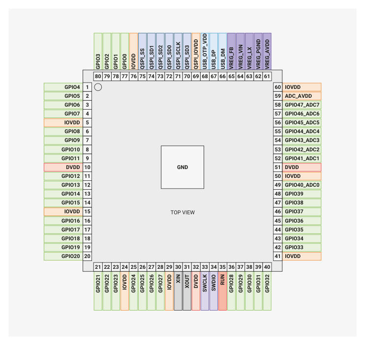

# 1.2.1. Pin locations

1.2.1. Pin locations

1.2.1.1. QFN-60 (RP2350A)

*Figure 2. RP2350 Pinout for QFN-60 7×7mm (reduced ePad size)*

1.2. Pinout reference
15

RP2350 Datasheet

1.2.1.2. QFN-80 (RP2350B)

*Figure 3. RP2350 Pinout for QFN-80 10×10mm (reduced ePad size)*

*Table 2. The function of each pin is briefly described here. Full electrical specifications can be*
