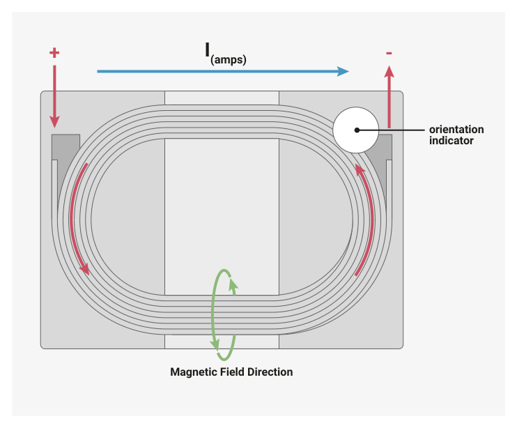

# 6.3.8. External components and PCB layout requirements

6.3.8. External components and PCB layout requirements

The most critical part of an RP2350 PCB layout is the core voltage regulator. This should be placed first on any board

design and these guidelines must be strictly followed.

6.3. Core voltage regulator
452

RP2350 Datasheet

*Figure 22. Regulator section of the Raspberry Pi Pico 2 schematic. The nets highlighted in bold show the high switching current paths*

6.3. Core voltage regulator
453

RP2350 Datasheet

*Figure 23. Regulator section of the Raspberry Pi Pico 2 PCB layout showing the high current paths for each of the regulator’s switching phases. The AOTA- B201610S3R3-101-T inductor’s case size is 0806 (2016 metric), the resistor and capacitors are 0402 (1005 metric)*

Designers should follow the above schematic Figure 22 and layout Figure 23 as closely as possible as this has had the

most verification and is considered our best practice layout. This circuit design is present on the Raspberry Pi Pico 2

and RP2350 reference design (see Hardware design with RP2350, Minimal Design Example) and both of these designs

are made available in either Cadence Allegro or Kicad formats respectively. Figure 23 shows the regulator layout on the

top layer of the Raspberry Pi Pico 2 PCB. The bottom layer under the regulator is a ground plane that connects to the

QFN GND central pad.

6.3.8.1. Layout recommendations

• VREG_AVDD is a noise sensitive signal and must be RC filtered as per Figure 22.

◦Avoid doing anything that might couple noise into VREG_AVDD.

◦CIN needs its own separate GND via / low impedance path back to the RP2350 GND pad.
• The red and green arrows in Figure 23 show the high current paths for each of the regulator’s switching phases. It

is critical keep the loop area of these current paths as small and low-impedance as possible, while also keeping

them isolated (i.e. only connect to main GND at one point).

◦Follow this layout as closely as possibly.

◦Don’t place any of CIN/LX/COUT on the opposite side of the PCB.
• Reduce parasitics on the VREG_LX node.
• On the top layer make sure to cut away any extra copper underneath the inductor, cut back copper near the VREG_LX

trace where possible.

6.3. Core voltage regulator
454

RP2350 Datasheet

◦For a multi-layer board (4 or more layers) please cut away any copper immediately underneath LX/VREG_LX

node. For example, Figure 24 illustrates this.
• The GND via placement is critical.

◦There must be a short-as-possible, low impedance GND path back to the Raspberry Pi Pico 2 QFN GND pad

from the high-current GND at one single point (using 2 adjacent vias to reduce the impedance).

◦CFILT must also have a low impedance and short-as-possible path back to the QFN GND pad (don’t share any

GND vias with the CIN/COUT high current GND).
• The VREG_FB pin should be fed from the output of COUT, avoiding routing directly underneath LX.
• COUT is critical for regulator performance and EMI. It must be placed between VREG_VIN and VREG_PGND as close to the

pins as practically possible.

◦In addition to COUT, for best performance we recommend a second 4.7μF capacitor is used on the VOUT net,

located on the bottom edge of the package (DVDD pin 23 on the QFN-60). Don’t place this near LX/COUT.

*Figure 24. Cut-out beneath LX/VREG_LX net on layer 2 of 4 (or more) layer PCBs*

6.3.8.2. Component values

• CIN should be at least 4.7μF and have a maximum parasitic resistance of 50mΩ.
• COUT must be 4.7μF ±20% with a maximum parasitic resistance of 250mΩ and a maximum inductance of 6nH.
• LX must be fully shielded, 3.3μH ±20% and with a maximum DC resistance of 250mΩ. Saturation current should be

at least 1.5A. The inductor must be marked for polarity (see Figure 25) and placed on the layout as indicated in

*Figure 23. As discussed below, we recommend the AOTA-B201610S3R3-101-T.*

6.3. Core voltage regulator
455

RP2350 Datasheet

6.3.8.3. Regulator sensitivities

The RP2350 regulator has a few sensitivities:

• The VREG_AVDD supply is noise sensitive.
• Efficiency is quite sensitive to inductance roll-off with inductor current, so an inductor with low roll-off is required

for best operation (generally the higher saturation current the better).
• Even with nominally fully shielded inductors, leakage magnetic field coupling into the loop formed by the output

VREG_LX node through the inductor and output capacitor (COUT) seems to affect the regulator control loop and output

voltage. Field orientation (and hence inductor orientation) matters - the inductor has to be the right way around to

make sure the regulator operates properly especially at higher output currents and for higher load transients. This

necessitates an inductor with marked polarity.

To meet the above requirements, Raspberry Pi have worked with Abracon to create a custom 2.0×1.6mm 3.3μH polarity-

marked inductor, part number AOTA-B201610S3R3-101-T (see Figure 25 and Figure 25). These will be available in

general distribution in time, but for now please contact Raspberry Pi to request samples / production volumes.

Raspberry Pi is still working with the regulator IP vendor to fully verify and qualify the regulator and custom inductor.

*Figure 25. AOTA- B201610S3R3-101-T inductor with orientation marking, showing current and magnetic field directions*

6.3. Core voltage regulator
456

RP2350 Datasheet

*Figure 26. Dimensions of the AOTA- B201610S3R3-101-T inductor*
