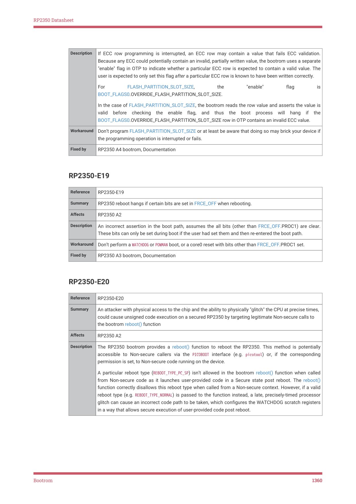

# RP2350-E20

RP2350 Datasheet

| Description | If ECC row programming is interrupted, an ECC row may contain a value that fails ECC validation.
Because any ECC could potentially contain an invalid, partially written value, the bootrom uses a separate
"enable" flag in OTP to indicate whether a particular ECC row is expected to contain a valid value. The
user is expected to only set this flag after a particular ECC row is known to have been written correctly.
For FLASH_PARTITION_SLOT_SIZE, the "enable" flag is
BOOT_FLAGS0.OVERRIDE_FLASH_PARTITION_SLOT_SIZE.
In the case of FLASH_PARTITION_SLOT_SIZE, the bootrom reads the row value and asserts the value is
valid before checking the enable flag, and thus the boot process will hang if the
BOOT_FLAGS0.OVERRIDE_FLASH_PARTITION_SLOT_SIZE row in OTP contains an invalid ECC value. |
| --- | --- |
| Workaround | Don’t program FLASH_PARTITION_SLOT_SIZE or at least be aware that doing so may brick your device if
the programming operation is interrupted or fails. |
| Fixed by | RP2350 A4 bootrom, Documentation |

RP2350-E19

| Reference | RP2350-E19 |
| --- | --- |
| Summary | RP2350 reboot hangs if certain bits are set in FRCE_OFF when rebooting. |
| Affects | RP2350 A2 |
| Description | An incorrect assertion in the boot path, assumes the all bits (other than FRCE_OFF.PROC1) are clear.
These bits can only be set during boot if the user had set them and then re-entered the boot path. |
| Workaround | Don’t perform a WATCHDOG or POWMAN boot, or a core0 reset with bits other than FRCE_OFF.PROC1 set. |
| Fixed by | RP2350 A3 bootrom, Documentation |

RP2350-E20

| Reference | RP2350-E20 |
| --- | --- |
| Summary | An attacker with physical access to the chip and the ability to physically "glitch" the CPU at precise times,
could cause unsigned code execution on a secured RP2350 by targeting legitimate Non-secure calls to
the bootrom reboot() function |
| Affects | RP2350 A2 |
| Description | The RP2350 bootrom provides a reboot() function to reboot the RP2350. This method is potentially
accessible to Non-secure callers via the PICOBOOT interface (e.g. picotool) or, if the corresponding
permission is set, to Non-secure code running on the device.
A particular reboot type (REBOOT TYPE PC SP) isn’t allowed in the bootrom reboot() function when called
_ _ _
from Non-secure code as it launches user-provided code in a Secure state post reboot. The reboot()
function correctly disallows this reboot type when called from a Non-secure context. However, if a valid
reboot type (e.g. REBOOT TYPE NORMAL) is passed to the function instead, a late, precisely-timed processor
_ _
glitch can cause an incorrect code path to be taken, which configures the WATCHDOG scratch registers
in a way that allows secure execution of user-provided code post reboot. |

Bootrom
1360
