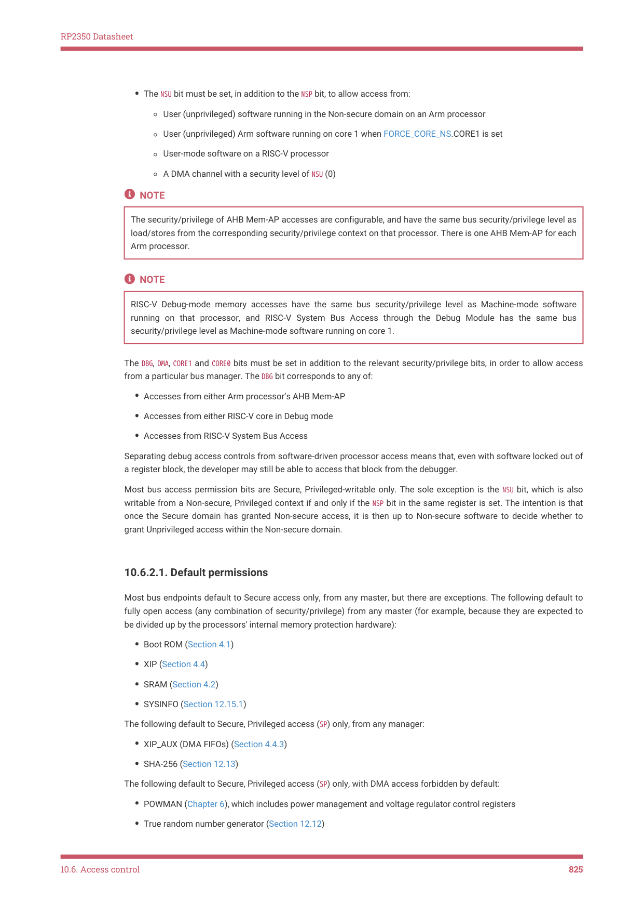

# 10.6.2. Bus access control

RP2350 Datasheet

◦If a Secure-only peripheral is selected at the time that this GPIO is made Non-secure-accessible, then the

selection will be changed to the null function.
• The relevant pad control register (Section 9.11.3 or Section 9.11.4) becomes accessible to Non-secure code.

◦Otherwise it is read-only zero.
• Interrupts for this GPIO are routed to the Non-secure GPIO interrupts, IO_IRQ_BANK0_NS and IO_IRQ_QSPI_NS, rather than

the default Secure interrupts, IO_IRQ_BANK0 and IO_IRQ_QSPI. (See Section 3.2 for the system IRQ listing.)
• The relevant GPIO interrupt control and status bits, e.g. PROC0_INTS0, become accessible to Non-secure code.

◦Otherwise they are read-only zero.
• The GPIO can be read by PIO instances which are Non-secure-accessible.

◦Otherwise it reads as zero.

◦Like the SIO, PIO can observe GPIOs even when not function-selected, so additional logic masks Secure-only

GPIOs from Non-secure-accessible PIO instances

NOTE

Due to RP2350-E3, on RP2350A (QFN-60), access to the PADS_BANK0 registers is controlled by the wrong bits of

GPIO_NSMASK. On QFN-60 you must disable Non-secure access to the pads registers, and implement a software

interface for Non-secure code to manipulate its assigned PADS registers.

10.6.2. Bus access control

The bus access control registers define which combinations of Secure/Non-secure and Privileged/Unprivileged are

permitted to access each downstream bus port. This mechanism also assigns peripherals to security domains.

Additionally, the bus access control registers define which upstream sources (processor 0/1, DMA or debugger) are

permitted.

Hardware filters on the system bus (Section 2.1) check each access against the permission list for its destination. The

filter shoots down accesses which do not meet the criteria specified in ACCESSCTRL register for that destination; the

access does not reach its destination, and instead a bus error is returned directly from the bus fabric. There is no effect

on the destination register, and no data is returned. Bus errors result in an exception on the offending processor, or an

error flag raised on the offending DMA channel.

There are 8 bits in each register (for example the ADC register). The SP, SU, NSP and NSU bits correspond to the processor

security state from which a bus transfer originated, or the security level of the originating DMA channel:

• The SP bit allows access from:

◦Privileged software running in the Secure domain on an Arm processor

◦Machine-mode software on a RISC-V processor

◦A DMA channel with a security level of SP (3)
• The SU bit must be set, in addition to the SP bit, to allow access from:

◦User (unprivileged) software running in the Secure domain on an Arm processor

◦A DMA channel with a security level of SU (2)
• The NSP bit allow access from:

◦Privileged software running in the Non-secure domain on an Arm processor

◦Privileged Arm software running in the Secure domain on core 1, when FORCE_CORE_NS.CORE1 is set

◦Machine-mode RISC-V software running on core 1, when FORCE_CORE_NS.CORE1 is set

◦A DMA channel with a security level of NSP (1)

10.6. Access control
824

RP2350 Datasheet

• The NSU bit must be set, in addition to the NSP bit, to allow access from:

◦User (unprivileged) software running in the Non-secure domain on an Arm processor

◦User (unprivileged) Arm software running on core 1 when FORCE_CORE_NS.CORE1 is set

◦User-mode software on a RISC-V processor

◦A DMA channel with a security level of NSU (0)

NOTE

The security/privilege of AHB Mem-AP accesses are configurable, and have the same bus security/privilege level as

load/stores from the corresponding security/privilege context on that processor. There is one AHB Mem-AP for each

Arm processor.

NOTE

RISC-V Debug-mode memory accesses have the same bus security/privilege level as Machine-mode software

running on that processor, and RISC-V System Bus Access through the Debug Module has the same bus

security/privilege level as Machine-mode software running on core 1.

The DBG, DMA, CORE1 and CORE0 bits must be set in addition to the relevant security/privilege bits, in order to allow access

from a particular bus manager. The DBG bit corresponds to any of:

• Accesses from either Arm processor’s AHB Mem-AP
• Accesses from either RISC-V core in Debug mode
• Accesses from RISC-V System Bus Access

Separating debug access controls from software-driven processor access means that, even with software locked out of

a register block, the developer may still be able to access that block from the debugger.

Most bus access permission bits are Secure, Privileged-writable only. The sole exception is the NSU bit, which is also

writable from a Non-secure, Privileged context if and only if the NSP bit in the same register is set. The intention is that

once the Secure domain has granted Non-secure access, it is then up to Non-secure software to decide whether to

grant Unprivileged access within the Non-secure domain.

10.6.2.1. Default permissions

Most bus endpoints default to Secure access only, from any master, but there are exceptions. The following default to

fully open access (any combination of security/privilege) from any master (for example, because they are expected to

be divided up by the processors' internal memory protection hardware):

• Boot ROM (Section 4.1)
• XIP (Section 4.4)
• SRAM (Section 4.2)
• SYSINFO (Section 12.15.1)

The following default to Secure, Privileged access (SP) only, from any manager:

• XIP_AUX (DMA FIFOs) (Section 4.4.3)
• SHA-256 (Section 12.13)

The following default to Secure, Privileged access (SP) only, with DMA access forbidden by default:

• POWMAN (Chapter 6), which includes power management and voltage regulator control registers
• True random number generator (Section 12.12)

10.6. Access control
825
