# 10.6.3. List of registers

RP2350 Datasheet

• Clock control registers (Section 8.1)
• XOSC (Section 8.2)
• ROSC (Section 8.3)
• SYSCFG (Section 12.15.2)
• PLLs (Section 8.6)
• Tick generators (Section 8.5)
• Watchdog (Section 12.9)
• PSM (Section 7.4)
• XIP control registers (Section 4.4.5)
• QMI (Section 12.14)
• CoreSight trace DMA FIFO
• CoreSight self-hosted debug window

Any bus endpoint not in any of the above lists defaults to Secure access only, from any manager,

10.6.2.2. Other effects of bus permissions

To avoid contradictory configurations such as a Secure-only peripheral being selected on a Non-secure-accessible

GPIO, and to improve portability between Secure and Non-secure software, the bus access permission lists propagate

to certain other system-level hardware:

• The reset controls for a given peripheral in the RESETS block (Section 7.5) are Non-secure-accessible if and only if

the peripheral itself is Non-secure-accessible.

◦Non-secure access to the RESETS block itself must also be granted via the RESETS bus access register.
• Non-secure-inaccessible peripherals cannot be function-selected on Non-secure-accessible GPIOs. Attempting to

do so selects the null GPIO function (0x1f).
• PIO blocks which are accessible to Non-secure, and those which are not, can not perform cross-PIO operations

such as observing each other’s interrupt flags.
• PIO blocks which are accessible to Non-secure can not read Secure-only GPIOs.
• DMA channels below the least-set effective permission bit (ignoring SU when SP is clear, and ignoring NSU when NSP

is clear) are disconnected from that peripheral’s DREQ signals.

10.6.2.3. Blocks without bus access control

There are four memory-mapped blocks which do not have bus access control registers in ACCESSCTRL:

• The Cortex-M PPB is internal to the processors, and is banked internally over Secure/Non-secure.
• The SIO is also banked internally over Secure/Non-secure access.
• ACCESSCTRL itself is always world-readable and has its own internal filtering for writes.
• Boot RAM is hardwired for Secure access only.

10.6.3. List of registers

The ACCESSCTRL registers start at a base address of 0x40060000 (defined as ACCESSCTRL_BASE in the SDK).

10.6. Access control
826

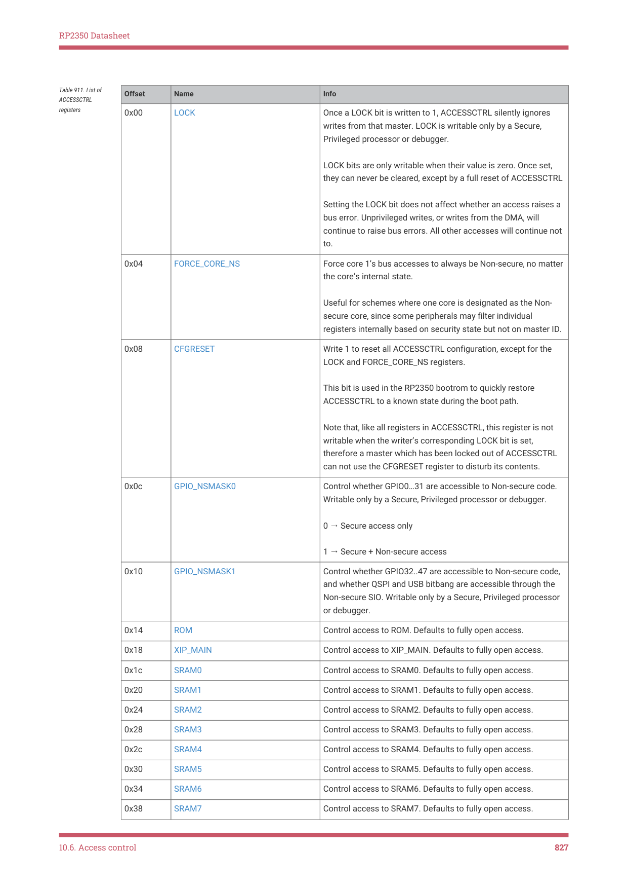

RP2350 Datasheet

| Offset | Name | Info |
| --- | --- | --- |
| 0x00 | LOCK | Once a LOCK bit is written to 1, ACCESSCTRL silently ignores
writes from that master. LOCK is writable only by a Secure,
Privileged processor or debugger.
LOCK bits are only writable when their value is zero. Once set,
they can never be cleared, except by a full reset of ACCESSCTRL
Setting the LOCK bit does not affect whether an access raises a
bus error. Unprivileged writes, or writes from the DMA, will
continue to raise bus errors. All other accesses will continue not
to. |
| 0x04 | FORCE_CORE_NS | Force core 1’s bus accesses to always be Non-secure, no matter
the core’s internal state.
Useful for schemes where one core is designated as the Non-
secure core, since some peripherals may filter individual
registers internally based on security state but not on master ID. |
| 0x08 | CFGRESET | Write 1 to reset all ACCESSCTRL configuration, except for the
LOCK and FORCE_CORE_NS registers.
This bit is used in the RP2350 bootrom to quickly restore
ACCESSCTRL to a known state during the boot path.
Note that, like all registers in ACCESSCTRL, this register is not
writable when the writer’s corresponding LOCK bit is set,
therefore a master which has been locked out of ACCESSCTRL
can not use the CFGRESET register to disturb its contents. |
| 0x0c | GPIO_NSMASK0 | Control whether GPIO0…31 are accessible to Non-secure code.
Writable only by a Secure, Privileged processor or debugger.
0 → Secure access only
1 → Secure + Non-secure access |
| 0x10 | GPIO_NSMASK1 | Control whether GPIO32..47 are accessible to Non-secure code,
and whether QSPI and USB bitbang are accessible through the
Non-secure SIO. Writable only by a Secure, Privileged processor
or debugger. |
| 0x14 | ROM | Control access to ROM. Defaults to fully open access. |
| 0x18 | XIP_MAIN | Control access to XIP_MAIN. Defaults to fully open access. |
| 0x1c | SRAM0 | Control access to SRAM0. Defaults to fully open access. |
| 0x20 | SRAM1 | Control access to SRAM1. Defaults to fully open access. |
| 0x24 | SRAM2 | Control access to SRAM2. Defaults to fully open access. |
| 0x28 | SRAM3 | Control access to SRAM3. Defaults to fully open access. |
| 0x2c | SRAM4 | Control access to SRAM4. Defaults to fully open access. |
| 0x30 | SRAM5 | Control access to SRAM5. Defaults to fully open access. |
| 0x34 | SRAM6 | Control access to SRAM6. Defaults to fully open access. |
| 0x38 | SRAM7 | Control access to SRAM7. Defaults to fully open access. |

Table 911. List of

ACCESSCTRL

registers

10.6. Access control
827

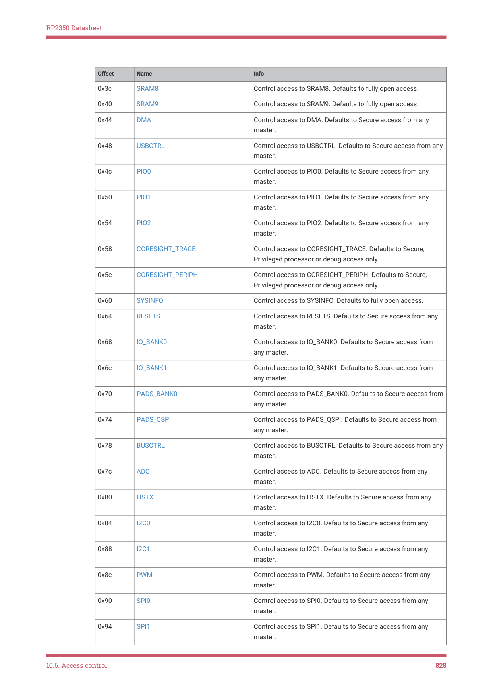

RP2350 Datasheet

| Offset | Name | Info |
| --- | --- | --- |
| 0x3c | SRAM8 | Control access to SRAM8. Defaults to fully open access. |
| 0x40 | SRAM9 | Control access to SRAM9. Defaults to fully open access. |
| 0x44 | DMA | Control access to DMA. Defaults to Secure access from any
master. |
| 0x48 | USBCTRL | Control access to USBCTRL. Defaults to Secure access from any
master. |
| 0x4c | PIO0 | Control access to PIO0. Defaults to Secure access from any
master. |
| 0x50 | PIO1 | Control access to PIO1. Defaults to Secure access from any
master. |
| 0x54 | PIO2 | Control access to PIO2. Defaults to Secure access from any
master. |
| 0x58 | CORESIGHT_TRACE | Control access to CORESIGHT_TRACE. Defaults to Secure,
Privileged processor or debug access only. |
| 0x5c | CORESIGHT_PERIPH | Control access to CORESIGHT_PERIPH. Defaults to Secure,
Privileged processor or debug access only. |
| 0x60 | SYSINFO | Control access to SYSINFO. Defaults to fully open access. |
| 0x64 | RESETS | Control access to RESETS. Defaults to Secure access from any
master. |
| 0x68 | IO_BANK0 | Control access to IO_BANK0. Defaults to Secure access from
any master. |
| 0x6c | IO_BANK1 | Control access to IO_BANK1. Defaults to Secure access from
any master. |
| 0x70 | PADS_BANK0 | Control access to PADS_BANK0. Defaults to Secure access from
any master. |
| 0x74 | PADS_QSPI | Control access to PADS_QSPI. Defaults to Secure access from
any master. |
| 0x78 | BUSCTRL | Control access to BUSCTRL. Defaults to Secure access from any
master. |
| 0x7c | ADC | Control access to ADC. Defaults to Secure access from any
master. |
| 0x80 | HSTX | Control access to HSTX. Defaults to Secure access from any
master. |
| 0x84 | I2C0 | Control access to I2C0. Defaults to Secure access from any
master. |
| 0x88 | I2C1 | Control access to I2C1. Defaults to Secure access from any
master. |
| 0x8c | PWM | Control access to PWM. Defaults to Secure access from any
master. |
| 0x90 | SPI0 | Control access to SPI0. Defaults to Secure access from any
master. |
| 0x94 | SPI1 | Control access to SPI1. Defaults to Secure access from any
master. |

10.6. Access control
828

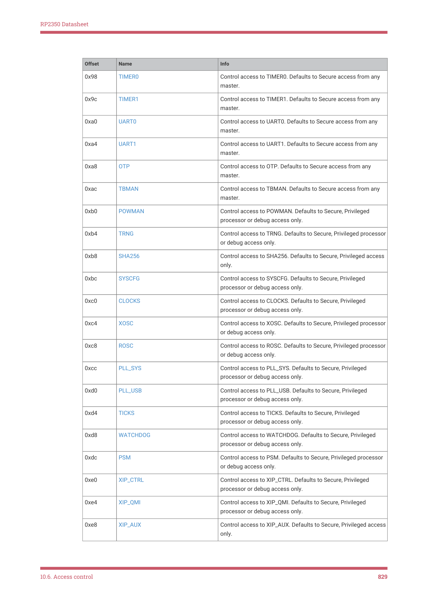

RP2350 Datasheet

| Offset | Name | Info |
| --- | --- | --- |
| 0x98 | TIMER0 | Control access to TIMER0. Defaults to Secure access from any
master. |
| 0x9c | TIMER1 | Control access to TIMER1. Defaults to Secure access from any
master. |
| 0xa0 | UART0 | Control access to UART0. Defaults to Secure access from any
master. |
| 0xa4 | UART1 | Control access to UART1. Defaults to Secure access from any
master. |
| 0xa8 | OTP | Control access to OTP. Defaults to Secure access from any
master. |
| 0xac | TBMAN | Control access to TBMAN. Defaults to Secure access from any
master. |
| 0xb0 | POWMAN | Control access to POWMAN. Defaults to Secure, Privileged
processor or debug access only. |
| 0xb4 | TRNG | Control access to TRNG. Defaults to Secure, Privileged processor
or debug access only. |
| 0xb8 | SHA256 | Control access to SHA256. Defaults to Secure, Privileged access
only. |
| 0xbc | SYSCFG | Control access to SYSCFG. Defaults to Secure, Privileged
processor or debug access only. |
| 0xc0 | CLOCKS | Control access to CLOCKS. Defaults to Secure, Privileged
processor or debug access only. |
| 0xc4 | XOSC | Control access to XOSC. Defaults to Secure, Privileged processor
or debug access only. |
| 0xc8 | ROSC | Control access to ROSC. Defaults to Secure, Privileged processor
or debug access only. |
| 0xcc | PLL_SYS | Control access to PLL_SYS. Defaults to Secure, Privileged
processor or debug access only. |
| 0xd0 | PLL_USB | Control access to PLL_USB. Defaults to Secure, Privileged
processor or debug access only. |
| 0xd4 | TICKS | Control access to TICKS. Defaults to Secure, Privileged
processor or debug access only. |
| 0xd8 | WATCHDOG | Control access to WATCHDOG. Defaults to Secure, Privileged
processor or debug access only. |
| 0xdc | PSM | Control access to PSM. Defaults to Secure, Privileged processor
or debug access only. |
| 0xe0 | XIP_CTRL | Control access to XIP_CTRL. Defaults to Secure, Privileged
processor or debug access only. |
| 0xe4 | XIP_QMI | Control access to XIP_QMI. Defaults to Secure, Privileged
processor or debug access only. |
| 0xe8 | XIP_AUX | Control access to XIP_AUX. Defaults to Secure, Privileged access
only. |

10.6. Access control
829

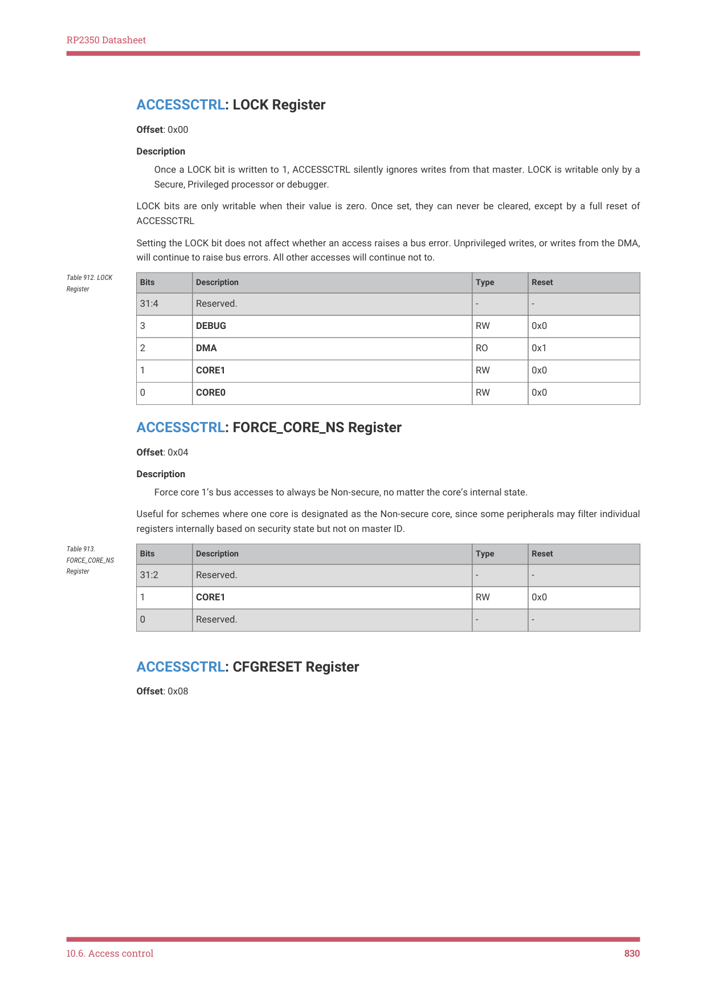

RP2350 Datasheet

ACCESSCTRL: LOCK Register

Offset: 0x00

Description

Once a LOCK bit is written to 1, ACCESSCTRL silently ignores writes from that master. LOCK is writable only by a

Secure, Privileged processor or debugger.

LOCK bits are only writable when their value is zero. Once set, they can never be cleared, except by a full reset of

ACCESSCTRL

Setting the LOCK bit does not affect whether an access raises a bus error. Unprivileged writes, or writes from the DMA,

will continue to raise bus errors. All other accesses will continue not to.

| Bits | Description | Type | Reset |
| --- | --- | --- | --- |
| 31:4 | Reserved. | - | - |
| 3 | DEBUG | RW | 0x0 |
| 2 | DMA | RO | 0x1 |
| 1 | CORE1 | RW | 0x0 |
| 0 | CORE0 | RW | 0x0 |

Table 912. LOCK

ACCESSCTRL: FORCE_CORE_NS Register

Offset: 0x04

Description

Force core 1’s bus accesses to always be Non-secure, no matter the core’s internal state.

Useful for schemes where one core is designated as the Non-secure core, since some peripherals may filter individual

registers internally based on security state but not on master ID.

| Bits | Description | Type | Reset |
| --- | --- | --- | --- |
| 31:2 | Reserved. | - | - |
| 1 | CORE1 | RW | 0x0 |
| 0 | Reserved. | - | - |

Table 913.

FORCE_CORE_NS

Register

ACCESSCTRL: CFGRESET Register

Offset: 0x08

10.6. Access control
830

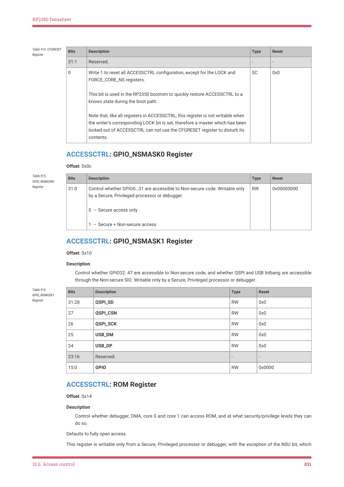

RP2350 Datasheet

| Bits | Description | Type | Reset |
| --- | --- | --- | --- |
| 31:1 | Reserved. | - | - |
| 0 | Write 1 to reset all ACCESSCTRL configuration, except for the LOCK and
FORCE_CORE_NS registers.
This bit is used in the RP2350 bootrom to quickly restore ACCESSCTRL to a
known state during the boot path.
Note that, like all registers in ACCESSCTRL, this register is not writable when
the writer’s corresponding LOCK bit is set, therefore a master which has been
locked out of ACCESSCTRL can not use the CFGRESET register to disturb its
contents. | SC | 0x0 |

Table 914. CFGRESET

ACCESSCTRL: GPIO_NSMASK0 Register

Offset: 0x0c

| Bits | Description | Type | Reset |
| --- | --- | --- | --- |
| 31:0 | Control whether GPIO0…31 are accessible to Non-secure code. Writable only
by a Secure, Privileged processor or debugger.
0 → Secure access only
1 → Secure + Non-secure access | RW | 0x00000000 |

Table 915.

GPIO_NSMASK0

Register

ACCESSCTRL: GPIO_NSMASK1 Register

Offset: 0x10

Description

Control whether GPIO32..47 are accessible to Non-secure code, and whether QSPI and USB bitbang are accessible

through the Non-secure SIO. Writable only by a Secure, Privileged processor or debugger.

| Bits | Description | Type | Reset |
| --- | --- | --- | --- |
| 31:28 | QSPI_SD | RW | 0x0 |
| 27 | QSPI_CSN | RW | 0x0 |
| 26 | QSPI_SCK | RW | 0x0 |
| 25 | USB_DM | RW | 0x0 |
| 24 | USB_DP | RW | 0x0 |
| 23:16 | Reserved. | - | - |
| 15:0 | GPIO | RW | 0x0000 |

Table 916.

GPIO_NSMASK1

Register

ACCESSCTRL: ROM Register

Offset: 0x14

Description

Control whether debugger, DMA, core 0 and core 1 can access ROM, and at what security/privilege levels they can

do so.

Defaults to fully open access.

This register is writable only from a Secure, Privileged processor or debugger, with the exception of the NSU bit, which

10.6. Access control
831

RP2350 Datasheet

becomes Non-secure-Privileged-writable when the NSP bit is set.

| Bits | Description | Type | Reset |
| --- | --- | --- | --- |
| 31:8 | Reserved. | - | - |
| 7 | DBG: If 1, ROM can be accessed by the debugger, at security/privilege levels
permitted by SP/NSP/SU/NSU in this register. | RW | 0x1 |
| 6 | DMA: If 1, ROM can be accessed by the DMA, at security/privilege levels
permitted by SP/NSP/SU/NSU in this register. | RW | 0x1 |
| 5 | CORE1: If 1, ROM can be accessed by core 1, at security/privilege levels
permitted by SP/NSP/SU/NSU in this register. | RW | 0x1 |
| 4 | CORE0: If 1, ROM can be accessed by core 0, at security/privilege levels
permitted by SP/NSP/SU/NSU in this register. | RW | 0x1 |
| 3 | SP: If 1, ROM can be accessed from a Secure, Privileged context. | RW | 0x1 |
| 2 | SU: If 1, and SP is also set, ROM can be accessed from a Secure, Unprivileged
context. | RW | 0x1 |
| 1 | NSP: If 1, ROM can be accessed from a Non-secure, Privileged context. | RW | 0x1 |
| 0 | NSU: If 1, and NSP is also set, ROM can be accessed from a Non-secure,
Unprivileged context.
This bit is writable from a Non-secure, Privileged context, if and only if the NSP
bit is set. | RW | 0x1 |

Table 917. ROM

ACCESSCTRL: XIP_MAIN Register

Offset: 0x18

Description

Control whether debugger, DMA, core 0 and core 1 can access XIP_MAIN, and at what security/privilege levels they

can do so.

Defaults to fully open access.

This register is writable only from a Secure, Privileged processor or debugger, with the exception of the NSU bit, which

becomes Non-secure-Privileged-writable when the NSP bit is set.

| Bits | Description | Type | Reset |
| --- | --- | --- | --- |
| 31:8 | Reserved. | - | - |
| 7 | DBG: If 1, XIP_MAIN can be accessed by the debugger, at security/privilege
levels permitted by SP/NSP/SU/NSU in this register. | RW | 0x1 |
| 6 | DMA: If 1, XIP_MAIN can be accessed by the DMA, at security/privilege levels
permitted by SP/NSP/SU/NSU in this register. | RW | 0x1 |
| 5 | CORE1: If 1, XIP_MAIN can be accessed by core 1, at security/privilege levels
permitted by SP/NSP/SU/NSU in this register. | RW | 0x1 |
| 4 | CORE0: If 1, XIP_MAIN can be accessed by core 0, at security/privilege levels
permitted by SP/NSP/SU/NSU in this register. | RW | 0x1 |
| 3 | SP: If 1, XIP_MAIN can be accessed from a Secure, Privileged context. | RW | 0x1 |
| 2 | SU: If 1, and SP is also set, XIP_MAIN can be accessed from a Secure,
Unprivileged context. | RW | 0x1 |
| 1 | NSP: If 1, XIP_MAIN can be accessed from a Non-secure, Privileged context. | RW | 0x1 |

Table 918. XIP_MAIN

10.6. Access control
832

RP2350 Datasheet

| Bits | Description | Type | Reset |
| --- | --- | --- | --- |
| 0 | NSU: If 1, and NSP is also set, XIP_MAIN can be accessed from a Non-secure,
Unprivileged context.
This bit is writable from a Non-secure, Privileged context, if and only if the NSP
bit is set. | RW | 0x1 |

ACCESSCTRL: SRAM0 Register

Offset: 0x1c

Description

Control whether debugger, DMA, core 0 and core 1 can access SRAM0, and at what security/privilege levels they

can do so.

Defaults to fully open access.

This register is writable only from a Secure, Privileged processor or debugger, with the exception of the NSU bit, which

becomes Non-secure-Privileged-writable when the NSP bit is set.

| Bits | Description | Type | Reset |
| --- | --- | --- | --- |
| 31:8 | Reserved. | - | - |
| 7 | DBG: If 1, SRAM0 can be accessed by the debugger, at security/privilege levels
permitted by SP/NSP/SU/NSU in this register. | RW | 0x1 |
| 6 | DMA: If 1, SRAM0 can be accessed by the DMA, at security/privilege levels
permitted by SP/NSP/SU/NSU in this register. | RW | 0x1 |
| 5 | CORE1: If 1, SRAM0 can be accessed by core 1, at security/privilege levels
permitted by SP/NSP/SU/NSU in this register. | RW | 0x1 |
| 4 | CORE0: If 1, SRAM0 can be accessed by core 0, at security/privilege levels
permitted by SP/NSP/SU/NSU in this register. | RW | 0x1 |
| 3 | SP: If 1, SRAM0 can be accessed from a Secure, Privileged context. | RW | 0x1 |
| 2 | SU: If 1, and SP is also set, SRAM0 can be accessed from a Secure,
Unprivileged context. | RW | 0x1 |
| 1 | NSP: If 1, SRAM0 can be accessed from a Non-secure, Privileged context. | RW | 0x1 |
| 0 | NSU: If 1, and NSP is also set, SRAM0 can be accessed from a Non-secure,
Unprivileged context.
This bit is writable from a Non-secure, Privileged context, if and only if the NSP
bit is set. | RW | 0x1 |

Table 919. SRAM0

ACCESSCTRL: SRAM1 Register

Offset: 0x20

Description

Control whether debugger, DMA, core 0 and core 1 can access SRAM1, and at what security/privilege levels they

can do so.

Defaults to fully open access.

This register is writable only from a Secure, Privileged processor or debugger, with the exception of the NSU bit, which

becomes Non-secure-Privileged-writable when the NSP bit is set.

10.6. Access control
833

RP2350 Datasheet

| Bits | Description | Type | Reset |
| --- | --- | --- | --- |
| 31:8 | Reserved. | - | - |
| 7 | DBG: If 1, SRAM1 can be accessed by the debugger, at security/privilege levels
permitted by SP/NSP/SU/NSU in this register. | RW | 0x1 |
| 6 | DMA: If 1, SRAM1 can be accessed by the DMA, at security/privilege levels
permitted by SP/NSP/SU/NSU in this register. | RW | 0x1 |
| 5 | CORE1: If 1, SRAM1 can be accessed by core 1, at security/privilege levels
permitted by SP/NSP/SU/NSU in this register. | RW | 0x1 |
| 4 | CORE0: If 1, SRAM1 can be accessed by core 0, at security/privilege levels
permitted by SP/NSP/SU/NSU in this register. | RW | 0x1 |
| 3 | SP: If 1, SRAM1 can be accessed from a Secure, Privileged context. | RW | 0x1 |
| 2 | SU: If 1, and SP is also set, SRAM1 can be accessed from a Secure,
Unprivileged context. | RW | 0x1 |
| 1 | NSP: If 1, SRAM1 can be accessed from a Non-secure, Privileged context. | RW | 0x1 |
| 0 | NSU: If 1, and NSP is also set, SRAM1 can be accessed from a Non-secure,
Unprivileged context.
This bit is writable from a Non-secure, Privileged context, if and only if the NSP
bit is set. | RW | 0x1 |

Table 920. SRAM1

ACCESSCTRL: SRAM2 Register

Offset: 0x24

Description

Control whether debugger, DMA, core 0 and core 1 can access SRAM2, and at what security/privilege levels they

can do so.

Defaults to fully open access.

This register is writable only from a Secure, Privileged processor or debugger, with the exception of the NSU bit, which

becomes Non-secure-Privileged-writable when the NSP bit is set.

| Bits | Description | Type | Reset |
| --- | --- | --- | --- |
| 31:8 | Reserved. | - | - |
| 7 | DBG: If 1, SRAM2 can be accessed by the debugger, at security/privilege levels
permitted by SP/NSP/SU/NSU in this register. | RW | 0x1 |
| 6 | DMA: If 1, SRAM2 can be accessed by the DMA, at security/privilege levels
permitted by SP/NSP/SU/NSU in this register. | RW | 0x1 |
| 5 | CORE1: If 1, SRAM2 can be accessed by core 1, at security/privilege levels
permitted by SP/NSP/SU/NSU in this register. | RW | 0x1 |
| 4 | CORE0: If 1, SRAM2 can be accessed by core 0, at security/privilege levels
permitted by SP/NSP/SU/NSU in this register. | RW | 0x1 |
| 3 | SP: If 1, SRAM2 can be accessed from a Secure, Privileged context. | RW | 0x1 |
| 2 | SU: If 1, and SP is also set, SRAM2 can be accessed from a Secure,
Unprivileged context. | RW | 0x1 |
| 1 | NSP: If 1, SRAM2 can be accessed from a Non-secure, Privileged context. | RW | 0x1 |

Table 921. SRAM2

10.6. Access control
834

RP2350 Datasheet

| Bits | Description | Type | Reset |
| --- | --- | --- | --- |
| 0 | NSU: If 1, and NSP is also set, SRAM2 can be accessed from a Non-secure,
Unprivileged context.
This bit is writable from a Non-secure, Privileged context, if and only if the NSP
bit is set. | RW | 0x1 |

ACCESSCTRL: SRAM3 Register

Offset: 0x28

Description

Control whether debugger, DMA, core 0 and core 1 can access SRAM3, and at what security/privilege levels they

can do so.

Defaults to fully open access.

This register is writable only from a Secure, Privileged processor or debugger, with the exception of the NSU bit, which

becomes Non-secure-Privileged-writable when the NSP bit is set.

| Bits | Description | Type | Reset |
| --- | --- | --- | --- |
| 31:8 | Reserved. | - | - |
| 7 | DBG: If 1, SRAM3 can be accessed by the debugger, at security/privilege levels
permitted by SP/NSP/SU/NSU in this register. | RW | 0x1 |
| 6 | DMA: If 1, SRAM3 can be accessed by the DMA, at security/privilege levels
permitted by SP/NSP/SU/NSU in this register. | RW | 0x1 |
| 5 | CORE1: If 1, SRAM3 can be accessed by core 1, at security/privilege levels
permitted by SP/NSP/SU/NSU in this register. | RW | 0x1 |
| 4 | CORE0: If 1, SRAM3 can be accessed by core 0, at security/privilege levels
permitted by SP/NSP/SU/NSU in this register. | RW | 0x1 |
| 3 | SP: If 1, SRAM3 can be accessed from a Secure, Privileged context. | RW | 0x1 |
| 2 | SU: If 1, and SP is also set, SRAM3 can be accessed from a Secure,
Unprivileged context. | RW | 0x1 |
| 1 | NSP: If 1, SRAM3 can be accessed from a Non-secure, Privileged context. | RW | 0x1 |
| 0 | NSU: If 1, and NSP is also set, SRAM3 can be accessed from a Non-secure,
Unprivileged context.
This bit is writable from a Non-secure, Privileged context, if and only if the NSP
bit is set. | RW | 0x1 |

Table 922. SRAM3

ACCESSCTRL: SRAM4 Register

Offset: 0x2c

Description

Control whether debugger, DMA, core 0 and core 1 can access SRAM4, and at what security/privilege levels they

can do so.

Defaults to fully open access.

This register is writable only from a Secure, Privileged processor or debugger, with the exception of the NSU bit, which

becomes Non-secure-Privileged-writable when the NSP bit is set.

10.6. Access control
835

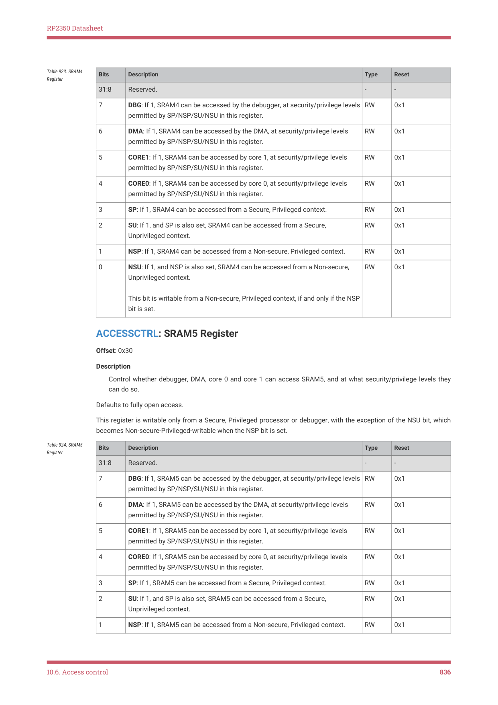

RP2350 Datasheet

| Bits | Description | Type | Reset |
| --- | --- | --- | --- |
| 31:8 | Reserved. | - | - |
| 7 | DBG: If 1, SRAM4 can be accessed by the debugger, at security/privilege levels
permitted by SP/NSP/SU/NSU in this register. | RW | 0x1 |
| 6 | DMA: If 1, SRAM4 can be accessed by the DMA, at security/privilege levels
permitted by SP/NSP/SU/NSU in this register. | RW | 0x1 |
| 5 | CORE1: If 1, SRAM4 can be accessed by core 1, at security/privilege levels
permitted by SP/NSP/SU/NSU in this register. | RW | 0x1 |
| 4 | CORE0: If 1, SRAM4 can be accessed by core 0, at security/privilege levels
permitted by SP/NSP/SU/NSU in this register. | RW | 0x1 |
| 3 | SP: If 1, SRAM4 can be accessed from a Secure, Privileged context. | RW | 0x1 |
| 2 | SU: If 1, and SP is also set, SRAM4 can be accessed from a Secure,
Unprivileged context. | RW | 0x1 |
| 1 | NSP: If 1, SRAM4 can be accessed from a Non-secure, Privileged context. | RW | 0x1 |
| 0 | NSU: If 1, and NSP is also set, SRAM4 can be accessed from a Non-secure,
Unprivileged context.
This bit is writable from a Non-secure, Privileged context, if and only if the NSP
bit is set. | RW | 0x1 |

Table 923. SRAM4

ACCESSCTRL: SRAM5 Register

Offset: 0x30

Description

Control whether debugger, DMA, core 0 and core 1 can access SRAM5, and at what security/privilege levels they

can do so.

Defaults to fully open access.

This register is writable only from a Secure, Privileged processor or debugger, with the exception of the NSU bit, which

becomes Non-secure-Privileged-writable when the NSP bit is set.

| Bits | Description | Type | Reset |
| --- | --- | --- | --- |
| 31:8 | Reserved. | - | - |
| 7 | DBG: If 1, SRAM5 can be accessed by the debugger, at security/privilege levels
permitted by SP/NSP/SU/NSU in this register. | RW | 0x1 |
| 6 | DMA: If 1, SRAM5 can be accessed by the DMA, at security/privilege levels
permitted by SP/NSP/SU/NSU in this register. | RW | 0x1 |
| 5 | CORE1: If 1, SRAM5 can be accessed by core 1, at security/privilege levels
permitted by SP/NSP/SU/NSU in this register. | RW | 0x1 |
| 4 | CORE0: If 1, SRAM5 can be accessed by core 0, at security/privilege levels
permitted by SP/NSP/SU/NSU in this register. | RW | 0x1 |
| 3 | SP: If 1, SRAM5 can be accessed from a Secure, Privileged context. | RW | 0x1 |
| 2 | SU: If 1, and SP is also set, SRAM5 can be accessed from a Secure,
Unprivileged context. | RW | 0x1 |
| 1 | NSP: If 1, SRAM5 can be accessed from a Non-secure, Privileged context. | RW | 0x1 |

Table 924. SRAM5

10.6. Access control
836

RP2350 Datasheet

| Bits | Description | Type | Reset |
| --- | --- | --- | --- |
| 0 | NSU: If 1, and NSP is also set, SRAM5 can be accessed from a Non-secure,
Unprivileged context.
This bit is writable from a Non-secure, Privileged context, if and only if the NSP
bit is set. | RW | 0x1 |

ACCESSCTRL: SRAM6 Register

Offset: 0x34

Description

Control whether debugger, DMA, core 0 and core 1 can access SRAM6, and at what security/privilege levels they

can do so.

Defaults to fully open access.

This register is writable only from a Secure, Privileged processor or debugger, with the exception of the NSU bit, which

becomes Non-secure-Privileged-writable when the NSP bit is set.

| Bits | Description | Type | Reset |
| --- | --- | --- | --- |
| 31:8 | Reserved. | - | - |
| 7 | DBG: If 1, SRAM6 can be accessed by the debugger, at security/privilege levels
permitted by SP/NSP/SU/NSU in this register. | RW | 0x1 |
| 6 | DMA: If 1, SRAM6 can be accessed by the DMA, at security/privilege levels
permitted by SP/NSP/SU/NSU in this register. | RW | 0x1 |
| 5 | CORE1: If 1, SRAM6 can be accessed by core 1, at security/privilege levels
permitted by SP/NSP/SU/NSU in this register. | RW | 0x1 |
| 4 | CORE0: If 1, SRAM6 can be accessed by core 0, at security/privilege levels
permitted by SP/NSP/SU/NSU in this register. | RW | 0x1 |
| 3 | SP: If 1, SRAM6 can be accessed from a Secure, Privileged context. | RW | 0x1 |
| 2 | SU: If 1, and SP is also set, SRAM6 can be accessed from a Secure,
Unprivileged context. | RW | 0x1 |
| 1 | NSP: If 1, SRAM6 can be accessed from a Non-secure, Privileged context. | RW | 0x1 |
| 0 | NSU: If 1, and NSP is also set, SRAM6 can be accessed from a Non-secure,
Unprivileged context.
This bit is writable from a Non-secure, Privileged context, if and only if the NSP
bit is set. | RW | 0x1 |

Table 925. SRAM6

ACCESSCTRL: SRAM7 Register

Offset: 0x38

Description

Control whether debugger, DMA, core 0 and core 1 can access SRAM7, and at what security/privilege levels they

can do so.

Defaults to fully open access.

This register is writable only from a Secure, Privileged processor or debugger, with the exception of the NSU bit, which

becomes Non-secure-Privileged-writable when the NSP bit is set.

10.6. Access control
837

RP2350 Datasheet

| Bits | Description | Type | Reset |
| --- | --- | --- | --- |
| 31:8 | Reserved. | - | - |
| 7 | DBG: If 1, SRAM7 can be accessed by the debugger, at security/privilege levels
permitted by SP/NSP/SU/NSU in this register. | RW | 0x1 |
| 6 | DMA: If 1, SRAM7 can be accessed by the DMA, at security/privilege levels
permitted by SP/NSP/SU/NSU in this register. | RW | 0x1 |
| 5 | CORE1: If 1, SRAM7 can be accessed by core 1, at security/privilege levels
permitted by SP/NSP/SU/NSU in this register. | RW | 0x1 |
| 4 | CORE0: If 1, SRAM7 can be accessed by core 0, at security/privilege levels
permitted by SP/NSP/SU/NSU in this register. | RW | 0x1 |
| 3 | SP: If 1, SRAM7 can be accessed from a Secure, Privileged context. | RW | 0x1 |
| 2 | SU: If 1, and SP is also set, SRAM7 can be accessed from a Secure,
Unprivileged context. | RW | 0x1 |
| 1 | NSP: If 1, SRAM7 can be accessed from a Non-secure, Privileged context. | RW | 0x1 |
| 0 | NSU: If 1, and NSP is also set, SRAM7 can be accessed from a Non-secure,
Unprivileged context.
This bit is writable from a Non-secure, Privileged context, if and only if the NSP
bit is set. | RW | 0x1 |

Table 926. SRAM7

ACCESSCTRL: SRAM8 Register

Offset: 0x3c

Description

Control whether debugger, DMA, core 0 and core 1 can access SRAM8, and at what security/privilege levels they

can do so.

Defaults to fully open access.

This register is writable only from a Secure, Privileged processor or debugger, with the exception of the NSU bit, which

becomes Non-secure-Privileged-writable when the NSP bit is set.

| Bits | Description | Type | Reset |
| --- | --- | --- | --- |
| 31:8 | Reserved. | - | - |
| 7 | DBG: If 1, SRAM8 can be accessed by the debugger, at security/privilege levels
permitted by SP/NSP/SU/NSU in this register. | RW | 0x1 |
| 6 | DMA: If 1, SRAM8 can be accessed by the DMA, at security/privilege levels
permitted by SP/NSP/SU/NSU in this register. | RW | 0x1 |
| 5 | CORE1: If 1, SRAM8 can be accessed by core 1, at security/privilege levels
permitted by SP/NSP/SU/NSU in this register. | RW | 0x1 |
| 4 | CORE0: If 1, SRAM8 can be accessed by core 0, at security/privilege levels
permitted by SP/NSP/SU/NSU in this register. | RW | 0x1 |
| 3 | SP: If 1, SRAM8 can be accessed from a Secure, Privileged context. | RW | 0x1 |
| 2 | SU: If 1, and SP is also set, SRAM8 can be accessed from a Secure,
Unprivileged context. | RW | 0x1 |
| 1 | NSP: If 1, SRAM8 can be accessed from a Non-secure, Privileged context. | RW | 0x1 |

Table 927. SRAM8

10.6. Access control
838

RP2350 Datasheet

| Bits | Description | Type | Reset |
| --- | --- | --- | --- |
| 0 | NSU: If 1, and NSP is also set, SRAM8 can be accessed from a Non-secure,
Unprivileged context.
This bit is writable from a Non-secure, Privileged context, if and only if the NSP
bit is set. | RW | 0x1 |

ACCESSCTRL: SRAM9 Register

Offset: 0x40

Description

Control whether debugger, DMA, core 0 and core 1 can access SRAM9, and at what security/privilege levels they

can do so.

Defaults to fully open access.

This register is writable only from a Secure, Privileged processor or debugger, with the exception of the NSU bit, which

becomes Non-secure-Privileged-writable when the NSP bit is set.

| Bits | Description | Type | Reset |
| --- | --- | --- | --- |
| 31:8 | Reserved. | - | - |
| 7 | DBG: If 1, SRAM9 can be accessed by the debugger, at security/privilege levels
permitted by SP/NSP/SU/NSU in this register. | RW | 0x1 |
| 6 | DMA: If 1, SRAM9 can be accessed by the DMA, at security/privilege levels
permitted by SP/NSP/SU/NSU in this register. | RW | 0x1 |
| 5 | CORE1: If 1, SRAM9 can be accessed by core 1, at security/privilege levels
permitted by SP/NSP/SU/NSU in this register. | RW | 0x1 |
| 4 | CORE0: If 1, SRAM9 can be accessed by core 0, at security/privilege levels
permitted by SP/NSP/SU/NSU in this register. | RW | 0x1 |
| 3 | SP: If 1, SRAM9 can be accessed from a Secure, Privileged context. | RW | 0x1 |
| 2 | SU: If 1, and SP is also set, SRAM9 can be accessed from a Secure,
Unprivileged context. | RW | 0x1 |
| 1 | NSP: If 1, SRAM9 can be accessed from a Non-secure, Privileged context. | RW | 0x1 |
| 0 | NSU: If 1, and NSP is also set, SRAM9 can be accessed from a Non-secure,
Unprivileged context.
This bit is writable from a Non-secure, Privileged context, if and only if the NSP
bit is set. | RW | 0x1 |

Table 928. SRAM9

ACCESSCTRL: DMA Register

Offset: 0x44

Description

Control whether debugger, DMA, core 0 and core 1 can access DMA, and at what security/privilege levels they can

do so.

Defaults to Secure access from any master.

This register is writable only from a Secure, Privileged processor or debugger, with the exception of the NSU bit, which

becomes Non-secure-Privileged-writable when the NSP bit is set.

10.6. Access control
839

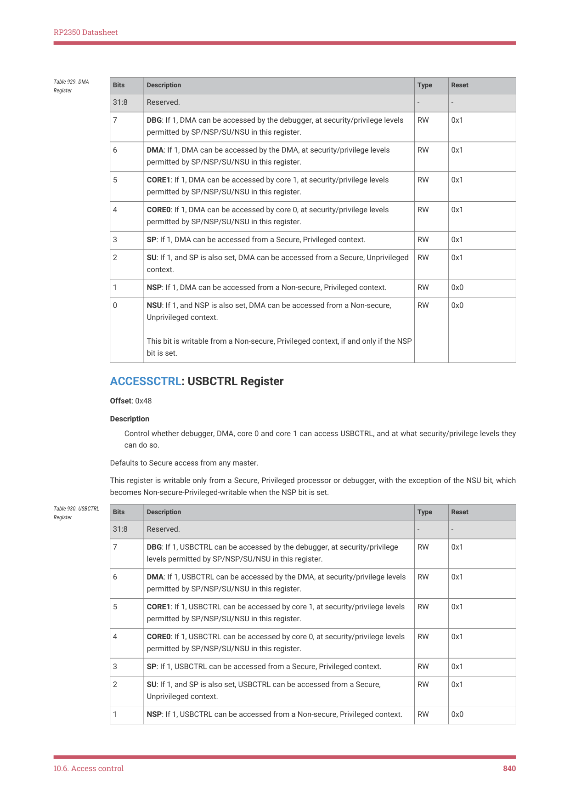

RP2350 Datasheet

| Bits | Description | Type | Reset |
| --- | --- | --- | --- |
| 31:8 | Reserved. | - | - |
| 7 | DBG: If 1, DMA can be accessed by the debugger, at security/privilege levels
permitted by SP/NSP/SU/NSU in this register. | RW | 0x1 |
| 6 | DMA: If 1, DMA can be accessed by the DMA, at security/privilege levels
permitted by SP/NSP/SU/NSU in this register. | RW | 0x1 |
| 5 | CORE1: If 1, DMA can be accessed by core 1, at security/privilege levels
permitted by SP/NSP/SU/NSU in this register. | RW | 0x1 |
| 4 | CORE0: If 1, DMA can be accessed by core 0, at security/privilege levels
permitted by SP/NSP/SU/NSU in this register. | RW | 0x1 |
| 3 | SP: If 1, DMA can be accessed from a Secure, Privileged context. | RW | 0x1 |
| 2 | SU: If 1, and SP is also set, DMA can be accessed from a Secure, Unprivileged
context. | RW | 0x1 |
| 1 | NSP: If 1, DMA can be accessed from a Non-secure, Privileged context. | RW | 0x0 |
| 0 | NSU: If 1, and NSP is also set, DMA can be accessed from a Non-secure,
Unprivileged context.
This bit is writable from a Non-secure, Privileged context, if and only if the NSP
bit is set. | RW | 0x0 |

Table 929. DMA

ACCESSCTRL: USBCTRL Register

Offset: 0x48

Description

Control whether debugger, DMA, core 0 and core 1 can access USBCTRL, and at what security/privilege levels they

can do so.

Defaults to Secure access from any master.

This register is writable only from a Secure, Privileged processor or debugger, with the exception of the NSU bit, which

becomes Non-secure-Privileged-writable when the NSP bit is set.

| Bits | Description | Type | Reset |
| --- | --- | --- | --- |
| 31:8 | Reserved. | - | - |
| 7 | DBG: If 1, USBCTRL can be accessed by the debugger, at security/privilege
levels permitted by SP/NSP/SU/NSU in this register. | RW | 0x1 |
| 6 | DMA: If 1, USBCTRL can be accessed by the DMA, at security/privilege levels
permitted by SP/NSP/SU/NSU in this register. | RW | 0x1 |
| 5 | CORE1: If 1, USBCTRL can be accessed by core 1, at security/privilege levels
permitted by SP/NSP/SU/NSU in this register. | RW | 0x1 |
| 4 | CORE0: If 1, USBCTRL can be accessed by core 0, at security/privilege levels
permitted by SP/NSP/SU/NSU in this register. | RW | 0x1 |
| 3 | SP: If 1, USBCTRL can be accessed from a Secure, Privileged context. | RW | 0x1 |
| 2 | SU: If 1, and SP is also set, USBCTRL can be accessed from a Secure,
Unprivileged context. | RW | 0x1 |
| 1 | NSP: If 1, USBCTRL can be accessed from a Non-secure, Privileged context. | RW | 0x0 |

Table 930. USBCTRL

10.6. Access control
840

RP2350 Datasheet

| Bits | Description | Type | Reset |
| --- | --- | --- | --- |
| 0 | NSU: If 1, and NSP is also set, USBCTRL can be accessed from a Non-secure,
Unprivileged context.
This bit is writable from a Non-secure, Privileged context, if and only if the NSP
bit is set. | RW | 0x0 |

ACCESSCTRL: PIO0 Register

Offset: 0x4c

Description

Control whether debugger, DMA, core 0 and core 1 can access PIO0, and at what security/privilege levels they can

do so.

Defaults to Secure access from any master.

This register is writable only from a Secure, Privileged processor or debugger, with the exception of the NSU bit, which

becomes Non-secure-Privileged-writable when the NSP bit is set.

| Bits | Description | Type | Reset |
| --- | --- | --- | --- |
| 31:8 | Reserved. | - | - |
| 7 | DBG: If 1, PIO0 can be accessed by the debugger, at security/privilege levels
permitted by SP/NSP/SU/NSU in this register. | RW | 0x1 |
| 6 | DMA: If 1, PIO0 can be accessed by the DMA, at security/privilege levels
permitted by SP/NSP/SU/NSU in this register. | RW | 0x1 |
| 5 | CORE1: If 1, PIO0 can be accessed by core 1, at security/privilege levels
permitted by SP/NSP/SU/NSU in this register. | RW | 0x1 |
| 4 | CORE0: If 1, PIO0 can be accessed by core 0, at security/privilege levels
permitted by SP/NSP/SU/NSU in this register. | RW | 0x1 |
| 3 | SP: If 1, PIO0 can be accessed from a Secure, Privileged context. | RW | 0x1 |
| 2 | SU: If 1, and SP is also set, PIO0 can be accessed from a Secure, Unprivileged
context. | RW | 0x1 |
| 1 | NSP: If 1, PIO0 can be accessed from a Non-secure, Privileged context. | RW | 0x0 |
| 0 | NSU: If 1, and NSP is also set, PIO0 can be accessed from a Non-secure,
Unprivileged context.
This bit is writable from a Non-secure, Privileged context, if and only if the NSP
bit is set. | RW | 0x0 |

Table 931. PIO0

ACCESSCTRL: PIO1 Register

Offset: 0x50

Description

Control whether debugger, DMA, core 0 and core 1 can access PIO1, and at what security/privilege levels they can

do so.

Defaults to Secure access from any master.

This register is writable only from a Secure, Privileged processor or debugger, with the exception of the NSU bit, which

becomes Non-secure-Privileged-writable when the NSP bit is set.

10.6. Access control
841

RP2350 Datasheet

| Bits | Description | Type | Reset |
| --- | --- | --- | --- |
| 31:8 | Reserved. | - | - |
| 7 | DBG: If 1, PIO1 can be accessed by the debugger, at security/privilege levels
permitted by SP/NSP/SU/NSU in this register. | RW | 0x1 |
| 6 | DMA: If 1, PIO1 can be accessed by the DMA, at security/privilege levels
permitted by SP/NSP/SU/NSU in this register. | RW | 0x1 |
| 5 | CORE1: If 1, PIO1 can be accessed by core 1, at security/privilege levels
permitted by SP/NSP/SU/NSU in this register. | RW | 0x1 |
| 4 | CORE0: If 1, PIO1 can be accessed by core 0, at security/privilege levels
permitted by SP/NSP/SU/NSU in this register. | RW | 0x1 |
| 3 | SP: If 1, PIO1 can be accessed from a Secure, Privileged context. | RW | 0x1 |
| 2 | SU: If 1, and SP is also set, PIO1 can be accessed from a Secure, Unprivileged
context. | RW | 0x1 |
| 1 | NSP: If 1, PIO1 can be accessed from a Non-secure, Privileged context. | RW | 0x0 |
| 0 | NSU: If 1, and NSP is also set, PIO1 can be accessed from a Non-secure,
Unprivileged context.
This bit is writable from a Non-secure, Privileged context, if and only if the NSP
bit is set. | RW | 0x0 |

Table 932. PIO1

ACCESSCTRL: PIO2 Register

Offset: 0x54

Description

Control whether debugger, DMA, core 0 and core 1 can access PIO2, and at what security/privilege levels they can

do so.

Defaults to Secure access from any master.

This register is writable only from a Secure, Privileged processor or debugger, with the exception of the NSU bit, which

becomes Non-secure-Privileged-writable when the NSP bit is set.

| Bits | Description | Type | Reset |
| --- | --- | --- | --- |
| 31:8 | Reserved. | - | - |
| 7 | DBG: If 1, PIO2 can be accessed by the debugger, at security/privilege levels
permitted by SP/NSP/SU/NSU in this register. | RW | 0x1 |
| 6 | DMA: If 1, PIO2 can be accessed by the DMA, at security/privilege levels
permitted by SP/NSP/SU/NSU in this register. | RW | 0x1 |
| 5 | CORE1: If 1, PIO2 can be accessed by core 1, at security/privilege levels
permitted by SP/NSP/SU/NSU in this register. | RW | 0x1 |
| 4 | CORE0: If 1, PIO2 can be accessed by core 0, at security/privilege levels
permitted by SP/NSP/SU/NSU in this register. | RW | 0x1 |
| 3 | SP: If 1, PIO2 can be accessed from a Secure, Privileged context. | RW | 0x1 |
| 2 | SU: If 1, and SP is also set, PIO2 can be accessed from a Secure, Unprivileged
context. | RW | 0x1 |
| 1 | NSP: If 1, PIO2 can be accessed from a Non-secure, Privileged context. | RW | 0x0 |

Table 933. PIO2

10.6. Access control
842

RP2350 Datasheet

| Bits | Description | Type | Reset |
| --- | --- | --- | --- |
| 0 | NSU: If 1, and NSP is also set, PIO2 can be accessed from a Non-secure,
Unprivileged context.
This bit is writable from a Non-secure, Privileged context, if and only if the NSP
bit is set. | RW | 0x0 |

ACCESSCTRL: CORESIGHT_TRACE Register

Offset: 0x58

Description

Control whether debugger, DMA, core 0 and core 1 can access CORESIGHT_TRACE, and at what security/privilege

levels they can do so.

Defaults to Secure, Privileged processor or debug access only.

This register is writable only from a Secure, Privileged processor or debugger, with the exception of the NSU bit, which

becomes Non-secure-Privileged-writable when the NSP bit is set.

| Bits | Description | Type | Reset |
| --- | --- | --- | --- |
| 31:8 | Reserved. | - | - |
| 7 | DBG: If 1, CORESIGHT_TRACE can be accessed by the debugger, at
security/privilege levels permitted by SP/NSP/SU/NSU in this register. | RW | 0x1 |
| 6 | DMA: If 1, CORESIGHT_TRACE can be accessed by the DMA, at
security/privilege levels permitted by SP/NSP/SU/NSU in this register. | RW | 0x0 |
| 5 | CORE1: If 1, CORESIGHT_TRACE can be accessed by core 1, at
security/privilege levels permitted by SP/NSP/SU/NSU in this register. | RW | 0x1 |
| 4 | CORE0: If 1, CORESIGHT_TRACE can be accessed by core 0, at
security/privilege levels permitted by SP/NSP/SU/NSU in this register. | RW | 0x1 |
| 3 | SP: If 1, CORESIGHT_TRACE can be accessed from a Secure, Privileged
context. | RW | 0x1 |
| 2 | SU: If 1, and SP is also set, CORESIGHT_TRACE can be accessed from a
Secure, Unprivileged context. | RW | 0x0 |
| 1 | NSP: If 1, CORESIGHT_TRACE can be accessed from a Non-secure, Privileged
context. | RW | 0x0 |
| 0 | NSU: If 1, and NSP is also set, CORESIGHT_TRACE can be accessed from a
Non-secure, Unprivileged context.
This bit is writable from a Non-secure, Privileged context, if and only if the NSP
bit is set. | RW | 0x0 |

Table 934.

CORESIGHT_TRACE

Register

ACCESSCTRL: CORESIGHT_PERIPH Register

Offset: 0x5c

Description

Control whether debugger, DMA, core 0 and core 1 can access CORESIGHT_PERIPH, and at what security/privilege

levels they can do so.

Defaults to Secure, Privileged processor or debug access only.

This register is writable only from a Secure, Privileged processor or debugger, with the exception of the NSU bit, which

becomes Non-secure-Privileged-writable when the NSP bit is set.

10.6. Access control
843

RP2350 Datasheet

| Bits | Description | Type | Reset |
| --- | --- | --- | --- |
| 31:8 | Reserved. | - | - |
| 7 | DBG: If 1, CORESIGHT_PERIPH can be accessed by the debugger, at
security/privilege levels permitted by SP/NSP/SU/NSU in this register. | RW | 0x1 |
| 6 | DMA: If 1, CORESIGHT_PERIPH can be accessed by the DMA, at
security/privilege levels permitted by SP/NSP/SU/NSU in this register. | RW | 0x0 |
| 5 | CORE1: If 1, CORESIGHT_PERIPH can be accessed by core 1, at
security/privilege levels permitted by SP/NSP/SU/NSU in this register. | RW | 0x1 |
| 4 | CORE0: If 1, CORESIGHT_PERIPH can be accessed by core 0, at
security/privilege levels permitted by SP/NSP/SU/NSU in this register. | RW | 0x1 |
| 3 | SP: If 1, CORESIGHT_PERIPH can be accessed from a Secure, Privileged
context. | RW | 0x1 |
| 2 | SU: If 1, and SP is also set, CORESIGHT_PERIPH can be accessed from a
Secure, Unprivileged context. | RW | 0x0 |
| 1 | NSP: If 1, CORESIGHT_PERIPH can be accessed from a Non-secure, Privileged
context. | RW | 0x0 |
| 0 | NSU: If 1, and NSP is also set, CORESIGHT_PERIPH can be accessed from a
Non-secure, Unprivileged context.
This bit is writable from a Non-secure, Privileged context, if and only if the NSP
bit is set. | RW | 0x0 |

Table 935.

CORESIGHT_PERIPH

Register

ACCESSCTRL: SYSINFO Register

Offset: 0x60

Description

Control whether debugger, DMA, core 0 and core 1 can access SYSINFO, and at what security/privilege levels they

can do so.

Defaults to fully open access.

This register is writable only from a Secure, Privileged processor or debugger, with the exception of the NSU bit, which

becomes Non-secure-Privileged-writable when the NSP bit is set.

| Bits | Description | Type | Reset |
| --- | --- | --- | --- |
| 31:8 | Reserved. | - | - |
| 7 | DBG: If 1, SYSINFO can be accessed by the debugger, at security/privilege
levels permitted by SP/NSP/SU/NSU in this register. | RW | 0x1 |
| 6 | DMA: If 1, SYSINFO can be accessed by the DMA, at security/privilege levels
permitted by SP/NSP/SU/NSU in this register. | RW | 0x1 |
| 5 | CORE1: If 1, SYSINFO can be accessed by core 1, at security/privilege levels
permitted by SP/NSP/SU/NSU in this register. | RW | 0x1 |
| 4 | CORE0: If 1, SYSINFO can be accessed by core 0, at security/privilege levels
permitted by SP/NSP/SU/NSU in this register. | RW | 0x1 |
| 3 | SP: If 1, SYSINFO can be accessed from a Secure, Privileged context. | RW | 0x1 |
| 2 | SU: If 1, and SP is also set, SYSINFO can be accessed from a Secure,
Unprivileged context. | RW | 0x1 |

Table 936. SYSINFO

10.6. Access control
844

RP2350 Datasheet

| Bits | Description | Type | Reset |
| --- | --- | --- | --- |
| 1 | NSP: If 1, SYSINFO can be accessed from a Non-secure, Privileged context. | RW | 0x1 |
| 0 | NSU: If 1, and NSP is also set, SYSINFO can be accessed from a Non-secure,
Unprivileged context.
This bit is writable from a Non-secure, Privileged context, if and only if the NSP
bit is set. | RW | 0x1 |

ACCESSCTRL: RESETS Register

Offset: 0x64

Description

Control whether debugger, DMA, core 0 and core 1 can access RESETS, and at what security/privilege levels they

can do so.

Defaults to Secure access from any master.

This register is writable only from a Secure, Privileged processor or debugger, with the exception of the NSU bit, which

becomes Non-secure-Privileged-writable when the NSP bit is set.

| Bits | Description | Type | Reset |
| --- | --- | --- | --- |
| 31:8 | Reserved. | - | - |
| 7 | DBG: If 1, RESETS can be accessed by the debugger, at security/privilege
levels permitted by SP/NSP/SU/NSU in this register. | RW | 0x1 |
| 6 | DMA: If 1, RESETS can be accessed by the DMA, at security/privilege levels
permitted by SP/NSP/SU/NSU in this register. | RW | 0x1 |
| 5 | CORE1: If 1, RESETS can be accessed by core 1, at security/privilege levels
permitted by SP/NSP/SU/NSU in this register. | RW | 0x1 |
| 4 | CORE0: If 1, RESETS can be accessed by core 0, at security/privilege levels
permitted by SP/NSP/SU/NSU in this register. | RW | 0x1 |
| 3 | SP: If 1, RESETS can be accessed from a Secure, Privileged context. | RW | 0x1 |
| 2 | SU: If 1, and SP is also set, RESETS can be accessed from a Secure,
Unprivileged context. | RW | 0x1 |
| 1 | NSP: If 1, RESETS can be accessed from a Non-secure, Privileged context. | RW | 0x0 |
| 0 | NSU: If 1, and NSP is also set, RESETS can be accessed from a Non-secure,
Unprivileged context.
This bit is writable from a Non-secure, Privileged context, if and only if the NSP
bit is set. | RW | 0x0 |

Table 937. RESETS

ACCESSCTRL: IO_BANK0 Register

Offset: 0x68

Description

Control whether debugger, DMA, core 0 and core 1 can access IO_BANK0, and at what security/privilege levels they

can do so.

Defaults to Secure access from any master.

This register is writable only from a Secure, Privileged processor or debugger, with the exception of the NSU bit, which

becomes Non-secure-Privileged-writable when the NSP bit is set.

10.6. Access control
845

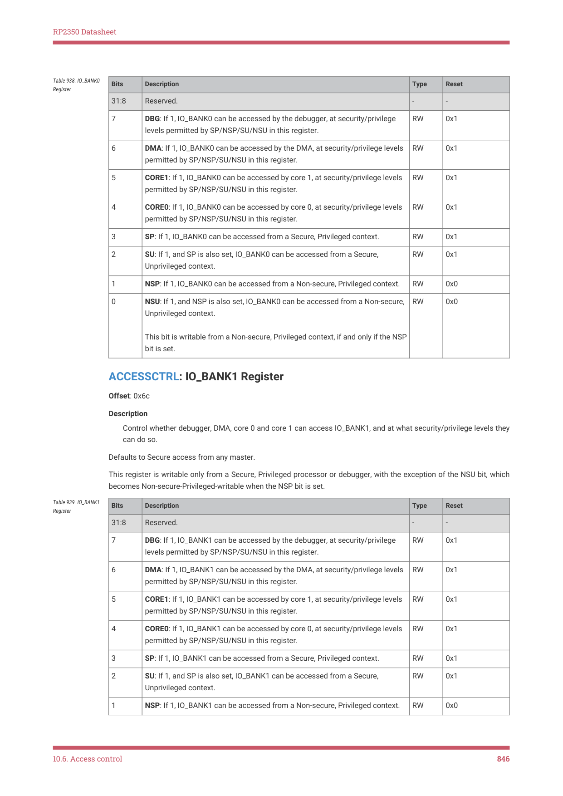

RP2350 Datasheet

| Bits | Description | Type | Reset |
| --- | --- | --- | --- |
| 31:8 | Reserved. | - | - |
| 7 | DBG: If 1, IO_BANK0 can be accessed by the debugger, at security/privilege
levels permitted by SP/NSP/SU/NSU in this register. | RW | 0x1 |
| 6 | DMA: If 1, IO_BANK0 can be accessed by the DMA, at security/privilege levels
permitted by SP/NSP/SU/NSU in this register. | RW | 0x1 |
| 5 | CORE1: If 1, IO_BANK0 can be accessed by core 1, at security/privilege levels
permitted by SP/NSP/SU/NSU in this register. | RW | 0x1 |
| 4 | CORE0: If 1, IO_BANK0 can be accessed by core 0, at security/privilege levels
permitted by SP/NSP/SU/NSU in this register. | RW | 0x1 |
| 3 | SP: If 1, IO_BANK0 can be accessed from a Secure, Privileged context. | RW | 0x1 |
| 2 | SU: If 1, and SP is also set, IO_BANK0 can be accessed from a Secure,
Unprivileged context. | RW | 0x1 |
| 1 | NSP: If 1, IO_BANK0 can be accessed from a Non-secure, Privileged context. | RW | 0x0 |
| 0 | NSU: If 1, and NSP is also set, IO_BANK0 can be accessed from a Non-secure,
Unprivileged context.
This bit is writable from a Non-secure, Privileged context, if and only if the NSP
bit is set. | RW | 0x0 |

Table 938. IO_BANK0

ACCESSCTRL: IO_BANK1 Register

Offset: 0x6c

Description

Control whether debugger, DMA, core 0 and core 1 can access IO_BANK1, and at what security/privilege levels they

can do so.

Defaults to Secure access from any master.

This register is writable only from a Secure, Privileged processor or debugger, with the exception of the NSU bit, which

becomes Non-secure-Privileged-writable when the NSP bit is set.

| Bits | Description | Type | Reset |
| --- | --- | --- | --- |
| 31:8 | Reserved. | - | - |
| 7 | DBG: If 1, IO_BANK1 can be accessed by the debugger, at security/privilege
levels permitted by SP/NSP/SU/NSU in this register. | RW | 0x1 |
| 6 | DMA: If 1, IO_BANK1 can be accessed by the DMA, at security/privilege levels
permitted by SP/NSP/SU/NSU in this register. | RW | 0x1 |
| 5 | CORE1: If 1, IO_BANK1 can be accessed by core 1, at security/privilege levels
permitted by SP/NSP/SU/NSU in this register. | RW | 0x1 |
| 4 | CORE0: If 1, IO_BANK1 can be accessed by core 0, at security/privilege levels
permitted by SP/NSP/SU/NSU in this register. | RW | 0x1 |
| 3 | SP: If 1, IO_BANK1 can be accessed from a Secure, Privileged context. | RW | 0x1 |
| 2 | SU: If 1, and SP is also set, IO_BANK1 can be accessed from a Secure,
Unprivileged context. | RW | 0x1 |
| 1 | NSP: If 1, IO_BANK1 can be accessed from a Non-secure, Privileged context. | RW | 0x0 |

Table 939. IO_BANK1

10.6. Access control
846

RP2350 Datasheet

| Bits | Description | Type | Reset |
| --- | --- | --- | --- |
| 0 | NSU: If 1, and NSP is also set, IO_BANK1 can be accessed from a Non-secure,
Unprivileged context.
This bit is writable from a Non-secure, Privileged context, if and only if the NSP
bit is set. | RW | 0x0 |

ACCESSCTRL: PADS_BANK0 Register

Offset: 0x70

Description

Control whether debugger, DMA, core 0 and core 1 can access PADS_BANK0, and at what security/privilege levels

they can do so.

Defaults to Secure access from any master.

This register is writable only from a Secure, Privileged processor or debugger, with the exception of the NSU bit, which

becomes Non-secure-Privileged-writable when the NSP bit is set.

| Bits | Description | Type | Reset |
| --- | --- | --- | --- |
| 31:8 | Reserved. | - | - |
| 7 | DBG: If 1, PADS_BANK0 can be accessed by the debugger, at
security/privilege levels permitted by SP/NSP/SU/NSU in this register. | RW | 0x1 |
| 6 | DMA: If 1, PADS_BANK0 can be accessed by the DMA, at security/privilege
levels permitted by SP/NSP/SU/NSU in this register. | RW | 0x1 |
| 5 | CORE1: If 1, PADS_BANK0 can be accessed by core 1, at security/privilege
levels permitted by SP/NSP/SU/NSU in this register. | RW | 0x1 |
| 4 | CORE0: If 1, PADS_BANK0 can be accessed by core 0, at security/privilege
levels permitted by SP/NSP/SU/NSU in this register. | RW | 0x1 |
| 3 | SP: If 1, PADS_BANK0 can be accessed from a Secure, Privileged context. | RW | 0x1 |
| 2 | SU: If 1, and SP is also set, PADS_BANK0 can be accessed from a Secure,
Unprivileged context. | RW | 0x1 |
| 1 | NSP: If 1, PADS_BANK0 can be accessed from a Non-secure, Privileged
context. | RW | 0x0 |
| 0 | NSU: If 1, and NSP is also set, PADS_BANK0 can be accessed from a Non-
secure, Unprivileged context.
This bit is writable from a Non-secure, Privileged context, if and only if the NSP
bit is set. | RW | 0x0 |

Table 940.

ACCESSCTRL: PADS_QSPI Register

Offset: 0x74

Description

Control whether debugger, DMA, core 0 and core 1 can access PADS_QSPI, and at what security/privilege levels

they can do so.

Defaults to Secure access from any master.

This register is writable only from a Secure, Privileged processor or debugger, with the exception of the NSU bit, which

becomes Non-secure-Privileged-writable when the NSP bit is set.

10.6. Access control
847

RP2350 Datasheet

| Bits | Description | Type | Reset |
| --- | --- | --- | --- |
| 31:8 | Reserved. | - | - |
| 7 | DBG: If 1, PADS_QSPI can be accessed by the debugger, at security/privilege
levels permitted by SP/NSP/SU/NSU in this register. | RW | 0x1 |
| 6 | DMA: If 1, PADS_QSPI can be accessed by the DMA, at security/privilege
levels permitted by SP/NSP/SU/NSU in this register. | RW | 0x1 |
| 5 | CORE1: If 1, PADS_QSPI can be accessed by core 1, at security/privilege levels
permitted by SP/NSP/SU/NSU in this register. | RW | 0x1 |
| 4 | CORE0: If 1, PADS_QSPI can be accessed by core 0, at security/privilege levels
permitted by SP/NSP/SU/NSU in this register. | RW | 0x1 |
| 3 | SP: If 1, PADS_QSPI can be accessed from a Secure, Privileged context. | RW | 0x1 |
| 2 | SU: If 1, and SP is also set, PADS_QSPI can be accessed from a Secure,
Unprivileged context. | RW | 0x1 |
| 1 | NSP: If 1, PADS_QSPI can be accessed from a Non-secure, Privileged context. | RW | 0x0 |
| 0 | NSU: If 1, and NSP is also set, PADS_QSPI can be accessed from a Non-
secure, Unprivileged context.
This bit is writable from a Non-secure, Privileged context, if and only if the NSP
bit is set. | RW | 0x0 |

Table 941. PADS_QSPI

ACCESSCTRL: BUSCTRL Register

Offset: 0x78

Description

Control whether debugger, DMA, core 0 and core 1 can access BUSCTRL, and at what security/privilege levels they

can do so.

Defaults to Secure access from any master.

This register is writable only from a Secure, Privileged processor or debugger, with the exception of the NSU bit, which

becomes Non-secure-Privileged-writable when the NSP bit is set.

| Bits | Description | Type | Reset |
| --- | --- | --- | --- |
| 31:8 | Reserved. | - | - |
| 7 | DBG: If 1, BUSCTRL can be accessed by the debugger, at security/privilege
levels permitted by SP/NSP/SU/NSU in this register. | RW | 0x1 |
| 6 | DMA: If 1, BUSCTRL can be accessed by the DMA, at security/privilege levels
permitted by SP/NSP/SU/NSU in this register. | RW | 0x1 |
| 5 | CORE1: If 1, BUSCTRL can be accessed by core 1, at security/privilege levels
permitted by SP/NSP/SU/NSU in this register. | RW | 0x1 |
| 4 | CORE0: If 1, BUSCTRL can be accessed by core 0, at security/privilege levels
permitted by SP/NSP/SU/NSU in this register. | RW | 0x1 |
| 3 | SP: If 1, BUSCTRL can be accessed from a Secure, Privileged context. | RW | 0x1 |
| 2 | SU: If 1, and SP is also set, BUSCTRL can be accessed from a Secure,
Unprivileged context. | RW | 0x1 |
| 1 | NSP: If 1, BUSCTRL can be accessed from a Non-secure, Privileged context. | RW | 0x0 |

Table 942. BUSCTRL

10.6. Access control
848

RP2350 Datasheet

| Bits | Description | Type | Reset |
| --- | --- | --- | --- |
| 0 | NSU: If 1, and NSP is also set, BUSCTRL can be accessed from a Non-secure,
Unprivileged context.
This bit is writable from a Non-secure, Privileged context, if and only if the NSP
bit is set. | RW | 0x0 |

ACCESSCTRL: ADC Register

Offset: 0x7c

Description

Control whether debugger, DMA, core 0 and core 1 can access ADC, and at what security/privilege levels they can

do so.

Defaults to Secure access from any master.

This register is writable only from a Secure, Privileged processor or debugger, with the exception of the NSU bit, which

becomes Non-secure-Privileged-writable when the NSP bit is set.

| Bits | Description | Type | Reset |
| --- | --- | --- | --- |
| 31:8 | Reserved. | - | - |
| 7 | DBG: If 1, ADC can be accessed by the debugger, at security/privilege levels
permitted by SP/NSP/SU/NSU in this register. | RW | 0x1 |
| 6 | DMA: If 1, ADC can be accessed by the DMA, at security/privilege levels
permitted by SP/NSP/SU/NSU in this register. | RW | 0x1 |
| 5 | CORE1: If 1, ADC can be accessed by core 1, at security/privilege levels
permitted by SP/NSP/SU/NSU in this register. | RW | 0x1 |
| 4 | CORE0: If 1, ADC can be accessed by core 0, at security/privilege levels
permitted by SP/NSP/SU/NSU in this register. | RW | 0x1 |
| 3 | SP: If 1, ADC can be accessed from a Secure, Privileged context. | RW | 0x1 |
| 2 | SU: If 1, and SP is also set, ADC can be accessed from a Secure, Unprivileged
context. | RW | 0x1 |
| 1 | NSP: If 1, ADC can be accessed from a Non-secure, Privileged context. | RW | 0x0 |
| 0 | NSU: If 1, and NSP is also set, ADC can be accessed from a Non-secure,
Unprivileged context.
This bit is writable from a Non-secure, Privileged context, if and only if the NSP
bit is set. | RW | 0x0 |

Table 943. ADC

ACCESSCTRL: HSTX Register

Offset: 0x80

Description

Control whether debugger, DMA, core 0 and core 1 can access HSTX, and at what security/privilege levels they can

do so.

Defaults to Secure access from any master.

This register is writable only from a Secure, Privileged processor or debugger, with the exception of the NSU bit, which

becomes Non-secure-Privileged-writable when the NSP bit is set.

10.6. Access control
849

RP2350 Datasheet

| Bits | Description | Type | Reset |
| --- | --- | --- | --- |
| 31:8 | Reserved. | - | - |
| 7 | DBG: If 1, HSTX can be accessed by the debugger, at security/privilege levels
permitted by SP/NSP/SU/NSU in this register. | RW | 0x1 |
| 6 | DMA: If 1, HSTX can be accessed by the DMA, at security/privilege levels
permitted by SP/NSP/SU/NSU in this register. | RW | 0x1 |
| 5 | CORE1: If 1, HSTX can be accessed by core 1, at security/privilege levels
permitted by SP/NSP/SU/NSU in this register. | RW | 0x1 |
| 4 | CORE0: If 1, HSTX can be accessed by core 0, at security/privilege levels
permitted by SP/NSP/SU/NSU in this register. | RW | 0x1 |
| 3 | SP: If 1, HSTX can be accessed from a Secure, Privileged context. | RW | 0x1 |
| 2 | SU: If 1, and SP is also set, HSTX can be accessed from a Secure, Unprivileged
context. | RW | 0x1 |
| 1 | NSP: If 1, HSTX can be accessed from a Non-secure, Privileged context. | RW | 0x0 |
| 0 | NSU: If 1, and NSP is also set, HSTX can be accessed from a Non-secure,
Unprivileged context.
This bit is writable from a Non-secure, Privileged context, if and only if the NSP
bit is set. | RW | 0x0 |

Table 944. HSTX

ACCESSCTRL: I2C0 Register

Offset: 0x84

Description

Control whether debugger, DMA, core 0 and core 1 can access I2C0, and at what security/privilege levels they can

do so.

Defaults to Secure access from any master.

This register is writable only from a Secure, Privileged processor or debugger, with the exception of the NSU bit, which

becomes Non-secure-Privileged-writable when the NSP bit is set.

| Bits | Description | Type | Reset |
| --- | --- | --- | --- |
| 31:8 | Reserved. | - | - |
| 7 | DBG: If 1, I2C0 can be accessed by the debugger, at security/privilege levels
permitted by SP/NSP/SU/NSU in this register. | RW | 0x1 |
| 6 | DMA: If 1, I2C0 can be accessed by the DMA, at security/privilege levels
permitted by SP/NSP/SU/NSU in this register. | RW | 0x1 |
| 5 | CORE1: If 1, I2C0 can be accessed by core 1, at security/privilege levels
permitted by SP/NSP/SU/NSU in this register. | RW | 0x1 |
| 4 | CORE0: If 1, I2C0 can be accessed by core 0, at security/privilege levels
permitted by SP/NSP/SU/NSU in this register. | RW | 0x1 |
| 3 | SP: If 1, I2C0 can be accessed from a Secure, Privileged context. | RW | 0x1 |
| 2 | SU: If 1, and SP is also set, I2C0 can be accessed from a Secure, Unprivileged
context. | RW | 0x1 |
| 1 | NSP: If 1, I2C0 can be accessed from a Non-secure, Privileged context. | RW | 0x0 |

Table 945. I2C0

10.6. Access control
850

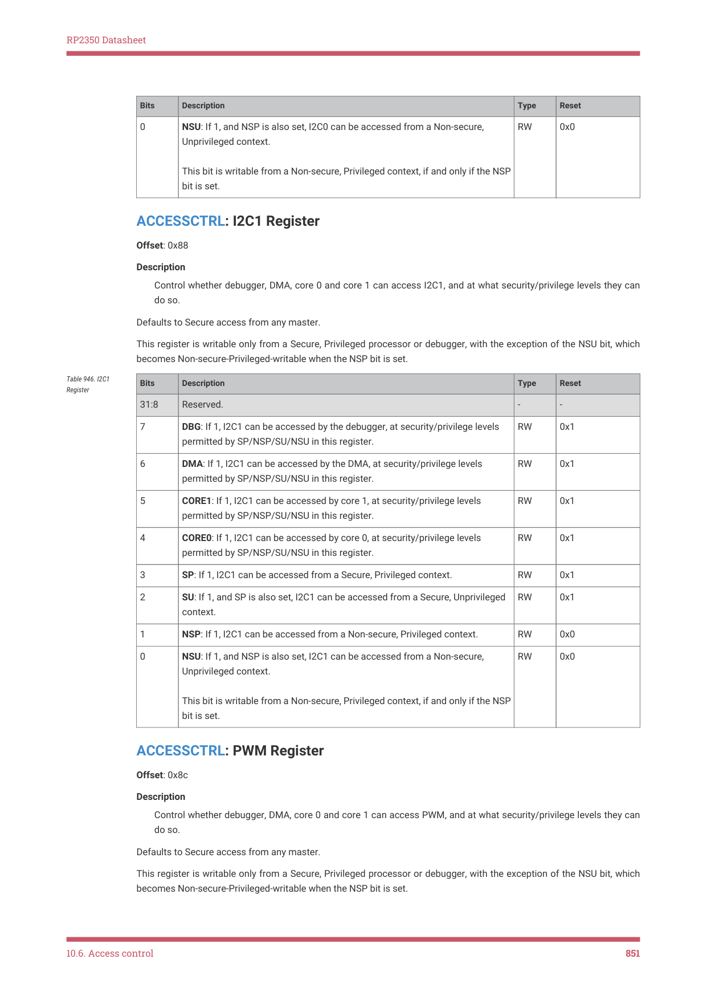

RP2350 Datasheet

| Bits | Description | Type | Reset |
| --- | --- | --- | --- |
| 0 | NSU: If 1, and NSP is also set, I2C0 can be accessed from a Non-secure,
Unprivileged context.
This bit is writable from a Non-secure, Privileged context, if and only if the NSP
bit is set. | RW | 0x0 |

ACCESSCTRL: I2C1 Register

Offset: 0x88

Description

Control whether debugger, DMA, core 0 and core 1 can access I2C1, and at what security/privilege levels they can

do so.

Defaults to Secure access from any master.

This register is writable only from a Secure, Privileged processor or debugger, with the exception of the NSU bit, which

becomes Non-secure-Privileged-writable when the NSP bit is set.

| Bits | Description | Type | Reset |
| --- | --- | --- | --- |
| 31:8 | Reserved. | - | - |
| 7 | DBG: If 1, I2C1 can be accessed by the debugger, at security/privilege levels
permitted by SP/NSP/SU/NSU in this register. | RW | 0x1 |
| 6 | DMA: If 1, I2C1 can be accessed by the DMA, at security/privilege levels
permitted by SP/NSP/SU/NSU in this register. | RW | 0x1 |
| 5 | CORE1: If 1, I2C1 can be accessed by core 1, at security/privilege levels
permitted by SP/NSP/SU/NSU in this register. | RW | 0x1 |
| 4 | CORE0: If 1, I2C1 can be accessed by core 0, at security/privilege levels
permitted by SP/NSP/SU/NSU in this register. | RW | 0x1 |
| 3 | SP: If 1, I2C1 can be accessed from a Secure, Privileged context. | RW | 0x1 |
| 2 | SU: If 1, and SP is also set, I2C1 can be accessed from a Secure, Unprivileged
context. | RW | 0x1 |
| 1 | NSP: If 1, I2C1 can be accessed from a Non-secure, Privileged context. | RW | 0x0 |
| 0 | NSU: If 1, and NSP is also set, I2C1 can be accessed from a Non-secure,
Unprivileged context.
This bit is writable from a Non-secure, Privileged context, if and only if the NSP
bit is set. | RW | 0x0 |

Table 946. I2C1

ACCESSCTRL: PWM Register

Offset: 0x8c

Description

Control whether debugger, DMA, core 0 and core 1 can access PWM, and at what security/privilege levels they can

do so.

Defaults to Secure access from any master.

This register is writable only from a Secure, Privileged processor or debugger, with the exception of the NSU bit, which

becomes Non-secure-Privileged-writable when the NSP bit is set.

10.6. Access control
851

RP2350 Datasheet

| Bits | Description | Type | Reset |
| --- | --- | --- | --- |
| 31:8 | Reserved. | - | - |
| 7 | DBG: If 1, PWM can be accessed by the debugger, at security/privilege levels
permitted by SP/NSP/SU/NSU in this register. | RW | 0x1 |
| 6 | DMA: If 1, PWM can be accessed by the DMA, at security/privilege levels
permitted by SP/NSP/SU/NSU in this register. | RW | 0x1 |
| 5 | CORE1: If 1, PWM can be accessed by core 1, at security/privilege levels
permitted by SP/NSP/SU/NSU in this register. | RW | 0x1 |
| 4 | CORE0: If 1, PWM can be accessed by core 0, at security/privilege levels
permitted by SP/NSP/SU/NSU in this register. | RW | 0x1 |
| 3 | SP: If 1, PWM can be accessed from a Secure, Privileged context. | RW | 0x1 |
| 2 | SU: If 1, and SP is also set, PWM can be accessed from a Secure, Unprivileged
context. | RW | 0x1 |
| 1 | NSP: If 1, PWM can be accessed from a Non-secure, Privileged context. | RW | 0x0 |
| 0 | NSU: If 1, and NSP is also set, PWM can be accessed from a Non-secure,
Unprivileged context.
This bit is writable from a Non-secure, Privileged context, if and only if the NSP
bit is set. | RW | 0x0 |

Table 947. PWM

ACCESSCTRL: SPI0 Register

Offset: 0x90

Description

Control whether debugger, DMA, core 0 and core 1 can access SPI0, and at what security/privilege levels they can

do so.

Defaults to Secure access from any master.

This register is writable only from a Secure, Privileged processor or debugger, with the exception of the NSU bit, which

becomes Non-secure-Privileged-writable when the NSP bit is set.

| Bits | Description | Type | Reset |
| --- | --- | --- | --- |
| 31:8 | Reserved. | - | - |
| 7 | DBG: If 1, SPI0 can be accessed by the debugger, at security/privilege levels
permitted by SP/NSP/SU/NSU in this register. | RW | 0x1 |
| 6 | DMA: If 1, SPI0 can be accessed by the DMA, at security/privilege levels
permitted by SP/NSP/SU/NSU in this register. | RW | 0x1 |
| 5 | CORE1: If 1, SPI0 can be accessed by core 1, at security/privilege levels
permitted by SP/NSP/SU/NSU in this register. | RW | 0x1 |
| 4 | CORE0: If 1, SPI0 can be accessed by core 0, at security/privilege levels
permitted by SP/NSP/SU/NSU in this register. | RW | 0x1 |
| 3 | SP: If 1, SPI0 can be accessed from a Secure, Privileged context. | RW | 0x1 |
| 2 | SU: If 1, and SP is also set, SPI0 can be accessed from a Secure, Unprivileged
context. | RW | 0x1 |
| 1 | NSP: If 1, SPI0 can be accessed from a Non-secure, Privileged context. | RW | 0x0 |

Table 948. SPI0

10.6. Access control
852

RP2350 Datasheet

| Bits | Description | Type | Reset |
| --- | --- | --- | --- |
| 0 | NSU: If 1, and NSP is also set, SPI0 can be accessed from a Non-secure,
Unprivileged context.
This bit is writable from a Non-secure, Privileged context, if and only if the NSP
bit is set. | RW | 0x0 |

ACCESSCTRL: SPI1 Register

Offset: 0x94

Description

Control whether debugger, DMA, core 0 and core 1 can access SPI1, and at what security/privilege levels they can

do so.

Defaults to Secure access from any master.

This register is writable only from a Secure, Privileged processor or debugger, with the exception of the NSU bit, which

becomes Non-secure-Privileged-writable when the NSP bit is set.

| Bits | Description | Type | Reset |
| --- | --- | --- | --- |
| 31:8 | Reserved. | - | - |
| 7 | DBG: If 1, SPI1 can be accessed by the debugger, at security/privilege levels
permitted by SP/NSP/SU/NSU in this register. | RW | 0x1 |
| 6 | DMA: If 1, SPI1 can be accessed by the DMA, at security/privilege levels
permitted by SP/NSP/SU/NSU in this register. | RW | 0x1 |
| 5 | CORE1: If 1, SPI1 can be accessed by core 1, at security/privilege levels
permitted by SP/NSP/SU/NSU in this register. | RW | 0x1 |
| 4 | CORE0: If 1, SPI1 can be accessed by core 0, at security/privilege levels
permitted by SP/NSP/SU/NSU in this register. | RW | 0x1 |
| 3 | SP: If 1, SPI1 can be accessed from a Secure, Privileged context. | RW | 0x1 |
| 2 | SU: If 1, and SP is also set, SPI1 can be accessed from a Secure, Unprivileged
context. | RW | 0x1 |
| 1 | NSP: If 1, SPI1 can be accessed from a Non-secure, Privileged context. | RW | 0x0 |
| 0 | NSU: If 1, and NSP is also set, SPI1 can be accessed from a Non-secure,
Unprivileged context.
This bit is writable from a Non-secure, Privileged context, if and only if the NSP
bit is set. | RW | 0x0 |

Table 949. SPI1

ACCESSCTRL: TIMER0 Register

Offset: 0x98

Description

Control whether debugger, DMA, core 0 and core 1 can access TIMER0, and at what security/privilege levels they

can do so.

Defaults to Secure access from any master.

This register is writable only from a Secure, Privileged processor or debugger, with the exception of the NSU bit, which

becomes Non-secure-Privileged-writable when the NSP bit is set.

10.6. Access control
853

RP2350 Datasheet

| Bits | Description | Type | Reset |
| --- | --- | --- | --- |
| 31:8 | Reserved. | - | - |
| 7 | DBG: If 1, TIMER0 can be accessed by the debugger, at security/privilege
levels permitted by SP/NSP/SU/NSU in this register. | RW | 0x1 |
| 6 | DMA: If 1, TIMER0 can be accessed by the DMA, at security/privilege levels
permitted by SP/NSP/SU/NSU in this register. | RW | 0x1 |
| 5 | CORE1: If 1, TIMER0 can be accessed by core 1, at security/privilege levels
permitted by SP/NSP/SU/NSU in this register. | RW | 0x1 |
| 4 | CORE0: If 1, TIMER0 can be accessed by core 0, at security/privilege levels
permitted by SP/NSP/SU/NSU in this register. | RW | 0x1 |
| 3 | SP: If 1, TIMER0 can be accessed from a Secure, Privileged context. | RW | 0x1 |
| 2 | SU: If 1, and SP is also set, TIMER0 can be accessed from a Secure,
Unprivileged context. | RW | 0x1 |
| 1 | NSP: If 1, TIMER0 can be accessed from a Non-secure, Privileged context. | RW | 0x0 |
| 0 | NSU: If 1, and NSP is also set, TIMER0 can be accessed from a Non-secure,
Unprivileged context.
This bit is writable from a Non-secure, Privileged context, if and only if the NSP
bit is set. | RW | 0x0 |

Table 950. TIMER0

ACCESSCTRL: TIMER1 Register

Offset: 0x9c

Description

Control whether debugger, DMA, core 0 and core 1 can access TIMER1, and at what security/privilege levels they

can do so.

Defaults to Secure access from any master.

This register is writable only from a Secure, Privileged processor or debugger, with the exception of the NSU bit, which

becomes Non-secure-Privileged-writable when the NSP bit is set.

| Bits | Description | Type | Reset |
| --- | --- | --- | --- |
| 31:8 | Reserved. | - | - |
| 7 | DBG: If 1, TIMER1 can be accessed by the debugger, at security/privilege
levels permitted by SP/NSP/SU/NSU in this register. | RW | 0x1 |
| 6 | DMA: If 1, TIMER1 can be accessed by the DMA, at security/privilege levels
permitted by SP/NSP/SU/NSU in this register. | RW | 0x1 |
| 5 | CORE1: If 1, TIMER1 can be accessed by core 1, at security/privilege levels
permitted by SP/NSP/SU/NSU in this register. | RW | 0x1 |
| 4 | CORE0: If 1, TIMER1 can be accessed by core 0, at security/privilege levels
permitted by SP/NSP/SU/NSU in this register. | RW | 0x1 |
| 3 | SP: If 1, TIMER1 can be accessed from a Secure, Privileged context. | RW | 0x1 |
| 2 | SU: If 1, and SP is also set, TIMER1 can be accessed from a Secure,
Unprivileged context. | RW | 0x1 |
| 1 | NSP: If 1, TIMER1 can be accessed from a Non-secure, Privileged context. | RW | 0x0 |

Table 951. TIMER1

10.6. Access control
854

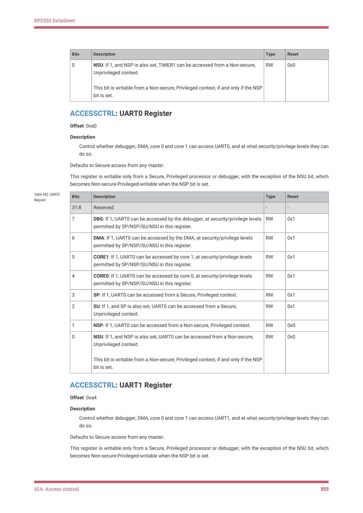

RP2350 Datasheet

| Bits | Description | Type | Reset |
| --- | --- | --- | --- |
| 0 | NSU: If 1, and NSP is also set, TIMER1 can be accessed from a Non-secure,
Unprivileged context.
This bit is writable from a Non-secure, Privileged context, if and only if the NSP
bit is set. | RW | 0x0 |

ACCESSCTRL: UART0 Register

Offset: 0xa0

Description

Control whether debugger, DMA, core 0 and core 1 can access UART0, and at what security/privilege levels they can

do so.

Defaults to Secure access from any master.

This register is writable only from a Secure, Privileged processor or debugger, with the exception of the NSU bit, which

becomes Non-secure-Privileged-writable when the NSP bit is set.

| Bits | Description | Type | Reset |
| --- | --- | --- | --- |
| 31:8 | Reserved. | - | - |
| 7 | DBG: If 1, UART0 can be accessed by the debugger, at security/privilege levels
permitted by SP/NSP/SU/NSU in this register. | RW | 0x1 |
| 6 | DMA: If 1, UART0 can be accessed by the DMA, at security/privilege levels
permitted by SP/NSP/SU/NSU in this register. | RW | 0x1 |
| 5 | CORE1: If 1, UART0 can be accessed by core 1, at security/privilege levels
permitted by SP/NSP/SU/NSU in this register. | RW | 0x1 |
| 4 | CORE0: If 1, UART0 can be accessed by core 0, at security/privilege levels
permitted by SP/NSP/SU/NSU in this register. | RW | 0x1 |
| 3 | SP: If 1, UART0 can be accessed from a Secure, Privileged context. | RW | 0x1 |
| 2 | SU: If 1, and SP is also set, UART0 can be accessed from a Secure,
Unprivileged context. | RW | 0x1 |
| 1 | NSP: If 1, UART0 can be accessed from a Non-secure, Privileged context. | RW | 0x0 |
| 0 | NSU: If 1, and NSP is also set, UART0 can be accessed from a Non-secure,
Unprivileged context.
This bit is writable from a Non-secure, Privileged context, if and only if the NSP
bit is set. | RW | 0x0 |

Table 952. UART0

ACCESSCTRL: UART1 Register

Offset: 0xa4

Description

Control whether debugger, DMA, core 0 and core 1 can access UART1, and at what security/privilege levels they can

do so.

Defaults to Secure access from any master.

This register is writable only from a Secure, Privileged processor or debugger, with the exception of the NSU bit, which

becomes Non-secure-Privileged-writable when the NSP bit is set.

10.6. Access control
855

RP2350 Datasheet

| Bits | Description | Type | Reset |
| --- | --- | --- | --- |
| 31:8 | Reserved. | - | - |
| 7 | DBG: If 1, UART1 can be accessed by the debugger, at security/privilege levels
permitted by SP/NSP/SU/NSU in this register. | RW | 0x1 |
| 6 | DMA: If 1, UART1 can be accessed by the DMA, at security/privilege levels
permitted by SP/NSP/SU/NSU in this register. | RW | 0x1 |
| 5 | CORE1: If 1, UART1 can be accessed by core 1, at security/privilege levels
permitted by SP/NSP/SU/NSU in this register. | RW | 0x1 |
| 4 | CORE0: If 1, UART1 can be accessed by core 0, at security/privilege levels
permitted by SP/NSP/SU/NSU in this register. | RW | 0x1 |
| 3 | SP: If 1, UART1 can be accessed from a Secure, Privileged context. | RW | 0x1 |
| 2 | SU: If 1, and SP is also set, UART1 can be accessed from a Secure,
Unprivileged context. | RW | 0x1 |
| 1 | NSP: If 1, UART1 can be accessed from a Non-secure, Privileged context. | RW | 0x0 |
| 0 | NSU: If 1, and NSP is also set, UART1 can be accessed from a Non-secure,
Unprivileged context.
This bit is writable from a Non-secure, Privileged context, if and only if the NSP
bit is set. | RW | 0x0 |

Table 953. UART1

ACCESSCTRL: OTP Register

Offset: 0xa8

Description

Control whether debugger, DMA, core 0 and core 1 can access OTP, and at what security/privilege levels they can

do so.

Defaults to Secure access from any master.

This register is writable only from a Secure, Privileged processor or debugger, with the exception of the NSU bit, which

becomes Non-secure-Privileged-writable when the NSP bit is set.

| Bits | Description | Type | Reset |
| --- | --- | --- | --- |
| 31:8 | Reserved. | - | - |
| 7 | DBG: If 1, OTP can be accessed by the debugger, at security/privilege levels
permitted by SP/NSP/SU/NSU in this register. | RW | 0x1 |
| 6 | DMA: If 1, OTP can be accessed by the DMA, at security/privilege levels
permitted by SP/NSP/SU/NSU in this register. | RW | 0x1 |
| 5 | CORE1: If 1, OTP can be accessed by core 1, at security/privilege levels
permitted by SP/NSP/SU/NSU in this register. | RW | 0x1 |
| 4 | CORE0: If 1, OTP can be accessed by core 0, at security/privilege levels
permitted by SP/NSP/SU/NSU in this register. | RW | 0x1 |
| 3 | SP: If 1, OTP can be accessed from a Secure, Privileged context. | RW | 0x1 |
| 2 | SU: If 1, and SP is also set, OTP can be accessed from a Secure, Unprivileged
context. | RW | 0x1 |
| 1 | NSP: If 1, OTP can be accessed from a Non-secure, Privileged context. | RW | 0x0 |

Table 954. OTP

10.6. Access control
856

RP2350 Datasheet

| Bits | Description | Type | Reset |
| --- | --- | --- | --- |
| 0 | NSU: If 1, and NSP is also set, OTP can be accessed from a Non-secure,
Unprivileged context.
This bit is writable from a Non-secure, Privileged context, if and only if the NSP
bit is set. | RW | 0x0 |

ACCESSCTRL: TBMAN Register

Offset: 0xac

Description

Control whether debugger, DMA, core 0 and core 1 can access TBMAN, and at what security/privilege levels they

can do so.

Defaults to Secure access from any master.

This register is writable only from a Secure, Privileged processor or debugger, with the exception of the NSU bit, which

becomes Non-secure-Privileged-writable when the NSP bit is set.

| Bits | Description | Type | Reset |
| --- | --- | --- | --- |
| 31:8 | Reserved. | - | - |
| 7 | DBG: If 1, TBMAN can be accessed by the debugger, at security/privilege
levels permitted by SP/NSP/SU/NSU in this register. | RW | 0x1 |
| 6 | DMA: If 1, TBMAN can be accessed by the DMA, at security/privilege levels
permitted by SP/NSP/SU/NSU in this register. | RW | 0x1 |
| 5 | CORE1: If 1, TBMAN can be accessed by core 1, at security/privilege levels
permitted by SP/NSP/SU/NSU in this register. | RW | 0x1 |
| 4 | CORE0: If 1, TBMAN can be accessed by core 0, at security/privilege levels
permitted by SP/NSP/SU/NSU in this register. | RW | 0x1 |
| 3 | SP: If 1, TBMAN can be accessed from a Secure, Privileged context. | RW | 0x1 |
| 2 | SU: If 1, and SP is also set, TBMAN can be accessed from a Secure,
Unprivileged context. | RW | 0x1 |
| 1 | NSP: If 1, TBMAN can be accessed from a Non-secure, Privileged context. | RW | 0x0 |
| 0 | NSU: If 1, and NSP is also set, TBMAN can be accessed from a Non-secure,
Unprivileged context.
This bit is writable from a Non-secure, Privileged context, if and only if the NSP
bit is set. | RW | 0x0 |

Table 955. TBMAN

ACCESSCTRL: POWMAN Register

Offset: 0xb0

Description

Control whether debugger, DMA, core 0 and core 1 can access POWMAN, and at what security/privilege levels they

can do so.

Defaults to Secure, Privileged processor or debug access only.

This register is writable only from a Secure, Privileged processor or debugger, with the exception of the NSU bit, which

becomes Non-secure-Privileged-writable when the NSP bit is set.

10.6. Access control
857

RP2350 Datasheet

| Bits | Description | Type | Reset |
| --- | --- | --- | --- |
| 31:8 | Reserved. | - | - |
| 7 | DBG: If 1, POWMAN can be accessed by the debugger, at security/privilege
levels permitted by SP/NSP/SU/NSU in this register. | RW | 0x1 |
| 6 | DMA: If 1, POWMAN can be accessed by the DMA, at security/privilege levels
permitted by SP/NSP/SU/NSU in this register. | RW | 0x0 |
| 5 | CORE1: If 1, POWMAN can be accessed by core 1, at security/privilege levels
permitted by SP/NSP/SU/NSU in this register. | RW | 0x1 |
| 4 | CORE0: If 1, POWMAN can be accessed by core 0, at security/privilege levels
permitted by SP/NSP/SU/NSU in this register. | RW | 0x1 |
| 3 | SP: If 1, POWMAN can be accessed from a Secure, Privileged context. | RW | 0x1 |
| 2 | SU: If 1, and SP is also set, POWMAN can be accessed from a Secure,
Unprivileged context. | RW | 0x0 |
| 1 | NSP: If 1, POWMAN can be accessed from a Non-secure, Privileged context. | RW | 0x0 |
| 0 | NSU: If 1, and NSP is also set, POWMAN can be accessed from a Non-secure,
Unprivileged context.
This bit is writable from a Non-secure, Privileged context, if and only if the NSP
bit is set. | RW | 0x0 |

Table 956. POWMAN

ACCESSCTRL: TRNG Register

Offset: 0xb4

Description

Control whether debugger, DMA, core 0 and core 1 can access TRNG, and at what security/privilege levels they can

do so.

Defaults to Secure, Privileged processor or debug access only.

This register is writable only from a Secure, Privileged processor or debugger, with the exception of the NSU bit, which

becomes Non-secure-Privileged-writable when the NSP bit is set.

| Bits | Description | Type | Reset |
| --- | --- | --- | --- |
| 31:8 | Reserved. | - | - |
| 7 | DBG: If 1, TRNG can be accessed by the debugger, at security/privilege levels
permitted by SP/NSP/SU/NSU in this register. | RW | 0x1 |
| 6 | DMA: If 1, TRNG can be accessed by the DMA, at security/privilege levels
permitted by SP/NSP/SU/NSU in this register. | RW | 0x0 |
| 5 | CORE1: If 1, TRNG can be accessed by core 1, at security/privilege levels
permitted by SP/NSP/SU/NSU in this register. | RW | 0x1 |
| 4 | CORE0: If 1, TRNG can be accessed by core 0, at security/privilege levels
permitted by SP/NSP/SU/NSU in this register. | RW | 0x1 |
| 3 | SP: If 1, TRNG can be accessed from a Secure, Privileged context. | RW | 0x1 |
| 2 | SU: If 1, and SP is also set, TRNG can be accessed from a Secure, Unprivileged
context. | RW | 0x0 |
| 1 | NSP: If 1, TRNG can be accessed from a Non-secure, Privileged context. | RW | 0x0 |

Table 957. TRNG

10.6. Access control
858

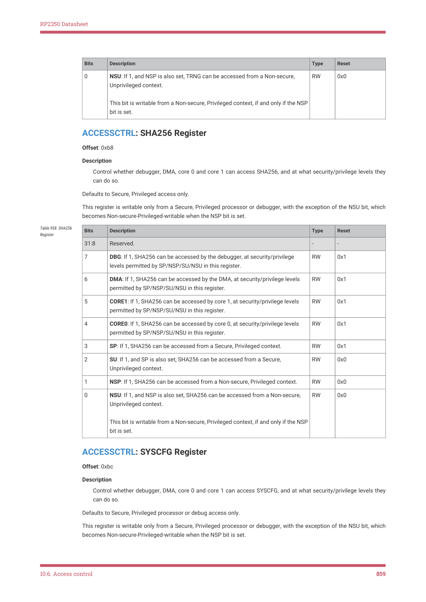

RP2350 Datasheet

| Bits | Description | Type | Reset |
| --- | --- | --- | --- |
| 0 | NSU: If 1, and NSP is also set, TRNG can be accessed from a Non-secure,
Unprivileged context.
This bit is writable from a Non-secure, Privileged context, if and only if the NSP
bit is set. | RW | 0x0 |

ACCESSCTRL: SHA256 Register

Offset: 0xb8

Description

Control whether debugger, DMA, core 0 and core 1 can access SHA256, and at what security/privilege levels they

can do so.

Defaults to Secure, Privileged access only.

This register is writable only from a Secure, Privileged processor or debugger, with the exception of the NSU bit, which

becomes Non-secure-Privileged-writable when the NSP bit is set.

| Bits | Description | Type | Reset |
| --- | --- | --- | --- |
| 31:8 | Reserved. | - | - |
| 7 | DBG: If 1, SHA256 can be accessed by the debugger, at security/privilege
levels permitted by SP/NSP/SU/NSU in this register. | RW | 0x1 |
| 6 | DMA: If 1, SHA256 can be accessed by the DMA, at security/privilege levels
permitted by SP/NSP/SU/NSU in this register. | RW | 0x1 |
| 5 | CORE1: If 1, SHA256 can be accessed by core 1, at security/privilege levels
permitted by SP/NSP/SU/NSU in this register. | RW | 0x1 |
| 4 | CORE0: If 1, SHA256 can be accessed by core 0, at security/privilege levels
permitted by SP/NSP/SU/NSU in this register. | RW | 0x1 |
| 3 | SP: If 1, SHA256 can be accessed from a Secure, Privileged context. | RW | 0x1 |
| 2 | SU: If 1, and SP is also set, SHA256 can be accessed from a Secure,
Unprivileged context. | RW | 0x0 |
| 1 | NSP: If 1, SHA256 can be accessed from a Non-secure, Privileged context. | RW | 0x0 |
| 0 | NSU: If 1, and NSP is also set, SHA256 can be accessed from a Non-secure,
Unprivileged context.
This bit is writable from a Non-secure, Privileged context, if and only if the NSP
bit is set. | RW | 0x0 |

Table 958. SHA256

ACCESSCTRL: SYSCFG Register

Offset: 0xbc

Description

Control whether debugger, DMA, core 0 and core 1 can access SYSCFG, and at what security/privilege levels they

can do so.

Defaults to Secure, Privileged processor or debug access only.

This register is writable only from a Secure, Privileged processor or debugger, with the exception of the NSU bit, which

becomes Non-secure-Privileged-writable when the NSP bit is set.

10.6. Access control
859

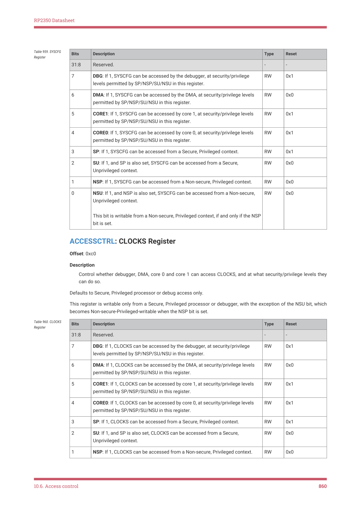

RP2350 Datasheet

| Bits | Description | Type | Reset |
| --- | --- | --- | --- |
| 31:8 | Reserved. | - | - |
| 7 | DBG: If 1, SYSCFG can be accessed by the debugger, at security/privilege
levels permitted by SP/NSP/SU/NSU in this register. | RW | 0x1 |
| 6 | DMA: If 1, SYSCFG can be accessed by the DMA, at security/privilege levels
permitted by SP/NSP/SU/NSU in this register. | RW | 0x0 |
| 5 | CORE1: If 1, SYSCFG can be accessed by core 1, at security/privilege levels
permitted by SP/NSP/SU/NSU in this register. | RW | 0x1 |
| 4 | CORE0: If 1, SYSCFG can be accessed by core 0, at security/privilege levels
permitted by SP/NSP/SU/NSU in this register. | RW | 0x1 |
| 3 | SP: If 1, SYSCFG can be accessed from a Secure, Privileged context. | RW | 0x1 |
| 2 | SU: If 1, and SP is also set, SYSCFG can be accessed from a Secure,
Unprivileged context. | RW | 0x0 |
| 1 | NSP: If 1, SYSCFG can be accessed from a Non-secure, Privileged context. | RW | 0x0 |
| 0 | NSU: If 1, and NSP is also set, SYSCFG can be accessed from a Non-secure,
Unprivileged context.
This bit is writable from a Non-secure, Privileged context, if and only if the NSP
bit is set. | RW | 0x0 |

Table 959. SYSCFG

ACCESSCTRL: CLOCKS Register

Offset: 0xc0

Description

Control whether debugger, DMA, core 0 and core 1 can access CLOCKS, and at what security/privilege levels they

can do so.

Defaults to Secure, Privileged processor or debug access only.

This register is writable only from a Secure, Privileged processor or debugger, with the exception of the NSU bit, which

becomes Non-secure-Privileged-writable when the NSP bit is set.

| Bits | Description | Type | Reset |
| --- | --- | --- | --- |
| 31:8 | Reserved. | - | - |
| 7 | DBG: If 1, CLOCKS can be accessed by the debugger, at security/privilege
levels permitted by SP/NSP/SU/NSU in this register. | RW | 0x1 |
| 6 | DMA: If 1, CLOCKS can be accessed by the DMA, at security/privilege levels
permitted by SP/NSP/SU/NSU in this register. | RW | 0x0 |
| 5 | CORE1: If 1, CLOCKS can be accessed by core 1, at security/privilege levels
permitted by SP/NSP/SU/NSU in this register. | RW | 0x1 |
| 4 | CORE0: If 1, CLOCKS can be accessed by core 0, at security/privilege levels
permitted by SP/NSP/SU/NSU in this register. | RW | 0x1 |
| 3 | SP: If 1, CLOCKS can be accessed from a Secure, Privileged context. | RW | 0x1 |
| 2 | SU: If 1, and SP is also set, CLOCKS can be accessed from a Secure,
Unprivileged context. | RW | 0x0 |
| 1 | NSP: If 1, CLOCKS can be accessed from a Non-secure, Privileged context. | RW | 0x0 |

Table 960. CLOCKS

10.6. Access control
860

RP2350 Datasheet

| Bits | Description | Type | Reset |
| --- | --- | --- | --- |
| 0 | NSU: If 1, and NSP is also set, CLOCKS can be accessed from a Non-secure,
Unprivileged context.
This bit is writable from a Non-secure, Privileged context, if and only if the NSP
bit is set. | RW | 0x0 |

ACCESSCTRL: XOSC Register

Offset: 0xc4

Description

Control whether debugger, DMA, core 0 and core 1 can access XOSC, and at what security/privilege levels they can

do so.

Defaults to Secure, Privileged processor or debug access only.

This register is writable only from a Secure, Privileged processor or debugger, with the exception of the NSU bit, which

becomes Non-secure-Privileged-writable when the NSP bit is set.

| Bits | Description | Type | Reset |
| --- | --- | --- | --- |
| 31:8 | Reserved. | - | - |
| 7 | DBG: If 1, XOSC can be accessed by the debugger, at security/privilege levels
permitted by SP/NSP/SU/NSU in this register. | RW | 0x1 |
| 6 | DMA: If 1, XOSC can be accessed by the DMA, at security/privilege levels
permitted by SP/NSP/SU/NSU in this register. | RW | 0x0 |
| 5 | CORE1: If 1, XOSC can be accessed by core 1, at security/privilege levels
permitted by SP/NSP/SU/NSU in this register. | RW | 0x1 |
| 4 | CORE0: If 1, XOSC can be accessed by core 0, at security/privilege levels
permitted by SP/NSP/SU/NSU in this register. | RW | 0x1 |
| 3 | SP: If 1, XOSC can be accessed from a Secure, Privileged context. | RW | 0x1 |
| 2 | SU: If 1, and SP is also set, XOSC can be accessed from a Secure, Unprivileged
context. | RW | 0x0 |
| 1 | NSP: If 1, XOSC can be accessed from a Non-secure, Privileged context. | RW | 0x0 |
| 0 | NSU: If 1, and NSP is also set, XOSC can be accessed from a Non-secure,
Unprivileged context.
This bit is writable from a Non-secure, Privileged context, if and only if the NSP
bit is set. | RW | 0x0 |

Table 961. XOSC

ACCESSCTRL: ROSC Register

Offset: 0xc8

Description

Control whether debugger, DMA, core 0 and core 1 can access ROSC, and at what security/privilege levels they can

do so.

Defaults to Secure, Privileged processor or debug access only.

This register is writable only from a Secure, Privileged processor or debugger, with the exception of the NSU bit, which

becomes Non-secure-Privileged-writable when the NSP bit is set.

10.6. Access control
861

RP2350 Datasheet

| Bits | Description | Type | Reset |
| --- | --- | --- | --- |
| 31:8 | Reserved. | - | - |
| 7 | DBG: If 1, ROSC can be accessed by the debugger, at security/privilege levels
permitted by SP/NSP/SU/NSU in this register. | RW | 0x1 |
| 6 | DMA: If 1, ROSC can be accessed by the DMA, at security/privilege levels
permitted by SP/NSP/SU/NSU in this register. | RW | 0x0 |
| 5 | CORE1: If 1, ROSC can be accessed by core 1, at security/privilege levels
permitted by SP/NSP/SU/NSU in this register. | RW | 0x1 |
| 4 | CORE0: If 1, ROSC can be accessed by core 0, at security/privilege levels
permitted by SP/NSP/SU/NSU in this register. | RW | 0x1 |
| 3 | SP: If 1, ROSC can be accessed from a Secure, Privileged context. | RW | 0x1 |
| 2 | SU: If 1, and SP is also set, ROSC can be accessed from a Secure, Unprivileged
context. | RW | 0x0 |
| 1 | NSP: If 1, ROSC can be accessed from a Non-secure, Privileged context. | RW | 0x0 |
| 0 | NSU: If 1, and NSP is also set, ROSC can be accessed from a Non-secure,
Unprivileged context.
This bit is writable from a Non-secure, Privileged context, if and only if the NSP
bit is set. | RW | 0x0 |

Table 962. ROSC

ACCESSCTRL: PLL_SYS Register

Offset: 0xcc

Description

Control whether debugger, DMA, core 0 and core 1 can access PLL_SYS, and at what security/privilege levels they

can do so.

Defaults to Secure, Privileged processor or debug access only.

This register is writable only from a Secure, Privileged processor or debugger, with the exception of the NSU bit, which

becomes Non-secure-Privileged-writable when the NSP bit is set.

| Bits | Description | Type | Reset |
| --- | --- | --- | --- |
| 31:8 | Reserved. | - | - |
| 7 | DBG: If 1, PLL_SYS can be accessed by the debugger, at security/privilege
levels permitted by SP/NSP/SU/NSU in this register. | RW | 0x1 |
| 6 | DMA: If 1, PLL_SYS can be accessed by the DMA, at security/privilege levels
permitted by SP/NSP/SU/NSU in this register. | RW | 0x0 |
| 5 | CORE1: If 1, PLL_SYS can be accessed by core 1, at security/privilege levels
permitted by SP/NSP/SU/NSU in this register. | RW | 0x1 |
| 4 | CORE0: If 1, PLL_SYS can be accessed by core 0, at security/privilege levels
permitted by SP/NSP/SU/NSU in this register. | RW | 0x1 |
| 3 | SP: If 1, PLL_SYS can be accessed from a Secure, Privileged context. | RW | 0x1 |
| 2 | SU: If 1, and SP is also set, PLL_SYS can be accessed from a Secure,
Unprivileged context. | RW | 0x0 |
| 1 | NSP: If 1, PLL_SYS can be accessed from a Non-secure, Privileged context. | RW | 0x0 |

Table 963. PLL_SYS

10.6. Access control
862

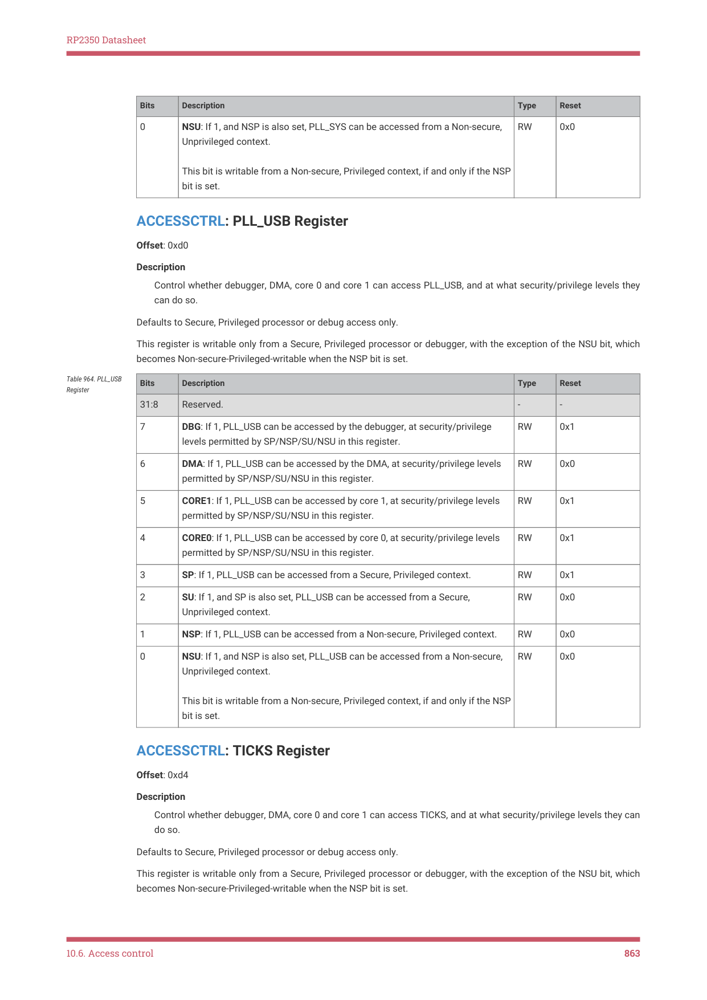

RP2350 Datasheet

| Bits | Description | Type | Reset |
| --- | --- | --- | --- |
| 0 | NSU: If 1, and NSP is also set, PLL_SYS can be accessed from a Non-secure,
Unprivileged context.
This bit is writable from a Non-secure, Privileged context, if and only if the NSP
bit is set. | RW | 0x0 |

ACCESSCTRL: PLL_USB Register

Offset: 0xd0

Description

Control whether debugger, DMA, core 0 and core 1 can access PLL_USB, and at what security/privilege levels they

can do so.

Defaults to Secure, Privileged processor or debug access only.

This register is writable only from a Secure, Privileged processor or debugger, with the exception of the NSU bit, which

becomes Non-secure-Privileged-writable when the NSP bit is set.

| Bits | Description | Type | Reset |
| --- | --- | --- | --- |
| 31:8 | Reserved. | - | - |
| 7 | DBG: If 1, PLL_USB can be accessed by the debugger, at security/privilege
levels permitted by SP/NSP/SU/NSU in this register. | RW | 0x1 |
| 6 | DMA: If 1, PLL_USB can be accessed by the DMA, at security/privilege levels
permitted by SP/NSP/SU/NSU in this register. | RW | 0x0 |
| 5 | CORE1: If 1, PLL_USB can be accessed by core 1, at security/privilege levels
permitted by SP/NSP/SU/NSU in this register. | RW | 0x1 |
| 4 | CORE0: If 1, PLL_USB can be accessed by core 0, at security/privilege levels
permitted by SP/NSP/SU/NSU in this register. | RW | 0x1 |
| 3 | SP: If 1, PLL_USB can be accessed from a Secure, Privileged context. | RW | 0x1 |
| 2 | SU: If 1, and SP is also set, PLL_USB can be accessed from a Secure,
Unprivileged context. | RW | 0x0 |
| 1 | NSP: If 1, PLL_USB can be accessed from a Non-secure, Privileged context. | RW | 0x0 |
| 0 | NSU: If 1, and NSP is also set, PLL_USB can be accessed from a Non-secure,
Unprivileged context.
This bit is writable from a Non-secure, Privileged context, if and only if the NSP
bit is set. | RW | 0x0 |

Table 964. PLL_USB

ACCESSCTRL: TICKS Register

Offset: 0xd4

Description

Control whether debugger, DMA, core 0 and core 1 can access TICKS, and at what security/privilege levels they can

do so.

Defaults to Secure, Privileged processor or debug access only.

This register is writable only from a Secure, Privileged processor or debugger, with the exception of the NSU bit, which

becomes Non-secure-Privileged-writable when the NSP bit is set.

10.6. Access control
863

RP2350 Datasheet

| Bits | Description | Type | Reset |
| --- | --- | --- | --- |
| 31:8 | Reserved. | - | - |
| 7 | DBG: If 1, TICKS can be accessed by the debugger, at security/privilege levels
permitted by SP/NSP/SU/NSU in this register. | RW | 0x1 |
| 6 | DMA: If 1, TICKS can be accessed by the DMA, at security/privilege levels
permitted by SP/NSP/SU/NSU in this register. | RW | 0x0 |
| 5 | CORE1: If 1, TICKS can be accessed by core 1, at security/privilege levels
permitted by SP/NSP/SU/NSU in this register. | RW | 0x1 |
| 4 | CORE0: If 1, TICKS can be accessed by core 0, at security/privilege levels
permitted by SP/NSP/SU/NSU in this register. | RW | 0x1 |
| 3 | SP: If 1, TICKS can be accessed from a Secure, Privileged context. | RW | 0x1 |
| 2 | SU: If 1, and SP is also set, TICKS can be accessed from a Secure,
Unprivileged context. | RW | 0x0 |
| 1 | NSP: If 1, TICKS can be accessed from a Non-secure, Privileged context. | RW | 0x0 |
| 0 | NSU: If 1, and NSP is also set, TICKS can be accessed from a Non-secure,
Unprivileged context.
This bit is writable from a Non-secure, Privileged context, if and only if the NSP
bit is set. | RW | 0x0 |

Table 965. TICKS

ACCESSCTRL: WATCHDOG Register

Offset: 0xd8

Description

Control whether debugger, DMA, core 0 and core 1 can access WATCHDOG, and at what security/privilege levels

they can do so.

Defaults to Secure, Privileged processor or debug access only.

This register is writable only from a Secure, Privileged processor or debugger, with the exception of the NSU bit, which

becomes Non-secure-Privileged-writable when the NSP bit is set.

| Bits | Description | Type | Reset |
| --- | --- | --- | --- |
| 31:8 | Reserved. | - | - |
| 7 | DBG: If 1, WATCHDOG can be accessed by the debugger, at security/privilege
levels permitted by SP/NSP/SU/NSU in this register. | RW | 0x1 |
| 6 | DMA: If 1, WATCHDOG can be accessed by the DMA, at security/privilege
levels permitted by SP/NSP/SU/NSU in this register. | RW | 0x0 |
| 5 | CORE1: If 1, WATCHDOG can be accessed by core 1, at security/privilege
levels permitted by SP/NSP/SU/NSU in this register. | RW | 0x1 |
| 4 | CORE0: If 1, WATCHDOG can be accessed by core 0, at security/privilege
levels permitted by SP/NSP/SU/NSU in this register. | RW | 0x1 |
| 3 | SP: If 1, WATCHDOG can be accessed from a Secure, Privileged context. | RW | 0x1 |
| 2 | SU: If 1, and SP is also set, WATCHDOG can be accessed from a Secure,
Unprivileged context. | RW | 0x0 |
| 1 | NSP: If 1, WATCHDOG can be accessed from a Non-secure, Privileged context. | RW | 0x0 |

Table 966.

10.6. Access control
864

RP2350 Datasheet

| Bits | Description | Type | Reset |
| --- | --- | --- | --- |
| 0 | NSU: If 1, and NSP is also set, WATCHDOG can be accessed from a Non-
secure, Unprivileged context.
This bit is writable from a Non-secure, Privileged context, if and only if the NSP
bit is set. | RW | 0x0 |

ACCESSCTRL: PSM Register

Offset: 0xdc

Description

Control whether debugger, DMA, core 0 and core 1 can access PSM, and at what security/privilege levels they can

do so.

Defaults to Secure, Privileged processor or debug access only.

This register is writable only from a Secure, Privileged processor or debugger, with the exception of the NSU bit, which

becomes Non-secure-Privileged-writable when the NSP bit is set.

| Bits | Description | Type | Reset |
| --- | --- | --- | --- |
| 31:8 | Reserved. | - | - |
| 7 | DBG: If 1, PSM can be accessed by the debugger, at security/privilege levels
permitted by SP/NSP/SU/NSU in this register. | RW | 0x1 |
| 6 | DMA: If 1, PSM can be accessed by the DMA, at security/privilege levels
permitted by SP/NSP/SU/NSU in this register. | RW | 0x0 |
| 5 | CORE1: If 1, PSM can be accessed by core 1, at security/privilege levels
permitted by SP/NSP/SU/NSU in this register. | RW | 0x1 |
| 4 | CORE0: If 1, PSM can be accessed by core 0, at security/privilege levels
permitted by SP/NSP/SU/NSU in this register. | RW | 0x1 |
| 3 | SP: If 1, PSM can be accessed from a Secure, Privileged context. | RW | 0x1 |
| 2 | SU: If 1, and SP is also set, PSM can be accessed from a Secure, Unprivileged
context. | RW | 0x0 |
| 1 | NSP: If 1, PSM can be accessed from a Non-secure, Privileged context. | RW | 0x0 |
| 0 | NSU: If 1, and NSP is also set, PSM can be accessed from a Non-secure,
Unprivileged context.
This bit is writable from a Non-secure, Privileged context, if and only if the NSP
bit is set. | RW | 0x0 |

Table 967. PSM

ACCESSCTRL: XIP_CTRL Register

Offset: 0xe0

Description

Control whether debugger, DMA, core 0 and core 1 can access XIP_CTRL, and at what security/privilege levels they

can do so.

Defaults to Secure, Privileged processor or debug access only.

This register is writable only from a Secure, Privileged processor or debugger, with the exception of the NSU bit, which

becomes Non-secure-Privileged-writable when the NSP bit is set.

10.6. Access control
865

RP2350 Datasheet

| Bits | Description | Type | Reset |
| --- | --- | --- | --- |
| 31:8 | Reserved. | - | - |
| 7 | DBG: If 1, XIP_CTRL can be accessed by the debugger, at security/privilege
levels permitted by SP/NSP/SU/NSU in this register. | RW | 0x1 |
| 6 | DMA: If 1, XIP_CTRL can be accessed by the DMA, at security/privilege levels
permitted by SP/NSP/SU/NSU in this register. | RW | 0x0 |
| 5 | CORE1: If 1, XIP_CTRL can be accessed by core 1, at security/privilege levels
permitted by SP/NSP/SU/NSU in this register. | RW | 0x1 |
| 4 | CORE0: If 1, XIP_CTRL can be accessed by core 0, at security/privilege levels
permitted by SP/NSP/SU/NSU in this register. | RW | 0x1 |
| 3 | SP: If 1, XIP_CTRL can be accessed from a Secure, Privileged context. | RW | 0x1 |
| 2 | SU: If 1, and SP is also set, XIP_CTRL can be accessed from a Secure,
Unprivileged context. | RW | 0x0 |
| 1 | NSP: If 1, XIP_CTRL can be accessed from a Non-secure, Privileged context. | RW | 0x0 |
| 0 | NSU: If 1, and NSP is also set, XIP_CTRL can be accessed from a Non-secure,
Unprivileged context.
This bit is writable from a Non-secure, Privileged context, if and only if the NSP
bit is set. | RW | 0x0 |

Table 968. XIP_CTRL

ACCESSCTRL: XIP_QMI Register

Offset: 0xe4

Description

Control whether debugger, DMA, core 0 and core 1 can access XIP_QMI, and at what security/privilege levels they

can do so.

Defaults to Secure, Privileged processor or debug access only.

This register is writable only from a Secure, Privileged processor or debugger, with the exception of the NSU bit, which

becomes Non-secure-Privileged-writable when the NSP bit is set.

| Bits | Description | Type | Reset |
| --- | --- | --- | --- |
| 31:8 | Reserved. | - | - |
| 7 | DBG: If 1, XIP_QMI can be accessed by the debugger, at security/privilege
levels permitted by SP/NSP/SU/NSU in this register. | RW | 0x1 |
| 6 | DMA: If 1, XIP_QMI can be accessed by the DMA, at security/privilege levels
permitted by SP/NSP/SU/NSU in this register. | RW | 0x0 |
| 5 | CORE1: If 1, XIP_QMI can be accessed by core 1, at security/privilege levels
permitted by SP/NSP/SU/NSU in this register. | RW | 0x1 |
| 4 | CORE0: If 1, XIP_QMI can be accessed by core 0, at security/privilege levels
permitted by SP/NSP/SU/NSU in this register. | RW | 0x1 |
| 3 | SP: If 1, XIP_QMI can be accessed from a Secure, Privileged context. | RW | 0x1 |
| 2 | SU: If 1, and SP is also set, XIP_QMI can be accessed from a Secure,
Unprivileged context. | RW | 0x0 |
| 1 | NSP: If 1, XIP_QMI can be accessed from a Non-secure, Privileged context. | RW | 0x0 |

Table 969. XIP_QMI

10.6. Access control
866
