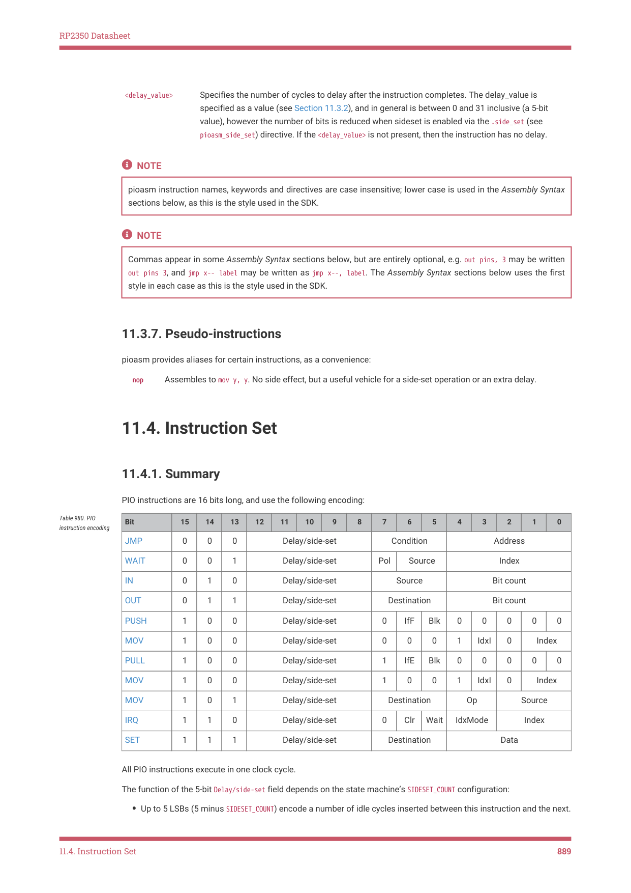

# 11.4.1. Summary

RP2350 Datasheet

<delay value>
_ | Specifies the number of cycles to delay after the instruction completes. The delay_value is
specified as a value (see Section 11.3.2), and in general is between 0 and 31 inclusive (a 5-bit
value), however the number of bits is reduced when sideset is enabled via the .side set (see
_
pioasm side set) directive. If the <delay value> is not present, then the instruction has no delay.
_ _ _

NOTE

pioasm instruction names, keywords and directives are case insensitive; lower case is used in the Assembly Syntax

sections below, as this is the style used in the SDK.

NOTE

Commas appear in some Assembly Syntax sections below, but are entirely optional, e.g. out pins, 3 may be written

out pins 3, and jmp x-- label may be written as jmp x--, label. The Assembly Syntax sections below uses the first

style in each case as this is the style used in the SDK.

11.3.7. Pseudo-instructions

pioasm provides aliases for certain instructions, as a convenience:

nop
Assembles to mov y, y. No side effect, but a useful vehicle for a side-set operation or an extra delay.

11.4. Instruction Set

11.4.1. Summary

PIO instructions are 16 bits long, and use the following encoding:

| Bit | 15 | 14 | 13 | 12 | 11 | 10 | 9 | 8 | 7 | 6 | 5 | 4 | 3 | 2 | 1 | 0 |
| --- | --- | --- | --- | --- | --- | --- | --- | --- | --- | --- | --- | --- | --- | --- | --- | --- |
| JMP | 0 | 0 | 0 |  | Del | ay/side | -set |  | C | onditio | n |  |  | Addres | s |  |
| WAIT | 0 | 0 | 1 |  | Del | ay/side | -set |  | Pol | Sou | rce |  |  | Index |  |  |
| IN | 0 | 1 | 0 |  | Del | ay/side | -set |  |  | Source |  |  | B | it coun | t |  |
| OUT | 0 | 1 | 1 |  | Del | ay/side | -set |  | De | stinati | on |  | B | it coun | t |  |
| PUSH | 1 | 0 | 0 |  | Del | ay/side | -set |  | 0 | IfF | Blk | 0 | 0 | 0 | 0 | 0 |
| MOV | 1 | 0 | 0 |  | Del | ay/side | -set |  | 0 | 0 | 0 | 1 | IdxI | 0 | Ind | ex |
| PULL | 1 | 0 | 0 |  | Del | ay/side | -set |  | 1 | IfE | Blk | 0 | 0 | 0 | 0 | 0 |
| MOV | 1 | 0 | 0 |  | Del | ay/side | -set |  | 1 | 0 | 0 | 1 | IdxI | 0 | Ind | ex |
| MOV | 1 | 0 | 1 |  | Del | ay/side | -set |  | De | stinati | on | O | p |  | Source |  |
| IRQ | 1 | 1 | 0 |  | Del | ay/side | -set |  | 0 | Clr | Wait | IdxM | ode |  | Index |  |
| SET | 1 | 1 | 1 |  | Del | ay/side | -set |  | De | stinati | on |  |  | Data |  |  |

Table 980. PIO

All PIO instructions execute in one clock cycle.

The function of the 5-bit Delay/side-set field depends on the state machine’s SIDESET_COUNT configuration:

• Up to 5 LSBs (5 minus SIDESET_COUNT) encode a number of idle cycles inserted between this instruction and the next.

11.4. Instruction Set
889
