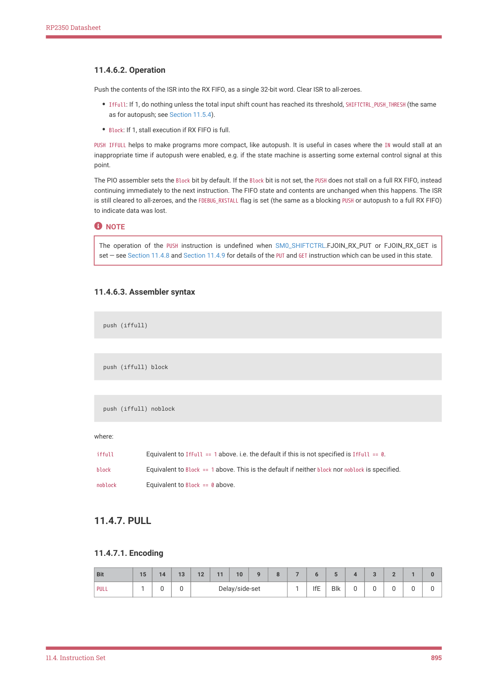

# 11.4.7. PULL

RP2350 Datasheet

11.4.6.2. Operation

Push the contents of the ISR into the RX FIFO, as a single 32-bit word. Clear ISR to all-zeroes.

• IfFull: If 1, do nothing unless the total input shift count has reached its threshold, SHIFTCTRL_PUSH_THRESH (the same

as for autopush; see Section 11.5.4).
• Block: If 1, stall execution if RX FIFO is full.

PUSH IFFULL helps to make programs more compact, like autopush. It is useful in cases where the IN would stall at an

inappropriate time if autopush were enabled, e.g. if the state machine is asserting some external control signal at this

point.

The PIO assembler sets the Block bit by default. If the Block bit is not set, the PUSH does not stall on a full RX FIFO, instead

continuing immediately to the next instruction. The FIFO state and contents are unchanged when this happens. The ISR

is still cleared to all-zeroes, and the FDEBUG_RXSTALL flag is set (the same as a blocking PUSH or autopush to a full RX FIFO)

to indicate data was lost.

NOTE

The operation of the PUSH instruction is undefined when SM0_SHIFTCTRL.FJOIN_RX_PUT or FJOIN_RX_GET is

set — see Section 11.4.8 and Section 11.4.9 for details of the PUT and GET instruction which can be used in this state.

11.4.6.3. Assembler syntax

push (iffull)

push (iffull) block

push (iffull) noblock

where:

| iffull | Equivalent to IfFull == 1 above. i.e. the default if this is not specified is IfFull == 0. |
| --- | --- |
| block | Equivalent to Block == 1 above. This is the default if neither block nor noblock is specified. |
| noblock | Equivalent to Block == 0 above. |

11.4.7. PULL

11.4.7.1. Encoding

| Bit | 15 | 14 | 13 | 12 | 11 | 10 | 9 | 8 | 7 | 6 | 5 | 4 | 3 | 2 | 1 | 0 |
| --- | --- | --- | --- | --- | --- | --- | --- | --- | --- | --- | --- | --- | --- | --- | --- | --- |
| PULL | 1 | 0 | 0 |  | Del | ay/side | -set |  | 1 | IfE | Blk | 0 | 0 | 0 | 0 | 0 |

11.4. Instruction Set
895
