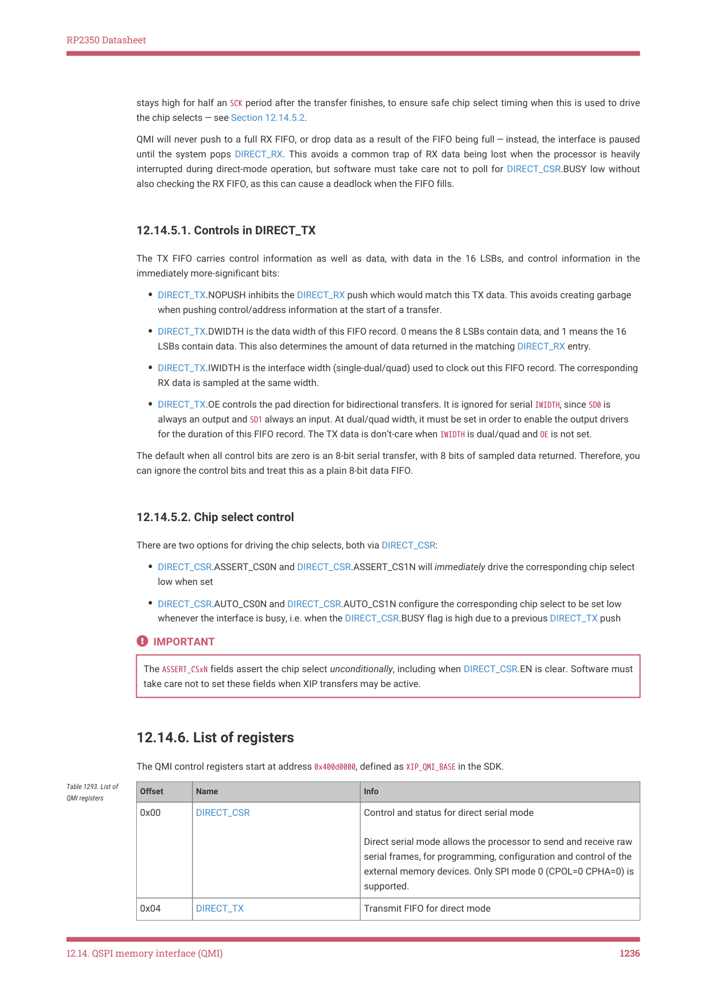
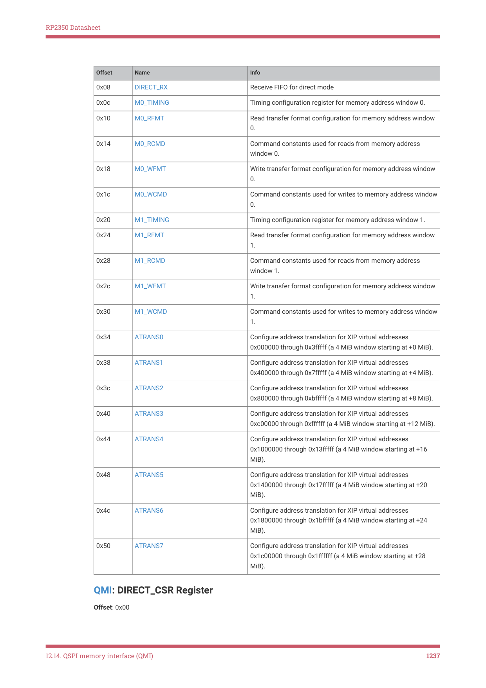
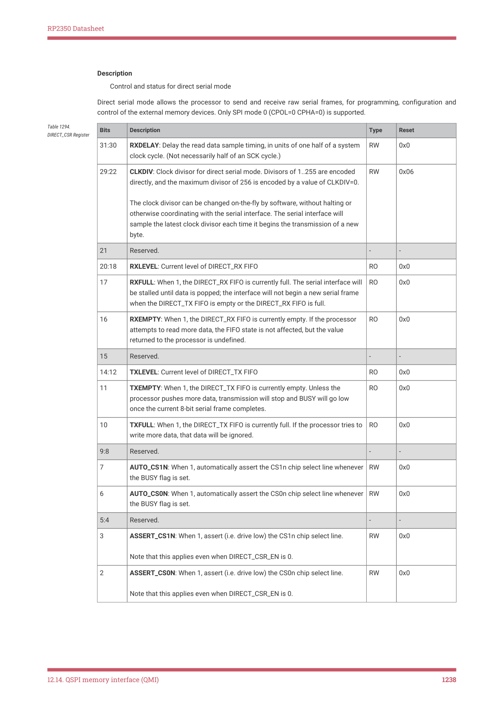
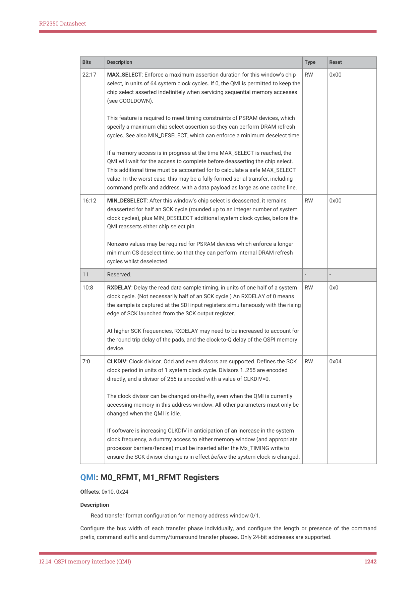
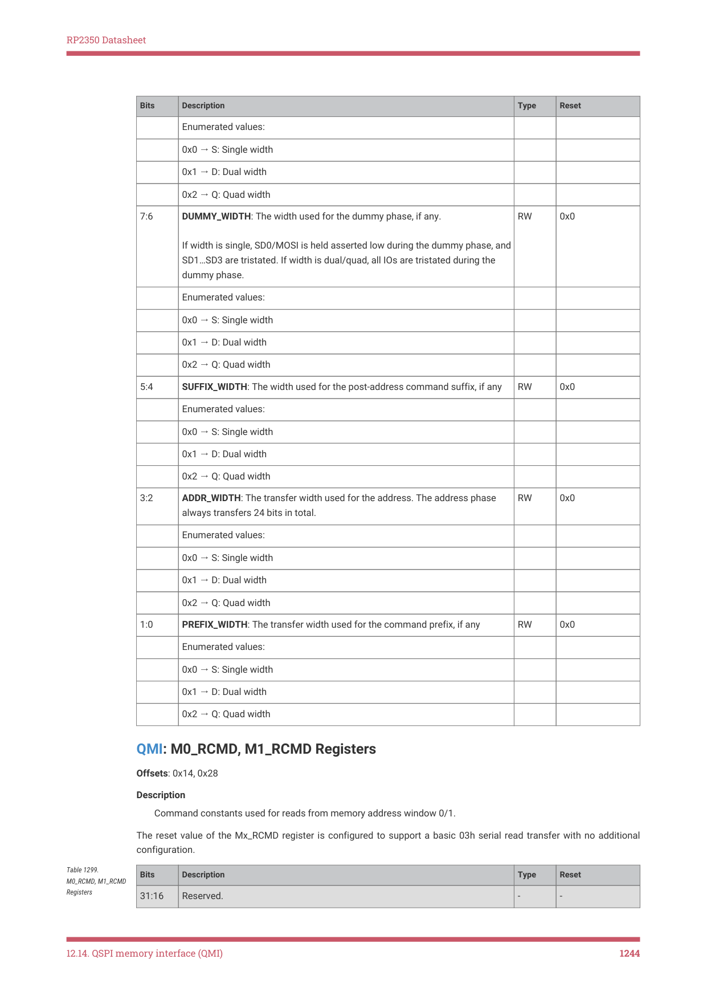
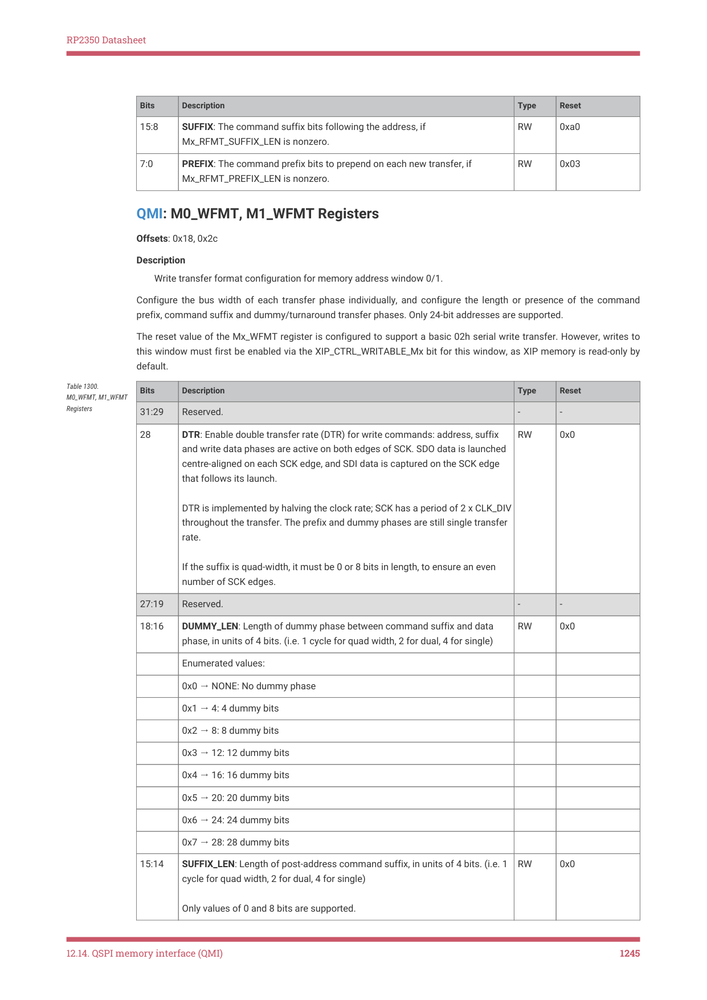
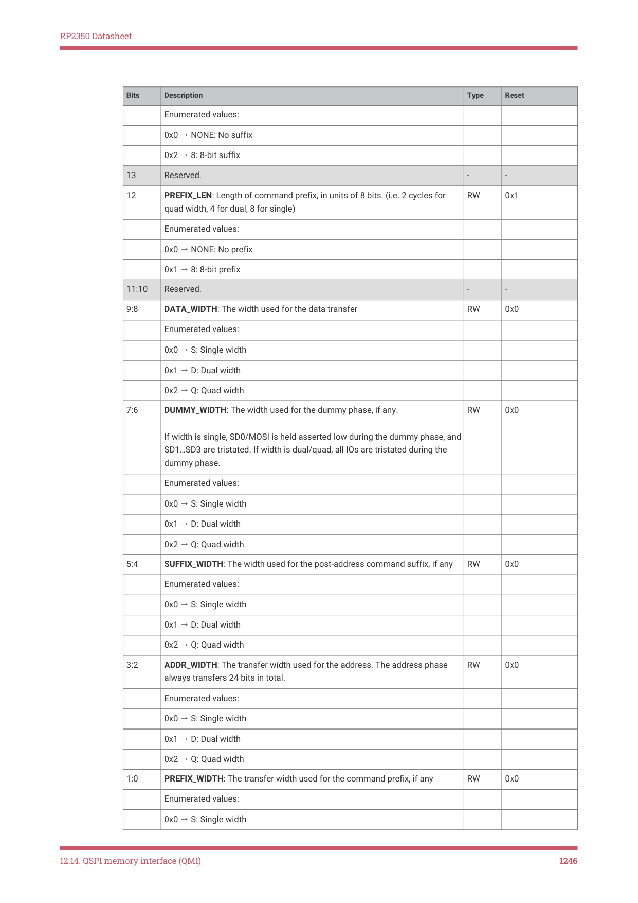

# 12.14.6. List of registers

RP2350 Datasheet

stays high for half an SCK period after the transfer finishes, to ensure safe chip select timing when this is used to drive

the chip selects — see Section 12.14.5.2.

QMI will never push to a full RX FIFO, or drop data as a result of the FIFO being full — instead, the interface is paused

until the system pops DIRECT_RX. This avoids a common trap of RX data being lost when the processor is heavily

interrupted during direct-mode operation, but software must take care not to poll for DIRECT_CSR.BUSY low without

also checking the RX FIFO, as this can cause a deadlock when the FIFO fills.

12.14.5.1. Controls in DIRECT_TX

The TX FIFO carries control information as well as data, with data in the 16 LSBs, and control information in the

immediately more-significant bits:

• DIRECT_TX.NOPUSH inhibits the DIRECT_RX push which would match this TX data. This avoids creating garbage

when pushing control/address information at the start of a transfer.
• DIRECT_TX.DWIDTH is the data width of this FIFO record. 0 means the 8 LSBs contain data, and 1 means the 16

LSBs contain data. This also determines the amount of data returned in the matching DIRECT_RX entry.
• DIRECT_TX.IWIDTH is the interface width (single-dual/quad) used to clock out this FIFO record. The corresponding

RX data is sampled at the same width.
• DIRECT_TX.OE controls the pad direction for bidirectional transfers. It is ignored for serial IWIDTH, since SD0 is

always an output and SD1 always an input. At dual/quad width, it must be set in order to enable the output drivers

for the duration of this FIFO record. The TX data is don’t-care when IWIDTH is dual/quad and OE is not set.

The default when all control bits are zero is an 8-bit serial transfer, with 8 bits of sampled data returned. Therefore, you

can ignore the control bits and treat this as a plain 8-bit data FIFO.

12.14.5.2. Chip select control

There are two options for driving the chip selects, both via DIRECT_CSR:

• DIRECT_CSR.ASSERT_CS0N and DIRECT_CSR.ASSERT_CS1N will immediately drive the corresponding chip select

low when set
• DIRECT_CSR.AUTO_CS0N and DIRECT_CSR.AUTO_CS1N configure the corresponding chip select to be set low

whenever the interface is busy, i.e. when the DIRECT_CSR.BUSY flag is high due to a previous DIRECT_TX push

IMPORTANT

The ASSERT_CSxN fields assert the chip select unconditionally, including when DIRECT_CSR.EN is clear. Software must

take care not to set these fields when XIP transfers may be active.

12.14.6. List of registers

The QMI control registers start at address 0x400d0000, defined as XIP_QMI_BASE in the SDK.

| Offset | Name | Info |
| --- | --- | --- |
| 0x00 | DIRECT_CSR | Control and status for direct serial mode
Direct serial mode allows the processor to send and receive raw
serial frames, for programming, configuration and control of the
external memory devices. Only SPI mode 0 (CPOL=0 CPHA=0) is
supported. |
| 0x04 | DIRECT_TX | Transmit FIFO for direct mode |

Table 1293. List of

12.14. QSPI memory interface (QMI)
1236

RP2350 Datasheet

| Offset | Name | Info |
| --- | --- | --- |
| 0x08 | DIRECT_RX | Receive FIFO for direct mode |
| 0x0c | M0_TIMING | Timing configuration register for memory address window 0. |
| 0x10 | M0_RFMT | Read transfer format configuration for memory address window
0. |
| 0x14 | M0_RCMD | Command constants used for reads from memory address
window 0. |
| 0x18 | M0_WFMT | Write transfer format configuration for memory address window
0. |
| 0x1c | M0_WCMD | Command constants used for writes to memory address window
0. |
| 0x20 | M1_TIMING | Timing configuration register for memory address window 1. |
| 0x24 | M1_RFMT | Read transfer format configuration for memory address window
1. |
| 0x28 | M1_RCMD | Command constants used for reads from memory address
window 1. |
| 0x2c | M1_WFMT | Write transfer format configuration for memory address window
1. |
| 0x30 | M1_WCMD | Command constants used for writes to memory address window
1. |
| 0x34 | ATRANS0 | Configure address translation for XIP virtual addresses
0x000000 through 0x3fffff (a 4 MiB window starting at +0 MiB). |
| 0x38 | ATRANS1 | Configure address translation for XIP virtual addresses
0x400000 through 0x7fffff (a 4 MiB window starting at +4 MiB). |
| 0x3c | ATRANS2 | Configure address translation for XIP virtual addresses
0x800000 through 0xbfffff (a 4 MiB window starting at +8 MiB). |
| 0x40 | ATRANS3 | Configure address translation for XIP virtual addresses
0xc00000 through 0xffffff (a 4 MiB window starting at +12 MiB). |
| 0x44 | ATRANS4 | Configure address translation for XIP virtual addresses
0x1000000 through 0x13fffff (a 4 MiB window starting at +16
MiB). |
| 0x48 | ATRANS5 | Configure address translation for XIP virtual addresses
0x1400000 through 0x17fffff (a 4 MiB window starting at +20
MiB). |
| 0x4c | ATRANS6 | Configure address translation for XIP virtual addresses
0x1800000 through 0x1bfffff (a 4 MiB window starting at +24
MiB). |
| 0x50 | ATRANS7 | Configure address translation for XIP virtual addresses
0x1c00000 through 0x1ffffff (a 4 MiB window starting at +28
MiB). |

QMI: DIRECT_CSR Register

Offset: 0x00

12.14. QSPI memory interface (QMI)
1237

RP2350 Datasheet

Description

Control and status for direct serial mode

Direct serial mode allows the processor to send and receive raw serial frames, for programming, configuration and

control of the external memory devices. Only SPI mode 0 (CPOL=0 CPHA=0) is supported.

| Bits | Description | Type | Reset |
| --- | --- | --- | --- |
| 31:30 | RXDELAY: Delay the read data sample timing, in units of one half of a system
clock cycle. (Not necessarily half of an SCK cycle.) | RW | 0x0 |
| 29:22 | CLKDIV: Clock divisor for direct serial mode. Divisors of 1..255 are encoded
directly, and the maximum divisor of 256 is encoded by a value of CLKDIV=0.
The clock divisor can be changed on-the-fly by software, without halting or
otherwise coordinating with the serial interface. The serial interface will
sample the latest clock divisor each time it begins the transmission of a new
byte. | RW | 0x06 |
| 21 | Reserved. | - | - |
| 20:18 | RXLEVEL: Current level of DIRECT_RX FIFO | RO | 0x0 |
| 17 | RXFULL: When 1, the DIRECT_RX FIFO is currently full. The serial interface will
be stalled until data is popped; the interface will not begin a new serial frame
when the DIRECT_TX FIFO is empty or the DIRECT_RX FIFO is full. | RO | 0x0 |
| 16 | RXEMPTY: When 1, the DIRECT_RX FIFO is currently empty. If the processor
attempts to read more data, the FIFO state is not affected, but the value
returned to the processor is undefined. | RO | 0x0 |
| 15 | Reserved. | - | - |
| 14:12 | TXLEVEL: Current level of DIRECT_TX FIFO | RO | 0x0 |
| 11 | TXEMPTY: When 1, the DIRECT_TX FIFO is currently empty. Unless the
processor pushes more data, transmission will stop and BUSY will go low
once the current 8-bit serial frame completes. | RO | 0x0 |
| 10 | TXFULL: When 1, the DIRECT_TX FIFO is currently full. If the processor tries to
write more data, that data will be ignored. | RO | 0x0 |
| 9:8 | Reserved. | - | - |
| 7 | AUTO_CS1N: When 1, automatically assert the CS1n chip select line whenever
the BUSY flag is set. | RW | 0x0 |
| 6 | AUTO_CS0N: When 1, automatically assert the CS0n chip select line whenever
the BUSY flag is set. | RW | 0x0 |
| 5:4 | Reserved. | - | - |
| 3 | ASSERT_CS1N: When 1, assert (i.e. drive low) the CS1n chip select line.
Note that this applies even when DIRECT_CSR_EN is 0. | RW | 0x0 |
| 2 | ASSERT_CS0N: When 1, assert (i.e. drive low) the CS0n chip select line.
Note that this applies even when DIRECT_CSR_EN is 0. | RW | 0x0 |

Table 1294.

12.14. QSPI memory interface (QMI)
1238

RP2350 Datasheet

| Bits | Description | Type | Reset |
| --- | --- | --- | --- |
| 1 | BUSY: Direct mode busy flag. If 1, data is currently being shifted in/out (or
would be if the interface were not stalled on the RX FIFO), and the chip select
must not yet be deasserted.
The busy flag will also be set to 1 if a memory-mapped transfer is still in
progress when direct mode is enabled. Direct mode blocks new memory-
mapped transfers, but can’t halt a transfer that is already in progress. If there
is a chance that memory-mapped transfers may be in progress, the busy flag
should be polled for 0 before asserting the chip select.
(In practice you will usually discover this timing condition through other
means, because any subsequent memory-mapped transfers when direct mode
is enabled will return bus errors, which are difficult to ignore.) | RO | 0x0 |
| 0 | EN: Enable direct mode.
In direct mode, software controls the chip select lines, and can perform direct
SPI transfers by pushing data to the DIRECT_TX FIFO, and popping the same
amount of data from the DIRECT_RX FIFO.
Memory-mapped accesses will generate bus errors when direct serial mode is
enabled. | RW | 0x0 |

QMI: DIRECT_TX Register

Offset: 0x04

Description

Transmit FIFO for direct mode

| Bits | Description | Type | Reset |
| --- | --- | --- | --- |
| 31:21 | Reserved. | - | - |
| 20 | NOPUSH: Inhibit the RX FIFO push that would correspond to this TX FIFO
entry.
Useful to avoid garbage appearing in the RX FIFO when pushing the command
at the beginning of a SPI transfer. | WF | 0x0 |
| 19 | OE: Output enable (active-high). For single width (SPI), this field is ignored, and
SD0 is always set to output, with SD1 always set to input.
For dual and quad width (DSPI/QSPI), this sets whether the relevant SDx pads
are set to output whilst transferring this FIFO record. In this case the
command/address should have OE set, and the data transfer should have OE
set or clear depending on the direction of the transfer. | WF | 0x0 |
| 18 | DWIDTH: Data width. If 0, hardware will transmit the 8 LSBs of the DIRECT_TX
DATA field, and return an 8-bit value in the 8 LSBs of DIRECT_RX. If 1, the full
16-bit width is used. 8-bit and 16-bit transfers can be mixed freely. | WF | 0x0 |
| 17:16 | IWIDTH: Configure whether this FIFO record is transferred with
single/dual/quad interface width (0/1/2). Different widths can be mixed freely. | WF | 0x0 |
|  | Enumerated values: |  |  |
|  | 0x0 → S: Single width |  |  |

Table 1295.

12.14. QSPI memory interface (QMI)
1239

RP2350 Datasheet

| Bits | Description | Type | Reset |
| --- | --- | --- | --- |
|  | 0x1 → D: Dual width |  |  |
|  | 0x2 → Q: Quad width |  |  |
| 15:0 | DATA: Data pushed here will be clocked out falling edges of SCK (or before
the very first rising edge of SCK, if this is the first pulse). For each byte clocked
out, the interface will simultaneously sample one byte, on rising edges of SCK,
and push this to the DIRECT_RX FIFO.
For 16-bit data, the least-significant byte is transmitted first. | WF | 0x0000 |

QMI: DIRECT_RX Register

Offset: 0x08

Description

Receive FIFO for direct mode

| Bits | Description | Type | Reset |
| --- | --- | --- | --- |
| 31:16 | Reserved. | - | - |
| 15:0 | With each byte clocked out on the serial interface, one byte will simultaneously
be clocked in, and will appear in this FIFO. The serial interface will stall when
this FIFO is full, to avoid dropping data.
When 16-bit data is pushed into the TX FIFO, the corresponding RX FIFO push
will also contain 16 bits of data. The least-significant byte is the first one
received. | RF | 0x0000 |

Table 1296.

QMI: M0_TIMING, M1_TIMING Registers

Offsets: 0x0c, 0x20

Description

Timing configuration register for memory address window 0/1.

| Bits | Description | Type | Reset |
| --- | --- | --- | --- |
| 31:30 | COOLDOWN: Chip select cooldown period. When a memory transfer finishes,
the chip select remains asserted for 64 x COOLDOWN system clock cycles,
plus half an SCK clock period (rounded up for odd SCK divisors). After this
cooldown expires, the chip select is always deasserted to save power.
If the next memory access arrives within the cooldown period, the QMI may be
able to append more SCK cycles to the currently ongoing SPI transfer, rather
than starting a new transfer. This reduces access latency and increases bus
throughput.
Specifically, the next access must be in the same direction (read/write),
access the same memory window (chip select 0/1), and follow sequentially
the address of the last transfer. If any of these are false, the new access will
first deassert the chip select, then begin a new transfer.
If COOLDOWN is 0, the address alignment configured by PAGEBREAK has
been reached, or the total chip select assertion limit MAX_SELECT has been
reached, the cooldown period is skipped, and the chip select will always be
deasserted one half SCK period after the transfer finishes. | RW | 0x1 |

Table 1297.

M0_TIMING,

M1_TIMING Registers

12.14. QSPI memory interface (QMI)
1240

RP2350 Datasheet

| Bits | Description | Type | Reset |
| --- | --- | --- | --- |
| 29:28 | PAGEBREAK: When page break is enabled, chip select will automatically
deassert when crossing certain power-of-2-aligned address boundaries. The
next access will always begin a new read/write SPI burst, even if the address
of the next access follows in sequence with the last access before the page
boundary.
Some flash and PSRAM devices forbid crossing page boundaries with a single
read/write transfer, or restrict the operating frequency for transfers that do
cross page a boundary. This option allows the QMI to safely support those
devices.
This field has no effect when COOLDOWN is disabled. | RW | 0x0 |
|  | Enumerated values: |  |  |
|  | 0x0 → NONE: No page boundary is enforced |  |  |
|  | 0x1 → 256: Break bursts crossing a 256-byte page boundary |  |  |
|  | 0x2 → 1024: Break bursts crossing a 1024-byte quad-page boundary |  |  |
|  | 0x3 → 4096: Break bursts crossing a 4096-byte sector boundary |  |  |
| 27:26 | Reserved. | - | - |
| 25 | SELECT_SETUP: Add up to one additional system clock cycle of setup
between chip select assertion and the first rising edge of SCK.
The default setup time is one half SCK period, which is usually sufficient
except for very high SCK frequencies with some flash devices. | RW | 0x0 |
| 24:23 | SELECT_HOLD: Add up to three additional system clock cycles of active hold
between the last falling edge of SCK and the deassertion of this window’s chip
select.
The default hold time is one system clock cycle. Note that flash datasheets
usually give chip select active hold time from the last rising edge of SCK, and
so even zero hold from the last falling edge would be safe.
Note that this is a minimum hold time guaranteed by the QMI: the actual chip
select active hold may be slightly longer for read transfers with low clock
divisors and/or high sample delays. Specifically, if the point two cycles after
the last RX data sample is later than the last SCK falling edge, then the hold
time is measured from this point.
Note also that, in case the final SCK pulse is masked to save energy (true for
non-DTR reads when COOLDOWN is disabled or PAGE_BREAK is reached), all
of QMI’s timing logic behaves as though the clock pulse were still present. The
SELECT_HOLD time is applied from the point where the last SCK falling edge
would be if the clock pulse were not masked. | RW | 0x0 |

12.14. QSPI memory interface (QMI)
1241

RP2350 Datasheet

| Bits | Description | Type | Reset |
| --- | --- | --- | --- |
| 22:17 | MAX_SELECT: Enforce a maximum assertion duration for this window’s chip
select, in units of 64 system clock cycles. If 0, the QMI is permitted to keep the
chip select asserted indefinitely when servicing sequential memory accesses
(see COOLDOWN).
This feature is required to meet timing constraints of PSRAM devices, which
specify a maximum chip select assertion so they can perform DRAM refresh
cycles. See also MIN_DESELECT, which can enforce a minimum deselect time.
If a memory access is in progress at the time MAX_SELECT is reached, the
QMI will wait for the access to complete before deasserting the chip select.
This additional time must be accounted for to calculate a safe MAX_SELECT
value. In the worst case, this may be a fully-formed serial transfer, including
command prefix and address, with a data payload as large as one cache line. | RW | 0x00 |
| 16:12 | MIN_DESELECT: After this window’s chip select is deasserted, it remains
deasserted for half an SCK cycle (rounded up to an integer number of system
clock cycles), plus MIN_DESELECT additional system clock cycles, before the
QMI reasserts either chip select pin.
Nonzero values may be required for PSRAM devices which enforce a longer
minimum CS deselect time, so that they can perform internal DRAM refresh
cycles whilst deselected. | RW | 0x00 |
| 11 | Reserved. | - | - |
| 10:8 | RXDELAY: Delay the read data sample timing, in units of one half of a system
clock cycle. (Not necessarily half of an SCK cycle.) An RXDELAY of 0 means
the sample is captured at the SDI input registers simultaneously with the rising
edge of SCK launched from the SCK output register.
At higher SCK frequencies, RXDELAY may need to be increased to account for
the round trip delay of the pads, and the clock-to-Q delay of the QSPI memory
device. | RW | 0x0 |
| 7:0 | CLKDIV: Clock divisor. Odd and even divisors are supported. Defines the SCK
clock period in units of 1 system clock cycle. Divisors 1..255 are encoded
directly, and a divisor of 256 is encoded with a value of CLKDIV=0.
The clock divisor can be changed on-the-fly, even when the QMI is currently
accessing memory in this address window. All other parameters must only be
changed when the QMI is idle.
If software is increasing CLKDIV in anticipation of an increase in the system
clock frequency, a dummy access to either memory window (and appropriate
processor barriers/fences) must be inserted after the Mx_TIMING write to
ensure the SCK divisor change is in effect before the system clock is changed. | RW | 0x04 |

QMI: M0_RFMT, M1_RFMT Registers

Offsets: 0x10, 0x24

Description

Read transfer format configuration for memory address window 0/1.

Configure the bus width of each transfer phase individually, and configure the length or presence of the command

prefix, command suffix and dummy/turnaround transfer phases. Only 24-bit addresses are supported.

12.14. QSPI memory interface (QMI)
1242

RP2350 Datasheet

The reset value of the Mx_RFMT register is configured to support a basic 03h serial read transfer with no additional

configuration.

| Bits | Description | Type | Reset |
| --- | --- | --- | --- |
| 31:29 | Reserved. | - | - |
| 28 | DTR: Enable double transfer rate (DTR) for read commands: address, suffix
and read data phases are active on both edges of SCK. SDO data is launched
centre-aligned on each SCK edge, and SDI data is captured on the SCK edge
that follows its launch.
DTR is implemented by halving the clock rate; SCK has a period of 2 x CLK_DIV
throughout the transfer. The prefix and dummy phases are still single transfer
rate.
If the suffix is quad-width, it must be 0 or 8 bits in length, to ensure an even
number of SCK edges. | RW | 0x0 |
| 27:19 | Reserved. | - | - |
| 18:16 | DUMMY_LEN: Length of dummy phase between command suffix and data
phase, in units of 4 bits. (i.e. 1 cycle for quad width, 2 for dual, 4 for single) | RW | 0x0 |
|  | Enumerated values: |  |  |
|  | 0x0 → NONE: No dummy phase |  |  |
|  | 0x1 → 4: 4 dummy bits |  |  |
|  | 0x2 → 8: 8 dummy bits |  |  |
|  | 0x3 → 12: 12 dummy bits |  |  |
|  | 0x4 → 16: 16 dummy bits |  |  |
|  | 0x5 → 20: 20 dummy bits |  |  |
|  | 0x6 → 24: 24 dummy bits |  |  |
|  | 0x7 → 28: 28 dummy bits |  |  |
| 15:14 | SUFFIX_LEN: Length of post-address command suffix, in units of 4 bits. (i.e. 1
cycle for quad width, 2 for dual, 4 for single)
Only values of 0 and 8 bits are supported. | RW | 0x0 |
|  | Enumerated values: |  |  |
|  | 0x0 → NONE: No suffix |  |  |
|  | 0x2 → 8: 8-bit suffix |  |  |
| 13 | Reserved. | - | - |
| 12 | PREFIX_LEN: Length of command prefix, in units of 8 bits. (i.e. 2 cycles for
quad width, 4 for dual, 8 for single) | RW | 0x1 |
|  | Enumerated values: |  |  |
|  | 0x0 → NONE: No prefix |  |  |
|  | 0x1 → 8: 8-bit prefix |  |  |
| 11:10 | Reserved. | - | - |
| 9:8 | DATA_WIDTH: The width used for the data transfer | RW | 0x0 |

Table 1298.

M0_RFMT, M1_RFMT

Registers

12.14. QSPI memory interface (QMI)
1243

RP2350 Datasheet

| Bits | Description | Type | Reset |
| --- | --- | --- | --- |
|  | Enumerated values: |  |  |
|  | 0x0 → S: Single width |  |  |
|  | 0x1 → D: Dual width |  |  |
|  | 0x2 → Q: Quad width |  |  |
| 7:6 | DUMMY_WIDTH: The width used for the dummy phase, if any.
If width is single, SD0/MOSI is held asserted low during the dummy phase, and
SD1…SD3 are tristated. If width is dual/quad, all IOs are tristated during the
dummy phase. | RW | 0x0 |
|  | Enumerated values: |  |  |
|  | 0x0 → S: Single width |  |  |
|  | 0x1 → D: Dual width |  |  |
|  | 0x2 → Q: Quad width |  |  |
| 5:4 | SUFFIX_WIDTH: The width used for the post-address command suffix, if any | RW | 0x0 |
|  | Enumerated values: |  |  |
|  | 0x0 → S: Single width |  |  |
|  | 0x1 → D: Dual width |  |  |
|  | 0x2 → Q: Quad width |  |  |
| 3:2 | ADDR_WIDTH: The transfer width used for the address. The address phase
always transfers 24 bits in total. | RW | 0x0 |
|  | Enumerated values: |  |  |
|  | 0x0 → S: Single width |  |  |
|  | 0x1 → D: Dual width |  |  |
|  | 0x2 → Q: Quad width |  |  |
| 1:0 | PREFIX_WIDTH: The transfer width used for the command prefix, if any | RW | 0x0 |
|  | Enumerated values: |  |  |
|  | 0x0 → S: Single width |  |  |
|  | 0x1 → D: Dual width |  |  |
|  | 0x2 → Q: Quad width |  |  |

QMI: M0_RCMD, M1_RCMD Registers

Offsets: 0x14, 0x28

Description

Command constants used for reads from memory address window 0/1.

The reset value of the Mx_RCMD register is configured to support a basic 03h serial read transfer with no additional

configuration.

| Bits | Description | Type | Reset |
| --- | --- | --- | --- |
| 31:16 | Reserved. | - | - |

Table 1299.

M0_RCMD, M1_RCMD

Registers

12.14. QSPI memory interface (QMI)
1244

RP2350 Datasheet

| Bits | Description | Type | Reset |
| --- | --- | --- | --- |
| 15:8 | SUFFIX: The command suffix bits following the address, if
Mx_RFMT_SUFFIX_LEN is nonzero. | RW | 0xa0 |
| 7:0 | PREFIX: The command prefix bits to prepend on each new transfer, if
Mx_RFMT_PREFIX_LEN is nonzero. | RW | 0x03 |

QMI: M0_WFMT, M1_WFMT Registers

Offsets: 0x18, 0x2c

Description

Write transfer format configuration for memory address window 0/1.

Configure the bus width of each transfer phase individually, and configure the length or presence of the command

prefix, command suffix and dummy/turnaround transfer phases. Only 24-bit addresses are supported.

The reset value of the Mx_WFMT register is configured to support a basic 02h serial write transfer. However, writes to

this window must first be enabled via the XIP_CTRL_WRITABLE_Mx bit for this window, as XIP memory is read-only by

default.

| Bits | Description | Type | Reset |
| --- | --- | --- | --- |
| 31:29 | Reserved. | - | - |
| 28 | DTR: Enable double transfer rate (DTR) for write commands: address, suffix
and write data phases are active on both edges of SCK. SDO data is launched
centre-aligned on each SCK edge, and SDI data is captured on the SCK edge
that follows its launch.
DTR is implemented by halving the clock rate; SCK has a period of 2 x CLK_DIV
throughout the transfer. The prefix and dummy phases are still single transfer
rate.
If the suffix is quad-width, it must be 0 or 8 bits in length, to ensure an even
number of SCK edges. | RW | 0x0 |
| 27:19 | Reserved. | - | - |
| 18:16 | DUMMY_LEN: Length of dummy phase between command suffix and data
phase, in units of 4 bits. (i.e. 1 cycle for quad width, 2 for dual, 4 for single) | RW | 0x0 |
|  | Enumerated values: |  |  |
|  | 0x0 → NONE: No dummy phase |  |  |
|  | 0x1 → 4: 4 dummy bits |  |  |
|  | 0x2 → 8: 8 dummy bits |  |  |
|  | 0x3 → 12: 12 dummy bits |  |  |
|  | 0x4 → 16: 16 dummy bits |  |  |
|  | 0x5 → 20: 20 dummy bits |  |  |
|  | 0x6 → 24: 24 dummy bits |  |  |
|  | 0x7 → 28: 28 dummy bits |  |  |
| 15:14 | SUFFIX_LEN: Length of post-address command suffix, in units of 4 bits. (i.e. 1
cycle for quad width, 2 for dual, 4 for single)
Only values of 0 and 8 bits are supported. | RW | 0x0 |

Table 1300.

M0_WFMT, M1_WFMT

Registers

12.14. QSPI memory interface (QMI)
1245

RP2350 Datasheet

| Bits | Description | Type | Reset |
| --- | --- | --- | --- |
|  | Enumerated values: |  |  |
|  | 0x0 → NONE: No suffix |  |  |
|  | 0x2 → 8: 8-bit suffix |  |  |
| 13 | Reserved. | - | - |
| 12 | PREFIX_LEN: Length of command prefix, in units of 8 bits. (i.e. 2 cycles for
quad width, 4 for dual, 8 for single) | RW | 0x1 |
|  | Enumerated values: |  |  |
|  | 0x0 → NONE: No prefix |  |  |
|  | 0x1 → 8: 8-bit prefix |  |  |
| 11:10 | Reserved. | - | - |
| 9:8 | DATA_WIDTH: The width used for the data transfer | RW | 0x0 |
|  | Enumerated values: |  |  |
|  | 0x0 → S: Single width |  |  |
|  | 0x1 → D: Dual width |  |  |
|  | 0x2 → Q: Quad width |  |  |
| 7:6 | DUMMY_WIDTH: The width used for the dummy phase, if any.
If width is single, SD0/MOSI is held asserted low during the dummy phase, and
SD1…SD3 are tristated. If width is dual/quad, all IOs are tristated during the
dummy phase. | RW | 0x0 |
|  | Enumerated values: |  |  |
|  | 0x0 → S: Single width |  |  |
|  | 0x1 → D: Dual width |  |  |
|  | 0x2 → Q: Quad width |  |  |
| 5:4 | SUFFIX_WIDTH: The width used for the post-address command suffix, if any | RW | 0x0 |
|  | Enumerated values: |  |  |
|  | 0x0 → S: Single width |  |  |
|  | 0x1 → D: Dual width |  |  |
|  | 0x2 → Q: Quad width |  |  |
| 3:2 | ADDR_WIDTH: The transfer width used for the address. The address phase
always transfers 24 bits in total. | RW | 0x0 |
|  | Enumerated values: |  |  |
|  | 0x0 → S: Single width |  |  |
|  | 0x1 → D: Dual width |  |  |
|  | 0x2 → Q: Quad width |  |  |
| 1:0 | PREFIX_WIDTH: The transfer width used for the command prefix, if any | RW | 0x0 |
|  | Enumerated values: |  |  |
|  | 0x0 → S: Single width |  |  |

12.14. QSPI memory interface (QMI)
1246

RP2350 Datasheet

| Bits | Description | Type | Reset |
| --- | --- | --- | --- |
|  | 0x1 → D: Dual width |  |  |
|  | 0x2 → Q: Quad width |  |  |

QMI: M0_WCMD, M1_WCMD Registers

Offsets: 0x1c, 0x30

Description

Command constants used for writes to memory address window 0/1.

The reset value of the Mx_WCMD register is configured to support a basic 02h serial write transfer with no additional

configuration.

| Bits | Description | Type | Reset |
| --- | --- | --- | --- |
| 31:16 | Reserved. | - | - |
| 15:8 | SUFFIX: The command suffix bits following the address, if
Mx_WFMT_SUFFIX_LEN is nonzero. | RW | 0xa0 |
| 7:0 | PREFIX: The command prefix bits to prepend on each new transfer, if
Mx_WFMT_PREFIX_LEN is nonzero. | RW | 0x02 |

Table 1301.

M0_WCMD,

M1_WCMD Registers

QMI: ATRANS0, ATRANS4 Registers

Offsets: 0x34, 0x44

Description

Configure address translation for a 4 MiB window of XIP virtual addresses starting at n x 4 MiB.

Address translation allows a program image to be executed in place at multiple physical flash addresses (for example,

a double-buffered flash image for over-the-air updates), without the overhead of position-independent code.

At reset, the address translation registers are initialised to an identity mapping, so that they can be ignored if address

translation is not required.

Note that the XIP cache is fully virtually addressed, so a cache flush is required after changing the address translation.

| Bits | Description | Type | Reset |
| --- | --- | --- | --- |
| 31:27 | Reserved. | - | - |
| 26:16 | SIZE: Translation aperture size for this virtual address range, in units of 4 kiB
(one flash sector).
Bits 21:12 of the virtual address are compared to SIZE. Offsets greater than
SIZE return a bus error, and do not cause a QSPI access. | RW | 0x400 |
| 15:12 | Reserved. | - | - |
| 11:0 | BASE: Physical address base for this virtual address range, in units of 4 kiB
(one flash sector).
Taking a 24-bit virtual address, firstly bits 23:22 (the two MSBs) are masked to
zero, and then BASE is added to bits 23:12 (the upper 12 bits) to form the
physical address. Translation wraps on a 16 MiB boundary. | RW | 0x000 |

Table 1302. ATRANS0,

QMI: ATRANS1, ATRANS5 Registers

Offsets: 0x38, 0x48

12.14. QSPI memory interface (QMI)
1247

RP2350 Datasheet

Description

Configure address translation for XIP virtual addresses 0x400000 through 0x7fffff (a 4 MiB window starting at +4

MiB).

Address translation allows a program image to be executed in place at multiple physical flash addresses (for example,

a double-buffered flash image for over-the-air updates), without the overhead of position-independent code.

At reset, the address translation registers are initialised to an identity mapping, so that they can be ignored if address

translation is not required.

Note that the XIP cache is fully virtually addressed, so a cache flush is required after changing the address translation.

| Bits | Description | Type | Reset |
| --- | --- | --- | --- |
| 31:27 | Reserved. | - | - |
| 26:16 | SIZE: Translation aperture size for this virtual address range, in units of 4 kiB
(one flash sector).
Bits 21:12 of the virtual address are compared to SIZE. Offsets greater than
SIZE return a bus error, and do not cause a QSPI access. | RW | 0x400 |
| 15:12 | Reserved. | - | - |
| 11:0 | BASE: Physical address base for this virtual address range, in units of 4 kiB
(one flash sector).
Taking a 24-bit virtual address, firstly bits 23:22 (the two MSBs) are masked to
zero, and then BASE is added to bits 23:12 (the upper 12 bits) to form the
physical address. Translation wraps on a 16 MiB boundary. | RW | 0x400 |

Table 1303. ATRANS1,

QMI: ATRANS2, ATRANS6 Registers

Offsets: 0x3c, 0x4c

Description

Configure address translation for XIP virtual addresses 0x800000 through 0xbfffff (a 4 MiB window starting at +8

MiB).

Address translation allows a program image to be executed in place at multiple physical flash addresses (for example,

a double-buffered flash image for over-the-air updates), without the overhead of position-independent code.

At reset, the address translation registers are initialised to an identity mapping, so that they can be ignored if address

translation is not required.

Note that the XIP cache is fully virtually addressed, so a cache flush is required after changing the address translation.

| Bits | Description | Type | Reset |
| --- | --- | --- | --- |
| 31:27 | Reserved. | - | - |
| 26:16 | SIZE: Translation aperture size for this virtual address range, in units of 4 kiB
(one flash sector).
Bits 21:12 of the virtual address are compared to SIZE. Offsets greater than
SIZE return a bus error, and do not cause a QSPI access. | RW | 0x400 |
| 15:12 | Reserved. | - | - |

Table 1304. ATRANS2,

12.14. QSPI memory interface (QMI)
1248
