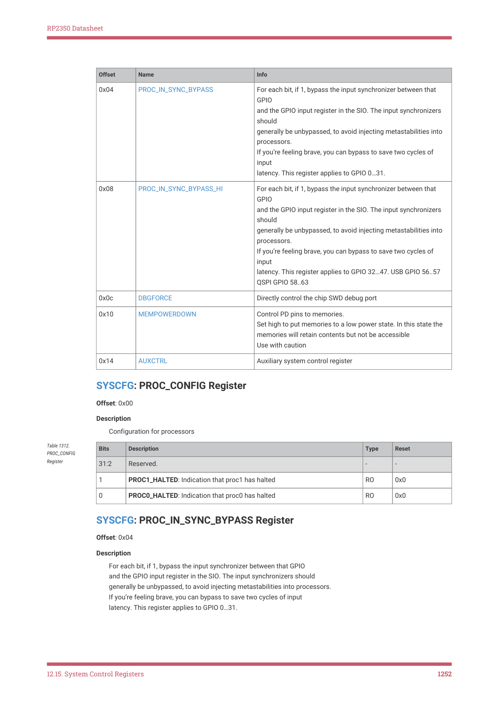

# 12.15.2. SYSCFG

RP2350 Datasheet

| Bits | Description | Type | Reset |
| --- | --- | --- | --- |
| 0 | FPGA | RO | - |

SYSINFO: GITREF_RP2350 Register

Offset: 0x14

| Bits | Description | Type | Reset |
| --- | --- | --- | --- |
| 31:0 | Git hash of the chip source. Used to identify chip version. | RO | - |

Table 1310.

GITREF_RP2350

Register

12.15.2. SYSCFG

12.15.2.1. Overview

The system config block controls miscellaneous chip settings, including:

• Check debug halt status of both cores
• Processor GPIO input synchroniser control (set to 1 to allow input synchroniser bypassing to reduce latency for

synchronous clocks)
• SWD interface control from inside the chip (allows one core to debug another, which may make debug connectivity

easier)
• State-retaining memory power down (SRAM periphery can be powered down when not in use to save a small

amount of power)

◦when powered down in this way, power is still applied to the SRAM storage array; use the Power Manager

(Chapter 6) to completely remove power
• Additional controls found in the AUXCTRL register

12.15.2.2. Changes from RP2040

• Moved the NMI mask to per-core registers in the EPPB (Section 3.7.5.1). The new registers reset on a processor

warm reset, which avoids issues with NMIs asserting during the bootrom early boot process.
• Expanded MEMPOWERDOWN to cover new memory banks
• Removed controls from DBGFORCE to account for the new single-DP debug topology

12.15.2.3. List of registers

The system config registers start at a base address of 0x40008000 (defined as SYSCFG_BASE in SDK).

| Offset | Name | Info |
| --- | --- | --- |
| 0x00 | PROC_CONFIG | Configuration for processors |

Table 1311. List of

12.15. System Control Registers
1251

RP2350 Datasheet

| Offset | Name | Info |
| --- | --- | --- |
| 0x04 | PROC_IN_SYNC_BYPASS | For each bit, if 1, bypass the input synchronizer between that
GPIO
and the GPIO input register in the SIO. The input synchronizers
should
generally be unbypassed, to avoid injecting metastabilities into
processors.
If you’re feeling brave, you can bypass to save two cycles of
input
latency. This register applies to GPIO 0…31. |
| 0x08 | PROC_IN_SYNC_BYPASS_HI | For each bit, if 1, bypass the input synchronizer between that
GPIO
and the GPIO input register in the SIO. The input synchronizers
should
generally be unbypassed, to avoid injecting metastabilities into
processors.
If you’re feeling brave, you can bypass to save two cycles of
input
latency. This register applies to GPIO 32…47. USB GPIO 56..57
QSPI GPIO 58..63 |
| 0x0c | DBGFORCE | Directly control the chip SWD debug port |
| 0x10 | MEMPOWERDOWN | Control PD pins to memories.
Set high to put memories to a low power state. In this state the
memories will retain contents but not be accessible
Use with caution |
| 0x14 | AUXCTRL | Auxiliary system control register |

SYSCFG: PROC_CONFIG Register

Offset: 0x00

Description

Configuration for processors

| Bits | Description | Type | Reset |
| --- | --- | --- | --- |
| 31:2 | Reserved. | - | - |
| 1 | PROC1_HALTED: Indication that proc1 has halted | RO | 0x0 |
| 0 | PROC0_HALTED: Indication that proc0 has halted | RO | 0x0 |

Table 1312.

PROC_CONFIG

Register

SYSCFG: PROC_IN_SYNC_BYPASS Register

Offset: 0x04

Description

For each bit, if 1, bypass the input synchronizer between that GPIO

and the GPIO input register in the SIO. The input synchronizers should

generally be unbypassed, to avoid injecting metastabilities into processors.

If you’re feeling brave, you can bypass to save two cycles of input

latency. This register applies to GPIO 0…31.

12.15. System Control Registers
1252

RP2350 Datasheet

| Bits | Description | Type | Reset |
| --- | --- | --- | --- |
| 31:0 | GPIO | RW | 0x00000000 |

Table 1313.

PROC_IN_SYNC_BYPA

SS Register

SYSCFG: PROC_IN_SYNC_BYPASS_HI Register

Offset: 0x08

Description

For each bit, if 1, bypass the input synchronizer between that GPIO

and the GPIO input register in the SIO. The input synchronizers should

generally be unbypassed, to avoid injecting metastabilities into processors.

If you’re feeling brave, you can bypass to save two cycles of input

latency. This register applies to GPIO 32…47. USB GPIO 56..57 QSPI GPIO 58..63

| Bits | Description | Type | Reset |
| --- | --- | --- | --- |
| 31:28 | QSPI_SD | RW | 0x0 |
| 27 | QSPI_CSN | RW | 0x0 |
| 26 | QSPI_SCK | RW | 0x0 |
| 25 | USB_DM | RW | 0x0 |
| 24 | USB_DP | RW | 0x0 |
| 23:16 | Reserved. | - | - |
| 15:0 | GPIO | RW | 0x0000 |

Table 1314.

PROC_IN_SYNC_BYPA

SS_HI Register

SYSCFG: DBGFORCE Register

Offset: 0x0c

Description

Directly control the chip SWD debug port

| Bits | Description | Type | Reset |
| --- | --- | --- | --- |
| 31:4 | Reserved. | - | - |
| 3 | ATTACH: Attach chip debug port to syscfg controls, and disconnect it from
external SWD pads. | RW | 0x0 |
| 2 | SWCLK: Directly drive SWCLK, if ATTACH is set | RW | 0x1 |
| 1 | SWDI: Directly drive SWDIO input, if ATTACH is set | RW | 0x1 |
| 0 | SWDO: Observe the value of SWDIO output. | RO | - |

Table 1315.

SYSCFG: MEMPOWERDOWN Register

Offset: 0x10

Description

Control PD pins to memories.

Set high to put memories to a low power state. In this state the memories will retain contents but not be accessible

Use with caution

| Bits | Description | Type | Reset |
| --- | --- | --- | --- |
| 31:13 | Reserved. | - | - |
| 12 | BOOTRAM | RW | 0x0 |

Table 1316.

MEMPOWERDOWN

Register

12.15. System Control Registers
1253
