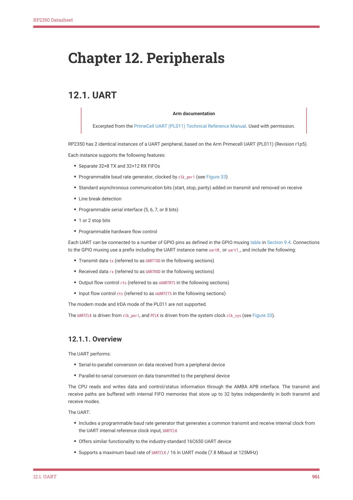

# 12.1.1. Overview

RP2350 Datasheet

Chapter 12. Peripherals

12.1. UART

Arm documentation

Excerpted from the PrimeCell UART (PL011) Technical Reference Manual. Used with permission.

RP2350 has 2 identical instances of a UART peripheral, based on the Arm Primecell UART (PL011) (Revision r1p5).

Each instance supports the following features:

• Separate 32×8 TX and 32×12 RX FIFOs
• Programmable baud rate generator, clocked by clk_peri (see Figure 33)
• Standard asynchronous communication bits (start, stop, parity) added on transmit and removed on receive
• Line break detection
• Programmable serial interface (5, 6, 7, or 8 bits)
• 1 or 2 stop bits
• Programmable hardware flow control

Each UART can be connected to a number of GPIO pins as defined in the GPIO muxing table in Section 9.4. Connections

to the GPIO muxing use a prefix including the UART instance name uart0_ or uart1_, and include the following:

• Transmit data tx (referred to as UARTTXD in the following sections)
• Received data rx (referred to as UARTRXD in the following sections)
• Output flow control rts (referred to as nUARTRTS in the following sections)
• Input flow control cts (referred to as nUARTCTS in the following sections)

The modem mode and IrDA mode of the PL011 are not supported.

The UARTCLK is driven from clk_peri, and PCLK is driven from the system clock clk_sys (see Figure 33).

12.1.1. Overview

The UART performs:

• Serial-to-parallel conversion on data received from a peripheral device
• Parallel-to-serial conversion on data transmitted to the peripheral device

The CPU reads and writes data and control/status information through the AMBA APB interface. The transmit and

receive paths are buffered with internal FIFO memories that store up to 32 bytes independently in both transmit and

receive modes.

The UART:

• Includes a programmable baud rate generator that generates a common transmit and receive internal clock from

the UART internal reference clock input, UARTCLK
• Offers similar functionality to the industry-standard 16C650 UART device
• Supports a maximum baud rate of UARTCLK / 16 in UART mode (7.8 Mbaud at 125MHz)

12.1. UART
961
