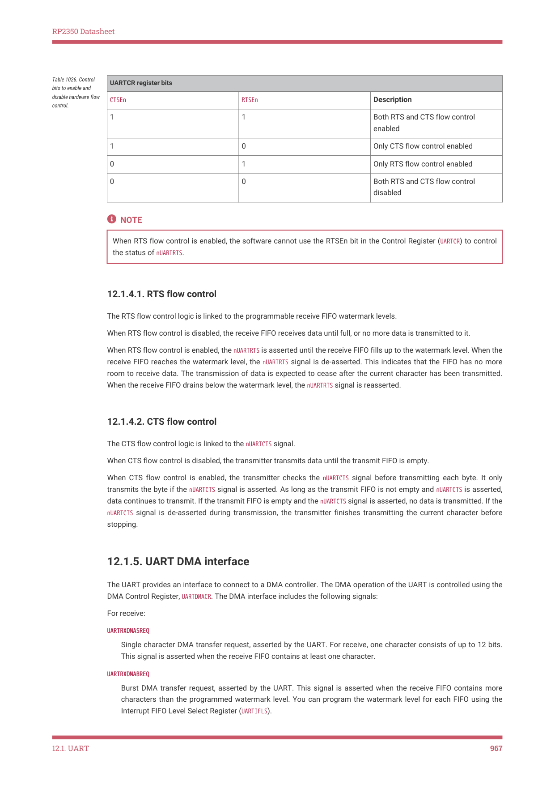
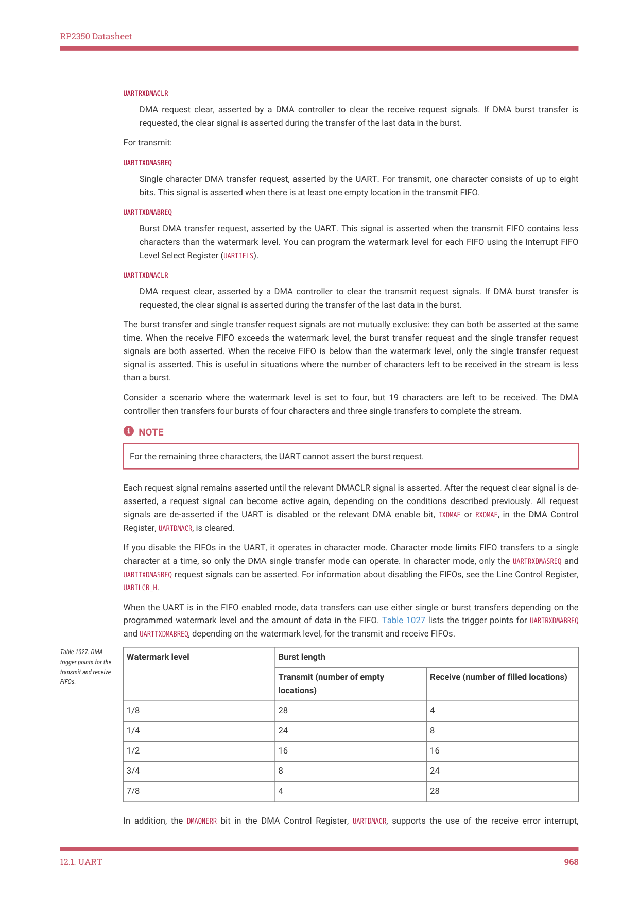

# 12.1.5. UART DMA interface

RP2350 Datasheet

| UARTCR register bits |  |  |
| --- | --- | --- |
| CTSEn | RTSEn | Description |
| 1 | 1 | Both RTS and CTS flow control
enabled |
| 1 | 0 | Only CTS flow control enabled |
| 0 | 1 | Only RTS flow control enabled |
| 0 | 0 | Both RTS and CTS flow control
disabled |

Table 1026. Control

bits to enable and

disable hardware flow

control.

NOTE

When RTS flow control is enabled, the software cannot use the RTSEn bit in the Control Register (UARTCR) to control

the status of nUARTRTS.

12.1.4.1. RTS flow control

The RTS flow control logic is linked to the programmable receive FIFO watermark levels.

When RTS flow control is disabled, the receive FIFO receives data until full, or no more data is transmitted to it.

When RTS flow control is enabled, the nUARTRTS is asserted until the receive FIFO fills up to the watermark level. When the

receive FIFO reaches the watermark level, the nUARTRTS signal is de-asserted. This indicates that the FIFO has no more

room to receive data. The transmission of data is expected to cease after the current character has been transmitted.

When the receive FIFO drains below the watermark level, the nUARTRTS signal is reasserted.

12.1.4.2. CTS flow control

The CTS flow control logic is linked to the nUARTCTS signal.

When CTS flow control is disabled, the transmitter transmits data until the transmit FIFO is empty.

When CTS flow control is enabled, the transmitter checks the nUARTCTS signal before transmitting each byte. It only

transmits the byte if the nUARTCTS signal is asserted. As long as the transmit FIFO is not empty and nUARTCTS is asserted,

data continues to transmit. If the transmit FIFO is empty and the nUARTCTS signal is asserted, no data is transmitted. If the

nUARTCTS signal is de-asserted during transmission, the transmitter finishes transmitting the current character before

stopping.

12.1.5. UART DMA interface

The UART provides an interface to connect to a DMA controller. The DMA operation of the UART is controlled using the

DMA Control Register, UARTDMACR. The DMA interface includes the following signals:

For receive:

UARTRXDMASREQ

Single character DMA transfer request, asserted by the UART. For receive, one character consists of up to 12 bits.

This signal is asserted when the receive FIFO contains at least one character.

UARTRXDMABREQ

Burst DMA transfer request, asserted by the UART. This signal is asserted when the receive FIFO contains more

characters than the programmed watermark level. You can program the watermark level for each FIFO using the

Interrupt FIFO Level Select Register (UARTIFLS).

12.1. UART
967

RP2350 Datasheet

UARTRXDMACLR

DMA request clear, asserted by a DMA controller to clear the receive request signals. If DMA burst transfer is

requested, the clear signal is asserted during the transfer of the last data in the burst.

For transmit:

UARTTXDMASREQ

Single character DMA transfer request, asserted by the UART. For transmit, one character consists of up to eight

bits. This signal is asserted when there is at least one empty location in the transmit FIFO.

UARTTXDMABREQ

Burst DMA transfer request, asserted by the UART. This signal is asserted when the transmit FIFO contains less

characters than the watermark level. You can program the watermark level for each FIFO using the Interrupt FIFO

Level Select Register (UARTIFLS).

UARTTXDMACLR

DMA request clear, asserted by a DMA controller to clear the transmit request signals. If DMA burst transfer is

requested, the clear signal is asserted during the transfer of the last data in the burst.

The burst transfer and single transfer request signals are not mutually exclusive: they can both be asserted at the same

time. When the receive FIFO exceeds the watermark level, the burst transfer request and the single transfer request

signals are both asserted. When the receive FIFO is below than the watermark level, only the single transfer request

signal is asserted. This is useful in situations where the number of characters left to be received in the stream is less

than a burst.

Consider a scenario where the watermark level is set to four, but 19 characters are left to be received. The DMA

controller then transfers four bursts of four characters and three single transfers to complete the stream.

NOTE

For the remaining three characters, the UART cannot assert the burst request.

Each request signal remains asserted until the relevant DMACLR signal is asserted. After the request clear signal is de-

asserted, a request signal can become active again, depending on the conditions described previously. All request

signals are de-asserted if the UART is disabled or the relevant DMA enable bit, TXDMAE or RXDMAE, in the DMA Control

Register, UARTDMACR, is cleared.

If you disable the FIFOs in the UART, it operates in character mode. Character mode limits FIFO transfers to a single

character at a time, so only the DMA single transfer mode can operate. In character mode, only the UARTRXDMASREQ and

UARTTXDMASREQ request signals can be asserted. For information about disabling the FIFOs, see the Line Control Register,

UARTLCR_H.

When the UART is in the FIFO enabled mode, data transfers can use either single or burst transfers depending on the

programmed watermark level and the amount of data in the FIFO. Table 1027 lists the trigger points for UARTRXDMABREQ

and UARTTXDMABREQ, depending on the watermark level, for the transmit and receive FIFOs.

| Watermark level | Burst length |  |
| --- | --- | --- |
|  | Transmit (number of empty
locations) | Receive (number of filled locations) |
| 1/8 | 28 | 4 |
| 1/4 | 24 | 8 |
| 1/2 | 16 | 16 |
| 3/4 | 8 | 24 |
| 7/8 | 4 | 28 |

Table 1027. DMA

trigger points for the

transmit and receive

FIFOs.

In addition, the DMAONERR bit in the DMA Control Register, UARTDMACR, supports the use of the receive error interrupt,

12.1. UART
968
