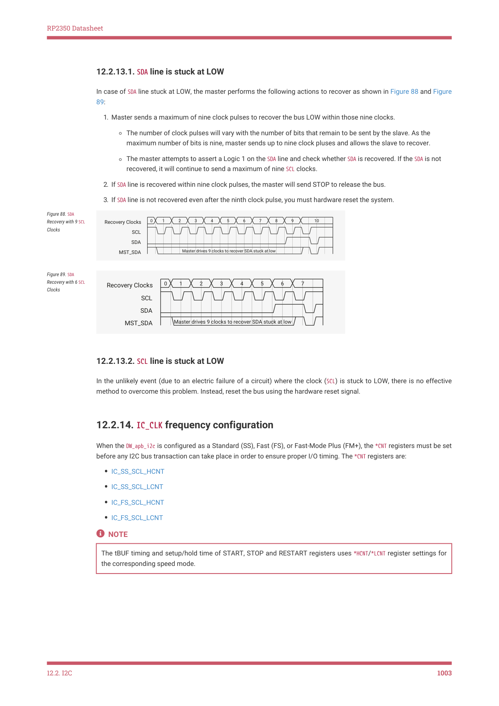

# 12.2.14. IC_CLK frequency configuration

RP2350 Datasheet

12.2.13.1. SDA line is stuck at LOW

In case of SDA line stuck at LOW, the master performs the following actions to recover as shown in Figure 88 and Figure

89:

1. Master sends a maximum of nine clock pulses to recover the bus LOW within those nine clocks.

◦The number of clock pulses will vary with the number of bits that remain to be sent by the slave. As the

maximum number of bits is nine, master sends up to nine clock pluses and allows the slave to recover.

◦The master attempts to assert a Logic 1 on the SDA line and check whether SDA is recovered. If the SDA is not

recovered, it will continue to send a maximum of nine SCL clocks.

2. If SDA line is recovered within nine clock pulses, the master will send STOP to release the bus.

3. If SDA line is not recovered even after the ninth clock pulse, you must hardware reset the system.

Figure 88. SDA

| 0 | 1 |  | 2 |  | 3 |  |  |  | 5 |  |  | 6 | 7 |  | 8 |  | 9 |  |  | 1 | 0 |  |
| --- | --- | --- | --- | --- | --- | --- | --- | --- | --- | --- | --- | --- | --- | --- | --- | --- | --- | --- | --- | --- | --- | --- |
|  |  |  |  |  |  |  |  |  |  |  |  |  |  |  |  |  |  |  |  |  |  |  |
|  |  |  |  |  |  |  |  |  |  |  |  |  |  |  |  |  |  |  |  |  |  |  |
|  |  |  |  |  |  |  |  |  |  |  |  |  |  |  |  |  |  |  |  |  |  |  |
|  |  |  |  |  |  |  |  |  |  |  |  |  |  |  |  |  |  |  |  |  |  |  |
|  |  |  |  |  |  |  |  |  |  |  |  |  |  |  |  |  |  |  |  |  |  |  |
|  |  |  |  | Mas | ter | driv | es 9 | clock | s to | rec | over | SDA | stuc | k at | low |  |  |  |  |  |  |  |

Recovery with 9 SCL

Recovery Clocks

Clocks

SCL

SDA

MST_SDA

Figure 89. SDA

|  |  | 1 |  |  |  |  | 4 |  |  |  | 6 |  |  | 7 |  |
| --- | --- | --- | --- | --- | --- | --- | --- | --- | --- | --- | --- | --- | --- | --- | --- |
|  |  |  |  |  |  |  |  |  |  |  |  |  |  |  |  |
|  |  |  |  |  |  |  |  |  |  |  |  |  |  |  |  |
|  |  |  |  |  |  |  |  |  |  |  |  |  |  |  |  |
|  |  |  |  |  |  |  |  |  |  |  |  |  |  |  |  |
|  |  |  |  |  |  |  |  |  |  |  |  |  |  |  |  |
|  | Ma | ster | drive | s 9 | cloc | ks to | reco | ver | SDA | stuc | k at l | ow |  |  |  |

Recovery with 6 SCL

Recovery Clocks

Clocks

SCL

SDA

MST_SDA

12.2.13.2. SCL line is stuck at LOW

In the unlikely event (due to an electric failure of a circuit) where the clock (SCL) is stuck to LOW, there is no effective

method to overcome this problem. Instead, reset the bus using the hardware reset signal.

12.2.14. IC_CLK frequency configuration

When the DW_apb_i2c is configured as a Standard (SS), Fast (FS), or Fast-Mode Plus (FM+), the *CNT registers must be set

before any I2C bus transaction can take place in order to ensure proper I/O timing. The *CNT registers are:

• IC_SS_SCL_HCNT
• IC_SS_SCL_LCNT
• IC_FS_SCL_HCNT
• IC_FS_SCL_LCNT

NOTE

The tBUF timing and setup/hold time of START, STOP and RESTART registers uses *HCNT/*LCNT register settings for

the corresponding speed mode.

12.2. I2C
1003

RP2350 Datasheet

NOTE

It is not necessary to program any of the *CNT registers if the DW_apb_i2c is enabled to operate only as an I2C slave,

since these registers are used only to determine the SCL timing requirements for operation as an I2C master.

Table 1052 lists the derivation of I2C timing parameters from the *CNT programming registers.

| Timing Parameter | Symbol | Standard Speed | Fast Speed / Fast Speed Plus |
| --- | --- | --- | --- |
| LOW period of the SCL clock | tLOW | IC_SS_SCL_LCNT | IC_FS_SCL_LCNT |
| HIGH period of the SCL clock | tHIGH | IC_SS_SCL_HCNT | IC_FS_SCL_HCNT |
| Setup time for a repeated
START condition | tSU;STA | IC_SS_SCL_LCNT | IC_FS_SCL_HCNT |
| Hold time (repeated) START
condition | tHD;STA | IC_SS_SCL_HCNT | IC_FS_SCL_HCNT |
| Setup time for STOP
condition | tSU;STO | IC_SS_SCL_HCNT | IC_FS_SCL_HCNT |
| Bus free time between a
STOP and a START
condition | tBUF | IC_SS_SCL_LCNT | IC_FS_SCL_LCNT |
| Spike length | tSP | IC_FS_SPKLEN | IC_FS_SPKLEN |
| Data hold time | tHD;DAT | IC_SDA_HOLD | IC_SDA_HOLD |
| Data setup time | tSU;DAT | IC_SDA_SETUP | IC_SDA_SETUP |

Table 1052. Derivation

of I2C Timing

Parameters from

*CNT Registers

12.2.14.1. Minimum high and low counts in SS, FS, and FM+ modes.

When the DW_apb_i2c operates as an I2C master, in both transmit and receive transfers:

• IC_SS_SCL_LCNT and IC_FS_SCL_LCNT register values must be larger than IC_FS_SPKLEN + 7.
• IC_SS_SCL_HCNT and IC_FS_SCL_HCNT register values must be larger than IC_FS_SPKLEN + 5.

Details regarding the DW_apb_i2c high and low counts are as follows:

• The minimum value of IC_*_SPKLEN + 7 for the *_LCNT registers is due to the time required for the DW_apb_i2c to drive

SDA after a negative edge of SCL.
• The minimum value of IC_*_SPKLEN + 5 for the *_HCNT registers is due to the time required for the DW_apb_i2c to

sample SDA during the high period of SCL.
• The DW_apb_i2c adds one cycle to the programmed *_LCNT value in order to generate the low period of the SCL clock;

this is due to the counting logic for SCL low counting to (*_LCNT + 1).
• The DW_apb_i2c adds IC_*_SPKLEN + 7 cycles to the programmed *_HCNT value in order to generate the high period of

the SCL clock, due to the following factors:

◦The counting logic for SCL high counts to (*_HCNT + 1).

◦The digital filtering applied to the SCL line incurs a delay of SPKLEN + 2 ic_clk cycles, where SPKLEN is

IC_FS_SPKLEN if the component is operating in SS or FS.

◦Whenever SCL is driven one to zero by the DW_apb_i2c (completing the SCL high time) an internal logic latency of

three ic_clk cycles is incurred. Consequently, the minimum SCL low time of which the DW_apb_i2c is capable is

nine ic_clk periods (7 + 1 + 1), while the minimum SCL high time is thirteen ic_clk periods (6 + 1 + 3 + 3).

12.2. I2C
1004

RP2350 Datasheet

NOTE

The total high time and low time of SCL generated by the DW_apb_i2c master is also influenced by the rise time and fall

time of the SCL line, as shown in the illustration and equations in Figure 90. SCL rise and fall time parameters vary

depending on external factors such as:

• Characteristics of the IO driver
• Pull-up resistor value
• Total capacitance on SCL line

These characteristics are beyond the control of the DW_apb_i2c.

Figure 90. Impact of

SCL Rise Time and Fall

Time on Generated

ic_clk

SCL

ic_clk_in_a/SCL

HCNT + IC_*_SPKLEN + 7

LCNT + 1

SCL 
rise time

SCL 
fall time

SCL 
rise time

SCL_High_time = [(HCNT + IC_*_SPKLEN + 7) * ic_clk] + SCL_Fall_time

SCL_low_time = [(LCNT + 1) * ic_clk] - SCL_Fall_time + SCL_Rise_time

12.2.14.2. Minimum IC_CLK frequency

This section describes the minimum ic_clk frequencies that the DW_apb_i2c supports for each speed mode, and the

associated high and low count values. In slave mode, IC_SDA_HOLD (Thd;dat) and IC_SDA_SETUP (Tsu:dat) need to be

programmed to satisfy the I2C protocol timing requirements. The following examples are for the case where

IC_FS_SPKLEN is programmed to two.

12.2.14.2.1. Standard Mode (SM), Fast Mode (FM), and Fast Mode Plus (FM+)

This section details how to derive a minimum ic_clk value for standard and fast modes of the DW_apb_i2c. Although the

following method shows how to do fast mode calculations, you can also use the same method in order to do

calculations for standard mode and fast mode plus.

NOTE

The following computations do not consider the SCL_Rise_time and SCL_Fall_time.

Given conditions and calculations for the minimum DW_apb_i2c ic_clk value in fast mode:

• Fast mode has data rate of 400 kb/s; implies SCL period of 1/400 kHz = 2.5μs
• Minimum hcnt value of 14 as a seed value; IC_HCNT_FS = 14
• Protocol minimum SCL high and low times:

◦MIN_SCL_LOWtime_FS = 1300 ns

◦MIN_SCL_HIGHtime_FS = 600 ns

Derived equations:

12.2. I2C
1005

RP2350 Datasheet

SCL_PERIOD_FS / (IC_HCNT_FS + IC_LCNT_FS) = IC_CLK_PERIOD

IC_LCNT_FS × IC_CLK_PERIOD = MIN_SCL_LOWtime_FS

Combined, the previous equations produce the following:

IC_LCNT_FS × (SCL_PERIOD_FS / (IC_LCNT_FS + IC_HCNT_FS) ) = MIN_SCL_LOWtime_FS

Solving for IC_LCNT_FS:

IC_LCNT_FS × (2.5μs / (IC_LCNT_FS + 14) ) = 1.3μs

The previous equation gives:

IC_LCNT_FS = roundup(15.166) = 16

These calculations produce IC_LCNT_FS = 16 and IC_HCNT_FS = 14, giving an ic_clk value of:

2.5μs / (16 + 14) = 83.3ns = 12 MHz

Testing these results shows that protocol requirements are satisfied.

Table 1053 lists the minimum ic_clk values for all modes with high and low count values.

| Speed Mode | ic_clkfreq
(MHz) | Minimum
Value of
IC_*_SPKLEN | SCL Low Time
in `ic_clk`s | SCL Low
Program
Value | SCL Low Time | SCL High
Time in
`ic_clk`s | SCL High
Program
Value | SCL High
Time |
| --- | --- | --- | --- | --- | --- | --- | --- | --- |
| SS | 2.7 | 1 | 13 | 12 | 4.7μs | 14 | 6 | 5.2μs |
| FS | 12.0 | 1 | 16 | 15 | 1.33μs | 14 | 6 | 1.16μs |
| FM+ | 32 | 2 | 16 | 15 | 500 ns | 16 | 7 | 500 ns |

Table 1053. ic_clk in

Relation to High and

Low Counts

• The IC_*_SCL_LCNT and IC_*_SCL_HCNT registers are programmed using the SCL low and high program values in Table

1053, which are calculated using SCL low count minus one, and SCL high counts minus eight, respectively. The

values in Table 1053 are based on IC_SDA_RX_HOLD = 0. The maximum IC_SDA_RX_HOLD value depends on the IC_*CNT

registers in Master mode.
• In order to compute the HCNT and LCNT considering RC timings, use the following equations:

◦IC_HCNT_* = [(HCNT + IC_*_SPKLEN + 7) * ic_clk] + SCL_Fall_time

◦IC_LCNT_* = [(LCNT + 1) * ic_clk] - SCL_Fall_time + SCL_Rise_time

12.2.14.3. Calculating high and low counts

The calculations below show how to calculate SCL high and low counts for each speed mode in the DW_apb_i2c. For the

calculations to work, the ic_clk frequencies used must not be less than the minimum ic_clk frequencies specified in

Table 1053.

The default ic_clk period value is set to 100 ns, so default SCL high and low count values are calculated for each speed

12.2. I2C
1006
