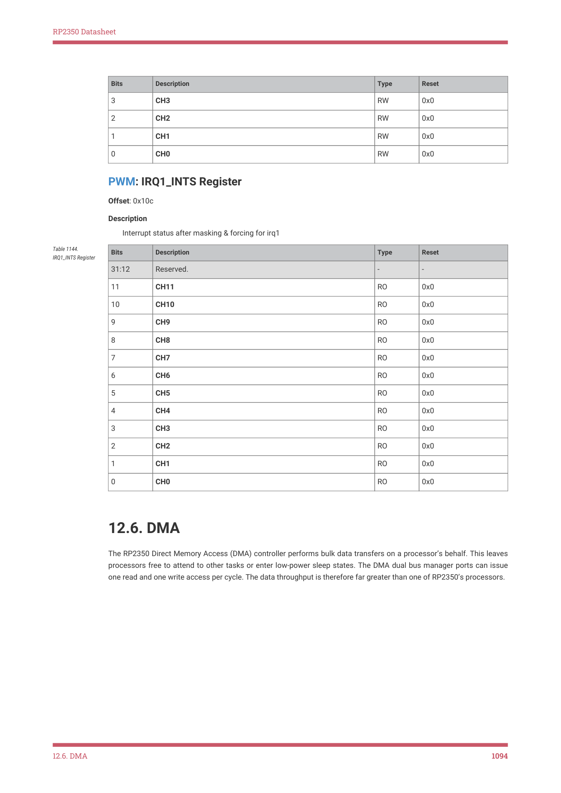

# 12.6. DMA

RP2350 Datasheet

| Bits | Description | Type | Reset |
| --- | --- | --- | --- |
| 3 | CH3 | RW | 0x0 |
| 2 | CH2 | RW | 0x0 |
| 1 | CH1 | RW | 0x0 |
| 0 | CH0 | RW | 0x0 |

PWM: IRQ1_INTS Register

Offset: 0x10c

Description

Interrupt status after masking & forcing for irq1

| Bits | Description | Type | Reset |
| --- | --- | --- | --- |
| 31:12 | Reserved. | - | - |
| 11 | CH11 | RO | 0x0 |
| 10 | CH10 | RO | 0x0 |
| 9 | CH9 | RO | 0x0 |
| 8 | CH8 | RO | 0x0 |
| 7 | CH7 | RO | 0x0 |
| 6 | CH6 | RO | 0x0 |
| 5 | CH5 | RO | 0x0 |
| 4 | CH4 | RO | 0x0 |
| 3 | CH3 | RO | 0x0 |
| 2 | CH2 | RO | 0x0 |
| 1 | CH1 | RO | 0x0 |
| 0 | CH0 | RO | 0x0 |

Table 1144.

12.6. DMA

The RP2350 Direct Memory Access (DMA) controller performs bulk data transfers on a processor’s behalf. This leaves

processors free to attend to other tasks or enter low-power sleep states. The DMA dual bus manager ports can issue

one read and one write access per cycle. The data throughput is therefore far greater than one of RP2350’s processors.

12.6. DMA
1094
