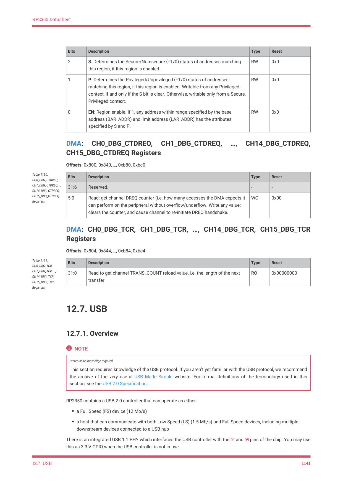

# 12.7.1. Overview

RP2350 Datasheet

| Bits | Description | Type | Reset |
| --- | --- | --- | --- |
| 2 | S: Determines the Secure/Non-secure (=1/0) status of addresses matching
this region, if this region is enabled. | RW | 0x0 |
| 1 | P: Determines the Privileged/Unprivileged (=1/0) status of addresses
matching this region, if this region is enabled. Writable from any Privileged
context, if and only if the S bit is clear. Otherwise, writable only from a Secure,
Privileged context. | RW | 0x0 |
| 0 | EN: Region enable. If 1, any address within range specified by the base
address (BAR_ADDR) and limit address (LAR_ADDR) has the attributes
specified by S and P. | RW | 0x0 |

DMA: 
CH0_DBG_CTDREQ, 
CH1_DBG_CTDREQ, 
…, 
CH14_DBG_CTDREQ,
CH15_DBG_CTDREQ Registers

Offsets: 0x800, 0x840, …, 0xb80, 0xbc0

| Bits | Description | Type | Reset |
| --- | --- | --- | --- |
| 31:6 | Reserved. | - | - |
| 5:0 | Read: get channel DREQ counter (i.e. how many accesses the DMA expects it
can perform on the peripheral without overflow/underflow. Write any value:
clears the counter, and cause channel to re-initiate DREQ handshake. | WC | 0x00 |

Table 1190.

CH0_DBG_CTDREQ,

CH1_DBG_CTDREQ, …,

CH14_DBG_CTDREQ,

CH15_DBG_CTDREQ

Registers

DMA: CH0_DBG_TCR, CH1_DBG_TCR, …, CH14_DBG_TCR, CH15_DBG_TCR
Registers

Offsets: 0x804, 0x844, …, 0xb84, 0xbc4

| Bits | Description | Type | Reset |
| --- | --- | --- | --- |
| 31:0 | Read to get channel TRANS_COUNT reload value, i.e. the length of the next
transfer | RO | 0x00000000 |

Table 1191.

CH0_DBG_TCR,

CH1_DBG_TCR, …,

CH14_DBG_TCR,

CH15_DBG_TCR

Registers

12.7. USB

12.7.1. Overview

NOTE

Prerequisite knowledge required

This section requires knowledge of the USB protocol. If you aren’t yet familiar with the USB protocol, we recommend

the archive of the very useful USB Made Simple website. For formal definitions of the terminology used in this

section, see the USB 2.0 Specification.

RP2350 contains a USB 2.0 controller that can operate as either:

• a Full Speed (FS) device (12 Mb/s)
• a host that can communicate with both Low Speed (LS) (1.5 Mb/s) and Full Speed devices, including multiple

downstream devices connected to a USB hub

There is an integrated USB 1.1 PHY which interfaces the USB controller with the DP and DM pins of the chip. You may use

this as 3.3 V GPIO when the USB controller is not in use.

12.7. USB
1141
