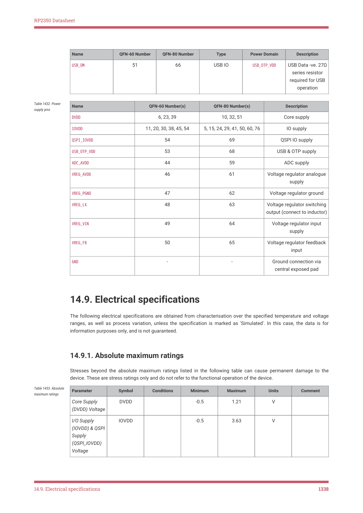

# 14.9.1. Absolute maximum ratings

RP2350 Datasheet

| Name | QFN-60 Number | QFN-80 Number | Type | Power Domain | Description |
| --- | --- | --- | --- | --- | --- |
| USB DM
_ | 51 | 66 | USB IO | USB OTP VDD
_ _ | USB Data -ve. 27Ω
series resistor
required for USB
operation |

| Name | QFN-60 Number(s) | QFN-80 Number(s) | Description |
| --- | --- | --- | --- |
| DVDD | 6, 23, 39 | 10, 32, 51 | Core supply |
| IOVDD | 11, 20, 30, 38, 45, 54 | 5, 15, 24, 29, 41, 50, 60, 76 | IO supply |
| QSPI IOVDD
_ | 54 | 69 | QSPI IO supply |
| USB OTP VDD
_ _ | 53 | 68 | USB & OTP supply |
| ADC AVDD
_ | 44 | 59 | ADC supply |
| VREG AVDD
_ | 46 | 61 | Voltage regulator analogue
supply |
| VREG PGND
_ | 47 | 62 | Voltage regulator ground |
| VREG LX
_ | 48 | 63 | Voltage regulator switching
output (connect to inductor) |
| VREG VIN
_ | 49 | 64 | Voltage regulator input
supply |
| VREG FB
_ | 50 | 65 | Voltage regulator feedback
input |
| GND | - | - | Ground connection via
central exposed pad |

Table 1432. Power

14.9. Electrical specifications

The following electrical specifications are obtained from characterisation over the specified temperature and voltage

ranges, as well as process variation, unless the specification is marked as 'Simulated'. In this case, the data is for

information purposes only, and is not guaranteed.

14.9.1. Absolute maximum ratings

Stresses beyond the absolute maximum ratings listed in the following table can cause permanent damage to the

device. These are stress ratings only and do not refer to the functional operation of the device.

| Parameter | Symbol | Conditions | Minimum | Maximum | Units | Comment |
| --- | --- | --- | --- | --- | --- | --- |
| Core Supply
(DVDD) Voltage | DVDD |  | -0.5 | 1.21 | V |  |
| I/O Supply
(IOVDD) & QSPI
Supply
(QSPI_IOVDD)
Voltage | IOVDD |  | -0.5 | 3.63 | V |  |

Table 1433. Absolute

14.9. Electrical specifications
1338
