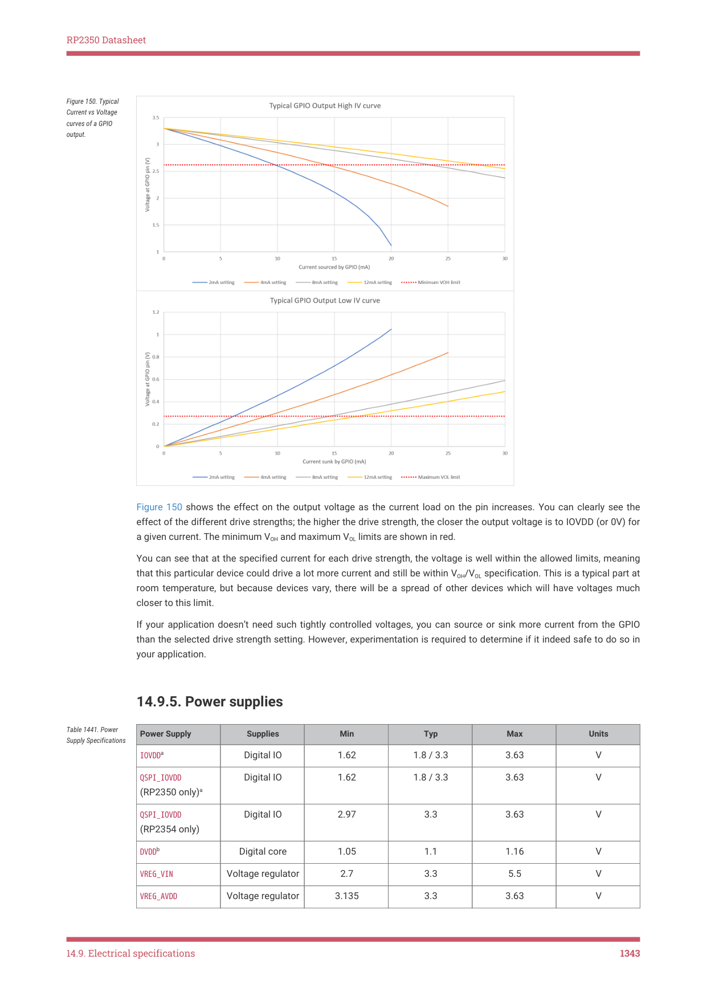

# 14.9.5. Power supplies

RP2350 Datasheet

Figure 150. Typical

Current vs Voltage

curves of a GPIO

output.

Figure 150 shows the effect on the output voltage as the current load on the pin increases. You can clearly see the

effect of the different drive strengths; the higher the drive strength, the closer the output voltage is to IOVDD (or 0V) for

a given current. The minimum VOH and maximum VOL limits are shown in red.

You can see that at the specified current for each drive strength, the voltage is well within the allowed limits, meaning

that this particular device could drive a lot more current and still be within VOH/VOL specification. This is a typical part at

room temperature, but because devices vary, there will be a spread of other devices which will have voltages much

closer to this limit.

If your application doesn’t need such tightly controlled voltages, you can source or sink more current from the GPIO

than the selected drive strength setting. However, experimentation is required to determine if it indeed safe to do so in

your application.

14.9.5. Power supplies

| Power Supply | Supplies | Min | Typ | Max | Units |
| --- | --- | --- | --- | --- | --- |
| IOVDDa | Digital IO | 1.62 | 1.8 / 3.3 | 3.63 | V |
| QSPI IOVDD
_
(RP2350 only)a | Digital IO | 1.62 | 1.8 / 3.3 | 3.63 | V |
| QSPI IOVDD
_
(RP2354 only) | Digital IO | 2.97 | 3.3 | 3.63 | V |
| DVDDb | Digital core | 1.05 | 1.1 | 1.16 | V |
| VREG VIN
_ | Voltage regulator | 2.7 | 3.3 | 5.5 | V |
| VREG AVDD
_ | Voltage regulator | 3.135 | 3.3 | 3.63 | V |

Table 1441. Power

14.9. Electrical specifications
1343

## Embedded Images

