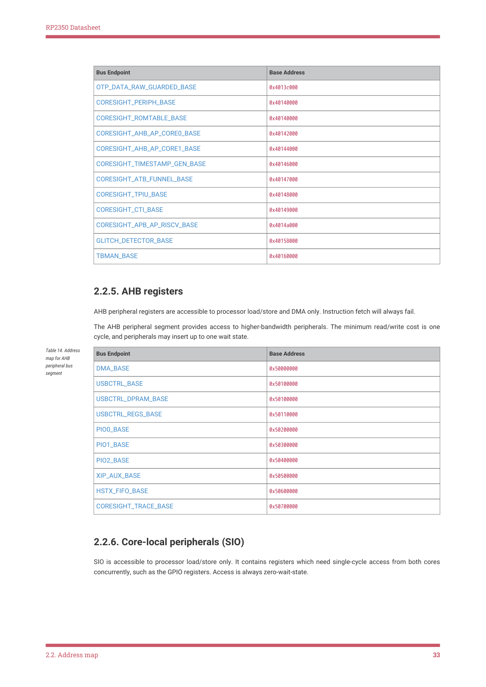

# 2.2.6. Core-local peripherals (SIO)

RP2350 Datasheet

| Bus Endpoint | Base Address |
| --- | --- |
| OTP_DATA_RAW_GUARDED_BASE | 0x4013c000 |
| CORESIGHT_PERIPH_BASE | 0x40140000 |
| CORESIGHT_ROMTABLE_BASE | 0x40140000 |
| CORESIGHT_AHB_AP_CORE0_BASE | 0x40142000 |
| CORESIGHT_AHB_AP_CORE1_BASE | 0x40144000 |
| CORESIGHT_TIMESTAMP_GEN_BASE | 0x40146000 |
| CORESIGHT_ATB_FUNNEL_BASE | 0x40147000 |
| CORESIGHT_TPIU_BASE | 0x40148000 |
| CORESIGHT_CTI_BASE | 0x40149000 |
| CORESIGHT_APB_AP_RISCV_BASE | 0x4014a000 |
| GLITCH_DETECTOR_BASE | 0x40158000 |
| TBMAN_BASE | 0x40160000 |

2.2.5. AHB registers

AHB peripheral registers are accessible to processor load/store and DMA only. Instruction fetch will always fail.

The AHB peripheral segment provides access to higher-bandwidth peripherals. The minimum read/write cost is one

cycle, and peripherals may insert up to one wait state.

| Bus Endpoint | Base Address |
| --- | --- |
| DMA_BASE | 0x50000000 |
| USBCTRL_BASE | 0x50100000 |
| USBCTRL_DPRAM_BASE | 0x50100000 |
| USBCTRL_REGS_BASE | 0x50110000 |
| PIO0_BASE | 0x50200000 |
| PIO1_BASE | 0x50300000 |
| PIO2_BASE | 0x50400000 |
| XIP_AUX_BASE | 0x50500000 |
| HSTX_FIFO_BASE | 0x50600000 |
| CORESIGHT_TRACE_BASE | 0x50700000 |

Table 14. Address

map for AHB

peripheral bus

segment

2.2.6. Core-local peripherals (SIO)

SIO is accessible to processor load/store only. It contains registers which need single-cycle access from both cores

concurrently, such as the GPIO registers. Access is always zero-wait-state.

2.2. Address map
33
