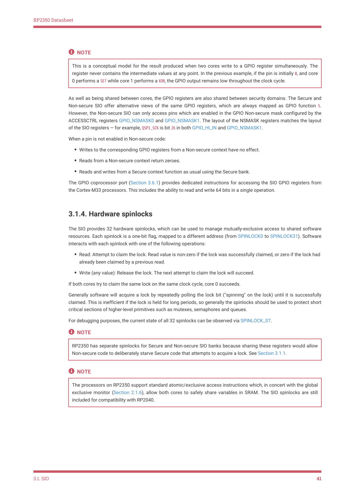

# 3.1.4. Hardware spinlocks

RP2350 Datasheet

NOTE

This is a conceptual model for the result produced when two cores write to a GPIO register simultaneously. The

register never contains the intermediate values at any point. In the previous example, if the pin is initially 0, and core

0 performs a SET while core 1 performs a XOR, the GPIO output remains low throughout the clock cycle.

As well as being shared between cores, the GPIO registers are also shared between security domains. The Secure and

Non-secure SIO offer alternative views of the same GPIO registers, which are always mapped as GPIO function 5.

However, the Non-secure SIO can only access pins which are enabled in the GPIO Non-secure mask configured by the

ACCESSCTRL registers GPIO_NSMASK0 and GPIO_NSMASK1. The layout of the NSMASK registers matches the layout

of the SIO registers — for example, QSPI_SCK is bit 26 in both GPIO_HI_IN and GPIO_NSMASK1.

When a pin is not enabled in Non-secure code:

• Writes to the corresponding GPIO registers from a Non-secure context have no effect.
• Reads from a Non-secure context return zeroes.
• Reads and writes from a Secure context function as usual using the Secure bank.

The GPIO coprocessor port (Section 3.6.1) provides dedicated instructions for accessing the SIO GPIO registers from

the Cortex-M33 processors. This includes the ability to read and write 64 bits in a single operation.

3.1.4. Hardware spinlocks

The SIO provides 32 hardware spinlocks, which can be used to manage mutually-exclusive access to shared software

resources. Each spinlock is a one-bit flag, mapped to a different address (from SPINLOCK0 to SPINLOCK31). Software

interacts with each spinlock with one of the following operations:

• Read: Attempt to claim the lock. Read value is non-zero if the lock was successfully claimed, or zero if the lock had

already been claimed by a previous read.
• Write (any value): Release the lock. The next attempt to claim the lock will succeed.

If both cores try to claim the same lock on the same clock cycle, core 0 succeeds.

Generally software will acquire a lock by repeatedly polling the lock bit ("spinning" on the lock) until it is successfully

claimed. This is inefficient if the lock is held for long periods, so generally the spinlocks should be used to protect short

critical sections of higher-level primitives such as mutexes, semaphores and queues.

For debugging purposes, the current state of all 32 spinlocks can be observed via SPINLOCK_ST.

NOTE

RP2350 has separate spinlocks for Secure and Non-secure SIO banks because sharing these registers would allow

Non-secure code to deliberately starve Secure code that attempts to acquire a lock. See Section 3.1.1.

NOTE

The processors on RP2350 support standard atomic/exclusive access instructions which, in concert with the global

exclusive monitor (Section 2.1.6), allow both cores to safely share variables in SRAM. The SIO spinlocks are still

included for compatibility with RP2040.

3.1. SIO
41
