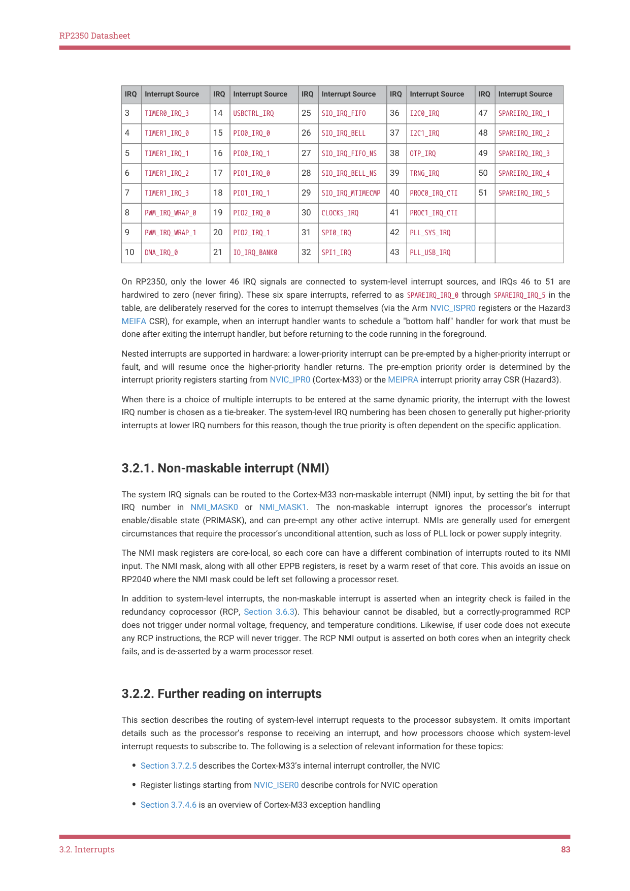

# 3.2.2. Further reading on interrupts

RP2350 Datasheet

| IRQ | Interrupt Source | IRQ | Interrupt Source | IRQ | Interrupt Source | IRQ | Interrupt Source | IRQ | Interrupt Source |
| --- | --- | --- | --- | --- | --- | --- | --- | --- | --- |
| 3 | TIMER0 IRQ 3
_ _ | 14 | USBCTRL IRQ
_ | 25 | SIO IRQ FIFO
_ _ | 36 | I2C0 IRQ
_ | 47 | SPAREIRQ IRQ 1
_ _ |
| 4 | TIMER1 IRQ 0
_ _ | 15 | PIO0 IRQ 0
_ _ | 26 | SIO IRQ BELL
_ _ | 37 | I2C1 IRQ
_ | 48 | SPAREIRQ IRQ 2
_ _ |
| 5 | TIMER1 IRQ 1
_ _ | 16 | PIO0 IRQ 1
_ _ | 27 | SIO IRQ FIFO NS
_ _ _ | 38 | OTP IRQ
_ | 49 | SPAREIRQ IRQ 3
_ _ |
| 6 | TIMER1 IRQ 2
_ _ | 17 | PIO1 IRQ 0
_ _ | 28 | SIO IRQ BELL NS
_ _ _ | 39 | TRNG IRQ
_ | 50 | SPAREIRQ IRQ 4
_ _ |
| 7 | TIMER1 IRQ 3
_ _ | 18 | PIO1 IRQ 1
_ _ | 29 | SIO IRQ MTIMECMP
_ _ | 40 | PROC0 IRQ CTI
_ _ | 51 | SPAREIRQ IRQ 5
_ _ |
| 8 | PWM IRQ WRAP 0
_ _ _ | 19 | PIO2 IRQ 0
_ _ | 30 | CLOCKS IRQ
_ | 41 | PROC1 IRQ CTI
_ _ |  |  |
| 9 | PWM IRQ WRAP 1
_ _ _ | 20 | PIO2 IRQ 1
_ _ | 31 | SPI0 IRQ
_ | 42 | PLL SYS IRQ
_ _ |  |  |
| 10 | DMA IRQ 0
_ _ | 21 | IO IRQ BANK0
_ _ | 32 | SPI1 IRQ
_ | 43 | PLL USB IRQ
_ _ |  |  |

On RP2350, only the lower 46 IRQ signals are connected to system-level interrupt sources, and IRQs 46 to 51 are

hardwired to zero (never firing). These six spare interrupts, referred to as SPAREIRQ_IRQ_0 through SPAREIRQ_IRQ_5 in the

table, are deliberately reserved for the cores to interrupt themselves (via the Arm NVIC_ISPR0 registers or the Hazard3

MEIFA CSR), for example, when an interrupt handler wants to schedule a "bottom half" handler for work that must be

done after exiting the interrupt handler, but before returning to the code running in the foreground.

Nested interrupts are supported in hardware: a lower-priority interrupt can be pre-empted by a higher-priority interrupt or

fault, and will resume once the higher-priority handler returns. The pre-emption priority order is determined by the

interrupt priority registers starting from NVIC_IPR0 (Cortex-M33) or the MEIPRA interrupt priority array CSR (Hazard3).

When there is a choice of multiple interrupts to be entered at the same dynamic priority, the interrupt with the lowest

IRQ number is chosen as a tie-breaker. The system-level IRQ numbering has been chosen to generally put higher-priority

interrupts at lower IRQ numbers for this reason, though the true priority is often dependent on the specific application.

3.2.1. Non-maskable interrupt (NMI)

The system IRQ signals can be routed to the Cortex-M33 non-maskable interrupt (NMI) input, by setting the bit for that

IRQ number in NMI_MASK0 or NMI_MASK1. The non-maskable interrupt ignores the processor’s interrupt

enable/disable state (PRIMASK), and can pre-empt any other active interrupt. NMIs are generally used for emergent

circumstances that require the processor’s unconditional attention, such as loss of PLL lock or power supply integrity.

The NMI mask registers are core-local, so each core can have a different combination of interrupts routed to its NMI

input. The NMI mask, along with all other EPPB registers, is reset by a warm reset of that core. This avoids an issue on

RP2040 where the NMI mask could be left set following a processor reset.

In addition to system-level interrupts, the non-maskable interrupt is asserted when an integrity check is failed in the

redundancy coprocessor (RCP, Section 3.6.3). This behaviour cannot be disabled, but a correctly-programmed RCP

does not trigger under normal voltage, frequency, and temperature conditions. Likewise, if user code does not execute

any RCP instructions, the RCP will never trigger. The RCP NMI output is asserted on both cores when an integrity check

fails, and is de-asserted by a warm processor reset.

3.2.2. Further reading on interrupts

This section describes the routing of system-level interrupt requests to the processor subsystem. It omits important

details such as the processor’s response to receiving an interrupt, and how processors choose which system-level

interrupt requests to subscribe to. The following is a selection of relevant information for these topics:

• Section 3.7.2.5 describes the Cortex-M33’s internal interrupt controller, the NVIC
• Register listings starting from NVIC_ISER0 describe controls for NVIC operation
• Section 3.7.4.6 is an overview of Cortex-M33 exception handling

3.2. Interrupts
83
