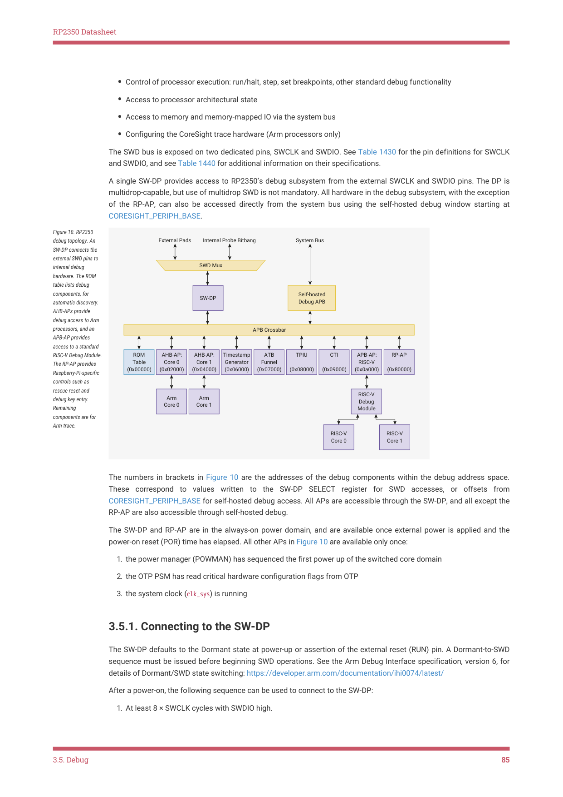

# 3.5.1. Connecting to the SW-DP

RP2350 Datasheet

• Control of processor execution: run/halt, step, set breakpoints, other standard debug functionality
• Access to processor architectural state
• Access to memory and memory-mapped IO via the system bus
• Configuring the CoreSight trace hardware (Arm processors only)

The SWD bus is exposed on two dedicated pins, SWCLK and SWDIO. See Table 1430 for the pin definitions for SWCLK

and SWDIO, and see Table 1440 for additional information on their specifications.

A single SW-DP provides access to RP2350’s debug subsystem from the external SWCLK and SWDIO pins. The DP is

multidrop-capable, but use of multidrop SWD is not mandatory. All hardware in the debug subsystem, with the exception

of the RP-AP, can also be accessed directly from the system bus using the self-hosted debug window starting at

CORESIGHT_PERIPH_BASE.

Internal Probe Bitbang
System Bus
Figure 10. RP2350

External Pads

debug topology. An

SW-DP connects the

external SWD pins to

SWD Mux

internal debug

hardware. The ROM

table lists debug

components, for

Self-hosted 
Debug APB

SW-DP

automatic discovery.

AHB-APs provide

debug access to Arm

processors, and an

APB Crossbar

APB-AP provides

access to a standard

ROM
Table
(0x00000) | AHB-AP:
Core 0
(0x02000) | AHB-AP:
Core 1
(0x04000) | Timestamp
Generator
(0x06000) | ATB
Funnel
(0x07000) | TPIU
(0x08000) | CTI
(0x09000) | APB-AP:
RISC-V
(0x0a000) | RP-AP
(0x80000)

RISC-V Debug Module.

The RP-AP provides

Raspberry-Pi-specific

controls such as

rescue reset and

Arm
Core 0 | Arm
Core 1

RISC-V

debug key entry.

Debug
Module

Remaining

components are for

Arm trace.

RISC-V

RISC-V

Core 0

Core 1

The numbers in brackets in Figure 10 are the addresses of the debug components within the debug address space.

These correspond to values written to the SW-DP SELECT register for SWD accesses, or offsets from

CORESIGHT_PERIPH_BASE for self-hosted debug access. All APs are accessible through the SW-DP, and all except the

RP-AP are also accessible through self-hosted debug.

The SW-DP and RP-AP are in the always-on power domain, and are available once external power is applied and the

power-on reset (POR) time has elapsed. All other APs in Figure 10 are available only once:

1. the power manager (POWMAN) has sequenced the first power up of the switched core domain

2. the OTP PSM has read critical hardware configuration flags from OTP

3. the system clock (clk_sys) is running

3.5.1. Connecting to the SW-DP

The SW-DP defaults to the Dormant state at power-up or assertion of the external reset (RUN) pin. A Dormant-to-SWD

sequence must be issued before beginning SWD operations. See the Arm Debug Interface specification, version 6, for

details of Dormant/SWD state switching: https://developer.arm.com/documentation/ihi0074/latest/

After a power-on, the following sequence can be used to connect to the SW-DP:

1. At least 8 × SWCLK cycles with SWDIO high.

3.5. Debug
85
