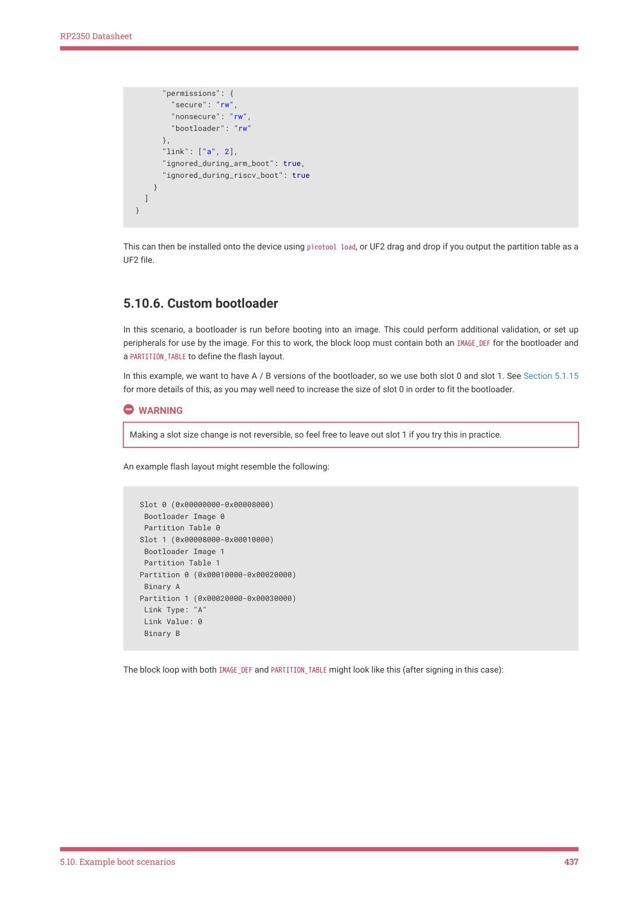
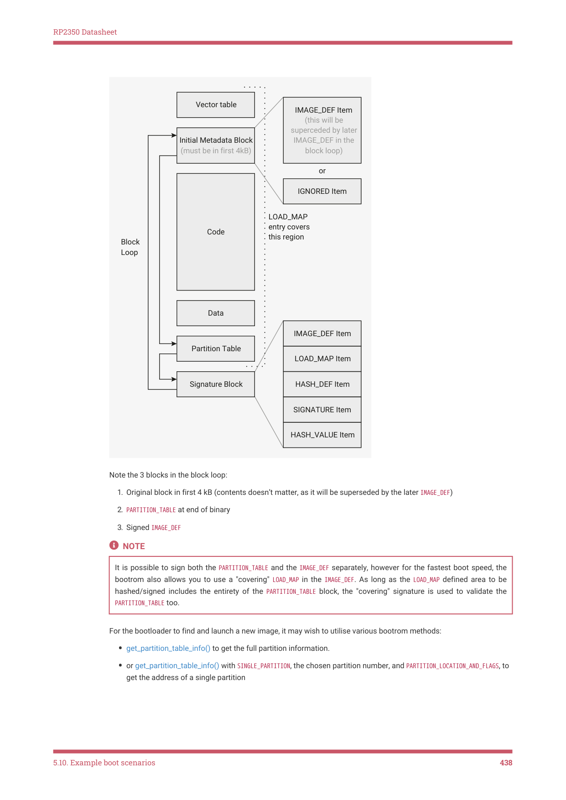

# 5.10.6. Custom bootloader

RP2350 Datasheet

      "permissions": {

        "secure": "rw",

        "nonsecure": "rw",

        "bootloader": "rw"

      },

      "link": ["a", 2],

      "ignored_during_arm_boot": true,

      "ignored_during_riscv_boot": true

    }

  ]

}

This can then be installed onto the device using picotool load, or UF2 drag and drop if you output the partition table as a

UF2 file.

5.10.6. Custom bootloader

In this scenario, a bootloader is run before booting into an image. This could perform additional validation, or set up

peripherals for use by the image. For this to work, the block loop must contain both an IMAGE_DEF for the bootloader and

a PARTITION_TABLE to define the flash layout.

In this example, we want to have A / B versions of the bootloader, so we use both slot 0 and slot 1. See Section 5.1.15

for more details of this, as you may well need to increase the size of slot 0 in order to fit the bootloader.

WARNING

Making a slot size change is not reversible, so feel free to leave out slot 1 if you try this in practice.

An example flash layout might resemble the following:

 Slot 0 (0x00000000-0x00008000)

  Bootloader Image 0

  Partition Table 0

 Slot 1 (0x00008000-0x00010000)

  Bootloader Image 1

  Partition Table 1

 Partition 0 (0x00010000-0x00020000)

  Binary A

 Partition 1 (0x00020000-0x00030000)

  Link Type: "A"

  Link Value: 0

  Binary B

The block loop with both IMAGE_DEF and PARTITION_TABLE might look like this (after signing in this case):

5.10. Example boot scenarios
437

RP2350 Datasheet

Vector table

IMAGE_DEF Item

(this will be 
superceded by later 

Initial Metadata Block 

IMAGE_DEF in the 

(must be in first 4kB)

block loop)

or

IGNORED Item

LOAD_MAP
entry covers 
this region

Code

Block 
Loop

Data

IMAGE_DEF Item

Partition Table

LOAD_MAP Item

Signature Block

HASH_DEF Item

SIGNATURE Item

HASH_VALUE Item

Note the 3 blocks in the block loop:

1. Original block in first 4 kB (contents doesn’t matter, as it will be superseded by the later IMAGE_DEF)

2. PARTITION_TABLE at end of binary

3. Signed IMAGE_DEF

NOTE

It is possible to sign both the PARTITION_TABLE and the IMAGE_DEF separately, however for the fastest boot speed, the

bootrom also allows you to use a "covering" LOAD_MAP in the IMAGE_DEF. As long as the LOAD_MAP defined area to be

hashed/signed includes the entirety of the PARTITION_TABLE block, the "covering" signature is used to validate the

PARTITION_TABLE too.

For the bootloader to find and launch a new image, it may wish to utilise various bootrom methods:

• get_partition_table_info() to get the full partition information.
• or get_partition_table_info() with SINGLE_PARTITION, the chosen partition number, and PARTITION_LOCATION_AND_FLAGS, to

get the address of a single partition

5.10. Example boot scenarios
438
