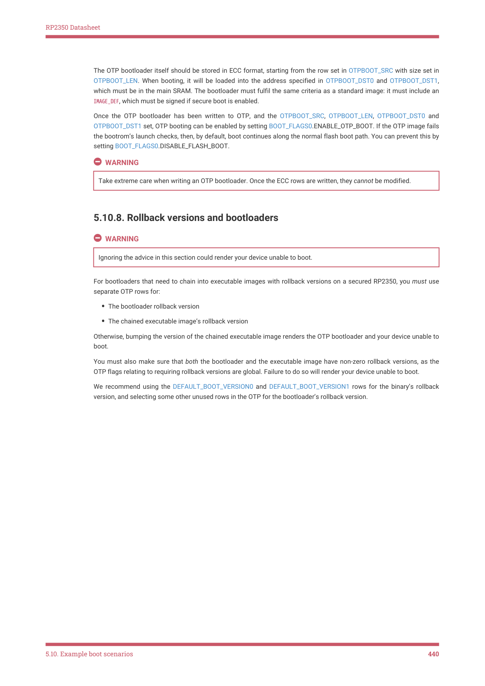

# 5.10.8. Rollback versions and bootloaders

RP2350 Datasheet

The OTP bootloader itself should be stored in ECC format, starting from the row set in OTPBOOT_SRC with size set in

OTPBOOT_LEN. When booting, it will be loaded into the address specified in OTPBOOT_DST0 and OTPBOOT_DST1,

which must be in the main SRAM. The bootloader must fulfil the same criteria as a standard image: it must include an

IMAGE_DEF, which must be signed if secure boot is enabled.

Once the OTP bootloader has been written to OTP, and the OTPBOOT_SRC, OTPBOOT_LEN, OTPBOOT_DST0 and

OTPBOOT_DST1 set, OTP booting can be enabled by setting BOOT_FLAGS0.ENABLE_OTP_BOOT. If the OTP image fails

the bootrom’s launch checks, then, by default, boot continues along the normal flash boot path. You can prevent this by

setting BOOT_FLAGS0.DISABLE_FLASH_BOOT.

WARNING

Take extreme care when writing an OTP bootloader. Once the ECC rows are written, they cannot be modified.

5.10.8. Rollback versions and bootloaders

WARNING

Ignoring the advice in this section could render your device unable to boot.

For bootloaders that need to chain into executable images with rollback versions on a secured RP2350, you must use

separate OTP rows for:

• The bootloader rollback version
• The chained executable image’s rollback version

Otherwise, bumping the version of the chained executable image renders the OTP bootloader and your device unable to

boot.

You must also make sure that both the bootloader and the executable image have non-zero rollback versions, as the

OTP flags relating to requiring rollback versions are global. Failure to do so will render your device unable to boot.

We recommend using the DEFAULT_BOOT_VERSION0 and DEFAULT_BOOT_VERSION1 rows for the binary’s rollback

version, and selecting some other unused rows in the OTP for the bootloader’s rollback version.

5.10. Example boot scenarios
440
