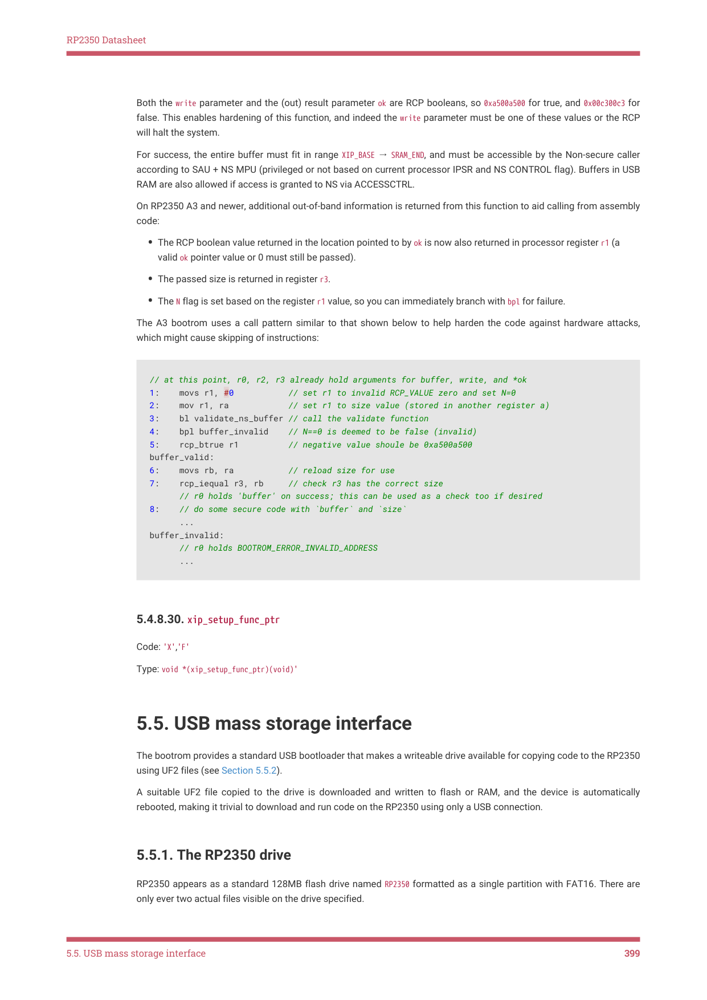

# 5.5.1. The RP2350 drive

RP2350 Datasheet

Both the write parameter and the (out) result parameter ok are RCP booleans, so 0xa500a500 for true, and 0x00c300c3 for

false. This enables hardening of this function, and indeed the write parameter must be one of these values or the RCP

will halt the system.

For success, the entire buffer must fit in range XIP_BASE → SRAM_END, and must be accessible by the Non-secure caller

according to SAU + NS MPU (privileged or not based on current processor IPSR and NS CONTROL flag). Buffers in USB

RAM are also allowed if access is granted to NS via ACCESSCTRL.

On RP2350 A3 and newer, additional out-of-band information is returned from this function to aid calling from assembly

code:

• The RCP boolean value returned in the location pointed to by ok is now also returned in processor register r1 (a

valid ok pointer value or 0 must still be passed).
• The passed size is returned in register r3.
• The N flag is set based on the register r1 value, so you can immediately branch with bpl for failure.

The A3 bootrom uses a call pattern similar to that shown below to help harden the code against hardware attacks,

which might cause skipping of instructions:

// at this point, r0, r2, r3 already hold arguments for buffer, write, and *ok

1:    movs r1, #0           // set r1 to invalid RCP_VALUE zero and set N=0

2:    mov r1, ra            // set r1 to size value (stored in another register a)

3:    bl validate_ns_buffer // call the validate function

4:    bpl buffer_invalid    // N==0 is deemed to be false (invalid)

5:    rcp_btrue r1          // negative value shoule be 0xa500a500

buffer_valid:

6:    movs rb, ra           // reload size for use

7:    rcp_iequal r3, rb     // check r3 has the correct size

      // r0 holds 'buffer' on success; this can be used as a check too if desired

8:    // do some secure code with `buffer` and `size`

      ...

buffer_invalid:

      // r0 holds BOOTROM_ERROR_INVALID_ADDRESS

      ...

5.4.8.30. xip_setup_func_ptr

Code: 'X','F'

Type: void *(xip_setup_func_ptr)(void)'

5.5. USB mass storage interface

The bootrom provides a standard USB bootloader that makes a writeable drive available for copying code to the RP2350

using UF2 files (see Section 5.5.2).

A suitable UF2 file copied to the drive is downloaded and written to flash or RAM, and the device is automatically

rebooted, making it trivial to download and run code on the RP2350 using only a USB connection.

5.5.1. The RP2350 drive

RP2350 appears as a standard 128MB flash drive named RP2350 formatted as a single partition with FAT16. There are

only ever two actual files visible on the drive specified.

5.5. USB mass storage interface
399
