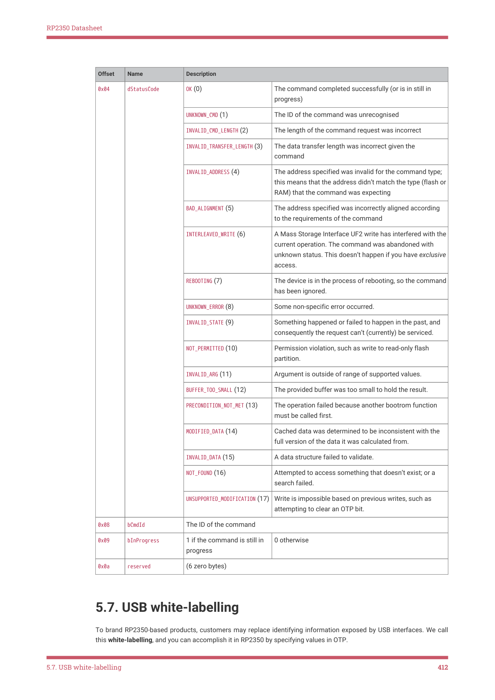

# 5.7. USB white-labelling

RP2350 Datasheet

| Offset | Name | Description |  |
| --- | --- | --- | --- |
| 0x04 | dStatusCode | OK (0) | The command completed successfully (or is in still in
progress) |
|  |  | UNKNOWN CMD (1)
_ | The ID of the command was unrecognised |
|  |  | INVALID CMD LENGTH (2)
_ _ | The length of the command request was incorrect |
|  |  | INVALID TRANSFER LENGTH (3)
_ _ | The data transfer length was incorrect given the
command |
|  |  | INVALID ADDRESS (4)
_ | The address specified was invalid for the command type;
this means that the address didn’t match the type (flash or
RAM) that the command was expecting |
|  |  | BAD ALIGNMENT (5)
_ | The address specified was incorrectly aligned according
to the requirements of the command |
|  |  | INTERLEAVED WRITE (6)
_ | A Mass Storage Interface UF2 write has interfered with the
current operation. The command was abandoned with
unknown status. This doesn’t happen if you have exclusive
access. |
|  |  | REBOOTING (7) | The device is in the process of rebooting, so the command
has been ignored. |
|  |  | UNKNOWN ERROR (8)
_ | Some non-specific error occurred. |
|  |  | INVALID STATE (9)
_ | Something happened or failed to happen in the past, and
consequently the request can’t (currently) be serviced. |
|  |  | NOT PERMITTED (10)
_ | Permission violation, such as write to read-only flash
partition. |
|  |  | INVALID ARG (11)
_ | Argument is outside of range of supported values. |
|  |  | BUFFER TOO SMALL (12)
_ _ | The provided buffer was too small to hold the result. |
|  |  | PRECONDITION NOT MET (13)
_ _ | The operation failed because another bootrom function
must be called first. |
|  |  | MODIFIED DATA (14)
_ | Cached data was determined to be inconsistent with the
full version of the data it was calculated from. |
|  |  | INVALID DATA (15)
_ | A data structure failed to validate. |
|  |  | NOT FOUND (16)
_ | Attempted to access something that doesn’t exist; or a
search failed. |
|  |  | UNSUPPORTED MODIFICATION (17)
_ | Write is impossible based on previous writes, such as
attempting to clear an OTP bit. |
| 0x08 | bCmdId | The ID of the command |  |
| 0x09 | bInProgress | 1 if the command is still in
progress | 0 otherwise |
| 0x0a | reserved | (6 zero bytes) |  |

5.7. USB white-labelling

To brand RP2350-based products, customers may replace identifying information exposed by USB interfaces. We call

this white-labelling, and you can accomplish it in RP2350 by specifying values in OTP.

5.7. USB white-labelling
412
