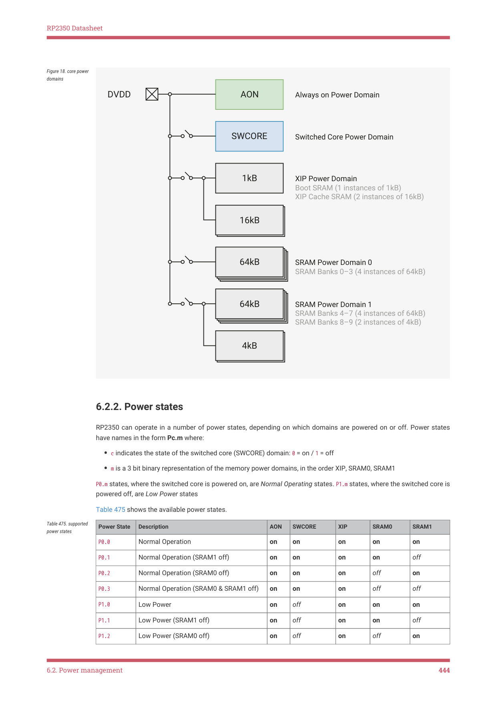

# 6.2.2. Power states

RP2350 Datasheet

Figure 18. core power

domains

AON

DVDD
Always on Power Domain

SWCORE

Switched Core Power Domain

1kB

XIP Power Domain
Boot SRAM (1 instances of 1kB)
XIP Cache SRAM (2 instances of 16kB)

16kB

64kB

SRAM Power Domain 0
SRAM Banks 0–3 (4 instances of 64kB)

64kB

SRAM Power Domain 1
SRAM Banks 4–7 (4 instances of 64kB)
SRAM Banks 8–9 (2 instances of 4kB)

4kB

6.2.2. Power states

RP2350 can operate in a number of power states, depending on which domains are powered on or off. Power states

have names in the form Pc.m where:

• c indicates the state of the switched core (SWCORE) domain: 0 = on / 1 = off
• m is a 3 bit binary representation of the memory power domains, in the order XIP, SRAM0, SRAM1

P0.m states, where the switched core is powered on, are Normal Operating states. P1.m states, where the switched core is

powered off, are Low Power states

Table 475 shows the available power states.

| Power State | Description | AON | SWCORE | XIP | SRAM0 | SRAM1 |
| --- | --- | --- | --- | --- | --- | --- |
| P0.0 | Normal Operation | on | on | on | on | on |
| P0.1 | Normal Operation (SRAM1 off) | on | on | on | on | off |
| P0.2 | Normal Operation (SRAM0 off) | on | on | on | off | on |
| P0.3 | Normal Operation (SRAM0 & SRAM1 off) | on | on | on | off | off |
| P1.0 | Low Power | on | off | on | on | on |
| P1.1 | Low Power (SRAM1 off) | on | off | on | on | off |
| P1.2 | Low Power (SRAM0 off) | on | off | on | off | on |

Table 475. supported

6.2. Power management
444
