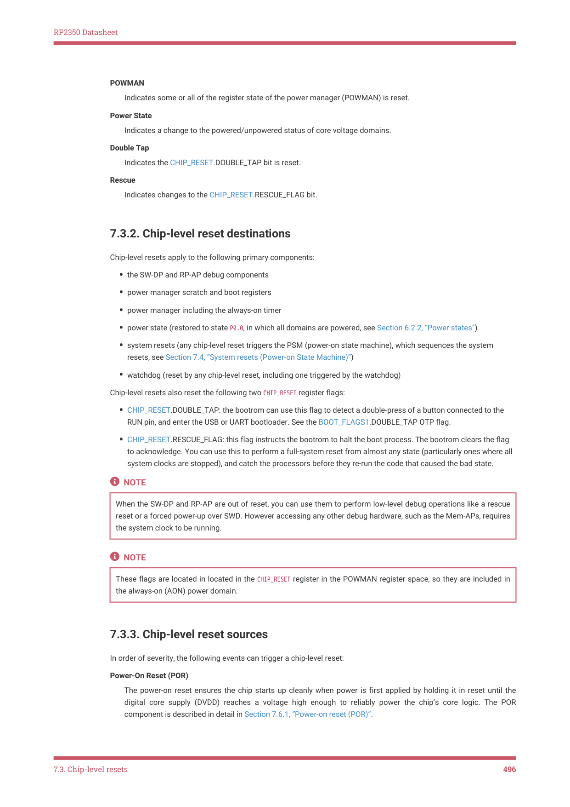

# 7.3.3. Chip-level reset sources

RP2350 Datasheet

POWMAN

Indicates some or all of the register state of the power manager (POWMAN) is reset.

Power State

Indicates a change to the powered/unpowered status of core voltage domains.

Double Tap

Indicates the CHIP_RESET.DOUBLE_TAP bit is reset.

Rescue

Indicates changes to the CHIP_RESET.RESCUE_FLAG bit.

7.3.2. Chip-level reset destinations

Chip-level resets apply to the following primary components:

• the SW-DP and RP-AP debug components
• power manager scratch and boot registers
• power manager including the always-on timer
• power state (restored to state P0.0, in which all domains are powered, see Section 6.2.2, “Power states”)
• system resets (any chip-level reset triggers the PSM (power-on state machine), which sequences the system

resets, see Section 7.4, “System resets (Power-on State Machine)”)
• watchdog (reset by any chip-level reset, including one triggered by the watchdog)

Chip-level resets also reset the following two CHIP_RESET register flags:

• CHIP_RESET.DOUBLE_TAP: the bootrom can use this flag to detect a double-press of a button connected to the

RUN pin, and enter the USB or UART bootloader. See the BOOT_FLAGS1.DOUBLE_TAP OTP flag.
• CHIP_RESET.RESCUE_FLAG: this flag instructs the bootrom to halt the boot process. The bootrom clears the flag

to acknowledge. You can use this to perform a full-system reset from almost any state (particularly ones where all

system clocks are stopped), and catch the processors before they re-run the code that caused the bad state.

NOTE

When the SW-DP and RP-AP are out of reset, you can use them to perform low-level debug operations like a rescue

reset or a forced power-up over SWD. However accessing any other debug hardware, such as the Mem-APs, requires

the system clock to be running.

NOTE

These flags are located in located in the CHIP_RESET register in the POWMAN register space, so they are included in

the always-on (AON) power domain.

7.3.3. Chip-level reset sources

In order of severity, the following events can trigger a chip-level reset:

Power-On Reset (POR)

The power-on reset ensures the chip starts up cleanly when power is first applied by holding it in reset until the

digital core supply (DVDD) reaches a voltage high enough to reliably power the chip’s core logic. The POR

component is described in detail in Section 7.6.1, “Power-on reset (POR)”.

7.3. Chip-level resets
496
