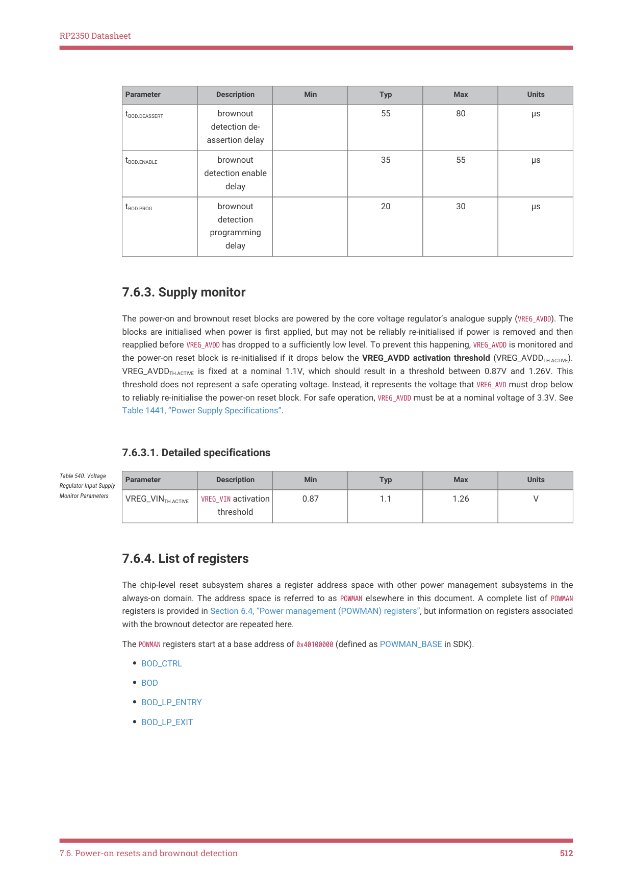

# 7.6.4. List of registers

RP2350 Datasheet

| Parameter | Description | Min | Typ | Max | Units |
| --- | --- | --- | --- | --- | --- |
| t
BOD.DEASSERT | brownout
detection de-
assertion delay |  | 55 | 80 | μs |
| t
BOD.ENABLE | brownout
detection enable
delay |  | 35 | 55 | μs |
| t
BOD.PROG | brownout
detection
programming
delay |  | 20 | 30 | μs |

7.6.3. Supply monitor

The power-on and brownout reset blocks are powered by the core voltage regulator’s analogue supply (VREG_AVDD). The

blocks are initialised when power is first applied, but may not be reliably re-initialised if power is removed and then

reapplied before VREG_AVDD has dropped to a sufficiently low level. To prevent this happening, VREG_AVDD is monitored and

the power-on reset block is re-initialised if it drops below the VREG_AVDD activation threshold (VREG_AVDDTH.ACTIVE).

VREG_AVDDTH.ACTIVE is fixed at a nominal 1.1V, which should result in a threshold between 0.87V and 1.26V. This

threshold does not represent a safe operating voltage. Instead, it represents the voltage that VREG_AVD must drop below

to reliably re-initialise the power-on reset block. For safe operation, VREG_AVDD must be at a nominal voltage of 3.3V. See

Table 1441, “Power Supply Specifications”.

7.6.3.1. Detailed specifications

| Parameter | Description | Min | Typ | Max | Units |
| --- | --- | --- | --- | --- | --- |
| VREG_VIN
TH.ACTIVE | VREG VIN activation
_
threshold | 0.87 | 1.1 | 1.26 | V |

Table 540. Voltage

Regulator Input Supply

Monitor Parameters

7.6.4. List of registers

The chip-level reset subsystem shares a register address space with other power management subsystems in the

always-on domain. The address space is referred to as POWMAN elsewhere in this document. A complete list of POWMAN

registers is provided in Section 6.4, “Power management (POWMAN) registers”, but information on registers associated

with the brownout detector are repeated here.

The POWMAN registers start at a base address of 0x40100000 (defined as POWMAN_BASE in SDK).

• BOD_CTRL
• BOD
• BOD_LP_ENTRY
• BOD_LP_EXIT

7.6. Power-on resets and brownout detection
512
