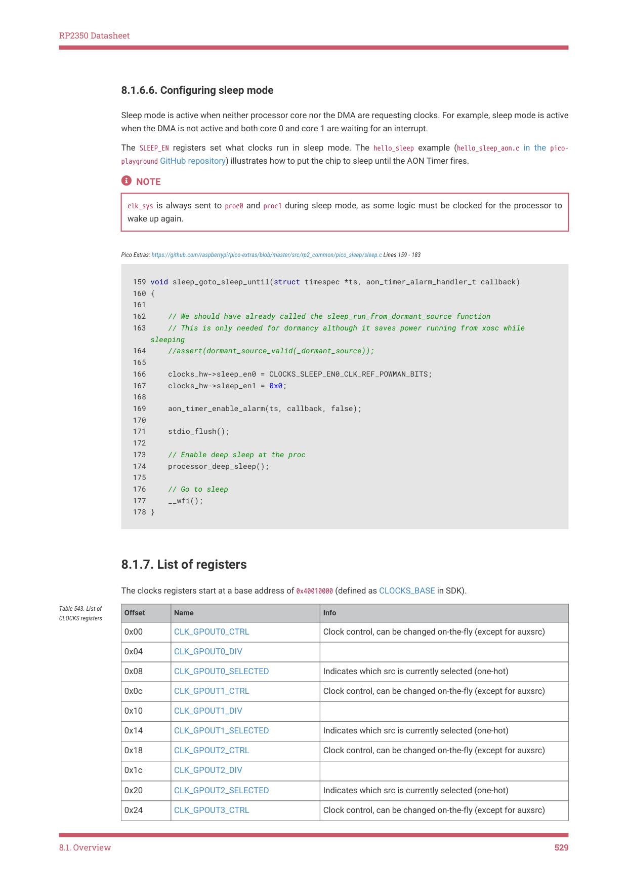
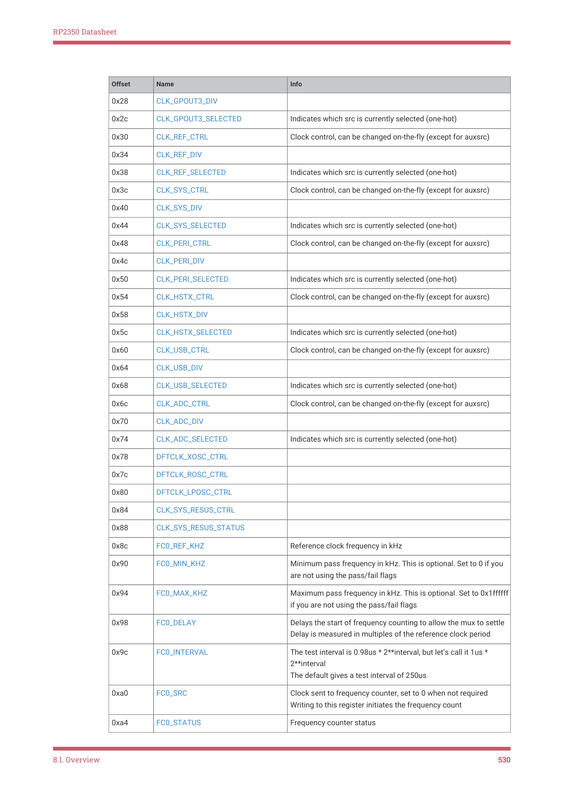
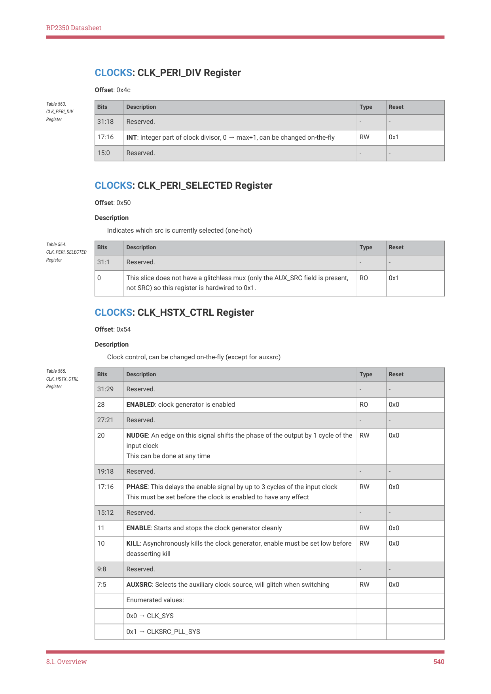
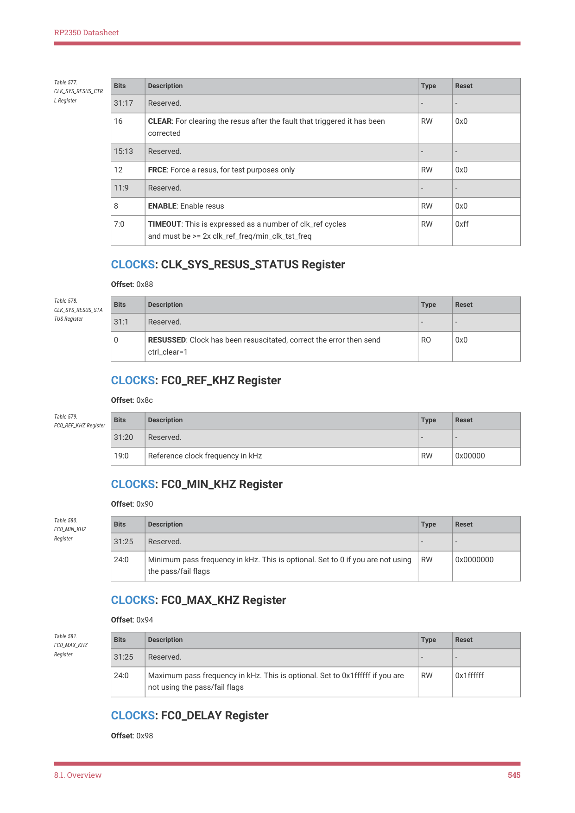
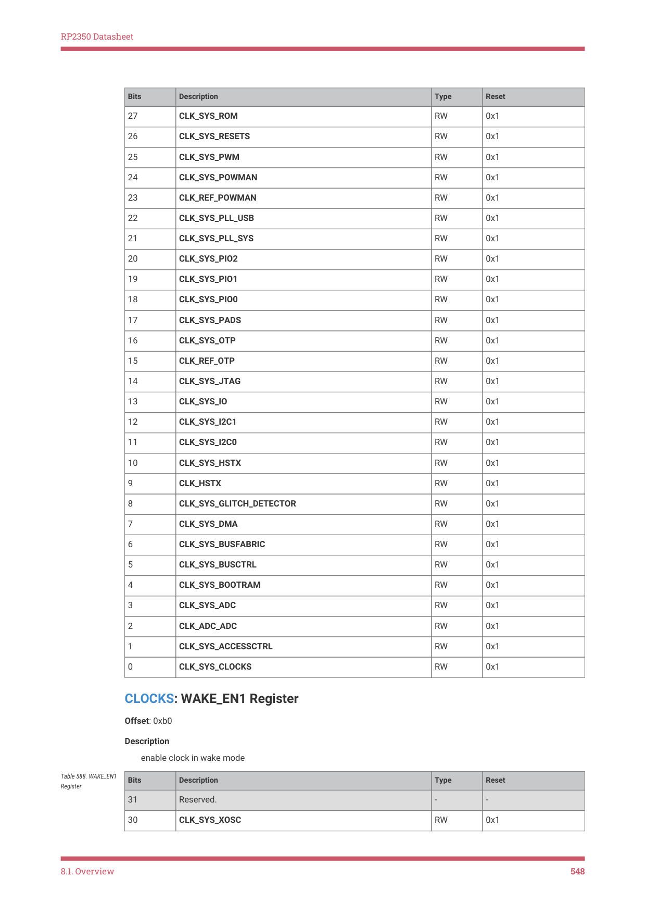
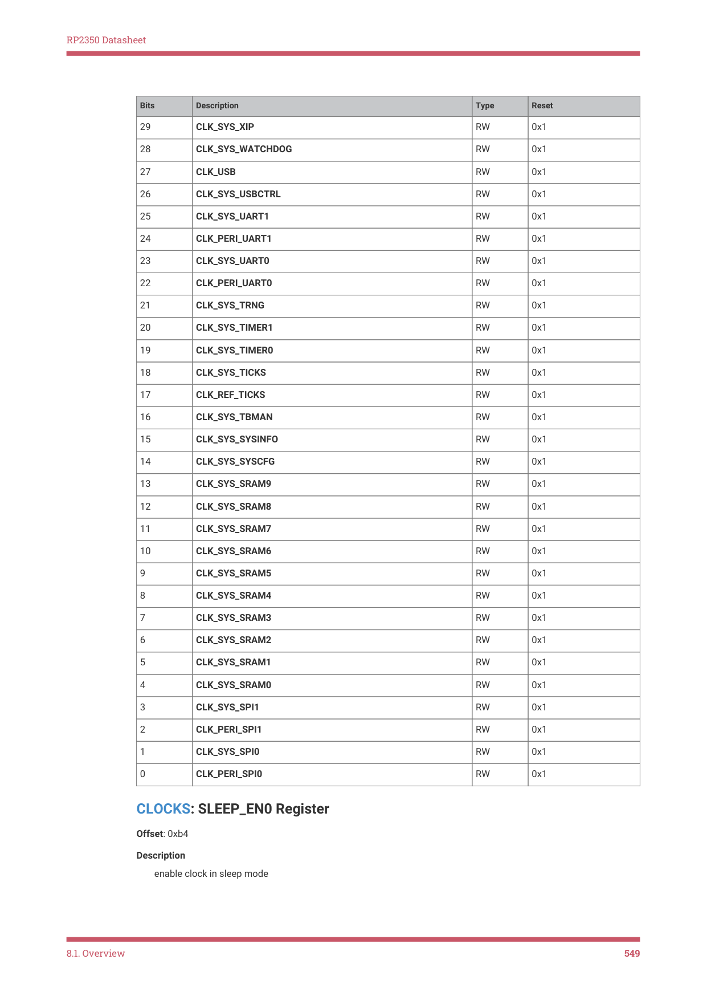
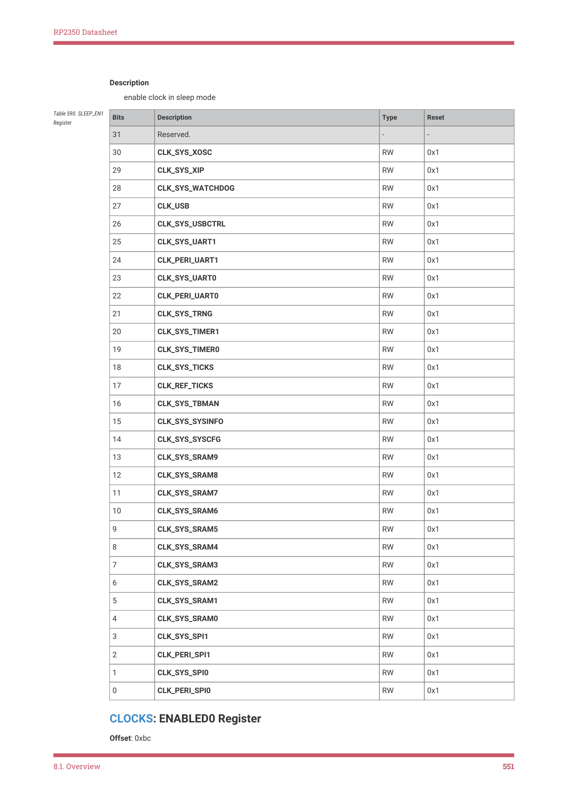

# 8.1.7. List of registers

RP2350 Datasheet

8.1.6.6. Configuring sleep mode

Sleep mode is active when neither processor core nor the DMA are requesting clocks. For example, sleep mode is active

when the DMA is not active and both core 0 and core 1 are waiting for an interrupt.

The SLEEP_EN registers set what clocks run in sleep mode. The hello_sleep example (hello_sleep_aon.c in the pico-

playground GitHub repository) illustrates how to put the chip to sleep until the AON Timer fires.

NOTE

clk_sys is always sent to proc0 and proc1 during sleep mode, as some logic must be clocked for the processor to

wake up again.

Pico Extras: https://github.com/raspberrypi/pico-extras/blob/master/src/rp2_common/pico_sleep/sleep.c Lines 159 - 183

159 void sleep_goto_sleep_until(struct timespec *ts, aon_timer_alarm_handler_t callback)

160 {

161 

162     // We should have already called the sleep_run_from_dormant_source function

163     // This is only needed for dormancy although it saves power running from xosc while

    sleeping

164     //assert(dormant_source_valid(_dormant_source));

165 

166     clocks_hw->sleep_en0 = CLOCKS_SLEEP_EN0_CLK_REF_POWMAN_BITS;

167     clocks_hw->sleep_en1 = 0x0;

168 

169     aon_timer_enable_alarm(ts, callback, false);

170 

171     stdio_flush();

172 

173     // Enable deep sleep at the proc

174     processor_deep_sleep();

175 

176     // Go to sleep

177     __wfi();

178 }

8.1.7. List of registers

The clocks registers start at a base address of 0x40010000 (defined as CLOCKS_BASE in SDK).

| Offset | Name | Info |
| --- | --- | --- |
| 0x00 | CLK_GPOUT0_CTRL | Clock control, can be changed on-the-fly (except for auxsrc) |
| 0x04 | CLK_GPOUT0_DIV |  |
| 0x08 | CLK_GPOUT0_SELECTED | Indicates which src is currently selected (one-hot) |
| 0x0c | CLK_GPOUT1_CTRL | Clock control, can be changed on-the-fly (except for auxsrc) |
| 0x10 | CLK_GPOUT1_DIV |  |
| 0x14 | CLK_GPOUT1_SELECTED | Indicates which src is currently selected (one-hot) |
| 0x18 | CLK_GPOUT2_CTRL | Clock control, can be changed on-the-fly (except for auxsrc) |
| 0x1c | CLK_GPOUT2_DIV |  |
| 0x20 | CLK_GPOUT2_SELECTED | Indicates which src is currently selected (one-hot) |
| 0x24 | CLK_GPOUT3_CTRL | Clock control, can be changed on-the-fly (except for auxsrc) |

Table 543. List of

8.1. Overview
529

RP2350 Datasheet

| Offset | Name | Info |
| --- | --- | --- |
| 0x28 | CLK_GPOUT3_DIV |  |
| 0x2c | CLK_GPOUT3_SELECTED | Indicates which src is currently selected (one-hot) |
| 0x30 | CLK_REF_CTRL | Clock control, can be changed on-the-fly (except for auxsrc) |
| 0x34 | CLK_REF_DIV |  |
| 0x38 | CLK_REF_SELECTED | Indicates which src is currently selected (one-hot) |
| 0x3c | CLK_SYS_CTRL | Clock control, can be changed on-the-fly (except for auxsrc) |
| 0x40 | CLK_SYS_DIV |  |
| 0x44 | CLK_SYS_SELECTED | Indicates which src is currently selected (one-hot) |
| 0x48 | CLK_PERI_CTRL | Clock control, can be changed on-the-fly (except for auxsrc) |
| 0x4c | CLK_PERI_DIV |  |
| 0x50 | CLK_PERI_SELECTED | Indicates which src is currently selected (one-hot) |
| 0x54 | CLK_HSTX_CTRL | Clock control, can be changed on-the-fly (except for auxsrc) |
| 0x58 | CLK_HSTX_DIV |  |
| 0x5c | CLK_HSTX_SELECTED | Indicates which src is currently selected (one-hot) |
| 0x60 | CLK_USB_CTRL | Clock control, can be changed on-the-fly (except for auxsrc) |
| 0x64 | CLK_USB_DIV |  |
| 0x68 | CLK_USB_SELECTED | Indicates which src is currently selected (one-hot) |
| 0x6c | CLK_ADC_CTRL | Clock control, can be changed on-the-fly (except for auxsrc) |
| 0x70 | CLK_ADC_DIV |  |
| 0x74 | CLK_ADC_SELECTED | Indicates which src is currently selected (one-hot) |
| 0x78 | DFTCLK_XOSC_CTRL |  |
| 0x7c | DFTCLK_ROSC_CTRL |  |
| 0x80 | DFTCLK_LPOSC_CTRL |  |
| 0x84 | CLK_SYS_RESUS_CTRL |  |
| 0x88 | CLK_SYS_RESUS_STATUS |  |
| 0x8c | FC0_REF_KHZ | Reference clock frequency in kHz |
| 0x90 | FC0_MIN_KHZ | Minimum pass frequency in kHz. This is optional. Set to 0 if you
are not using the pass/fail flags |
| 0x94 | FC0_MAX_KHZ | Maximum pass frequency in kHz. This is optional. Set to 0x1ffffff
if you are not using the pass/fail flags |
| 0x98 | FC0_DELAY | Delays the start of frequency counting to allow the mux to settle
Delay is measured in multiples of the reference clock period |
| 0x9c | FC0_INTERVAL | The test interval is 0.98us * 2**interval, but let’s call it 1us *
2**interval
The default gives a test interval of 250us |
| 0xa0 | FC0_SRC | Clock sent to frequency counter, set to 0 when not required
Writing to this register initiates the frequency count |
| 0xa4 | FC0_STATUS | Frequency counter status |

8.1. Overview
530

RP2350 Datasheet

| Offset | Name | Info |
| --- | --- | --- |
| 0xa8 | FC0_RESULT | Result of frequency measurement, only valid when
status_done=1 |
| 0xac | WAKE_EN0 | enable clock in wake mode |
| 0xb0 | WAKE_EN1 | enable clock in wake mode |
| 0xb4 | SLEEP_EN0 | enable clock in sleep mode |
| 0xb8 | SLEEP_EN1 | enable clock in sleep mode |
| 0xbc | ENABLED0 | indicates the state of the clock enable |
| 0xc0 | ENABLED1 | indicates the state of the clock enable |
| 0xc4 | INTR | Raw Interrupts |
| 0xc8 | INTE | Interrupt Enable |
| 0xcc | INTF | Interrupt Force |
| 0xd0 | INTS | Interrupt status after masking & forcing |

CLOCKS: CLK_GPOUT0_CTRL Register

Offset: 0x00

Description

Clock control, can be changed on-the-fly (except for auxsrc)

| Bits | Description | Type | Reset |
| --- | --- | --- | --- |
| 31:29 | Reserved. | - | - |
| 28 | ENABLED: clock generator is enabled | RO | 0x0 |
| 27:21 | Reserved. | - | - |
| 20 | NUDGE: An edge on this signal shifts the phase of the output by 1 cycle of the
input clock
This can be done at any time | RW | 0x0 |
| 19:18 | Reserved. | - | - |
| 17:16 | PHASE: This delays the enable signal by up to 3 cycles of the input clock
This must be set before the clock is enabled to have any effect | RW | 0x0 |
| 15:13 | Reserved. | - | - |
| 12 | DC50: Enables duty cycle correction for odd divisors, can be changed on-the-
fly | RW | 0x0 |
| 11 | ENABLE: Starts and stops the clock generator cleanly | RW | 0x0 |
| 10 | KILL: Asynchronously kills the clock generator, enable must be set low before
deasserting kill | RW | 0x0 |
| 9 | Reserved. | - | - |
| 8:5 | AUXSRC: Selects the auxiliary clock source, will glitch when switching | RW | 0x0 |
|  | Enumerated values: |  |  |
|  | 0x0 → CLKSRC_PLL_SYS |  |  |
|  | 0x1 → CLKSRC_GPIN0 |  |  |

Table 544.

CLK_GPOUT0_CTRL

Register

8.1. Overview
531

RP2350 Datasheet

| Bits | Description | Type | Reset |
| --- | --- | --- | --- |
|  | 0x2 → CLKSRC_GPIN1 |  |  |
|  | 0x3 → CLKSRC_PLL_USB |  |  |
|  | 0x4 → CLKSRC_PLL_USB_PRIMARY_REF_OPCG |  |  |
|  | 0x5 → ROSC_CLKSRC |  |  |
|  | 0x6 → XOSC_CLKSRC |  |  |
|  | 0x7 → LPOSC_CLKSRC |  |  |
|  | 0x8 → CLK_SYS |  |  |
|  | 0x9 → CLK_USB |  |  |
|  | 0xa → CLK_ADC |  |  |
|  | 0xb → CLK_REF |  |  |
|  | 0xc → CLK_PERI |  |  |
|  | 0xd → CLK_HSTX |  |  |
|  | 0xe → OTP_CLK2FC |  |  |
| 4:0 | Reserved. | - | - |

CLOCKS: CLK_GPOUT0_DIV Register

Offset: 0x04

| Bits | Description | Type | Reset |
| --- | --- | --- | --- |
| 31:16 | INT: Integer part of clock divisor, 0 → max+1, can be changed on-the-fly | RW | 0x0001 |
| 15:0 | FRAC: Fractional component of the divisor, can be changed on-the-fly | RW | 0x0000 |

Table 545.

CLK_GPOUT0_DIV

Register

CLOCKS: CLK_GPOUT0_SELECTED Register

Offset: 0x08

Description

Indicates which src is currently selected (one-hot)

| Bits | Description | Type | Reset |
| --- | --- | --- | --- |
| 31:1 | Reserved. | - | - |
| 0 | This slice does not have a glitchless mux (only the AUX_SRC field is present,
not SRC) so this register is hardwired to 0x1. | RO | 0x1 |

Table 546.

CLK_GPOUT0_SELECT

ED Register

CLOCKS: CLK_GPOUT1_CTRL Register

Offset: 0x0c

Description

Clock control, can be changed on-the-fly (except for auxsrc)

| Bits | Description | Type | Reset |
| --- | --- | --- | --- |
| 31:29 | Reserved. | - | - |
| 28 | ENABLED: clock generator is enabled | RO | 0x0 |

Table 547.

CLK_GPOUT1_CTRL

Register

8.1. Overview
532

RP2350 Datasheet

| Bits | Description | Type | Reset |
| --- | --- | --- | --- |
| 27:21 | Reserved. | - | - |
| 20 | NUDGE: An edge on this signal shifts the phase of the output by 1 cycle of the
input clock
This can be done at any time | RW | 0x0 |
| 19:18 | Reserved. | - | - |
| 17:16 | PHASE: This delays the enable signal by up to 3 cycles of the input clock
This must be set before the clock is enabled to have any effect | RW | 0x0 |
| 15:13 | Reserved. | - | - |
| 12 | DC50: Enables duty cycle correction for odd divisors, can be changed on-the-
fly | RW | 0x0 |
| 11 | ENABLE: Starts and stops the clock generator cleanly | RW | 0x0 |
| 10 | KILL: Asynchronously kills the clock generator, enable must be set low before
deasserting kill | RW | 0x0 |
| 9 | Reserved. | - | - |
| 8:5 | AUXSRC: Selects the auxiliary clock source, will glitch when switching | RW | 0x0 |
|  | Enumerated values: |  |  |
|  | 0x0 → CLKSRC_PLL_SYS |  |  |
|  | 0x1 → CLKSRC_GPIN0 |  |  |
|  | 0x2 → CLKSRC_GPIN1 |  |  |
|  | 0x3 → CLKSRC_PLL_USB |  |  |
|  | 0x4 → CLKSRC_PLL_USB_PRIMARY_REF_OPCG |  |  |
|  | 0x5 → ROSC_CLKSRC |  |  |
|  | 0x6 → XOSC_CLKSRC |  |  |
|  | 0x7 → LPOSC_CLKSRC |  |  |
|  | 0x8 → CLK_SYS |  |  |
|  | 0x9 → CLK_USB |  |  |
|  | 0xa → CLK_ADC |  |  |
|  | 0xb → CLK_REF |  |  |
|  | 0xc → CLK_PERI |  |  |
|  | 0xd → CLK_HSTX |  |  |
|  | 0xe → OTP_CLK2FC |  |  |
| 4:0 | Reserved. | - | - |

CLOCKS: CLK_GPOUT1_DIV Register

Offset: 0x10

| Bits | Description | Type | Reset |
| --- | --- | --- | --- |
| 31:16 | INT: Integer part of clock divisor, 0 → max+1, can be changed on-the-fly | RW | 0x0001 |

Table 548.

CLK_GPOUT1_DIV

Register

8.1. Overview
533

RP2350 Datasheet

| Bits | Description | Type | Reset |
| --- | --- | --- | --- |
| 15:0 | FRAC: Fractional component of the divisor, can be changed on-the-fly | RW | 0x0000 |

CLOCKS: CLK_GPOUT1_SELECTED Register

Offset: 0x14

Description

Indicates which src is currently selected (one-hot)

| Bits | Description | Type | Reset |
| --- | --- | --- | --- |
| 31:1 | Reserved. | - | - |
| 0 | This slice does not have a glitchless mux (only the AUX_SRC field is present,
not SRC) so this register is hardwired to 0x1. | RO | 0x1 |

Table 549.

CLK_GPOUT1_SELECT

ED Register

CLOCKS: CLK_GPOUT2_CTRL Register

Offset: 0x18

Description

Clock control, can be changed on-the-fly (except for auxsrc)

| Bits | Description | Type | Reset |
| --- | --- | --- | --- |
| 31:29 | Reserved. | - | - |
| 28 | ENABLED: clock generator is enabled | RO | 0x0 |
| 27:21 | Reserved. | - | - |
| 20 | NUDGE: An edge on this signal shifts the phase of the output by 1 cycle of the
input clock
This can be done at any time | RW | 0x0 |
| 19:18 | Reserved. | - | - |
| 17:16 | PHASE: This delays the enable signal by up to 3 cycles of the input clock
This must be set before the clock is enabled to have any effect | RW | 0x0 |
| 15:13 | Reserved. | - | - |
| 12 | DC50: Enables duty cycle correction for odd divisors, can be changed on-the-
fly | RW | 0x0 |
| 11 | ENABLE: Starts and stops the clock generator cleanly | RW | 0x0 |
| 10 | KILL: Asynchronously kills the clock generator, enable must be set low before
deasserting kill | RW | 0x0 |
| 9 | Reserved. | - | - |
| 8:5 | AUXSRC: Selects the auxiliary clock source, will glitch when switching | RW | 0x0 |
|  | Enumerated values: |  |  |
|  | 0x0 → CLKSRC_PLL_SYS |  |  |
|  | 0x1 → CLKSRC_GPIN0 |  |  |
|  | 0x2 → CLKSRC_GPIN1 |  |  |
|  | 0x3 → CLKSRC_PLL_USB |  |  |
|  | 0x4 → CLKSRC_PLL_USB_PRIMARY_REF_OPCG |  |  |

Table 550.

CLK_GPOUT2_CTRL

Register

8.1. Overview
534

RP2350 Datasheet

| Bits | Description | Type | Reset |
| --- | --- | --- | --- |
|  | 0x5 → ROSC_CLKSRC_PH |  |  |
|  | 0x6 → XOSC_CLKSRC |  |  |
|  | 0x7 → LPOSC_CLKSRC |  |  |
|  | 0x8 → CLK_SYS |  |  |
|  | 0x9 → CLK_USB |  |  |
|  | 0xa → CLK_ADC |  |  |
|  | 0xb → CLK_REF |  |  |
|  | 0xc → CLK_PERI |  |  |
|  | 0xd → CLK_HSTX |  |  |
|  | 0xe → OTP_CLK2FC |  |  |
| 4:0 | Reserved. | - | - |

CLOCKS: CLK_GPOUT2_DIV Register

Offset: 0x1c

| Bits | Description | Type | Reset |
| --- | --- | --- | --- |
| 31:16 | INT: Integer part of clock divisor, 0 → max+1, can be changed on-the-fly | RW | 0x0001 |
| 15:0 | FRAC: Fractional component of the divisor, can be changed on-the-fly | RW | 0x0000 |

Table 551.

CLK_GPOUT2_DIV

Register

CLOCKS: CLK_GPOUT2_SELECTED Register

Offset: 0x20

Description

Indicates which src is currently selected (one-hot)

| Bits | Description | Type | Reset |
| --- | --- | --- | --- |
| 31:1 | Reserved. | - | - |
| 0 | This slice does not have a glitchless mux (only the AUX_SRC field is present,
not SRC) so this register is hardwired to 0x1. | RO | 0x1 |

Table 552.

CLK_GPOUT2_SELECT

ED Register

CLOCKS: CLK_GPOUT3_CTRL Register

Offset: 0x24

Description

Clock control, can be changed on-the-fly (except for auxsrc)

| Bits | Description | Type | Reset |
| --- | --- | --- | --- |
| 31:29 | Reserved. | - | - |
| 28 | ENABLED: clock generator is enabled | RO | 0x0 |
| 27:21 | Reserved. | - | - |

Table 553.

CLK_GPOUT3_CTRL

Register

8.1. Overview
535

RP2350 Datasheet

| Bits | Description | Type | Reset |
| --- | --- | --- | --- |
| 20 | NUDGE: An edge on this signal shifts the phase of the output by 1 cycle of the
input clock
This can be done at any time | RW | 0x0 |
| 19:18 | Reserved. | - | - |
| 17:16 | PHASE: This delays the enable signal by up to 3 cycles of the input clock
This must be set before the clock is enabled to have any effect | RW | 0x0 |
| 15:13 | Reserved. | - | - |
| 12 | DC50: Enables duty cycle correction for odd divisors, can be changed on-the-
fly | RW | 0x0 |
| 11 | ENABLE: Starts and stops the clock generator cleanly | RW | 0x0 |
| 10 | KILL: Asynchronously kills the clock generator, enable must be set low before
deasserting kill | RW | 0x0 |
| 9 | Reserved. | - | - |
| 8:5 | AUXSRC: Selects the auxiliary clock source, will glitch when switching | RW | 0x0 |
|  | Enumerated values: |  |  |
|  | 0x0 → CLKSRC_PLL_SYS |  |  |
|  | 0x1 → CLKSRC_GPIN0 |  |  |
|  | 0x2 → CLKSRC_GPIN1 |  |  |
|  | 0x3 → CLKSRC_PLL_USB |  |  |
|  | 0x4 → CLKSRC_PLL_USB_PRIMARY_REF_OPCG |  |  |
|  | 0x5 → ROSC_CLKSRC_PH |  |  |
|  | 0x6 → XOSC_CLKSRC |  |  |
|  | 0x7 → LPOSC_CLKSRC |  |  |
|  | 0x8 → CLK_SYS |  |  |
|  | 0x9 → CLK_USB |  |  |
|  | 0xa → CLK_ADC |  |  |
|  | 0xb → CLK_REF |  |  |
|  | 0xc → CLK_PERI |  |  |
|  | 0xd → CLK_HSTX |  |  |
|  | 0xe → OTP_CLK2FC |  |  |
| 4:0 | Reserved. | - | - |

CLOCKS: CLK_GPOUT3_DIV Register

Offset: 0x28

8.1. Overview
536

RP2350 Datasheet

| Bits | Description | Type | Reset |
| --- | --- | --- | --- |
| 31:16 | INT: Integer part of clock divisor, 0 → max+1, can be changed on-the-fly | RW | 0x0001 |
| 15:0 | FRAC: Fractional component of the divisor, can be changed on-the-fly | RW | 0x0000 |

Table 554.

CLK_GPOUT3_DIV

Register

CLOCKS: CLK_GPOUT3_SELECTED Register

Offset: 0x2c

Description

Indicates which src is currently selected (one-hot)

| Bits | Description | Type | Reset |
| --- | --- | --- | --- |
| 31:1 | Reserved. | - | - |
| 0 | This slice does not have a glitchless mux (only the AUX_SRC field is present,
not SRC) so this register is hardwired to 0x1. | RO | 0x1 |

Table 555.

CLK_GPOUT3_SELECT

ED Register

CLOCKS: CLK_REF_CTRL Register

Offset: 0x30

Description

Clock control, can be changed on-the-fly (except for auxsrc)

| Bits | Description | Type | Reset |
| --- | --- | --- | --- |
| 31:7 | Reserved. | - | - |
| 6:5 | AUXSRC: Selects the auxiliary clock source, will glitch when switching | RW | 0x0 |
|  | Enumerated values: |  |  |
|  | 0x0 → CLKSRC_PLL_USB |  |  |
|  | 0x1 → CLKSRC_GPIN0 |  |  |
|  | 0x2 → CLKSRC_GPIN1 |  |  |
|  | 0x3 → CLKSRC_PLL_USB_PRIMARY_REF_OPCG |  |  |
| 4:2 | Reserved. | - | - |
| 1:0 | SRC: Selects the clock source glitchlessly, can be changed on-the-fly | RW | - |
|  | Enumerated values: |  |  |
|  | 0x0 → ROSC_CLKSRC_PH |  |  |
|  | 0x1 → CLKSRC_CLK_REF_AUX |  |  |
|  | 0x2 → XOSC_CLKSRC |  |  |
|  | 0x3 → LPOSC_CLKSRC |  |  |

Table 556.

CLK_REF_CTRL

Register

CLOCKS: CLK_REF_DIV Register

Offset: 0x34

| Bits | Description | Type | Reset |
| --- | --- | --- | --- |
| 31:24 | Reserved. | - | - |
| 23:16 | INT: Integer part of clock divisor, 0 → max+1, can be changed on-the-fly | RW | 0x01 |

Table 557.

8.1. Overview
537

RP2350 Datasheet

| Bits | Description | Type | Reset |
| --- | --- | --- | --- |
| 15:0 | Reserved. | - | - |

CLOCKS: CLK_REF_SELECTED Register

Offset: 0x38

Description

Indicates which src is currently selected (one-hot)

| Bits | Description | Type | Reset |
| --- | --- | --- | --- |
| 31:4 | Reserved. | - | - |
| 3:0 | The glitchless multiplexer does not switch instantaneously (to avoid glitches),
so software should poll this register to wait for the switch to complete. This
register contains one decoded bit for each of the clock sources enumerated in
the CTRL SRC field. At most one of these bits will be set at any time, indicating
that clock is currently present at the output of the glitchless mux. Whilst
switching is in progress, this register may briefly show all-0s. | RO | 0x1 |

Table 558.

CLK_REF_SELECTED

Register

CLOCKS: CLK_SYS_CTRL Register

Offset: 0x3c

Description

Clock control, can be changed on-the-fly (except for auxsrc)

| Bits | Description | Type | Reset |
| --- | --- | --- | --- |
| 31:8 | Reserved. | - | - |
| 7:5 | AUXSRC: Selects the auxiliary clock source, will glitch when switching | RW | 0x2 |
|  | Enumerated values: |  |  |
|  | 0x0 → CLKSRC_PLL_SYS |  |  |
|  | 0x1 → CLKSRC_PLL_USB |  |  |
|  | 0x2 → ROSC_CLKSRC |  |  |
|  | 0x3 → XOSC_CLKSRC |  |  |
|  | 0x4 → CLKSRC_GPIN0 |  |  |
|  | 0x5 → CLKSRC_GPIN1 |  |  |
| 4:1 | Reserved. | - | - |
| 0 | SRC: Selects the clock source glitchlessly, can be changed on-the-fly | RW | 0x1 |
|  | Enumerated values: |  |  |
|  | 0x0 → CLK_REF |  |  |
|  | 0x1 → CLKSRC_CLK_SYS_AUX |  |  |

Table 559.

CLK_SYS_CTRL

Register

CLOCKS: CLK_SYS_DIV Register

Offset: 0x40

8.1. Overview
538

RP2350 Datasheet

| Bits | Description | Type | Reset |
| --- | --- | --- | --- |
| 31:16 | INT: Integer part of clock divisor, 0 → max+1, can be changed on-the-fly | RW | 0x0001 |
| 15:0 | FRAC: Fractional component of the divisor, can be changed on-the-fly | RW | 0x0000 |

Table 560.

CLOCKS: CLK_SYS_SELECTED Register

Offset: 0x44

Description

Indicates which src is currently selected (one-hot)

| Bits | Description | Type | Reset |
| --- | --- | --- | --- |
| 31:2 | Reserved. | - | - |
| 1:0 | The glitchless multiplexer does not switch instantaneously (to avoid glitches),
so software should poll this register to wait for the switch to complete. This
register contains one decoded bit for each of the clock sources enumerated in
the CTRL SRC field. At most one of these bits will be set at any time, indicating
that clock is currently present at the output of the glitchless mux. Whilst
switching is in progress, this register may briefly show all-0s. | RO | 0x1 |

Table 561.

CLK_SYS_SELECTED

Register

CLOCKS: CLK_PERI_CTRL Register

Offset: 0x48

Description

Clock control, can be changed on-the-fly (except for auxsrc)

| Bits | Description | Type | Reset |
| --- | --- | --- | --- |
| 31:29 | Reserved. | - | - |
| 28 | ENABLED: clock generator is enabled | RO | 0x0 |
| 27:12 | Reserved. | - | - |
| 11 | ENABLE: Starts and stops the clock generator cleanly | RW | 0x0 |
| 10 | KILL: Asynchronously kills the clock generator, enable must be set low before
deasserting kill | RW | 0x0 |
| 9:8 | Reserved. | - | - |
| 7:5 | AUXSRC: Selects the auxiliary clock source, will glitch when switching | RW | 0x0 |
|  | Enumerated values: |  |  |
|  | 0x0 → CLK_SYS |  |  |
|  | 0x1 → CLKSRC_PLL_SYS |  |  |
|  | 0x2 → CLKSRC_PLL_USB |  |  |
|  | 0x3 → ROSC_CLKSRC_PH |  |  |
|  | 0x4 → XOSC_CLKSRC |  |  |
|  | 0x5 → CLKSRC_GPIN0 |  |  |
|  | 0x6 → CLKSRC_GPIN1 |  |  |
| 4:0 | Reserved. | - | - |

Table 562.

CLK_PERI_CTRL

Register

8.1. Overview
539

RP2350 Datasheet

CLOCKS: CLK_PERI_DIV Register

Offset: 0x4c

| Bits | Description | Type | Reset |
| --- | --- | --- | --- |
| 31:18 | Reserved. | - | - |
| 17:16 | INT: Integer part of clock divisor, 0 → max+1, can be changed on-the-fly | RW | 0x1 |
| 15:0 | Reserved. | - | - |

Table 563.

CLK_PERI_DIV

Register

CLOCKS: CLK_PERI_SELECTED Register

Offset: 0x50

Description

Indicates which src is currently selected (one-hot)

| Bits | Description | Type | Reset |
| --- | --- | --- | --- |
| 31:1 | Reserved. | - | - |
| 0 | This slice does not have a glitchless mux (only the AUX_SRC field is present,
not SRC) so this register is hardwired to 0x1. | RO | 0x1 |

Table 564.

CLK_PERI_SELECTED

Register

CLOCKS: CLK_HSTX_CTRL Register

Offset: 0x54

Description

Clock control, can be changed on-the-fly (except for auxsrc)

| Bits | Description | Type | Reset |
| --- | --- | --- | --- |
| 31:29 | Reserved. | - | - |
| 28 | ENABLED: clock generator is enabled | RO | 0x0 |
| 27:21 | Reserved. | - | - |
| 20 | NUDGE: An edge on this signal shifts the phase of the output by 1 cycle of the
input clock
This can be done at any time | RW | 0x0 |
| 19:18 | Reserved. | - | - |
| 17:16 | PHASE: This delays the enable signal by up to 3 cycles of the input clock
This must be set before the clock is enabled to have any effect | RW | 0x0 |
| 15:12 | Reserved. | - | - |
| 11 | ENABLE: Starts and stops the clock generator cleanly | RW | 0x0 |
| 10 | KILL: Asynchronously kills the clock generator, enable must be set low before
deasserting kill | RW | 0x0 |
| 9:8 | Reserved. | - | - |
| 7:5 | AUXSRC: Selects the auxiliary clock source, will glitch when switching | RW | 0x0 |
|  | Enumerated values: |  |  |
|  | 0x0 → CLK_SYS |  |  |
|  | 0x1 → CLKSRC_PLL_SYS |  |  |

Table 565.

CLK_HSTX_CTRL

Register

8.1. Overview
540

RP2350 Datasheet

| Bits | Description | Type | Reset |
| --- | --- | --- | --- |
|  | 0x2 → CLKSRC_PLL_USB |  |  |
|  | 0x3 → CLKSRC_GPIN0 |  |  |
|  | 0x4 → CLKSRC_GPIN1 |  |  |
| 4:0 | Reserved. | - | - |

CLOCKS: CLK_HSTX_DIV Register

Offset: 0x58

| Bits | Description | Type | Reset |
| --- | --- | --- | --- |
| 31:18 | Reserved. | - | - |
| 17:16 | INT: Integer part of clock divisor, 0 → max+1, can be changed on-the-fly | RW | 0x1 |
| 15:0 | Reserved. | - | - |

Table 566.

CLK_HSTX_DIV

Register

CLOCKS: CLK_HSTX_SELECTED Register

Offset: 0x5c

Description

Indicates which src is currently selected (one-hot)

| Bits | Description | Type | Reset |
| --- | --- | --- | --- |
| 31:1 | Reserved. | - | - |
| 0 | This slice does not have a glitchless mux (only the AUX_SRC field is present,
not SRC) so this register is hardwired to 0x1. | RO | 0x1 |

Table 567.

CLK_HSTX_SELECTED

Register

CLOCKS: CLK_USB_CTRL Register

Offset: 0x60

Description

Clock control, can be changed on-the-fly (except for auxsrc)

| Bits | Description | Type | Reset |
| --- | --- | --- | --- |
| 31:29 | Reserved. | - | - |
| 28 | ENABLED: clock generator is enabled | RO | 0x0 |
| 27:21 | Reserved. | - | - |
| 20 | NUDGE: An edge on this signal shifts the phase of the output by 1 cycle of the
input clock
This can be done at any time | RW | 0x0 |
| 19:18 | Reserved. | - | - |
| 17:16 | PHASE: This delays the enable signal by up to 3 cycles of the input clock
This must be set before the clock is enabled to have any effect | RW | 0x0 |
| 15:12 | Reserved. | - | - |
| 11 | ENABLE: Starts and stops the clock generator cleanly | RW | 0x0 |

Table 568.

CLK_USB_CTRL

Register

8.1. Overview
541

RP2350 Datasheet

| Bits | Description | Type | Reset |
| --- | --- | --- | --- |
| 10 | KILL: Asynchronously kills the clock generator, enable must be set low before
deasserting kill | RW | 0x0 |
| 9:8 | Reserved. | - | - |
| 7:5 | AUXSRC: Selects the auxiliary clock source, will glitch when switching | RW | 0x0 |
|  | Enumerated values: |  |  |
|  | 0x0 → CLKSRC_PLL_USB |  |  |
|  | 0x1 → CLKSRC_PLL_SYS |  |  |
|  | 0x2 → ROSC_CLKSRC_PH |  |  |
|  | 0x3 → XOSC_CLKSRC |  |  |
|  | 0x4 → CLKSRC_GPIN0 |  |  |
|  | 0x5 → CLKSRC_GPIN1 |  |  |
| 4:0 | Reserved. | - | - |

CLOCKS: CLK_USB_DIV Register

Offset: 0x64

| Bits | Description | Type | Reset |
| --- | --- | --- | --- |
| 31:20 | Reserved. | - | - |
| 19:16 | INT: Integer part of clock divisor, 0 → max+1, can be changed on-the-fly | RW | 0x1 |
| 15:0 | Reserved. | - | - |

Table 569.

CLOCKS: CLK_USB_SELECTED Register

Offset: 0x68

Description

Indicates which src is currently selected (one-hot)

| Bits | Description | Type | Reset |
| --- | --- | --- | --- |
| 31:1 | Reserved. | - | - |
| 0 | This slice does not have a glitchless mux (only the AUX_SRC field is present,
not SRC) so this register is hardwired to 0x1. | RO | 0x1 |

Table 570.

CLK_USB_SELECTED

Register

CLOCKS: CLK_ADC_CTRL Register

Offset: 0x6c

Description

Clock control, can be changed on-the-fly (except for auxsrc)

| Bits | Description | Type | Reset |
| --- | --- | --- | --- |
| 31:29 | Reserved. | - | - |
| 28 | ENABLED: clock generator is enabled | RO | 0x0 |
| 27:21 | Reserved. | - | - |

Table 571.

CLK_ADC_CTRL

Register

8.1. Overview
542

RP2350 Datasheet

| Bits | Description | Type | Reset |
| --- | --- | --- | --- |
| 20 | NUDGE: An edge on this signal shifts the phase of the output by 1 cycle of the
input clock
This can be done at any time | RW | 0x0 |
| 19:18 | Reserved. | - | - |
| 17:16 | PHASE: This delays the enable signal by up to 3 cycles of the input clock
This must be set before the clock is enabled to have any effect | RW | 0x0 |
| 15:12 | Reserved. | - | - |
| 11 | ENABLE: Starts and stops the clock generator cleanly | RW | 0x0 |
| 10 | KILL: Asynchronously kills the clock generator, enable must be set low before
deasserting kill | RW | 0x0 |
| 9:8 | Reserved. | - | - |
| 7:5 | AUXSRC: Selects the auxiliary clock source, will glitch when switching | RW | 0x0 |
|  | Enumerated values: |  |  |
|  | 0x0 → CLKSRC_PLL_USB |  |  |
|  | 0x1 → CLKSRC_PLL_SYS |  |  |
|  | 0x2 → ROSC_CLKSRC_PH |  |  |
|  | 0x3 → XOSC_CLKSRC |  |  |
|  | 0x4 → CLKSRC_GPIN0 |  |  |
|  | 0x5 → CLKSRC_GPIN1 |  |  |
| 4:0 | Reserved. | - | - |

CLOCKS: CLK_ADC_DIV Register

Offset: 0x70

| Bits | Description | Type | Reset |
| --- | --- | --- | --- |
| 31:20 | Reserved. | - | - |
| 19:16 | INT: Integer part of clock divisor, 0 → max+1, can be changed on-the-fly | RW | 0x1 |
| 15:0 | Reserved. | - | - |

Table 572.

CLOCKS: CLK_ADC_SELECTED Register

Offset: 0x74

Description

Indicates which src is currently selected (one-hot)

8.1. Overview
543

RP2350 Datasheet

| Bits | Description | Type | Reset |
| --- | --- | --- | --- |
| 31:1 | Reserved. | - | - |
| 0 | This slice does not have a glitchless mux (only the AUX_SRC field is present,
not SRC) so this register is hardwired to 0x1. | RO | 0x1 |

Table 573.

CLK_ADC_SELECTED

Register

CLOCKS: DFTCLK_XOSC_CTRL Register

Offset: 0x78

| Bits | Description | Type | Reset |
| --- | --- | --- | --- |
| 31:2 | Reserved. | - | - |
| 1:0 | SRC | RW | 0x0 |
|  | Enumerated values: |  |  |
|  | 0x0 → NULL |  |  |
|  | 0x1 → CLKSRC_PLL_USB_PRIMARY |  |  |
|  | 0x2 → CLKSRC_GPIN0 |  |  |

Table 574.

DFTCLK_XOSC_CTRL

Register

CLOCKS: DFTCLK_ROSC_CTRL Register

Offset: 0x7c

| Bits | Description | Type | Reset |
| --- | --- | --- | --- |
| 31:2 | Reserved. | - | - |
| 1:0 | SRC | RW | 0x0 |
|  | Enumerated values: |  |  |
|  | 0x0 → NULL |  |  |
|  | 0x1 → CLKSRC_PLL_SYS_PRIMARY_ROSC |  |  |
|  | 0x2 → CLKSRC_GPIN1 |  |  |

Table 575.

DFTCLK_ROSC_CTRL

Register

CLOCKS: DFTCLK_LPOSC_CTRL Register

Offset: 0x80

| Bits | Description | Type | Reset |
| --- | --- | --- | --- |
| 31:2 | Reserved. | - | - |
| 1:0 | SRC | RW | 0x0 |
|  | Enumerated values: |  |  |
|  | 0x0 → NULL |  |  |
|  | 0x1 → CLKSRC_PLL_USB_PRIMARY_LPOSC |  |  |
|  | 0x2 → CLKSRC_GPIN1 |  |  |

Table 576.

DFTCLK_LPOSC_CTRL

Register

CLOCKS: CLK_SYS_RESUS_CTRL Register

Offset: 0x84

8.1. Overview
544

RP2350 Datasheet

| Bits | Description | Type | Reset |
| --- | --- | --- | --- |
| 31:17 | Reserved. | - | - |
| 16 | CLEAR: For clearing the resus after the fault that triggered it has been
corrected | RW | 0x0 |
| 15:13 | Reserved. | - | - |
| 12 | FRCE: Force a resus, for test purposes only | RW | 0x0 |
| 11:9 | Reserved. | - | - |
| 8 | ENABLE: Enable resus | RW | 0x0 |
| 7:0 | TIMEOUT: This is expressed as a number of clk_ref cycles
and must be >= 2x clk_ref_freq/min_clk_tst_freq | RW | 0xff |

Table 577.

CLK_SYS_RESUS_CTR

L Register

CLOCKS: CLK_SYS_RESUS_STATUS Register

Offset: 0x88

| Bits | Description | Type | Reset |
| --- | --- | --- | --- |
| 31:1 | Reserved. | - | - |
| 0 | RESUSSED: Clock has been resuscitated, correct the error then send
ctrl_clear=1 | RO | 0x0 |

Table 578.

CLK_SYS_RESUS_STA

TUS Register

CLOCKS: FC0_REF_KHZ Register

Offset: 0x8c

| Bits | Description | Type | Reset |
| --- | --- | --- | --- |
| 31:20 | Reserved. | - | - |
| 19:0 | Reference clock frequency in kHz | RW | 0x00000 |

Table 579.

CLOCKS: FC0_MIN_KHZ Register

Offset: 0x90

| Bits | Description | Type | Reset |
| --- | --- | --- | --- |
| 31:25 | Reserved. | - | - |
| 24:0 | Minimum pass frequency in kHz. This is optional. Set to 0 if you are not using
the pass/fail flags | RW | 0x0000000 |

Table 580.

FC0_MIN_KHZ

Register

CLOCKS: FC0_MAX_KHZ Register

Offset: 0x94

| Bits | Description | Type | Reset |
| --- | --- | --- | --- |
| 31:25 | Reserved. | - | - |
| 24:0 | Maximum pass frequency in kHz. This is optional. Set to 0x1ffffff if you are
not using the pass/fail flags | RW | 0x1ffffff |

Table 581.

FC0_MAX_KHZ

Register

CLOCKS: FC0_DELAY Register

Offset: 0x98

8.1. Overview
545

RP2350 Datasheet

| Bits | Description | Type | Reset |
| --- | --- | --- | --- |
| 31:3 | Reserved. | - | - |
| 2:0 | Delays the start of frequency counting to allow the mux to settle
Delay is measured in multiples of the reference clock period | RW | 0x1 |

Table 582. FC0_DELAY

CLOCKS: FC0_INTERVAL Register

Offset: 0x9c

| Bits | Description | Type | Reset |
| --- | --- | --- | --- |
| 31:4 | Reserved. | - | - |
| 3:0 | The test interval is 0.98us * 2**interval, but let’s call it 1us * 2**interval
The default gives a test interval of 250us | RW | 0x8 |

Table 583.

FC0_INTERVAL

Register

CLOCKS: FC0_SRC Register

Offset: 0xa0

| Bits | Description | Type | Reset |
| --- | --- | --- | --- |
| 31:8 | Reserved. | - | - |
| 7:0 | Clock sent to frequency counter, set to 0 when not required
Writing to this register initiates the frequency count | RW | 0x00 |
|  | Enumerated values: |  |  |
|  | 0x00 → NULL |  |  |
|  | 0x01 → PLL_SYS_CLKSRC_PRIMARY |  |  |
|  | 0x02 → PLL_USB_CLKSRC_PRIMARY |  |  |
|  | 0x03 → ROSC_CLKSRC |  |  |
|  | 0x04 → ROSC_CLKSRC_PH |  |  |
|  | 0x05 → XOSC_CLKSRC |  |  |
|  | 0x06 → CLKSRC_GPIN0 |  |  |
|  | 0x07 → CLKSRC_GPIN1 |  |  |
|  | 0x08 → CLK_REF |  |  |
|  | 0x09 → CLK_SYS |  |  |
|  | 0x0a → CLK_PERI |  |  |
|  | 0x0b → CLK_USB |  |  |
|  | 0x0c → CLK_ADC |  |  |
|  | 0x0d → CLK_HSTX |  |  |
|  | 0x0e → LPOSC_CLKSRC |  |  |
|  | 0x0f → OTP_CLK2FC |  |  |
|  | 0x10 → PLL_USB_CLKSRC_PRIMARY_DFT |  |  |

Table 584. FC0_SRC

CLOCKS: FC0_STATUS Register

Offset: 0xa4

8.1. Overview
546

RP2350 Datasheet

Description

Frequency counter status

| Bits | Description | Type | Reset |
| --- | --- | --- | --- |
| 31:29 | Reserved. | - | - |
| 28 | DIED: Test clock stopped during test | RO | 0x0 |
| 27:25 | Reserved. | - | - |
| 24 | FAST: Test clock faster than expected, only valid when status_done=1 | RO | 0x0 |
| 23:21 | Reserved. | - | - |
| 20 | SLOW: Test clock slower than expected, only valid when status_done=1 | RO | 0x0 |
| 19:17 | Reserved. | - | - |
| 16 | FAIL: Test failed | RO | 0x0 |
| 15:13 | Reserved. | - | - |
| 12 | WAITING: Waiting for test clock to start | RO | 0x0 |
| 11:9 | Reserved. | - | - |
| 8 | RUNNING: Test running | RO | 0x0 |
| 7:5 | Reserved. | - | - |
| 4 | DONE: Test complete | RO | 0x0 |
| 3:1 | Reserved. | - | - |
| 0 | PASS: Test passed | RO | 0x0 |

Table 585.

CLOCKS: FC0_RESULT Register

Offset: 0xa8

Description

Result of frequency measurement, only valid when status_done=1

| Bits | Description | Type | Reset |
| --- | --- | --- | --- |
| 31:30 | Reserved. | - | - |
| 29:5 | KHZ | RO | 0x0000000 |
| 4:0 | FRAC | RO | 0x00 |

Table 586.

CLOCKS: WAKE_EN0 Register

Offset: 0xac

Description

enable clock in wake mode

| Bits | Description | Type | Reset |
| --- | --- | --- | --- |
| 31 | CLK_SYS_SIO | RW | 0x1 |
| 30 | CLK_SYS_SHA256 | RW | 0x1 |
| 29 | CLK_SYS_PSM | RW | 0x1 |
| 28 | CLK_SYS_ROSC | RW | 0x1 |

Table 587. WAKE_EN0

8.1. Overview
547

RP2350 Datasheet

| Bits | Description | Type | Reset |
| --- | --- | --- | --- |
| 27 | CLK_SYS_ROM | RW | 0x1 |
| 26 | CLK_SYS_RESETS | RW | 0x1 |
| 25 | CLK_SYS_PWM | RW | 0x1 |
| 24 | CLK_SYS_POWMAN | RW | 0x1 |
| 23 | CLK_REF_POWMAN | RW | 0x1 |
| 22 | CLK_SYS_PLL_USB | RW | 0x1 |
| 21 | CLK_SYS_PLL_SYS | RW | 0x1 |
| 20 | CLK_SYS_PIO2 | RW | 0x1 |
| 19 | CLK_SYS_PIO1 | RW | 0x1 |
| 18 | CLK_SYS_PIO0 | RW | 0x1 |
| 17 | CLK_SYS_PADS | RW | 0x1 |
| 16 | CLK_SYS_OTP | RW | 0x1 |
| 15 | CLK_REF_OTP | RW | 0x1 |
| 14 | CLK_SYS_JTAG | RW | 0x1 |
| 13 | CLK_SYS_IO | RW | 0x1 |
| 12 | CLK_SYS_I2C1 | RW | 0x1 |
| 11 | CLK_SYS_I2C0 | RW | 0x1 |
| 10 | CLK_SYS_HSTX | RW | 0x1 |
| 9 | CLK_HSTX | RW | 0x1 |
| 8 | CLK_SYS_GLITCH_DETECTOR | RW | 0x1 |
| 7 | CLK_SYS_DMA | RW | 0x1 |
| 6 | CLK_SYS_BUSFABRIC | RW | 0x1 |
| 5 | CLK_SYS_BUSCTRL | RW | 0x1 |
| 4 | CLK_SYS_BOOTRAM | RW | 0x1 |
| 3 | CLK_SYS_ADC | RW | 0x1 |
| 2 | CLK_ADC_ADC | RW | 0x1 |
| 1 | CLK_SYS_ACCESSCTRL | RW | 0x1 |
| 0 | CLK_SYS_CLOCKS | RW | 0x1 |

CLOCKS: WAKE_EN1 Register

Offset: 0xb0

Description

enable clock in wake mode

| Bits | Description | Type | Reset |
| --- | --- | --- | --- |
| 31 | Reserved. | - | - |
| 30 | CLK_SYS_XOSC | RW | 0x1 |

Table 588. WAKE_EN1

8.1. Overview
548

RP2350 Datasheet

| Bits | Description | Type | Reset |
| --- | --- | --- | --- |
| 29 | CLK_SYS_XIP | RW | 0x1 |
| 28 | CLK_SYS_WATCHDOG | RW | 0x1 |
| 27 | CLK_USB | RW | 0x1 |
| 26 | CLK_SYS_USBCTRL | RW | 0x1 |
| 25 | CLK_SYS_UART1 | RW | 0x1 |
| 24 | CLK_PERI_UART1 | RW | 0x1 |
| 23 | CLK_SYS_UART0 | RW | 0x1 |
| 22 | CLK_PERI_UART0 | RW | 0x1 |
| 21 | CLK_SYS_TRNG | RW | 0x1 |
| 20 | CLK_SYS_TIMER1 | RW | 0x1 |
| 19 | CLK_SYS_TIMER0 | RW | 0x1 |
| 18 | CLK_SYS_TICKS | RW | 0x1 |
| 17 | CLK_REF_TICKS | RW | 0x1 |
| 16 | CLK_SYS_TBMAN | RW | 0x1 |
| 15 | CLK_SYS_SYSINFO | RW | 0x1 |
| 14 | CLK_SYS_SYSCFG | RW | 0x1 |
| 13 | CLK_SYS_SRAM9 | RW | 0x1 |
| 12 | CLK_SYS_SRAM8 | RW | 0x1 |
| 11 | CLK_SYS_SRAM7 | RW | 0x1 |
| 10 | CLK_SYS_SRAM6 | RW | 0x1 |
| 9 | CLK_SYS_SRAM5 | RW | 0x1 |
| 8 | CLK_SYS_SRAM4 | RW | 0x1 |
| 7 | CLK_SYS_SRAM3 | RW | 0x1 |
| 6 | CLK_SYS_SRAM2 | RW | 0x1 |
| 5 | CLK_SYS_SRAM1 | RW | 0x1 |
| 4 | CLK_SYS_SRAM0 | RW | 0x1 |
| 3 | CLK_SYS_SPI1 | RW | 0x1 |
| 2 | CLK_PERI_SPI1 | RW | 0x1 |
| 1 | CLK_SYS_SPI0 | RW | 0x1 |
| 0 | CLK_PERI_SPI0 | RW | 0x1 |

CLOCKS: SLEEP_EN0 Register

Offset: 0xb4

Description

enable clock in sleep mode

8.1. Overview
549

RP2350 Datasheet

| Bits | Description | Type | Reset |
| --- | --- | --- | --- |
| 31 | CLK_SYS_SIO | RW | 0x1 |
| 30 | CLK_SYS_SHA256 | RW | 0x1 |
| 29 | CLK_SYS_PSM | RW | 0x1 |
| 28 | CLK_SYS_ROSC | RW | 0x1 |
| 27 | CLK_SYS_ROM | RW | 0x1 |
| 26 | CLK_SYS_RESETS | RW | 0x1 |
| 25 | CLK_SYS_PWM | RW | 0x1 |
| 24 | CLK_SYS_POWMAN | RW | 0x1 |
| 23 | CLK_REF_POWMAN | RW | 0x1 |
| 22 | CLK_SYS_PLL_USB | RW | 0x1 |
| 21 | CLK_SYS_PLL_SYS | RW | 0x1 |
| 20 | CLK_SYS_PIO2 | RW | 0x1 |
| 19 | CLK_SYS_PIO1 | RW | 0x1 |
| 18 | CLK_SYS_PIO0 | RW | 0x1 |
| 17 | CLK_SYS_PADS | RW | 0x1 |
| 16 | CLK_SYS_OTP | RW | 0x1 |
| 15 | CLK_REF_OTP | RW | 0x1 |
| 14 | CLK_SYS_JTAG | RW | 0x1 |
| 13 | CLK_SYS_IO | RW | 0x1 |
| 12 | CLK_SYS_I2C1 | RW | 0x1 |
| 11 | CLK_SYS_I2C0 | RW | 0x1 |
| 10 | CLK_SYS_HSTX | RW | 0x1 |
| 9 | CLK_HSTX | RW | 0x1 |
| 8 | CLK_SYS_GLITCH_DETECTOR | RW | 0x1 |
| 7 | CLK_SYS_DMA | RW | 0x1 |
| 6 | CLK_SYS_BUSFABRIC | RW | 0x1 |
| 5 | CLK_SYS_BUSCTRL | RW | 0x1 |
| 4 | CLK_SYS_BOOTRAM | RW | 0x1 |
| 3 | CLK_SYS_ADC | RW | 0x1 |
| 2 | CLK_ADC_ADC | RW | 0x1 |
| 1 | CLK_SYS_ACCESSCTRL | RW | 0x1 |
| 0 | CLK_SYS_CLOCKS | RW | 0x1 |

Table 589. SLEEP_EN0

CLOCKS: SLEEP_EN1 Register

Offset: 0xb8

8.1. Overview
550

RP2350 Datasheet

Description

enable clock in sleep mode

| Bits | Description | Type | Reset |
| --- | --- | --- | --- |
| 31 | Reserved. | - | - |
| 30 | CLK_SYS_XOSC | RW | 0x1 |
| 29 | CLK_SYS_XIP | RW | 0x1 |
| 28 | CLK_SYS_WATCHDOG | RW | 0x1 |
| 27 | CLK_USB | RW | 0x1 |
| 26 | CLK_SYS_USBCTRL | RW | 0x1 |
| 25 | CLK_SYS_UART1 | RW | 0x1 |
| 24 | CLK_PERI_UART1 | RW | 0x1 |
| 23 | CLK_SYS_UART0 | RW | 0x1 |
| 22 | CLK_PERI_UART0 | RW | 0x1 |
| 21 | CLK_SYS_TRNG | RW | 0x1 |
| 20 | CLK_SYS_TIMER1 | RW | 0x1 |
| 19 | CLK_SYS_TIMER0 | RW | 0x1 |
| 18 | CLK_SYS_TICKS | RW | 0x1 |
| 17 | CLK_REF_TICKS | RW | 0x1 |
| 16 | CLK_SYS_TBMAN | RW | 0x1 |
| 15 | CLK_SYS_SYSINFO | RW | 0x1 |
| 14 | CLK_SYS_SYSCFG | RW | 0x1 |
| 13 | CLK_SYS_SRAM9 | RW | 0x1 |
| 12 | CLK_SYS_SRAM8 | RW | 0x1 |
| 11 | CLK_SYS_SRAM7 | RW | 0x1 |
| 10 | CLK_SYS_SRAM6 | RW | 0x1 |
| 9 | CLK_SYS_SRAM5 | RW | 0x1 |
| 8 | CLK_SYS_SRAM4 | RW | 0x1 |
| 7 | CLK_SYS_SRAM3 | RW | 0x1 |
| 6 | CLK_SYS_SRAM2 | RW | 0x1 |
| 5 | CLK_SYS_SRAM1 | RW | 0x1 |
| 4 | CLK_SYS_SRAM0 | RW | 0x1 |
| 3 | CLK_SYS_SPI1 | RW | 0x1 |
| 2 | CLK_PERI_SPI1 | RW | 0x1 |
| 1 | CLK_SYS_SPI0 | RW | 0x1 |
| 0 | CLK_PERI_SPI0 | RW | 0x1 |

Table 590. SLEEP_EN1

CLOCKS: ENABLED0 Register

Offset: 0xbc

8.1. Overview
551

RP2350 Datasheet

Description

indicates the state of the clock enable

| Bits | Description | Type | Reset |
| --- | --- | --- | --- |
| 31 | CLK_SYS_SIO | RO | 0x0 |
| 30 | CLK_SYS_SHA256 | RO | 0x0 |
| 29 | CLK_SYS_PSM | RO | 0x0 |
| 28 | CLK_SYS_ROSC | RO | 0x0 |
| 27 | CLK_SYS_ROM | RO | 0x0 |
| 26 | CLK_SYS_RESETS | RO | 0x0 |
| 25 | CLK_SYS_PWM | RO | 0x0 |
| 24 | CLK_SYS_POWMAN | RO | 0x0 |
| 23 | CLK_REF_POWMAN | RO | 0x0 |
| 22 | CLK_SYS_PLL_USB | RO | 0x0 |
| 21 | CLK_SYS_PLL_SYS | RO | 0x0 |
| 20 | CLK_SYS_PIO2 | RO | 0x0 |
| 19 | CLK_SYS_PIO1 | RO | 0x0 |
| 18 | CLK_SYS_PIO0 | RO | 0x0 |
| 17 | CLK_SYS_PADS | RO | 0x0 |
| 16 | CLK_SYS_OTP | RO | 0x0 |
| 15 | CLK_REF_OTP | RO | 0x0 |
| 14 | CLK_SYS_JTAG | RO | 0x0 |
| 13 | CLK_SYS_IO | RO | 0x0 |
| 12 | CLK_SYS_I2C1 | RO | 0x0 |
| 11 | CLK_SYS_I2C0 | RO | 0x0 |
| 10 | CLK_SYS_HSTX | RO | 0x0 |
| 9 | CLK_HSTX | RO | 0x0 |
| 8 | CLK_SYS_GLITCH_DETECTOR | RO | 0x0 |
| 7 | CLK_SYS_DMA | RO | 0x0 |
| 6 | CLK_SYS_BUSFABRIC | RO | 0x0 |
| 5 | CLK_SYS_BUSCTRL | RO | 0x0 |
| 4 | CLK_SYS_BOOTRAM | RO | 0x0 |
| 3 | CLK_SYS_ADC | RO | 0x0 |
| 2 | CLK_ADC_ADC | RO | 0x0 |
| 1 | CLK_SYS_ACCESSCTRL | RO | 0x0 |
| 0 | CLK_SYS_CLOCKS | RO | 0x0 |

Table 591. ENABLED0

CLOCKS: ENABLED1 Register

Offset: 0xc0

8.1. Overview
552

RP2350 Datasheet

Description

indicates the state of the clock enable

| Bits | Description | Type | Reset |
| --- | --- | --- | --- |
| 31 | Reserved. | - | - |
| 30 | CLK_SYS_XOSC | RO | 0x0 |
| 29 | CLK_SYS_XIP | RO | 0x0 |
| 28 | CLK_SYS_WATCHDOG | RO | 0x0 |
| 27 | CLK_USB | RO | 0x0 |
| 26 | CLK_SYS_USBCTRL | RO | 0x0 |
| 25 | CLK_SYS_UART1 | RO | 0x0 |
| 24 | CLK_PERI_UART1 | RO | 0x0 |
| 23 | CLK_SYS_UART0 | RO | 0x0 |
| 22 | CLK_PERI_UART0 | RO | 0x0 |
| 21 | CLK_SYS_TRNG | RO | 0x0 |
| 20 | CLK_SYS_TIMER1 | RO | 0x0 |
| 19 | CLK_SYS_TIMER0 | RO | 0x0 |
| 18 | CLK_SYS_TICKS | RO | 0x0 |
| 17 | CLK_REF_TICKS | RO | 0x0 |
| 16 | CLK_SYS_TBMAN | RO | 0x0 |
| 15 | CLK_SYS_SYSINFO | RO | 0x0 |
| 14 | CLK_SYS_SYSCFG | RO | 0x0 |
| 13 | CLK_SYS_SRAM9 | RO | 0x0 |
| 12 | CLK_SYS_SRAM8 | RO | 0x0 |
| 11 | CLK_SYS_SRAM7 | RO | 0x0 |
| 10 | CLK_SYS_SRAM6 | RO | 0x0 |
| 9 | CLK_SYS_SRAM5 | RO | 0x0 |
| 8 | CLK_SYS_SRAM4 | RO | 0x0 |
| 7 | CLK_SYS_SRAM3 | RO | 0x0 |
| 6 | CLK_SYS_SRAM2 | RO | 0x0 |
| 5 | CLK_SYS_SRAM1 | RO | 0x0 |
| 4 | CLK_SYS_SRAM0 | RO | 0x0 |
| 3 | CLK_SYS_SPI1 | RO | 0x0 |
| 2 | CLK_PERI_SPI1 | RO | 0x0 |
| 1 | CLK_SYS_SPI0 | RO | 0x0 |
| 0 | CLK_PERI_SPI0 | RO | 0x0 |

Table 592. ENABLED1

CLOCKS: INTR Register

Offset: 0xc4

8.1. Overview
553
