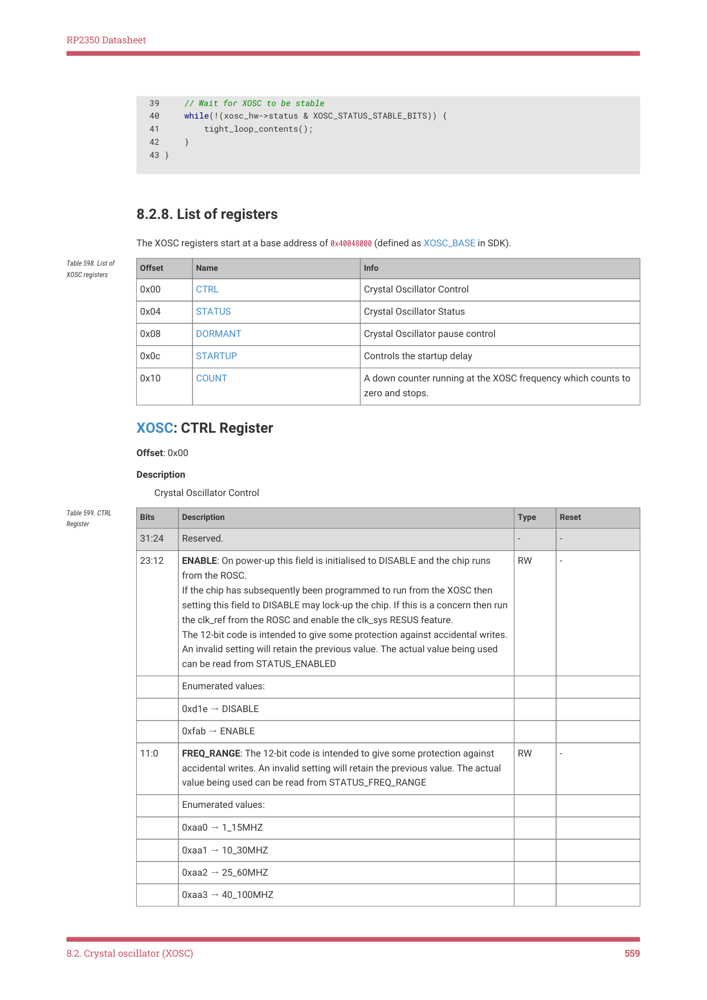

# 8.2.8. List of registers

RP2350 Datasheet

39     // Wait for XOSC to be stable

40     while(!(xosc_hw->status & XOSC_STATUS_STABLE_BITS)) {

41         tight_loop_contents();

42     }

43 }

8.2.8. List of registers

The XOSC registers start at a base address of 0x40048000 (defined as XOSC_BASE in SDK).

| Offset | Name | Info |
| --- | --- | --- |
| 0x00 | CTRL | Crystal Oscillator Control |
| 0x04 | STATUS | Crystal Oscillator Status |
| 0x08 | DORMANT | Crystal Oscillator pause control |
| 0x0c | STARTUP | Controls the startup delay |
| 0x10 | COUNT | A down counter running at the XOSC frequency which counts to
zero and stops. |

Table 598. List of

XOSC: CTRL Register

Offset: 0x00

Description

Crystal Oscillator Control

| Bits | Description | Type | Reset |
| --- | --- | --- | --- |
| 31:24 | Reserved. | - | - |
| 23:12 | ENABLE: On power-up this field is initialised to DISABLE and the chip runs
from the ROSC.
If the chip has subsequently been programmed to run from the XOSC then
setting this field to DISABLE may lock-up the chip. If this is a concern then run
the clk_ref from the ROSC and enable the clk_sys RESUS feature.
The 12-bit code is intended to give some protection against accidental writes.
An invalid setting will retain the previous value. The actual value being used
can be read from STATUS_ENABLED | RW | - |
|  | Enumerated values: |  |  |
|  | 0xd1e → DISABLE |  |  |
|  | 0xfab → ENABLE |  |  |
| 11:0 | FREQ_RANGE: The 12-bit code is intended to give some protection against
accidental writes. An invalid setting will retain the previous value. The actual
value being used can be read from STATUS_FREQ_RANGE | RW | - |
|  | Enumerated values: |  |  |
|  | 0xaa0 → 1_15MHZ |  |  |
|  | 0xaa1 → 10_30MHZ |  |  |
|  | 0xaa2 → 25_60MHZ |  |  |
|  | 0xaa3 → 40_100MHZ |  |  |

Table 599. CTRL

8.2. Crystal oscillator (XOSC)
559

RP2350 Datasheet

XOSC: STATUS Register

Offset: 0x04

Description

Crystal Oscillator Status

| Bits | Description | Type | Reset |
| --- | --- | --- | --- |
| 31 | STABLE: Oscillator is running and stable | RO | 0x0 |
| 30:25 | Reserved. | - | - |
| 24 | BADWRITE: An invalid value has been written to CTRL_ENABLE or
CTRL_FREQ_RANGE or DORMANT | WC | 0x0 |
| 23:13 | Reserved. | - | - |
| 12 | ENABLED: Oscillator is enabled but not necessarily running and stable, resets
to 0 | RO | - |
| 11:2 | Reserved. | - | - |
| 1:0 | FREQ_RANGE: The current frequency range setting | RO | - |
|  | Enumerated values: |  |  |
|  | 0x0 → 1_15MHZ |  |  |
|  | 0x1 → 10_30MHZ |  |  |
|  | 0x2 → 25_60MHZ |  |  |
|  | 0x3 → 40_100MHZ |  |  |

Table 600. STATUS

XOSC: DORMANT Register

Offset: 0x08

Description

Crystal Oscillator pause control

| Bits | Description | Type | Reset |
| --- | --- | --- | --- |
| 31:0 | This is used to save power by pausing the XOSC
On power-up this field is initialised to WAKE
An invalid write will also select WAKE
WARNING: stop the PLLs before selecting dormant mode
WARNING: setup the irq before selecting dormant mode | RW | - |
|  | Enumerated values: |  |  |
|  | 0x636f6d61 → DORMANT |  |  |
|  | 0x77616b65 → WAKE |  |  |

Table 601. DORMANT

XOSC: STARTUP Register

Offset: 0x0c

Description

Controls the startup delay

| Bits | Description | Type | Reset |
| --- | --- | --- | --- |
| 31:21 | Reserved. | - | - |

Table 602. STARTUP

8.2. Crystal oscillator (XOSC)
560
