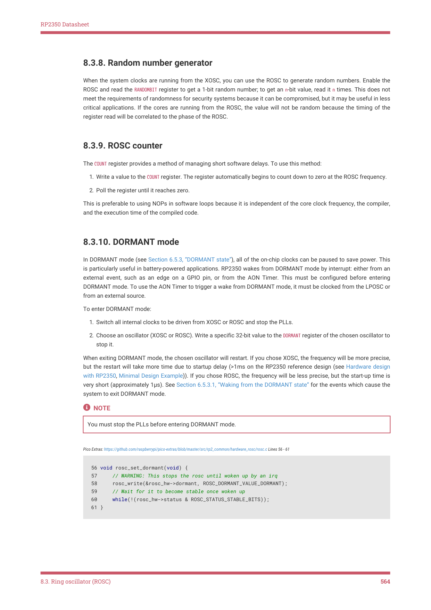

# 8.3.10. DORMANT mode

RP2350 Datasheet

8.3.8. Random number generator

When the system clocks are running from the XOSC, you can use the ROSC to generate random numbers. Enable the

ROSC and read the RANDOMBIT register to get a 1-bit random number; to get an n-bit value, read it n times. This does not

meet the requirements of randomness for security systems because it can be compromised, but it may be useful in less

critical applications. If the cores are running from the ROSC, the value will not be random because the timing of the

register read will be correlated to the phase of the ROSC.

8.3.9. ROSC counter

The COUNT register provides a method of managing short software delays. To use this method:

1. Write a value to the COUNT register. The register automatically begins to count down to zero at the ROSC frequency.

2. Poll the register until it reaches zero.

This is preferable to using NOPs in software loops because it is independent of the core clock frequency, the compiler,

and the execution time of the compiled code.

8.3.10. DORMANT mode

In DORMANT mode (see Section 6.5.3, “DORMANT state”), all of the on-chip clocks can be paused to save power. This

is particularly useful in battery-powered applications. RP2350 wakes from DORMANT mode by interrupt: either from an

external event, such as an edge on a GPIO pin, or from the AON Timer. This must be configured before entering

DORMANT mode. To use the AON Timer to trigger a wake from DORMANT mode, it must be clocked from the LPOSC or

from an external source.

To enter DORMANT mode:

1. Switch all internal clocks to be driven from XOSC or ROSC and stop the PLLs.

2. Choose an oscillator (XOSC or ROSC). Write a specific 32-bit value to the DORMANT register of the chosen oscillator to

stop it.

When exiting DORMANT mode, the chosen oscillator will restart. If you chose XOSC, the frequency will be more precise,

but the restart will take more time due to startup delay (>1ms on the RP2350 reference design (see Hardware design

with RP2350, Minimal Design Example)). If you chose ROSC, the frequency will be less precise, but the start-up time is

very short (approximately 1μs). See Section 6.5.3.1, “Waking from the DORMANT state” for the events which cause the

system to exit DORMANT mode.

NOTE

You must stop the PLLs before entering DORMANT mode.

Pico Extras: https://github.com/raspberrypi/pico-extras/blob/master/src/rp2_common/hardware_rosc/rosc.c Lines 56 - 61

56 void rosc_set_dormant(void) {

57     // WARNING: This stops the rosc until woken up by an irq

58     rosc_write(&rosc_hw->dormant, ROSC_DORMANT_VALUE_DORMANT);

59     // Wait for it to become stable once woken up

60     while(!(rosc_hw->status & ROSC_STATUS_STABLE_BITS));

61 }

8.3. Ring oscillator (ROSC)
564
