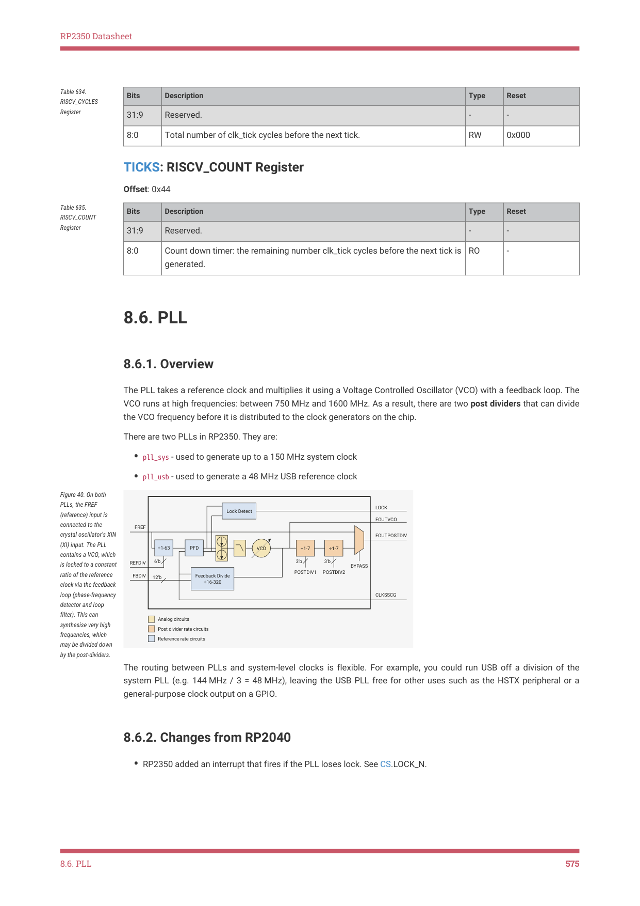

# 8.6.2. Changes from RP2040

RP2350 Datasheet

| Bits | Description | Type | Reset |
| --- | --- | --- | --- |
| 31:9 | Reserved. | - | - |
| 8:0 | Total number of clk_tick cycles before the next tick. | RW | 0x000 |

Table 634.

RISCV_CYCLES

Register

TICKS: RISCV_COUNT Register

Offset: 0x44

| Bits | Description | Type | Reset |
| --- | --- | --- | --- |
| 31:9 | Reserved. | - | - |
| 8:0 | Count down timer: the remaining number clk_tick cycles before the next tick is
generated. | RO | - |

Table 635.

RISCV_COUNT

Register

8.6. PLL

8.6.1. Overview

The PLL takes a reference clock and multiplies it using a Voltage Controlled Oscillator (VCO) with a feedback loop. The

VCO runs at high frequencies: between 750 MHz and 1600 MHz. As a result, there are two post dividers that can divide

the VCO frequency before it is distributed to the clock generators on the chip.

There are two PLLs in RP2350. They are:

• pll_sys - used to generate up to a 150 MHz system clock
• pll_usb - used to generate a 48 MHz USB reference clock

Figure 40. On both

PLLs, the FREF

LOCK

Lock Detect

(reference) input is

FOUTVCO

connected to the

FREF

crystal oscillator’s XIN

FOUTPOSTDIV

| ÷1-63 PFD |  |  |  |  | VCO | ÷1-7 ÷1-7 |
| --- | --- | --- | --- | --- | --- | --- |
| ÷1-63 |  |  |  |  |  |  |
|  |  |  |  |  |  |  |

(XI) input. The PLL

contains a VCO, which

6'b
3'b
3'b

REFDIV

is locked to a constant

BYPASS
POSTDIV1
POSTDIV2

ratio of the reference

FBDIV

Feedback Divide

12'b

÷16-320

clock via the feedback

loop (phase-frequency

CLKSSCG

detector and loop

filter). This can

Analog circuits

synthesise very high

Post divider rate circuits

frequencies, which

Reference rate circuits

may be divided down

by the post-dividers.

The routing between PLLs and system-level clocks is flexible. For example, you could run USB off a division of the

system PLL (e.g. 144 MHz / 3 = 48 MHz), leaving the USB PLL free for other uses such as the HSTX peripheral or a

general-purpose clock output on a GPIO.

8.6.2. Changes from RP2040

• RP2350 added an interrupt that fires if the PLL loses lock. See CS.LOCK_N.

8.6. PLL
575
