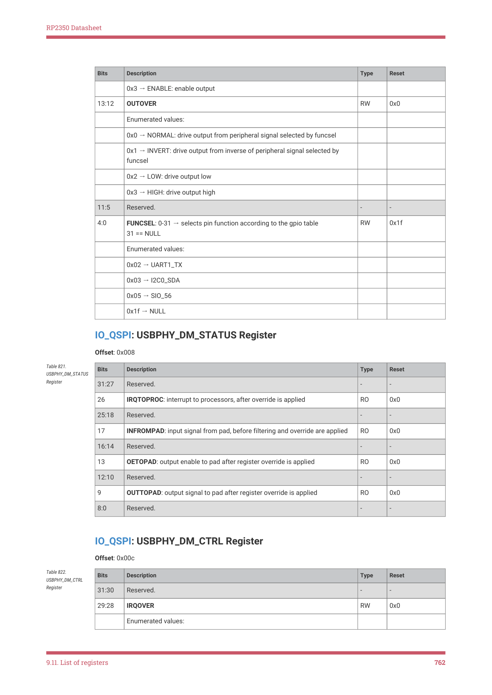
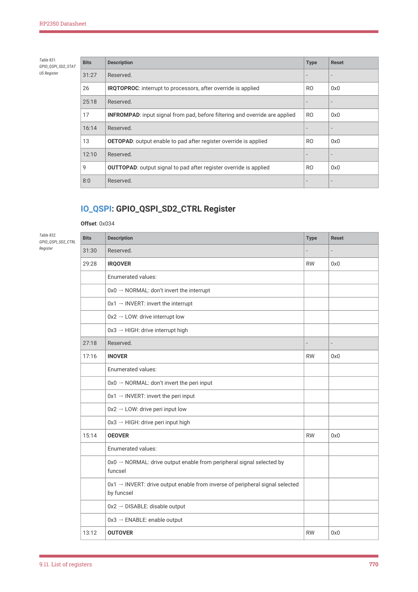
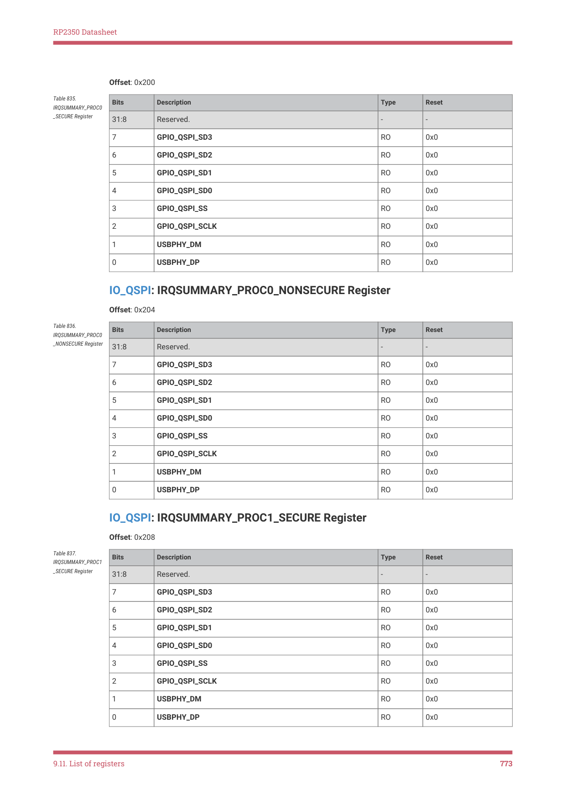
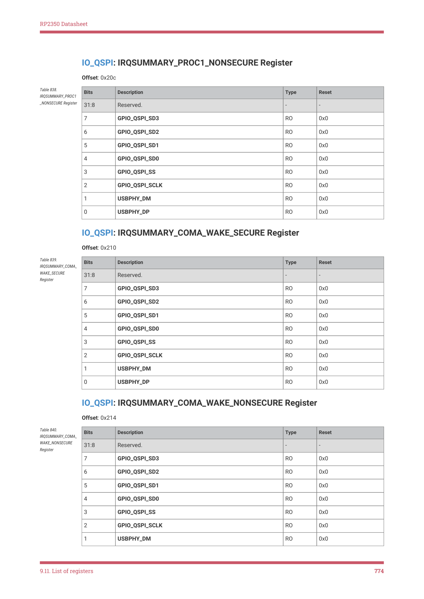
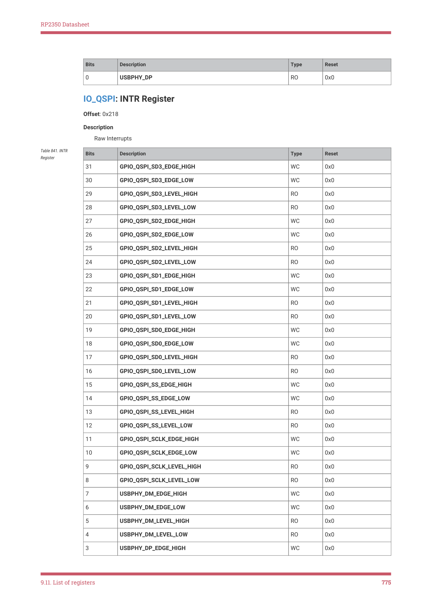
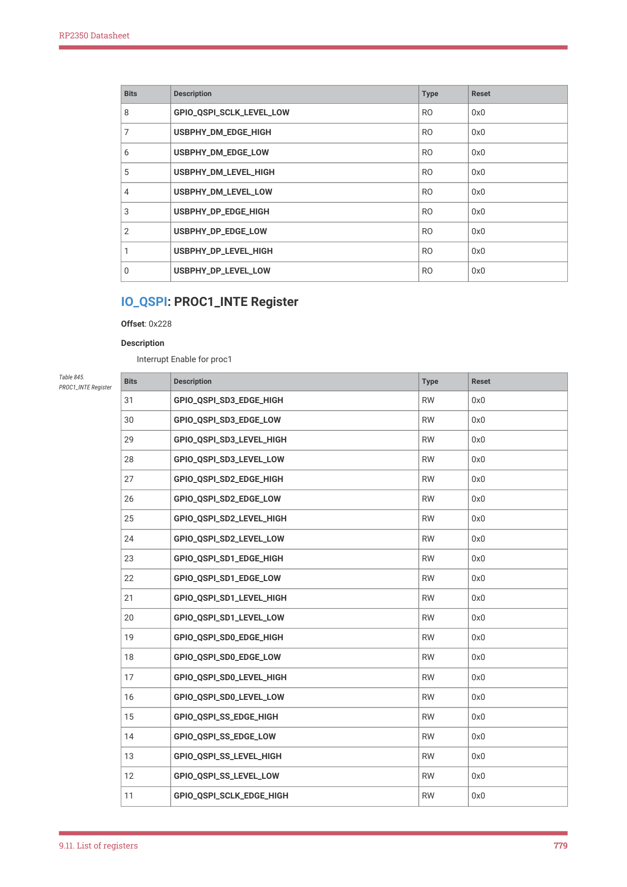
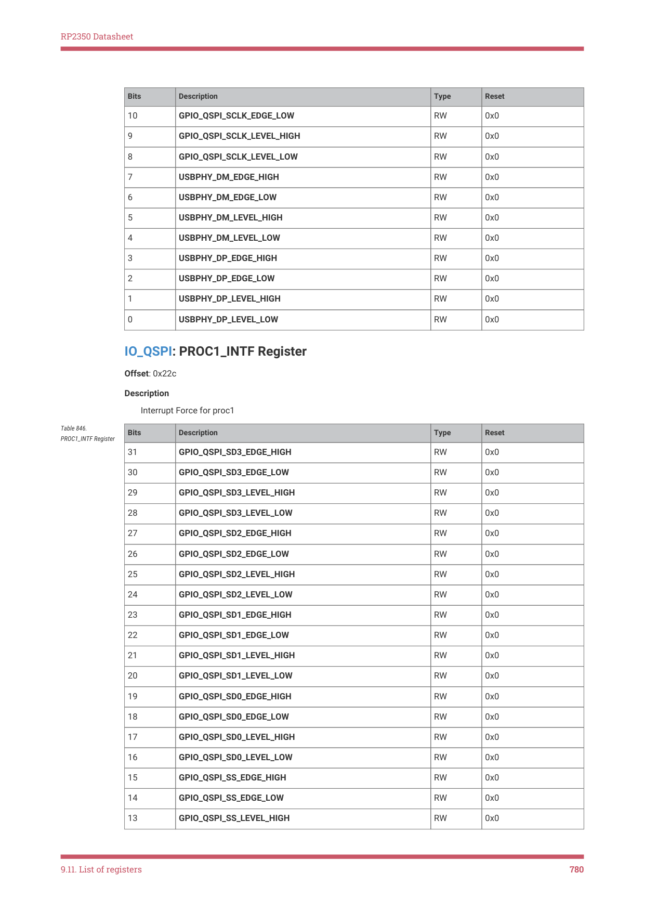
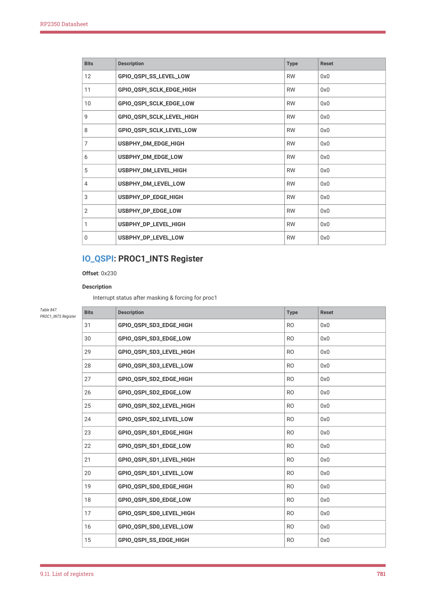
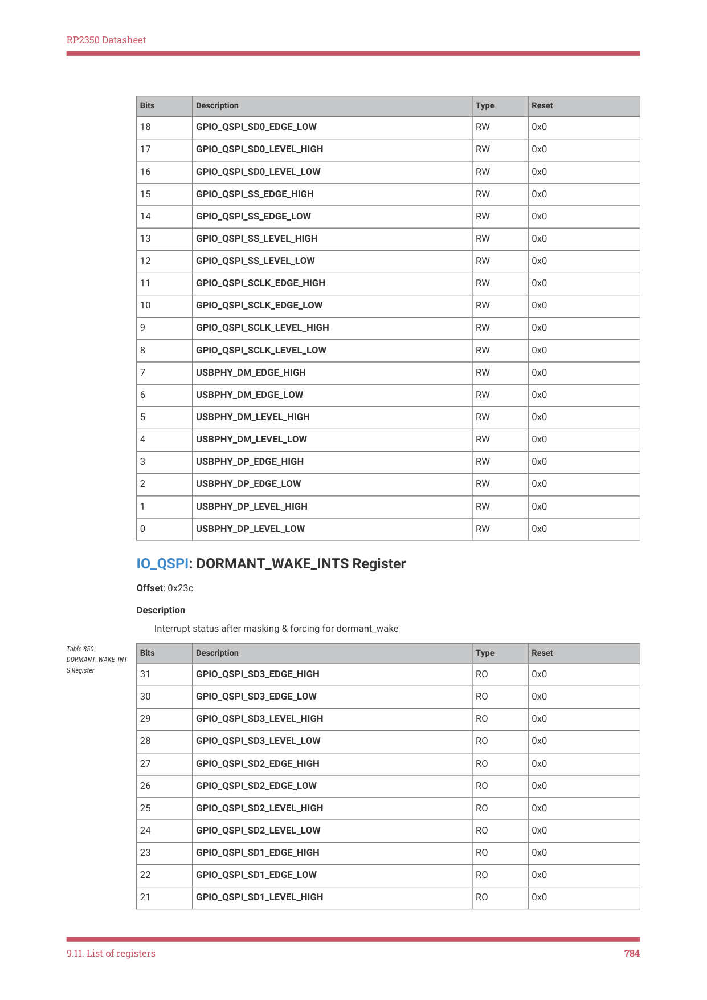

# 9.11.2. IO - QSPI Bank

RP2350 Datasheet

9.11.2. IO - QSPI Bank

The QSPI Bank IO registers start at a base address of 0x40030000 (defined as IO_QSPI_BASE in SDK).

| Offset | Name | Info |
| --- | --- | --- |
| 0x000 | USBPHY_DP_STATUS |  |
| 0x004 | USBPHY_DP_CTRL |  |
| 0x008 | USBPHY_DM_STATUS |  |
| 0x00c | USBPHY_DM_CTRL |  |
| 0x010 | GPIO_QSPI_SCLK_STATUS |  |
| 0x014 | GPIO_QSPI_SCLK_CTRL |  |
| 0x018 | GPIO_QSPI_SS_STATUS |  |
| 0x01c | GPIO_QSPI_SS_CTRL |  |
| 0x020 | GPIO_QSPI_SD0_STATUS |  |
| 0x024 | GPIO_QSPI_SD0_CTRL |  |
| 0x028 | GPIO_QSPI_SD1_STATUS |  |
| 0x02c | GPIO_QSPI_SD1_CTRL |  |
| 0x030 | GPIO_QSPI_SD2_STATUS |  |
| 0x034 | GPIO_QSPI_SD2_CTRL |  |
| 0x038 | GPIO_QSPI_SD3_STATUS |  |
| 0x03c | GPIO_QSPI_SD3_CTRL |  |
| 0x200 | IRQSUMMARY_PROC0_SECURE |  |
| 0x204 | IRQSUMMARY_PROC0_NONSECURE |  |
| 0x208 | IRQSUMMARY_PROC1_SECURE |  |
| 0x20c | IRQSUMMARY_PROC1_NONSECURE |  |
| 0x210 | IRQSUMMARY_COMA_WAKE_SECURE |  |
| 0x214 | IRQSUMMARY_COMA_WAKE_NONSE
CURE |  |
| 0x218 | INTR | Raw Interrupts |
| 0x21c | PROC0_INTE | Interrupt Enable for proc0 |
| 0x220 | PROC0_INTF | Interrupt Force for proc0 |
| 0x224 | PROC0_INTS | Interrupt status after masking & forcing for proc0 |
| 0x228 | PROC1_INTE | Interrupt Enable for proc1 |
| 0x22c | PROC1_INTF | Interrupt Force for proc1 |
| 0x230 | PROC1_INTS | Interrupt status after masking & forcing for proc1 |
| 0x234 | DORMANT_WAKE_INTE | Interrupt Enable for dormant_wake |
| 0x238 | DORMANT_WAKE_INTF | Interrupt Force for dormant_wake |
| 0x23c | DORMANT_WAKE_INTS | Interrupt status after masking & forcing for dormant_wake |

Table 818. List of

9.11. List of registers
760

RP2350 Datasheet

IO_QSPI: USBPHY_DP_STATUS Register

Offset: 0x000

| Bits | Description | Type | Reset |
| --- | --- | --- | --- |
| 31:27 | Reserved. | - | - |
| 26 | IRQTOPROC: interrupt to processors, after override is applied | RO | 0x0 |
| 25:18 | Reserved. | - | - |
| 17 | INFROMPAD: input signal from pad, before filtering and override are applied | RO | 0x0 |
| 16:14 | Reserved. | - | - |
| 13 | OETOPAD: output enable to pad after register override is applied | RO | 0x0 |
| 12:10 | Reserved. | - | - |
| 9 | OUTTOPAD: output signal to pad after register override is applied | RO | 0x0 |
| 8:0 | Reserved. | - | - |

Table 819.

USBPHY_DP_STATUS

Register

IO_QSPI: USBPHY_DP_CTRL Register

Offset: 0x004

| Bits | Description | Type | Reset |
| --- | --- | --- | --- |
| 31:30 | Reserved. | - | - |
| 29:28 | IRQOVER | RW | 0x0 |
|  | Enumerated values: |  |  |
|  | 0x0 → NORMAL: don’t invert the interrupt |  |  |
|  | 0x1 → INVERT: invert the interrupt |  |  |
|  | 0x2 → LOW: drive interrupt low |  |  |
|  | 0x3 → HIGH: drive interrupt high |  |  |
| 27:18 | Reserved. | - | - |
| 17:16 | INOVER | RW | 0x0 |
|  | Enumerated values: |  |  |
|  | 0x0 → NORMAL: don’t invert the peri input |  |  |
|  | 0x1 → INVERT: invert the peri input |  |  |
|  | 0x2 → LOW: drive peri input low |  |  |
|  | 0x3 → HIGH: drive peri input high |  |  |
| 15:14 | OEOVER | RW | 0x0 |
|  | Enumerated values: |  |  |
|  | 0x0 → NORMAL: drive output enable from peripheral signal selected by
funcsel |  |  |
|  | 0x1 → INVERT: drive output enable from inverse of peripheral signal selected
by funcsel |  |  |
|  | 0x2 → DISABLE: disable output |  |  |

Table 820.

USBPHY_DP_CTRL

Register

9.11. List of registers
761

RP2350 Datasheet

| Bits | Description | Type | Reset |
| --- | --- | --- | --- |
|  | 0x3 → ENABLE: enable output |  |  |
| 13:12 | OUTOVER | RW | 0x0 |
|  | Enumerated values: |  |  |
|  | 0x0 → NORMAL: drive output from peripheral signal selected by funcsel |  |  |
|  | 0x1 → INVERT: drive output from inverse of peripheral signal selected by
funcsel |  |  |
|  | 0x2 → LOW: drive output low |  |  |
|  | 0x3 → HIGH: drive output high |  |  |
| 11:5 | Reserved. | - | - |
| 4:0 | FUNCSEL: 0-31 → selects pin function according to the gpio table
31 == NULL | RW | 0x1f |
|  | Enumerated values: |  |  |
|  | 0x02 → UART1_TX |  |  |
|  | 0x03 → I2C0_SDA |  |  |
|  | 0x05 → SIO_56 |  |  |
|  | 0x1f → NULL |  |  |

IO_QSPI: USBPHY_DM_STATUS Register

Offset: 0x008

| Bits | Description | Type | Reset |
| --- | --- | --- | --- |
| 31:27 | Reserved. | - | - |
| 26 | IRQTOPROC: interrupt to processors, after override is applied | RO | 0x0 |
| 25:18 | Reserved. | - | - |
| 17 | INFROMPAD: input signal from pad, before filtering and override are applied | RO | 0x0 |
| 16:14 | Reserved. | - | - |
| 13 | OETOPAD: output enable to pad after register override is applied | RO | 0x0 |
| 12:10 | Reserved. | - | - |
| 9 | OUTTOPAD: output signal to pad after register override is applied | RO | 0x0 |
| 8:0 | Reserved. | - | - |

Table 821.

USBPHY_DM_STATUS

Register

IO_QSPI: USBPHY_DM_CTRL Register

Offset: 0x00c

| Bits | Description | Type | Reset |
| --- | --- | --- | --- |
| 31:30 | Reserved. | - | - |
| 29:28 | IRQOVER | RW | 0x0 |
|  | Enumerated values: |  |  |

Table 822.

USBPHY_DM_CTRL

Register

9.11. List of registers
762

RP2350 Datasheet

| Bits | Description | Type | Reset |
| --- | --- | --- | --- |
|  | 0x0 → NORMAL: don’t invert the interrupt |  |  |
|  | 0x1 → INVERT: invert the interrupt |  |  |
|  | 0x2 → LOW: drive interrupt low |  |  |
|  | 0x3 → HIGH: drive interrupt high |  |  |
| 27:18 | Reserved. | - | - |
| 17:16 | INOVER | RW | 0x0 |
|  | Enumerated values: |  |  |
|  | 0x0 → NORMAL: don’t invert the peri input |  |  |
|  | 0x1 → INVERT: invert the peri input |  |  |
|  | 0x2 → LOW: drive peri input low |  |  |
|  | 0x3 → HIGH: drive peri input high |  |  |
| 15:14 | OEOVER | RW | 0x0 |
|  | Enumerated values: |  |  |
|  | 0x0 → NORMAL: drive output enable from peripheral signal selected by
funcsel |  |  |
|  | 0x1 → INVERT: drive output enable from inverse of peripheral signal selected
by funcsel |  |  |
|  | 0x2 → DISABLE: disable output |  |  |
|  | 0x3 → ENABLE: enable output |  |  |
| 13:12 | OUTOVER | RW | 0x0 |
|  | Enumerated values: |  |  |
|  | 0x0 → NORMAL: drive output from peripheral signal selected by funcsel |  |  |
|  | 0x1 → INVERT: drive output from inverse of peripheral signal selected by
funcsel |  |  |
|  | 0x2 → LOW: drive output low |  |  |
|  | 0x3 → HIGH: drive output high |  |  |
| 11:5 | Reserved. | - | - |
| 4:0 | FUNCSEL: 0-31 → selects pin function according to the gpio table
31 == NULL | RW | 0x1f |
|  | Enumerated values: |  |  |
|  | 0x02 → UART1_RX |  |  |
|  | 0x03 → I2C0_SCL |  |  |
|  | 0x05 → SIO_57 |  |  |
|  | 0x1f → NULL |  |  |

IO_QSPI: GPIO_QSPI_SCLK_STATUS Register

Offset: 0x010

9.11. List of registers
763

RP2350 Datasheet

| Bits | Description | Type | Reset |
| --- | --- | --- | --- |
| 31:27 | Reserved. | - | - |
| 26 | IRQTOPROC: interrupt to processors, after override is applied | RO | 0x0 |
| 25:18 | Reserved. | - | - |
| 17 | INFROMPAD: input signal from pad, before filtering and override are applied | RO | 0x0 |
| 16:14 | Reserved. | - | - |
| 13 | OETOPAD: output enable to pad after register override is applied | RO | 0x0 |
| 12:10 | Reserved. | - | - |
| 9 | OUTTOPAD: output signal to pad after register override is applied | RO | 0x0 |
| 8:0 | Reserved. | - | - |

Table 823.

GPIO_QSPI_SCLK_STA

TUS Register

IO_QSPI: GPIO_QSPI_SCLK_CTRL Register

Offset: 0x014

| Bits | Description | Type | Reset |
| --- | --- | --- | --- |
| 31:30 | Reserved. | - | - |
| 29:28 | IRQOVER | RW | 0x0 |
|  | Enumerated values: |  |  |
|  | 0x0 → NORMAL: don’t invert the interrupt |  |  |
|  | 0x1 → INVERT: invert the interrupt |  |  |
|  | 0x2 → LOW: drive interrupt low |  |  |
|  | 0x3 → HIGH: drive interrupt high |  |  |
| 27:18 | Reserved. | - | - |
| 17:16 | INOVER | RW | 0x0 |
|  | Enumerated values: |  |  |
|  | 0x0 → NORMAL: don’t invert the peri input |  |  |
|  | 0x1 → INVERT: invert the peri input |  |  |
|  | 0x2 → LOW: drive peri input low |  |  |
|  | 0x3 → HIGH: drive peri input high |  |  |
| 15:14 | OEOVER | RW | 0x0 |
|  | Enumerated values: |  |  |
|  | 0x0 → NORMAL: drive output enable from peripheral signal selected by
funcsel |  |  |
|  | 0x1 → INVERT: drive output enable from inverse of peripheral signal selected
by funcsel |  |  |
|  | 0x2 → DISABLE: disable output |  |  |
|  | 0x3 → ENABLE: enable output |  |  |
| 13:12 | OUTOVER | RW | 0x0 |

Table 824.

GPIO_QSPI_SCLK_CTR

L Register

9.11. List of registers
764

RP2350 Datasheet

| Bits | Description | Type | Reset |
| --- | --- | --- | --- |
|  | Enumerated values: |  |  |
|  | 0x0 → NORMAL: drive output from peripheral signal selected by funcsel |  |  |
|  | 0x1 → INVERT: drive output from inverse of peripheral signal selected by
funcsel |  |  |
|  | 0x2 → LOW: drive output low |  |  |
|  | 0x3 → HIGH: drive output high |  |  |
| 11:5 | Reserved. | - | - |
| 4:0 | FUNCSEL: 0-31 → selects pin function according to the gpio table
31 == NULL | RW | 0x1f |
|  | Enumerated values: |  |  |
|  | 0x00 → XIP_SCLK |  |  |
|  | 0x02 → UART1_CTS |  |  |
|  | 0x03 → I2C1_SDA |  |  |
|  | 0x05 → SIO_58 |  |  |
|  | 0x0b → UART1_TX |  |  |
|  | 0x1f → NULL |  |  |

IO_QSPI: GPIO_QSPI_SS_STATUS Register

Offset: 0x018

| Bits | Description | Type | Reset |
| --- | --- | --- | --- |
| 31:27 | Reserved. | - | - |
| 26 | IRQTOPROC: interrupt to processors, after override is applied | RO | 0x0 |
| 25:18 | Reserved. | - | - |
| 17 | INFROMPAD: input signal from pad, before filtering and override are applied | RO | 0x0 |
| 16:14 | Reserved. | - | - |
| 13 | OETOPAD: output enable to pad after register override is applied | RO | 0x0 |
| 12:10 | Reserved. | - | - |
| 9 | OUTTOPAD: output signal to pad after register override is applied | RO | 0x0 |
| 8:0 | Reserved. | - | - |

Table 825.

GPIO_QSPI_SS_STATU

S Register

IO_QSPI: GPIO_QSPI_SS_CTRL Register

Offset: 0x01c

| Bits | Description | Type | Reset |
| --- | --- | --- | --- |
| 31:30 | Reserved. | - | - |
| 29:28 | IRQOVER | RW | 0x0 |
|  | Enumerated values: |  |  |

Table 826.

GPIO_QSPI_SS_CTRL

Register

9.11. List of registers
765

RP2350 Datasheet

| Bits | Description | Type | Reset |
| --- | --- | --- | --- |
|  | 0x0 → NORMAL: don’t invert the interrupt |  |  |
|  | 0x1 → INVERT: invert the interrupt |  |  |
|  | 0x2 → LOW: drive interrupt low |  |  |
|  | 0x3 → HIGH: drive interrupt high |  |  |
| 27:18 | Reserved. | - | - |
| 17:16 | INOVER | RW | 0x0 |
|  | Enumerated values: |  |  |
|  | 0x0 → NORMAL: don’t invert the peri input |  |  |
|  | 0x1 → INVERT: invert the peri input |  |  |
|  | 0x2 → LOW: drive peri input low |  |  |
|  | 0x3 → HIGH: drive peri input high |  |  |
| 15:14 | OEOVER | RW | 0x0 |
|  | Enumerated values: |  |  |
|  | 0x0 → NORMAL: drive output enable from peripheral signal selected by
funcsel |  |  |
|  | 0x1 → INVERT: drive output enable from inverse of peripheral signal selected
by funcsel |  |  |
|  | 0x2 → DISABLE: disable output |  |  |
|  | 0x3 → ENABLE: enable output |  |  |
| 13:12 | OUTOVER | RW | 0x0 |
|  | Enumerated values: |  |  |
|  | 0x0 → NORMAL: drive output from peripheral signal selected by funcsel |  |  |
|  | 0x1 → INVERT: drive output from inverse of peripheral signal selected by
funcsel |  |  |
|  | 0x2 → LOW: drive output low |  |  |
|  | 0x3 → HIGH: drive output high |  |  |
| 11:5 | Reserved. | - | - |
| 4:0 | FUNCSEL: 0-31 → selects pin function according to the gpio table
31 == NULL | RW | 0x1f |
|  | Enumerated values: |  |  |
|  | 0x00 → XIP_SS_N_0 |  |  |
|  | 0x02 → UART1_RTS |  |  |
|  | 0x03 → I2C1_SCL |  |  |
|  | 0x05 → SIO_59 |  |  |
|  | 0x0b → UART1_RX |  |  |
|  | 0x1f → NULL |  |  |

IO_QSPI: GPIO_QSPI_SD0_STATUS Register

9.11. List of registers
766

RP2350 Datasheet

Offset: 0x020

| Bits | Description | Type | Reset |
| --- | --- | --- | --- |
| 31:27 | Reserved. | - | - |
| 26 | IRQTOPROC: interrupt to processors, after override is applied | RO | 0x0 |
| 25:18 | Reserved. | - | - |
| 17 | INFROMPAD: input signal from pad, before filtering and override are applied | RO | 0x0 |
| 16:14 | Reserved. | - | - |
| 13 | OETOPAD: output enable to pad after register override is applied | RO | 0x0 |
| 12:10 | Reserved. | - | - |
| 9 | OUTTOPAD: output signal to pad after register override is applied | RO | 0x0 |
| 8:0 | Reserved. | - | - |

Table 827.

GPIO_QSPI_SD0_STAT

US Register

IO_QSPI: GPIO_QSPI_SD0_CTRL Register

Offset: 0x024

| Bits | Description | Type | Reset |
| --- | --- | --- | --- |
| 31:30 | Reserved. | - | - |
| 29:28 | IRQOVER | RW | 0x0 |
|  | Enumerated values: |  |  |
|  | 0x0 → NORMAL: don’t invert the interrupt |  |  |
|  | 0x1 → INVERT: invert the interrupt |  |  |
|  | 0x2 → LOW: drive interrupt low |  |  |
|  | 0x3 → HIGH: drive interrupt high |  |  |
| 27:18 | Reserved. | - | - |
| 17:16 | INOVER | RW | 0x0 |
|  | Enumerated values: |  |  |
|  | 0x0 → NORMAL: don’t invert the peri input |  |  |
|  | 0x1 → INVERT: invert the peri input |  |  |
|  | 0x2 → LOW: drive peri input low |  |  |
|  | 0x3 → HIGH: drive peri input high |  |  |
| 15:14 | OEOVER | RW | 0x0 |
|  | Enumerated values: |  |  |
|  | 0x0 → NORMAL: drive output enable from peripheral signal selected by
funcsel |  |  |
|  | 0x1 → INVERT: drive output enable from inverse of peripheral signal selected
by funcsel |  |  |
|  | 0x2 → DISABLE: disable output |  |  |
|  | 0x3 → ENABLE: enable output |  |  |

Table 828.

GPIO_QSPI_SD0_CTRL

Register

9.11. List of registers
767

RP2350 Datasheet

| Bits | Description | Type | Reset |
| --- | --- | --- | --- |
| 13:12 | OUTOVER | RW | 0x0 |
|  | Enumerated values: |  |  |
|  | 0x0 → NORMAL: drive output from peripheral signal selected by funcsel |  |  |
|  | 0x1 → INVERT: drive output from inverse of peripheral signal selected by
funcsel |  |  |
|  | 0x2 → LOW: drive output low |  |  |
|  | 0x3 → HIGH: drive output high |  |  |
| 11:5 | Reserved. | - | - |
| 4:0 | FUNCSEL: 0-31 → selects pin function according to the gpio table
31 == NULL | RW | 0x1f |
|  | Enumerated values: |  |  |
|  | 0x00 → XIP_SD0 |  |  |
|  | 0x02 → UART0_TX |  |  |
|  | 0x03 → I2C0_SDA |  |  |
|  | 0x05 → SIO_60 |  |  |
|  | 0x1f → NULL |  |  |

IO_QSPI: GPIO_QSPI_SD1_STATUS Register

Offset: 0x028

| Bits | Description | Type | Reset |
| --- | --- | --- | --- |
| 31:27 | Reserved. | - | - |
| 26 | IRQTOPROC: interrupt to processors, after override is applied | RO | 0x0 |
| 25:18 | Reserved. | - | - |
| 17 | INFROMPAD: input signal from pad, before filtering and override are applied | RO | 0x0 |
| 16:14 | Reserved. | - | - |
| 13 | OETOPAD: output enable to pad after register override is applied | RO | 0x0 |
| 12:10 | Reserved. | - | - |
| 9 | OUTTOPAD: output signal to pad after register override is applied | RO | 0x0 |
| 8:0 | Reserved. | - | - |

Table 829.

GPIO_QSPI_SD1_STAT

US Register

IO_QSPI: GPIO_QSPI_SD1_CTRL Register

Offset: 0x02c

| Bits | Description | Type | Reset |
| --- | --- | --- | --- |
| 31:30 | Reserved. | - | - |
| 29:28 | IRQOVER | RW | 0x0 |
|  | Enumerated values: |  |  |

Table 830.

GPIO_QSPI_SD1_CTRL

Register

9.11. List of registers
768

RP2350 Datasheet

| Bits | Description | Type | Reset |
| --- | --- | --- | --- |
|  | 0x0 → NORMAL: don’t invert the interrupt |  |  |
|  | 0x1 → INVERT: invert the interrupt |  |  |
|  | 0x2 → LOW: drive interrupt low |  |  |
|  | 0x3 → HIGH: drive interrupt high |  |  |
| 27:18 | Reserved. | - | - |
| 17:16 | INOVER | RW | 0x0 |
|  | Enumerated values: |  |  |
|  | 0x0 → NORMAL: don’t invert the peri input |  |  |
|  | 0x1 → INVERT: invert the peri input |  |  |
|  | 0x2 → LOW: drive peri input low |  |  |
|  | 0x3 → HIGH: drive peri input high |  |  |
| 15:14 | OEOVER | RW | 0x0 |
|  | Enumerated values: |  |  |
|  | 0x0 → NORMAL: drive output enable from peripheral signal selected by
funcsel |  |  |
|  | 0x1 → INVERT: drive output enable from inverse of peripheral signal selected
by funcsel |  |  |
|  | 0x2 → DISABLE: disable output |  |  |
|  | 0x3 → ENABLE: enable output |  |  |
| 13:12 | OUTOVER | RW | 0x0 |
|  | Enumerated values: |  |  |
|  | 0x0 → NORMAL: drive output from peripheral signal selected by funcsel |  |  |
|  | 0x1 → INVERT: drive output from inverse of peripheral signal selected by
funcsel |  |  |
|  | 0x2 → LOW: drive output low |  |  |
|  | 0x3 → HIGH: drive output high |  |  |
| 11:5 | Reserved. | - | - |
| 4:0 | FUNCSEL: 0-31 → selects pin function according to the gpio table
31 == NULL | RW | 0x1f |
|  | Enumerated values: |  |  |
|  | 0x00 → XIP_SD1 |  |  |
|  | 0x02 → UART0_RX |  |  |
|  | 0x03 → I2C0_SCL |  |  |
|  | 0x05 → SIO_61 |  |  |
|  | 0x1f → NULL |  |  |

IO_QSPI: GPIO_QSPI_SD2_STATUS Register

Offset: 0x030

9.11. List of registers
769

RP2350 Datasheet

| Bits | Description | Type | Reset |
| --- | --- | --- | --- |
| 31:27 | Reserved. | - | - |
| 26 | IRQTOPROC: interrupt to processors, after override is applied | RO | 0x0 |
| 25:18 | Reserved. | - | - |
| 17 | INFROMPAD: input signal from pad, before filtering and override are applied | RO | 0x0 |
| 16:14 | Reserved. | - | - |
| 13 | OETOPAD: output enable to pad after register override is applied | RO | 0x0 |
| 12:10 | Reserved. | - | - |
| 9 | OUTTOPAD: output signal to pad after register override is applied | RO | 0x0 |
| 8:0 | Reserved. | - | - |

Table 831.

GPIO_QSPI_SD2_STAT

US Register

IO_QSPI: GPIO_QSPI_SD2_CTRL Register

Offset: 0x034

| Bits | Description | Type | Reset |
| --- | --- | --- | --- |
| 31:30 | Reserved. | - | - |
| 29:28 | IRQOVER | RW | 0x0 |
|  | Enumerated values: |  |  |
|  | 0x0 → NORMAL: don’t invert the interrupt |  |  |
|  | 0x1 → INVERT: invert the interrupt |  |  |
|  | 0x2 → LOW: drive interrupt low |  |  |
|  | 0x3 → HIGH: drive interrupt high |  |  |
| 27:18 | Reserved. | - | - |
| 17:16 | INOVER | RW | 0x0 |
|  | Enumerated values: |  |  |
|  | 0x0 → NORMAL: don’t invert the peri input |  |  |
|  | 0x1 → INVERT: invert the peri input |  |  |
|  | 0x2 → LOW: drive peri input low |  |  |
|  | 0x3 → HIGH: drive peri input high |  |  |
| 15:14 | OEOVER | RW | 0x0 |
|  | Enumerated values: |  |  |
|  | 0x0 → NORMAL: drive output enable from peripheral signal selected by
funcsel |  |  |
|  | 0x1 → INVERT: drive output enable from inverse of peripheral signal selected
by funcsel |  |  |
|  | 0x2 → DISABLE: disable output |  |  |
|  | 0x3 → ENABLE: enable output |  |  |
| 13:12 | OUTOVER | RW | 0x0 |

Table 832.

GPIO_QSPI_SD2_CTRL

Register

9.11. List of registers
770

RP2350 Datasheet

| Bits | Description | Type | Reset |
| --- | --- | --- | --- |
|  | Enumerated values: |  |  |
|  | 0x0 → NORMAL: drive output from peripheral signal selected by funcsel |  |  |
|  | 0x1 → INVERT: drive output from inverse of peripheral signal selected by
funcsel |  |  |
|  | 0x2 → LOW: drive output low |  |  |
|  | 0x3 → HIGH: drive output high |  |  |
| 11:5 | Reserved. | - | - |
| 4:0 | FUNCSEL: 0-31 → selects pin function according to the gpio table
31 == NULL | RW | 0x1f |
|  | Enumerated values: |  |  |
|  | 0x00 → XIP_SD2 |  |  |
|  | 0x02 → UART0_CTS |  |  |
|  | 0x03 → I2C1_SDA |  |  |
|  | 0x05 → SIO_62 |  |  |
|  | 0x0b → UART0_TX |  |  |
|  | 0x1f → NULL |  |  |

IO_QSPI: GPIO_QSPI_SD3_STATUS Register

Offset: 0x038

| Bits | Description | Type | Reset |
| --- | --- | --- | --- |
| 31:27 | Reserved. | - | - |
| 26 | IRQTOPROC: interrupt to processors, after override is applied | RO | 0x0 |
| 25:18 | Reserved. | - | - |
| 17 | INFROMPAD: input signal from pad, before filtering and override are applied | RO | 0x0 |
| 16:14 | Reserved. | - | - |
| 13 | OETOPAD: output enable to pad after register override is applied | RO | 0x0 |
| 12:10 | Reserved. | - | - |
| 9 | OUTTOPAD: output signal to pad after register override is applied | RO | 0x0 |
| 8:0 | Reserved. | - | - |

Table 833.

GPIO_QSPI_SD3_STAT

US Register

IO_QSPI: GPIO_QSPI_SD3_CTRL Register

Offset: 0x03c

| Bits | Description | Type | Reset |
| --- | --- | --- | --- |
| 31:30 | Reserved. | - | - |
| 29:28 | IRQOVER | RW | 0x0 |
|  | Enumerated values: |  |  |

Table 834.

GPIO_QSPI_SD3_CTRL

Register

9.11. List of registers
771

RP2350 Datasheet

| Bits | Description | Type | Reset |
| --- | --- | --- | --- |
|  | 0x0 → NORMAL: don’t invert the interrupt |  |  |
|  | 0x1 → INVERT: invert the interrupt |  |  |
|  | 0x2 → LOW: drive interrupt low |  |  |
|  | 0x3 → HIGH: drive interrupt high |  |  |
| 27:18 | Reserved. | - | - |
| 17:16 | INOVER | RW | 0x0 |
|  | Enumerated values: |  |  |
|  | 0x0 → NORMAL: don’t invert the peri input |  |  |
|  | 0x1 → INVERT: invert the peri input |  |  |
|  | 0x2 → LOW: drive peri input low |  |  |
|  | 0x3 → HIGH: drive peri input high |  |  |
| 15:14 | OEOVER | RW | 0x0 |
|  | Enumerated values: |  |  |
|  | 0x0 → NORMAL: drive output enable from peripheral signal selected by
funcsel |  |  |
|  | 0x1 → INVERT: drive output enable from inverse of peripheral signal selected
by funcsel |  |  |
|  | 0x2 → DISABLE: disable output |  |  |
|  | 0x3 → ENABLE: enable output |  |  |
| 13:12 | OUTOVER | RW | 0x0 |
|  | Enumerated values: |  |  |
|  | 0x0 → NORMAL: drive output from peripheral signal selected by funcsel |  |  |
|  | 0x1 → INVERT: drive output from inverse of peripheral signal selected by
funcsel |  |  |
|  | 0x2 → LOW: drive output low |  |  |
|  | 0x3 → HIGH: drive output high |  |  |
| 11:5 | Reserved. | - | - |
| 4:0 | FUNCSEL: 0-31 → selects pin function according to the gpio table
31 == NULL | RW | 0x1f |
|  | Enumerated values: |  |  |
|  | 0x00 → XIP_SD3 |  |  |
|  | 0x02 → UART0_RTS |  |  |
|  | 0x03 → I2C1_SCL |  |  |
|  | 0x05 → SIO_63 |  |  |
|  | 0x0b → UART0_RX |  |  |
|  | 0x1f → NULL |  |  |

IO_QSPI: IRQSUMMARY_PROC0_SECURE Register

9.11. List of registers
772

RP2350 Datasheet

Offset: 0x200

| Bits | Description | Type | Reset |
| --- | --- | --- | --- |
| 31:8 | Reserved. | - | - |
| 7 | GPIO_QSPI_SD3 | RO | 0x0 |
| 6 | GPIO_QSPI_SD2 | RO | 0x0 |
| 5 | GPIO_QSPI_SD1 | RO | 0x0 |
| 4 | GPIO_QSPI_SD0 | RO | 0x0 |
| 3 | GPIO_QSPI_SS | RO | 0x0 |
| 2 | GPIO_QSPI_SCLK | RO | 0x0 |
| 1 | USBPHY_DM | RO | 0x0 |
| 0 | USBPHY_DP | RO | 0x0 |

Table 835.

IRQSUMMARY_PROC0

_SECURE Register

IO_QSPI: IRQSUMMARY_PROC0_NONSECURE Register

Offset: 0x204

| Bits | Description | Type | Reset |
| --- | --- | --- | --- |
| 31:8 | Reserved. | - | - |
| 7 | GPIO_QSPI_SD3 | RO | 0x0 |
| 6 | GPIO_QSPI_SD2 | RO | 0x0 |
| 5 | GPIO_QSPI_SD1 | RO | 0x0 |
| 4 | GPIO_QSPI_SD0 | RO | 0x0 |
| 3 | GPIO_QSPI_SS | RO | 0x0 |
| 2 | GPIO_QSPI_SCLK | RO | 0x0 |
| 1 | USBPHY_DM | RO | 0x0 |
| 0 | USBPHY_DP | RO | 0x0 |

Table 836.

IRQSUMMARY_PROC0

_NONSECURE Register

IO_QSPI: IRQSUMMARY_PROC1_SECURE Register

Offset: 0x208

| Bits | Description | Type | Reset |
| --- | --- | --- | --- |
| 31:8 | Reserved. | - | - |
| 7 | GPIO_QSPI_SD3 | RO | 0x0 |
| 6 | GPIO_QSPI_SD2 | RO | 0x0 |
| 5 | GPIO_QSPI_SD1 | RO | 0x0 |
| 4 | GPIO_QSPI_SD0 | RO | 0x0 |
| 3 | GPIO_QSPI_SS | RO | 0x0 |
| 2 | GPIO_QSPI_SCLK | RO | 0x0 |
| 1 | USBPHY_DM | RO | 0x0 |
| 0 | USBPHY_DP | RO | 0x0 |

Table 837.

IRQSUMMARY_PROC1

_SECURE Register

9.11. List of registers
773

RP2350 Datasheet

IO_QSPI: IRQSUMMARY_PROC1_NONSECURE Register

Offset: 0x20c

| Bits | Description | Type | Reset |
| --- | --- | --- | --- |
| 31:8 | Reserved. | - | - |
| 7 | GPIO_QSPI_SD3 | RO | 0x0 |
| 6 | GPIO_QSPI_SD2 | RO | 0x0 |
| 5 | GPIO_QSPI_SD1 | RO | 0x0 |
| 4 | GPIO_QSPI_SD0 | RO | 0x0 |
| 3 | GPIO_QSPI_SS | RO | 0x0 |
| 2 | GPIO_QSPI_SCLK | RO | 0x0 |
| 1 | USBPHY_DM | RO | 0x0 |
| 0 | USBPHY_DP | RO | 0x0 |

Table 838.

IRQSUMMARY_PROC1

_NONSECURE Register

IO_QSPI: IRQSUMMARY_COMA_WAKE_SECURE Register

Offset: 0x210

| Bits | Description | Type | Reset |
| --- | --- | --- | --- |
| 31:8 | Reserved. | - | - |
| 7 | GPIO_QSPI_SD3 | RO | 0x0 |
| 6 | GPIO_QSPI_SD2 | RO | 0x0 |
| 5 | GPIO_QSPI_SD1 | RO | 0x0 |
| 4 | GPIO_QSPI_SD0 | RO | 0x0 |
| 3 | GPIO_QSPI_SS | RO | 0x0 |
| 2 | GPIO_QSPI_SCLK | RO | 0x0 |
| 1 | USBPHY_DM | RO | 0x0 |
| 0 | USBPHY_DP | RO | 0x0 |

Table 839.

IRQSUMMARY_COMA_

WAKE_SECURE

Register

IO_QSPI: IRQSUMMARY_COMA_WAKE_NONSECURE Register

Offset: 0x214

| Bits | Description | Type | Reset |
| --- | --- | --- | --- |
| 31:8 | Reserved. | - | - |
| 7 | GPIO_QSPI_SD3 | RO | 0x0 |
| 6 | GPIO_QSPI_SD2 | RO | 0x0 |
| 5 | GPIO_QSPI_SD1 | RO | 0x0 |
| 4 | GPIO_QSPI_SD0 | RO | 0x0 |
| 3 | GPIO_QSPI_SS | RO | 0x0 |
| 2 | GPIO_QSPI_SCLK | RO | 0x0 |
| 1 | USBPHY_DM | RO | 0x0 |

Table 840.

IRQSUMMARY_COMA_

WAKE_NONSECURE

Register

9.11. List of registers
774

RP2350 Datasheet

| Bits | Description | Type | Reset |
| --- | --- | --- | --- |
| 0 | USBPHY_DP | RO | 0x0 |

IO_QSPI: INTR Register

Offset: 0x218

Description

Raw Interrupts

| Bits | Description | Type | Reset |
| --- | --- | --- | --- |
| 31 | GPIO_QSPI_SD3_EDGE_HIGH | WC | 0x0 |
| 30 | GPIO_QSPI_SD3_EDGE_LOW | WC | 0x0 |
| 29 | GPIO_QSPI_SD3_LEVEL_HIGH | RO | 0x0 |
| 28 | GPIO_QSPI_SD3_LEVEL_LOW | RO | 0x0 |
| 27 | GPIO_QSPI_SD2_EDGE_HIGH | WC | 0x0 |
| 26 | GPIO_QSPI_SD2_EDGE_LOW | WC | 0x0 |
| 25 | GPIO_QSPI_SD2_LEVEL_HIGH | RO | 0x0 |
| 24 | GPIO_QSPI_SD2_LEVEL_LOW | RO | 0x0 |
| 23 | GPIO_QSPI_SD1_EDGE_HIGH | WC | 0x0 |
| 22 | GPIO_QSPI_SD1_EDGE_LOW | WC | 0x0 |
| 21 | GPIO_QSPI_SD1_LEVEL_HIGH | RO | 0x0 |
| 20 | GPIO_QSPI_SD1_LEVEL_LOW | RO | 0x0 |
| 19 | GPIO_QSPI_SD0_EDGE_HIGH | WC | 0x0 |
| 18 | GPIO_QSPI_SD0_EDGE_LOW | WC | 0x0 |
| 17 | GPIO_QSPI_SD0_LEVEL_HIGH | RO | 0x0 |
| 16 | GPIO_QSPI_SD0_LEVEL_LOW | RO | 0x0 |
| 15 | GPIO_QSPI_SS_EDGE_HIGH | WC | 0x0 |
| 14 | GPIO_QSPI_SS_EDGE_LOW | WC | 0x0 |
| 13 | GPIO_QSPI_SS_LEVEL_HIGH | RO | 0x0 |
| 12 | GPIO_QSPI_SS_LEVEL_LOW | RO | 0x0 |
| 11 | GPIO_QSPI_SCLK_EDGE_HIGH | WC | 0x0 |
| 10 | GPIO_QSPI_SCLK_EDGE_LOW | WC | 0x0 |
| 9 | GPIO_QSPI_SCLK_LEVEL_HIGH | RO | 0x0 |
| 8 | GPIO_QSPI_SCLK_LEVEL_LOW | RO | 0x0 |
| 7 | USBPHY_DM_EDGE_HIGH | WC | 0x0 |
| 6 | USBPHY_DM_EDGE_LOW | WC | 0x0 |
| 5 | USBPHY_DM_LEVEL_HIGH | RO | 0x0 |
| 4 | USBPHY_DM_LEVEL_LOW | RO | 0x0 |
| 3 | USBPHY_DP_EDGE_HIGH | WC | 0x0 |

Table 841. INTR

9.11. List of registers
775

RP2350 Datasheet

| Bits | Description | Type | Reset |
| --- | --- | --- | --- |
| 2 | USBPHY_DP_EDGE_LOW | WC | 0x0 |
| 1 | USBPHY_DP_LEVEL_HIGH | RO | 0x0 |
| 0 | USBPHY_DP_LEVEL_LOW | RO | 0x0 |

IO_QSPI: PROC0_INTE Register

Offset: 0x21c

Description

Interrupt Enable for proc0

| Bits | Description | Type | Reset |
| --- | --- | --- | --- |
| 31 | GPIO_QSPI_SD3_EDGE_HIGH | RW | 0x0 |
| 30 | GPIO_QSPI_SD3_EDGE_LOW | RW | 0x0 |
| 29 | GPIO_QSPI_SD3_LEVEL_HIGH | RW | 0x0 |
| 28 | GPIO_QSPI_SD3_LEVEL_LOW | RW | 0x0 |
| 27 | GPIO_QSPI_SD2_EDGE_HIGH | RW | 0x0 |
| 26 | GPIO_QSPI_SD2_EDGE_LOW | RW | 0x0 |
| 25 | GPIO_QSPI_SD2_LEVEL_HIGH | RW | 0x0 |
| 24 | GPIO_QSPI_SD2_LEVEL_LOW | RW | 0x0 |
| 23 | GPIO_QSPI_SD1_EDGE_HIGH | RW | 0x0 |
| 22 | GPIO_QSPI_SD1_EDGE_LOW | RW | 0x0 |
| 21 | GPIO_QSPI_SD1_LEVEL_HIGH | RW | 0x0 |
| 20 | GPIO_QSPI_SD1_LEVEL_LOW | RW | 0x0 |
| 19 | GPIO_QSPI_SD0_EDGE_HIGH | RW | 0x0 |
| 18 | GPIO_QSPI_SD0_EDGE_LOW | RW | 0x0 |
| 17 | GPIO_QSPI_SD0_LEVEL_HIGH | RW | 0x0 |
| 16 | GPIO_QSPI_SD0_LEVEL_LOW | RW | 0x0 |
| 15 | GPIO_QSPI_SS_EDGE_HIGH | RW | 0x0 |
| 14 | GPIO_QSPI_SS_EDGE_LOW | RW | 0x0 |
| 13 | GPIO_QSPI_SS_LEVEL_HIGH | RW | 0x0 |
| 12 | GPIO_QSPI_SS_LEVEL_LOW | RW | 0x0 |
| 11 | GPIO_QSPI_SCLK_EDGE_HIGH | RW | 0x0 |
| 10 | GPIO_QSPI_SCLK_EDGE_LOW | RW | 0x0 |
| 9 | GPIO_QSPI_SCLK_LEVEL_HIGH | RW | 0x0 |
| 8 | GPIO_QSPI_SCLK_LEVEL_LOW | RW | 0x0 |
| 7 | USBPHY_DM_EDGE_HIGH | RW | 0x0 |
| 6 | USBPHY_DM_EDGE_LOW | RW | 0x0 |
| 5 | USBPHY_DM_LEVEL_HIGH | RW | 0x0 |

Table 842.

9.11. List of registers
776

RP2350 Datasheet

| Bits | Description | Type | Reset |
| --- | --- | --- | --- |
| 4 | USBPHY_DM_LEVEL_LOW | RW | 0x0 |
| 3 | USBPHY_DP_EDGE_HIGH | RW | 0x0 |
| 2 | USBPHY_DP_EDGE_LOW | RW | 0x0 |
| 1 | USBPHY_DP_LEVEL_HIGH | RW | 0x0 |
| 0 | USBPHY_DP_LEVEL_LOW | RW | 0x0 |

IO_QSPI: PROC0_INTF Register

Offset: 0x220

Description

Interrupt Force for proc0

| Bits | Description | Type | Reset |
| --- | --- | --- | --- |
| 31 | GPIO_QSPI_SD3_EDGE_HIGH | RW | 0x0 |
| 30 | GPIO_QSPI_SD3_EDGE_LOW | RW | 0x0 |
| 29 | GPIO_QSPI_SD3_LEVEL_HIGH | RW | 0x0 |
| 28 | GPIO_QSPI_SD3_LEVEL_LOW | RW | 0x0 |
| 27 | GPIO_QSPI_SD2_EDGE_HIGH | RW | 0x0 |
| 26 | GPIO_QSPI_SD2_EDGE_LOW | RW | 0x0 |
| 25 | GPIO_QSPI_SD2_LEVEL_HIGH | RW | 0x0 |
| 24 | GPIO_QSPI_SD2_LEVEL_LOW | RW | 0x0 |
| 23 | GPIO_QSPI_SD1_EDGE_HIGH | RW | 0x0 |
| 22 | GPIO_QSPI_SD1_EDGE_LOW | RW | 0x0 |
| 21 | GPIO_QSPI_SD1_LEVEL_HIGH | RW | 0x0 |
| 20 | GPIO_QSPI_SD1_LEVEL_LOW | RW | 0x0 |
| 19 | GPIO_QSPI_SD0_EDGE_HIGH | RW | 0x0 |
| 18 | GPIO_QSPI_SD0_EDGE_LOW | RW | 0x0 |
| 17 | GPIO_QSPI_SD0_LEVEL_HIGH | RW | 0x0 |
| 16 | GPIO_QSPI_SD0_LEVEL_LOW | RW | 0x0 |
| 15 | GPIO_QSPI_SS_EDGE_HIGH | RW | 0x0 |
| 14 | GPIO_QSPI_SS_EDGE_LOW | RW | 0x0 |
| 13 | GPIO_QSPI_SS_LEVEL_HIGH | RW | 0x0 |
| 12 | GPIO_QSPI_SS_LEVEL_LOW | RW | 0x0 |
| 11 | GPIO_QSPI_SCLK_EDGE_HIGH | RW | 0x0 |
| 10 | GPIO_QSPI_SCLK_EDGE_LOW | RW | 0x0 |
| 9 | GPIO_QSPI_SCLK_LEVEL_HIGH | RW | 0x0 |
| 8 | GPIO_QSPI_SCLK_LEVEL_LOW | RW | 0x0 |
| 7 | USBPHY_DM_EDGE_HIGH | RW | 0x0 |

Table 843.

9.11. List of registers
777

RP2350 Datasheet

| Bits | Description | Type | Reset |
| --- | --- | --- | --- |
| 6 | USBPHY_DM_EDGE_LOW | RW | 0x0 |
| 5 | USBPHY_DM_LEVEL_HIGH | RW | 0x0 |
| 4 | USBPHY_DM_LEVEL_LOW | RW | 0x0 |
| 3 | USBPHY_DP_EDGE_HIGH | RW | 0x0 |
| 2 | USBPHY_DP_EDGE_LOW | RW | 0x0 |
| 1 | USBPHY_DP_LEVEL_HIGH | RW | 0x0 |
| 0 | USBPHY_DP_LEVEL_LOW | RW | 0x0 |

IO_QSPI: PROC0_INTS Register

Offset: 0x224

Description

Interrupt status after masking & forcing for proc0

| Bits | Description | Type | Reset |
| --- | --- | --- | --- |
| 31 | GPIO_QSPI_SD3_EDGE_HIGH | RO | 0x0 |
| 30 | GPIO_QSPI_SD3_EDGE_LOW | RO | 0x0 |
| 29 | GPIO_QSPI_SD3_LEVEL_HIGH | RO | 0x0 |
| 28 | GPIO_QSPI_SD3_LEVEL_LOW | RO | 0x0 |
| 27 | GPIO_QSPI_SD2_EDGE_HIGH | RO | 0x0 |
| 26 | GPIO_QSPI_SD2_EDGE_LOW | RO | 0x0 |
| 25 | GPIO_QSPI_SD2_LEVEL_HIGH | RO | 0x0 |
| 24 | GPIO_QSPI_SD2_LEVEL_LOW | RO | 0x0 |
| 23 | GPIO_QSPI_SD1_EDGE_HIGH | RO | 0x0 |
| 22 | GPIO_QSPI_SD1_EDGE_LOW | RO | 0x0 |
| 21 | GPIO_QSPI_SD1_LEVEL_HIGH | RO | 0x0 |
| 20 | GPIO_QSPI_SD1_LEVEL_LOW | RO | 0x0 |
| 19 | GPIO_QSPI_SD0_EDGE_HIGH | RO | 0x0 |
| 18 | GPIO_QSPI_SD0_EDGE_LOW | RO | 0x0 |
| 17 | GPIO_QSPI_SD0_LEVEL_HIGH | RO | 0x0 |
| 16 | GPIO_QSPI_SD0_LEVEL_LOW | RO | 0x0 |
| 15 | GPIO_QSPI_SS_EDGE_HIGH | RO | 0x0 |
| 14 | GPIO_QSPI_SS_EDGE_LOW | RO | 0x0 |
| 13 | GPIO_QSPI_SS_LEVEL_HIGH | RO | 0x0 |
| 12 | GPIO_QSPI_SS_LEVEL_LOW | RO | 0x0 |
| 11 | GPIO_QSPI_SCLK_EDGE_HIGH | RO | 0x0 |
| 10 | GPIO_QSPI_SCLK_EDGE_LOW | RO | 0x0 |
| 9 | GPIO_QSPI_SCLK_LEVEL_HIGH | RO | 0x0 |

Table 844.

9.11. List of registers
778

RP2350 Datasheet

| Bits | Description | Type | Reset |
| --- | --- | --- | --- |
| 8 | GPIO_QSPI_SCLK_LEVEL_LOW | RO | 0x0 |
| 7 | USBPHY_DM_EDGE_HIGH | RO | 0x0 |
| 6 | USBPHY_DM_EDGE_LOW | RO | 0x0 |
| 5 | USBPHY_DM_LEVEL_HIGH | RO | 0x0 |
| 4 | USBPHY_DM_LEVEL_LOW | RO | 0x0 |
| 3 | USBPHY_DP_EDGE_HIGH | RO | 0x0 |
| 2 | USBPHY_DP_EDGE_LOW | RO | 0x0 |
| 1 | USBPHY_DP_LEVEL_HIGH | RO | 0x0 |
| 0 | USBPHY_DP_LEVEL_LOW | RO | 0x0 |

IO_QSPI: PROC1_INTE Register

Offset: 0x228

Description

Interrupt Enable for proc1

| Bits | Description | Type | Reset |
| --- | --- | --- | --- |
| 31 | GPIO_QSPI_SD3_EDGE_HIGH | RW | 0x0 |
| 30 | GPIO_QSPI_SD3_EDGE_LOW | RW | 0x0 |
| 29 | GPIO_QSPI_SD3_LEVEL_HIGH | RW | 0x0 |
| 28 | GPIO_QSPI_SD3_LEVEL_LOW | RW | 0x0 |
| 27 | GPIO_QSPI_SD2_EDGE_HIGH | RW | 0x0 |
| 26 | GPIO_QSPI_SD2_EDGE_LOW | RW | 0x0 |
| 25 | GPIO_QSPI_SD2_LEVEL_HIGH | RW | 0x0 |
| 24 | GPIO_QSPI_SD2_LEVEL_LOW | RW | 0x0 |
| 23 | GPIO_QSPI_SD1_EDGE_HIGH | RW | 0x0 |
| 22 | GPIO_QSPI_SD1_EDGE_LOW | RW | 0x0 |
| 21 | GPIO_QSPI_SD1_LEVEL_HIGH | RW | 0x0 |
| 20 | GPIO_QSPI_SD1_LEVEL_LOW | RW | 0x0 |
| 19 | GPIO_QSPI_SD0_EDGE_HIGH | RW | 0x0 |
| 18 | GPIO_QSPI_SD0_EDGE_LOW | RW | 0x0 |
| 17 | GPIO_QSPI_SD0_LEVEL_HIGH | RW | 0x0 |
| 16 | GPIO_QSPI_SD0_LEVEL_LOW | RW | 0x0 |
| 15 | GPIO_QSPI_SS_EDGE_HIGH | RW | 0x0 |
| 14 | GPIO_QSPI_SS_EDGE_LOW | RW | 0x0 |
| 13 | GPIO_QSPI_SS_LEVEL_HIGH | RW | 0x0 |
| 12 | GPIO_QSPI_SS_LEVEL_LOW | RW | 0x0 |
| 11 | GPIO_QSPI_SCLK_EDGE_HIGH | RW | 0x0 |

Table 845.

9.11. List of registers
779

RP2350 Datasheet

| Bits | Description | Type | Reset |
| --- | --- | --- | --- |
| 10 | GPIO_QSPI_SCLK_EDGE_LOW | RW | 0x0 |
| 9 | GPIO_QSPI_SCLK_LEVEL_HIGH | RW | 0x0 |
| 8 | GPIO_QSPI_SCLK_LEVEL_LOW | RW | 0x0 |
| 7 | USBPHY_DM_EDGE_HIGH | RW | 0x0 |
| 6 | USBPHY_DM_EDGE_LOW | RW | 0x0 |
| 5 | USBPHY_DM_LEVEL_HIGH | RW | 0x0 |
| 4 | USBPHY_DM_LEVEL_LOW | RW | 0x0 |
| 3 | USBPHY_DP_EDGE_HIGH | RW | 0x0 |
| 2 | USBPHY_DP_EDGE_LOW | RW | 0x0 |
| 1 | USBPHY_DP_LEVEL_HIGH | RW | 0x0 |
| 0 | USBPHY_DP_LEVEL_LOW | RW | 0x0 |

IO_QSPI: PROC1_INTF Register

Offset: 0x22c

Description

Interrupt Force for proc1

| Bits | Description | Type | Reset |
| --- | --- | --- | --- |
| 31 | GPIO_QSPI_SD3_EDGE_HIGH | RW | 0x0 |
| 30 | GPIO_QSPI_SD3_EDGE_LOW | RW | 0x0 |
| 29 | GPIO_QSPI_SD3_LEVEL_HIGH | RW | 0x0 |
| 28 | GPIO_QSPI_SD3_LEVEL_LOW | RW | 0x0 |
| 27 | GPIO_QSPI_SD2_EDGE_HIGH | RW | 0x0 |
| 26 | GPIO_QSPI_SD2_EDGE_LOW | RW | 0x0 |
| 25 | GPIO_QSPI_SD2_LEVEL_HIGH | RW | 0x0 |
| 24 | GPIO_QSPI_SD2_LEVEL_LOW | RW | 0x0 |
| 23 | GPIO_QSPI_SD1_EDGE_HIGH | RW | 0x0 |
| 22 | GPIO_QSPI_SD1_EDGE_LOW | RW | 0x0 |
| 21 | GPIO_QSPI_SD1_LEVEL_HIGH | RW | 0x0 |
| 20 | GPIO_QSPI_SD1_LEVEL_LOW | RW | 0x0 |
| 19 | GPIO_QSPI_SD0_EDGE_HIGH | RW | 0x0 |
| 18 | GPIO_QSPI_SD0_EDGE_LOW | RW | 0x0 |
| 17 | GPIO_QSPI_SD0_LEVEL_HIGH | RW | 0x0 |
| 16 | GPIO_QSPI_SD0_LEVEL_LOW | RW | 0x0 |
| 15 | GPIO_QSPI_SS_EDGE_HIGH | RW | 0x0 |
| 14 | GPIO_QSPI_SS_EDGE_LOW | RW | 0x0 |
| 13 | GPIO_QSPI_SS_LEVEL_HIGH | RW | 0x0 |

Table 846.

9.11. List of registers
780

RP2350 Datasheet

| Bits | Description | Type | Reset |
| --- | --- | --- | --- |
| 12 | GPIO_QSPI_SS_LEVEL_LOW | RW | 0x0 |
| 11 | GPIO_QSPI_SCLK_EDGE_HIGH | RW | 0x0 |
| 10 | GPIO_QSPI_SCLK_EDGE_LOW | RW | 0x0 |
| 9 | GPIO_QSPI_SCLK_LEVEL_HIGH | RW | 0x0 |
| 8 | GPIO_QSPI_SCLK_LEVEL_LOW | RW | 0x0 |
| 7 | USBPHY_DM_EDGE_HIGH | RW | 0x0 |
| 6 | USBPHY_DM_EDGE_LOW | RW | 0x0 |
| 5 | USBPHY_DM_LEVEL_HIGH | RW | 0x0 |
| 4 | USBPHY_DM_LEVEL_LOW | RW | 0x0 |
| 3 | USBPHY_DP_EDGE_HIGH | RW | 0x0 |
| 2 | USBPHY_DP_EDGE_LOW | RW | 0x0 |
| 1 | USBPHY_DP_LEVEL_HIGH | RW | 0x0 |
| 0 | USBPHY_DP_LEVEL_LOW | RW | 0x0 |

IO_QSPI: PROC1_INTS Register

Offset: 0x230

Description

Interrupt status after masking & forcing for proc1

| Bits | Description | Type | Reset |
| --- | --- | --- | --- |
| 31 | GPIO_QSPI_SD3_EDGE_HIGH | RO | 0x0 |
| 30 | GPIO_QSPI_SD3_EDGE_LOW | RO | 0x0 |
| 29 | GPIO_QSPI_SD3_LEVEL_HIGH | RO | 0x0 |
| 28 | GPIO_QSPI_SD3_LEVEL_LOW | RO | 0x0 |
| 27 | GPIO_QSPI_SD2_EDGE_HIGH | RO | 0x0 |
| 26 | GPIO_QSPI_SD2_EDGE_LOW | RO | 0x0 |
| 25 | GPIO_QSPI_SD2_LEVEL_HIGH | RO | 0x0 |
| 24 | GPIO_QSPI_SD2_LEVEL_LOW | RO | 0x0 |
| 23 | GPIO_QSPI_SD1_EDGE_HIGH | RO | 0x0 |
| 22 | GPIO_QSPI_SD1_EDGE_LOW | RO | 0x0 |
| 21 | GPIO_QSPI_SD1_LEVEL_HIGH | RO | 0x0 |
| 20 | GPIO_QSPI_SD1_LEVEL_LOW | RO | 0x0 |
| 19 | GPIO_QSPI_SD0_EDGE_HIGH | RO | 0x0 |
| 18 | GPIO_QSPI_SD0_EDGE_LOW | RO | 0x0 |
| 17 | GPIO_QSPI_SD0_LEVEL_HIGH | RO | 0x0 |
| 16 | GPIO_QSPI_SD0_LEVEL_LOW | RO | 0x0 |
| 15 | GPIO_QSPI_SS_EDGE_HIGH | RO | 0x0 |

Table 847.

9.11. List of registers
781

RP2350 Datasheet

| Bits | Description | Type | Reset |
| --- | --- | --- | --- |
| 14 | GPIO_QSPI_SS_EDGE_LOW | RO | 0x0 |
| 13 | GPIO_QSPI_SS_LEVEL_HIGH | RO | 0x0 |
| 12 | GPIO_QSPI_SS_LEVEL_LOW | RO | 0x0 |
| 11 | GPIO_QSPI_SCLK_EDGE_HIGH | RO | 0x0 |
| 10 | GPIO_QSPI_SCLK_EDGE_LOW | RO | 0x0 |
| 9 | GPIO_QSPI_SCLK_LEVEL_HIGH | RO | 0x0 |
| 8 | GPIO_QSPI_SCLK_LEVEL_LOW | RO | 0x0 |
| 7 | USBPHY_DM_EDGE_HIGH | RO | 0x0 |
| 6 | USBPHY_DM_EDGE_LOW | RO | 0x0 |
| 5 | USBPHY_DM_LEVEL_HIGH | RO | 0x0 |
| 4 | USBPHY_DM_LEVEL_LOW | RO | 0x0 |
| 3 | USBPHY_DP_EDGE_HIGH | RO | 0x0 |
| 2 | USBPHY_DP_EDGE_LOW | RO | 0x0 |
| 1 | USBPHY_DP_LEVEL_HIGH | RO | 0x0 |
| 0 | USBPHY_DP_LEVEL_LOW | RO | 0x0 |

IO_QSPI: DORMANT_WAKE_INTE Register

Offset: 0x234

Description

Interrupt Enable for dormant_wake

| Bits | Description | Type | Reset |
| --- | --- | --- | --- |
| 31 | GPIO_QSPI_SD3_EDGE_HIGH | RW | 0x0 |
| 30 | GPIO_QSPI_SD3_EDGE_LOW | RW | 0x0 |
| 29 | GPIO_QSPI_SD3_LEVEL_HIGH | RW | 0x0 |
| 28 | GPIO_QSPI_SD3_LEVEL_LOW | RW | 0x0 |
| 27 | GPIO_QSPI_SD2_EDGE_HIGH | RW | 0x0 |
| 26 | GPIO_QSPI_SD2_EDGE_LOW | RW | 0x0 |
| 25 | GPIO_QSPI_SD2_LEVEL_HIGH | RW | 0x0 |
| 24 | GPIO_QSPI_SD2_LEVEL_LOW | RW | 0x0 |
| 23 | GPIO_QSPI_SD1_EDGE_HIGH | RW | 0x0 |
| 22 | GPIO_QSPI_SD1_EDGE_LOW | RW | 0x0 |
| 21 | GPIO_QSPI_SD1_LEVEL_HIGH | RW | 0x0 |
| 20 | GPIO_QSPI_SD1_LEVEL_LOW | RW | 0x0 |
| 19 | GPIO_QSPI_SD0_EDGE_HIGH | RW | 0x0 |
| 18 | GPIO_QSPI_SD0_EDGE_LOW | RW | 0x0 |
| 17 | GPIO_QSPI_SD0_LEVEL_HIGH | RW | 0x0 |

Table 848.

DORMANT_WAKE_INT

E Register

9.11. List of registers
782

RP2350 Datasheet

| Bits | Description | Type | Reset |
| --- | --- | --- | --- |
| 16 | GPIO_QSPI_SD0_LEVEL_LOW | RW | 0x0 |
| 15 | GPIO_QSPI_SS_EDGE_HIGH | RW | 0x0 |
| 14 | GPIO_QSPI_SS_EDGE_LOW | RW | 0x0 |
| 13 | GPIO_QSPI_SS_LEVEL_HIGH | RW | 0x0 |
| 12 | GPIO_QSPI_SS_LEVEL_LOW | RW | 0x0 |
| 11 | GPIO_QSPI_SCLK_EDGE_HIGH | RW | 0x0 |
| 10 | GPIO_QSPI_SCLK_EDGE_LOW | RW | 0x0 |
| 9 | GPIO_QSPI_SCLK_LEVEL_HIGH | RW | 0x0 |
| 8 | GPIO_QSPI_SCLK_LEVEL_LOW | RW | 0x0 |
| 7 | USBPHY_DM_EDGE_HIGH | RW | 0x0 |
| 6 | USBPHY_DM_EDGE_LOW | RW | 0x0 |
| 5 | USBPHY_DM_LEVEL_HIGH | RW | 0x0 |
| 4 | USBPHY_DM_LEVEL_LOW | RW | 0x0 |
| 3 | USBPHY_DP_EDGE_HIGH | RW | 0x0 |
| 2 | USBPHY_DP_EDGE_LOW | RW | 0x0 |
| 1 | USBPHY_DP_LEVEL_HIGH | RW | 0x0 |
| 0 | USBPHY_DP_LEVEL_LOW | RW | 0x0 |

IO_QSPI: DORMANT_WAKE_INTF Register

Offset: 0x238

Description

Interrupt Force for dormant_wake

| Bits | Description | Type | Reset |
| --- | --- | --- | --- |
| 31 | GPIO_QSPI_SD3_EDGE_HIGH | RW | 0x0 |
| 30 | GPIO_QSPI_SD3_EDGE_LOW | RW | 0x0 |
| 29 | GPIO_QSPI_SD3_LEVEL_HIGH | RW | 0x0 |
| 28 | GPIO_QSPI_SD3_LEVEL_LOW | RW | 0x0 |
| 27 | GPIO_QSPI_SD2_EDGE_HIGH | RW | 0x0 |
| 26 | GPIO_QSPI_SD2_EDGE_LOW | RW | 0x0 |
| 25 | GPIO_QSPI_SD2_LEVEL_HIGH | RW | 0x0 |
| 24 | GPIO_QSPI_SD2_LEVEL_LOW | RW | 0x0 |
| 23 | GPIO_QSPI_SD1_EDGE_HIGH | RW | 0x0 |
| 22 | GPIO_QSPI_SD1_EDGE_LOW | RW | 0x0 |
| 21 | GPIO_QSPI_SD1_LEVEL_HIGH | RW | 0x0 |
| 20 | GPIO_QSPI_SD1_LEVEL_LOW | RW | 0x0 |
| 19 | GPIO_QSPI_SD0_EDGE_HIGH | RW | 0x0 |

Table 849.

DORMANT_WAKE_INT

F Register

9.11. List of registers
783

RP2350 Datasheet

| Bits | Description | Type | Reset |
| --- | --- | --- | --- |
| 18 | GPIO_QSPI_SD0_EDGE_LOW | RW | 0x0 |
| 17 | GPIO_QSPI_SD0_LEVEL_HIGH | RW | 0x0 |
| 16 | GPIO_QSPI_SD0_LEVEL_LOW | RW | 0x0 |
| 15 | GPIO_QSPI_SS_EDGE_HIGH | RW | 0x0 |
| 14 | GPIO_QSPI_SS_EDGE_LOW | RW | 0x0 |
| 13 | GPIO_QSPI_SS_LEVEL_HIGH | RW | 0x0 |
| 12 | GPIO_QSPI_SS_LEVEL_LOW | RW | 0x0 |
| 11 | GPIO_QSPI_SCLK_EDGE_HIGH | RW | 0x0 |
| 10 | GPIO_QSPI_SCLK_EDGE_LOW | RW | 0x0 |
| 9 | GPIO_QSPI_SCLK_LEVEL_HIGH | RW | 0x0 |
| 8 | GPIO_QSPI_SCLK_LEVEL_LOW | RW | 0x0 |
| 7 | USBPHY_DM_EDGE_HIGH | RW | 0x0 |
| 6 | USBPHY_DM_EDGE_LOW | RW | 0x0 |
| 5 | USBPHY_DM_LEVEL_HIGH | RW | 0x0 |
| 4 | USBPHY_DM_LEVEL_LOW | RW | 0x0 |
| 3 | USBPHY_DP_EDGE_HIGH | RW | 0x0 |
| 2 | USBPHY_DP_EDGE_LOW | RW | 0x0 |
| 1 | USBPHY_DP_LEVEL_HIGH | RW | 0x0 |
| 0 | USBPHY_DP_LEVEL_LOW | RW | 0x0 |

IO_QSPI: DORMANT_WAKE_INTS Register

Offset: 0x23c

Description

Interrupt status after masking & forcing for dormant_wake

| Bits | Description | Type | Reset |
| --- | --- | --- | --- |
| 31 | GPIO_QSPI_SD3_EDGE_HIGH | RO | 0x0 |
| 30 | GPIO_QSPI_SD3_EDGE_LOW | RO | 0x0 |
| 29 | GPIO_QSPI_SD3_LEVEL_HIGH | RO | 0x0 |
| 28 | GPIO_QSPI_SD3_LEVEL_LOW | RO | 0x0 |
| 27 | GPIO_QSPI_SD2_EDGE_HIGH | RO | 0x0 |
| 26 | GPIO_QSPI_SD2_EDGE_LOW | RO | 0x0 |
| 25 | GPIO_QSPI_SD2_LEVEL_HIGH | RO | 0x0 |
| 24 | GPIO_QSPI_SD2_LEVEL_LOW | RO | 0x0 |
| 23 | GPIO_QSPI_SD1_EDGE_HIGH | RO | 0x0 |
| 22 | GPIO_QSPI_SD1_EDGE_LOW | RO | 0x0 |
| 21 | GPIO_QSPI_SD1_LEVEL_HIGH | RO | 0x0 |

Table 850.

DORMANT_WAKE_INT

S Register

9.11. List of registers
784
