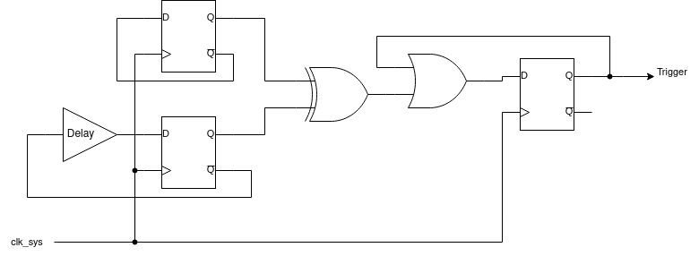

# 10.9.2. Trigger response

RP2350 Datasheet

within one system clock cycle, unlike the brownout detector, which has much more limited analog bandwidth.

The glitch detector is disabled by default, and can be armed by setting the GLITCH_DETECTOR_ENABLE flag in OTP. For

debugging purposes, you can also enable the glitch detector via the ARM register. This is not recommended in security-

sensitive applications, as the system is vulnerable until the point that software can enable the detectors.

10.9.1. Theory of operation

The glitch detector is comprised of four identical detector circuits, based on a pair of D flip-flops. These detector

circuits are each placed in different, physically distant locations within the core voltage domain.

Figure 43. Glitch

detector trigger

circuit. Two flops each

toggle on every

system clock cycle.

One has a

programmable delay

line in its feedback

path, the other does

not. Loss of setup or

hold margin causes

one of the flops to fail

to toggle, so the flops

values differ, setting

the trigger output.

The detector triggers when the two D-flops take on different values, which is impossible under normal circumstances.

The delay line is programmable from 75% to 120% of the minimum system clock period in increments of 15%. Higher

delays make the circuit more sensitive to loss of setup margin. To configure initial sensitivity, use the

GLITCH_DETECTOR_SENS OTP flags. You can fine-tune sensitivity for each detector using the SENSITIVITY register.

Because the circuit is constructed from digital standard cells, it closely tracks the changes in propagation delay to

nearby cells caused by voltage and temperature fluctuations. Therefore the delay line’s propagation delay is specified

as a fraction of the maximum system clock data path delay, rather than a fixed time in nanoseconds.

10.9.2. Trigger response

When any of the detectors fires, the corresponding bit in the TRIG_STATUS is set. If the glitch detector block is armed,

this detector event also resets almost all logic in the switched core domain. The glitch detector is armed if:

• The DISARM register is not set to the disarming bit pattern, and at least one of the following is true:

◦The GLITCH_DETECTOR_EN OTP flag was programmed some time before the most recent reset of the OTP block

◦The ARM register is set to an arming bit pattern

This holds the majority of the switched core domain in reset for approximately 120 microseconds before releasing the

reset. Specifically, this resets the PSM (Section 7.3), which resets all PSM-controlled resets starting with the processor

cold reset domain, in addition to all blocks reset by the RESETS block, which is itself reset by the PSM. The detector

circuits are also reset, as is the system watchdog including the watchdog scratch registers.

After a glitch detector-initiated reset, the CHIP_RESET.HAD_GLITCH_DETECT flag is set so that software can diagnose

that the last reset was caused by a glitch detector trigger. Check the TRIG_STATUS register to see which detector fired.

This can be useful for tuning the thresholds of individual detectors.

The only way to clear the detector circuits is to reset them, either via a full switched core domain reset (such as the RUN

pin, the SW-DP reset request, a PoR/BoR reset, or a reset of the switched core domain configured by POWMAN

controls), or by arming the glitch detector block so that the detectors reset along with the PSM.

Recovering from the glitch detector firing requires the low-power oscillator to be running (Section 8.4). Allowing the

10.9. Glitch detector
870

## Embedded Images

