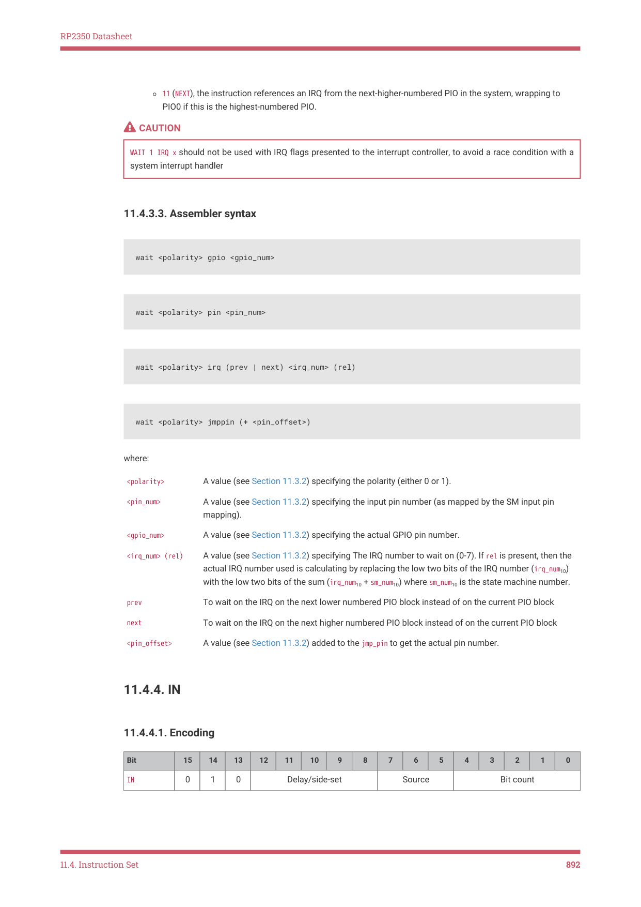

# 11.4.4. IN

RP2350 Datasheet

◦11 (NEXT), the instruction references an IRQ from the next-higher-numbered PIO in the system, wrapping to

PIO0 if this is the highest-numbered PIO.

CAUTION

WAIT 1 IRQ x should not be used with IRQ flags presented to the interrupt controller, to avoid a race condition with a

system interrupt handler

11.4.3.3. Assembler syntax

wait <polarity> gpio <gpio_num>

wait <polarity> pin <pin_num>

wait <polarity> irq (prev | next) <irq_num> (rel)

wait <polarity> jmppin (+ <pin_offset>)

where:

| <polarity> | A value (see Section 11.3.2) specifying the polarity (either 0 or 1). |
| --- | --- |
| <pin num> _ | A value (see Section 11.3.2) specifying the input pin number (as mapped by the SM input pin mapping). |
| <gpio num> _ | A value (see Section 11.3.2) specifying the actual GPIO pin number. |
| <irq num> (rel) _ | A value (see Section 11.3.2) specifying The IRQ number to wait on (0-7). If rel is present, then the actual IRQ number used is calculating by replacing the low two bits of the IRQ number (irq num ) _ 10 with the low two bits of the sum (irq num + sm num ) where sm num is the state machine number. _ 10 _ 10 _ 10 |
| prev | To wait on the IRQ on the next lower numbered PIO block instead of on the current PIO block |
| next | To wait on the IRQ on the next higher numbered PIO block instead of on the current PIO block |
| <pin offset> _ | A value (see Section 11.3.2) added to the jmp pin to get the actual pin number. _ |

11.4.4. IN

11.4.4.1. Encoding

| Bit | 15 | 14 | 13 | 12 | 11 | 10 | 9 | 8 | 7 | 6 | 5 | 4 | 3 | 2 | 1 | 0 |
| --- | --- | --- | --- | --- | --- | --- | --- | --- | --- | --- | --- | --- | --- | --- | --- | --- |
| IN | 0 | 1 | 0 |  | Del | ay/side | -set |  |  | Source |  |  | B | it coun | t |  |

11.4. Instruction Set
892
