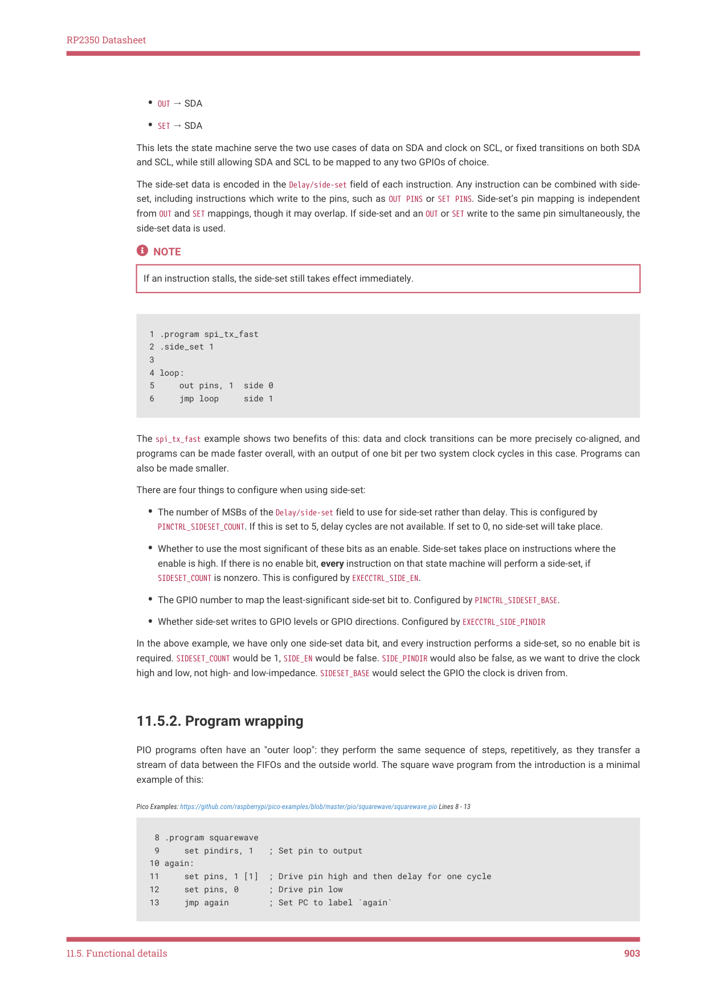

# 11.5.2. Program wrapping

RP2350 Datasheet

• OUT → SDA
• SET → SDA

This lets the state machine serve the two use cases of data on SDA and clock on SCL, or fixed transitions on both SDA

and SCL, while still allowing SDA and SCL to be mapped to any two GPIOs of choice.

The side-set data is encoded in the Delay/side-set field of each instruction. Any instruction can be combined with side-

set, including instructions which write to the pins, such as OUT PINS or SET PINS. Side-set’s pin mapping is independent

from OUT and SET mappings, though it may overlap. If side-set and an OUT or SET write to the same pin simultaneously, the

side-set data is used.

NOTE

If an instruction stalls, the side-set still takes effect immediately.

1 .program spi_tx_fast

2 .side_set 1

3 

4 loop:

5     out pins, 1  side 0

6     jmp loop     side 1

The spi_tx_fast example shows two benefits of this: data and clock transitions can be more precisely co-aligned, and

programs can be made faster overall, with an output of one bit per two system clock cycles in this case. Programs can

also be made smaller.

There are four things to configure when using side-set:

• The number of MSBs of the Delay/side-set field to use for side-set rather than delay. This is configured by

PINCTRL_SIDESET_COUNT. If this is set to 5, delay cycles are not available. If set to 0, no side-set will take place.
• Whether to use the most significant of these bits as an enable. Side-set takes place on instructions where the

enable is high. If there is no enable bit, every instruction on that state machine will perform a side-set, if

SIDESET_COUNT is nonzero. This is configured by EXECCTRL_SIDE_EN.
• The GPIO number to map the least-significant side-set bit to. Configured by PINCTRL_SIDESET_BASE.
• Whether side-set writes to GPIO levels or GPIO directions. Configured by EXECCTRL_SIDE_PINDIR

In the above example, we have only one side-set data bit, and every instruction performs a side-set, so no enable bit is

required. SIDESET_COUNT would be 1, SIDE_EN would be false. SIDE_PINDIR would also be false, as we want to drive the clock

high and low, not high- and low-impedance. SIDESET_BASE would select the GPIO the clock is driven from.

11.5.2. Program wrapping

PIO programs often have an "outer loop": they perform the same sequence of steps, repetitively, as they transfer a

stream of data between the FIFOs and the outside world. The square wave program from the introduction is a minimal

example of this:

Pico Examples: https://github.com/raspberrypi/pico-examples/blob/master/pio/squarewave/squarewave.pio Lines 8 - 13

 8 .program squarewave

 9     set pindirs, 1   ; Set pin to output

10 again:

11     set pins, 1 [1]  ; Drive pin high and then delay for one cycle

12     set pins, 0      ; Drive pin low

13     jmp again        ; Set PC to label `again`

11.5. Functional details
903

RP2350 Datasheet

The main body of the program drives a pin high, and then low, producing one period of a square wave. The entire

program then loops, driving a periodic output. The jump itself takes one cycle, as does each set instruction, so to keep

the high and low periods of the same duration, the set pins, 1 has a single delay cycle added, which makes the state

machine idle for one cycle before executing the set pins, 0 instruction. In total, each loop takes four cycles. There are

two frustrations here:

• The JMP takes up space in the instruction memory that could be used for other programs
• The extra cycle taken to execute the JMP ends up halving the maximum output rate

As the Program Counter (PC) naturally wraps to 0 when incremented past 31, we could solve the second of these by

filling the entire instruction memory with a repeating pattern of set pins, 1 and set pins, 0, but this is wasteful. State

machines have a hardware feature, configured via their EXECCTRL control register, which solves this common case.

Pico Examples: https://github.com/raspberrypi/pico-examples/blob/master/pio/squarewave/squarewave_wrap.pio Lines 12 - 20

12 .program squarewave_wrap

13 ; Like squarewave, but use the state machine's .wrap hardware instead of an

14 ; explicit jmp. This is a free (0-cycle) unconditional jump.

15 

16     set pindirs, 1   ; Set pin to output

17 .wrap_target

18     set pins, 1 [1]  ; Drive pin high and then delay for one cycle

19     set pins, 0 [1]  ; Drive pin low and then delay for one cycle

20 .wrap

After executing an instruction from the program memory, state machines use the following logic to update PC:

1. If the current instruction is a JMP, and the Condition is true, set PC to the Target

2. Otherwise, if PC matches EXECCTRL_WRAP_TOP, set PC to EXECCTRL_WRAP_BOTTOM

3. Otherwise, increment PC, or set to 0 if the current value is 31.

The .wrap_target and .wrap assembly directives in pioasm are essentially labels. They export constants which can be

written to the WRAP_BOTTOM and WRAP_TOP control fields, respectively:

Pico Examples: https://github.com/raspberrypi/pico-examples/blob/master/pio/squarewave/generated/squarewave_wrap.pio.h

 1 // -------------------------------------------------- //

 2 // This file is autogenerated by pioasm; do not edit! //

 3 // -------------------------------------------------- //

 4 

 5 #pragma once

 6 

 7 #include "hardware/pio.h"

 8 

 9 // --------------- //

10 // squarewave_wrap //

11 // --------------- //

12 

13 #define squarewave_wrap_wrap_target 1

14 #define squarewave_wrap_wrap 2

15 #define squarewave_wrap_pio_version 0

16 

17 static const uint16_t squarewave_wrap_program_instructions[] = {

18     0xe081, //  0: set    pindirs, 1

19             //     .wrap_target

20     0xe101, //  1: set    pins, 1                [1]

21     0xe100, //  2: set    pins, 0                [1]

22             //     .wrap

23 };

24 

11.5. Functional details
904
