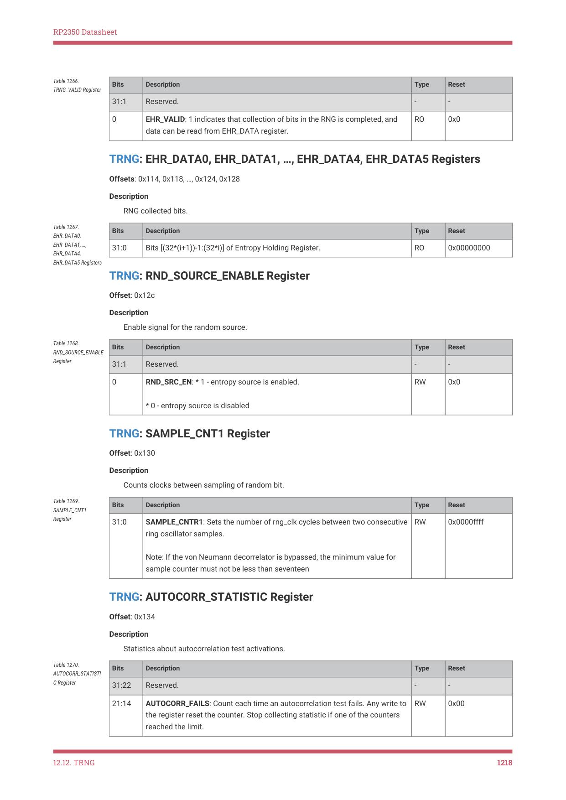
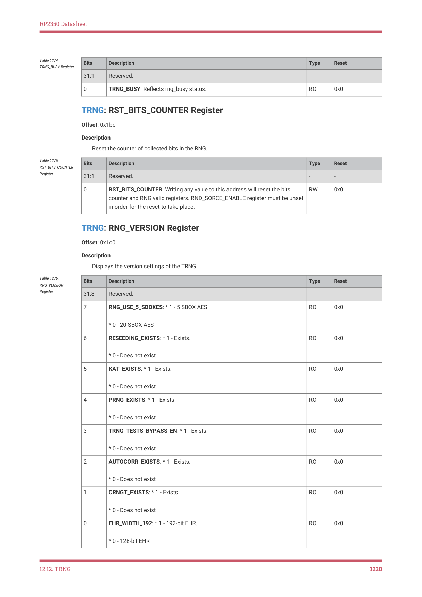

# 12.12.5. List of registers

RP2350 Datasheet

        ;

    // Copy 6 EHR words to SHA-256, plus garbage (RND_SOURCE_ENABLE and

    // SAMPLE_CNT1) which pads us out to half of a SHA-256 block. This means

    // we can avoid checking SHA-256 ready whilst reading EHR, so we restart

    // sampling sooner. (SHA-256 becomes non-ready for 57 cycles after each

    // 16 words written.)

    io_ro_32 *src = &trng_hw->ehr_data[0];

    io_wo_32 *dst = &sha256_hw->wdata;

    for (int i = 0; i < 8; ++i) {

        *dst = src[i];

    }

    // TRNG is now sampling again, having started after we read the last EHR

    // word. Grab some in-progress SHA bits and use them to modulate the

    // chain length, to reduce chance of injection locking:

    trng_hw->trng_config = sha256_hw->sum[0];

}

// Wait for SHA result -- if skipped we get the previous block's digest. Note

// this never becomes true if we wrote a number of words % 16 != 0.

while (!(sha256_hw->csr & SHA256_CSR_SUM_VLD_BITS))

    ;

// The per-boot random will change on every core 0 reset (except debugger

// skipping ROM). If this is a problem then the user can sample the

// per-boot random into a preserved variable in main SRAM.

for (int i = 0; i < 4; ++i) {

    bootram->always.boot_random.e[i] = sha256_hw->sum[4 + i];

}

trng_hw->trng_config = 0;

// Stop ROSC as it's a waste of power

trng_hw->rnd_source_enable = 0;

The bootrom resets the SHA-256 and TRNG via RESETS immediately before the above code runs. This code typically

runs with clk_sys running from the system ROSC, at its initial boot frequency of approximately 12 MHz. The 256-bit

result is available in the SUM0 through SUM7 registers after the code completes.

This code does not represent best programming practice: for example it writes ones into reserved bits in the

TRNG_DEBUG_CONTROL register. It was written with close reference to the hardware implementation. The above code

listing serves only to document the method the bootrom uses to generate random numbers at boot time, for the once-

per-boot random number available via the get_sys_info() ROM API as well as for initialising the RCP salt registers

(Section 3.6.3.1).

12.12.4.2. SDK

The pico_rand library uses the TRNG as one of its entropy sources. It streams raw ROSC samples from the TRNG ROSC

in a similar manner to the bootrom. It uses the xoroshiro128** and splitmix64() PRNG functions to condition the output.

12.12.5. List of registers

The TRNG control registers start at a base address of 0x400f0000 (defined as TRNG_BASE in the SDK).

| Offset | Name | Info |
| --- | --- | --- |
| 0x100 | RNG_IMR | Interrupt masking. |

Table 1261. List of

12.12. TRNG
1215

RP2350 Datasheet

| Offset | Name | Info |
| --- | --- | --- |
| 0x104 | RNG_ISR | RNG status register. If corresponding RNG_IMR bit is unmasked, an interrupt will be generated. |
| 0x108 | RNG_ICR | Interrupt/status bit clear Register. |
| 0x10c | TRNG_CONFIG | Selecting the inverter-chain length. |
| 0x110 | TRNG_VALID | 192 bit collection indication. |
| 0x114 | EHR_DATA0 | RNG collected bits. |
| 0x118 | EHR_DATA1 | RNG collected bits. |
| 0x11c | EHR_DATA2 | RNG collected bits. |
| 0x120 | EHR_DATA3 | RNG collected bits. |
| 0x124 | EHR_DATA4 | RNG collected bits. |
| 0x128 | EHR_DATA5 | RNG collected bits. |
| 0x12c | RND_SOURCE_ENABLE | Enable signal for the random source. |
| 0x130 | SAMPLE_CNT1 | Counts clocks between sampling of random bit. |
| 0x134 | AUTOCORR_STATISTIC | Statistics about autocorrelation test activations. |
| 0x138 | TRNG_DEBUG_CONTROL | Debug register. |
| 0x140 | TRNG_SW_RESET | Generate internal SW reset within the RNG block. |
| 0x1b4 | RNG_DEBUG_EN_INPUT | Enable the RNG debug mode |
| 0x1b8 | TRNG_BUSY | RNG Busy indication. |
| 0x1bc | RST_BITS_COUNTER | Reset the counter of collected bits in the RNG. |
| 0x1c0 | RNG_VERSION | Displays the version settings of the TRNG. |
| 0x1e0 | RNG_BIST_CNTR_0 | Collected BIST results. |
| 0x1e4 | RNG_BIST_CNTR_1 | Collected BIST results. |
| 0x1e8 | RNG_BIST_CNTR_2 | Collected BIST results. |

TRNG: RNG_IMR Register

Offset: 0x100

Description

Interrupt masking.

| Bits | Description | Type | Reset |
| --- | --- | --- | --- |
| 31:4 | Reserved. | - | - |
| 3 | VN_ERR_INT_MASK: Set to 1 to mask (disable) this interrupt: no interrupt will be generated. See RNG_ISR for an explanation on this interrupt. | RW | 0x1 |
| 2 | CRNGT_ERR_INT_MASK: Set to 1 to mask (disable) this interrupt: no interrupt will be generated. See RNG_ISR for an explanation on this interrupt. | RW | 0x1 |
| 1 | AUTOCORR_ERR_INT_MASK: Set to 1 to mask (disable) this interrupt: no interrupt will be generated. See RNG_ISR for an explanation on this interrupt. | RW | 0x1 |
| 0 | EHR_VALID_INT_MASK: Set to 1 to mask (disable) this interrupt: no interrupt will be generated. See RNG_ISR for an explanation on this interrupt. | RW | 0x1 |

Table 1262. RNG_IMR

12.12. TRNG
1216

RP2350 Datasheet

TRNG: RNG_ISR Register

Offset: 0x104

Description

RNG status register. If corresponding RNG_IMR bit is unmasked, an interrupt will be generated.

| Bits | Description | Type | Reset |
| --- | --- | --- | --- |
| 31:4 | Reserved. | - | - |
| 3 | VN_ERR: 1 indicates von Neumann error. Error in von Neumann occurs if 32 consecutive collected bits are identical, ZERO or ONE. | RO | 0x0 |
| 2 | CRNGT_ERR: 1 indicates CRNGT in the RNG test failed. Failure occurs when two consecutive blocks of 16 collected bits are equal. | RO | 0x0 |
| 1 | AUTOCORR_ERR: 1 indicates Autocorrelation test failed four times in a row. When set, RNG ceases functioning until next reset. | RO | 0x0 |
| 0 | EHR_VALID: 1 indicates that 192 bits have been collected in the RNG, and are ready to be read. | RO | 0x0 |

Table 1263. RNG_ISR

TRNG: RNG_ICR Register

Offset: 0x108

Description

Interrupt/status bit clear Register.

| Bits | Description | Type | Reset |
| --- | --- | --- | --- |
| 31:4 | Reserved. | - | - |
| 3 | VN_ERR: Write 1 to clear corresponding bit in RNG_ISR. | RW | 0x0 |
| 2 | CRNGT_ERR: Write 1 to clear corresponding bit in RNG_ISR. | RW | 0x0 |
| 1 | AUTOCORR_ERR: Cannot be cleared by SW! Only RNG reset clears this bit. | RW | 0x0 |
| 0 | EHR_VALID: Write 1 - clear corresponding bit in RNG_ISR. | RW | 0x0 |

Table 1264. RNG_ICR

TRNG: TRNG_CONFIG Register

Offset: 0x10c

Description

Selecting the inverter-chain length.

| Bits | Description | Type | Reset |
| --- | --- | --- | --- |
| 31:2 | Reserved. | - | - |
| 1:0 | RND_SRC_SEL: Selects the number of inverters (out of four possible selections) in the ring oscillator (the entropy source). Higher values select longer inverter chain lengths. | RW | 0x0 |

Table 1265.

TRNG_CONFIG

Register

TRNG: TRNG_VALID Register

Offset: 0x110

Description

192 bit collection indication.

12.12. TRNG
1217

RP2350 Datasheet

| Bits | Description | Type | Reset |
| --- | --- | --- | --- |
| 31:1 | Reserved. | - | - |
| 0 | EHR_VALID: 1 indicates that collection of bits in the RNG is completed, and data can be read from EHR_DATA register. | RO | 0x0 |

Table 1266.

TRNG: EHR_DATA0, EHR_DATA1, …, EHR_DATA4, EHR_DATA5 Registers

Offsets: 0x114, 0x118, …, 0x124, 0x128

Description

RNG collected bits.

| Bits | Description | Type | Reset |
| --- | --- | --- | --- |
| 31:0 | Bits [(32*(i+1))-1:(32*i)] of Entropy Holding Register. | RO | 0x00000000 |

Table 1267.

EHR_DATA0,

EHR_DATA1, …,

EHR_DATA4,

EHR_DATA5 Registers

TRNG: RND_SOURCE_ENABLE Register

Offset: 0x12c

Description

Enable signal for the random source.

| Bits | Description | Type | Reset |
| --- | --- | --- | --- |
| 31:1 | Reserved. | - | - |
| 0 | RND_SRC_EN: * 1 - entropy source is enabled. * 0 - entropy source is disabled | RW | 0x0 |

Table 1268.

RND_SOURCE_ENABLE

Register

TRNG: SAMPLE_CNT1 Register

Offset: 0x130

Description

Counts clocks between sampling of random bit.

| Bits | Description | Type | Reset |
| --- | --- | --- | --- |
| 31:0 | SAMPLE_CNTR1: Sets the number of rng_clk cycles between two consecutive ring oscillator samples. Note: If the von Neumann decorrelator is bypassed, the minimum value for sample counter must not be less than seventeen | RW | 0x0000ffff |

Table 1269.

SAMPLE_CNT1

Register

TRNG: AUTOCORR_STATISTIC Register

Offset: 0x134

Description

Statistics about autocorrelation test activations.

| Bits | Description | Type | Reset |
| --- | --- | --- | --- |
| 31:22 | Reserved. | - | - |
| 21:14 | AUTOCORR_FAILS: Count each time an autocorrelation test fails. Any write to the register reset the counter. Stop collecting statistic if one of the counters reached the limit. | RW | 0x00 |

Table 1270.

AUTOCORR_STATISTI

C Register

12.12. TRNG
1218

RP2350 Datasheet

| Bits | Description | Type | Reset |
| --- | --- | --- | --- |
| 13:0 | AUTOCORR_TRYS: Count each time an autocorrelation test starts. Any write to the register reset the counter. Stop collecting statistic if one of the counters reached the limit. | RW | 0x0000 |

TRNG: TRNG_DEBUG_CONTROL Register

Offset: 0x138

Description

Debug register.

| Bits | Description | Type | Reset |
| --- | --- | --- | --- |
| 31:4 | Reserved. | - | - |
| 3 | AUTO_CORRELATE_BYPASS: When set, the autocorrelation test in the TRNG module is bypassed. | RW | 0x0 |
| 2 | TRNG_CRNGT_BYPASS: When set, the CRNGT test in the RNG is bypassed. | RW | 0x0 |
| 1 | VNC_BYPASS: When set, the Von-Neuman balancer is bypassed (including the 32 consecutive bits test). N/A | RW | 0x0 |
| 0 | Reserved. | - | - |

Table 1271.

TRNG_DEBUG_CONTR

OL Register

TRNG: TRNG_SW_RESET Register

Offset: 0x140

Description

Generate internal SW reset within the RNG block.

| Bits | Description | Type | Reset |
| --- | --- | --- | --- |
| 31:1 | Reserved. | - | - |
| 0 | TRNG_SW_RESET: Writing 1 to this register causes an internal RNG reset. | RW | 0x0 |

Table 1272.

TRNG_SW_RESET

Register

TRNG: RNG_DEBUG_EN_INPUT Register

Offset: 0x1b4

Description

Enable the RNG debug mode

| Bits | Description | Type | Reset |
| --- | --- | --- | --- |
| 31:1 | Reserved. | - | - |
| 0 | RNG_DEBUG_EN: * 1 - debug mode is enabled. * 0 - debug mode is disabled | RW | 0x0 |

Table 1273.

RNG_DEBUG_EN_INPU

T Register

TRNG: TRNG_BUSY Register

Offset: 0x1b8

Description

RNG Busy indication.

12.12. TRNG
1219

RP2350 Datasheet

| Bits | Description | Type | Reset |
| --- | --- | --- | --- |
| 31:1 | Reserved. | - | - |
| 0 | TRNG_BUSY: Reflects rng_busy status. | RO | 0x0 |

Table 1274.

TRNG: RST_BITS_COUNTER Register

Offset: 0x1bc

Description

Reset the counter of collected bits in the RNG.

| Bits | Description | Type | Reset |
| --- | --- | --- | --- |
| 31:1 | Reserved. | - | - |
| 0 | RST_BITS_COUNTER: Writing any value to this address will reset the bits counter and RNG valid registers. RND_SORCE_ENABLE register must be unset in order for the reset to take place. | RW | 0x0 |

Table 1275.

RST_BITS_COUNTER

Register

TRNG: RNG_VERSION Register

Offset: 0x1c0

Description

Displays the version settings of the TRNG.

| Bits | Description | Type | Reset |
| --- | --- | --- | --- |
| 31:8 | Reserved. | - | - |
| 7 | RNG_USE_5_SBOXES: * 1 - 5 SBOX AES. * 0 - 20 SBOX AES | RO | 0x0 |
| 6 | RESEEDING_EXISTS: * 1 - Exists. * 0 - Does not exist | RO | 0x0 |
| 5 | KAT_EXISTS: * 1 - Exists. * 0 - Does not exist | RO | 0x0 |
| 4 | PRNG_EXISTS: * 1 - Exists. * 0 - Does not exist | RO | 0x0 |
| 3 | TRNG_TESTS_BYPASS_EN: * 1 - Exists. * 0 - Does not exist | RO | 0x0 |
| 2 | AUTOCORR_EXISTS: * 1 - Exists. * 0 - Does not exist | RO | 0x0 |
| 1 | CRNGT_EXISTS: * 1 - Exists. * 0 - Does not exist | RO | 0x0 |
| 0 | EHR_WIDTH_192: * 1 - 192-bit EHR. * 0 - 128-bit EHR | RO | 0x0 |

Table 1276.

RNG_VERSION

Register

12.12. TRNG
1220
