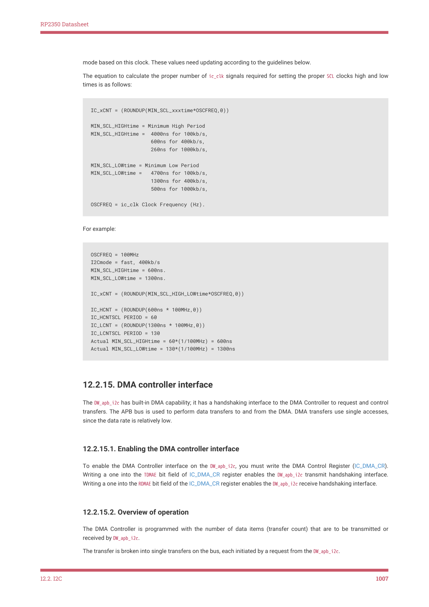

# 12.2.15. DMA controller interface

RP2350 Datasheet

mode based on this clock. These values need updating according to the guidelines below.

The equation to calculate the proper number of ic_clk signals required for setting the proper SCL clocks high and low

times is as follows:

IC_xCNT = (ROUNDUP(MIN_SCL_xxxtime*OSCFREQ,0))

MIN_SCL_HIGHtime = Minimum High Period

MIN_SCL_HIGHtime =  4000ns for 100kb/s,

                    600ns for 400kb/s,

                    260ns for 1000kb/s,

MIN_SCL_LOWtime = Minimum Low Period

MIN_SCL_LOWtime =   4700ns for 100kb/s,

                    1300ns for 400kb/s,

                    500ns for 1000kb/s,

OSCFREQ = ic_clk Clock Frequency (Hz).

For example:

OSCFREQ = 100MHz

I2Cmode = fast, 400kb/s

MIN_SCL_HIGHtime = 600ns.

MIN_SCL_LOWtime = 1300ns.

IC_xCNT = (ROUNDUP(MIN_SCL_HIGH_LOWtime*OSCFREQ,0))

IC_HCNT = (ROUNDUP(600ns * 100MHz,0))

IC_HCNTSCL PERIOD = 60

IC_LCNT = (ROUNDUP(1300ns * 100MHz,0))

IC_LCNTSCL PERIOD = 130

Actual MIN_SCL_HIGHtime = 60*(1/100MHz) = 600ns

Actual MIN_SCL_LOWtime = 130*(1/100MHz) = 1300ns

12.2.15. DMA controller interface

The DW_apb_i2c has built-in DMA capability; it has a handshaking interface to the DMA Controller to request and control

transfers. The APB bus is used to perform data transfers to and from the DMA. DMA transfers use single accesses,

since the data rate is relatively low.

12.2.15.1. Enabling the DMA controller interface

To enable the DMA Controller interface on the DW_apb_i2c, you must write the DMA Control Register (IC_DMA_CR).

Writing a one into the TDMAE bit field of IC_DMA_CR register enables the DW_apb_i2c transmit handshaking interface.

Writing a one into the RDMAE bit field of the IC_DMA_CR register enables the DW_apb_i2c receive handshaking interface.

12.2.15.2. Overview of operation

The DMA Controller is programmed with the number of data items (transfer count) that are to be transmitted or

received by DW_apb_i2c.

The transfer is broken into single transfers on the bus, each initiated by a request from the DW_apb_i2c.

12.2. I2C
1007
