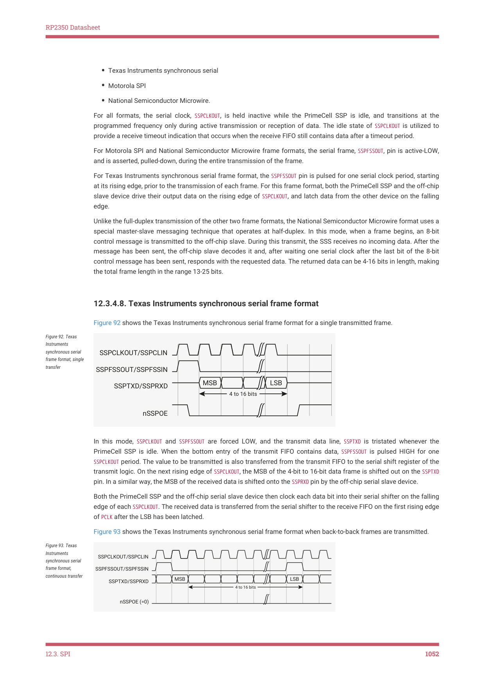
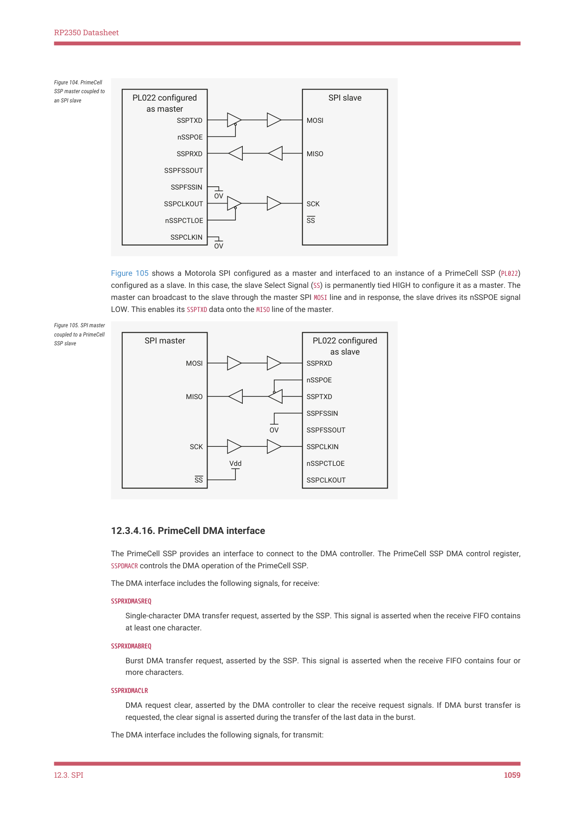

# 12.3.4. Operation

RP2350 Datasheet

12.3.4. Operation

12.3.4.1. Interface reset

The PrimeCell SSP is reset by the global reset signal, PRESETn, and a block-specific reset signal, nSSPRST. The device reset

controller asserts nSSPRST asynchronously and negates it synchronously to SSPCLK.

12.3.4.2. Configuring the SSP

Following reset, the PrimeCell SSP logic is disabled and must be configured when in this state. It is necessary to

program control registers SSPCR0 and SSPCR1 to configure the peripheral as a master or slave operating under one of the

following protocols:

• Motorola SPI
• Texas Instruments SSI
• National Semiconductor

The bit rate, derived from the external SSPCLK, requires the programming of the clock prescale register SSPCPSR.

12.3.4.3. Enable PrimeCell SSP operation

You can either prime the transmit FIFO, by writing up to eight 16-bit values when the PrimeCell SSP is disabled, or permit

the transmit FIFO service request to interrupt the CPU. Once enabled, transmission or reception of data begins on the

transmit, SSPTXD, and receive, SSPRXD, pins.

12.3.4.4. Clock ratios

There is a constraint on the ratio of the frequencies of PCLK to SSPCLK. The frequency of SSPCLK must be less than or equal

to that of PCLK. This ensures that control signals from the SSPCLK domain to the PCLK domain are guaranteed to get

synchronized before one frame duration:

.

In the slave mode of operation, the SSPCLKIN signal from the external master is double-synchronized and then delayed to

detect an edge. It takes three SSPCLKs to detect an edge on SSPCLKIN. SSPTXD has less setup time to the falling edge of

SSPCLKIN on which the master is sampling the line.

The setup and hold times on SSPRXD, with reference to SSPCLKIN, must be more conservative to ensure that it is at the right

value when the actual sampling occurs within the SSPMS. To ensure correct device operation, SSPCLK must be at least 12

times faster than the maximum expected frequency of SSPCLKIN.

The frequency selected for SSPCLK must accommodate the desired range of bit clock rates. The ratio of minimum SSPCLK

frequency to SSPCLKOUT maximum frequency in the case of the slave mode is 12, and for the master mode, it is two.

For example, at the maximum SSPCLK (clk_peri) frequency on RP2350 of 150MHz, the maximum peak bit rate in master

mode is 70.5Mb/s. This is achieved with the SSPCPSR register programmed with a value of 2, and the SCR[7:0] field in the

SSPCR0 register programmed with a value of 0.

In slave mode, the same maximum SSPCLK frequency of 150MHz can achieve a peak bit rate of 150 / 12 = 12.5Mb/s. The

SSPCPSR register can be programmed with a value of 12, and the SCR[7:0] field in the SSPCR0 register can be programmed

with a value of 0. Similarly, the ratio of SSPCLK maximum frequency to SSPCLKOUT minimum frequency is 254 × 256.

The minimum frequency of SSPCLK is governed by the following inequalities, both of which must be satisfied:

, for master mode

12.3. SPI
1050

RP2350 Datasheet

, for slave mode.

The maximum frequency of SSPCLK is governed by the following inequalities, both of which must be satisfied:

, for master mode

, for slave mode.

12.3.4.5. Programming the SSPCR0 control register

The SSPCR0 register is used to:

• program the serial clock rate
• select one of the three protocols
• select the data word size, where applicable.

The Serial Clock Rate (SCR) value, in conjunction with the SSPCPSR clock prescale divisor value, CPSDVSR, is used to derive

the PrimeCell SSP transmit and receive bit rate from the external SSPCLK.

The frame format is programmed through the FRF bits, and the data word size through the DSS bits.

Bit phase and polarity, applicable to Motorola SPI format only, are programmed through the SPH and SPO bits.

12.3.4.6. Programming the SSPCR1 control register

The SSPCR1 register is used to:

• select master or slave mode
• enable a loop back test feature
• enable the PrimeCell SSP peripheral.

To configure the PrimeCell SSP as a master, clear the SSPCR1 register master or slave selection bit, MS, to 0. This is the

default value on reset.

Setting the SSPCR1 register MS bit to 1 configures the PrimeCell SSP as a slave. When configured as a slave, use the

SSPCR1 slave mode SSPTXD output disable bit (SOD) to enable or disable of the PrimeCell SSP SSPTXD signal. You can use this

in some multi-slave environments where masters might parallel broadcast.

To enable the PrimeCell SSP, set the Synchronous Serial Port Enable (SSE) bit to 1.

12.3.4.6.1. Bit rate generation

The serial bit rate is derived by dividing down the input clock, SSPCLK. The clock is first divided by an even prescale value

CPSDVSR in the range 2-254, and is programmed in SSPCPSR. The clock is divided again by a value in the range 1-256, that is

1 + SCR, where SCR is the value programmed in SSPCR0.

The following equation defines the frequency of the output signal bit clock, SSPCLKOUT:

For example, if SSPCLK is 125MHz, and CPSDVSR = 2, then SSPCLKOUT has a frequency range from 244kHz - 62.5MHz.

12.3.4.7. Frame format

Each data frame is between 4-16 bits long, depending on the size of data programmed, and is transmitted starting with

the MSB. You can select the following basic frame types:

12.3. SPI
1051

RP2350 Datasheet

• Texas Instruments synchronous serial
• Motorola SPI
• National Semiconductor Microwire.

For all formats, the serial clock, SSPCLKOUT, is held inactive while the PrimeCell SSP is idle, and transitions at the

programmed frequency only during active transmission or reception of data. The idle state of SSPCLKOUT is utilized to

provide a receive timeout indication that occurs when the receive FIFO still contains data after a timeout period.

For Motorola SPI and National Semiconductor Microwire frame formats, the serial frame, SSPFSSOUT, pin is active-LOW,

and is asserted, pulled-down, during the entire transmission of the frame.

For Texas Instruments synchronous serial frame format, the SSPFSSOUT pin is pulsed for one serial clock period, starting

at its rising edge, prior to the transmission of each frame. For this frame format, both the PrimeCell SSP and the off-chip

slave device drive their output data on the rising edge of SSPCLKOUT, and latch data from the other device on the falling

edge.

Unlike the full-duplex transmission of the other two frame formats, the National Semiconductor Microwire format uses a

special master-slave messaging technique that operates at half-duplex. In this mode, when a frame begins, an 8-bit

control message is transmitted to the off-chip slave. During this transmit, the SSS receives no incoming data. After the

message has been sent, the off-chip slave decodes it and, after waiting one serial clock after the last bit of the 8-bit

control message has been sent, responds with the requested data. The returned data can be 4-16 bits in length, making

the total frame length in the range 13-25 bits.

12.3.4.8. Texas Instruments synchronous serial frame format

Figure 92 shows the Texas Instruments synchronous serial frame format for a single transmitted frame.

Figure 92. Texas

Instruments

synchronous serial

SSPCLKOUT/SSPCLIN

frame format, single

transfer

SSPFSSOUT/SSPFSSIN

MSB
LSB

SSPTXD/SSPRXD

4 to 16 bits

nSSPOE

In this mode, SSPCLKOUT and SSPFSSOUT are forced LOW, and the transmit data line, SSPTXD is tristated whenever the

PrimeCell SSP is idle. When the bottom entry of the transmit FIFO contains data, SSPFSSOUT is pulsed HIGH for one

SSPCLKOUT period. The value to be transmitted is also transferred from the transmit FIFO to the serial shift register of the

transmit logic. On the next rising edge of SSPCLKOUT, the MSB of the 4-bit to 16-bit data frame is shifted out on the SSPTXD

pin. In a similar way, the MSB of the received data is shifted onto the SSPRXD pin by the off-chip serial slave device.

Both the PrimeCell SSP and the off-chip serial slave device then clock each data bit into their serial shifter on the falling

edge of each SSPCLKOUT. The received data is transferred from the serial shifter to the receive FIFO on the first rising edge

of PCLK after the LSB has been latched.

Figure 93 shows the Texas Instruments synchronous serial frame format when back-to-back frames are transmitted.

Figure 93. Texas

Instruments

SSPCLKOUT/SSPCLIN

synchronous serial

frame format,

SSPFSSOUT/SSPFSSIN

continuous transfer

MSB
LSB

SSPTXD/SSPRXD

4 to 16 bits

nSSPOE (=0)

12.3. SPI
1052

RP2350 Datasheet

12.3.4.9. Motorola SPI frame format

The Motorola SPI interface is a four-wire interface where the SSPFSSOUT signal behaves as a slave select. The main

feature of the Motorola SPI format is that you can program the inactive state and phase of the SSPCLKOUT signal using the

SPO and SPH bits of the SSPSCR0 control register.

12.3.4.9.1. SPO, clock polarity

When the SPO clock polarity control bit is LOW, it produces a steady state LOW value on the SSPCLKOUT pin. If the SPO clock

polarity control bit is HIGH, a steady state HIGH value is placed on the SSPCLKOUT pin when data is not being transferred.

12.3.4.9.2. SPH, clock phase

The SPH control bit selects the clock edge that captures data and enables it to change state. It has the most impact on

the first bit transmitted by either permitting or not permitting a clock transition before the first data capture edge.

When the SPH phase control bit is LOW, data is captured on the first clock edge transition.

When the SPH clock phase control bit is HIGH, data is captured on the second clock edge transition.

12.3.4.10. Motorola SPI format with SPO=0, SPH=0

Figure 94 and Figure 95 shows a continuous transmission signal sequence for Motorola SPI frame format with SPO=0,

SPH=0. Figure 94 shows a single transmission signal sequence for Motorola SPI frame format with SPO=0, SPH=0.

Figure 94. Motorola

SPI frame format,

SSPCLKOUT/SSPCLIN

single transfer, with

SPO=0 and SPH=0

SSPFSSOUT/SSPFSSIN

SSPRXD
MSB
LSB
Q

4 to 16 bits

nSSPOE

SSPRXD
MSB
LSB

Figure 95 shows a continuous transmission signal sequence for Motorola SPI frame format with SPO=0, SPH=0.

Figure 95. Motorola

SPI frame format,

SSPCLKOUT/SSPCLIN

single transfer, with

SSPFSSOUT/SSPFSSIN

SPO=0 and SPH=0

MSB
LSB
LSB
MSB

SSPTXD/SSPRXD

4 to 16 bits

nSSPOE (=0)

In this configuration, during idle periods:

• the SSPCLKOUT signal is forced LOW
• the SSPFSSOUT signal is forced HIGH
• the transmit data line SSPTXD is arbitrarily forced LOW
• the nSSPOE pad enable signal is forced HIGH (this is not connected to the pad in RP2350)
• when the PrimeCell SSP is configured as a master, the nSSPCTLOE line is driven LOW, enabling the SSPCLKOUT pad,

active-LOW enable
• when the PrimeCell SSP is configured as a slave, the nSSPCTLOE line is driven HIGH, disabling the SSPCLKOUT pad,

active-LOW enable

12.3. SPI
1053

RP2350 Datasheet

If the PrimeCell SSP is enable, and there is valid data within the transmit FIFO, the start of transmission is signified by

the SSPFSSOUT master signal being driven LOW. This causes slave data to be enabled onto the SSPRXD input line of the

master. The nSSPOE line is driven LOW, enabling the master SSPTXD output pad.

One-half SSPCLKOUT period later, valid master data is transferred to the SSPTXD pin. Now that both the master and slave

data have been set, the SSPCLKOUT master clock pin goes HIGH after one additional half SSPCLKOUT period.

The data is now captured on the rising and propagated on the falling edges of the SSPCLKOUT signal.

In the case of a single word transmission, after all bits of the data word have been transferred, the SSPFSSOUT line is

returned to its idle HIGH state one SSPCLKOUT period after the last bit has been captured.

However, in the case of continuous back-to-back transmissions, the SSPFSSOUT signal pulse HIGH between each data

word transfer. This is because the slave select pin freezes the data in its serial peripheral register and does not permit it

to be altered if the SPH bit is logic zero. Therefore, the master device must raise the SSPFSSIN pin of the slave device

between each data transfer to enable the serial peripheral data write. On completion of the continuous transfer, the

SSPFSSOUT pin is returned to its idle state one SSPCLKOUT period after the last bit has been captured.

12.3.4.11. Motorola SPI format with SPO=0, SPH=1

Figure 96 shows the transfer signal sequence for Motorola SPI format with SPO=0, SPH=1, and it covers both single and

continuous transfers.

Figure 96. Motorola

SPI frame format with

SSPCLKOUT/SSPCLIN

SPO=0 and SPH=1,

single and continuous

SSPFSSOUT/SSPFSSIN

transfers

SSPRXD
MSB
LSB
Q
Q

4 to 16 bits

nSSPOE

SSPRXD
MSB
LSB

In this configuration, during idle periods:

• the SSPCLKOUT signal is forced LOW
• The SSPFSSOUT signal is forced HIGH
• the transmit data line SSPTXD is arbitrarily forced LOW
• the nSSPOE pad enable signal is forced HIGH (not connected to the pad in RP2350)
• when the PrimeCell SSP is configured as a master, the nSSPCTLOE line is driven LOW, enabling the SSPCLKOUT pad,

active-LOW enable
• when the PrimeCell SSP is configured as a slave, the nSSPCTLOE line is driven HIGH, disabling the SSPCLKOUT pad,

active-LOW enable

If the PrimeCell SSP is enabled, and there is valid data within the transmit FIFO, the start of transmission is signified by

the SSPFSSOUT master signal being driven LOW. The nSSPOE line is driven LOW, enabling the master SSPTXD output pad. After

an additional one half SSPCLKOUT period, both master and slave valid data is enabled onto their respective transmission

lines. At the same time, the SSPCLKOUT is enabled with a rising edge transition.

Data is then captured on the falling edges and propagated on the rising edges of the SSPCLKOUT signal.

In the case of a single word transfer, after all bits have been transferred, the SSPFSSOUT line is returned to its idle HIGH

state one SSPCLKOUT period after the last bit has been captured. For continuous back-to-back transfers, the SSPFSSOUT pin is

held LOW between successive data words and termination is the same as that of the single word transfer.

12.3. SPI
1054

RP2350 Datasheet

12.3.4.12. Motorola SPI format with SPO=1, SPH=0

Figure 97 and Figure 98 show single and continuous transmission signal sequences for Motorola SPI format with

SPO=1, SPH=0.

Figure 97 shows a single transmission signal sequence for Motorola SPI format with SPO=1, SPH=0.

Figure 97. Motorola

SPI frame format,

SSPCLKOUT/SSPCLIN

single transfer, with

SPO=1 and SPH=0

SSPFSSOUT/SSPFSSIN

SSPRXD
MSB
LSB
Q

4 to 16 bits

nSSPOE

SSPRXD
MSB
LSB

Figure 98 shows a continuous transmission signal sequence for Motorola SPI format with SPO=1, SPH=0.

NOTE

In Figure 97, Q is an undefined signal.

Figure 98. Motorola

SPI frame format,

SSPCLKOUT/SSPCLIN

continuous transfer,

SSPFSSOUT/SSPFSSIN

with SPO=1 and

MSB
LSB
LSB
MSB

SPH=0

SSPTXD/SSPRXD

4 to 16 bits

nSSPOE (=0)

In this configuration, during idle periods:

• the SSPCLKOUT signal is forced HIGH
• the SSPFSSOUT signal is forced HIGH
• the transmit data line SSPTXD is arbitrarily forced LOW
• the nSSPOE pad enable signal is forced HIGH (not connected to the pad in RP2350)
• when the PrimeCell SSP is configured as a master, the nSSPCTLOE line is driven LOW, enabling the SSPCLKOUT pad,

active-LOW enable
• when the PrimeCell SSP is configured as a slave, the nSSPCTLOE line is driven HIGH, disabling the SSPCLKOUT pad,

active-LOW enable

If the PrimeCell SSP is enabled, and there is valid data within the transmit FIFO, the start of transmission is signified by

the SSPFSSOUT master signal being driven LOW, and this causes slave data to be immediately transferred onto the SSPRXD

line of the master. The nSSPOE line is driven LOW, enabling the master SSPTXD output pad.

One half period later, valid master data is transferred to the SSPTXD line. Now that both the master and slave data have

been set, the SSPCLKOUT master clock pin becomes LOW after one additional half SSPCLKOUT period. This means that data is

captured on the falling edges and be propagated on the rising edges of the SSPCLKOUT signal.

In the case of a single word transmission, after all bits of the data word are transferred, the SSPFSSOUT line is returned to

its idle HIGH state one SSPCLKOUT period after the last bit has been captured.

However, in the case of continuous back-to-back transmissions, the SSPFSSOUT signal must be pulsed HIGH between each

data word transfer. This is because the slave select pin freezes the data in its serial peripheral register and does not

permit it to be altered if the SPH bit is logic zero. Therefore, the master device must raise the SSPFSSIN pin of the slave

device between each data transfer to enable the serial peripheral data write. On completion of the continuous transfer,

the SSPFSSOUT pin is returned to its idle state one SSPCLKOUT period after the last bit has been captured.

12.3. SPI
1055

RP2350 Datasheet

12.3.4.13. Motorola SPI format with SPO=1, SPH=1

Figure 99 shows the transfer signal sequence for Motorola SPI format with SPO=1, SPH=1, and it covers both single and

continuous transfers.

Figure 99. Motorola

SPI frame format with

SSPCLKOUT/SSPCLIN

SPO=1 and SPH=1,

single and continuous

SSPFSSOUT/SSPFSSIN

transfers

SSPRXD
MSB
LSB
Q
Q

4 to 16 bits

nSSPOE

SSPRXD
MSB
LSB

NOTE

In Figure 99, Q is an undefined signal.

In this configuration, during idle periods:

• the SSPCLKOUT signal is forced HIGH
• the SSPFSSOUT signal is forced HIGH
• the transmit data line SSPTXD is arbitrarily forced LOW
• the nSSPOE pad enable signal is forced HIGH (not connected to the pad in RP2350)
• when the PrimeCell SSP is configured as a master, the nSSPCTLOE line is driven LOW, enabling the SSPCLKOUT pad,

active-LOW enable
• when the PrimeCell SSP is configured as a slave, the nSSPCTLOE line is driven HIGH, disabling the SSPCLKOUT pad,

active-LOW enable.

If the PrimeCell SSP is enabled, and there is valid data within the transmit FIFO, the start of transmission is signified by

the SSPFSSOUT master signal being driven LOW. The nSSPOE line is driven LOW, enabling the master SSPTXD output pad.

After an additional one half SSPCLKOUT period, both master and slave data are enabled onto their respective transmission

lines. At the same time, the SSPCLKOUT is enabled with a falling edge transition. Data is then captured on the rising edges

and propagated on the falling edges of the SSPCLKOUT signal.

After all bits have been transferred, in the case of a single word transmission, the SSPFSSOUT line is returned to its idle

HIGH state one SSPCLKOUT period after the last bit has been captured.

For continuous back-to-back transmissions, the SSPFSSOUT pin remains in its active-LOW state, until the final bit of the last

word has been captured, and then returns to its idle state as the previous section describes.

For continuous back-to-back transfers, the SSPFSSOUT pin is held LOW between successive data words and termination is

the same as that of the single word transfer.

12.3.4.14. National Semiconductor Microwire frame format

Figure 100 shows the National Semiconductor Microwire frame format for a single frame. Figure 101 shows the same

format when back to back frames are transmitted.

12.3. SPI
1056

RP2350 Datasheet

Figure 100. Microwire

frame format, single

SSPCLKOUT/SSPCLIN

transfer

SSPFSSOUT/SSPFSSIN

MSB
LSB

SSPTXD

8-bit control

MSB
0
LSB

SSPRXD

4 to 16 bits output data

nSSPOE

Microwire format is very similar to SPI format, except that transmission is half-duplex instead of full-duplex, using a

master-slave message passing technique. Each serial transmission begins with an 8-bit control word that is transmitted

from the PrimeCell SSP to the off-chip slave device. During this transmission, the PrimeCell SSP receives no incoming

data. After the message has been sent, the off-chip slave decodes it and, after waiting one serial clock after the last bit

of the 8-bit control message has been sent, responds with the required data. The returned data is 4 to 16 bits in length,

making the total frame length in the range 13-25 bits.

In this configuration, during idle periods:

• SSPCLKOUT is forced LOW
• SSPFSSOUT is forced HIGH
• the transmit data line, SSPTXD, is arbitrarily forced LOW
• the nSSPOE pad enable signal is forced HIGH (not connected to the pad in RP2350)

A transmission is triggered by writing a control byte to the transmit FIFO. The falling edge of SSPFSSOUT causes the value

contained in the bottom entry of the transmit FIFO to be transferred to the serial shift register of the transmit logic, and

the MSB of the 8-bit control frame to be shifted out onto the SSPTXD pin. SSPFSSOUT remains LOW for the duration of the

frame transmission. The SSPRXD pin remains tristated during this transmission.

The off-chip serial slave device latches each control bit into its serial shifter on the rising edge of each SSPCLKOUT. After

the last bit is latched by the slave device, the control byte is decoded during a one clock wait-state, and the slave

responds by transmitting data back to the PrimeCell SSP. Each bit is driven onto SSPRXD line on the falling edge of

SSPCLKOUT. The PrimeCell SSP in turn latches each bit on the rising edge of SSPCLKOUT. At the end of the frame, for single

transfers, the SSPFSSOUT signal is pulled HIGH one clock period after the last bit has been latched in the receive serial

shifter, that causes the data to be transferred to the receive FIFO.

NOTE

The off-chip slave device can tristate the receive line either on the falling edge of SSPCLKOUT after the LSB has been

latched by the receive shifter, or when the SSPFSSOUT pin goes HIGH.

For continuous transfers, data transmission begins and ends in the same manner as a single transfer. However, the

SSPFSSOUT line is continuously asserted, held LOW, and transmission of data occurs back-to-back. The control byte of the

next frame follows directly after the LSB of the received data from the current frame. Each of the received values is

transferred from the receive shifter on the falling edge SSPCLKOUT, after the LSB of the frame has been latched into the

PrimeCell SSP.

Figure 101 shows the National Semiconductor Microwire frame format when back-to-back frames are transmitted.

Figure 101. Microwire

SSPCLKOUT/SSPCLIN

frame format,

SSPFSSOUT/SSPFSSIN

continuous transfers

MSB
LSB
LSB

SSPTXD

8-bit control

MSB
0
MSB
LSB

SSPRXD

4 to 16 bits output data

nSSPOE

In Microwire mode, the PrimeCell SSP slave samples the first bit of receive data on the rising edge of SSPCLKIN after

SSPFSSIN has gone LOW. Masters that drive a free-running SSPCKLIN must ensure that the SSPFSSIN signal has sufficient

setup and hold margins with respect to the rising edge of SSPCLKIN.

Figure 102 shows these setup and hold time requirements.

12.3. SPI
1057

RP2350 Datasheet

With respect to the SSPCLKIN rising edge on which the first bit of receive data is to be sampled by the PrimeCell SSP

slave, SSPFSSIN must have a setup of at least two times the period of SSPCLK on which the PrimeCell SSP operates.

With respect to the SSPCLKIN rising edge previous to this edge, SSPFSSIN must have a hold of at least one SSPCLK period.

Figure 102. Microwire

tHold=tSSPCLK
tSetup=(2×tSSPCLK)

frame format,

SSPFSSIN input setup

and hold requirements

SSPCLKIN

SSPFSSIN

SSPRXD

First RX data bit to be 
sampled by SSP slave

12.3.4.15. Examples of master and slave configurations

Figure 103, Figure 104, and Figure 105 shows how you can connect the PrimeCell SSP (PL022) peripheral to other

synchronous serial peripherals, when it is configured as a master or a slave.

NOTE

The SSP (PL022) does not support dynamic switching between master and slave in a system. Each instance is

configured and connected either as a master or slave.

Figure 103 shows the PrimeCell SSP (PL022) instanced twice, as a single master and one slave. The master can

broadcast to the slave through the master SSPTXD line. In response, the slave drives its nSSPOE signal HIGH, enabling its

SSPTXD data onto the SSPRXD line of the master.

Figure 103. PrimeCell

SSP master coupled to

PL022 configured 

PL022 configured 

a PL022 slave

as master

as slave

SSPRXD

SSPTXD

nSSPOE

nSSPOE

SSPTXD

SSPRXD

SSPFSSIN

SSPFSSOUT

SSPFSSOUT

SSPFSSIN

OV

SSPCLKIN

SSPCLKOUT

nSSPCTLOE

nSSPCTLOE

SSPCLKOUT

SSPCLKIN

OV

Figure 104 shows how an PrimeCell SSP (PL022), configured as master, interfaces to a Motorola SPI slave. The SPI Slave

Select (SS) signal is permanently tied LOW and configures it as a slave. Similar to the above operation, the master can

broadcast to the slave through the master PrimeCell SSP SSPTXD line. In response, the slave drives its SPI MISO port onto

the SSPRXD line of the master.

12.3. SPI
1058

RP2350 Datasheet

Figure 104. PrimeCell

SSP master coupled to

PL022 configured 

SPI slave

an SPI slave

as master

MOSI

SSPTXD

nSSPOE

MISO

SSPRXD

SSPFSSOUT

SSPFSSIN

OV

SCK

SSPCLKOUT

SS

nSSPCTLOE

SSPCLKIN

OV

Figure 105 shows a Motorola SPI configured as a master and interfaced to an instance of a PrimeCell SSP (PL022)

configured as a slave. In this case, the slave Select Signal (SS) is permanently tied HIGH to configure it as a master. The

master can broadcast to the slave through the master SPI MOSI line and in response, the slave drives its nSSPOE signal

LOW. This enables its SSPTXD data onto the MISO line of the master.

Figure 105. SPI master

coupled to a PrimeCell

SPI master
PL022 configured 

SSP slave

as slave

MOSI

SSPRXD

nSSPOE

SSPTXD

MISO

SSPFSSIN

OV

SSPFSSOUT

SCK

SSPCLKIN

Vdd

nSSPCTLOE

SS

SSPCLKOUT

12.3.4.16. PrimeCell DMA interface

The PrimeCell SSP provides an interface to connect to the DMA controller. The PrimeCell SSP DMA control register,

SSPDMACR controls the DMA operation of the PrimeCell SSP.

The DMA interface includes the following signals, for receive:

SSPRXDMASREQ

Single-character DMA transfer request, asserted by the SSP. This signal is asserted when the receive FIFO contains

at least one character.

SSPRXDMABREQ

Burst DMA transfer request, asserted by the SSP. This signal is asserted when the receive FIFO contains four or

more characters.

SSPRXDMACLR

DMA request clear, asserted by the DMA controller to clear the receive request signals. If DMA burst transfer is

requested, the clear signal is asserted during the transfer of the last data in the burst.

The DMA interface includes the following signals, for transmit:

12.3. SPI
1059

## Embedded Images

