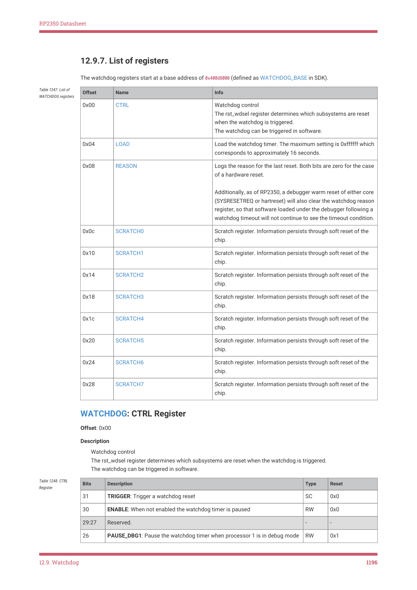

# 12.9.7. List of registers

RP2350 Datasheet

12.9.7. List of registers

The watchdog registers start at a base address of 0x400d8000 (defined as WATCHDOG_BASE in SDK).

| Offset | Name | Info |
| --- | --- | --- |
| 0x00 | CTRL | Watchdog control The rst_wdsel register determines which subsystems are reset when the watchdog is triggered. The watchdog can be triggered in software. |
| 0x04 | LOAD | Load the watchdog timer. The maximum setting is 0xffffff which corresponds to approximately 16 seconds. |
| 0x08 | REASON | Logs the reason for the last reset. Both bits are zero for the case of a hardware reset. Additionally, as of RP2350, a debugger warm reset of either core (SYSRESETREQ or hartreset) will also clear the watchdog reason register, so that software loaded under the debugger following a watchdog timeout will not continue to see the timeout condition. |
| 0x0c | SCRATCH0 | Scratch register. Information persists through soft reset of the chip. |
| 0x10 | SCRATCH1 | Scratch register. Information persists through soft reset of the chip. |
| 0x14 | SCRATCH2 | Scratch register. Information persists through soft reset of the chip. |
| 0x18 | SCRATCH3 | Scratch register. Information persists through soft reset of the chip. |
| 0x1c | SCRATCH4 | Scratch register. Information persists through soft reset of the chip. |
| 0x20 | SCRATCH5 | Scratch register. Information persists through soft reset of the chip. |
| 0x24 | SCRATCH6 | Scratch register. Information persists through soft reset of the chip. |
| 0x28 | SCRATCH7 | Scratch register. Information persists through soft reset of the chip. |

Table 1247. List of

WATCHDOG: CTRL Register

Offset: 0x00

Description

Watchdog control

The rst_wdsel register determines which subsystems are reset when the watchdog is triggered.

The watchdog can be triggered in software.

| Bits | Description | Type | Reset |
| --- | --- | --- | --- |
| 31 | TRIGGER: Trigger a watchdog reset | SC | 0x0 |
| 30 | ENABLE: When not enabled the watchdog timer is paused | RW | 0x0 |
| 29:27 | Reserved. | - | - |
| 26 | PAUSE_DBG1: Pause the watchdog timer when processor 1 is in debug mode | RW | 0x1 |

Table 1248. CTRL

12.9. Watchdog
1196
