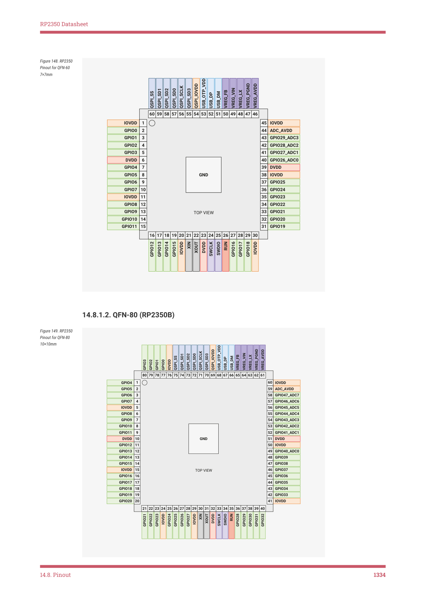

# 14.8.1. Pin locations

RP2350 Datasheet

14.7. Compliance

RP2350 QFN-60 is compliant to Moisture Sensitivity Level 1. The Moisture Sensitivity Level compliance of RP2350 QFN-

80 is yet to be fully characterised, and details will follow in a future datasheet update.

RP2350 is compliant to the requirement of REACH Substances of Very High Concern (SVHC), EU ECHA directive.

RP2350 is compliant to the requirement and standard of Controlled Environment-related Substance of RoHS directive

(EU) 2011/65/EU and directive (EU) 2015/863.

Raspberry Pi Ltd carried out the following Package Level reliability qualifications on RP2350:

• Temperature Cycling per JESD22-A104
• HAST per JESD22-A110
• HTSL per JESD22-A103
• MSL level per JESD22-A113

The following Silicon Level reliability qualification were also carried out:

• HTOL per JESD22-A108F

NOTE

A tin whiskers test is not performed. RP2350 is a bottom-only termination device in the QFN-60 and QFN-80

packages, therefore JEDEC standard (JESD201A) is not applicable.

14.8. Pinout

14.8.1. Pin locations

14.8.1.1. QFN-60 (RP2350A)

14.7. Compliance
1333

RP2350 Datasheet

Figure 148. RP2350

Pinout for QFN-60

7×7mm

USB_OTP_VDD

VREG_PGND

QSPI_IOVDD

VREG_AVDD

QSPI_SCLK

VREG_VIN

QSPI_SD3

QSPI_SD0

QSPI_SD2

QSPI_SD1

VREG_FB

VREG_LX

QSPI_SS

USB_DM

USB_DP

60 59 58 57 56 55 54 53 52 51 50 49 48

47 46

1

45

IOVDD

IOVDD

2

44

GPIO0

ADC_AVDD

3

43

GPIO1

GPIO29_ADC3

4

42

GPIO2

GPIO28_ADC2

5

41

GPIO3

GPIO27_ADC1

6

40

DVDD

GPIO26_ADC0

7

39

GPIO4

DVDD

GND

8

38

GPIO5

IOVDD

9

37

GPIO6

GPIO25

10

36

GPIO7

GPIO24

11

35

IOVDD

GPIO23

12

34

GPIO8

GPIO22

13

33

GPIO9

GPIO21

TOP VIEW

GPIO10

14

GPIO20

32

15

GPIO11

GPIO19
31

16 17 18 19 20 21 22 23 24 25 26 27 28 29 30

RUN

XIN

XOUT

GPIO18

GPIO17

GPIO16

GPIO15

GPIO14

GPIO13

GPIO12

SWCLK

DVDD

IOVDD

IOVDD

SWDIO

14.8.1.2. QFN-80 (RP2350B)

Figure 149. RP2350

Pinout for QFN-80

10×10mm

USB_OTP_VDD

VREG_PGND

QSPI_IOVDD

VREG_AVDD

QSPI_SCLK

VREG_VIN

QSPI_SD0

QSPI_SD2

QSPI_SD1

QSPI_SD3

VREG_FB

VREG_LX

QSPI_SS

USB_DM

USB_DP

IOVDD

GPIO0

GPIO1

GPIO2

GPIO3

80 79 78 77 76 75 74 73 72 71 70 69 68

67 66 65 64 63 62 61

1

60

GPIO4

IOVDD

2

59

GPIO5

ADC_AVDD

3

58

GPIO6

GPIO47_ADC7

4

57

GPIO7

GPIO46_ADC6

5

56

IOVDD

GPIO45_ADC5

6

55

GPIO8

GPIO44_ADC4

7

54

GPIO9

GPIO43_ADC3

8

53

GPIO10

GPIO42_ADC2

9

52

GPIO11

GPIO41_ADC1

GND

10

51

DVDD

DVDD

11

50

GPIO12

IOVDD

12

49

GPIO13

GPIO40_ADC0

13

48

GPIO14

GPIO39

GPIO15

14

GPIO38

47

15

15

IOVDD

GPIO11

GPIO37
46

TOP VIEW

16

GPIO16

45

GPIO36

17

GPIO17

44

GPIO35

GPIO18

18

43

GPIO34

19

GPIO19

42

GPIO33

GPIO20 20

IOVDD
41

21 22 23 24 25 26 27 28 29 30 31 32 33 34 35

36 37 38 39 40

RUN

XIN

XOUT

GPIO32

GPIO31

GPIO30

GPIO29

GPIO28

GPIO27

GPIO26

GPIO25

GPIO24

GPIO23

GPIO22

GPIO21

SWCLK

DVDD

IOVDD

IOVDD

SWDIO

14.8. Pinout
1334
