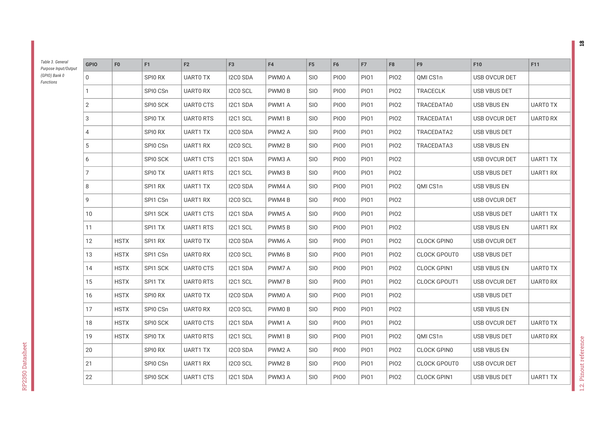

# 1.2.3. GPIO functions (Bank 0)

RP2350 Datasheet

| Name | Description |
| --- | --- |
| IOVDD | Power supply for digital GPIOs, nominal voltage 1.8V to 3.3V |
| USB_OTP_VDD | Power supply for internal USB Full Speed PHY and OTP storage, nominal voltage 3.3V |
| ADC_AVDD | Power supply for analogue-to-digital converter, nominal voltage 3.3V |
| QSPI_IOVDD | Power supply for QSPI IOs, nominal voltage 1.8V to 3.3V |
| VREG_AVDD | Analogue power supply for internal core voltage regulator, nominal voltage 3.3V |
| VREG_PGND | Power-ground connection for internal core voltage regulator, tie to ground externally |
| VREG_LX | Switched-mode output for internal core voltage regulator, connected to external inductor. Max current 200 mA, nominal voltage 1.1V after filtering. |
| VREG_VIN | Power input for internal core voltage regulator, nominal voltage 2.7V to 5.5V |
| VREG_FB | Voltage feedback for internal core voltage regulator, connect to filtered VREG output (e.g. to DVDD, if the regulator is used to supply DVDD) |
| DVDD | Digital core power supply, nominal voltage 1.1V. Must be connected externally, either to the voltage regulator output, or an external board-level power supply. |

1.2.3. GPIO functions (Bank 0)

Each individual GPIO pin can be connected to an internal peripheral via the GPIO functions defined below. Some internal

peripheral connections appear in multiple places to allow some system level flexibility. SIO, PIO0, PIO1 and PIO2 can

connect to all GPIO pins and are controlled by software (or software controlled state machines) so can be used to

implement many functions.

1.2. Pinout reference
17

1.2. Pinout reference
18

| GPIO | F0 | F1 | F2 | F3 | F4 | F5 | F6 | F7 | F8 | F9 | F10 | F11 |
| --- | --- | --- | --- | --- | --- | --- | --- | --- | --- | --- | --- | --- |
| 0 |  | SPI0 RX | UART0 TX | I2C0 SDA | PWM0 A | SIO | PIO0 | PIO1 | PIO2 | QMI CS1n | USB OVCUR DET |  |
| 1 |  | SPI0 CSn | UART0 RX | I2C0 SCL | PWM0 B | SIO | PIO0 | PIO1 | PIO2 | TRACECLK | USB VBUS DET |  |
| 2 |  | SPI0 SCK | UART0 CTS | I2C1 SDA | PWM1 A | SIO | PIO0 | PIO1 | PIO2 | TRACEDATA0 | USB VBUS EN | UART0 TX |
| 3 |  | SPI0 TX | UART0 RTS | I2C1 SCL | PWM1 B | SIO | PIO0 | PIO1 | PIO2 | TRACEDATA1 | USB OVCUR DET | UART0 RX |
| 4 |  | SPI0 RX | UART1 TX | I2C0 SDA | PWM2 A | SIO | PIO0 | PIO1 | PIO2 | TRACEDATA2 | USB VBUS DET |  |
| 5 |  | SPI0 CSn | UART1 RX | I2C0 SCL | PWM2 B | SIO | PIO0 | PIO1 | PIO2 | TRACEDATA3 | USB VBUS EN |  |
| 6 |  | SPI0 SCK | UART1 CTS | I2C1 SDA | PWM3 A | SIO | PIO0 | PIO1 | PIO2 |  | USB OVCUR DET | UART1 TX |
| 7 |  | SPI0 TX | UART1 RTS | I2C1 SCL | PWM3 B | SIO | PIO0 | PIO1 | PIO2 |  | USB VBUS DET | UART1 RX |
| 8 |  | SPI1 RX | UART1 TX | I2C0 SDA | PWM4 A | SIO | PIO0 | PIO1 | PIO2 | QMI CS1n | USB VBUS EN |  |
| 9 |  | SPI1 CSn | UART1 RX | I2C0 SCL | PWM4 B | SIO | PIO0 | PIO1 | PIO2 |  | USB OVCUR DET |  |
| 10 |  | SPI1 SCK | UART1 CTS | I2C1 SDA | PWM5 A | SIO | PIO0 | PIO1 | PIO2 |  | USB VBUS DET | UART1 TX |
| 11 |  | SPI1 TX | UART1 RTS | I2C1 SCL | PWM5 B | SIO | PIO0 | PIO1 | PIO2 |  | USB VBUS EN | UART1 RX |
| 12 | HSTX | SPI1 RX | UART0 TX | I2C0 SDA | PWM6 A | SIO | PIO0 | PIO1 | PIO2 | CLOCK GPIN0 | USB OVCUR DET |  |
| 13 | HSTX | SPI1 CSn | UART0 RX | I2C0 SCL | PWM6 B | SIO | PIO0 | PIO1 | PIO2 | CLOCK GPOUT0 | USB VBUS DET |  |
| 14 | HSTX | SPI1 SCK | UART0 CTS | I2C1 SDA | PWM7 A | SIO | PIO0 | PIO1 | PIO2 | CLOCK GPIN1 | USB VBUS EN | UART0 TX |
| 15 | HSTX | SPI1 TX | UART0 RTS | I2C1 SCL | PWM7 B | SIO | PIO0 | PIO1 | PIO2 | CLOCK GPOUT1 | USB OVCUR DET | UART0 RX |
| 16 | HSTX | SPI0 RX | UART0 TX | I2C0 SDA | PWM0 A | SIO | PIO0 | PIO1 | PIO2 |  | USB VBUS DET |  |
| 17 | HSTX | SPI0 CSn | UART0 RX | I2C0 SCL | PWM0 B | SIO | PIO0 | PIO1 | PIO2 |  | USB VBUS EN |  |
| 18 | HSTX | SPI0 SCK | UART0 CTS | I2C1 SDA | PWM1 A | SIO | PIO0 | PIO1 | PIO2 |  | USB OVCUR DET | UART0 TX |
| 19 | HSTX | SPI0 TX | UART0 RTS | I2C1 SCL | PWM1 B | SIO | PIO0 | PIO1 | PIO2 | QMI CS1n | USB VBUS DET | UART0 RX |
| 20 |  | SPI0 RX | UART1 TX | I2C0 SDA | PWM2 A | SIO | PIO0 | PIO1 | PIO2 | CLOCK GPIN0 | USB VBUS EN |  |
| 21 |  | SPI0 CSn | UART1 RX | I2C0 SCL | PWM2 B | SIO | PIO0 | PIO1 | PIO2 | CLOCK GPOUT0 | USB OVCUR DET |  |
| 22 |  | SPI0 SCK | UART1 CTS | I2C1 SDA | PWM3 A | SIO | PIO0 | PIO1 | PIO2 | CLOCK GPIN1 | USB VBUS DET | UART1 TX |

Table 3. General

Purpose Input/Output

(GPIO) Bank 0

Functions

RP2350 Datasheet

1.2. Pinout reference
19

| GPIO | F0 | F1 | F2 | F3 | F4 | F5 | F6 | F7 | F8 | F9 | F10 | F11 |
| --- | --- | --- | --- | --- | --- | --- | --- | --- | --- | --- | --- | --- |
| 23 |  | SPI0 TX | UART1 RTS | I2C1 SCL | PWM3 B | SIO | PIO0 | PIO1 | PIO2 | CLOCK GPOUT1 | USB VBUS EN | UART1 RX |
| 24 |  | SPI1 RX | UART1 TX | I2C0 SDA | PWM4 A | SIO | PIO0 | PIO1 | PIO2 | CLOCK GPOUT2 | USB OVCUR DET |  |
| 25 |  | SPI1 CSn | UART1 RX | I2C0 SCL | PWM4 B | SIO | PIO0 | PIO1 | PIO2 | CLOCK GPOUT3 | USB VBUS DET |  |
| 26 |  | SPI1 SCK | UART1 CTS | I2C1 SDA | PWM5 A | SIO | PIO0 | PIO1 | PIO2 |  | USB VBUS EN | UART1 TX |
| 27 |  | SPI1 TX | UART1 RTS | I2C1 SCL | PWM5 B | SIO | PIO0 | PIO1 | PIO2 |  | USB OVCUR DET | UART1 RX |
| 28 |  | SPI1 RX | UART0 TX | I2C0 SDA | PWM6 A | SIO | PIO0 | PIO1 | PIO2 |  | USB VBUS DET |  |
| 29 |  | SPI1 CSn | UART0 RX | I2C0 SCL | PWM6 B | SIO | PIO0 | PIO1 | PIO2 |  | USB VBUS EN |  |
| GPIOs 30 | through 47 | are QFN-80 onl | y: |  |  |  |  |  |  |  |  |  |
| 30 |  | SPI1 SCK | UART0 CTS | I2C1 SDA | PWM7 A | SIO | PIO0 | PIO1 | PIO2 |  | USB OVCUR DET | UART0 TX |
| 31 |  | SPI1 TX | UART0 RTS | I2C1 SCL | PWM7 B | SIO | PIO0 | PIO1 | PIO2 |  | USB VBUS DET | UART0 RX |
| 32 |  | SPI0 RX | UART0 TX | I2C0 SDA | PWM8 A | SIO | PIO0 | PIO1 | PIO2 |  | USB VBUS EN |  |
| 33 |  | SPI0 CSn | UART0 RX | I2C0 SCL | PWM8 B | SIO | PIO0 | PIO1 | PIO2 |  | USB OVCUR DET |  |
| 34 |  | SPI0 SCK | UART0 CTS | I2C1 SDA | PWM9 A | SIO | PIO0 | PIO1 | PIO2 |  | USB VBUS DET | UART0 TX |
| 35 |  | SPI0 TX | UART0 RTS | I2C1 SCL | PWM9 B | SIO | PIO0 | PIO1 | PIO2 |  | USB VBUS EN | UART0 RX |
| 36 |  | SPI0 RX | UART1 TX | I2C0 SDA | PWM10 A | SIO | PIO0 | PIO1 | PIO2 |  | USB OVCUR DET |  |
| 37 |  | SPI0 CSn | UART1 RX | I2C0 SCL | PWM10 B | SIO | PIO0 | PIO1 | PIO2 |  | USB VBUS DET |  |
| 38 |  | SPI0 SCK | UART1 CTS | I2C1 SDA | PWM11 A | SIO | PIO0 | PIO1 | PIO2 |  | USB VBUS EN | UART1 TX |
| 39 |  | SPI0 TX | UART1 RTS | I2C1 SCL | PWM11 B | SIO | PIO0 | PIO1 | PIO2 |  | USB OVCUR DET | UART1 RX |
| 40 |  | SPI1 RX | UART1 TX | I2C0 SDA | PWM8 A | SIO | PIO0 | PIO1 | PIO2 |  | USB VBUS DET |  |
| 41 |  | SPI1 CSn | UART1 RX | I2C0 SCL | PWM8 B | SIO | PIO0 | PIO1 | PIO2 |  | USB VBUS EN |  |
| 42 |  | SPI1 SCK | UART1 CTS | I2C1 SDA | PWM9 A | SIO | PIO0 | PIO1 | PIO2 |  | USB OVCUR DET | UART1 TX |
| 43 |  | SPI1 TX | UART1 RTS | I2C1 SCL | PWM9 B | SIO | PIO0 | PIO1 | PIO2 |  | USB VBUS DET | UART1 RX |
| 44 |  | SPI1 RX | UART0 TX | I2C0 SDA | PWM10 A | SIO | PIO0 | PIO1 | PIO2 |  | USB VBUS EN |  |

RP2350 Datasheet

1.2. Pinout reference
20

| GPIO | F0 | F1 | F2 | F3 | F4 | F5 | F6 | F7 | F8 | F9 | F10 | F11 |
| --- | --- | --- | --- | --- | --- | --- | --- | --- | --- | --- | --- | --- |
| 45 |  | SPI1 CSn | UART0 RX | I2C0 SCL | PWM10 B | SIO | PIO0 | PIO1 | PIO2 |  | USB OVCUR DET |  |
| 46 |  | SPI1 SCK | UART0 CTS | I2C1 SDA | PWM11 A | SIO | PIO0 | PIO1 | PIO2 |  | USB VBUS DET | UART0 TX |
| 47 |  | SPI1 TX | UART0 RTS | I2C1 SCL | PWM11 B | SIO | PIO0 | PIO1 | PIO2 | QMI CS1n | USB VBUS EN | UART0 RX |

RP2350 Datasheet
