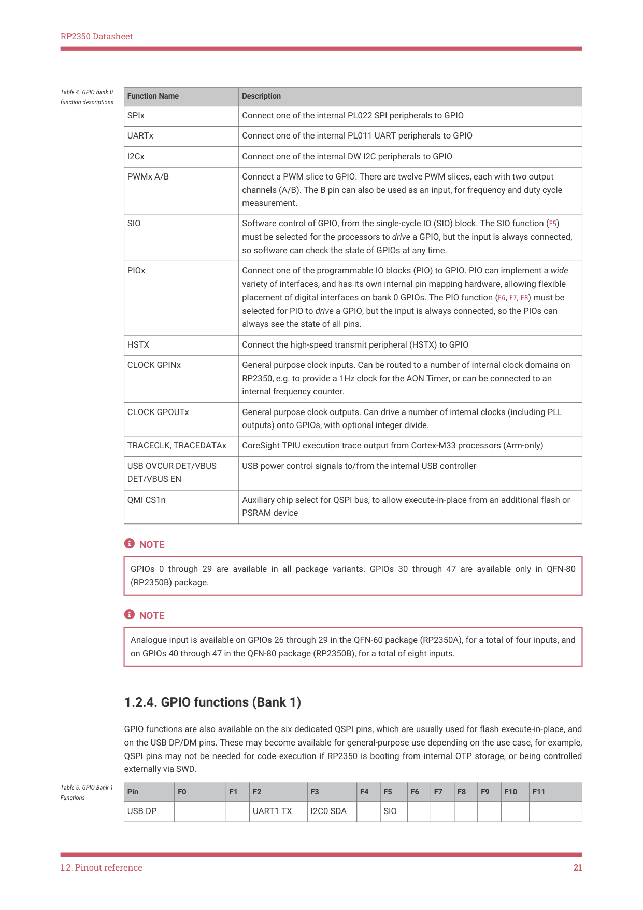

# 1.2.4. GPIO functions (Bank 1)

RP2350 Datasheet

| Function Name | Description |
| --- | --- |
| SPIx | Connect one of the internal PL022 SPI peripherals to GPIO |
| UARTx | Connect one of the internal PL011 UART peripherals to GPIO |
| I2Cx | Connect one of the internal DW I2C peripherals to GPIO |
| PWMx A/B | Connect a PWM slice to GPIO. There are twelve PWM slices, each with two output channels (A/B). The B pin can also be used as an input, for frequency and duty cycle measurement. |
| SIO | Software control of GPIO, from the single-cycle IO (SIO) block. The SIO function (F5) must be selected for the processors to drive a GPIO, but the input is always connected, so software can check the state of GPIOs at any time. |
| PIOx | Connect one of the programmable IO blocks (PIO) to GPIO. PIO can implement a wide variety of interfaces, and has its own internal pin mapping hardware, allowing flexible placement of digital interfaces on bank 0 GPIOs. The PIO function (F6, F7, F8) must be selected for PIO to drive a GPIO, but the input is always connected, so the PIOs can always see the state of all pins. |
| HSTX | Connect the high-speed transmit peripheral (HSTX) to GPIO |
| CLOCK GPINx | General purpose clock inputs. Can be routed to a number of internal clock domains on RP2350, e.g. to provide a 1Hz clock for the AON Timer, or can be connected to an internal frequency counter. |
| CLOCK GPOUTx | General purpose clock outputs. Can drive a number of internal clocks (including PLL outputs) onto GPIOs, with optional integer divide. |
| TRACECLK, TRACEDATAx | CoreSight TPIU execution trace output from Cortex-M33 processors (Arm-only) |
| USB OVCUR DET/VBUS DET/VBUS EN | USB power control signals to/from the internal USB controller |
| QMI CS1n | Auxiliary chip select for QSPI bus, to allow execute-in-place from an additional flash or PSRAM device |

Table 4. GPIO bank 0

NOTE

GPIOs 0 through 29 are available in all package variants. GPIOs 30 through 47 are available only in QFN-80

(RP2350B) package.

NOTE

Analogue input is available on GPIOs 26 through 29 in the QFN-60 package (RP2350A), for a total of four inputs, and

on GPIOs 40 through 47 in the QFN-80 package (RP2350B), for a total of eight inputs.

1.2.4. GPIO functions (Bank 1)

GPIO functions are also available on the six dedicated QSPI pins, which are usually used for flash execute-in-place, and

on the USB DP/DM pins. These may become available for general-purpose use depending on the use case, for example,

QSPI pins may not be needed for code execution if RP2350 is booting from internal OTP storage, or being controlled

externally via SWD.

Table 5. GPIO Bank 1

Functions
Pin
F0
F1
F2
F3
F4
F5
F6
F7
F8
F9
F10
F11

USB DP
UART1 TX
I2C0 SDA
SIO

1.2. Pinout reference
21
