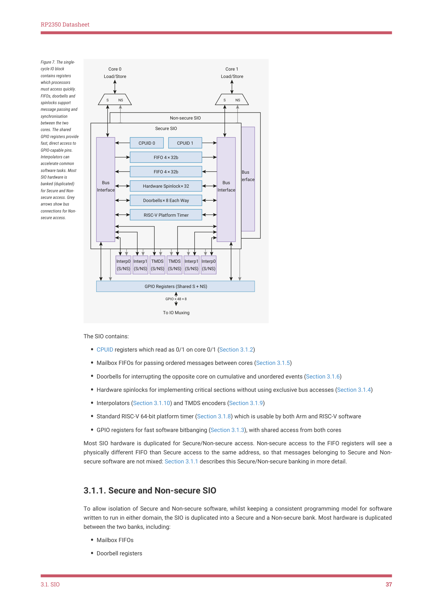

# 3.1.1. Secure and Non-secure SIO

RP2350 Datasheet

Figure 7. The single-

cycle IO block

Core 0

Core 1

contains registers

Load/Store

Load/Store

which processors

must access quickly.

FIFOs, doorbells and

S           NS
S           NS

spinlocks support

message passing and

synchronisation

Non-secure SIO

between the two

Secure SIO

cores. The shared

CPUID 0
CPUID 1

GPIO registers provide

CPUID 0
CPUID 1

fast, direct access to

FIFO 4 × 32b

GPIO-capable pins.

Interpolators can

FIFO 4 × 32b

FIFO 4 × 32b

accelerate common

software tasks. Most

FIFO 4 × 32b

Bus 

Bus 

Hardware Spinlock × 32

SIO hardware is

Interface

Interface

Bus 

Bus 

banked (duplicated)

Hardware Spinlock × 32

Interface

Interface

Doorbells × 8 Each Way

for Secure and Non-

secure access. Grey

Doorbells × 8 Each Way

arrows show bus

RISC-V Platform Timer

connections for Non-

RISC-V Platform Timer

secure access.

Interp0

Interp1

TMDS

TMDS

Interp1

Interp0

(S/NS)

(S/NS)

(S/NS)

(S/NS)

(S/NS)

(S/NS)

GPIO Registers (Shared S + NS)

GPIO × 48 + 8

To IO Muxing

The SIO contains:

• CPUID registers which read as 0/1 on core 0/1 (Section 3.1.2)
• Mailbox FIFOs for passing ordered messages between cores (Section 3.1.5)
• Doorbells for interrupting the opposite core on cumulative and unordered events (Section 3.1.6)
• Hardware spinlocks for implementing critical sections without using exclusive bus accesses (Section 3.1.4)
• Interpolators (Section 3.1.10) and TMDS encoders (Section 3.1.9)
• Standard RISC-V 64-bit platform timer (Section 3.1.8) which is usable by both Arm and RISC-V software
• GPIO registers for fast software bitbanging (Section 3.1.3), with shared access from both cores

Most SIO hardware is duplicated for Secure/Non-secure access. Non-secure access to the FIFO registers will see a

physically different FIFO than Secure access to the same address, so that messages belonging to Secure and Non-

secure software are not mixed: Section 3.1.1 describes this Secure/Non-secure banking in more detail.

3.1.1. Secure and Non-secure SIO

To allow isolation of Secure and Non-secure software, whilst keeping a consistent programming model for software

written to run in either domain, the SIO is duplicated into a Secure and a Non-secure bank. Most hardware is duplicated

between the two banks, including:

• Mailbox FIFOs
• Doorbell registers

3.1. SIO
37
