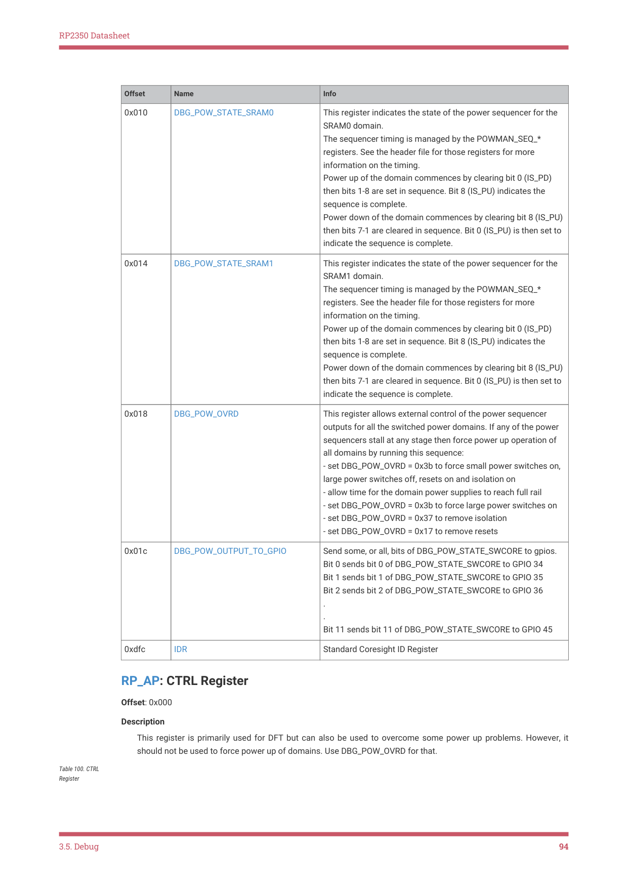
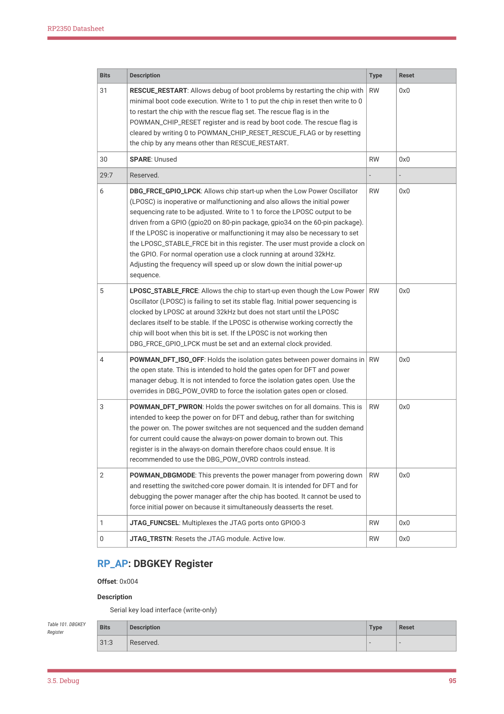
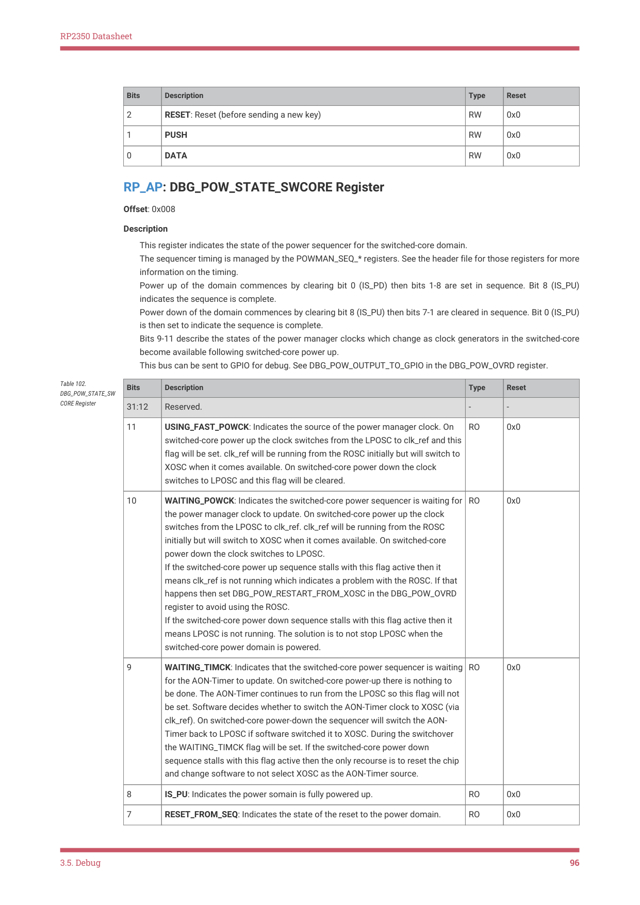
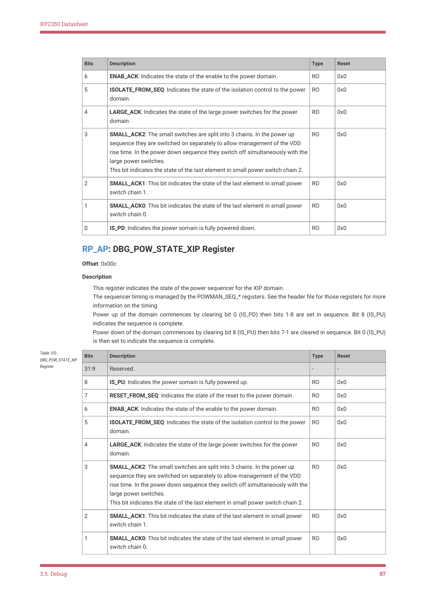
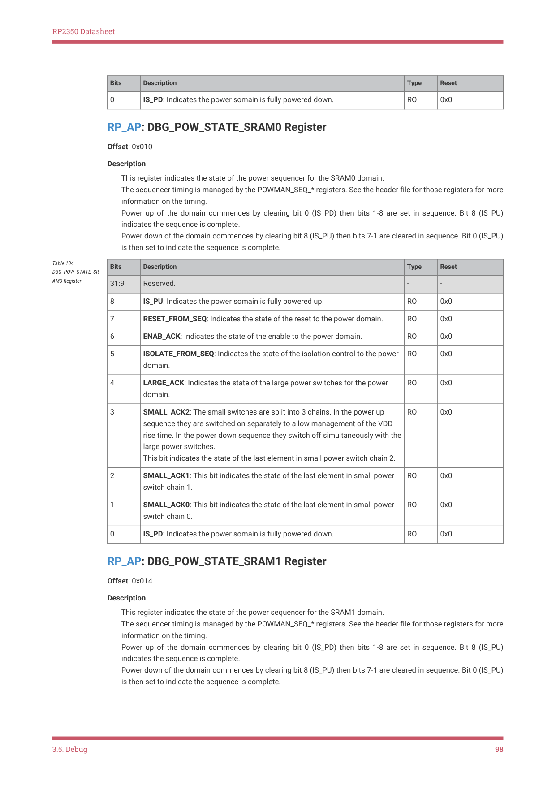
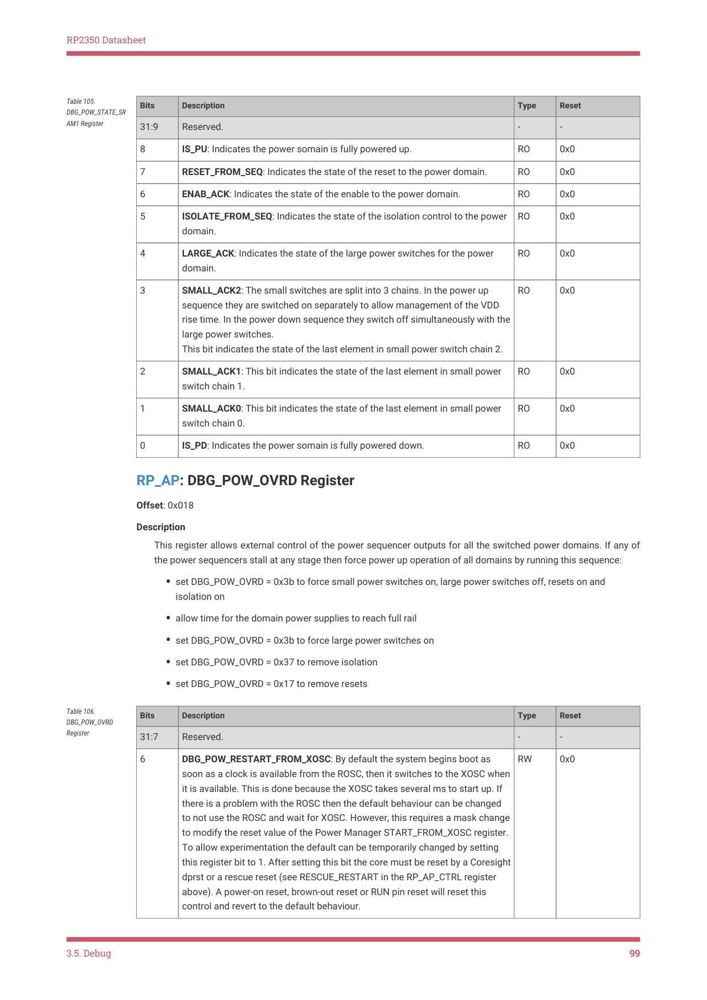

# 3.5.10. RP-AP

RP2350 Datasheet

DEBUGEN is clear, debug is be disabled no matter the state of the debug keys and the RP-AP.

3.5.10. RP-AP

The RP-AP is a small register block which is always accessible over SWD. RP-AP access does not require the switched

core domain to be powered up, or any internal system clock generators to be running.

3.5.10.1. List of registers

The RP-AP registers start at offset 0x80000 in the debug address space, which is accessed via address 0x80000 in the SW-

DP’s SELECT register. Unlike the other APs, it can not be accessed directly from the system bus.

| Offset | Name | Info |
| --- | --- | --- |
| 0x000 | CTRL | This register is primarily used for DFT but can also be used to overcome some power up problems. However, it should not be used to force power up of domains. Use DBG_POW_OVRD for that. |
| 0x004 | DBGKEY | Serial key load interface (write-only) |
| 0x008 | DBG_POW_STATE_SWCORE | This register indicates the state of the power sequencer for the switched-core domain. The sequencer timing is managed by the POWMAN_SEQ_* registers. See the header file for those registers for more information on the timing. Power up of the domain commences by clearing bit 0 (IS_PD) then bits 1-8 are set in sequence. Bit 8 (IS_PU) indicates the sequence is complete. Power down of the domain commences by clearing bit 8 (IS_PU) then bits 7-1 are cleared in sequence. Bit 0 (IS_PU) is then set to indicate the sequence is complete. Bits 9-11 describe the states of the power manager clocks which change as clock generators in the switched-core become available following switched-core power up. This bus can be sent to GPIO for debug. See DBG_POW_OUTPUT_TO_GPIO in the DBG_POW_OVRD register. |
| 0x00c | DBG_POW_STATE_XIP | This register indicates the state of the power sequencer for the XIP domain. The sequencer timing is managed by the POWMAN_SEQ_* registers. See the header file for those registers for more information on the timing. Power up of the domain commences by clearing bit 0 (IS_PD) then bits 1-8 are set in sequence. Bit 8 (IS_PU) indicates the sequence is complete. Power down of the domain commences by clearing bit 8 (IS_PU) then bits 7-1 are cleared in sequence. Bit 0 (IS_PU) is then set to indicate the sequence is complete. |

Table 99. List of

3.5. Debug
93

RP2350 Datasheet

| Offset | Name | Info |
| --- | --- | --- |
| 0x010 | DBG_POW_STATE_SRAM0 | This register indicates the state of the power sequencer for the SRAM0 domain. The sequencer timing is managed by the POWMAN_SEQ_* registers. See the header file for those registers for more information on the timing. Power up of the domain commences by clearing bit 0 (IS_PD) then bits 1-8 are set in sequence. Bit 8 (IS_PU) indicates the sequence is complete. Power down of the domain commences by clearing bit 8 (IS_PU) then bits 7-1 are cleared in sequence. Bit 0 (IS_PU) is then set to indicate the sequence is complete. |
| 0x014 | DBG_POW_STATE_SRAM1 | This register indicates the state of the power sequencer for the SRAM1 domain. The sequencer timing is managed by the POWMAN_SEQ_* registers. See the header file for those registers for more information on the timing. Power up of the domain commences by clearing bit 0 (IS_PD) then bits 1-8 are set in sequence. Bit 8 (IS_PU) indicates the sequence is complete. Power down of the domain commences by clearing bit 8 (IS_PU) then bits 7-1 are cleared in sequence. Bit 0 (IS_PU) is then set to indicate the sequence is complete. |
| 0x018 | DBG_POW_OVRD | This register allows external control of the power sequencer outputs for all the switched power domains. If any of the power sequencers stall at any stage then force power up operation of all domains by running this sequence: - set DBG_POW_OVRD = 0x3b to force small power switches on, large power switches off, resets on and isolation on - allow time for the domain power supplies to reach full rail - set DBG_POW_OVRD = 0x3b to force large power switches on - set DBG_POW_OVRD = 0x37 to remove isolation - set DBG_POW_OVRD = 0x17 to remove resets |
| 0x01c | DBG_POW_OUTPUT_TO_GPIO | Send some, or all, bits of DBG_POW_STATE_SWCORE to gpios. Bit 0 sends bit 0 of DBG_POW_STATE_SWCORE to GPIO 34 Bit 1 sends bit 1 of DBG_POW_STATE_SWCORE to GPIO 35 Bit 2 sends bit 2 of DBG_POW_STATE_SWCORE to GPIO 36 . . Bit 11 sends bit 11 of DBG_POW_STATE_SWCORE to GPIO 45 |
| 0xdfc | IDR | Standard Coresight ID Register |

RP_AP: CTRL Register

Offset: 0x000

Description

This register is primarily used for DFT but can also be used to overcome some power up problems. However, it

should not be used to force power up of domains. Use DBG_POW_OVRD for that.

Table 100. CTRL

Register

3.5. Debug
94

RP2350 Datasheet

| Bits | Description | Type | Reset |
| --- | --- | --- | --- |
| 31 | RESCUE_RESTART: Allows debug of boot problems by restarting the chip with minimal boot code execution. Write to 1 to put the chip in reset then write to 0 to restart the chip with the rescue flag set. The rescue flag is in the POWMAN_CHIP_RESET register and is read by boot code. The rescue flag is cleared by writing 0 to POWMAN_CHIP_RESET_RESCUE_FLAG or by resetting the chip by any means other than RESCUE_RESTART. | RW | 0x0 |
| 30 | SPARE: Unused | RW | 0x0 |
| 29:7 | Reserved. | - | - |
| 6 | DBG_FRCE_GPIO_LPCK: Allows chip start-up when the Low Power Oscillator (LPOSC) is inoperative or malfunctioning and also allows the initial power sequencing rate to be adjusted. Write to 1 to force the LPOSC output to be driven from a GPIO (gpio20 on 80-pin package, gpio34 on the 60-pin package). If the LPOSC is inoperative or malfunctioning it may also be necessary to set the LPOSC_STABLE_FRCE bit in this register. The user must provide a clock on the GPIO. For normal operation use a clock running at around 32kHz. Adjusting the frequency will speed up or slow down the initial power-up sequence. | RW | 0x0 |
| 5 | LPOSC_STABLE_FRCE: Allows the chip to start-up even though the Low Power Oscillator (LPOSC) is failing to set its stable flag. Initial power sequencing is clocked by LPOSC at around 32kHz but does not start until the LPOSC declares itself to be stable. If the LPOSC is otherwise working correctly the chip will boot when this bit is set. If the LPOSC is not working then DBG_FRCE_GPIO_LPCK must be set and an external clock provided. | RW | 0x0 |
| 4 | POWMAN_DFT_ISO_OFF: Holds the isolation gates between power domains in the open state. This is intended to hold the gates open for DFT and power manager debug. It is not intended to force the isolation gates open. Use the overrides in DBG_POW_OVRD to force the isolation gates open or closed. | RW | 0x0 |
| 3 | POWMAN_DFT_PWRON: Holds the power switches on for all domains. This is intended to keep the power on for DFT and debug, rather than for switching the power on. The power switches are not sequenced and the sudden demand for current could cause the always-on power domain to brown out. This register is in the always-on domain therefore chaos could ensue. It is recommended to use the DBG_POW_OVRD controls instead. | RW | 0x0 |
| 2 | POWMAN_DBGMODE: This prevents the power manager from powering down and resetting the switched-core power domain. It is intended for DFT and for debugging the power manager after the chip has booted. It cannot be used to force initial power on because it simultaneously deasserts the reset. | RW | 0x0 |
| 1 | JTAG_FUNCSEL: Multiplexes the JTAG ports onto GPIO0-3 | RW | 0x0 |
| 0 | JTAG_TRSTN: Resets the JTAG module. Active low. | RW | 0x0 |

RP_AP: DBGKEY Register

Offset: 0x004

Description

Serial key load interface (write-only)

| Bits | Description | Type | Reset |
| --- | --- | --- | --- |
| 31:3 | Reserved. | - | - |

Table 101. DBGKEY

3.5. Debug
95

RP2350 Datasheet

| Bits | Description | Type | Reset |
| --- | --- | --- | --- |
| 2 | RESET: Reset (before sending a new key) | RW | 0x0 |
| 1 | PUSH | RW | 0x0 |
| 0 | DATA | RW | 0x0 |

RP_AP: DBG_POW_STATE_SWCORE Register

Offset: 0x008

Description

This register indicates the state of the power sequencer for the switched-core domain.

The sequencer timing is managed by the POWMAN_SEQ_* registers. See the header file for those registers for more

information on the timing.

Power up of the domain commences by clearing bit 0 (IS_PD) then bits 1-8 are set in sequence. Bit 8 (IS_PU)

indicates the sequence is complete.

Power down of the domain commences by clearing bit 8 (IS_PU) then bits 7-1 are cleared in sequence. Bit 0 (IS_PU)

is then set to indicate the sequence is complete.

Bits 9-11 describe the states of the power manager clocks which change as clock generators in the switched-core

become available following switched-core power up.

This bus can be sent to GPIO for debug. See DBG_POW_OUTPUT_TO_GPIO in the DBG_POW_OVRD register.

| Bits | Description | Type | Reset |
| --- | --- | --- | --- |
| 31:12 | Reserved. | - | - |
| 11 | USING_FAST_POWCK: Indicates the source of the power manager clock. On switched-core power up the clock switches from the LPOSC to clk_ref and this flag will be set. clk_ref will be running from the ROSC initially but will switch to XOSC when it comes available. On switched-core power down the clock switches to LPOSC and this flag will be cleared. | RO | 0x0 |
| 10 | WAITING_POWCK: Indicates the switched-core power sequencer is waiting for the power manager clock to update. On switched-core power up the clock switches from the LPOSC to clk_ref. clk_ref will be running from the ROSC initially but will switch to XOSC when it comes available. On switched-core power down the clock switches to LPOSC. If the switched-core power up sequence stalls with this flag active then it means clk_ref is not running which indicates a problem with the ROSC. If that happens then set DBG_POW_RESTART_FROM_XOSC in the DBG_POW_OVRD register to avoid using the ROSC. If the switched-core power down sequence stalls with this flag active then it means LPOSC is not running. The solution is to not stop LPOSC when the switched-core power domain is powered. | RO | 0x0 |
| 9 | WAITING_TIMCK: Indicates that the switched-core power sequencer is waiting for the AON-Timer to update. On switched-core power-up there is nothing to be done. The AON-Timer continues to run from the LPOSC so this flag will not be set. Software decides whether to switch the AON-Timer clock to XOSC (via clk_ref). On switched-core power-down the sequencer will switch the AON- Timer back to LPOSC if software switched it to XOSC. During the switchover the WAITING_TIMCK flag will be set. If the switched-core power down sequence stalls with this flag active then the only recourse is to reset the chip and change software to not select XOSC as the AON-Timer source. | RO | 0x0 |
| 8 | IS_PU: Indicates the power somain is fully powered up. | RO | 0x0 |
| 7 | RESET_FROM_SEQ: Indicates the state of the reset to the power domain. | RO | 0x0 |

Table 102.

DBG_POW_STATE_SW

CORE Register

3.5. Debug
96

RP2350 Datasheet

| Bits | Description | Type | Reset |
| --- | --- | --- | --- |
| 6 | ENAB_ACK: Indicates the state of the enable to the power domain. | RO | 0x0 |
| 5 | ISOLATE_FROM_SEQ: Indicates the state of the isolation control to the power domain. | RO | 0x0 |
| 4 | LARGE_ACK: Indicates the state of the large power switches for the power domain. | RO | 0x0 |
| 3 | SMALL_ACK2: The small switches are split into 3 chains. In the power up sequence they are switched on separately to allow management of the VDD rise time. In the power down sequence they switch off simultaneously with the large power switches. This bit indicates the state of the last element in small power switch chain 2. | RO | 0x0 |
| 2 | SMALL_ACK1: This bit indicates the state of the last element in small power switch chain 1. | RO | 0x0 |
| 1 | SMALL_ACK0: This bit indicates the state of the last element in small power switch chain 0. | RO | 0x0 |
| 0 | IS_PD: Indicates the power somain is fully powered down. | RO | 0x0 |

RP_AP: DBG_POW_STATE_XIP Register

Offset: 0x00c

Description

This register indicates the state of the power sequencer for the XIP domain.

The sequencer timing is managed by the POWMAN_SEQ_* registers. See the header file for those registers for more

information on the timing.

Power up of the domain commences by clearing bit 0 (IS_PD) then bits 1-8 are set in sequence. Bit 8 (IS_PU)

indicates the sequence is complete.

Power down of the domain commences by clearing bit 8 (IS_PU) then bits 7-1 are cleared in sequence. Bit 0 (IS_PU)

is then set to indicate the sequence is complete.

| Bits | Description | Type | Reset |
| --- | --- | --- | --- |
| 31:9 | Reserved. | - | - |
| 8 | IS_PU: Indicates the power somain is fully powered up. | RO | 0x0 |
| 7 | RESET_FROM_SEQ: Indicates the state of the reset to the power domain. | RO | 0x0 |
| 6 | ENAB_ACK: Indicates the state of the enable to the power domain. | RO | 0x0 |
| 5 | ISOLATE_FROM_SEQ: Indicates the state of the isolation control to the power domain. | RO | 0x0 |
| 4 | LARGE_ACK: Indicates the state of the large power switches for the power domain. | RO | 0x0 |
| 3 | SMALL_ACK2: The small switches are split into 3 chains. In the power up sequence they are switched on separately to allow management of the VDD rise time. In the power down sequence they switch off simultaneously with the large power switches. This bit indicates the state of the last element in small power switch chain 2. | RO | 0x0 |
| 2 | SMALL_ACK1: This bit indicates the state of the last element in small power switch chain 1. | RO | 0x0 |
| 1 | SMALL_ACK0: This bit indicates the state of the last element in small power switch chain 0. | RO | 0x0 |

Table 103.

DBG_POW_STATE_XIP

Register

3.5. Debug
97

RP2350 Datasheet

| Bits | Description | Type | Reset |
| --- | --- | --- | --- |
| 0 | IS_PD: Indicates the power somain is fully powered down. | RO | 0x0 |

RP_AP: DBG_POW_STATE_SRAM0 Register

Offset: 0x010

Description

This register indicates the state of the power sequencer for the SRAM0 domain.

The sequencer timing is managed by the POWMAN_SEQ_* registers. See the header file for those registers for more

information on the timing.

Power up of the domain commences by clearing bit 0 (IS_PD) then bits 1-8 are set in sequence. Bit 8 (IS_PU)

indicates the sequence is complete.

Power down of the domain commences by clearing bit 8 (IS_PU) then bits 7-1 are cleared in sequence. Bit 0 (IS_PU)

is then set to indicate the sequence is complete.

| Bits | Description | Type | Reset |
| --- | --- | --- | --- |
| 31:9 | Reserved. | - | - |
| 8 | IS_PU: Indicates the power somain is fully powered up. | RO | 0x0 |
| 7 | RESET_FROM_SEQ: Indicates the state of the reset to the power domain. | RO | 0x0 |
| 6 | ENAB_ACK: Indicates the state of the enable to the power domain. | RO | 0x0 |
| 5 | ISOLATE_FROM_SEQ: Indicates the state of the isolation control to the power domain. | RO | 0x0 |
| 4 | LARGE_ACK: Indicates the state of the large power switches for the power domain. | RO | 0x0 |
| 3 | SMALL_ACK2: The small switches are split into 3 chains. In the power up sequence they are switched on separately to allow management of the VDD rise time. In the power down sequence they switch off simultaneously with the large power switches. This bit indicates the state of the last element in small power switch chain 2. | RO | 0x0 |
| 2 | SMALL_ACK1: This bit indicates the state of the last element in small power switch chain 1. | RO | 0x0 |
| 1 | SMALL_ACK0: This bit indicates the state of the last element in small power switch chain 0. | RO | 0x0 |
| 0 | IS_PD: Indicates the power somain is fully powered down. | RO | 0x0 |

Table 104.

DBG_POW_STATE_SR

AM0 Register

RP_AP: DBG_POW_STATE_SRAM1 Register

Offset: 0x014

Description

This register indicates the state of the power sequencer for the SRAM1 domain.

The sequencer timing is managed by the POWMAN_SEQ_* registers. See the header file for those registers for more

information on the timing.

Power up of the domain commences by clearing bit 0 (IS_PD) then bits 1-8 are set in sequence. Bit 8 (IS_PU)

indicates the sequence is complete.

Power down of the domain commences by clearing bit 8 (IS_PU) then bits 7-1 are cleared in sequence. Bit 0 (IS_PU)

is then set to indicate the sequence is complete.

3.5. Debug
98

RP2350 Datasheet

| Bits | Description | Type | Reset |
| --- | --- | --- | --- |
| 31:9 | Reserved. | - | - |
| 8 | IS_PU: Indicates the power somain is fully powered up. | RO | 0x0 |
| 7 | RESET_FROM_SEQ: Indicates the state of the reset to the power domain. | RO | 0x0 |
| 6 | ENAB_ACK: Indicates the state of the enable to the power domain. | RO | 0x0 |
| 5 | ISOLATE_FROM_SEQ: Indicates the state of the isolation control to the power domain. | RO | 0x0 |
| 4 | LARGE_ACK: Indicates the state of the large power switches for the power domain. | RO | 0x0 |
| 3 | SMALL_ACK2: The small switches are split into 3 chains. In the power up sequence they are switched on separately to allow management of the VDD rise time. In the power down sequence they switch off simultaneously with the large power switches. This bit indicates the state of the last element in small power switch chain 2. | RO | 0x0 |
| 2 | SMALL_ACK1: This bit indicates the state of the last element in small power switch chain 1. | RO | 0x0 |
| 1 | SMALL_ACK0: This bit indicates the state of the last element in small power switch chain 0. | RO | 0x0 |
| 0 | IS_PD: Indicates the power somain is fully powered down. | RO | 0x0 |

Table 105.

DBG_POW_STATE_SR

AM1 Register

RP_AP: DBG_POW_OVRD Register

Offset: 0x018

Description

This register allows external control of the power sequencer outputs for all the switched power domains. If any of

the power sequencers stall at any stage then force power up operation of all domains by running this sequence:

• set DBG_POW_OVRD = 0x3b to force small power switches on, large power switches off, resets on and

isolation on
• allow time for the domain power supplies to reach full rail
• set DBG_POW_OVRD = 0x3b to force large power switches on
• set DBG_POW_OVRD = 0x37 to remove isolation
• set DBG_POW_OVRD = 0x17 to remove resets

| Bits | Description | Type | Reset |
| --- | --- | --- | --- |
| 31:7 | Reserved. | - | - |
| 6 | DBG_POW_RESTART_FROM_XOSC: By default the system begins boot as soon as a clock is available from the ROSC, then it switches to the XOSC when it is available. This is done because the XOSC takes several ms to start up. If there is a problem with the ROSC then the default behaviour can be changed to not use the ROSC and wait for XOSC. However, this requires a mask change to modify the reset value of the Power Manager START_FROM_XOSC register. To allow experimentation the default can be temporarily changed by setting this register bit to 1. After setting this bit the core must be reset by a Coresight dprst or a rescue reset (see RESCUE_RESTART in the RP_AP_CTRL register above). A power-on reset, brown-out reset or RUN pin reset will reset this control and revert to the default behaviour. | RW | 0x0 |

Table 106.

DBG_POW_OVRD

Register

3.5. Debug
99
