# 3.7.5. List of registers

RP2350 Datasheet

| Address offset | Name | Type | Reset value | Description |
| --- | --- | --- | --- | --- |
| 0xE0042FCC | DEVTYPE | RO | 0x00000014 | Device Type Identifier Register |
| 0xE0042FD0 | PIDR4 | RO | 0x00000004 | Peripheral ID4 Register |
| 0xE0042FD4 | PIDR5 | RO | 0x00000000 | Peripheral ID5 Register |
| 0xE0042FD8 | PIDR6 | RO | 0x00000000 | Peripheral ID6 Register |
| 0xE0042FDC | PIDR7 | RO | 0x00000000 | Peripheral ID7 Register |
| 0xE0042FE0 | PIDR0 | RO | 0x00000021 | Peripheral ID0 Register |
| 0xE0042FE4 | PIDR1 | RO | 0x000000BD | Peripheral ID1 Register |
| 0xE0042FE8 | PIDR2 | RO | 0x0000000B | Peripheral ID2 Register |
| 0xE0042FEC | PIDR3 | RO | 0x00000001 | Peripheral ID3 Register |
| 0xE0042FF0 | CIDR0 | RO | 0x0000000D | Component ID0 Register |
| 0xE0042FF4 | CIDR1 | RO | 0x00000090 | Component ID1 Register |
| 0xE0042FF8 | CIDR2 | RO | 0x00000005 | Component ID2 Register |
| 0xE0042FFC | CIDR3 | RO | 0x000000B1 | Component ID3 Register |

3.7.5. List of registers

The Arm Cortex-M33 registers start at a base address of 0xe0000000, defined as PPB_BASE in the SDK.

| Offset | Name | Info |
| --- | --- | --- |
| 0x00000 | ITM_STIM0 | ITM Stimulus Port Register 0 |
| 0x00004 | ITM_STIM1 | ITM Stimulus Port Register 1 |
| 0x00008 | ITM_STIM2 | ITM Stimulus Port Register 2 |
| 0x0000c | ITM_STIM3 | ITM Stimulus Port Register 3 |
| 0x00010 | ITM_STIM4 | ITM Stimulus Port Register 4 |
| 0x00014 | ITM_STIM5 | ITM Stimulus Port Register 5 |
| 0x00018 | ITM_STIM6 | ITM Stimulus Port Register 6 |
| 0x0001c | ITM_STIM7 | ITM Stimulus Port Register 7 |
| 0x00020 | ITM_STIM8 | ITM Stimulus Port Register 8 |
| 0x00024 | ITM_STIM9 | ITM Stimulus Port Register 9 |
| 0x00028 | ITM_STIM10 | ITM Stimulus Port Register 10 |
| 0x0002c | ITM_STIM11 | ITM Stimulus Port Register 11 |
| 0x00030 | ITM_STIM12 | ITM Stimulus Port Register 12 |
| 0x00034 | ITM_STIM13 | ITM Stimulus Port Register 13 |
| 0x00038 | ITM_STIM14 | ITM Stimulus Port Register 14 |
| 0x0003c | ITM_STIM15 | ITM Stimulus Port Register 15 |
| 0x00040 | ITM_STIM16 | ITM Stimulus Port Register 16 |
| 0x00044 | ITM_STIM17 | ITM Stimulus Port Register 17 |

Table 121. List of M33

3.7. Cortex-M33 processor
148

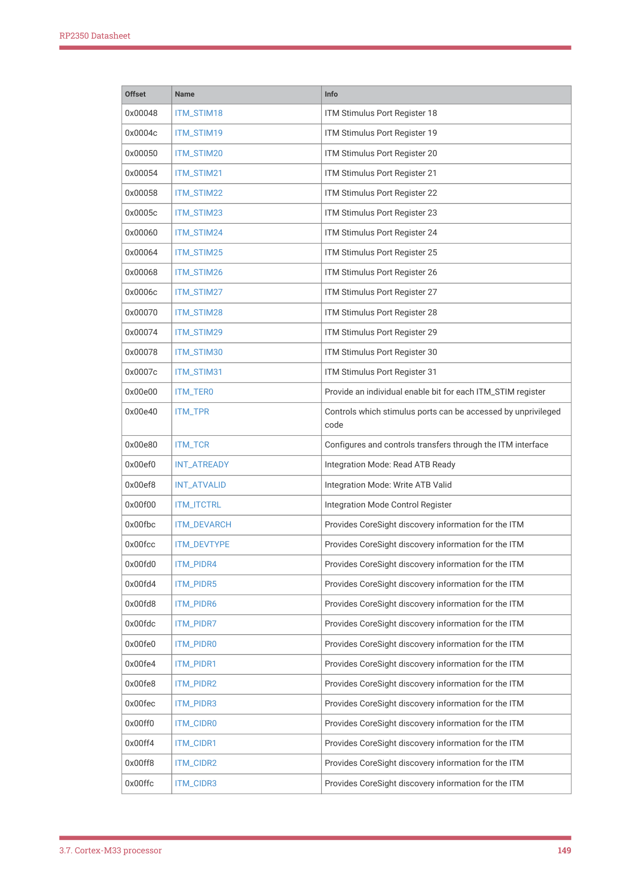

RP2350 Datasheet

| Offset | Name | Info |
| --- | --- | --- |
| 0x00048 | ITM_STIM18 | ITM Stimulus Port Register 18 |
| 0x0004c | ITM_STIM19 | ITM Stimulus Port Register 19 |
| 0x00050 | ITM_STIM20 | ITM Stimulus Port Register 20 |
| 0x00054 | ITM_STIM21 | ITM Stimulus Port Register 21 |
| 0x00058 | ITM_STIM22 | ITM Stimulus Port Register 22 |
| 0x0005c | ITM_STIM23 | ITM Stimulus Port Register 23 |
| 0x00060 | ITM_STIM24 | ITM Stimulus Port Register 24 |
| 0x00064 | ITM_STIM25 | ITM Stimulus Port Register 25 |
| 0x00068 | ITM_STIM26 | ITM Stimulus Port Register 26 |
| 0x0006c | ITM_STIM27 | ITM Stimulus Port Register 27 |
| 0x00070 | ITM_STIM28 | ITM Stimulus Port Register 28 |
| 0x00074 | ITM_STIM29 | ITM Stimulus Port Register 29 |
| 0x00078 | ITM_STIM30 | ITM Stimulus Port Register 30 |
| 0x0007c | ITM_STIM31 | ITM Stimulus Port Register 31 |
| 0x00e00 | ITM_TER0 | Provide an individual enable bit for each ITM_STIM register |
| 0x00e40 | ITM_TPR | Controls which stimulus ports can be accessed by unprivileged code |
| 0x00e80 | ITM_TCR | Configures and controls transfers through the ITM interface |
| 0x00ef0 | INT_ATREADY | Integration Mode: Read ATB Ready |
| 0x00ef8 | INT_ATVALID | Integration Mode: Write ATB Valid |
| 0x00f00 | ITM_ITCTRL | Integration Mode Control Register |
| 0x00fbc | ITM_DEVARCH | Provides CoreSight discovery information for the ITM |
| 0x00fcc | ITM_DEVTYPE | Provides CoreSight discovery information for the ITM |
| 0x00fd0 | ITM_PIDR4 | Provides CoreSight discovery information for the ITM |
| 0x00fd4 | ITM_PIDR5 | Provides CoreSight discovery information for the ITM |
| 0x00fd8 | ITM_PIDR6 | Provides CoreSight discovery information for the ITM |
| 0x00fdc | ITM_PIDR7 | Provides CoreSight discovery information for the ITM |
| 0x00fe0 | ITM_PIDR0 | Provides CoreSight discovery information for the ITM |
| 0x00fe4 | ITM_PIDR1 | Provides CoreSight discovery information for the ITM |
| 0x00fe8 | ITM_PIDR2 | Provides CoreSight discovery information for the ITM |
| 0x00fec | ITM_PIDR3 | Provides CoreSight discovery information for the ITM |
| 0x00ff0 | ITM_CIDR0 | Provides CoreSight discovery information for the ITM |
| 0x00ff4 | ITM_CIDR1 | Provides CoreSight discovery information for the ITM |
| 0x00ff8 | ITM_CIDR2 | Provides CoreSight discovery information for the ITM |
| 0x00ffc | ITM_CIDR3 | Provides CoreSight discovery information for the ITM |

3.7. Cortex-M33 processor
149

RP2350 Datasheet

| Offset | Name | Info |
| --- | --- | --- |
| 0x01000 | DWT_CTRL | Provides configuration and status information for the DWT unit, and used to control features of the unit |
| 0x01004 | DWT_CYCCNT | Shows or sets the value of the processor cycle counter, CYCCNT |
| 0x0100c | DWT_EXCCNT | Counts the total cycles spent in exception processing |
| 0x01014 | DWT_LSUCNT | Increments on the additional cycles required to execute all load or store instructions |
| 0x01018 | DWT_FOLDCNT | Increments on the additional cycles required to execute all load or store instructions |
| 0x01020 | DWT_COMP0 | Provides a reference value for use by watchpoint comparator 0 |
| 0x01028 | DWT_FUNCTION0 | Controls the operation of watchpoint comparator 0 |
| 0x01030 | DWT_COMP1 | Provides a reference value for use by watchpoint comparator 1 |
| 0x01038 | DWT_FUNCTION1 | Controls the operation of watchpoint comparator 1 |
| 0x01040 | DWT_COMP2 | Provides a reference value for use by watchpoint comparator 2 |
| 0x01048 | DWT_FUNCTION2 | Controls the operation of watchpoint comparator 2 |
| 0x01050 | DWT_COMP3 | Provides a reference value for use by watchpoint comparator 3 |
| 0x01058 | DWT_FUNCTION3 | Controls the operation of watchpoint comparator 3 |
| 0x01fbc | DWT_DEVARCH | Provides CoreSight discovery information for the DWT |
| 0x01fcc | DWT_DEVTYPE | Provides CoreSight discovery information for the DWT |
| 0x01fd0 | DWT_PIDR4 | Provides CoreSight discovery information for the DWT |
| 0x01fd4 | DWT_PIDR5 | Provides CoreSight discovery information for the DWT |
| 0x01fd8 | DWT_PIDR6 | Provides CoreSight discovery information for the DWT |
| 0x01fdc | DWT_PIDR7 | Provides CoreSight discovery information for the DWT |
| 0x01fe0 | DWT_PIDR0 | Provides CoreSight discovery information for the DWT |
| 0x01fe4 | DWT_PIDR1 | Provides CoreSight discovery information for the DWT |
| 0x01fe8 | DWT_PIDR2 | Provides CoreSight discovery information for the DWT |
| 0x01fec | DWT_PIDR3 | Provides CoreSight discovery information for the DWT |
| 0x01ff0 | DWT_CIDR0 | Provides CoreSight discovery information for the DWT |
| 0x01ff4 | DWT_CIDR1 | Provides CoreSight discovery information for the DWT |
| 0x01ff8 | DWT_CIDR2 | Provides CoreSight discovery information for the DWT |
| 0x01ffc | DWT_CIDR3 | Provides CoreSight discovery information for the DWT |
| 0x02000 | FP_CTRL | Provides FPB implementation information, and the global enable for the FPB unit |
| 0x02004 | FP_REMAP | Indicates whether the implementation supports Flash Patch remap and, if it does, holds the target address for remap |
| 0x02008 | FP_COMP0 | Holds an address for comparison. The effect of the match depends on the configuration of the FPB and whether the comparator is an instruction address comparator or a literal address comparator |

3.7. Cortex-M33 processor
150

RP2350 Datasheet

| Offset | Name | Info |
| --- | --- | --- |
| 0x0200c | FP_COMP1 | Holds an address for comparison. The effect of the match depends on the configuration of the FPB and whether the comparator is an instruction address comparator or a literal address comparator |
| 0x02010 | FP_COMP2 | Holds an address for comparison. The effect of the match depends on the configuration of the FPB and whether the comparator is an instruction address comparator or a literal address comparator |
| 0x02014 | FP_COMP3 | Holds an address for comparison. The effect of the match depends on the configuration of the FPB and whether the comparator is an instruction address comparator or a literal address comparator |
| 0x02018 | FP_COMP4 | Holds an address for comparison. The effect of the match depends on the configuration of the FPB and whether the comparator is an instruction address comparator or a literal address comparator |
| 0x0201c | FP_COMP5 | Holds an address for comparison. The effect of the match depends on the configuration of the FPB and whether the comparator is an instruction address comparator or a literal address comparator |
| 0x02020 | FP_COMP6 | Holds an address for comparison. The effect of the match depends on the configuration of the FPB and whether the comparator is an instruction address comparator or a literal address comparator |
| 0x02024 | FP_COMP7 | Holds an address for comparison. The effect of the match depends on the configuration of the FPB and whether the comparator is an instruction address comparator or a literal address comparator |
| 0x02fbc | FP_DEVARCH | Provides CoreSight discovery information for the FPB |
| 0x02fcc | FP_DEVTYPE | Provides CoreSight discovery information for the FPB |
| 0x02fd0 | FP_PIDR4 | Provides CoreSight discovery information for the FP |
| 0x02fd4 | FP_PIDR5 | Provides CoreSight discovery information for the FP |
| 0x02fd8 | FP_PIDR6 | Provides CoreSight discovery information for the FP |
| 0x02fdc | FP_PIDR7 | Provides CoreSight discovery information for the FP |
| 0x02fe0 | FP_PIDR0 | Provides CoreSight discovery information for the FP |
| 0x02fe4 | FP_PIDR1 | Provides CoreSight discovery information for the FP |
| 0x02fe8 | FP_PIDR2 | Provides CoreSight discovery information for the FP |
| 0x02fec | FP_PIDR3 | Provides CoreSight discovery information for the FP |
| 0x02ff0 | FP_CIDR0 | Provides CoreSight discovery information for the FP |
| 0x02ff4 | FP_CIDR1 | Provides CoreSight discovery information for the FP |
| 0x02ff8 | FP_CIDR2 | Provides CoreSight discovery information for the FP |
| 0x02ffc | FP_CIDR3 | Provides CoreSight discovery information for the FP |
| 0x0e004 | ICTR | Provides information about the interrupt controller |

3.7. Cortex-M33 processor
151

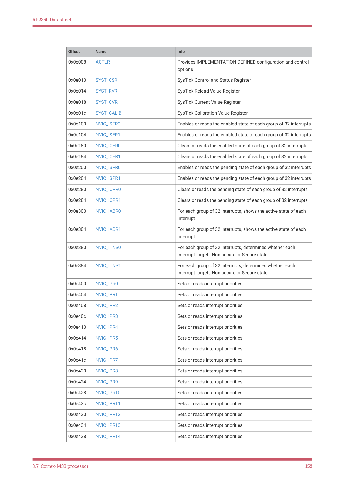

RP2350 Datasheet

| Offset | Name | Info |
| --- | --- | --- |
| 0x0e008 | ACTLR | Provides IMPLEMENTATION DEFINED configuration and control options |
| 0x0e010 | SYST_CSR | SysTick Control and Status Register |
| 0x0e014 | SYST_RVR | SysTick Reload Value Register |
| 0x0e018 | SYST_CVR | SysTick Current Value Register |
| 0x0e01c | SYST_CALIB | SysTick Calibration Value Register |
| 0x0e100 | NVIC_ISER0 | Enables or reads the enabled state of each group of 32 interrupts |
| 0x0e104 | NVIC_ISER1 | Enables or reads the enabled state of each group of 32 interrupts |
| 0x0e180 | NVIC_ICER0 | Clears or reads the enabled state of each group of 32 interrupts |
| 0x0e184 | NVIC_ICER1 | Clears or reads the enabled state of each group of 32 interrupts |
| 0x0e200 | NVIC_ISPR0 | Enables or reads the pending state of each group of 32 interrupts |
| 0x0e204 | NVIC_ISPR1 | Enables or reads the pending state of each group of 32 interrupts |
| 0x0e280 | NVIC_ICPR0 | Clears or reads the pending state of each group of 32 interrupts |
| 0x0e284 | NVIC_ICPR1 | Clears or reads the pending state of each group of 32 interrupts |
| 0x0e300 | NVIC_IABR0 | For each group of 32 interrupts, shows the active state of each interrupt |
| 0x0e304 | NVIC_IABR1 | For each group of 32 interrupts, shows the active state of each interrupt |
| 0x0e380 | NVIC_ITNS0 | For each group of 32 interrupts, determines whether each interrupt targets Non-secure or Secure state |
| 0x0e384 | NVIC_ITNS1 | For each group of 32 interrupts, determines whether each interrupt targets Non-secure or Secure state |
| 0x0e400 | NVIC_IPR0 | Sets or reads interrupt priorities |
| 0x0e404 | NVIC_IPR1 | Sets or reads interrupt priorities |
| 0x0e408 | NVIC_IPR2 | Sets or reads interrupt priorities |
| 0x0e40c | NVIC_IPR3 | Sets or reads interrupt priorities |
| 0x0e410 | NVIC_IPR4 | Sets or reads interrupt priorities |
| 0x0e414 | NVIC_IPR5 | Sets or reads interrupt priorities |
| 0x0e418 | NVIC_IPR6 | Sets or reads interrupt priorities |
| 0x0e41c | NVIC_IPR7 | Sets or reads interrupt priorities |
| 0x0e420 | NVIC_IPR8 | Sets or reads interrupt priorities |
| 0x0e424 | NVIC_IPR9 | Sets or reads interrupt priorities |
| 0x0e428 | NVIC_IPR10 | Sets or reads interrupt priorities |
| 0x0e42c | NVIC_IPR11 | Sets or reads interrupt priorities |
| 0x0e430 | NVIC_IPR12 | Sets or reads interrupt priorities |
| 0x0e434 | NVIC_IPR13 | Sets or reads interrupt priorities |
| 0x0e438 | NVIC_IPR14 | Sets or reads interrupt priorities |

3.7. Cortex-M33 processor
152

RP2350 Datasheet

| Offset | Name | Info |
| --- | --- | --- |
| 0x0e43c | NVIC_IPR15 | Sets or reads interrupt priorities |
| 0x0ed00 | CPUID | Provides identification information for the PE, including an implementer code for the device and a device ID number |
| 0x0ed04 | ICSR | Controls and provides status information for NMI, PendSV, SysTick and interrupts |
| 0x0ed08 | VTOR | Vector Table Offset Register |
| 0x0ed0c | AIRCR | Application Interrupt and Reset Control Register |
| 0x0ed10 | SCR | System Control Register |
| 0x0ed14 | CCR | Sets or returns configuration and control data |
| 0x0ed18 | SHPR1 | Sets or returns priority for system handlers 4 - 7 |
| 0x0ed1c | SHPR2 | Sets or returns priority for system handlers 8 - 11 |
| 0x0ed20 | SHPR3 | Sets or returns priority for system handlers 12 - 15 |
| 0x0ed24 | SHCSR | Provides access to the active and pending status of system exceptions |
| 0x0ed28 | CFSR | Contains the three Configurable Fault Status Registers. 31:16 UFSR: Provides information on UsageFault exceptions 15:8 BFSR: Provides information on BusFault exceptions 7:0 MMFSR: Provides information on MemManage exceptions |
| 0x0ed2c | HFSR | Shows the cause of any HardFaults |
| 0x0ed30 | DFSR | Shows which debug event occurred |
| 0x0ed34 | MMFAR | Shows the address of the memory location that caused an MPU fault |
| 0x0ed38 | BFAR | Shows the address associated with a precise data access BusFault |
| 0x0ed40 | ID_PFR0 | Gives top-level information about the instruction set supported by the PE |
| 0x0ed44 | ID_PFR1 | Gives information about the programmers' model and Extensions support |
| 0x0ed48 | ID_DFR0 | Provides top level information about the debug system |
| 0x0ed4c | ID_AFR0 | Provides information about the IMPLEMENTATION DEFINED features of the PE |
| 0x0ed50 | ID_MMFR0 | Provides information about the implemented memory model and memory management support |
| 0x0ed54 | ID_MMFR1 | Provides information about the implemented memory model and memory management support |
| 0x0ed58 | ID_MMFR2 | Provides information about the implemented memory model and memory management support |
| 0x0ed5c | ID_MMFR3 | Provides information about the implemented memory model and memory management support |

3.7. Cortex-M33 processor
153

RP2350 Datasheet

| Offset | Name | Info |
| --- | --- | --- |
| 0x0ed60 | ID_ISAR0 | Provides information about the instruction set implemented by the PE |
| 0x0ed64 | ID_ISAR1 | Provides information about the instruction set implemented by the PE |
| 0x0ed68 | ID_ISAR2 | Provides information about the instruction set implemented by the PE |
| 0x0ed6c | ID_ISAR3 | Provides information about the instruction set implemented by the PE |
| 0x0ed70 | ID_ISAR4 | Provides information about the instruction set implemented by the PE |
| 0x0ed74 | ID_ISAR5 | Provides information about the instruction set implemented by the PE |
| 0x0ed7c | CTR | Provides information about the architecture of the caches. CTR is RES0 if CLIDR is zero. |
| 0x0ed88 | CPACR | Specifies the access privileges for coprocessors and the FP Extension |
| 0x0ed8c | NSACR | Defines the Non-secure access permissions for both the FP Extension and coprocessors CP0 to CP7 |
| 0x0ed90 | MPU_TYPE | The MPU Type Register indicates how many regions the MPU `FTSSS supports |
| 0x0ed94 | MPU_CTRL | Enables the MPU and, when the MPU is enabled, controls whether the default memory map is enabled as a background region for privileged accesses, and whether the MPU is enabled for HardFaults, NMIs, and exception handlers when FAULTMASK is set to 1 |
| 0x0ed98 | MPU_RNR | Selects the region currently accessed by MPU_RBAR and MPU_RLAR |
| 0x0ed9c | MPU_RBAR | Provides indirect read and write access to the base address of the currently selected MPU region `FTSSS |
| 0x0eda0 | MPU_RLAR | Provides indirect read and write access to the limit address of the currently selected MPU region `FTSSS |
| 0x0eda4 | MPU_RBAR_A1 | Provides indirect read and write access to the base address of the MPU region selected by MPU_RNR[7:2]:(1[1:0]) `FTSSS |
| 0x0eda8 | MPU_RLAR_A1 | Provides indirect read and write access to the limit address of the currently selected MPU region selected by MPU_RNR[7:2]:(1[1:0]) `FTSSS |
| 0x0edac | MPU_RBAR_A2 | Provides indirect read and write access to the base address of the MPU region selected by MPU_RNR[7:2]:(2[1:0]) `FTSSS |
| 0x0edb0 | MPU_RLAR_A2 | Provides indirect read and write access to the limit address of the currently selected MPU region selected by MPU_RNR[7:2]:(2[1:0]) `FTSSS |
| 0x0edb4 | MPU_RBAR_A3 | Provides indirect read and write access to the base address of the MPU region selected by MPU_RNR[7:2]:(3[1:0]) `FTSSS |

3.7. Cortex-M33 processor
154

RP2350 Datasheet

| Offset | Name | Info |
| --- | --- | --- |
| 0x0edb8 | MPU_RLAR_A3 | Provides indirect read and write access to the limit address of the currently selected MPU region selected by MPU_RNR[7:2]:(3[1:0]) `FTSSS |
| 0x0edc0 | MPU_MAIR0 | Along with MPU_MAIR1, provides the memory attribute encodings corresponding to the AttrIndex values |
| 0x0edc4 | MPU_MAIR1 | Along with MPU_MAIR0, provides the memory attribute encodings corresponding to the AttrIndex values |
| 0x0edd0 | SAU_CTRL | Allows enabling of the Security Attribution Unit |
| 0x0edd4 | SAU_TYPE | Indicates the number of regions implemented by the Security Attribution Unit |
| 0x0edd8 | SAU_RNR | Selects the region currently accessed by SAU_RBAR and SAU_RLAR |
| 0x0eddc | SAU_RBAR | Provides indirect read and write access to the base address of the currently selected SAU region |
| 0x0ede0 | SAU_RLAR | Provides indirect read and write access to the limit address of the currently selected SAU region |
| 0x0ede4 | SFSR | Provides information about any security related faults |
| 0x0ede8 | SFAR | Shows the address of the memory location that caused a Security violation |
| 0x0edf0 | DHCSR | Controls halting debug |
| 0x0edf4 | DCRSR | With the DCRDR, provides debug access to the general-purpose registers, special-purpose registers, and the FP extension registers. A write to the DCRSR specifies the register to transfer, whether the transfer is a read or write, and starts the transfer |
| 0x0edf8 | DCRDR | With the DCRSR, provides debug access to the general-purpose registers, special-purpose registers, and the FP Extension registers. If the Main Extension is implemented, it can also be used for message passing between an external debugger and a debug agent running on the PE |
| 0x0edfc | DEMCR | Manages vector catch behavior and DebugMonitor handling when debugging |
| 0x0ee08 | DSCSR | Provides control and status information for Secure debug |
| 0x0ef00 | STIR | Provides a mechanism for software to generate an interrupt |
| 0x0ef34 | FPCCR | Holds control data for the Floating-point extension |
| 0x0ef38 | FPCAR | Holds the location of the unpopulated floating-point register space allocated on an exception stack frame |
| 0x0ef3c | FPDSCR | Holds the default values for the floating-point status control data that the PE assigns to the FPSCR when it creates a new floating- point context |
| 0x0ef40 | MVFR0 | Describes the features provided by the Floating-point Extension |
| 0x0ef44 | MVFR1 | Describes the features provided by the Floating-point Extension |
| 0x0ef48 | MVFR2 | Describes the features provided by the Floating-point Extension |
| 0x0efbc | DDEVARCH | Provides CoreSight discovery information for the SCS |

3.7. Cortex-M33 processor
155

RP2350 Datasheet

| Offset | Name | Info |
| --- | --- | --- |
| 0x0efcc | DDEVTYPE | Provides CoreSight discovery information for the SCS |
| 0x0efd0 | DPIDR4 | Provides CoreSight discovery information for the SCS |
| 0x0efd4 | DPIDR5 | Provides CoreSight discovery information for the SCS |
| 0x0efd8 | DPIDR6 | Provides CoreSight discovery information for the SCS |
| 0x0efdc | DPIDR7 | Provides CoreSight discovery information for the SCS |
| 0x0efe0 | DPIDR0 | Provides CoreSight discovery information for the SCS |
| 0x0efe4 | DPIDR1 | Provides CoreSight discovery information for the SCS |
| 0x0efe8 | DPIDR2 | Provides CoreSight discovery information for the SCS |
| 0x0efec | DPIDR3 | Provides CoreSight discovery information for the SCS |
| 0x0eff0 | DCIDR0 | Provides CoreSight discovery information for the SCS |
| 0x0eff4 | DCIDR1 | Provides CoreSight discovery information for the SCS |
| 0x0eff8 | DCIDR2 | Provides CoreSight discovery information for the SCS |
| 0x0effc | DCIDR3 | Provides CoreSight discovery information for the SCS |
| 0x41004 | TRCPRGCTLR | Programming Control Register |
| 0x4100c | TRCSTATR | The TRCSTATR indicates the ETM-Teal status |
| 0x41010 | TRCCONFIGR | The TRCCONFIGR sets the basic tracing options for the trace unit |
| 0x41020 | TRCEVENTCTL0R | The TRCEVENTCTL0R controls the tracing of events in the trace stream. The events also drive the ETM-Teal external outputs. |
| 0x41024 | TRCEVENTCTL1R | The TRCEVENTCTL1R controls how the events selected by TRCEVENTCTL0R behave |
| 0x4102c | TRCSTALLCTLR | The TRCSTALLCTLR enables ETM-Teal to stall the processor if the ETM-Teal FIFO goes over the programmed level to minimize risk of overflow |
| 0x41030 | TRCTSCTLR | The TRCTSCTLR controls the insertion of global timestamps into the trace stream. A timestamp is always inserted into the instruction trace stream |
| 0x41034 | TRCSYNCPR | The TRCSYNCPR specifies the period of trace synchronization of the trace streams. TRCSYNCPR defines a number of bytes of trace between requests for trace synchronization. This value is always a power of two |
| 0x41038 | TRCCCCTLR | The TRCCCCTLR sets the threshold value for instruction trace cycle counting. The threshold represents the minimum interval between cycle count trace packets |
| 0x41080 | TRCVICTLR | The TRCVICTLR controls instruction trace filtering |
| 0x41140 | TRCCNTRLDVR0 | The TRCCNTRLDVR defines the reload value for the reduced function counter |
| 0x41180 | TRCIDR8 | TRCIDR8 |
| 0x41184 | TRCIDR9 | TRCIDR9 |
| 0x41188 | TRCIDR10 | TRCIDR10 |

3.7. Cortex-M33 processor
156

RP2350 Datasheet

| Offset | Name | Info |
| --- | --- | --- |
| 0x4118c | TRCIDR11 | TRCIDR11 |
| 0x41190 | TRCIDR12 | TRCIDR12 |
| 0x41194 | TRCIDR13 | TRCIDR13 |
| 0x411c0 | TRCIMSPEC | The TRCIMSPEC shows the presence of any IMPLEMENTATION SPECIFIC features, and enables any features that are provided |
| 0x411e0 | TRCIDR0 | TRCIDR0 |
| 0x411e4 | TRCIDR1 | TRCIDR1 |
| 0x411e8 | TRCIDR2 | TRCIDR2 |
| 0x411ec | TRCIDR3 | TRCIDR3 |
| 0x411f0 | TRCIDR4 | TRCIDR4 |
| 0x411f4 | TRCIDR5 | TRCIDR5 |
| 0x411f8 | TRCIDR6 | TRCIDR6 |
| 0x411fc | TRCIDR7 | TRCIDR7 |
| 0x41208 | TRCRSCTLR2 | The TRCRSCTLR controls the trace resources |
| 0x4120c | TRCRSCTLR3 | The TRCRSCTLR controls the trace resources |
| 0x412a0 | TRCSSCSR | Controls the corresponding single-shot comparator resource |
| 0x412c0 | TRCSSPCICR | Selects the PE comparator inputs for Single-shot control |
| 0x41310 | TRCPDCR | Requests the system to provide power to the trace unit |
| 0x41314 | TRCPDSR | Returns the following information about the trace unit: - OS Lock status. - Core power domain status. - Power interruption status |
| 0x41ee4 | TRCITATBIDR | Trace Intergration ATB Identification Register |
| 0x41ef4 | TRCITIATBINR | Trace Integration Instruction ATB In Register |
| 0x41efc | TRCITIATBOUTR | Trace Integration Instruction ATB Out Register |
| 0x41fa0 | TRCCLAIMSET | Claim Tag Set Register |
| 0x41fa4 | TRCCLAIMCLR | Claim Tag Clear Register |
| 0x41fb8 | TRCAUTHSTATUS | Returns the level of tracing that the trace unit can support |
| 0x41fbc | TRCDEVARCH | TRCDEVARCH |
| 0x41fc8 | TRCDEVID | TRCDEVID |
| 0x41fcc | TRCDEVTYPE | TRCDEVTYPE |
| 0x41fd0 | TRCPIDR4 | TRCPIDR4 |
| 0x41fd4 | TRCPIDR5 | TRCPIDR5 |
| 0x41fd8 | TRCPIDR6 | TRCPIDR6 |
| 0x41fdc | TRCPIDR7 | TRCPIDR7 |
| 0x41fe0 | TRCPIDR0 | TRCPIDR0 |
| 0x41fe4 | TRCPIDR1 | TRCPIDR1 |
| 0x41fe8 | TRCPIDR2 | TRCPIDR2 |

3.7. Cortex-M33 processor
157

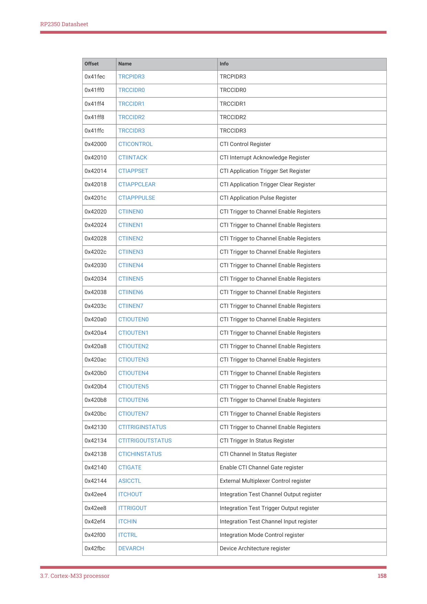

RP2350 Datasheet

| Offset | Name | Info |
| --- | --- | --- |
| 0x41fec | TRCPIDR3 | TRCPIDR3 |
| 0x41ff0 | TRCCIDR0 | TRCCIDR0 |
| 0x41ff4 | TRCCIDR1 | TRCCIDR1 |
| 0x41ff8 | TRCCIDR2 | TRCCIDR2 |
| 0x41ffc | TRCCIDR3 | TRCCIDR3 |
| 0x42000 | CTICONTROL | CTI Control Register |
| 0x42010 | CTIINTACK | CTI Interrupt Acknowledge Register |
| 0x42014 | CTIAPPSET | CTI Application Trigger Set Register |
| 0x42018 | CTIAPPCLEAR | CTI Application Trigger Clear Register |
| 0x4201c | CTIAPPPULSE | CTI Application Pulse Register |
| 0x42020 | CTIINEN0 | CTI Trigger to Channel Enable Registers |
| 0x42024 | CTIINEN1 | CTI Trigger to Channel Enable Registers |
| 0x42028 | CTIINEN2 | CTI Trigger to Channel Enable Registers |
| 0x4202c | CTIINEN3 | CTI Trigger to Channel Enable Registers |
| 0x42030 | CTIINEN4 | CTI Trigger to Channel Enable Registers |
| 0x42034 | CTIINEN5 | CTI Trigger to Channel Enable Registers |
| 0x42038 | CTIINEN6 | CTI Trigger to Channel Enable Registers |
| 0x4203c | CTIINEN7 | CTI Trigger to Channel Enable Registers |
| 0x420a0 | CTIOUTEN0 | CTI Trigger to Channel Enable Registers |
| 0x420a4 | CTIOUTEN1 | CTI Trigger to Channel Enable Registers |
| 0x420a8 | CTIOUTEN2 | CTI Trigger to Channel Enable Registers |
| 0x420ac | CTIOUTEN3 | CTI Trigger to Channel Enable Registers |
| 0x420b0 | CTIOUTEN4 | CTI Trigger to Channel Enable Registers |
| 0x420b4 | CTIOUTEN5 | CTI Trigger to Channel Enable Registers |
| 0x420b8 | CTIOUTEN6 | CTI Trigger to Channel Enable Registers |
| 0x420bc | CTIOUTEN7 | CTI Trigger to Channel Enable Registers |
| 0x42130 | CTITRIGINSTATUS | CTI Trigger to Channel Enable Registers |
| 0x42134 | CTITRIGOUTSTATUS | CTI Trigger In Status Register |
| 0x42138 | CTICHINSTATUS | CTI Channel In Status Register |
| 0x42140 | CTIGATE | Enable CTI Channel Gate register |
| 0x42144 | ASICCTL | External Multiplexer Control register |
| 0x42ee4 | ITCHOUT | Integration Test Channel Output register |
| 0x42ee8 | ITTRIGOUT | Integration Test Trigger Output register |
| 0x42ef4 | ITCHIN | Integration Test Channel Input register |
| 0x42f00 | ITCTRL | Integration Mode Control register |
| 0x42fbc | DEVARCH | Device Architecture register |

3.7. Cortex-M33 processor
158

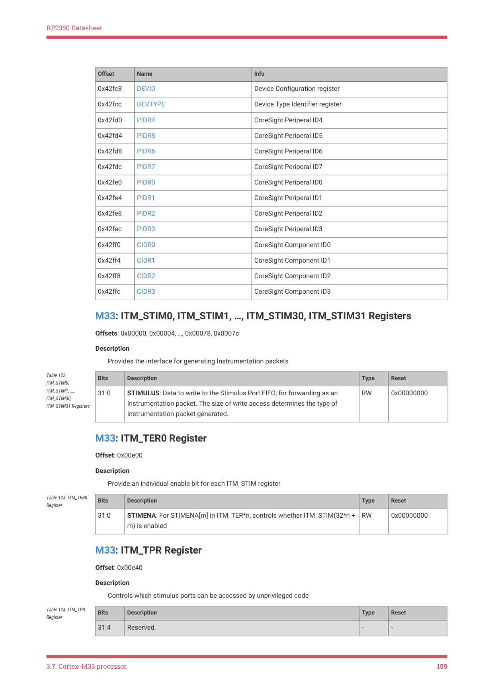

RP2350 Datasheet

| Offset | Name | Info |
| --- | --- | --- |
| 0x42fc8 | DEVID | Device Configuration register |
| 0x42fcc | DEVTYPE | Device Type Identifier register |
| 0x42fd0 | PIDR4 | CoreSight Periperal ID4 |
| 0x42fd4 | PIDR5 | CoreSight Periperal ID5 |
| 0x42fd8 | PIDR6 | CoreSight Periperal ID6 |
| 0x42fdc | PIDR7 | CoreSight Periperal ID7 |
| 0x42fe0 | PIDR0 | CoreSight Periperal ID0 |
| 0x42fe4 | PIDR1 | CoreSight Periperal ID1 |
| 0x42fe8 | PIDR2 | CoreSight Periperal ID2 |
| 0x42fec | PIDR3 | CoreSight Periperal ID3 |
| 0x42ff0 | CIDR0 | CoreSight Component ID0 |
| 0x42ff4 | CIDR1 | CoreSight Component ID1 |
| 0x42ff8 | CIDR2 | CoreSight Component ID2 |
| 0x42ffc | CIDR3 | CoreSight Component ID3 |

M33: ITM_STIM0, ITM_STIM1, …, ITM_STIM30, ITM_STIM31 Registers

Offsets: 0x00000, 0x00004, …, 0x00078, 0x0007c

Description

Provides the interface for generating Instrumentation packets

| Bits | Description | Type | Reset |
| --- | --- | --- | --- |
| 31:0 | STIMULUS: Data to write to the Stimulus Port FIFO, for forwarding as an Instrumentation packet. The size of write access determines the type of Instrumentation packet generated. | RW | 0x00000000 |

Table 122.

ITM_STIM0,

ITM_STIM1, …,

ITM_STIM30,

ITM_STIM31 Registers

M33: ITM_TER0 Register

Offset: 0x00e00

Description

Provide an individual enable bit for each ITM_STIM register

| Bits | Description | Type | Reset |
| --- | --- | --- | --- |
| 31:0 | STIMENA: For STIMENA[m] in ITM_TER*n, controls whether ITM_STIM(32*n + m) is enabled | RW | 0x00000000 |

Table 123. ITM_TER0

M33: ITM_TPR Register

Offset: 0x00e40

Description

Controls which stimulus ports can be accessed by unprivileged code

| Bits | Description | Type | Reset |
| --- | --- | --- | --- |
| 31:4 | Reserved. | - | - |

Table 124. ITM_TPR

3.7. Cortex-M33 processor
159

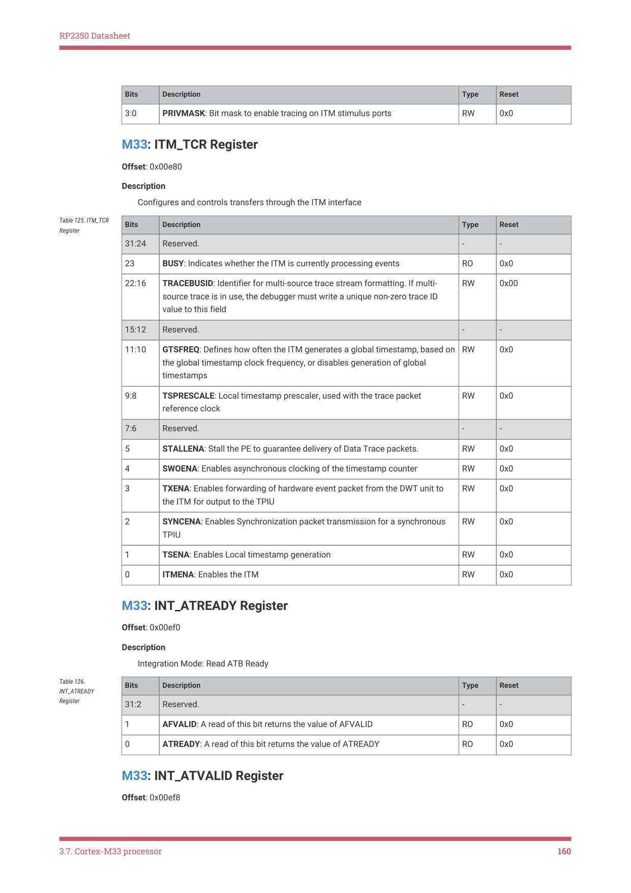

RP2350 Datasheet

| Bits | Description | Type | Reset |
| --- | --- | --- | --- |
| 3:0 | PRIVMASK: Bit mask to enable tracing on ITM stimulus ports | RW | 0x0 |

M33: ITM_TCR Register

Offset: 0x00e80

Description

Configures and controls transfers through the ITM interface

| Bits | Description | Type | Reset |
| --- | --- | --- | --- |
| 31:24 | Reserved. | - | - |
| 23 | BUSY: Indicates whether the ITM is currently processing events | RO | 0x0 |
| 22:16 | TRACEBUSID: Identifier for multi-source trace stream formatting. If multi- source trace is in use, the debugger must write a unique non-zero trace ID value to this field | RW | 0x00 |
| 15:12 | Reserved. | - | - |
| 11:10 | GTSFREQ: Defines how often the ITM generates a global timestamp, based on the global timestamp clock frequency, or disables generation of global timestamps | RW | 0x0 |
| 9:8 | TSPRESCALE: Local timestamp prescaler, used with the trace packet reference clock | RW | 0x0 |
| 7:6 | Reserved. | - | - |
| 5 | STALLENA: Stall the PE to guarantee delivery of Data Trace packets. | RW | 0x0 |
| 4 | SWOENA: Enables asynchronous clocking of the timestamp counter | RW | 0x0 |
| 3 | TXENA: Enables forwarding of hardware event packet from the DWT unit to the ITM for output to the TPIU | RW | 0x0 |
| 2 | SYNCENA: Enables Synchronization packet transmission for a synchronous TPIU | RW | 0x0 |
| 1 | TSENA: Enables Local timestamp generation | RW | 0x0 |
| 0 | ITMENA: Enables the ITM | RW | 0x0 |

Table 125. ITM_TCR

M33: INT_ATREADY Register

Offset: 0x00ef0

Description

Integration Mode: Read ATB Ready

| Bits | Description | Type | Reset |
| --- | --- | --- | --- |
| 31:2 | Reserved. | - | - |
| 1 | AFVALID: A read of this bit returns the value of AFVALID | RO | 0x0 |
| 0 | ATREADY: A read of this bit returns the value of ATREADY | RO | 0x0 |

Table 126.

INT_ATREADY

Register

M33: INT_ATVALID Register

Offset: 0x00ef8

3.7. Cortex-M33 processor
160

RP2350 Datasheet

Description

Integration Mode: Write ATB Valid

| Bits | Description | Type | Reset |
| --- | --- | --- | --- |
| 31:2 | Reserved. | - | - |
| 1 | AFREADY: A write to this bit gives the value of AFREADY | RW | 0x0 |
| 0 | ATREADY: A write to this bit gives the value of ATVALID | RW | 0x0 |

Table 127.

M33: ITM_ITCTRL Register

Offset: 0x00f00

Description

Integration Mode Control Register

| Bits | Description | Type | Reset |
| --- | --- | --- | --- |
| 31:1 | Reserved. | - | - |
| 0 | IME: Integration mode enable bit - The possible values are: 0 - The trace unit is not in integration mode. 1 - The trace unit is in integration mode. This mode enables: A debug agent to perform topology detection. SoC test software to perform integration testing. | RW | 0x0 |

Table 128.

M33: ITM_DEVARCH Register

Offset: 0x00fbc

Description

Provides CoreSight discovery information for the ITM

| Bits | Description | Type | Reset |
| --- | --- | --- | --- |
| 31:21 | ARCHITECT: Defines the architect of the component. Bits [31:28] are the JEP106 continuation code (JEP106 bank ID, minus 1) and bits [27:21] are the JEP106 ID code. | RO | 0x23b |
| 20 | PRESENT: Defines that the DEVARCH register is present | RO | 0x1 |
| 19:16 | REVISION: Defines the architecture revision of the component | RO | 0x0 |
| 15:12 | ARCHVER: Defines the architecture version of the component | RO | 0x1 |
| 11:0 | ARCHPART: Defines the architecture of the component | RO | 0xa01 |

Table 129.

ITM_DEVARCH

Register

M33: ITM_DEVTYPE Register

Offset: 0x00fcc

Description

Provides CoreSight discovery information for the ITM

| Bits | Description | Type | Reset |
| --- | --- | --- | --- |
| 31:8 | Reserved. | - | - |
| 7:4 | SUB: Component sub-type | RO | 0x4 |
| 3:0 | MAJOR: Component major type | RO | 0x3 |

Table 130.

ITM_DEVTYPE

Register

M33: ITM_PIDR4 Register

3.7. Cortex-M33 processor
161

RP2350 Datasheet

Offset: 0x00fd0

Description

Provides CoreSight discovery information for the ITM

| Bits | Description | Type | Reset |
| --- | --- | --- | --- |
| 31:8 | Reserved. | - | - |
| 7:4 | SIZE: See CoreSight Architecture Specification | RO | 0x0 |
| 3:0 | DES_2: See CoreSight Architecture Specification | RO | 0x4 |

Table 131. ITM_PIDR4

M33: ITM_PIDR5 Register

Offset: 0x00fd4

Description

Provides CoreSight discovery information for the ITM

| Bits | Description | Type | Reset |
| --- | --- | --- | --- |
| 31:0 | Reserved. | - | - |

Table 132. ITM_PIDR5

M33: ITM_PIDR6 Register

Offset: 0x00fd8

Description

Provides CoreSight discovery information for the ITM

| Bits | Description | Type | Reset |
| --- | --- | --- | --- |
| 31:0 | Reserved. | - | - |

Table 133. ITM_PIDR6

M33: ITM_PIDR7 Register

Offset: 0x00fdc

Description

Provides CoreSight discovery information for the ITM

| Bits | Description | Type | Reset |
| --- | --- | --- | --- |
| 31:0 | Reserved. | - | - |

Table 134. ITM_PIDR7

M33: ITM_PIDR0 Register

Offset: 0x00fe0

Description

Provides CoreSight discovery information for the ITM

3.7. Cortex-M33 processor
162

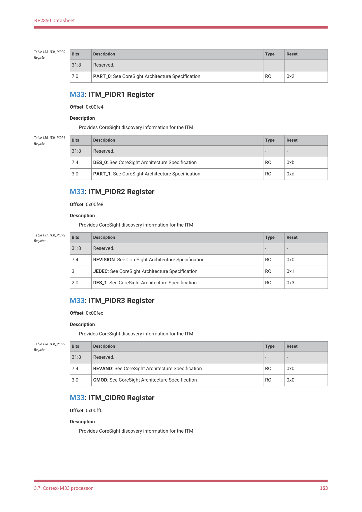

RP2350 Datasheet

| Bits | Description | Type | Reset |
| --- | --- | --- | --- |
| 31:8 | Reserved. | - | - |
| 7:0 | PART_0: See CoreSight Architecture Specification | RO | 0x21 |

Table 135. ITM_PIDR0

M33: ITM_PIDR1 Register

Offset: 0x00fe4

Description

Provides CoreSight discovery information for the ITM

| Bits | Description | Type | Reset |
| --- | --- | --- | --- |
| 31:8 | Reserved. | - | - |
| 7:4 | DES_0: See CoreSight Architecture Specification | RO | 0xb |
| 3:0 | PART_1: See CoreSight Architecture Specification | RO | 0xd |

Table 136. ITM_PIDR1

M33: ITM_PIDR2 Register

Offset: 0x00fe8

Description

Provides CoreSight discovery information for the ITM

| Bits | Description | Type | Reset |
| --- | --- | --- | --- |
| 31:8 | Reserved. | - | - |
| 7:4 | REVISION: See CoreSight Architecture Specification | RO | 0x0 |
| 3 | JEDEC: See CoreSight Architecture Specification | RO | 0x1 |
| 2:0 | DES_1: See CoreSight Architecture Specification | RO | 0x3 |

Table 137. ITM_PIDR2

M33: ITM_PIDR3 Register

Offset: 0x00fec

Description

Provides CoreSight discovery information for the ITM

| Bits | Description | Type | Reset |
| --- | --- | --- | --- |
| 31:8 | Reserved. | - | - |
| 7:4 | REVAND: See CoreSight Architecture Specification | RO | 0x0 |
| 3:0 | CMOD: See CoreSight Architecture Specification | RO | 0x0 |

Table 138. ITM_PIDR3

M33: ITM_CIDR0 Register

Offset: 0x00ff0

Description

Provides CoreSight discovery information for the ITM

3.7. Cortex-M33 processor
163

RP2350 Datasheet

| Bits | Description | Type | Reset |
| --- | --- | --- | --- |
| 31:8 | Reserved. | - | - |
| 7:0 | PRMBL_0: See CoreSight Architecture Specification | RO | 0x0d |

Table 139. ITM_CIDR0

M33: ITM_CIDR1 Register

Offset: 0x00ff4

Description

Provides CoreSight discovery information for the ITM

| Bits | Description | Type | Reset |
| --- | --- | --- | --- |
| 31:8 | Reserved. | - | - |
| 7:4 | CLASS: See CoreSight Architecture Specification | RO | 0x9 |
| 3:0 | PRMBL_1: See CoreSight Architecture Specification | RO | 0x0 |

Table 140. ITM_CIDR1

M33: ITM_CIDR2 Register

Offset: 0x00ff8

Description

Provides CoreSight discovery information for the ITM

| Bits | Description | Type | Reset |
| --- | --- | --- | --- |
| 31:8 | Reserved. | - | - |
| 7:0 | PRMBL_2: See CoreSight Architecture Specification | RO | 0x05 |

Table 141. ITM_CIDR2

M33: ITM_CIDR3 Register

Offset: 0x00ffc

Description

Provides CoreSight discovery information for the ITM

| Bits | Description | Type | Reset |
| --- | --- | --- | --- |
| 31:8 | Reserved. | - | - |
| 7:0 | PRMBL_3: See CoreSight Architecture Specification | RO | 0xb1 |

Table 142. ITM_CIDR3

M33: DWT_CTRL Register

Offset: 0x01000

Description

Provides configuration and status information for the DWT unit, and used to control features of the unit

| Bits | Description | Type | Reset |
| --- | --- | --- | --- |
| 31:28 | NUMCOMP: Number of DWT comparators implemented | RO | 0x7 |
| 27 | NOTRCPKT: Indicates whether the implementation does not support trace | RO | 0x0 |
| 26 | NOEXTTRIG: Reserved, RAZ | RO | 0x0 |
| 25 | NOCYCCNT: Indicates whether the implementation does not include a cycle counter | RO | 0x1 |

Table 143. DWT_CTRL

3.7. Cortex-M33 processor
164

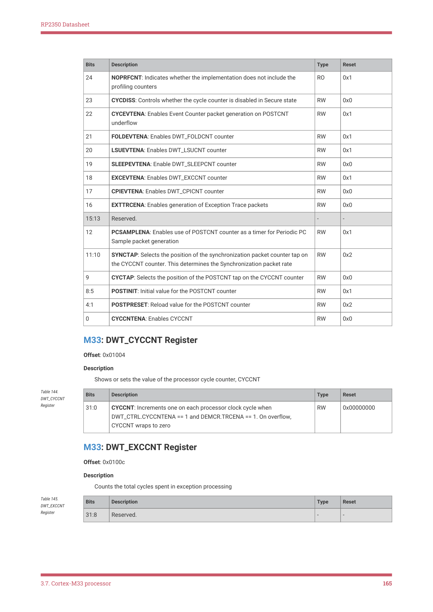

RP2350 Datasheet

| Bits | Description | Type | Reset |
| --- | --- | --- | --- |
| 24 | NOPRFCNT: Indicates whether the implementation does not include the profiling counters | RO | 0x1 |
| 23 | CYCDISS: Controls whether the cycle counter is disabled in Secure state | RW | 0x0 |
| 22 | CYCEVTENA: Enables Event Counter packet generation on POSTCNT underflow | RW | 0x1 |
| 21 | FOLDEVTENA: Enables DWT_FOLDCNT counter | RW | 0x1 |
| 20 | LSUEVTENA: Enables DWT_LSUCNT counter | RW | 0x1 |
| 19 | SLEEPEVTENA: Enable DWT_SLEEPCNT counter | RW | 0x0 |
| 18 | EXCEVTENA: Enables DWT_EXCCNT counter | RW | 0x1 |
| 17 | CPIEVTENA: Enables DWT_CPICNT counter | RW | 0x0 |
| 16 | EXTTRCENA: Enables generation of Exception Trace packets | RW | 0x0 |
| 15:13 | Reserved. | - | - |
| 12 | PCSAMPLENA: Enables use of POSTCNT counter as a timer for Periodic PC Sample packet generation | RW | 0x1 |
| 11:10 | SYNCTAP: Selects the position of the synchronization packet counter tap on the CYCCNT counter. This determines the Synchronization packet rate | RW | 0x2 |
| 9 | CYCTAP: Selects the position of the POSTCNT tap on the CYCCNT counter | RW | 0x0 |
| 8:5 | POSTINIT: Initial value for the POSTCNT counter | RW | 0x1 |
| 4:1 | POSTPRESET: Reload value for the POSTCNT counter | RW | 0x2 |
| 0 | CYCCNTENA: Enables CYCCNT | RW | 0x0 |

M33: DWT_CYCCNT Register

Offset: 0x01004

Description

Shows or sets the value of the processor cycle counter, CYCCNT

| Bits | Description | Type | Reset |
| --- | --- | --- | --- |
| 31:0 | CYCCNT: Increments one on each processor clock cycle when DWT_CTRL.CYCCNTENA == 1 and DEMCR.TRCENA == 1. On overflow, CYCCNT wraps to zero | RW | 0x00000000 |

Table 144.

DWT_CYCCNT

Register

M33: DWT_EXCCNT Register

Offset: 0x0100c

Description

Counts the total cycles spent in exception processing

| Bits | Description | Type | Reset |
| --- | --- | --- | --- |
| 31:8 | Reserved. | - | - |

Table 145.

DWT_EXCCNT

Register

3.7. Cortex-M33 processor
165

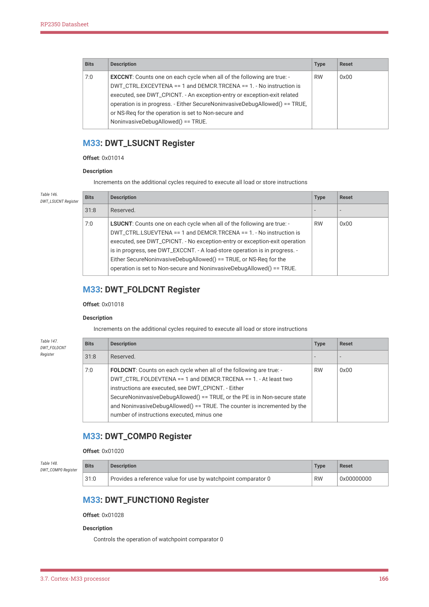

RP2350 Datasheet

| Bits | Description | Type | Reset |
| --- | --- | --- | --- |
| 7:0 | EXCCNT: Counts one on each cycle when all of the following are true: - DWT_CTRL.EXCEVTENA == 1 and DEMCR.TRCENA == 1. - No instruction is executed, see DWT_CPICNT. - An exception-entry or exception-exit related operation is in progress. - Either SecureNoninvasiveDebugAllowed() == TRUE, or NS-Req for the operation is set to Non-secure and NoninvasiveDebugAllowed() == TRUE. | RW | 0x00 |

M33: DWT_LSUCNT Register

Offset: 0x01014

Description

Increments on the additional cycles required to execute all load or store instructions

| Bits | Description | Type | Reset |
| --- | --- | --- | --- |
| 31:8 | Reserved. | - | - |
| 7:0 | LSUCNT: Counts one on each cycle when all of the following are true: - DWT_CTRL.LSUEVTENA == 1 and DEMCR.TRCENA == 1. - No instruction is executed, see DWT_CPICNT. - No exception-entry or exception-exit operation is in progress, see DWT_EXCCNT. - A load-store operation is in progress. - Either SecureNoninvasiveDebugAllowed() == TRUE, or NS-Req for the operation is set to Non-secure and NoninvasiveDebugAllowed() == TRUE. | RW | 0x00 |

Table 146.

M33: DWT_FOLDCNT Register

Offset: 0x01018

Description

Increments on the additional cycles required to execute all load or store instructions

| Bits | Description | Type | Reset |
| --- | --- | --- | --- |
| 31:8 | Reserved. | - | - |
| 7:0 | FOLDCNT: Counts on each cycle when all of the following are true: - DWT_CTRL.FOLDEVTENA == 1 and DEMCR.TRCENA == 1. - At least two instructions are executed, see DWT_CPICNT. - Either SecureNoninvasiveDebugAllowed() == TRUE, or the PE is in Non-secure state and NoninvasiveDebugAllowed() == TRUE. The counter is incremented by the number of instructions executed, minus one | RW | 0x00 |

Table 147.

DWT_FOLDCNT

Register

M33: DWT_COMP0 Register

Offset: 0x01020

| Bits | Description | Type | Reset |
| --- | --- | --- | --- |
| 31:0 | Provides a reference value for use by watchpoint comparator 0 | RW | 0x00000000 |

Table 148.

M33: DWT_FUNCTION0 Register

Offset: 0x01028

Description

Controls the operation of watchpoint comparator 0

3.7. Cortex-M33 processor
166

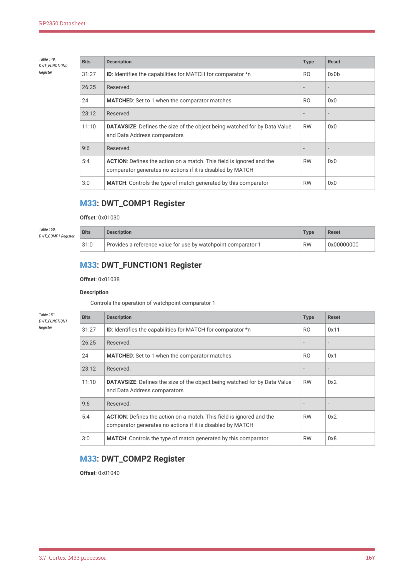

RP2350 Datasheet

| Bits | Description | Type | Reset |
| --- | --- | --- | --- |
| 31:27 | ID: Identifies the capabilities for MATCH for comparator *n | RO | 0x0b |
| 26:25 | Reserved. | - | - |
| 24 | MATCHED: Set to 1 when the comparator matches | RO | 0x0 |
| 23:12 | Reserved. | - | - |
| 11:10 | DATAVSIZE: Defines the size of the object being watched for by Data Value and Data Address comparators | RW | 0x0 |
| 9:6 | Reserved. | - | - |
| 5:4 | ACTION: Defines the action on a match. This field is ignored and the comparator generates no actions if it is disabled by MATCH | RW | 0x0 |
| 3:0 | MATCH: Controls the type of match generated by this comparator | RW | 0x0 |

Table 149.

DWT_FUNCTION0

Register

M33: DWT_COMP1 Register

Offset: 0x01030

| Bits | Description | Type | Reset |
| --- | --- | --- | --- |
| 31:0 | Provides a reference value for use by watchpoint comparator 1 | RW | 0x00000000 |

Table 150.

M33: DWT_FUNCTION1 Register

Offset: 0x01038

Description

Controls the operation of watchpoint comparator 1

| Bits | Description | Type | Reset |
| --- | --- | --- | --- |
| 31:27 | ID: Identifies the capabilities for MATCH for comparator *n | RO | 0x11 |
| 26:25 | Reserved. | - | - |
| 24 | MATCHED: Set to 1 when the comparator matches | RO | 0x1 |
| 23:12 | Reserved. | - | - |
| 11:10 | DATAVSIZE: Defines the size of the object being watched for by Data Value and Data Address comparators | RW | 0x2 |
| 9:6 | Reserved. | - | - |
| 5:4 | ACTION: Defines the action on a match. This field is ignored and the comparator generates no actions if it is disabled by MATCH | RW | 0x2 |
| 3:0 | MATCH: Controls the type of match generated by this comparator | RW | 0x8 |

Table 151.

DWT_FUNCTION1

Register

M33: DWT_COMP2 Register

Offset: 0x01040

3.7. Cortex-M33 processor
167

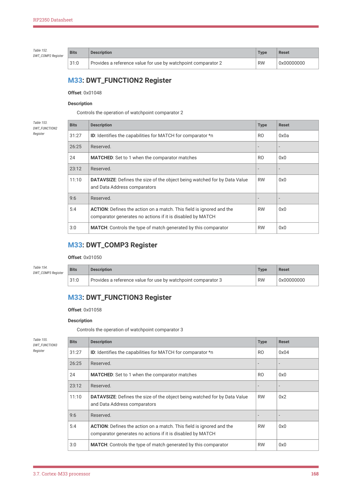

RP2350 Datasheet

| Bits | Description | Type | Reset |
| --- | --- | --- | --- |
| 31:0 | Provides a reference value for use by watchpoint comparator 2 | RW | 0x00000000 |

Table 152.

M33: DWT_FUNCTION2 Register

Offset: 0x01048

Description

Controls the operation of watchpoint comparator 2

| Bits | Description | Type | Reset |
| --- | --- | --- | --- |
| 31:27 | ID: Identifies the capabilities for MATCH for comparator *n | RO | 0x0a |
| 26:25 | Reserved. | - | - |
| 24 | MATCHED: Set to 1 when the comparator matches | RO | 0x0 |
| 23:12 | Reserved. | - | - |
| 11:10 | DATAVSIZE: Defines the size of the object being watched for by Data Value and Data Address comparators | RW | 0x0 |
| 9:6 | Reserved. | - | - |
| 5:4 | ACTION: Defines the action on a match. This field is ignored and the comparator generates no actions if it is disabled by MATCH | RW | 0x0 |
| 3:0 | MATCH: Controls the type of match generated by this comparator | RW | 0x0 |

Table 153.

DWT_FUNCTION2

Register

M33: DWT_COMP3 Register

Offset: 0x01050

| Bits | Description | Type | Reset |
| --- | --- | --- | --- |
| 31:0 | Provides a reference value for use by watchpoint comparator 3 | RW | 0x00000000 |

Table 154.

M33: DWT_FUNCTION3 Register

Offset: 0x01058

Description

Controls the operation of watchpoint comparator 3

| Bits | Description | Type | Reset |
| --- | --- | --- | --- |
| 31:27 | ID: Identifies the capabilities for MATCH for comparator *n | RO | 0x04 |
| 26:25 | Reserved. | - | - |
| 24 | MATCHED: Set to 1 when the comparator matches | RO | 0x0 |
| 23:12 | Reserved. | - | - |
| 11:10 | DATAVSIZE: Defines the size of the object being watched for by Data Value and Data Address comparators | RW | 0x2 |
| 9:6 | Reserved. | - | - |
| 5:4 | ACTION: Defines the action on a match. This field is ignored and the comparator generates no actions if it is disabled by MATCH | RW | 0x0 |
| 3:0 | MATCH: Controls the type of match generated by this comparator | RW | 0x0 |

Table 155.

DWT_FUNCTION3

Register

3.7. Cortex-M33 processor
168

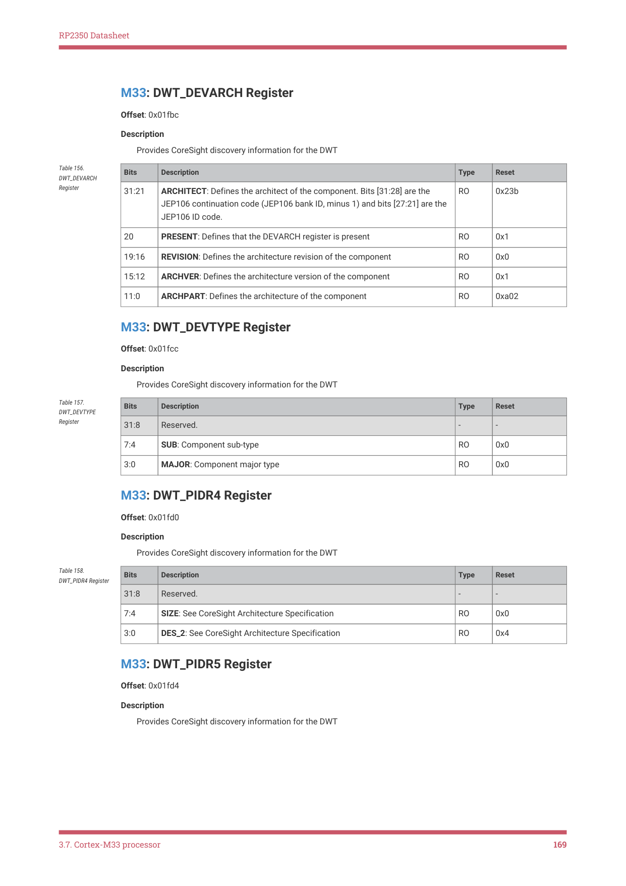

RP2350 Datasheet

M33: DWT_DEVARCH Register

Offset: 0x01fbc

Description

Provides CoreSight discovery information for the DWT

| Bits | Description | Type | Reset |
| --- | --- | --- | --- |
| 31:21 | ARCHITECT: Defines the architect of the component. Bits [31:28] are the JEP106 continuation code (JEP106 bank ID, minus 1) and bits [27:21] are the JEP106 ID code. | RO | 0x23b |
| 20 | PRESENT: Defines that the DEVARCH register is present | RO | 0x1 |
| 19:16 | REVISION: Defines the architecture revision of the component | RO | 0x0 |
| 15:12 | ARCHVER: Defines the architecture version of the component | RO | 0x1 |
| 11:0 | ARCHPART: Defines the architecture of the component | RO | 0xa02 |

Table 156.

DWT_DEVARCH

Register

M33: DWT_DEVTYPE Register

Offset: 0x01fcc

Description

Provides CoreSight discovery information for the DWT

| Bits | Description | Type | Reset |
| --- | --- | --- | --- |
| 31:8 | Reserved. | - | - |
| 7:4 | SUB: Component sub-type | RO | 0x0 |
| 3:0 | MAJOR: Component major type | RO | 0x0 |

Table 157.

DWT_DEVTYPE

Register

M33: DWT_PIDR4 Register

Offset: 0x01fd0

Description

Provides CoreSight discovery information for the DWT

| Bits | Description | Type | Reset |
| --- | --- | --- | --- |
| 31:8 | Reserved. | - | - |
| 7:4 | SIZE: See CoreSight Architecture Specification | RO | 0x0 |
| 3:0 | DES_2: See CoreSight Architecture Specification | RO | 0x4 |

Table 158.

M33: DWT_PIDR5 Register

Offset: 0x01fd4

Description

Provides CoreSight discovery information for the DWT

3.7. Cortex-M33 processor
169

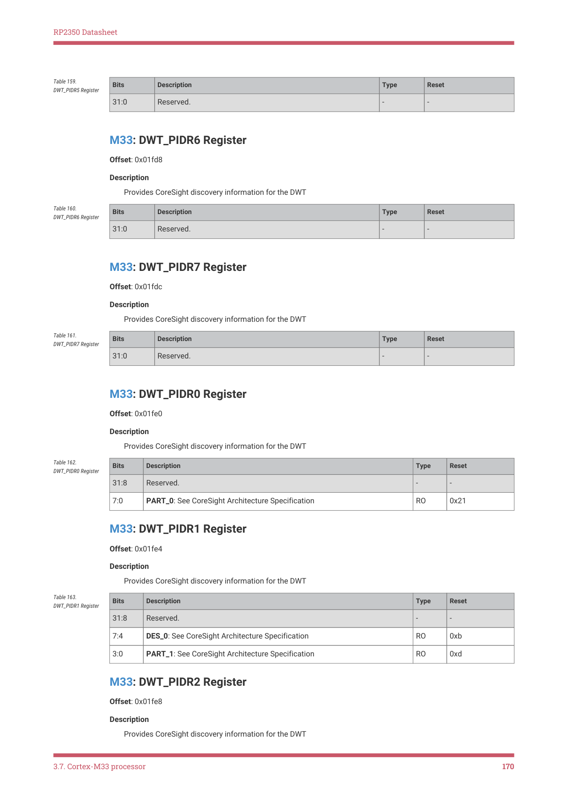

RP2350 Datasheet

| Bits | Description | Type | Reset |
| --- | --- | --- | --- |
| 31:0 | Reserved. | - | - |

Table 159.

M33: DWT_PIDR6 Register

Offset: 0x01fd8

Description

Provides CoreSight discovery information for the DWT

| Bits | Description | Type | Reset |
| --- | --- | --- | --- |
| 31:0 | Reserved. | - | - |

Table 160.

M33: DWT_PIDR7 Register

Offset: 0x01fdc

Description

Provides CoreSight discovery information for the DWT

| Bits | Description | Type | Reset |
| --- | --- | --- | --- |
| 31:0 | Reserved. | - | - |

Table 161.

M33: DWT_PIDR0 Register

Offset: 0x01fe0

Description

Provides CoreSight discovery information for the DWT

| Bits | Description | Type | Reset |
| --- | --- | --- | --- |
| 31:8 | Reserved. | - | - |
| 7:0 | PART_0: See CoreSight Architecture Specification | RO | 0x21 |

Table 162.

M33: DWT_PIDR1 Register

Offset: 0x01fe4

Description

Provides CoreSight discovery information for the DWT

| Bits | Description | Type | Reset |
| --- | --- | --- | --- |
| 31:8 | Reserved. | - | - |
| 7:4 | DES_0: See CoreSight Architecture Specification | RO | 0xb |
| 3:0 | PART_1: See CoreSight Architecture Specification | RO | 0xd |

Table 163.

M33: DWT_PIDR2 Register

Offset: 0x01fe8

Description

Provides CoreSight discovery information for the DWT

3.7. Cortex-M33 processor
170

RP2350 Datasheet

| Bits | Description | Type | Reset |
| --- | --- | --- | --- |
| 31:8 | Reserved. | - | - |
| 7:4 | REVISION: See CoreSight Architecture Specification | RO | 0x0 |
| 3 | JEDEC: See CoreSight Architecture Specification | RO | 0x1 |
| 2:0 | DES_1: See CoreSight Architecture Specification | RO | 0x3 |

Table 164.

M33: DWT_PIDR3 Register

Offset: 0x01fec

Description

Provides CoreSight discovery information for the DWT

| Bits | Description | Type | Reset |
| --- | --- | --- | --- |
| 31:8 | Reserved. | - | - |
| 7:4 | REVAND: See CoreSight Architecture Specification | RO | 0x0 |
| 3:0 | CMOD: See CoreSight Architecture Specification | RO | 0x0 |

Table 165.

M33: DWT_CIDR0 Register

Offset: 0x01ff0

Description

Provides CoreSight discovery information for the DWT

| Bits | Description | Type | Reset |
| --- | --- | --- | --- |
| 31:8 | Reserved. | - | - |
| 7:0 | PRMBL_0: See CoreSight Architecture Specification | RO | 0x0d |

Table 166.

M33: DWT_CIDR1 Register

Offset: 0x01ff4

Description

Provides CoreSight discovery information for the DWT

| Bits | Description | Type | Reset |
| --- | --- | --- | --- |
| 31:8 | Reserved. | - | - |
| 7:4 | CLASS: See CoreSight Architecture Specification | RO | 0x9 |
| 3:0 | PRMBL_1: See CoreSight Architecture Specification | RO | 0x0 |

Table 167.

M33: DWT_CIDR2 Register

Offset: 0x01ff8

Description

Provides CoreSight discovery information for the DWT

3.7. Cortex-M33 processor
171

RP2350 Datasheet

| Bits | Description | Type | Reset |
| --- | --- | --- | --- |
| 31:8 | Reserved. | - | - |
| 7:0 | PRMBL_2: See CoreSight Architecture Specification | RO | 0x05 |

Table 168.

M33: DWT_CIDR3 Register

Offset: 0x01ffc

Description

Provides CoreSight discovery information for the DWT

| Bits | Description | Type | Reset |
| --- | --- | --- | --- |
| 31:8 | Reserved. | - | - |
| 7:0 | PRMBL_3: See CoreSight Architecture Specification | RO | 0xb1 |

Table 169.

M33: FP_CTRL Register

Offset: 0x02000

Description

Provides FPB implementation information, and the global enable for the FPB unit

| Bits | Description | Type | Reset |
| --- | --- | --- | --- |
| 31:28 | REV: Flash Patch and Breakpoint Unit architecture revision | RO | 0x6 |
| 27:15 | Reserved. | - | - |
| 14:12 | NUM_CODE_14_12_: Indicates the number of implemented instruction address comparators. Zero indicates no Instruction Address comparators are implemented. The Instruction Address comparators are numbered from 0 to NUM_CODE - 1 | RO | 0x5 |
| 11:8 | NUM_LIT: Indicates the number of implemented literal address comparators. The Literal Address comparators are numbered from NUM_CODE to NUM_CODE + NUM_LIT - 1 | RO | 0x5 |
| 7:4 | NUM_CODE_7_4_: Indicates the number of implemented instruction address comparators. Zero indicates no Instruction Address comparators are implemented. The Instruction Address comparators are numbered from 0 to NUM_CODE - 1 | RO | 0x8 |
| 3:2 | Reserved. | - | - |
| 1 | KEY: Writes to the FP_CTRL are ignored unless KEY is concurrently written to one | RW | 0x0 |
| 0 | ENABLE: Enables the FPB | RW | 0x0 |

Table 170. FP_CTRL

M33: FP_REMAP Register

Offset: 0x02004

Description

Indicates whether the implementation supports Flash Patch remap and, if it does, holds the target address for

remap

| Bits | Description | Type | Reset |
| --- | --- | --- | --- |
| 31:30 | Reserved. | - | - |

Table 171. FP_REMAP

3.7. Cortex-M33 processor
172

RP2350 Datasheet

| Bits | Description | Type | Reset |
| --- | --- | --- | --- |
| 29 | RMPSPT: Indicates whether the FPB unit supports the Flash Patch remap function | RO | 0x0 |
| 28:5 | REMAP: Holds the bits[28:5] of the Flash Patch remap address | RO | 0x000000 |
| 4:0 | Reserved. | - | - |

M33: FP_COMP0, FP_COMP1, …, FP_COMP6, FP_COMP7 Registers

Offsets: 0x02008, 0x0200c, …, 0x02020, 0x02024

Description

Holds an address for comparison. The effect of the match depends on the configuration of the FPB and whether

the comparator is an instruction address comparator or a literal address comparator

| Bits | Description | Type | Reset |
| --- | --- | --- | --- |
| 31:1 | Reserved. | - | - |
| 0 | BE: Selects between flashpatch and breakpoint functionality | RW | 0x0 |

Table 172. FP_COMP0,

FP_COMP1, …,

FP_COMP6,

FP_COMP7 Registers

M33: FP_DEVARCH Register

Offset: 0x02fbc

Description

Provides CoreSight discovery information for the FPB

| Bits | Description | Type | Reset |
| --- | --- | --- | --- |
| 31:21 | ARCHITECT: Defines the architect of the component. Bits [31:28] are the JEP106 continuation code (JEP106 bank ID, minus 1) and bits [27:21] are the JEP106 ID code. | RO | 0x23b |
| 20 | PRESENT: Defines that the DEVARCH register is present | RO | 0x1 |
| 19:16 | REVISION: Defines the architecture revision of the component | RO | 0x0 |
| 15:12 | ARCHVER: Defines the architecture version of the component | RO | 0x1 |
| 11:0 | ARCHPART: Defines the architecture of the component | RO | 0xa03 |

Table 173.

M33: FP_DEVTYPE Register

Offset: 0x02fcc

Description

Provides CoreSight discovery information for the FPB

| Bits | Description | Type | Reset |
| --- | --- | --- | --- |
| 31:8 | Reserved. | - | - |
| 7:4 | SUB: Component sub-type | RO | 0x0 |
| 3:0 | MAJOR: Component major type | RO | 0x0 |

Table 174.

M33: FP_PIDR4 Register

Offset: 0x02fd0

3.7. Cortex-M33 processor
173

RP2350 Datasheet

Description

Provides CoreSight discovery information for the FP

| Bits | Description | Type | Reset |
| --- | --- | --- | --- |
| 31:8 | Reserved. | - | - |
| 7:4 | SIZE: See CoreSight Architecture Specification | RO | 0x0 |
| 3:0 | DES_2: See CoreSight Architecture Specification | RO | 0x4 |

Table 175. FP_PIDR4

M33: FP_PIDR5 Register

Offset: 0x02fd4

Description

Provides CoreSight discovery information for the FP

| Bits | Description | Type | Reset |
| --- | --- | --- | --- |
| 31:0 | Reserved. | - | - |

Table 176. FP_PIDR5

M33: FP_PIDR6 Register

Offset: 0x02fd8

Description

Provides CoreSight discovery information for the FP

| Bits | Description | Type | Reset |
| --- | --- | --- | --- |
| 31:0 | Reserved. | - | - |

Table 177. FP_PIDR6

M33: FP_PIDR7 Register

Offset: 0x02fdc

Description

Provides CoreSight discovery information for the FP

| Bits | Description | Type | Reset |
| --- | --- | --- | --- |
| 31:0 | Reserved. | - | - |

Table 178. FP_PIDR7

M33: FP_PIDR0 Register

Offset: 0x02fe0

Description

Provides CoreSight discovery information for the FP

3.7. Cortex-M33 processor
174

RP2350 Datasheet

| Bits | Description | Type | Reset |
| --- | --- | --- | --- |
| 31:8 | Reserved. | - | - |
| 7:0 | PART_0: See CoreSight Architecture Specification | RO | 0x21 |

Table 179. FP_PIDR0

M33: FP_PIDR1 Register

Offset: 0x02fe4

Description

Provides CoreSight discovery information for the FP

| Bits | Description | Type | Reset |
| --- | --- | --- | --- |
| 31:8 | Reserved. | - | - |
| 7:4 | DES_0: See CoreSight Architecture Specification | RO | 0xb |
| 3:0 | PART_1: See CoreSight Architecture Specification | RO | 0xd |

Table 180. FP_PIDR1

M33: FP_PIDR2 Register

Offset: 0x02fe8

Description

Provides CoreSight discovery information for the FP

| Bits | Description | Type | Reset |
| --- | --- | --- | --- |
| 31:8 | Reserved. | - | - |
| 7:4 | REVISION: See CoreSight Architecture Specification | RO | 0x0 |
| 3 | JEDEC: See CoreSight Architecture Specification | RO | 0x1 |
| 2:0 | DES_1: See CoreSight Architecture Specification | RO | 0x3 |

Table 181. FP_PIDR2

M33: FP_PIDR3 Register

Offset: 0x02fec

Description

Provides CoreSight discovery information for the FP

| Bits | Description | Type | Reset |
| --- | --- | --- | --- |
| 31:8 | Reserved. | - | - |
| 7:4 | REVAND: See CoreSight Architecture Specification | RO | 0x0 |
| 3:0 | CMOD: See CoreSight Architecture Specification | RO | 0x0 |

Table 182. FP_PIDR3

M33: FP_CIDR0 Register

Offset: 0x02ff0

Description

Provides CoreSight discovery information for the FP

3.7. Cortex-M33 processor
175

RP2350 Datasheet

| Bits | Description | Type | Reset |
| --- | --- | --- | --- |
| 31:8 | Reserved. | - | - |
| 7:0 | PRMBL_0: See CoreSight Architecture Specification | RO | 0x0d |

Table 183. FP_CIDR0

M33: FP_CIDR1 Register

Offset: 0x02ff4

Description

Provides CoreSight discovery information for the FP

| Bits | Description | Type | Reset |
| --- | --- | --- | --- |
| 31:8 | Reserved. | - | - |
| 7:4 | CLASS: See CoreSight Architecture Specification | RO | 0x9 |
| 3:0 | PRMBL_1: See CoreSight Architecture Specification | RO | 0x0 |

Table 184. FP_CIDR1

M33: FP_CIDR2 Register

Offset: 0x02ff8

Description

Provides CoreSight discovery information for the FP

| Bits | Description | Type | Reset |
| --- | --- | --- | --- |
| 31:8 | Reserved. | - | - |
| 7:0 | PRMBL_2: See CoreSight Architecture Specification | RO | 0x05 |

Table 185. FP_CIDR2

M33: FP_CIDR3 Register

Offset: 0x02ffc

Description

Provides CoreSight discovery information for the FP

| Bits | Description | Type | Reset |
| --- | --- | --- | --- |
| 31:8 | Reserved. | - | - |
| 7:0 | PRMBL_3: See CoreSight Architecture Specification | RO | 0xb1 |

Table 186. FP_CIDR3

M33: ICTR Register

Offset: 0x0e004

Description

Provides information about the interrupt controller

3.7. Cortex-M33 processor
176

RP2350 Datasheet

| Bits | Description | Type | Reset |
| --- | --- | --- | --- |
| 31:4 | Reserved. | - | - |
| 3:0 | INTLINESNUM: Indicates the number of the highest implemented register in each of the NVIC control register sets, or in the case of NVIC_IPR*n, 4×INTLINESNUM | RO | 0x1 |

Table 187. ICTR

M33: ACTLR Register

Offset: 0x0e008

Description

Provides IMPLEMENTATION DEFINED configuration and control options

| Bits | Description | Type | Reset |
| --- | --- | --- | --- |
| 31:30 | Reserved. | - | - |
| 29 | EXTEXCLALL: External Exclusives Allowed with no MPU | RW | 0x0 |
| 28:13 | Reserved. | - | - |
| 12 | DISITMATBFLUSH: Disable ATB Flush | RW | 0x0 |
| 11 | Reserved. | - | - |
| 10 | FPEXCODIS: Disable FPU exception outputs | RW | 0x0 |
| 9 | DISOOFP: Disable out-of-order FP instruction completion | RW | 0x0 |
| 8:3 | Reserved. | - | - |
| 2 | DISFOLD: Disable dual-issue. | RW | 0x0 |
| 1 | Reserved. | - | - |
| 0 | DISMCYCINT: Disable dual-issue. | RW | 0x0 |

Table 188. ACTLR

M33: SYST_CSR Register

Offset: 0x0e010

Description

Use the SysTick Control and Status Register to enable the SysTick features.

| Bits | Description | Type | Reset |
| --- | --- | --- | --- |
| 31:17 | Reserved. | - | - |
| 16 | COUNTFLAG: Returns 1 if timer counted to 0 since last time this was read. Clears on read by application or debugger. | RO | 0x0 |
| 15:3 | Reserved. | - | - |
| 2 | CLKSOURCE: SysTick clock source. Always reads as one if SYST_CALIB reports NOREF. Selects the SysTick timer clock source: 0 = External reference clock. 1 = Processor clock. | RW | 0x0 |
| 1 | TICKINT: Enables SysTick exception request: 0 = Counting down to zero does not assert the SysTick exception request. 1 = Counting down to zero to asserts the SysTick exception request. | RW | 0x0 |

Table 189. SYST_CSR

3.7. Cortex-M33 processor
177

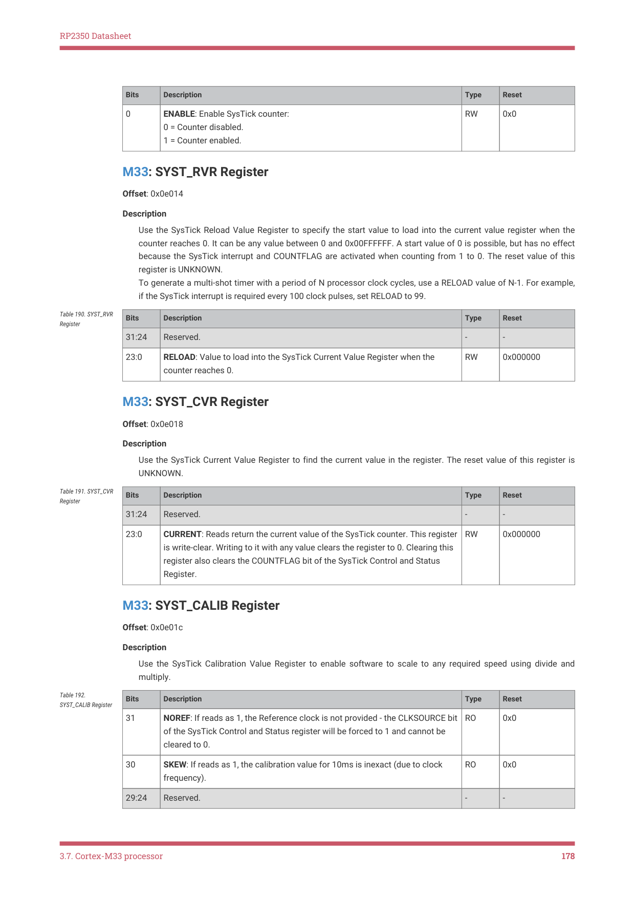

RP2350 Datasheet

| Bits | Description | Type | Reset |
| --- | --- | --- | --- |
| 0 | ENABLE: Enable SysTick counter: 0 = Counter disabled. 1 = Counter enabled. | RW | 0x0 |

M33: SYST_RVR Register

Offset: 0x0e014

Description

Use the SysTick Reload Value Register to specify the start value to load into the current value register when the

counter reaches 0. It can be any value between 0 and 0x00FFFFFF. A start value of 0 is possible, but has no effect

because the SysTick interrupt and COUNTFLAG are activated when counting from 1 to 0. The reset value of this

register is UNKNOWN.

To generate a multi-shot timer with a period of N processor clock cycles, use a RELOAD value of N-1. For example,

if the SysTick interrupt is required every 100 clock pulses, set RELOAD to 99.

| Bits | Description | Type | Reset |
| --- | --- | --- | --- |
| 31:24 | Reserved. | - | - |
| 23:0 | RELOAD: Value to load into the SysTick Current Value Register when the counter reaches 0. | RW | 0x000000 |

Table 190. SYST_RVR

M33: SYST_CVR Register

Offset: 0x0e018

Description

Use the SysTick Current Value Register to find the current value in the register. The reset value of this register is

UNKNOWN.

| Bits | Description | Type | Reset |
| --- | --- | --- | --- |
| 31:24 | Reserved. | - | - |
| 23:0 | CURRENT: Reads return the current value of the SysTick counter. This register is write-clear. Writing to it with any value clears the register to 0. Clearing this register also clears the COUNTFLAG bit of the SysTick Control and Status Register. | RW | 0x000000 |

Table 191. SYST_CVR

M33: SYST_CALIB Register

Offset: 0x0e01c

Description

Use the SysTick Calibration Value Register to enable software to scale to any required speed using divide and

multiply.

| Bits | Description | Type | Reset |
| --- | --- | --- | --- |
| 31 | NOREF: If reads as 1, the Reference clock is not provided - the CLKSOURCE bit of the SysTick Control and Status register will be forced to 1 and cannot be cleared to 0. | RO | 0x0 |
| 30 | SKEW: If reads as 1, the calibration value for 10ms is inexact (due to clock frequency). | RO | 0x0 |
| 29:24 | Reserved. | - | - |

Table 192.

3.7. Cortex-M33 processor
178

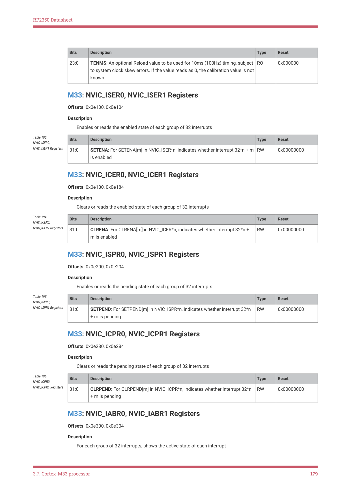

RP2350 Datasheet

| Bits | Description | Type | Reset |
| --- | --- | --- | --- |
| 23:0 | TENMS: An optional Reload value to be used for 10ms (100Hz) timing, subject to system clock skew errors. If the value reads as 0, the calibration value is not known. | RO | 0x000000 |

M33: NVIC_ISER0, NVIC_ISER1 Registers

Offsets: 0x0e100, 0x0e104

Description

Enables or reads the enabled state of each group of 32 interrupts

| Bits | Description | Type | Reset |
| --- | --- | --- | --- |
| 31:0 | SETENA: For SETENA[m] in NVIC_ISER*n, indicates whether interrupt 32*n + m is enabled | RW | 0x00000000 |

Table 193.

NVIC_ISER0,

NVIC_ISER1 Registers

M33: NVIC_ICER0, NVIC_ICER1 Registers

Offsets: 0x0e180, 0x0e184

Description

Clears or reads the enabled state of each group of 32 interrupts

| Bits | Description | Type | Reset |
| --- | --- | --- | --- |
| 31:0 | CLRENA: For CLRENA[m] in NVIC_ICER*n, indicates whether interrupt 32*n + m is enabled | RW | 0x00000000 |

Table 194.

NVIC_ICER0,

NVIC_ICER1 Registers

M33: NVIC_ISPR0, NVIC_ISPR1 Registers

Offsets: 0x0e200, 0x0e204

Description

Enables or reads the pending state of each group of 32 interrupts

| Bits | Description | Type | Reset |
| --- | --- | --- | --- |
| 31:0 | SETPEND: For SETPEND[m] in NVIC_ISPR*n, indicates whether interrupt 32*n + m is pending | RW | 0x00000000 |

Table 195.

NVIC_ISPR0,

NVIC_ISPR1 Registers

M33: NVIC_ICPR0, NVIC_ICPR1 Registers

Offsets: 0x0e280, 0x0e284

Description

Clears or reads the pending state of each group of 32 interrupts

| Bits | Description | Type | Reset |
| --- | --- | --- | --- |
| 31:0 | CLRPEND: For CLRPEND[m] in NVIC_ICPR*n, indicates whether interrupt 32*n + m is pending | RW | 0x00000000 |

Table 196.

NVIC_ICPR0,

NVIC_ICPR1 Registers

M33: NVIC_IABR0, NVIC_IABR1 Registers

Offsets: 0x0e300, 0x0e304

Description

For each group of 32 interrupts, shows the active state of each interrupt

3.7. Cortex-M33 processor
179

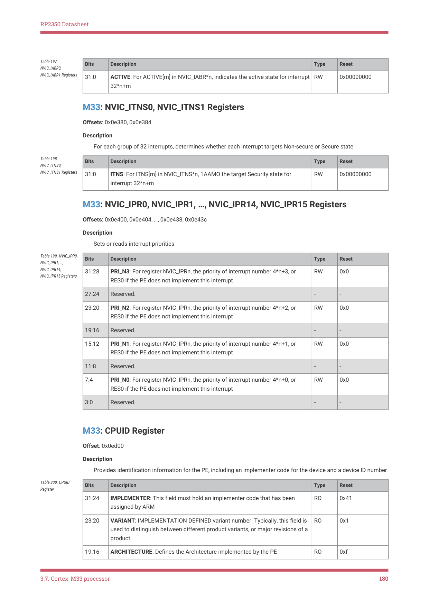

RP2350 Datasheet

| Bits | Description | Type | Reset |
| --- | --- | --- | --- |
| 31:0 | ACTIVE: For ACTIVE[m] in NVIC_IABR*n, indicates the active state for interrupt 32*n+m | RW | 0x00000000 |

Table 197.

NVIC_IABR0,

NVIC_IABR1 Registers

M33: NVIC_ITNS0, NVIC_ITNS1 Registers

Offsets: 0x0e380, 0x0e384

Description

For each group of 32 interrupts, determines whether each interrupt targets Non-secure or Secure state

| Bits | Description | Type | Reset |
| --- | --- | --- | --- |
| 31:0 | ITNS: For ITNS[m] in NVIC_ITNS*n, `IAAMO the target Security state for interrupt 32*n+m | RW | 0x00000000 |

Table 198.

NVIC_ITNS0,

NVIC_ITNS1 Registers

M33: NVIC_IPR0, NVIC_IPR1, …, NVIC_IPR14, NVIC_IPR15 Registers

Offsets: 0x0e400, 0x0e404, …, 0x0e438, 0x0e43c

Description

Sets or reads interrupt priorities

| Bits | Description | Type | Reset |
| --- | --- | --- | --- |
| 31:28 | PRI_N3: For register NVIC_IPRn, the priority of interrupt number 4*n+3, or RES0 if the PE does not implement this interrupt | RW | 0x0 |
| 27:24 | Reserved. | - | - |
| 23:20 | PRI_N2: For register NVIC_IPRn, the priority of interrupt number 4*n+2, or RES0 if the PE does not implement this interrupt | RW | 0x0 |
| 19:16 | Reserved. | - | - |
| 15:12 | PRI_N1: For register NVIC_IPRn, the priority of interrupt number 4*n+1, or RES0 if the PE does not implement this interrupt | RW | 0x0 |
| 11:8 | Reserved. | - | - |
| 7:4 | PRI_N0: For register NVIC_IPRn, the priority of interrupt number 4*n+0, or RES0 if the PE does not implement this interrupt | RW | 0x0 |
| 3:0 | Reserved. | - | - |

Table 199. NVIC_IPR0,

NVIC_IPR1, …,

NVIC_IPR14,

NVIC_IPR15 Registers

M33: CPUID Register

Offset: 0x0ed00

Description

Provides identification information for the PE, including an implementer code for the device and a device ID number

| Bits | Description | Type | Reset |
| --- | --- | --- | --- |
| 31:24 | IMPLEMENTER: This field must hold an implementer code that has been assigned by ARM | RO | 0x41 |
| 23:20 | VARIANT: IMPLEMENTATION DEFINED variant number. Typically, this field is used to distinguish between different product variants, or major revisions of a product | RO | 0x1 |
| 19:16 | ARCHITECTURE: Defines the Architecture implemented by the PE | RO | 0xf |

Table 200. CPUID

3.7. Cortex-M33 processor
180

RP2350 Datasheet

| Bits | Description | Type | Reset |
| --- | --- | --- | --- |
| 15:4 | PARTNO: IMPLEMENTATION DEFINED primary part number for the device | RO | 0xd21 |
| 3:0 | REVISION: IMPLEMENTATION DEFINED revision number for the device | RO | 0x0 |

M33: ICSR Register

Offset: 0x0ed04

Description

Controls and provides status information for NMI, PendSV, SysTick and interrupts

| Bits | Description | Type | Reset |
| --- | --- | --- | --- |
| 31 | PENDNMISET: Indicates whether the NMI exception is pending | RO | 0x0 |
| 30 | PENDNMICLR: Allows the NMI exception pend state to be cleared | RW | 0x0 |
| 29 | Reserved. | - | - |
| 28 | PENDSVSET: Indicates whether the PendSV `FTSSS exception is pending | RO | 0x0 |
| 27 | PENDSVCLR: Allows the PendSV exception pend state to be cleared `FTSSS | RW | 0x0 |
| 26 | PENDSTSET: Indicates whether the SysTick `FTSSS exception is pending | RO | 0x0 |
| 25 | PENDSTCLR: Allows the SysTick exception pend state to be cleared `FTSSS | RW | 0x0 |
| 24 | STTNS: Controls whether in a single SysTick implementation, the SysTick is Secure or Non-secure | RW | 0x0 |
| 23 | ISRPREEMPT: Indicates whether a pending exception will be serviced on exit from debug halt state | RO | 0x0 |
| 22 | ISRPENDING: Indicates whether an external interrupt, generated by the NVIC, is pending | RO | 0x0 |
| 21 | Reserved. | - | - |
| 20:12 | VECTPENDING: The exception number of the highest priority pending and enabled interrupt | RO | 0x000 |
| 11 | RETTOBASE: In Handler mode, indicates whether there is more than one active exception | RO | 0x0 |
| 10:9 | Reserved. | - | - |
| 8:0 | VECTACTIVE: The exception number of the current executing exception | RO | 0x000 |

Table 201. ICSR

M33: VTOR Register

Offset: 0x0ed08

Description

The VTOR indicates the offset of the vector table base address from memory address 0x00000000.

3.7. Cortex-M33 processor
181

RP2350 Datasheet

| Bits | Description | Type | Reset |
| --- | --- | --- | --- |
| 31:7 | TBLOFF: Vector table base offset field. It contains bits[31:7] of the offset of the table base from the bottom of the memory map. | RW | 0x0000000 |
| 6:0 | Reserved. | - | - |

Table 202. VTOR

M33: AIRCR Register

Offset: 0x0ed0c

Description

Use the Application Interrupt and Reset Control Register to: determine data endianness, clear all active state

information from debug halt mode, request a system reset.

| Bits | Description | Type | Reset |
| --- | --- | --- | --- |
| 31:16 | VECTKEY: Register key: Reads as Unknown On writes, write 0x05FA to VECTKEY, otherwise the write is ignored. | RW | 0x0000 |
| 15 | ENDIANESS: Data endianness implemented: 0 = Little-endian. | RO | 0x0 |
| 14 | PRIS: Prioritize Secure exceptions. The value of this bit defines whether Secure exception priority boosting is enabled. 0 Priority ranges of Secure and Non-secure exceptions are identical. 1 Non-secure exceptions are de-prioritized. | RW | 0x0 |
| 13 | BFHFNMINS: BusFault, HardFault, and NMI Non-secure enable. 0 BusFault, HardFault, and NMI are Secure. 1 BusFault and NMI are Non-secure and exceptions can target Non-secure HardFault. | RW | 0x0 |
| 12:11 | Reserved. | - | - |
| 10:8 | PRIGROUP: Interrupt priority grouping field. This field determines the split of group priority from subpriority. See https://developer.arm.com/documentation/100235/0004/the-cortex- m33-peripherals/system-control-block/application-interrupt-and-reset-control- register?lang=en | RW | 0x0 |
| 7:4 | Reserved. | - | - |
| 3 | SYSRESETREQS: System reset request, Secure state only. 0 SYSRESETREQ functionality is available to both Security states. 1 SYSRESETREQ functionality is only available to Secure state. | RW | 0x0 |
| 2 | SYSRESETREQ: Writing 1 to this bit causes the SYSRESETREQ signal to the outer system to be asserted to request a reset. The intention is to force a large system reset of all major components except for debug. The C_HALT bit in the DHCSR is cleared as a result of the system reset requested. The debugger does not lose contact with the device. | RW | 0x0 |
| 1 | VECTCLRACTIVE: Clears all active state information for fixed and configurable exceptions. This bit: is self-clearing, can only be set by the DAP when the core is halted. When set: clears all active exception status of the processor, forces a return to Thread mode, forces an IPSR of 0. A debugger must re-initialize the stack. | RW | 0x0 |
| 0 | Reserved. | - | - |

Table 203. AIRCR

3.7. Cortex-M33 processor
182

RP2350 Datasheet

M33: SCR Register

Offset: 0x0ed10

Description

System Control Register. Use the System Control Register for power-management functions: signal to the system

when the processor can enter a low power state, control how the processor enters and exits low power states.

| Bits | Description | Type | Reset |
| --- | --- | --- | --- |
| 31:5 | Reserved. | - | - |
| 4 | SEVONPEND: Send Event on Pending bit: 0 = Only enabled interrupts or events can wakeup the processor, disabled interrupts are excluded. 1 = Enabled events and all interrupts, including disabled interrupts, can wakeup the processor. When an event or interrupt becomes pending, the event signal wakes up the processor from WFE. If the processor is not waiting for an event, the event is registered and affects the next WFE. The processor also wakes up on execution of an SEV instruction or an external event. | RW | 0x0 |
| 3 | SLEEPDEEPS: 0 SLEEPDEEP is available to both security states 1 SLEEPDEEP is only available to Secure state | RW | 0x0 |
| 2 | SLEEPDEEP: Controls whether the processor uses sleep or deep sleep as its low power mode: 0 = Sleep. 1 = Deep sleep. | RW | 0x0 |
| 1 | SLEEPONEXIT: Indicates sleep-on-exit when returning from Handler mode to Thread mode: 0 = Do not sleep when returning to Thread mode. 1 = Enter sleep, or deep sleep, on return from an ISR to Thread mode. Setting this bit to 1 enables an interrupt driven application to avoid returning to an empty main application. | RW | 0x0 |
| 0 | Reserved. | - | - |

Table 204. SCR

M33: CCR Register

Offset: 0x0ed14

Description

Sets or returns configuration and control data

| Bits | Description | Type | Reset |
| --- | --- | --- | --- |
| 31:19 | Reserved. | - | - |
| 18 | BP: Enables program flow prediction `FTSSS | RO | 0x0 |
| 17 | IC: This is a global enable bit for instruction caches in the selected Security state | RO | 0x0 |
| 16 | DC: Enables data caching of all data accesses to Normal memory `FTSSS | RO | 0x0 |
| 15:11 | Reserved. | - | - |

Table 205. CCR

3.7. Cortex-M33 processor
183

RP2350 Datasheet

| Bits | Description | Type | Reset |
| --- | --- | --- | --- |
| 10 | STKOFHFNMIGN: Controls the effect of a stack limit violation while executing at a requested priority less than 0 | RW | 0x0 |
| 9 | RES1: Reserved, RES1 | RO | 0x1 |
| 8 | BFHFNMIGN: Determines the effect of precise BusFaults on handlers running at a requested priority less than 0 | RW | 0x0 |
| 7:5 | Reserved. | - | - |
| 4 | DIV_0_TRP: Controls the generation of a DIVBYZERO UsageFault when attempting to perform integer division by zero | RW | 0x0 |
| 3 | UNALIGN_TRP: Controls the trapping of unaligned word or halfword accesses | RW | 0x0 |
| 2 | Reserved. | - | - |
| 1 | USERSETMPEND: Determines whether unprivileged accesses are permitted to pend interrupts via the STIR | RW | 0x0 |
| 0 | RES1_1: Reserved, RES1 | RO | 0x1 |

M33: SHPR1 Register

Offset: 0x0ed18

Description

Sets or returns priority for system handlers 4 - 7

| Bits | Description | Type | Reset |
| --- | --- | --- | --- |
| 31:29 | PRI_7_3: Priority of system handler 7, SecureFault | RW | 0x0 |
| 28:24 | Reserved. | - | - |
| 23:21 | PRI_6_3: Priority of system handler 6, SecureFault | RW | 0x0 |
| 20:16 | Reserved. | - | - |
| 15:13 | PRI_5_3: Priority of system handler 5, SecureFault | RW | 0x0 |
| 12:8 | Reserved. | - | - |
| 7:5 | PRI_4_3: Priority of system handler 4, SecureFault | RW | 0x0 |
| 4:0 | Reserved. | - | - |

Table 206. SHPR1

M33: SHPR2 Register

Offset: 0x0ed1c

Description

Sets or returns priority for system handlers 8 - 11

| Bits | Description | Type | Reset |
| --- | --- | --- | --- |
| 31:29 | PRI_11_3: Priority of system handler 11, SecureFault | RW | 0x0 |
| 28:24 | Reserved. | - | - |
| 23:16 | PRI_10: Reserved, RES0 | RO | 0x00 |
| 15:8 | PRI_9: Reserved, RES0 | RO | 0x00 |

Table 207. SHPR2

3.7. Cortex-M33 processor
184

RP2350 Datasheet

| Bits | Description | Type | Reset |
| --- | --- | --- | --- |
| 7:0 | PRI_8: Reserved, RES0 | RO | 0x00 |

M33: SHPR3 Register

Offset: 0x0ed20

Description

Sets or returns priority for system handlers 12 - 15

| Bits | Description | Type | Reset |
| --- | --- | --- | --- |
| 31:29 | PRI_15_3: Priority of system handler 15, SecureFault | RW | 0x0 |
| 28:24 | Reserved. | - | - |
| 23:21 | PRI_14_3: Priority of system handler 14, SecureFault | RW | 0x0 |
| 20:16 | Reserved. | - | - |
| 15:8 | PRI_13: Reserved, RES0 | RO | 0x00 |
| 7:5 | PRI_12_3: Priority of system handler 12, SecureFault | RW | 0x0 |
| 4:0 | Reserved. | - | - |

Table 208. SHPR3

M33: SHCSR Register

Offset: 0x0ed24

Description

Provides access to the active and pending status of system exceptions

| Bits | Description | Type | Reset |
| --- | --- | --- | --- |
| 31:22 | Reserved. | - | - |
| 21 | HARDFAULTPENDED: `IAAMO the pending state of the HardFault exception `CTTSSS | RW | 0x0 |
| 20 | SECUREFAULTPENDED: `IAAMO the pending state of the SecureFault exception | RW | 0x0 |
| 19 | SECUREFAULTENA: `DW the SecureFault exception is enabled | RW | 0x0 |
| 18 | USGFAULTENA: `DW the UsageFault exception is enabled `FTSSS | RW | 0x0 |
| 17 | BUSFAULTENA: `DW the BusFault exception is enabled | RW | 0x0 |
| 16 | MEMFAULTENA: `DW the MemManage exception is enabled `FTSSS | RW | 0x0 |
| 15 | SVCALLPENDED: `IAAMO the pending state of the SVCall exception `FTSSS | RW | 0x0 |
| 14 | BUSFAULTPENDED: `IAAMO the pending state of the BusFault exception | RW | 0x0 |
| 13 | MEMFAULTPENDED: `IAAMO the pending state of the MemManage exception `FTSSS | RW | 0x0 |
| 12 | USGFAULTPENDED: The UsageFault exception is banked between Security states, `IAAMO the pending state of the UsageFault exception `FTSSS | RW | 0x0 |
| 11 | SYSTICKACT: `IAAMO the active state of the SysTick exception `FTSSS | RW | 0x0 |
| 10 | PENDSVACT: `IAAMO the active state of the PendSV exception `FTSSS | RW | 0x0 |

Table 209. SHCSR

3.7. Cortex-M33 processor
185

RP2350 Datasheet

| Bits | Description | Type | Reset |
| --- | --- | --- | --- |
| 9 | Reserved. | - | - |
| 8 | MONITORACT: `IAAMO the active state of the DebugMonitor exception | RW | 0x0 |
| 7 | SVCALLACT: `IAAMO the active state of the SVCall exception `FTSSS | RW | 0x0 |
| 6 | Reserved. | - | - |
| 5 | NMIACT: `IAAMO the active state of the NMI exception | RW | 0x0 |
| 4 | SECUREFAULTACT: `IAAMO the active state of the SecureFault exception | RW | 0x0 |
| 3 | USGFAULTACT: `IAAMO the active state of the UsageFault exception `FTSSS | RW | 0x0 |
| 2 | HARDFAULTACT: Indicates and allows limited modification of the active state of the HardFault exception `FTSSS | RW | 0x0 |
| 1 | BUSFAULTACT: `IAAMO the active state of the BusFault exception | RW | 0x0 |
| 0 | MEMFAULTACT: `IAAMO the active state of the MemManage exception `FTSSS | RW | 0x0 |

M33: CFSR Register

Offset: 0x0ed28

Description

Contains the three Configurable Fault Status Registers.

31:16 UFSR: Provides information on UsageFault exceptions

15:8 BFSR: Provides information on BusFault exceptions

7:0 MMFSR: Provides information on MemManage exceptions

| Bits | Description | Type | Reset |
| --- | --- | --- | --- |
| 31:26 | Reserved. | - | - |
| 25 | UFSR_DIVBYZERO: Sticky flag indicating whether an integer division by zero error has occurred | RW | 0x0 |
| 24 | UFSR_UNALIGNED: Sticky flag indicating whether an unaligned access error has occurred | RW | 0x0 |
| 23:21 | Reserved. | - | - |
| 20 | UFSR_STKOF: Sticky flag indicating whether a stack overflow error has occurred | RW | 0x0 |
| 19 | UFSR_NOCP: Sticky flag indicating whether a coprocessor disabled or not present error has occurred | RW | 0x0 |
| 18 | UFSR_INVPC: Sticky flag indicating whether an integrity check error has occurred | RW | 0x0 |
| 17 | UFSR_INVSTATE: Sticky flag indicating whether an EPSR.T or EPSR.IT validity error has occurred | RW | 0x0 |
| 16 | UFSR_UNDEFINSTR: Sticky flag indicating whether an undefined instruction error has occurred | RW | 0x0 |
| 15 | BFSR_BFARVALID: Indicates validity of the contents of the BFAR register | RW | 0x0 |
| 14 | Reserved. | - | - |

Table 210. CFSR

3.7. Cortex-M33 processor
186

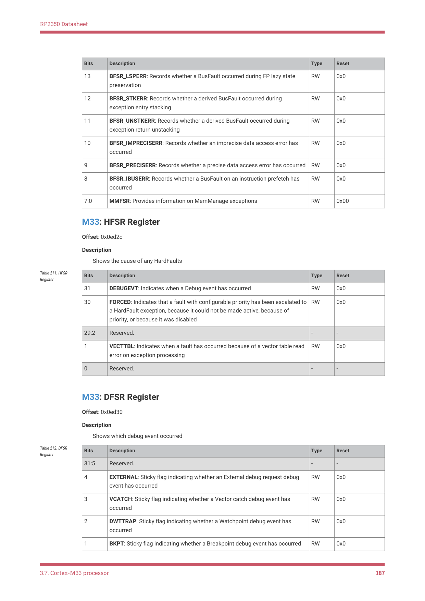

RP2350 Datasheet

| Bits | Description | Type | Reset |
| --- | --- | --- | --- |
| 13 | BFSR_LSPERR: Records whether a BusFault occurred during FP lazy state preservation | RW | 0x0 |
| 12 | BFSR_STKERR: Records whether a derived BusFault occurred during exception entry stacking | RW | 0x0 |
| 11 | BFSR_UNSTKERR: Records whether a derived BusFault occurred during exception return unstacking | RW | 0x0 |
| 10 | BFSR_IMPRECISERR: Records whether an imprecise data access error has occurred | RW | 0x0 |
| 9 | BFSR_PRECISERR: Records whether a precise data access error has occurred | RW | 0x0 |
| 8 | BFSR_IBUSERR: Records whether a BusFault on an instruction prefetch has occurred | RW | 0x0 |
| 7:0 | MMFSR: Provides information on MemManage exceptions | RW | 0x00 |

M33: HFSR Register

Offset: 0x0ed2c

Description

Shows the cause of any HardFaults

| Bits | Description | Type | Reset |
| --- | --- | --- | --- |
| 31 | DEBUGEVT: Indicates when a Debug event has occurred | RW | 0x0 |
| 30 | FORCED: Indicates that a fault with configurable priority has been escalated to a HardFault exception, because it could not be made active, because of priority, or because it was disabled | RW | 0x0 |
| 29:2 | Reserved. | - | - |
| 1 | VECTTBL: Indicates when a fault has occurred because of a vector table read error on exception processing | RW | 0x0 |
| 0 | Reserved. | - | - |

Table 211. HFSR

M33: DFSR Register

Offset: 0x0ed30

Description

Shows which debug event occurred

| Bits | Description | Type | Reset |
| --- | --- | --- | --- |
| 31:5 | Reserved. | - | - |
| 4 | EXTERNAL: Sticky flag indicating whether an External debug request debug event has occurred | RW | 0x0 |
| 3 | VCATCH: Sticky flag indicating whether a Vector catch debug event has occurred | RW | 0x0 |
| 2 | DWTTRAP: Sticky flag indicating whether a Watchpoint debug event has occurred | RW | 0x0 |
| 1 | BKPT: Sticky flag indicating whether a Breakpoint debug event has occurred | RW | 0x0 |

Table 212. DFSR

3.7. Cortex-M33 processor
187

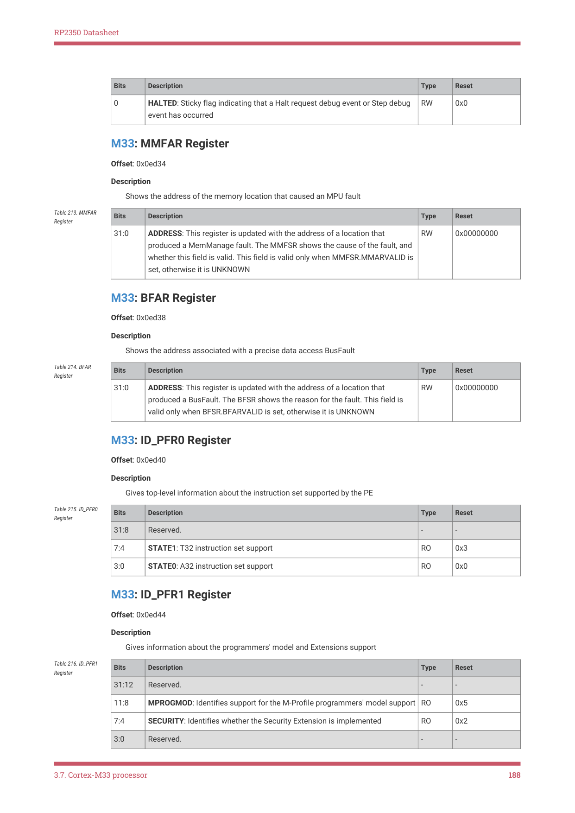

RP2350 Datasheet

| Bits | Description | Type | Reset |
| --- | --- | --- | --- |
| 0 | HALTED: Sticky flag indicating that a Halt request debug event or Step debug event has occurred | RW | 0x0 |

M33: MMFAR Register

Offset: 0x0ed34

Description

Shows the address of the memory location that caused an MPU fault

| Bits | Description | Type | Reset |
| --- | --- | --- | --- |
| 31:0 | ADDRESS: This register is updated with the address of a location that produced a MemManage fault. The MMFSR shows the cause of the fault, and whether this field is valid. This field is valid only when MMFSR.MMARVALID is set, otherwise it is UNKNOWN | RW | 0x00000000 |

Table 213. MMFAR

M33: BFAR Register

Offset: 0x0ed38

Description

Shows the address associated with a precise data access BusFault

| Bits | Description | Type | Reset |
| --- | --- | --- | --- |
| 31:0 | ADDRESS: This register is updated with the address of a location that produced a BusFault. The BFSR shows the reason for the fault. This field is valid only when BFSR.BFARVALID is set, otherwise it is UNKNOWN | RW | 0x00000000 |

Table 214. BFAR

M33: ID_PFR0 Register

Offset: 0x0ed40

Description

Gives top-level information about the instruction set supported by the PE

| Bits | Description | Type | Reset |
| --- | --- | --- | --- |
| 31:8 | Reserved. | - | - |
| 7:4 | STATE1: T32 instruction set support | RO | 0x3 |
| 3:0 | STATE0: A32 instruction set support | RO | 0x0 |

Table 215. ID_PFR0

M33: ID_PFR1 Register

Offset: 0x0ed44

Description

Gives information about the programmers' model and Extensions support

| Bits | Description | Type | Reset |
| --- | --- | --- | --- |
| 31:12 | Reserved. | - | - |
| 11:8 | MPROGMOD: Identifies support for the M-Profile programmers' model support | RO | 0x5 |
| 7:4 | SECURITY: Identifies whether the Security Extension is implemented | RO | 0x2 |
| 3:0 | Reserved. | - | - |

Table 216. ID_PFR1

3.7. Cortex-M33 processor
188

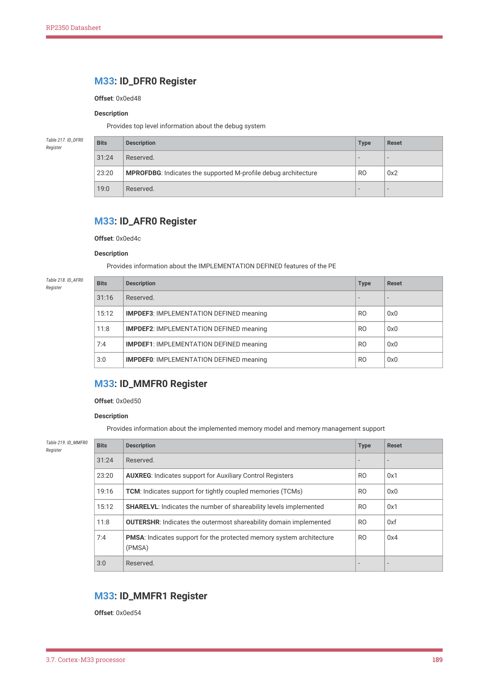

RP2350 Datasheet

M33: ID_DFR0 Register

Offset: 0x0ed48

Description

Provides top level information about the debug system

| Bits | Description | Type | Reset |
| --- | --- | --- | --- |
| 31:24 | Reserved. | - | - |
| 23:20 | MPROFDBG: Indicates the supported M-profile debug architecture | RO | 0x2 |
| 19:0 | Reserved. | - | - |

Table 217. ID_DFR0

M33: ID_AFR0 Register

Offset: 0x0ed4c

Description

Provides information about the IMPLEMENTATION DEFINED features of the PE

| Bits | Description | Type | Reset |
| --- | --- | --- | --- |
| 31:16 | Reserved. | - | - |
| 15:12 | IMPDEF3: IMPLEMENTATION DEFINED meaning | RO | 0x0 |
| 11:8 | IMPDEF2: IMPLEMENTATION DEFINED meaning | RO | 0x0 |
| 7:4 | IMPDEF1: IMPLEMENTATION DEFINED meaning | RO | 0x0 |
| 3:0 | IMPDEF0: IMPLEMENTATION DEFINED meaning | RO | 0x0 |

Table 218. ID_AFR0

M33: ID_MMFR0 Register

Offset: 0x0ed50

Description

Provides information about the implemented memory model and memory management support

| Bits | Description | Type | Reset |
| --- | --- | --- | --- |
| 31:24 | Reserved. | - | - |
| 23:20 | AUXREG: Indicates support for Auxiliary Control Registers | RO | 0x1 |
| 19:16 | TCM: Indicates support for tightly coupled memories (TCMs) | RO | 0x0 |
| 15:12 | SHARELVL: Indicates the number of shareability levels implemented | RO | 0x1 |
| 11:8 | OUTERSHR: Indicates the outermost shareability domain implemented | RO | 0xf |
| 7:4 | PMSA: Indicates support for the protected memory system architecture (PMSA) | RO | 0x4 |
| 3:0 | Reserved. | - | - |

Table 219. ID_MMFR0

M33: ID_MMFR1 Register

Offset: 0x0ed54

3.7. Cortex-M33 processor
189

RP2350 Datasheet

Description

Provides information about the implemented memory model and memory management support

| Bits | Description | Type | Reset |
| --- | --- | --- | --- |
| 31:0 | Reserved. | - | - |

Table 220. ID_MMFR1

M33: ID_MMFR2 Register

Offset: 0x0ed58

Description

Provides information about the implemented memory model and memory management support

| Bits | Description | Type | Reset |
| --- | --- | --- | --- |
| 31:28 | Reserved. | - | - |
| 27:24 | WFISTALL: Indicates the support for Wait For Interrupt (WFI) stalling | RO | 0x1 |
| 23:0 | Reserved. | - | - |

Table 221. ID_MMFR2

M33: ID_MMFR3 Register

Offset: 0x0ed5c

Description

Provides information about the implemented memory model and memory management support

| Bits | Description | Type | Reset |
| --- | --- | --- | --- |
| 31:12 | Reserved. | - | - |
| 11:8 | BPMAINT: Indicates the supported branch predictor maintenance | RO | 0x0 |
| 7:4 | CMAINTSW: Indicates the supported cache maintenance operations by set/way | RO | 0x0 |
| 3:0 | CMAINTVA: Indicates the supported cache maintenance operations by address | RO | 0x0 |

Table 222. ID_MMFR3

M33: ID_ISAR0 Register

Offset: 0x0ed60

Description

Provides information about the instruction set implemented by the PE

| Bits | Description | Type | Reset |
| --- | --- | --- | --- |
| 31:28 | Reserved. | - | - |
| 27:24 | DIVIDE: Indicates the supported Divide instructions | RO | 0x8 |
| 23:20 | DEBUG: Indicates the implemented Debug instructions | RO | 0x0 |
| 19:16 | COPROC: Indicates the supported Coprocessor instructions | RO | 0x9 |
| 15:12 | CMPBRANCH: Indicates the supported combined Compare and Branch instructions | RO | 0x2 |
| 11:8 | BITFIELD: Indicates the supported bit field instructions | RO | 0x3 |

Table 223. ID_ISAR0

3.7. Cortex-M33 processor
190

RP2350 Datasheet

| Bits | Description | Type | Reset |
| --- | --- | --- | --- |
| 7:4 | BITCOUNT: Indicates the supported bit count instructions | RO | 0x0 |
| 3:0 | Reserved. | - | - |

M33: ID_ISAR1 Register

Offset: 0x0ed64

Description

Provides information about the instruction set implemented by the PE

| Bits | Description | Type | Reset |
| --- | --- | --- | --- |
| 31:28 | Reserved. | - | - |
| 27:24 | INTERWORK: Indicates the implemented Interworking instructions | RO | 0x5 |
| 23:20 | IMMEDIATE: Indicates the implemented for data-processing instructions with long immediates | RO | 0x7 |
| 19:16 | IFTHEN: Indicates the implemented If-Then instructions | RO | 0x2 |
| 15:12 | EXTEND: Indicates the implemented Extend instructions | RO | 0x5 |
| 11:0 | Reserved. | - | - |

Table 224. ID_ISAR1

M33: ID_ISAR2 Register

Offset: 0x0ed68

Description

Provides information about the instruction set implemented by the PE

| Bits | Description | Type | Reset |
| --- | --- | --- | --- |
| 31:28 | REVERSAL: Indicates the implemented Reversal instructions | RO | 0x3 |
| 27:24 | Reserved. | - | - |
| 23:20 | MULTU: Indicates the implemented advanced unsigned Multiply instructions | RO | 0x1 |
| 19:16 | MULTS: Indicates the implemented advanced signed Multiply instructions | RO | 0x7 |
| 15:12 | MULT: Indicates the implemented additional Multiply instructions | RO | 0x3 |
| 11:8 | MULTIACCESSINT: Indicates the support for interruptible multi-access instructions | RO | 0x4 |
| 7:4 | MEMHINT: Indicates the implemented Memory Hint instructions | RO | 0x2 |
| 3:0 | LOADSTORE: Indicates the implemented additional load/store instructions | RO | 0x6 |

Table 225. ID_ISAR2

M33: ID_ISAR3 Register

Offset: 0x0ed6c

Description

Provides information about the instruction set implemented by the PE

| Bits | Description | Type | Reset |
| --- | --- | --- | --- |
| 31:28 | Reserved. | - | - |

Table 226. ID_ISAR3

3.7. Cortex-M33 processor
191

RP2350 Datasheet

| Bits | Description | Type | Reset |
| --- | --- | --- | --- |
| 27:24 | TRUENOP: Indicates the implemented true NOP instructions | RO | 0x7 |
| 23:20 | T32COPY: Indicates the support for T32 non flag-setting MOV instructions | RO | 0x8 |
| 19:16 | TABBRANCH: Indicates the implemented Table Branch instructions | RO | 0x9 |
| 15:12 | SYNCHPRIM: Used in conjunction with ID_ISAR4.SynchPrim_frac to indicate the implemented Synchronization Primitive instructions | RO | 0x5 |
| 11:8 | SVC: Indicates the implemented SVC instructions | RO | 0x7 |
| 7:4 | SIMD: Indicates the implemented SIMD instructions | RO | 0x2 |
| 3:0 | SATURATE: Indicates the implemented saturating instructions | RO | 0x9 |

M33: ID_ISAR4 Register

Offset: 0x0ed70

Description

Provides information about the instruction set implemented by the PE

| Bits | Description | Type | Reset |
| --- | --- | --- | --- |
| 31:28 | Reserved. | - | - |
| 27:24 | PSR_M: Indicates the implemented M profile instructions to modify the PSRs | RO | 0x1 |
| 23:20 | SYNCPRIM_FRAC: Used in conjunction with ID_ISAR3.SynchPrim to indicate the implemented Synchronization Primitive instructions | RO | 0x3 |
| 19:16 | BARRIER: Indicates the implemented Barrier instructions | RO | 0x1 |
| 15:12 | Reserved. | - | - |
| 11:8 | WRITEBACK: Indicates the support for writeback addressing modes | RO | 0x1 |
| 7:4 | WITHSHIFTS: Indicates the support for writeback addressing modes | RO | 0x3 |
| 3:0 | UNPRIV: Indicates the implemented unprivileged instructions | RO | 0x2 |

Table 227. ID_ISAR4

M33: ID_ISAR5 Register

Offset: 0x0ed74

Description

Provides information about the instruction set implemented by the PE

| Bits | Description | Type | Reset |
| --- | --- | --- | --- |
| 31:0 | Reserved. | - | - |

Table 228. ID_ISAR5

M33: CTR Register

Offset: 0x0ed7c

Description

Provides information about the architecture of the caches. CTR is RES0 if CLIDR is zero.

| Bits | Description | Type | Reset |
| --- | --- | --- | --- |
| 31 | RES1: Reserved, RES1 | RO | 0x1 |

Table 229. CTR

3.7. Cortex-M33 processor
192

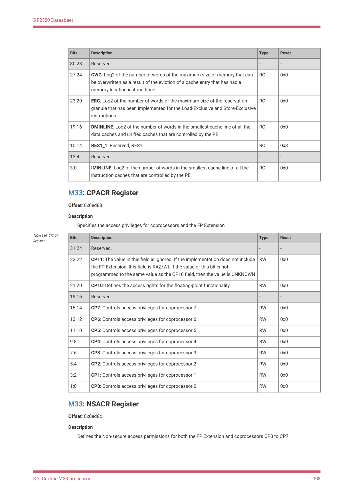

RP2350 Datasheet

| Bits | Description | Type | Reset |
| --- | --- | --- | --- |
| 30:28 | Reserved. | - | - |
| 27:24 | CWG: Log2 of the number of words of the maximum size of memory that can be overwritten as a result of the eviction of a cache entry that has had a memory location in it modified | RO | 0x0 |
| 23:20 | ERG: Log2 of the number of words of the maximum size of the reservation granule that has been implemented for the Load-Exclusive and Store-Exclusive instructions | RO | 0x0 |
| 19:16 | DMINLINE: Log2 of the number of words in the smallest cache line of all the data caches and unified caches that are controlled by the PE | RO | 0x0 |
| 15:14 | RES1_1: Reserved, RES1 | RO | 0x3 |
| 13:4 | Reserved. | - | - |
| 3:0 | IMINLINE: Log2 of the number of words in the smallest cache line of all the instruction caches that are controlled by the PE | RO | 0x0 |

M33: CPACR Register

Offset: 0x0ed88

Description

Specifies the access privileges for coprocessors and the FP Extension

| Bits | Description | Type | Reset |
| --- | --- | --- | --- |
| 31:24 | Reserved. | - | - |
| 23:22 | CP11: The value in this field is ignored. If the implementation does not include the FP Extension, this field is RAZ/WI. If the value of this bit is not programmed to the same value as the CP10 field, then the value is UNKNOWN | RW | 0x0 |
| 21:20 | CP10: Defines the access rights for the floating-point functionality | RW | 0x0 |
| 19:16 | Reserved. | - | - |
| 15:14 | CP7: Controls access privileges for coprocessor 7 | RW | 0x0 |
| 13:12 | CP6: Controls access privileges for coprocessor 6 | RW | 0x0 |
| 11:10 | CP5: Controls access privileges for coprocessor 5 | RW | 0x0 |
| 9:8 | CP4: Controls access privileges for coprocessor 4 | RW | 0x0 |
| 7:6 | CP3: Controls access privileges for coprocessor 3 | RW | 0x0 |
| 5:4 | CP2: Controls access privileges for coprocessor 2 | RW | 0x0 |
| 3:2 | CP1: Controls access privileges for coprocessor 1 | RW | 0x0 |
| 1:0 | CP0: Controls access privileges for coprocessor 0 | RW | 0x0 |

Table 230. CPACR

M33: NSACR Register

Offset: 0x0ed8c

Description

Defines the Non-secure access permissions for both the FP Extension and coprocessors CP0 to CP7

3.7. Cortex-M33 processor
193

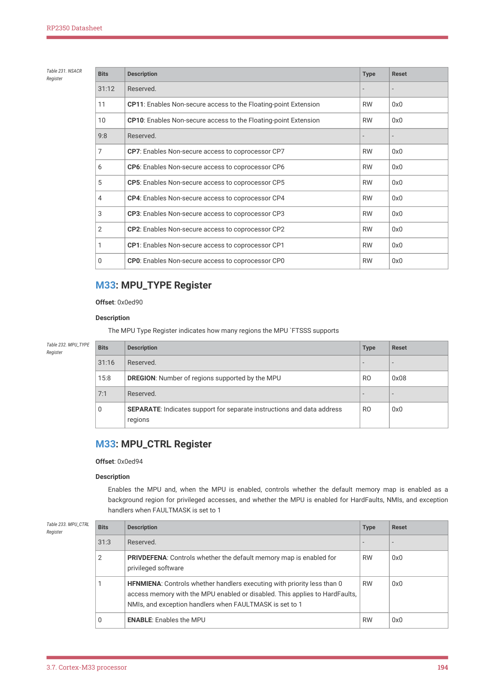

RP2350 Datasheet

| Bits | Description | Type | Reset |
| --- | --- | --- | --- |
| 31:12 | Reserved. | - | - |
| 11 | CP11: Enables Non-secure access to the Floating-point Extension | RW | 0x0 |
| 10 | CP10: Enables Non-secure access to the Floating-point Extension | RW | 0x0 |
| 9:8 | Reserved. | - | - |
| 7 | CP7: Enables Non-secure access to coprocessor CP7 | RW | 0x0 |
| 6 | CP6: Enables Non-secure access to coprocessor CP6 | RW | 0x0 |
| 5 | CP5: Enables Non-secure access to coprocessor CP5 | RW | 0x0 |
| 4 | CP4: Enables Non-secure access to coprocessor CP4 | RW | 0x0 |
| 3 | CP3: Enables Non-secure access to coprocessor CP3 | RW | 0x0 |
| 2 | CP2: Enables Non-secure access to coprocessor CP2 | RW | 0x0 |
| 1 | CP1: Enables Non-secure access to coprocessor CP1 | RW | 0x0 |
| 0 | CP0: Enables Non-secure access to coprocessor CP0 | RW | 0x0 |

Table 231. NSACR

M33: MPU_TYPE Register

Offset: 0x0ed90

Description

The MPU Type Register indicates how many regions the MPU `FTSSS supports

| Bits | Description | Type | Reset |
| --- | --- | --- | --- |
| 31:16 | Reserved. | - | - |
| 15:8 | DREGION: Number of regions supported by the MPU | RO | 0x08 |
| 7:1 | Reserved. | - | - |
| 0 | SEPARATE: Indicates support for separate instructions and data address regions | RO | 0x0 |

Table 232. MPU_TYPE

M33: MPU_CTRL Register

Offset: 0x0ed94

Description

Enables the MPU and, when the MPU is enabled, controls whether the default memory map is enabled as a

background region for privileged accesses, and whether the MPU is enabled for HardFaults, NMIs, and exception

handlers when FAULTMASK is set to 1

| Bits | Description | Type | Reset |
| --- | --- | --- | --- |
| 31:3 | Reserved. | - | - |
| 2 | PRIVDEFENA: Controls whether the default memory map is enabled for privileged software | RW | 0x0 |
| 1 | HFNMIENA: Controls whether handlers executing with priority less than 0 access memory with the MPU enabled or disabled. This applies to HardFaults, NMIs, and exception handlers when FAULTMASK is set to 1 | RW | 0x0 |
| 0 | ENABLE: Enables the MPU | RW | 0x0 |

Table 233. MPU_CTRL

3.7. Cortex-M33 processor
194

RP2350 Datasheet

M33: MPU_RNR Register

Offset: 0x0ed98

Description

Selects the region currently accessed by MPU_RBAR and MPU_RLAR

| Bits | Description | Type | Reset |
| --- | --- | --- | --- |
| 31:3 | Reserved. | - | - |
| 2:0 | REGION: Indicates the memory region accessed by MPU_RBAR and MPU_RLAR | RW | 0x0 |

Table 234. MPU_RNR

M33: MPU_RBAR Register

Offset: 0x0ed9c

Description

Provides indirect read and write access to the base address of the currently selected MPU region `FTSSS

| Bits | Description | Type | Reset |
| --- | --- | --- | --- |
| 31:5 | BASE: Contains bits [31:5] of the lower inclusive limit of the selected MPU memory region. This value is zero extended to provide the base address to be checked against | RW | 0x0000000 |
| 4:3 | SH: Defines the Shareability domain of this region for Normal memory | RW | 0x0 |
| 2:1 | AP: Defines the access permissions for this region | RW | 0x0 |
| 0 | XN: Defines whether code can be executed from this region | RW | 0x0 |

Table 235. MPU_RBAR

M33: MPU_RLAR Register

Offset: 0x0eda0

Description

Provides indirect read and write access to the limit address of the currently selected MPU region `FTSSS

| Bits | Description | Type | Reset |
| --- | --- | --- | --- |
| 31:5 | LIMIT: Contains bits [31:5] of the upper inclusive limit of the selected MPU memory region. This value is postfixed with 0x1F to provide the limit address to be checked against | RW | 0x0000000 |
| 4 | Reserved. | - | - |
| 3:1 | ATTRINDX: Associates a set of attributes in the MPU_MAIR0 and MPU_MAIR1 fields | RW | 0x0 |
| 0 | EN: Region enable | RW | 0x0 |

Table 236. MPU_RLAR

M33: MPU_RBAR_A1 Register

Offset: 0x0eda4

Description

Provides indirect read and write access to the base address of the MPU region selected by MPU_RNR[7:2]:(1[1:0])

`FTSSS

3.7. Cortex-M33 processor
195

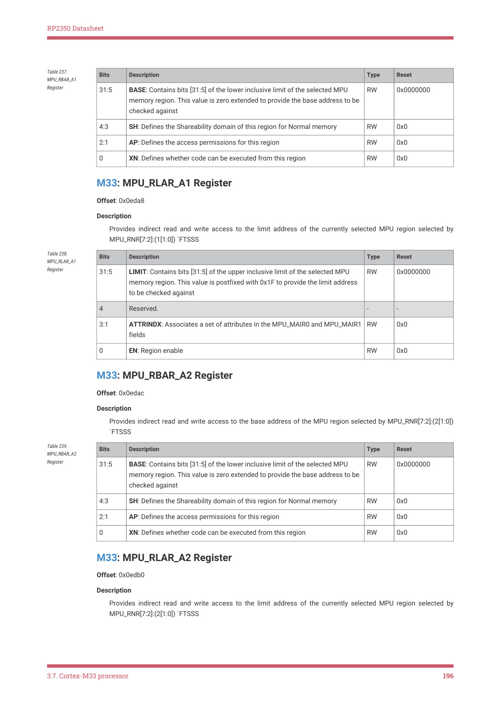

RP2350 Datasheet

| Bits | Description | Type | Reset |
| --- | --- | --- | --- |
| 31:5 | BASE: Contains bits [31:5] of the lower inclusive limit of the selected MPU memory region. This value is zero extended to provide the base address to be checked against | RW | 0x0000000 |
| 4:3 | SH: Defines the Shareability domain of this region for Normal memory | RW | 0x0 |
| 2:1 | AP: Defines the access permissions for this region | RW | 0x0 |
| 0 | XN: Defines whether code can be executed from this region | RW | 0x0 |

Table 237.

MPU_RBAR_A1

Register

M33: MPU_RLAR_A1 Register

Offset: 0x0eda8

Description

Provides indirect read and write access to the limit address of the currently selected MPU region selected by

MPU_RNR[7:2]:(1[1:0]) `FTSSS

| Bits | Description | Type | Reset |
| --- | --- | --- | --- |
| 31:5 | LIMIT: Contains bits [31:5] of the upper inclusive limit of the selected MPU memory region. This value is postfixed with 0x1F to provide the limit address to be checked against | RW | 0x0000000 |
| 4 | Reserved. | - | - |
| 3:1 | ATTRINDX: Associates a set of attributes in the MPU_MAIR0 and MPU_MAIR1 fields | RW | 0x0 |
| 0 | EN: Region enable | RW | 0x0 |

Table 238.

MPU_RLAR_A1

Register

M33: MPU_RBAR_A2 Register

Offset: 0x0edac

Description

Provides indirect read and write access to the base address of the MPU region selected by MPU_RNR[7:2]:(2[1:0])

`FTSSS

| Bits | Description | Type | Reset |
| --- | --- | --- | --- |
| 31:5 | BASE: Contains bits [31:5] of the lower inclusive limit of the selected MPU memory region. This value is zero extended to provide the base address to be checked against | RW | 0x0000000 |
| 4:3 | SH: Defines the Shareability domain of this region for Normal memory | RW | 0x0 |
| 2:1 | AP: Defines the access permissions for this region | RW | 0x0 |
| 0 | XN: Defines whether code can be executed from this region | RW | 0x0 |

Table 239.

MPU_RBAR_A2

Register

M33: MPU_RLAR_A2 Register

Offset: 0x0edb0

Description

Provides indirect read and write access to the limit address of the currently selected MPU region selected by

MPU_RNR[7:2]:(2[1:0]) `FTSSS

3.7. Cortex-M33 processor
196

RP2350 Datasheet

| Bits | Description | Type | Reset |
| --- | --- | --- | --- |
| 31:5 | LIMIT: Contains bits [31:5] of the upper inclusive limit of the selected MPU memory region. This value is postfixed with 0x1F to provide the limit address to be checked against | RW | 0x0000000 |
| 4 | Reserved. | - | - |
| 3:1 | ATTRINDX: Associates a set of attributes in the MPU_MAIR0 and MPU_MAIR1 fields | RW | 0x0 |
| 0 | EN: Region enable | RW | 0x0 |

Table 240.

MPU_RLAR_A2

Register

M33: MPU_RBAR_A3 Register

Offset: 0x0edb4

Description

Provides indirect read and write access to the base address of the MPU region selected by MPU_RNR[7:2]:(3[1:0])

`FTSSS

| Bits | Description | Type | Reset |
| --- | --- | --- | --- |
| 31:5 | BASE: Contains bits [31:5] of the lower inclusive limit of the selected MPU memory region. This value is zero extended to provide the base address to be checked against | RW | 0x0000000 |
| 4:3 | SH: Defines the Shareability domain of this region for Normal memory | RW | 0x0 |
| 2:1 | AP: Defines the access permissions for this region | RW | 0x0 |
| 0 | XN: Defines whether code can be executed from this region | RW | 0x0 |

Table 241.

MPU_RBAR_A3

Register

M33: MPU_RLAR_A3 Register

Offset: 0x0edb8

Description

Provides indirect read and write access to the limit address of the currently selected MPU region selected by

MPU_RNR[7:2]:(3[1:0]) `FTSSS

| Bits | Description | Type | Reset |
| --- | --- | --- | --- |
| 31:5 | LIMIT: Contains bits [31:5] of the upper inclusive limit of the selected MPU memory region. This value is postfixed with 0x1F to provide the limit address to be checked against | RW | 0x0000000 |
| 4 | Reserved. | - | - |
| 3:1 | ATTRINDX: Associates a set of attributes in the MPU_MAIR0 and MPU_MAIR1 fields | RW | 0x0 |
| 0 | EN: Region enable | RW | 0x0 |

Table 242.

MPU_RLAR_A3

Register

M33: MPU_MAIR0 Register

Offset: 0x0edc0

Description

Along with MPU_MAIR1, provides the memory attribute encodings corresponding to the AttrIndex values

| Bits | Description | Type | Reset |
| --- | --- | --- | --- |
| 31:24 | ATTR3: Memory attribute encoding for MPU regions with an AttrIndex of 3 | RW | 0x00 |

Table 243.

3.7. Cortex-M33 processor
197

RP2350 Datasheet

| Bits | Description | Type | Reset |
| --- | --- | --- | --- |
| 23:16 | ATTR2: Memory attribute encoding for MPU regions with an AttrIndex of 2 | RW | 0x00 |
| 15:8 | ATTR1: Memory attribute encoding for MPU regions with an AttrIndex of 1 | RW | 0x00 |
| 7:0 | ATTR0: Memory attribute encoding for MPU regions with an AttrIndex of 0 | RW | 0x00 |

M33: MPU_MAIR1 Register

Offset: 0x0edc4

Description

Along with MPU_MAIR0, provides the memory attribute encodings corresponding to the AttrIndex values

| Bits | Description | Type | Reset |
| --- | --- | --- | --- |
| 31:24 | ATTR7: Memory attribute encoding for MPU regions with an AttrIndex of 7 | RW | 0x00 |
| 23:16 | ATTR6: Memory attribute encoding for MPU regions with an AttrIndex of 6 | RW | 0x00 |
| 15:8 | ATTR5: Memory attribute encoding for MPU regions with an AttrIndex of 5 | RW | 0x00 |
| 7:0 | ATTR4: Memory attribute encoding for MPU regions with an AttrIndex of 4 | RW | 0x00 |

Table 244.

M33: SAU_CTRL Register

Offset: 0x0edd0

Description

Allows enabling of the Security Attribution Unit

| Bits | Description | Type | Reset |
| --- | --- | --- | --- |
| 31:2 | Reserved. | - | - |
| 1 | ALLNS: When SAU_CTRL.ENABLE is 0 this bit controls if the memory is marked as Non-secure or Secure | RW | 0x0 |
| 0 | ENABLE: Enables the SAU | RW | 0x0 |

Table 245. SAU_CTRL

M33: SAU_TYPE Register

Offset: 0x0edd4

Description

Indicates the number of regions implemented by the Security Attribution Unit

| Bits | Description | Type | Reset |
| --- | --- | --- | --- |
| 31:8 | Reserved. | - | - |
| 7:0 | SREGION: The number of implemented SAU regions | RO | 0x08 |

Table 246. SAU_TYPE

M33: SAU_RNR Register

Offset: 0x0edd8

Description

Selects the region currently accessed by SAU_RBAR and SAU_RLAR

| Bits | Description | Type | Reset |
| --- | --- | --- | --- |
| 31:8 | Reserved. | - | - |

Table 247. SAU_RNR

3.7. Cortex-M33 processor
198

RP2350 Datasheet

| Bits | Description | Type | Reset |
| --- | --- | --- | --- |
| 7:0 | REGION: Indicates the SAU region accessed by SAU_RBAR and SAU_RLAR | RW | 0x00 |

M33: SAU_RBAR Register

Offset: 0x0eddc

Description

Provides indirect read and write access to the base address of the currently selected SAU region

| Bits | Description | Type | Reset |
| --- | --- | --- | --- |
| 31:5 | BADDR: Holds bits [31:5] of the base address for the selected SAU region | RW | 0x0000000 |
| 4:0 | Reserved. | - | - |

Table 248. SAU_RBAR

M33: SAU_RLAR Register

Offset: 0x0ede0

Description

Provides indirect read and write access to the limit address of the currently selected SAU region

| Bits | Description | Type | Reset |
| --- | --- | --- | --- |
| 31:5 | LADDR: Holds bits [31:5] of the limit address for the selected SAU region | RW | 0x0000000 |
| 4:2 | Reserved. | - | - |
| 1 | NSC: Controls whether Non-secure state is permitted to execute an SG instruction from this region | RW | 0x0 |
| 0 | ENABLE: SAU region enable | RW | 0x0 |

Table 249. SAU_RLAR

M33: SFSR Register

Offset: 0x0ede4

Description

Provides information about any security related faults

| Bits | Description | Type | Reset |
| --- | --- | --- | --- |
| 31:8 | Reserved. | - | - |
| 7 | LSERR: Sticky flag indicating that an error occurred during lazy state activation or deactivation | RW | 0x0 |
| 6 | SFARVALID: This bit is set when the SFAR register contains a valid value. As with similar fields, such as BFSR.BFARVALID and MMFSR.MMARVALID, this bit can be cleared by other exceptions, such as BusFault | RW | 0x0 |
| 5 | LSPERR: Stick flag indicating that an SAU or IDAU violation occurred during the lazy preservation of floating-point state | RW | 0x0 |
| 4 | INVTRAN: Sticky flag indicating that an exception was raised due to a branch that was not flagged as being domain crossing causing a transition from Secure to Non-secure memory | RW | 0x0 |

Table 250. SFSR

3.7. Cortex-M33 processor
199

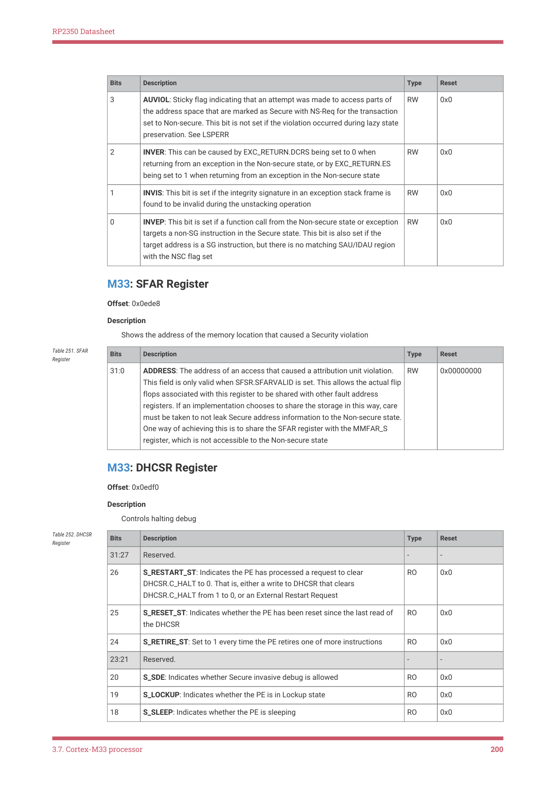

RP2350 Datasheet

| Bits | Description | Type | Reset |
| --- | --- | --- | --- |
| 3 | AUVIOL: Sticky flag indicating that an attempt was made to access parts of the address space that are marked as Secure with NS-Req for the transaction set to Non-secure. This bit is not set if the violation occurred during lazy state preservation. See LSPERR | RW | 0x0 |
| 2 | INVER: This can be caused by EXC_RETURN.DCRS being set to 0 when returning from an exception in the Non-secure state, or by EXC_RETURN.ES being set to 1 when returning from an exception in the Non-secure state | RW | 0x0 |
| 1 | INVIS: This bit is set if the integrity signature in an exception stack frame is found to be invalid during the unstacking operation | RW | 0x0 |
| 0 | INVEP: This bit is set if a function call from the Non-secure state or exception targets a non-SG instruction in the Secure state. This bit is also set if the target address is a SG instruction, but there is no matching SAU/IDAU region with the NSC flag set | RW | 0x0 |

M33: SFAR Register

Offset: 0x0ede8

Description

Shows the address of the memory location that caused a Security violation

| Bits | Description | Type | Reset |
| --- | --- | --- | --- |
| 31:0 | ADDRESS: The address of an access that caused a attribution unit violation. This field is only valid when SFSR.SFARVALID is set. This allows the actual flip flops associated with this register to be shared with other fault address registers. If an implementation chooses to share the storage in this way, care must be taken to not leak Secure address information to the Non-secure state. One way of achieving this is to share the SFAR register with the MMFAR_S register, which is not accessible to the Non-secure state | RW | 0x00000000 |

Table 251. SFAR

M33: DHCSR Register

Offset: 0x0edf0

Description

Controls halting debug

| Bits | Description | Type | Reset |
| --- | --- | --- | --- |
| 31:27 | Reserved. | - | - |
| 26 | S_RESTART_ST: Indicates the PE has processed a request to clear DHCSR.C_HALT to 0. That is, either a write to DHCSR that clears DHCSR.C_HALT from 1 to 0, or an External Restart Request | RO | 0x0 |
| 25 | S_RESET_ST: Indicates whether the PE has been reset since the last read of the DHCSR | RO | 0x0 |
| 24 | S_RETIRE_ST: Set to 1 every time the PE retires one of more instructions | RO | 0x0 |
| 23:21 | Reserved. | - | - |
| 20 | S_SDE: Indicates whether Secure invasive debug is allowed | RO | 0x0 |
| 19 | S_LOCKUP: Indicates whether the PE is in Lockup state | RO | 0x0 |
| 18 | S_SLEEP: Indicates whether the PE is sleeping | RO | 0x0 |

Table 252. DHCSR

3.7. Cortex-M33 processor
200

RP2350 Datasheet

| Bits | Description | Type | Reset |
| --- | --- | --- | --- |
| 17 | S_HALT: Indicates whether the PE is in Debug state | RO | 0x0 |
| 16 | S_REGRDY: Handshake flag to transfers through the DCRDR | RO | 0x0 |
| 15:6 | Reserved. | - | - |
| 5 | C_SNAPSTALL: Allow imprecise entry to Debug state | RW | 0x0 |
| 4 | Reserved. | - | - |
| 3 | C_MASKINTS: When debug is enabled, the debugger can write to this bit to mask PendSV, SysTick and external configurable interrupts | RW | 0x0 |
| 2 | C_STEP: Enable single instruction step | RW | 0x0 |
| 1 | C_HALT: PE enter Debug state halt request | RW | 0x0 |
| 0 | C_DEBUGEN: Enable Halting debug | RW | 0x0 |

M33: DCRSR Register

Offset: 0x0edf4

Description

With the DCRDR, provides debug access to the general-purpose registers, special-purpose registers, and the FP

extension registers. A write to the DCRSR specifies the register to transfer, whether the transfer is a read or write,

and starts the transfer

| Bits | Description | Type | Reset |
| --- | --- | --- | --- |
| 31:17 | Reserved. | - | - |
| 16 | REGWNR: Specifies the access type for the transfer | RW | 0x0 |
| 15:7 | Reserved. | - | - |
| 6:0 | REGSEL: Specifies the general-purpose register, special-purpose register, or FP register to transfer | RW | 0x00 |

Table 253. DCRSR

M33: DCRDR Register

Offset: 0x0edf8

Description

With the DCRSR, provides debug access to the general-purpose registers, special-purpose registers, and the FP

Extension registers. If the Main Extension is implemented, it can also be used for message passing between an

external debugger and a debug agent running on the PE

| Bits | Description | Type | Reset |
| --- | --- | --- | --- |
| 31:0 | DBGTMP: Provides debug access for reading and writing the general-purpose registers, special-purpose registers, and Floating-point Extension registers | RW | 0x00000000 |

Table 254. DCRDR

M33: DEMCR Register

Offset: 0x0edfc

Description

Manages vector catch behavior and DebugMonitor handling when debugging

| Bits | Description | Type | Reset |
| --- | --- | --- | --- |
| 31:25 | Reserved. | - | - |

Table 255. DEMCR

3.7. Cortex-M33 processor
201

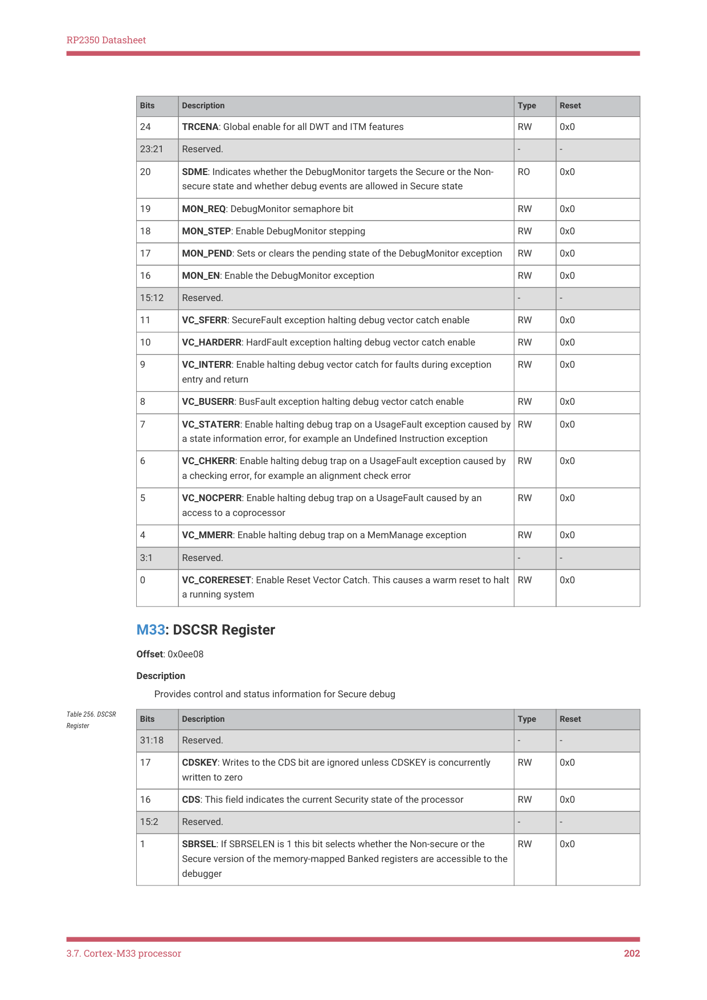

RP2350 Datasheet

| Bits | Description | Type | Reset |
| --- | --- | --- | --- |
| 24 | TRCENA: Global enable for all DWT and ITM features | RW | 0x0 |
| 23:21 | Reserved. | - | - |
| 20 | SDME: Indicates whether the DebugMonitor targets the Secure or the Non- secure state and whether debug events are allowed in Secure state | RO | 0x0 |
| 19 | MON_REQ: DebugMonitor semaphore bit | RW | 0x0 |
| 18 | MON_STEP: Enable DebugMonitor stepping | RW | 0x0 |
| 17 | MON_PEND: Sets or clears the pending state of the DebugMonitor exception | RW | 0x0 |
| 16 | MON_EN: Enable the DebugMonitor exception | RW | 0x0 |
| 15:12 | Reserved. | - | - |
| 11 | VC_SFERR: SecureFault exception halting debug vector catch enable | RW | 0x0 |
| 10 | VC_HARDERR: HardFault exception halting debug vector catch enable | RW | 0x0 |
| 9 | VC_INTERR: Enable halting debug vector catch for faults during exception entry and return | RW | 0x0 |
| 8 | VC_BUSERR: BusFault exception halting debug vector catch enable | RW | 0x0 |
| 7 | VC_STATERR: Enable halting debug trap on a UsageFault exception caused by a state information error, for example an Undefined Instruction exception | RW | 0x0 |
| 6 | VC_CHKERR: Enable halting debug trap on a UsageFault exception caused by a checking error, for example an alignment check error | RW | 0x0 |
| 5 | VC_NOCPERR: Enable halting debug trap on a UsageFault caused by an access to a coprocessor | RW | 0x0 |
| 4 | VC_MMERR: Enable halting debug trap on a MemManage exception | RW | 0x0 |
| 3:1 | Reserved. | - | - |
| 0 | VC_CORERESET: Enable Reset Vector Catch. This causes a warm reset to halt a running system | RW | 0x0 |

M33: DSCSR Register

Offset: 0x0ee08

Description

Provides control and status information for Secure debug

| Bits | Description | Type | Reset |
| --- | --- | --- | --- |
| 31:18 | Reserved. | - | - |
| 17 | CDSKEY: Writes to the CDS bit are ignored unless CDSKEY is concurrently written to zero | RW | 0x0 |
| 16 | CDS: This field indicates the current Security state of the processor | RW | 0x0 |
| 15:2 | Reserved. | - | - |
| 1 | SBRSEL: If SBRSELEN is 1 this bit selects whether the Non-secure or the Secure version of the memory-mapped Banked registers are accessible to the debugger | RW | 0x0 |

Table 256. DSCSR

3.7. Cortex-M33 processor
202

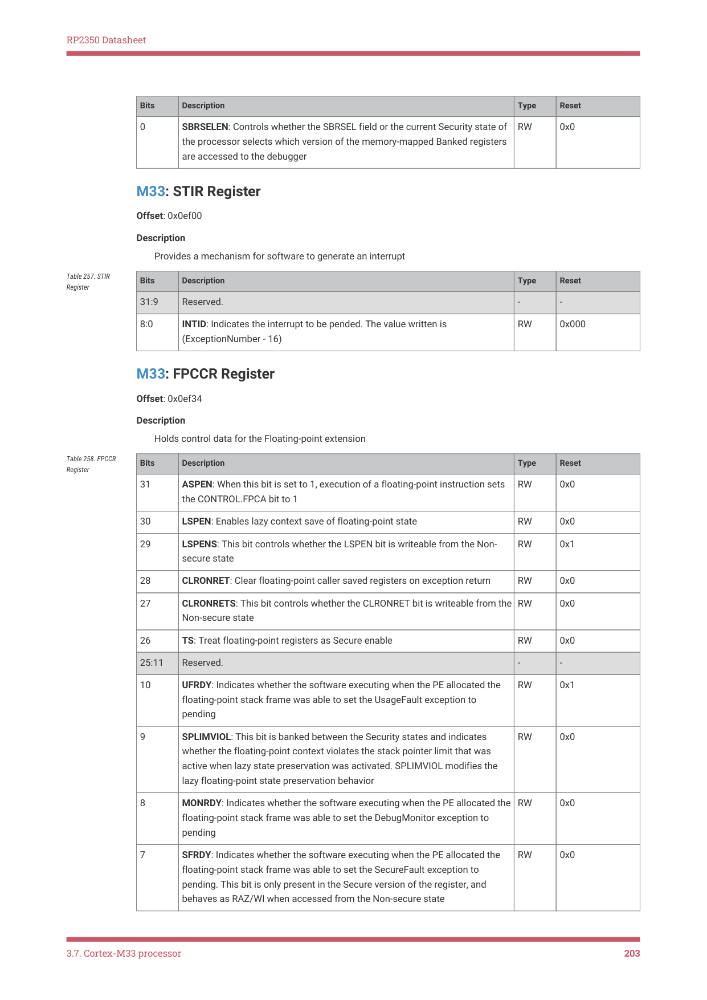

RP2350 Datasheet

| Bits | Description | Type | Reset |
| --- | --- | --- | --- |
| 0 | SBRSELEN: Controls whether the SBRSEL field or the current Security state of the processor selects which version of the memory-mapped Banked registers are accessed to the debugger | RW | 0x0 |

M33: STIR Register

Offset: 0x0ef00

Description

Provides a mechanism for software to generate an interrupt

| Bits | Description | Type | Reset |
| --- | --- | --- | --- |
| 31:9 | Reserved. | - | - |
| 8:0 | INTID: Indicates the interrupt to be pended. The value written is (ExceptionNumber - 16) | RW | 0x000 |

Table 257. STIR

M33: FPCCR Register

Offset: 0x0ef34

Description

Holds control data for the Floating-point extension

| Bits | Description | Type | Reset |
| --- | --- | --- | --- |
| 31 | ASPEN: When this bit is set to 1, execution of a floating-point instruction sets the CONTROL.FPCA bit to 1 | RW | 0x0 |
| 30 | LSPEN: Enables lazy context save of floating-point state | RW | 0x0 |
| 29 | LSPENS: This bit controls whether the LSPEN bit is writeable from the Non- secure state | RW | 0x1 |
| 28 | CLRONRET: Clear floating-point caller saved registers on exception return | RW | 0x0 |
| 27 | CLRONRETS: This bit controls whether the CLRONRET bit is writeable from the Non-secure state | RW | 0x0 |
| 26 | TS: Treat floating-point registers as Secure enable | RW | 0x0 |
| 25:11 | Reserved. | - | - |
| 10 | UFRDY: Indicates whether the software executing when the PE allocated the floating-point stack frame was able to set the UsageFault exception to pending | RW | 0x1 |
| 9 | SPLIMVIOL: This bit is banked between the Security states and indicates whether the floating-point context violates the stack pointer limit that was active when lazy state preservation was activated. SPLIMVIOL modifies the lazy floating-point state preservation behavior | RW | 0x0 |
| 8 | MONRDY: Indicates whether the software executing when the PE allocated the floating-point stack frame was able to set the DebugMonitor exception to pending | RW | 0x0 |
| 7 | SFRDY: Indicates whether the software executing when the PE allocated the floating-point stack frame was able to set the SecureFault exception to pending. This bit is only present in the Secure version of the register, and behaves as RAZ/WI when accessed from the Non-secure state | RW | 0x0 |

Table 258. FPCCR

3.7. Cortex-M33 processor
203

RP2350 Datasheet

| Bits | Description | Type | Reset |
| --- | --- | --- | --- |
| 6 | BFRDY: Indicates whether the software executing when the PE allocated the floating-point stack frame was able to set the BusFault exception to pending | RW | 0x1 |
| 5 | MMRDY: Indicates whether the software executing when the PE allocated the floating-point stack frame was able to set the MemManage exception to pending | RW | 0x1 |
| 4 | HFRDY: Indicates whether the software executing when the PE allocated the floating-point stack frame was able to set the HardFault exception to pending | RW | 0x1 |
| 3 | THREAD: Indicates the PE mode when it allocated the floating-point stack frame | RW | 0x0 |
| 2 | S: Security status of the floating-point context. This bit is only present in the Secure version of the register, and behaves as RAZ/WI when accessed from the Non-secure state. This bit is updated whenever lazy state preservation is activated, or when a floating-point instruction is executed | RW | 0x0 |
| 1 | USER: Indicates the privilege level of the software executing when the PE allocated the floating-point stack frame | RW | 0x1 |
| 0 | LSPACT: Indicates whether lazy preservation of the floating-point state is active | RW | 0x0 |

M33: FPCAR Register

Offset: 0x0ef38

Description

Holds the location of the unpopulated floating-point register space allocated on an exception stack frame

| Bits | Description | Type | Reset |
| --- | --- | --- | --- |
| 31:3 | ADDRESS: The location of the unpopulated floating-point register space allocated on an exception stack frame | RW | 0x00000000 |
| 2:0 | Reserved. | - | - |

Table 259. FPCAR

M33: FPDSCR Register

Offset: 0x0ef3c

Description

Holds the default values for the floating-point status control data that the PE assigns to the FPSCR when it creates

a new floating-point context

| Bits | Description | Type | Reset |
| --- | --- | --- | --- |
| 31:27 | Reserved. | - | - |
| 26 | AHP: Default value for FPSCR.AHP | RW | 0x0 |
| 25 | DN: Default value for FPSCR.DN | RW | 0x0 |
| 24 | FZ: Default value for FPSCR.FZ | RW | 0x0 |
| 23:22 | RMODE: Default value for FPSCR.RMode | RW | 0x0 |
| 21:0 | Reserved. | - | - |

Table 260. FPDSCR

3.7. Cortex-M33 processor
204

RP2350 Datasheet

M33: MVFR0 Register

Offset: 0x0ef40

Description

Describes the features provided by the Floating-point Extension

| Bits | Description | Type | Reset |
| --- | --- | --- | --- |
| 31:28 | FPROUND: Indicates the rounding modes supported by the FP Extension | RO | 0x6 |
| 27:24 | Reserved. | - | - |
| 23:20 | FPSQRT: Indicates the support for FP square root operations | RO | 0x5 |
| 19:16 | FPDIVIDE: Indicates the support for FP divide operations | RO | 0x4 |
| 15:12 | Reserved. | - | - |
| 11:8 | FPDP: Indicates support for FP double-precision operations | RO | 0x6 |
| 7:4 | FPSP: Indicates support for FP single-precision operations | RO | 0x0 |
| 3:0 | SIMDREG: Indicates size of FP register file | RO | 0x1 |

Table 261. MVFR0

M33: MVFR1 Register

Offset: 0x0ef44

Description

Describes the features provided by the Floating-point Extension

| Bits | Description | Type | Reset |
| --- | --- | --- | --- |
| 31:28 | FMAC: Indicates whether the FP Extension implements the fused multiply accumulate instructions | RO | 0x8 |
| 27:24 | FPHP: Indicates whether the FP Extension implements half-precision FP conversion instructions | RO | 0x5 |
| 23:8 | Reserved. | - | - |
| 7:4 | FPDNAN: Indicates whether the FP hardware implementation supports NaN propagation | RO | 0x8 |
| 3:0 | FPFTZ: Indicates whether subnormals are always flushed-to-zero | RO | 0x9 |

Table 262. MVFR1

M33: MVFR2 Register

Offset: 0x0ef48

Description

Describes the features provided by the Floating-point Extension

| Bits | Description | Type | Reset |
| --- | --- | --- | --- |
| 31:8 | Reserved. | - | - |
| 7:4 | FPMISC: Indicates support for miscellaneous FP features | RO | 0x6 |
| 3:0 | Reserved. | - | - |

Table 263. MVFR2

M33: DDEVARCH Register

Offset: 0x0efbc

3.7. Cortex-M33 processor
205

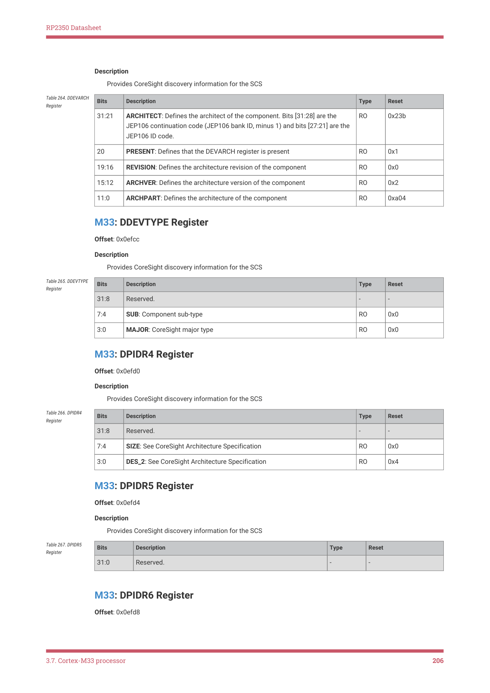

RP2350 Datasheet

Description

Provides CoreSight discovery information for the SCS

| Bits | Description | Type | Reset |
| --- | --- | --- | --- |
| 31:21 | ARCHITECT: Defines the architect of the component. Bits [31:28] are the JEP106 continuation code (JEP106 bank ID, minus 1) and bits [27:21] are the JEP106 ID code. | RO | 0x23b |
| 20 | PRESENT: Defines that the DEVARCH register is present | RO | 0x1 |
| 19:16 | REVISION: Defines the architecture revision of the component | RO | 0x0 |
| 15:12 | ARCHVER: Defines the architecture version of the component | RO | 0x2 |
| 11:0 | ARCHPART: Defines the architecture of the component | RO | 0xa04 |

Table 264. DDEVARCH

M33: DDEVTYPE Register

Offset: 0x0efcc

Description

Provides CoreSight discovery information for the SCS

| Bits | Description | Type | Reset |
| --- | --- | --- | --- |
| 31:8 | Reserved. | - | - |
| 7:4 | SUB: Component sub-type | RO | 0x0 |
| 3:0 | MAJOR: CoreSight major type | RO | 0x0 |

Table 265. DDEVTYPE

M33: DPIDR4 Register

Offset: 0x0efd0

Description

Provides CoreSight discovery information for the SCS

| Bits | Description | Type | Reset |
| --- | --- | --- | --- |
| 31:8 | Reserved. | - | - |
| 7:4 | SIZE: See CoreSight Architecture Specification | RO | 0x0 |
| 3:0 | DES_2: See CoreSight Architecture Specification | RO | 0x4 |

Table 266. DPIDR4

M33: DPIDR5 Register

Offset: 0x0efd4

Description

Provides CoreSight discovery information for the SCS

| Bits | Description | Type | Reset |
| --- | --- | --- | --- |
| 31:0 | Reserved. | - | - |

Table 267. DPIDR5

M33: DPIDR6 Register

Offset: 0x0efd8

3.7. Cortex-M33 processor
206

RP2350 Datasheet

Description

Provides CoreSight discovery information for the SCS

| Bits | Description | Type | Reset |
| --- | --- | --- | --- |
| 31:0 | Reserved. | - | - |

Table 268. DPIDR6

M33: DPIDR7 Register

Offset: 0x0efdc

Description

Provides CoreSight discovery information for the SCS

| Bits | Description | Type | Reset |
| --- | --- | --- | --- |
| 31:0 | Reserved. | - | - |

Table 269. DPIDR7

M33: DPIDR0 Register

Offset: 0x0efe0

Description

Provides CoreSight discovery information for the SCS

| Bits | Description | Type | Reset |
| --- | --- | --- | --- |
| 31:8 | Reserved. | - | - |
| 7:0 | PART_0: See CoreSight Architecture Specification | RO | 0x21 |

Table 270. DPIDR0

M33: DPIDR1 Register

Offset: 0x0efe4

Description

Provides CoreSight discovery information for the SCS

| Bits | Description | Type | Reset |
| --- | --- | --- | --- |
| 31:8 | Reserved. | - | - |
| 7:4 | DES_0: See CoreSight Architecture Specification | RO | 0xb |
| 3:0 | PART_1: See CoreSight Architecture Specification | RO | 0xd |

Table 271. DPIDR1

M33: DPIDR2 Register

Offset: 0x0efe8

Description

Provides CoreSight discovery information for the SCS

| Bits | Description | Type | Reset |
| --- | --- | --- | --- |
| 31:8 | Reserved. | - | - |
| 7:4 | REVISION: See CoreSight Architecture Specification | RO | 0x0 |
| 3 | JEDEC: See CoreSight Architecture Specification | RO | 0x1 |
| 2:0 | DES_1: See CoreSight Architecture Specification | RO | 0x3 |

Table 272. DPIDR2

3.7. Cortex-M33 processor
207

RP2350 Datasheet

M33: DPIDR3 Register

Offset: 0x0efec

Description

Provides CoreSight discovery information for the SCS

| Bits | Description | Type | Reset |
| --- | --- | --- | --- |
| 31:8 | Reserved. | - | - |
| 7:4 | REVAND: See CoreSight Architecture Specification | RO | 0x0 |
| 3:0 | CMOD: See CoreSight Architecture Specification | RO | 0x0 |

Table 273. DPIDR3

M33: DCIDR0 Register

Offset: 0x0eff0

Description

Provides CoreSight discovery information for the SCS

| Bits | Description | Type | Reset |
| --- | --- | --- | --- |
| 31:8 | Reserved. | - | - |
| 7:0 | PRMBL_0: See CoreSight Architecture Specification | RO | 0x0d |

Table 274. DCIDR0

M33: DCIDR1 Register

Offset: 0x0eff4

Description

Provides CoreSight discovery information for the SCS

| Bits | Description | Type | Reset |
| --- | --- | --- | --- |
| 31:8 | Reserved. | - | - |
| 7:4 | CLASS: See CoreSight Architecture Specification | RO | 0x9 |
| 3:0 | PRMBL_1: See CoreSight Architecture Specification | RO | 0x0 |

Table 275. DCIDR1

M33: DCIDR2 Register

Offset: 0x0eff8

Description

Provides CoreSight discovery information for the SCS

| Bits | Description | Type | Reset |
| --- | --- | --- | --- |
| 31:8 | Reserved. | - | - |
| 7:0 | PRMBL_2: See CoreSight Architecture Specification | RO | 0x05 |

Table 276. DCIDR2

M33: DCIDR3 Register

Offset: 0x0effc

Description

Provides CoreSight discovery information for the SCS

3.7. Cortex-M33 processor
208

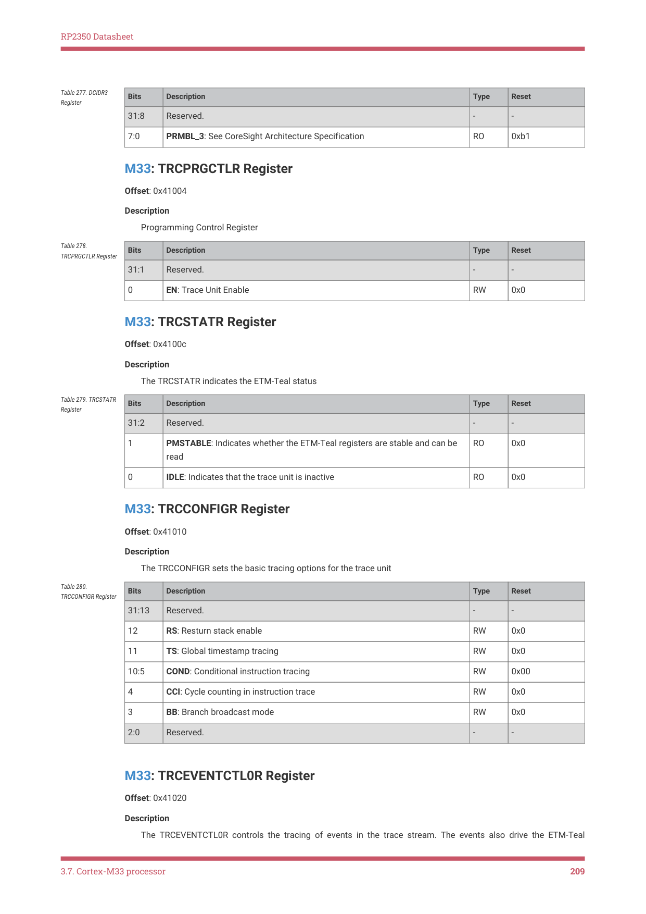

RP2350 Datasheet

| Bits | Description | Type | Reset |
| --- | --- | --- | --- |
| 31:8 | Reserved. | - | - |
| 7:0 | PRMBL_3: See CoreSight Architecture Specification | RO | 0xb1 |

Table 277. DCIDR3

M33: TRCPRGCTLR Register

Offset: 0x41004

Description

Programming Control Register

| Bits | Description | Type | Reset |
| --- | --- | --- | --- |
| 31:1 | Reserved. | - | - |
| 0 | EN: Trace Unit Enable | RW | 0x0 |

Table 278.

M33: TRCSTATR Register

Offset: 0x4100c

Description

The TRCSTATR indicates the ETM-Teal status

| Bits | Description | Type | Reset |
| --- | --- | --- | --- |
| 31:2 | Reserved. | - | - |
| 1 | PMSTABLE: Indicates whether the ETM-Teal registers are stable and can be read | RO | 0x0 |
| 0 | IDLE: Indicates that the trace unit is inactive | RO | 0x0 |

Table 279. TRCSTATR

M33: TRCCONFIGR Register

Offset: 0x41010

Description

The TRCCONFIGR sets the basic tracing options for the trace unit

| Bits | Description | Type | Reset |
| --- | --- | --- | --- |
| 31:13 | Reserved. | - | - |
| 12 | RS: Resturn stack enable | RW | 0x0 |
| 11 | TS: Global timestamp tracing | RW | 0x0 |
| 10:5 | COND: Conditional instruction tracing | RW | 0x00 |
| 4 | CCI: Cycle counting in instruction trace | RW | 0x0 |
| 3 | BB: Branch broadcast mode | RW | 0x0 |
| 2:0 | Reserved. | - | - |

Table 280.

M33: TRCEVENTCTL0R Register

Offset: 0x41020

Description

The TRCEVENTCTL0R controls the tracing of events in the trace stream. The events also drive the ETM-Teal

3.7. Cortex-M33 processor
209

RP2350 Datasheet

external outputs.

| Bits | Description | Type | Reset |
| --- | --- | --- | --- |
| 31:16 | Reserved. | - | - |
| 15 | TYPE1: Selects the resource type for event 1 | RW | 0x0 |
| 14:11 | Reserved. | - | - |
| 10:8 | SEL1: Selects the resource number, based on the value of TYPE1: When TYPE1 is 0, selects a single selected resource from 0-15 defined by SEL1[2:0]. When TYPE1 is 1, selects a Boolean combined resource pair from 0-7 defined by SEL1[2:0] | RW | 0x0 |
| 7 | TYPE0: Selects the resource type for event 0 | RW | 0x0 |
| 6:3 | Reserved. | - | - |
| 2:0 | SEL0: Selects the resource number, based on the value of TYPE0: When TYPE1 is 0, selects a single selected resource from 0-15 defined by SEL0[2:0]. When TYPE1 is 1, selects a Boolean combined resource pair from 0-7 defined by SEL0[2:0] | RW | 0x0 |

Table 281.

TRCEVENTCTL0R

Register

M33: TRCEVENTCTL1R Register

Offset: 0x41024

Description

The TRCEVENTCTL1R controls how the events selected by TRCEVENTCTL0R behave

| Bits | Description | Type | Reset |
| --- | --- | --- | --- |
| 31:13 | Reserved. | - | - |
| 12 | LPOVERRIDE: Low power state behavior override | RW | 0x0 |
| 11 | ATB: ATB enabled | RW | 0x0 |
| 10:2 | Reserved. | - | - |
| 1 | INSTEN1: One bit per event, to enable generation of an event element in the instruction trace stream when the selected event occurs | RW | 0x0 |
| 0 | INSTEN0: One bit per event, to enable generation of an event element in the instruction trace stream when the selected event occurs | RW | 0x0 |

Table 282.

TRCEVENTCTL1R

Register

M33: TRCSTALLCTLR Register

Offset: 0x4102c

Description

The TRCSTALLCTLR enables ETM-Teal to stall the processor if the ETM-Teal FIFO goes over the programmed level

to minimize risk of overflow

| Bits | Description | Type | Reset |
| --- | --- | --- | --- |
| 31:11 | Reserved. | - | - |
| 10 | INSTPRIORITY: Reserved, RES0 | RO | 0x0 |
| 9 | Reserved. | - | - |
| 8 | ISTALL: Stall processor based on instruction trace buffer space | RW | 0x0 |
| 7:4 | Reserved. | - | - |

Table 283.

TRCSTALLCTLR

Register

3.7. Cortex-M33 processor
210

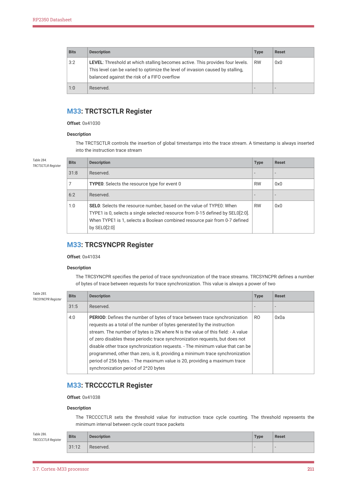

RP2350 Datasheet

| Bits | Description | Type | Reset |
| --- | --- | --- | --- |
| 3:2 | LEVEL: Threshold at which stalling becomes active. This provides four levels. This level can be varied to optimize the level of invasion caused by stalling, balanced against the risk of a FIFO overflow | RW | 0x0 |
| 1:0 | Reserved. | - | - |

M33: TRCTSCTLR Register

Offset: 0x41030

Description

The TRCTSCTLR controls the insertion of global timestamps into the trace stream. A timestamp is always inserted

into the instruction trace stream

| Bits | Description | Type | Reset |
| --- | --- | --- | --- |
| 31:8 | Reserved. | - | - |
| 7 | TYPE0: Selects the resource type for event 0 | RW | 0x0 |
| 6:2 | Reserved. | - | - |
| 1:0 | SEL0: Selects the resource number, based on the value of TYPE0: When TYPE1 is 0, selects a single selected resource from 0-15 defined by SEL0[2:0]. When TYPE1 is 1, selects a Boolean combined resource pair from 0-7 defined by SEL0[2:0] | RW | 0x0 |

Table 284.

M33: TRCSYNCPR Register

Offset: 0x41034

Description

The TRCSYNCPR specifies the period of trace synchronization of the trace streams. TRCSYNCPR defines a number

of bytes of trace between requests for trace synchronization. This value is always a power of two

| Bits | Description | Type | Reset |
| --- | --- | --- | --- |
| 31:5 | Reserved. | - | - |
| 4:0 | PERIOD: Defines the number of bytes of trace between trace synchronization requests as a total of the number of bytes generated by the instruction stream. The number of bytes is 2N where N is the value of this field: - A value of zero disables these periodic trace synchronization requests, but does not disable other trace synchronization requests. - The minimum value that can be programmed, other than zero, is 8, providing a minimum trace synchronization period of 256 bytes. - The maximum value is 20, providing a maximum trace synchronization period of 2^20 bytes | RO | 0x0a |

Table 285.

M33: TRCCCCTLR Register

Offset: 0x41038

Description

The TRCCCCTLR sets the threshold value for instruction trace cycle counting. The threshold represents the

minimum interval between cycle count trace packets

| Bits | Description | Type | Reset |
| --- | --- | --- | --- |
| 31:12 | Reserved. | - | - |

Table 286.

3.7. Cortex-M33 processor
211

RP2350 Datasheet

| Bits | Description | Type | Reset |
| --- | --- | --- | --- |
| 11:0 | THRESHOLD: Instruction trace cycle count threshold | RW | 0x000 |

M33: TRCVICTLR Register

Offset: 0x41080

Description

The TRCVICTLR controls instruction trace filtering

| Bits | Description | Type | Reset |
| --- | --- | --- | --- |
| 31:20 | Reserved. | - | - |
| 19 | EXLEVEL_S3: In Secure state, each bit controls whether instruction tracing is enabled for the corresponding exception level | RW | 0x0 |
| 18:17 | Reserved. | - | - |
| 16 | EXLEVEL_S0: In Secure state, each bit controls whether instruction tracing is enabled for the corresponding exception level | RW | 0x0 |
| 15:12 | Reserved. | - | - |
| 11 | TRCERR: Selects whether a system error exception must always be traced | RW | 0x0 |
| 10 | TRCRESET: Selects whether a reset exception must always be traced | RW | 0x0 |
| 9 | SSSTATUS: Indicates the current status of the start/stop logic | RW | 0x0 |
| 8 | Reserved. | - | - |
| 7 | TYPE0: Selects the resource type for event 0 | RW | 0x0 |
| 6:2 | Reserved. | - | - |
| 1:0 | SEL0: Selects the resource number, based on the value of TYPE0: When TYPE1 is 0, selects a single selected resource from 0-15 defined by SEL0[2:0]. When TYPE1 is 1, selects a Boolean combined resource pair from 0-7 defined by SEL0[2:0] | RW | 0x0 |

Table 287. TRCVICTLR

M33: TRCCNTRLDVR0 Register

Offset: 0x41140

Description

The TRCCNTRLDVR defines the reload value for the reduced function counter

| Bits | Description | Type | Reset |
| --- | --- | --- | --- |
| 31:16 | Reserved. | - | - |
| 15:0 | VALUE: Defines the reload value for the counter. This value is loaded into the counter each time the reload event occurs | RW | 0x0000 |

Table 288.

TRCCNTRLDVR0

Register

M33: TRCIDR8 Register

Offset: 0x41180

Description

TRCIDR8

3.7. Cortex-M33 processor
212

RP2350 Datasheet

| Bits | Description | Type | Reset |
| --- | --- | --- | --- |
| 31:0 | MAXSPEC: reads as `ImpDef | RO | 0x00000000 |

Table 289. TRCIDR8

M33: TRCIDR9 Register

Offset: 0x41184

Description

TRCIDR9

| Bits | Description | Type | Reset |
| --- | --- | --- | --- |
| 31:0 | NUMP0KEY: reads as `ImpDef | RO | 0x00000000 |

Table 290. TRCIDR9

M33: TRCIDR10 Register

Offset: 0x41188

Description

TRCIDR10

| Bits | Description | Type | Reset |
| --- | --- | --- | --- |
| 31:0 | NUMP1KEY: reads as `ImpDef | RO | 0x00000000 |

Table 291. TRCIDR10

M33: TRCIDR11 Register

Offset: 0x4118c

Description

TRCIDR11

| Bits | Description | Type | Reset |
| --- | --- | --- | --- |
| 31:0 | NUMP1SPC: reads as `ImpDef | RO | 0x00000000 |

Table 292. TRCIDR11

M33: TRCIDR12 Register

Offset: 0x41190

Description

TRCIDR12

| Bits | Description | Type | Reset |
| --- | --- | --- | --- |
| 31:0 | NUMCONDKEY: reads as `ImpDef | RO | 0x00000001 |

Table 293. TRCIDR12

M33: TRCIDR13 Register

Offset: 0x41194

Description

TRCIDR13

3.7. Cortex-M33 processor
213

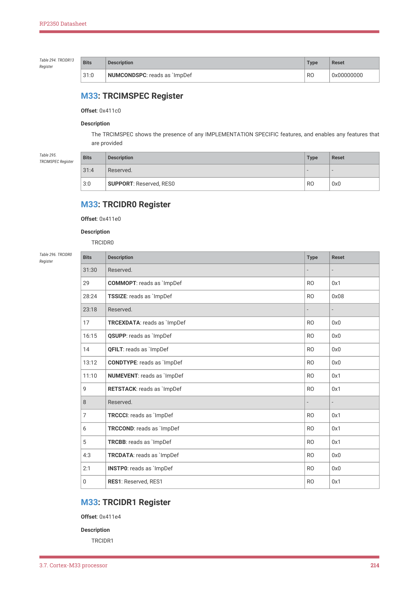

RP2350 Datasheet

| Bits | Description | Type | Reset |
| --- | --- | --- | --- |
| 31:0 | NUMCONDSPC: reads as `ImpDef | RO | 0x00000000 |

Table 294. TRCIDR13

M33: TRCIMSPEC Register

Offset: 0x411c0

Description

The TRCIMSPEC shows the presence of any IMPLEMENTATION SPECIFIC features, and enables any features that

are provided

| Bits | Description | Type | Reset |
| --- | --- | --- | --- |
| 31:4 | Reserved. | - | - |
| 3:0 | SUPPORT: Reserved, RES0 | RO | 0x0 |

Table 295.

M33: TRCIDR0 Register

Offset: 0x411e0

Description

TRCIDR0

| Bits | Description | Type | Reset |
| --- | --- | --- | --- |
| 31:30 | Reserved. | - | - |
| 29 | COMMOPT: reads as `ImpDef | RO | 0x1 |
| 28:24 | TSSIZE: reads as `ImpDef | RO | 0x08 |
| 23:18 | Reserved. | - | - |
| 17 | TRCEXDATA: reads as `ImpDef | RO | 0x0 |
| 16:15 | QSUPP: reads as `ImpDef | RO | 0x0 |
| 14 | QFILT: reads as `ImpDef | RO | 0x0 |
| 13:12 | CONDTYPE: reads as `ImpDef | RO | 0x0 |
| 11:10 | NUMEVENT: reads as `ImpDef | RO | 0x1 |
| 9 | RETSTACK: reads as `ImpDef | RO | 0x1 |
| 8 | Reserved. | - | - |
| 7 | TRCCCI: reads as `ImpDef | RO | 0x1 |
| 6 | TRCCOND: reads as `ImpDef | RO | 0x1 |
| 5 | TRCBB: reads as `ImpDef | RO | 0x1 |
| 4:3 | TRCDATA: reads as `ImpDef | RO | 0x0 |
| 2:1 | INSTP0: reads as `ImpDef | RO | 0x0 |
| 0 | RES1: Reserved, RES1 | RO | 0x1 |

Table 296. TRCIDR0

M33: TRCIDR1 Register

Offset: 0x411e4

Description

TRCIDR1

3.7. Cortex-M33 processor
214

RP2350 Datasheet

| Bits | Description | Type | Reset |
| --- | --- | --- | --- |
| 31:24 | DESIGNER: reads as `ImpDef | RO | 0x41 |
| 23:16 | Reserved. | - | - |
| 15:12 | RES1: Reserved, RES1 | RO | 0xf |
| 11:8 | TRCARCHMAJ: reads as 0b0100 | RO | 0x4 |
| 7:4 | TRCARCHMIN: reads as 0b0000 | RO | 0x2 |
| 3:0 | REVISION: reads as `ImpDef | RO | 0x1 |

Table 297. TRCIDR1

M33: TRCIDR2 Register

Offset: 0x411e8

Description

TRCIDR2

| Bits | Description | Type | Reset |
| --- | --- | --- | --- |
| 31:29 | Reserved. | - | - |
| 28:25 | CCSIZE: reads as `ImpDef | RO | 0x0 |
| 24:20 | DVSIZE: reads as `ImpDef | RO | 0x00 |
| 19:15 | DASIZE: reads as `ImpDef | RO | 0x00 |
| 14:10 | VMIDSIZE: reads as `ImpDef | RO | 0x00 |
| 9:5 | CIDSIZE: reads as `ImpDef | RO | 0x00 |
| 4:0 | IASIZE: reads as `ImpDef | RO | 0x04 |

Table 298. TRCIDR2

M33: TRCIDR3 Register

Offset: 0x411ec

Description

TRCIDR3

| Bits | Description | Type | Reset |
| --- | --- | --- | --- |
| 31 | NOOVERFLOW: reads as `ImpDef | RO | 0x0 |
| 30:28 | NUMPROC: reads as `ImpDef | RO | 0x0 |
| 27 | SYSSTALL: reads as `ImpDef | RO | 0x1 |
| 26 | STALLCTL: reads as `ImpDef | RO | 0x1 |
| 25 | SYNCPR: reads as `ImpDef | RO | 0x1 |
| 24 | TRCERR: reads as `ImpDef | RO | 0x1 |
| 23:20 | EXLEVEL_NS: reads as `ImpDef | RO | 0x0 |
| 19:16 | EXLEVEL_S: reads as `ImpDef | RO | 0x9 |
| 15:12 | Reserved. | - | - |
| 11:0 | CCITMIN: reads as `ImpDef | RO | 0x004 |

Table 299. TRCIDR3

M33: TRCIDR4 Register

3.7. Cortex-M33 processor
215

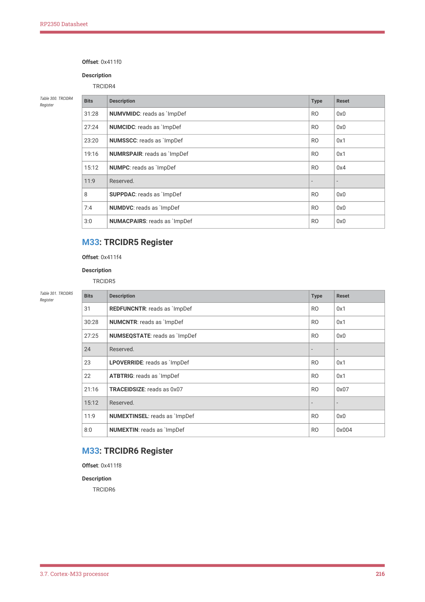

RP2350 Datasheet

Offset: 0x411f0

Description

TRCIDR4

| Bits | Description | Type | Reset |
| --- | --- | --- | --- |
| 31:28 | NUMVMIDC: reads as `ImpDef | RO | 0x0 |
| 27:24 | NUMCIDC: reads as `ImpDef | RO | 0x0 |
| 23:20 | NUMSSCC: reads as `ImpDef | RO | 0x1 |
| 19:16 | NUMRSPAIR: reads as `ImpDef | RO | 0x1 |
| 15:12 | NUMPC: reads as `ImpDef | RO | 0x4 |
| 11:9 | Reserved. | - | - |
| 8 | SUPPDAC: reads as `ImpDef | RO | 0x0 |
| 7:4 | NUMDVC: reads as `ImpDef | RO | 0x0 |
| 3:0 | NUMACPAIRS: reads as `ImpDef | RO | 0x0 |

Table 300. TRCIDR4

M33: TRCIDR5 Register

Offset: 0x411f4

Description

TRCIDR5

| Bits | Description | Type | Reset |
| --- | --- | --- | --- |
| 31 | REDFUNCNTR: reads as `ImpDef | RO | 0x1 |
| 30:28 | NUMCNTR: reads as `ImpDef | RO | 0x1 |
| 27:25 | NUMSEQSTATE: reads as `ImpDef | RO | 0x0 |
| 24 | Reserved. | - | - |
| 23 | LPOVERRIDE: reads as `ImpDef | RO | 0x1 |
| 22 | ATBTRIG: reads as `ImpDef | RO | 0x1 |
| 21:16 | TRACEIDSIZE: reads as 0x07 | RO | 0x07 |
| 15:12 | Reserved. | - | - |
| 11:9 | NUMEXTINSEL: reads as `ImpDef | RO | 0x0 |
| 8:0 | NUMEXTIN: reads as `ImpDef | RO | 0x004 |

Table 301. TRCIDR5

M33: TRCIDR6 Register

Offset: 0x411f8

Description

TRCIDR6

3.7. Cortex-M33 processor
216

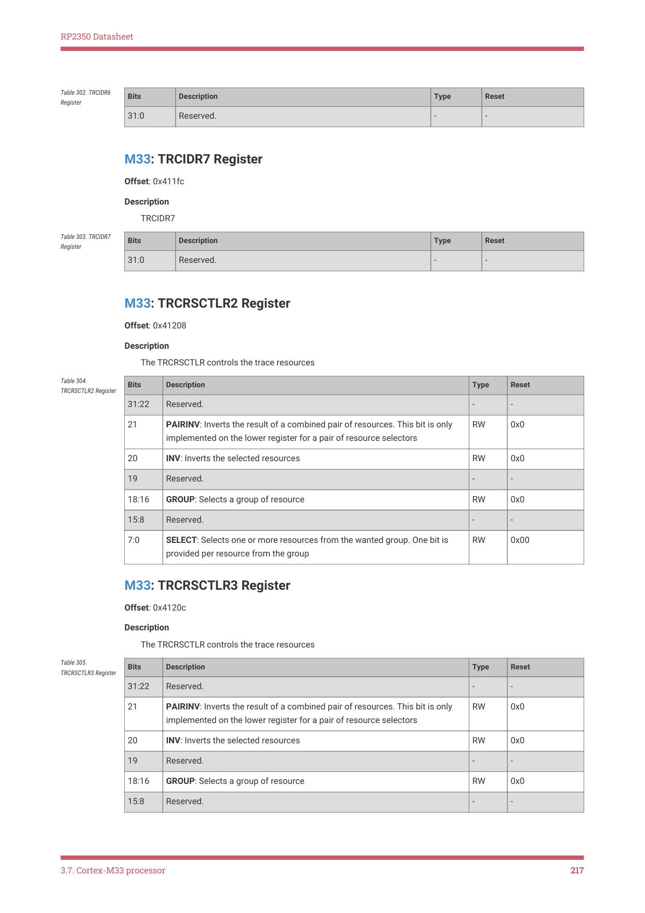

RP2350 Datasheet

| Bits | Description | Type | Reset |
| --- | --- | --- | --- |
| 31:0 | Reserved. | - | - |

Table 302. TRCIDR6

M33: TRCIDR7 Register

Offset: 0x411fc

Description

TRCIDR7

| Bits | Description | Type | Reset |
| --- | --- | --- | --- |
| 31:0 | Reserved. | - | - |

Table 303. TRCIDR7

M33: TRCRSCTLR2 Register

Offset: 0x41208

Description

The TRCRSCTLR controls the trace resources

| Bits | Description | Type | Reset |
| --- | --- | --- | --- |
| 31:22 | Reserved. | - | - |
| 21 | PAIRINV: Inverts the result of a combined pair of resources. This bit is only implemented on the lower register for a pair of resource selectors | RW | 0x0 |
| 20 | INV: Inverts the selected resources | RW | 0x0 |
| 19 | Reserved. | - | - |
| 18:16 | GROUP: Selects a group of resource | RW | 0x0 |
| 15:8 | Reserved. | - | - |
| 7:0 | SELECT: Selects one or more resources from the wanted group. One bit is provided per resource from the group | RW | 0x00 |

Table 304.

M33: TRCRSCTLR3 Register

Offset: 0x4120c

Description

The TRCRSCTLR controls the trace resources

| Bits | Description | Type | Reset |
| --- | --- | --- | --- |
| 31:22 | Reserved. | - | - |
| 21 | PAIRINV: Inverts the result of a combined pair of resources. This bit is only implemented on the lower register for a pair of resource selectors | RW | 0x0 |
| 20 | INV: Inverts the selected resources | RW | 0x0 |
| 19 | Reserved. | - | - |
| 18:16 | GROUP: Selects a group of resource | RW | 0x0 |
| 15:8 | Reserved. | - | - |

Table 305.

3.7. Cortex-M33 processor
217

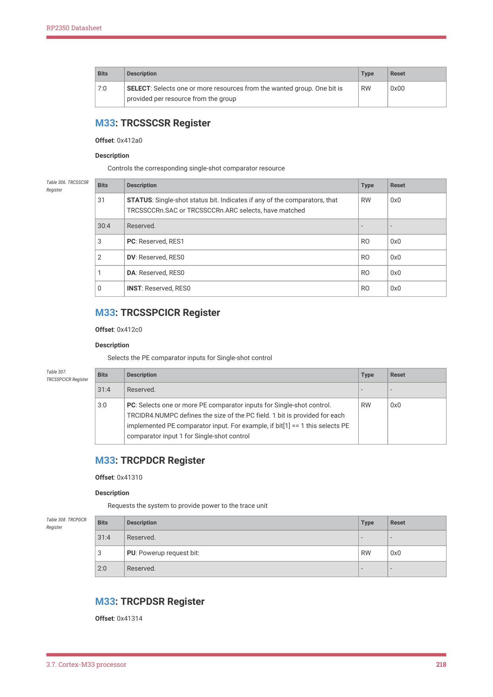

RP2350 Datasheet

| Bits | Description | Type | Reset |
| --- | --- | --- | --- |
| 7:0 | SELECT: Selects one or more resources from the wanted group. One bit is provided per resource from the group | RW | 0x00 |

M33: TRCSSCSR Register

Offset: 0x412a0

Description

Controls the corresponding single-shot comparator resource

| Bits | Description | Type | Reset |
| --- | --- | --- | --- |
| 31 | STATUS: Single-shot status bit. Indicates if any of the comparators, that TRCSSCCRn.SAC or TRCSSCCRn.ARC selects, have matched | RW | 0x0 |
| 30:4 | Reserved. | - | - |
| 3 | PC: Reserved, RES1 | RO | 0x0 |
| 2 | DV: Reserved, RES0 | RO | 0x0 |
| 1 | DA: Reserved, RES0 | RO | 0x0 |
| 0 | INST: Reserved, RES0 | RO | 0x0 |

Table 306. TRCSSCSR

M33: TRCSSPCICR Register

Offset: 0x412c0

Description

Selects the PE comparator inputs for Single-shot control

| Bits | Description | Type | Reset |
| --- | --- | --- | --- |
| 31:4 | Reserved. | - | - |
| 3:0 | PC: Selects one or more PE comparator inputs for Single-shot control. TRCIDR4.NUMPC defines the size of the PC field. 1 bit is provided for each implemented PE comparator input. For example, if bit[1] == 1 this selects PE comparator input 1 for Single-shot control | RW | 0x0 |

Table 307.

M33: TRCPDCR Register

Offset: 0x41310

Description

Requests the system to provide power to the trace unit

| Bits | Description | Type | Reset |
| --- | --- | --- | --- |
| 31:4 | Reserved. | - | - |
| 3 | PU: Powerup request bit: | RW | 0x0 |
| 2:0 | Reserved. | - | - |

Table 308. TRCPDCR

M33: TRCPDSR Register

Offset: 0x41314

3.7. Cortex-M33 processor
218

RP2350 Datasheet

Description

Returns the following information about the trace unit: - OS Lock status. - Core power domain status. - Power

interruption status

| Bits | Description | Type | Reset |
| --- | --- | --- | --- |
| 31:6 | Reserved. | - | - |
| 5 | OSLK: OS Lock status bit: | RO | 0x0 |
| 4:2 | Reserved. | - | - |
| 1 | STICKYPD: Sticky powerdown status bit. Indicates whether the trace register state is valid: | RO | 0x1 |
| 0 | POWER: Power status bit: | RO | 0x1 |

Table 309. TRCPDSR

M33: TRCITATBIDR Register

Offset: 0x41ee4

Description

Trace Intergration ATB Identification Register

| Bits | Description | Type | Reset |
| --- | --- | --- | --- |
| 31:7 | Reserved. | - | - |
| 6:0 | ID: Trace ID | RW | 0x00 |

Table 310.

M33: TRCITIATBINR Register

Offset: 0x41ef4

Description

Trace Integration Instruction ATB In Register

| Bits | Description | Type | Reset |
| --- | --- | --- | --- |
| 31:2 | Reserved. | - | - |
| 1 | AFVALIDM: Integration Mode instruction AFVALIDM in | RW | 0x0 |
| 0 | ATREADYM: Integration Mode instruction ATREADYM in | RW | 0x0 |

Table 311.

TRCITIATBINR

Register

M33: TRCITIATBOUTR Register

Offset: 0x41efc

Description

Trace Integration Instruction ATB Out Register

| Bits | Description | Type | Reset |
| --- | --- | --- | --- |
| 31:2 | Reserved. | - | - |
| 1 | AFREADY: Integration Mode instruction AFREADY out | RW | 0x0 |
| 0 | ATVALID: Integration Mode instruction ATVALID out | RW | 0x0 |

Table 312.

TRCITIATBOUTR

Register

M33: TRCCLAIMSET Register

Offset: 0x41fa0

3.7. Cortex-M33 processor
219

RP2350 Datasheet

Description

Claim Tag Set Register

| Bits | Description | Type | Reset |
| --- | --- | --- | --- |
| 31:4 | Reserved. | - | - |
| 3 | SET3: When a write to one of these bits occurs, with the value: | RW | 0x1 |
| 2 | SET2: When a write to one of these bits occurs, with the value: | RW | 0x1 |
| 1 | SET1: When a write to one of these bits occurs, with the value: | RW | 0x1 |
| 0 | SET0: When a write to one of these bits occurs, with the value: | RW | 0x1 |

Table 313.

TRCCLAIMSET

Register

M33: TRCCLAIMCLR Register

Offset: 0x41fa4

Description

Claim Tag Clear Register

| Bits | Description | Type | Reset |
| --- | --- | --- | --- |
| 31:4 | Reserved. | - | - |
| 3 | CLR3: When a write to one of these bits occurs, with the value: | RW | 0x0 |
| 2 | CLR2: When a write to one of these bits occurs, with the value: | RW | 0x0 |
| 1 | CLR1: When a write to one of these bits occurs, with the value: | RW | 0x0 |
| 0 | CLR0: When a write to one of these bits occurs, with the value: | RW | 0x0 |

Table 314.

TRCCLAIMCLR

Register

M33: TRCAUTHSTATUS Register

Offset: 0x41fb8

Description

Returns the level of tracing that the trace unit can support

| Bits | Description | Type | Reset |
| --- | --- | --- | --- |
| 31:8 | Reserved. | - | - |
| 7:6 | SNID: Indicates whether the system enables the trace unit to support Secure non-invasive debug: | RO | 0x0 |
| 5:4 | SID: Indicates whether the trace unit supports Secure invasive debug: | RO | 0x0 |
| 3:2 | NSNID: Indicates whether the system enables the trace unit to support Non- secure non-invasive debug: | RO | 0x0 |
| 1:0 | NSID: Indicates whether the trace unit supports Non-secure invasive debug: | RO | 0x0 |

Table 315.

TRCAUTHSTATUS

Register

M33: TRCDEVARCH Register

Offset: 0x41fbc

Description

TRCDEVARCH

| Bits | Description | Type | Reset |
| --- | --- | --- | --- |
| 31:21 | ARCHITECT: reads as 0b01000111011 | RO | 0x23b |

Table 316.

3.7. Cortex-M33 processor
220

RP2350 Datasheet

| Bits | Description | Type | Reset |
| --- | --- | --- | --- |
| 20 | PRESENT: reads as 0b1 | RO | 0x1 |
| 19:16 | REVISION: reads as 0b0000 | RO | 0x2 |
| 15:0 | ARCHID: reads as 0b0100101000010011 | RO | 0x4a13 |

M33: TRCDEVID Register

Offset: 0x41fc8

Description

TRCDEVID

| Bits | Description | Type | Reset |
| --- | --- | --- | --- |
| 31:0 | Reserved. | - | - |

Table 317. TRCDEVID

M33: TRCDEVTYPE Register

Offset: 0x41fcc

Description

TRCDEVTYPE

| Bits | Description | Type | Reset |
| --- | --- | --- | --- |
| 31:8 | Reserved. | - | - |
| 7:4 | SUB: reads as 0b0001 | RO | 0x1 |
| 3:0 | MAJOR: reads as 0b0011 | RO | 0x3 |

Table 318.

M33: TRCPIDR4 Register

Offset: 0x41fd0

Description

TRCPIDR4

| Bits | Description | Type | Reset |
| --- | --- | --- | --- |
| 31:8 | Reserved. | - | - |
| 7:4 | SIZE: reads as `ImpDef | RO | 0x0 |
| 3:0 | DES_2: reads as `ImpDef | RO | 0x4 |

Table 319. TRCPIDR4

M33: TRCPIDR5 Register

Offset: 0x41fd4

Description

TRCPIDR5

3.7. Cortex-M33 processor
221

RP2350 Datasheet

| Bits | Description | Type | Reset |
| --- | --- | --- | --- |
| 31:0 | Reserved. | - | - |

Table 320. TRCPIDR5

M33: TRCPIDR6 Register

Offset: 0x41fd8

Description

TRCPIDR6

| Bits | Description | Type | Reset |
| --- | --- | --- | --- |
| 31:0 | Reserved. | - | - |

Table 321. TRCPIDR6

M33: TRCPIDR7 Register

Offset: 0x41fdc

Description

TRCPIDR7

| Bits | Description | Type | Reset |
| --- | --- | --- | --- |
| 31:0 | Reserved. | - | - |

Table 322. TRCPIDR7

M33: TRCPIDR0 Register

Offset: 0x41fe0

Description

TRCPIDR0

| Bits | Description | Type | Reset |
| --- | --- | --- | --- |
| 31:8 | Reserved. | - | - |
| 7:0 | PART_0: reads as `ImpDef | RO | 0x21 |

Table 323. TRCPIDR0

M33: TRCPIDR1 Register

Offset: 0x41fe4

Description

TRCPIDR1

| Bits | Description | Type | Reset |
| --- | --- | --- | --- |
| 31:8 | Reserved. | - | - |
| 7:4 | DES_0: reads as `ImpDef | RO | 0xb |
| 3:0 | PART_0: reads as `ImpDef | RO | 0xd |

Table 324. TRCPIDR1

M33: TRCPIDR2 Register

Offset: 0x41fe8

Description

TRCPIDR2

3.7. Cortex-M33 processor
222

RP2350 Datasheet

| Bits | Description | Type | Reset |
| --- | --- | --- | --- |
| 31:8 | Reserved. | - | - |
| 7:4 | REVISION: reads as `ImpDef | RO | 0x2 |
| 3 | JEDEC: reads as 0b1 | RO | 0x1 |
| 2:0 | DES_0: reads as `ImpDef | RO | 0x3 |

Table 325. TRCPIDR2

M33: TRCPIDR3 Register

Offset: 0x41fec

Description

TRCPIDR3

| Bits | Description | Type | Reset |
| --- | --- | --- | --- |
| 31:8 | Reserved. | - | - |
| 7:4 | REVAND: reads as `ImpDef | RO | 0x0 |
| 3:0 | CMOD: reads as `ImpDef | RO | 0x0 |

Table 326. TRCPIDR3

M33: TRCCIDR0 Register

Offset: 0x41ff0

Description

TRCCIDR0

| Bits | Description | Type | Reset |
| --- | --- | --- | --- |
| 31:8 | Reserved. | - | - |
| 7:0 | PRMBL_0: reads as 0b00001101 | RO | 0x0d |

Table 327. TRCCIDR0

M33: TRCCIDR1 Register

Offset: 0x41ff4

Description

TRCCIDR1

| Bits | Description | Type | Reset |
| --- | --- | --- | --- |
| 31:8 | Reserved. | - | - |
| 7:4 | CLASS: reads as 0b1001 | RO | 0x9 |
| 3:0 | PRMBL_1: reads as 0b0000 | RO | 0x0 |

Table 328. TRCCIDR1

M33: TRCCIDR2 Register

Offset: 0x41ff8

Description

TRCCIDR2

3.7. Cortex-M33 processor
223

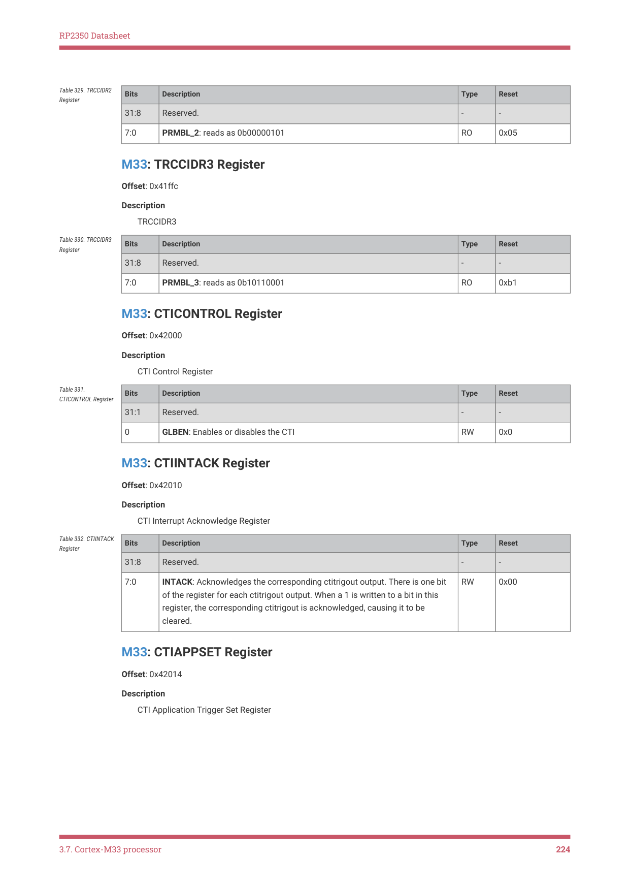

RP2350 Datasheet

| Bits | Description | Type | Reset |
| --- | --- | --- | --- |
| 31:8 | Reserved. | - | - |
| 7:0 | PRMBL_2: reads as 0b00000101 | RO | 0x05 |

Table 329. TRCCIDR2

M33: TRCCIDR3 Register

Offset: 0x41ffc

Description

TRCCIDR3

| Bits | Description | Type | Reset |
| --- | --- | --- | --- |
| 31:8 | Reserved. | - | - |
| 7:0 | PRMBL_3: reads as 0b10110001 | RO | 0xb1 |

Table 330. TRCCIDR3

M33: CTICONTROL Register

Offset: 0x42000

Description

CTI Control Register

| Bits | Description | Type | Reset |
| --- | --- | --- | --- |
| 31:1 | Reserved. | - | - |
| 0 | GLBEN: Enables or disables the CTI | RW | 0x0 |

Table 331.

M33: CTIINTACK Register

Offset: 0x42010

Description

CTI Interrupt Acknowledge Register

| Bits | Description | Type | Reset |
| --- | --- | --- | --- |
| 31:8 | Reserved. | - | - |
| 7:0 | INTACK: Acknowledges the corresponding ctitrigout output. There is one bit of the register for each ctitrigout output. When a 1 is written to a bit in this register, the corresponding ctitrigout is acknowledged, causing it to be cleared. | RW | 0x00 |

Table 332. CTIINTACK

M33: CTIAPPSET Register

Offset: 0x42014

Description

CTI Application Trigger Set Register

3.7. Cortex-M33 processor
224

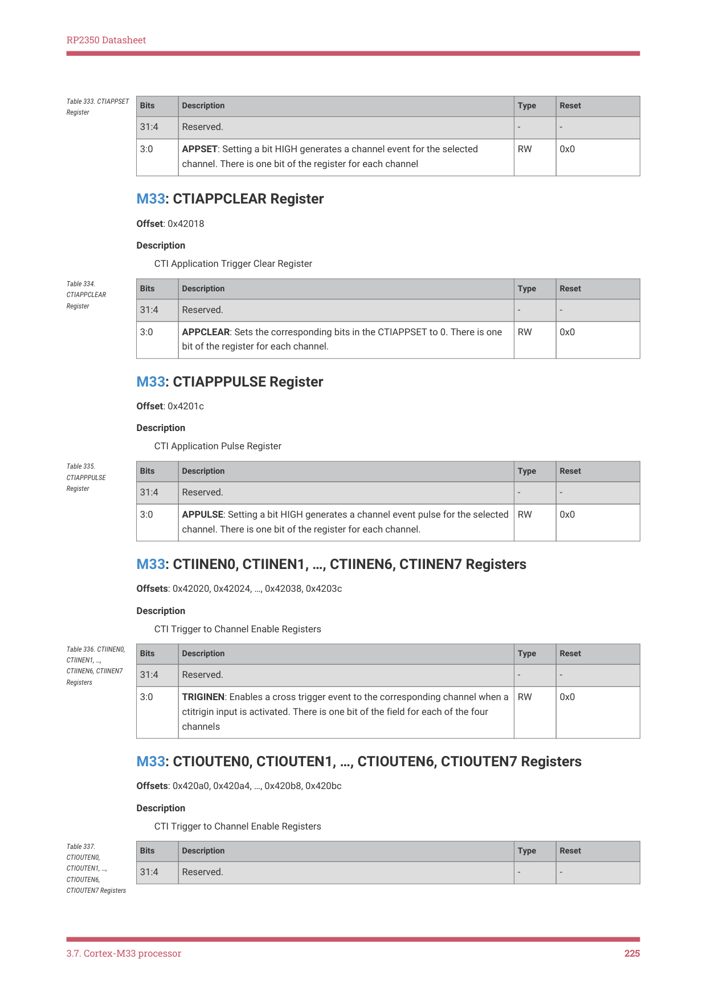

RP2350 Datasheet

| Bits | Description | Type | Reset |
| --- | --- | --- | --- |
| 31:4 | Reserved. | - | - |
| 3:0 | APPSET: Setting a bit HIGH generates a channel event for the selected channel. There is one bit of the register for each channel | RW | 0x0 |

Table 333. CTIAPPSET

M33: CTIAPPCLEAR Register

Offset: 0x42018

Description

CTI Application Trigger Clear Register

| Bits | Description | Type | Reset |
| --- | --- | --- | --- |
| 31:4 | Reserved. | - | - |
| 3:0 | APPCLEAR: Sets the corresponding bits in the CTIAPPSET to 0. There is one bit of the register for each channel. | RW | 0x0 |

Table 334.

CTIAPPCLEAR

Register

M33: CTIAPPPULSE Register

Offset: 0x4201c

Description

CTI Application Pulse Register

| Bits | Description | Type | Reset |
| --- | --- | --- | --- |
| 31:4 | Reserved. | - | - |
| 3:0 | APPULSE: Setting a bit HIGH generates a channel event pulse for the selected channel. There is one bit of the register for each channel. | RW | 0x0 |

Table 335.

CTIAPPPULSE

Register

M33: CTIINEN0, CTIINEN1, …, CTIINEN6, CTIINEN7 Registers

Offsets: 0x42020, 0x42024, …, 0x42038, 0x4203c

Description

CTI Trigger to Channel Enable Registers

| Bits | Description | Type | Reset |
| --- | --- | --- | --- |
| 31:4 | Reserved. | - | - |
| 3:0 | TRIGINEN: Enables a cross trigger event to the corresponding channel when a ctitrigin input is activated. There is one bit of the field for each of the four channels | RW | 0x0 |

Table 336. CTIINEN0,

CTIINEN1, …,

CTIINEN6, CTIINEN7

Registers

M33: CTIOUTEN0, CTIOUTEN1, …, CTIOUTEN6, CTIOUTEN7 Registers

Offsets: 0x420a0, 0x420a4, …, 0x420b8, 0x420bc

Description

CTI Trigger to Channel Enable Registers

| Bits | Description | Type | Reset |
| --- | --- | --- | --- |
| 31:4 | Reserved. | - | - |

Table 337.

CTIOUTEN0,

CTIOUTEN1, …,

CTIOUTEN6,

CTIOUTEN7 Registers

3.7. Cortex-M33 processor
225

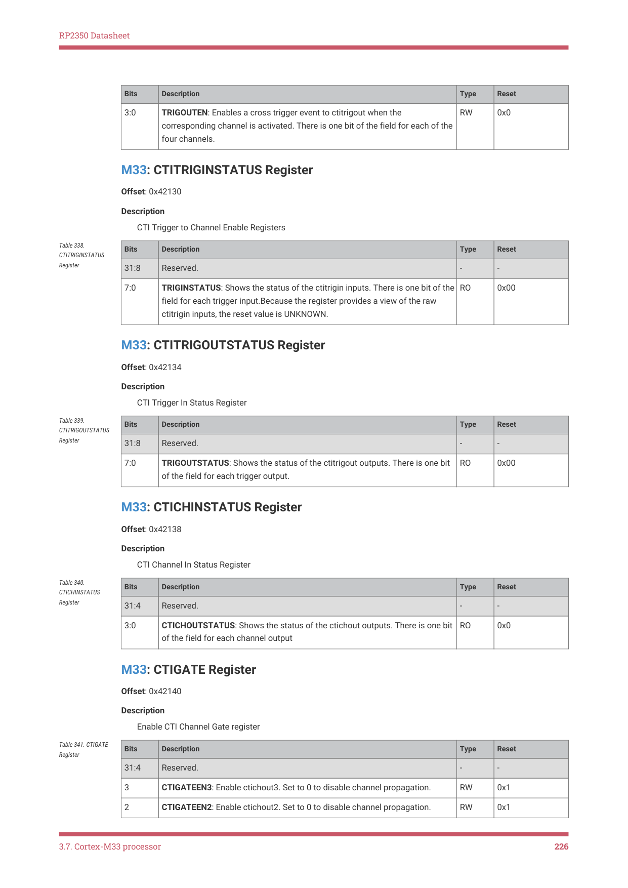

RP2350 Datasheet

| Bits | Description | Type | Reset |
| --- | --- | --- | --- |
| 3:0 | TRIGOUTEN: Enables a cross trigger event to ctitrigout when the corresponding channel is activated. There is one bit of the field for each of the four channels. | RW | 0x0 |

M33: CTITRIGINSTATUS Register

Offset: 0x42130

Description

CTI Trigger to Channel Enable Registers

| Bits | Description | Type | Reset |
| --- | --- | --- | --- |
| 31:8 | Reserved. | - | - |
| 7:0 | TRIGINSTATUS: Shows the status of the ctitrigin inputs. There is one bit of the field for each trigger input.Because the register provides a view of the raw ctitrigin inputs, the reset value is UNKNOWN. | RO | 0x00 |

Table 338.

CTITRIGINSTATUS

Register

M33: CTITRIGOUTSTATUS Register

Offset: 0x42134

Description

CTI Trigger In Status Register

| Bits | Description | Type | Reset |
| --- | --- | --- | --- |
| 31:8 | Reserved. | - | - |
| 7:0 | TRIGOUTSTATUS: Shows the status of the ctitrigout outputs. There is one bit of the field for each trigger output. | RO | 0x00 |

Table 339.

CTITRIGOUTSTATUS

Register

M33: CTICHINSTATUS Register

Offset: 0x42138

Description

CTI Channel In Status Register

| Bits | Description | Type | Reset |
| --- | --- | --- | --- |
| 31:4 | Reserved. | - | - |
| 3:0 | CTICHOUTSTATUS: Shows the status of the ctichout outputs. There is one bit of the field for each channel output | RO | 0x0 |

Table 340.

CTICHINSTATUS

Register

M33: CTIGATE Register

Offset: 0x42140

Description

Enable CTI Channel Gate register

| Bits | Description | Type | Reset |
| --- | --- | --- | --- |
| 31:4 | Reserved. | - | - |
| 3 | CTIGATEEN3: Enable ctichout3. Set to 0 to disable channel propagation. | RW | 0x1 |
| 2 | CTIGATEEN2: Enable ctichout2. Set to 0 to disable channel propagation. | RW | 0x1 |

Table 341. CTIGATE

3.7. Cortex-M33 processor
226

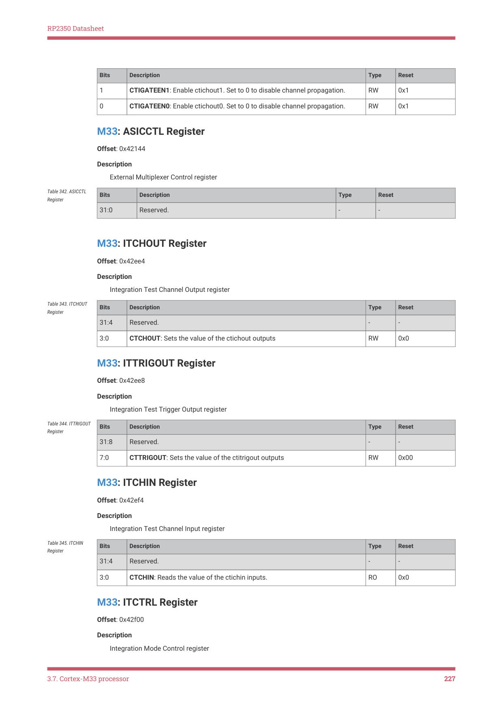

RP2350 Datasheet

| Bits | Description | Type | Reset |
| --- | --- | --- | --- |
| 1 | CTIGATEEN1: Enable ctichout1. Set to 0 to disable channel propagation. | RW | 0x1 |
| 0 | CTIGATEEN0: Enable ctichout0. Set to 0 to disable channel propagation. | RW | 0x1 |

M33: ASICCTL Register

Offset: 0x42144

Description

External Multiplexer Control register

| Bits | Description | Type | Reset |
| --- | --- | --- | --- |
| 31:0 | Reserved. | - | - |

Table 342. ASICCTL

M33: ITCHOUT Register

Offset: 0x42ee4

Description

Integration Test Channel Output register

| Bits | Description | Type | Reset |
| --- | --- | --- | --- |
| 31:4 | Reserved. | - | - |
| 3:0 | CTCHOUT: Sets the value of the ctichout outputs | RW | 0x0 |

Table 343. ITCHOUT

M33: ITTRIGOUT Register

Offset: 0x42ee8

Description

Integration Test Trigger Output register

| Bits | Description | Type | Reset |
| --- | --- | --- | --- |
| 31:8 | Reserved. | - | - |
| 7:0 | CTTRIGOUT: Sets the value of the ctitrigout outputs | RW | 0x00 |

Table 344. ITTRIGOUT

M33: ITCHIN Register

Offset: 0x42ef4

Description

Integration Test Channel Input register

| Bits | Description | Type | Reset |
| --- | --- | --- | --- |
| 31:4 | Reserved. | - | - |
| 3:0 | CTCHIN: Reads the value of the ctichin inputs. | RO | 0x0 |

Table 345. ITCHIN

M33: ITCTRL Register

Offset: 0x42f00

Description

Integration Mode Control register

3.7. Cortex-M33 processor
227

RP2350 Datasheet

| Bits | Description | Type | Reset |
| --- | --- | --- | --- |
| 31:1 | Reserved. | - | - |
| 0 | IME: Integration Mode Enable | RW | 0x0 |

Table 346. ITCTRL

M33: DEVARCH Register

Offset: 0x42fbc

Description

Device Architecture register

| Bits | Description | Type | Reset |
| --- | --- | --- | --- |
| 31:21 | ARCHITECT: Indicates the component architect | RO | 0x23b |
| 20 | PRESENT: Indicates whether the DEVARCH register is present | RO | 0x1 |
| 19:16 | REVISION: Indicates the architecture revision | RO | 0x0 |
| 15:0 | ARCHID: Indicates the component | RO | 0x1a14 |

Table 347. DEVARCH

M33: DEVID Register

Offset: 0x42fc8

Description

Device Configuration register

| Bits | Description | Type | Reset |
| --- | --- | --- | --- |
| 31:20 | Reserved. | - | - |
| 19:16 | NUMCH: Number of ECT channels available | RO | 0x4 |
| 15:8 | NUMTRIG: Number of ECT triggers available. | RO | 0x08 |
| 7:5 | Reserved. | - | - |
| 4:0 | EXTMUXNUM: Indicates the number of multiplexers available on Trigger Inputs and Trigger Outputs that are using asicctl. The default value of 0b00000 indicates that no multiplexing is present. This value of this bit depends on the Verilog define EXTMUXNUM that you must change accordingly. | RO | 0x00 |

Table 348. DEVID

M33: DEVTYPE Register

Offset: 0x42fcc

Description

Device Type Identifier register

| Bits | Description | Type | Reset |
| --- | --- | --- | --- |
| 31:8 | Reserved. | - | - |
| 7:4 | SUB: Sub-classification of the type of the debug component as specified in the ARM Architecture Specification within the major classification as specified in the MAJOR field. | RO | 0x1 |
| 3:0 | MAJOR: Major classification of the type of the debug component as specified in the ARM Architecture Specification for this debug and trace component. | RO | 0x4 |

Table 349. DEVTYPE

3.7. Cortex-M33 processor
228

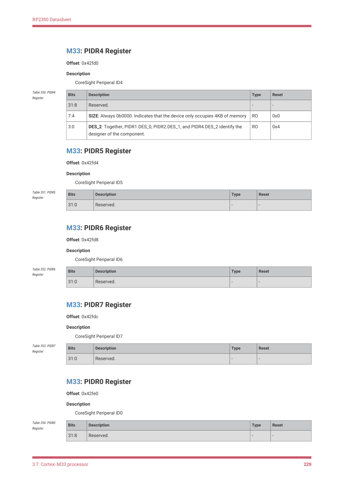

RP2350 Datasheet

M33: PIDR4 Register

Offset: 0x42fd0

Description

CoreSight Periperal ID4

| Bits | Description | Type | Reset |
| --- | --- | --- | --- |
| 31:8 | Reserved. | - | - |
| 7:4 | SIZE: Always 0b0000. Indicates that the device only occupies 4KB of memory | RO | 0x0 |
| 3:0 | DES_2: Together, PIDR1.DES_0, PIDR2.DES_1, and PIDR4.DES_2 identify the designer of the component. | RO | 0x4 |

Table 350. PIDR4

M33: PIDR5 Register

Offset: 0x42fd4

Description

CoreSight Periperal ID5

| Bits | Description | Type | Reset |
| --- | --- | --- | --- |
| 31:0 | Reserved. | - | - |

Table 351. PIDR5

M33: PIDR6 Register

Offset: 0x42fd8

Description

CoreSight Periperal ID6

| Bits | Description | Type | Reset |
| --- | --- | --- | --- |
| 31:0 | Reserved. | - | - |

Table 352. PIDR6

M33: PIDR7 Register

Offset: 0x42fdc

Description

CoreSight Periperal ID7

| Bits | Description | Type | Reset |
| --- | --- | --- | --- |
| 31:0 | Reserved. | - | - |

Table 353. PIDR7

M33: PIDR0 Register

Offset: 0x42fe0

Description

CoreSight Periperal ID0

| Bits | Description | Type | Reset |
| --- | --- | --- | --- |
| 31:8 | Reserved. | - | - |

Table 354. PIDR0

3.7. Cortex-M33 processor
229

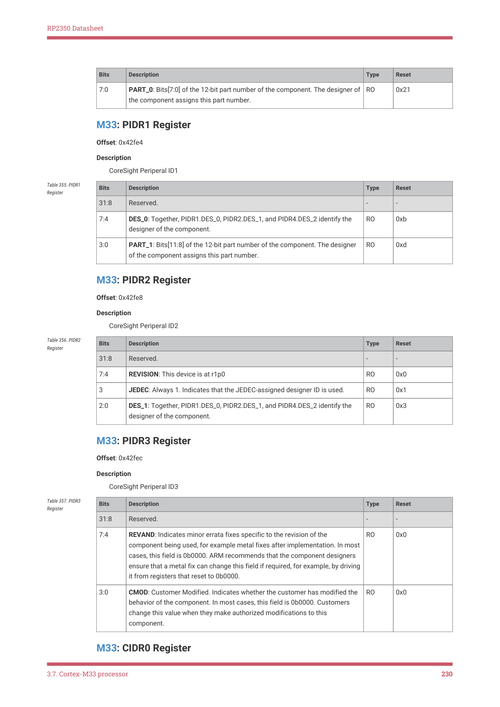

RP2350 Datasheet

| Bits | Description | Type | Reset |
| --- | --- | --- | --- |
| 7:0 | PART_0: Bits[7:0] of the 12-bit part number of the component. The designer of the component assigns this part number. | RO | 0x21 |

M33: PIDR1 Register

Offset: 0x42fe4

Description

CoreSight Periperal ID1

| Bits | Description | Type | Reset |
| --- | --- | --- | --- |
| 31:8 | Reserved. | - | - |
| 7:4 | DES_0: Together, PIDR1.DES_0, PIDR2.DES_1, and PIDR4.DES_2 identify the designer of the component. | RO | 0xb |
| 3:0 | PART_1: Bits[11:8] of the 12-bit part number of the component. The designer of the component assigns this part number. | RO | 0xd |

Table 355. PIDR1

M33: PIDR2 Register

Offset: 0x42fe8

Description

CoreSight Periperal ID2

| Bits | Description | Type | Reset |
| --- | --- | --- | --- |
| 31:8 | Reserved. | - | - |
| 7:4 | REVISION: This device is at r1p0 | RO | 0x0 |
| 3 | JEDEC: Always 1. Indicates that the JEDEC-assigned designer ID is used. | RO | 0x1 |
| 2:0 | DES_1: Together, PIDR1.DES_0, PIDR2.DES_1, and PIDR4.DES_2 identify the designer of the component. | RO | 0x3 |

Table 356. PIDR2

M33: PIDR3 Register

Offset: 0x42fec

Description

CoreSight Periperal ID3

| Bits | Description | Type | Reset |
| --- | --- | --- | --- |
| 31:8 | Reserved. | - | - |
| 7:4 | REVAND: Indicates minor errata fixes specific to the revision of the component being used, for example metal fixes after implementation. In most cases, this field is 0b0000. ARM recommends that the component designers ensure that a metal fix can change this field if required, for example, by driving it from registers that reset to 0b0000. | RO | 0x0 |
| 3:0 | CMOD: Customer Modified. Indicates whether the customer has modified the behavior of the component. In most cases, this field is 0b0000. Customers change this value when they make authorized modifications to this component. | RO | 0x0 |

Table 357. PIDR3

M33: CIDR0 Register

3.7. Cortex-M33 processor
230

RP2350 Datasheet

Offset: 0x42ff0

Description

CoreSight Component ID0

| Bits | Description | Type | Reset |
| --- | --- | --- | --- |
| 31:8 | Reserved. | - | - |
| 7:0 | PRMBL_0: Preamble[0]. Contains bits[7:0] of the component identification code | RO | 0x0d |

Table 358. CIDR0

M33: CIDR1 Register

Offset: 0x42ff4

Description

CoreSight Component ID1

| Bits | Description | Type | Reset |
| --- | --- | --- | --- |
| 31:8 | Reserved. | - | - |
| 7:4 | CLASS: Class of the component, for example, whether the component is a ROM table or a generic CoreSight component. Contains bits[15:12] of the component identification code. | RO | 0x9 |
| 3:0 | PRMBL_1: Preamble[1]. Contains bits[11:8] of the component identification code. | RO | 0x0 |

Table 359. CIDR1

M33: CIDR2 Register

Offset: 0x42ff8

Description

CoreSight Component ID2

| Bits | Description | Type | Reset |
| --- | --- | --- | --- |
| 31:8 | Reserved. | - | - |
| 7:0 | PRMBL_2: Preamble[2]. Contains bits[23:16] of the component identification code. | RO | 0x05 |

Table 360. CIDR2

M33: CIDR3 Register

Offset: 0x42ffc

Description

CoreSight Component ID3

| Bits | Description | Type | Reset |
| --- | --- | --- | --- |
| 31:8 | Reserved. | - | - |
| 7:0 | PRMBL_3: Preamble[3]. Contains bits[31:24] of the component identification code. | RO | 0xb1 |

Table 361. CIDR3

3.7.5.1. Cortex-M33 EPPB registers

The EPPB (Extended Private Peripheral Bus) contains registers implemented by Raspberry Pi and integrated into the

Cortex-M33 PPB to provide per-processor controls for certain RP2350 features. There is one copy of these registers per

3.7. Cortex-M33 processor
231

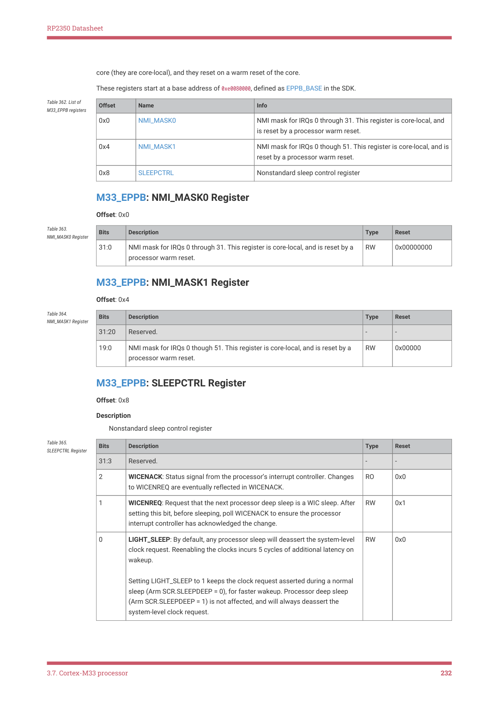

RP2350 Datasheet

core (they are core-local), and they reset on a warm reset of the core.

These registers start at a base address of 0xe0080000, defined as EPPB_BASE in the SDK.

| Offset | Name | Info |
| --- | --- | --- |
| 0x0 | NMI_MASK0 | NMI mask for IRQs 0 through 31. This register is core-local, and is reset by a processor warm reset. |
| 0x4 | NMI_MASK1 | NMI mask for IRQs 0 though 51. This register is core-local, and is reset by a processor warm reset. |
| 0x8 | SLEEPCTRL | Nonstandard sleep control register |

Table 362. List of

M33_EPPB: NMI_MASK0 Register

Offset: 0x0

| Bits | Description | Type | Reset |
| --- | --- | --- | --- |
| 31:0 | NMI mask for IRQs 0 through 31. This register is core-local, and is reset by a processor warm reset. | RW | 0x00000000 |

Table 363.

M33_EPPB: NMI_MASK1 Register

Offset: 0x4

| Bits | Description | Type | Reset |
| --- | --- | --- | --- |
| 31:20 | Reserved. | - | - |
| 19:0 | NMI mask for IRQs 0 though 51. This register is core-local, and is reset by a processor warm reset. | RW | 0x00000 |

Table 364.

M33_EPPB: SLEEPCTRL Register

Offset: 0x8

Description

Nonstandard sleep control register

| Bits | Description | Type | Reset |
| --- | --- | --- | --- |
| 31:3 | Reserved. | - | - |
| 2 | WICENACK: Status signal from the processor’s interrupt controller. Changes to WICENREQ are eventually reflected in WICENACK. | RO | 0x0 |
| 1 | WICENREQ: Request that the next processor deep sleep is a WIC sleep. After setting this bit, before sleeping, poll WICENACK to ensure the processor interrupt controller has acknowledged the change. | RW | 0x1 |
| 0 | LIGHT_SLEEP: By default, any processor sleep will deassert the system-level clock request. Reenabling the clocks incurs 5 cycles of additional latency on wakeup. Setting LIGHT_SLEEP to 1 keeps the clock request asserted during a normal sleep (Arm SCR.SLEEPDEEP = 0), for faster wakeup. Processor deep sleep (Arm SCR.SLEEPDEEP = 1) is not affected, and will always deassert the system-level clock request. | RW | 0x0 |

Table 365.

3.7. Cortex-M33 processor
232
