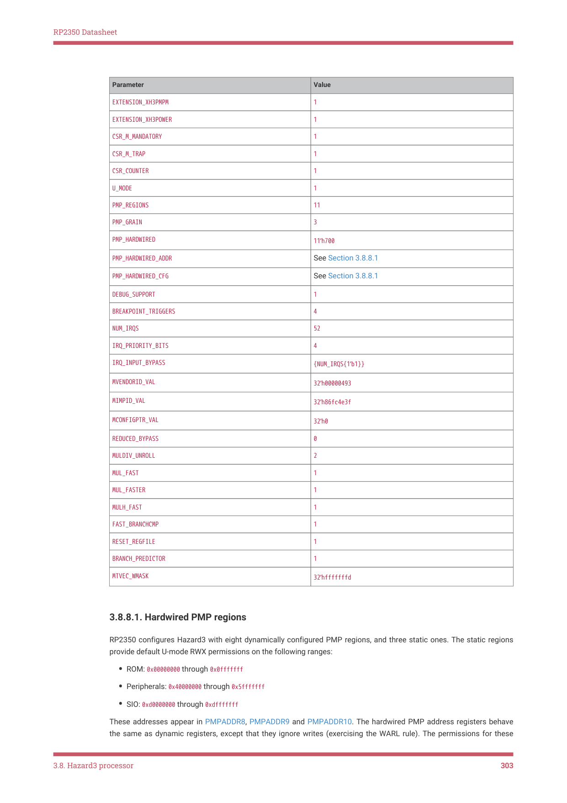

# 3.8.8. Configuration

RP2350 Datasheet

• There are no bus stalls on the instruction fetch port

This is because the branch predictor lookup functions by comparing bits 31:2 of the sequential-fetch counter to the BTB

tag. In this case the BTB tag points to the same word as the loop entry. In the aforementioned case the sequential-fetch

counter never actually contains the address of the loop entry, because the loop entry address goes straight to the bus,

and the sequential-fetch counter pre-increments to the next address. This manifests in delay loops like the following:

.p2align 2

delay_loop_bad_dont_copy_paste_this:

    addi a0, a0, -1

    bgez a0, delay_loop_bad_dont_copy_paste_this

Given the description in Section 3.8.7.10, you might expect this loop to execute at two cycles per iteration in the steady

state. The actual behaviour is it executes at three cycles per iteration until instruction fetch encounters a stall,

whereupon it accelerates to two cycles per instruction until the loop ends.

Avoid this by using a 32-bit instruction in the loop body. Force 32-bit alignment of the loop body to avoid an alignment

penalty. The following code executes at the expected two cycles per iteration in the steady state:

.p2align 2          // Force 4-byte alignment

delay_cycles:

.option push

.option norvc       // Force 32-bit opcode

    addi a0, a0, -1

.option pop

    bgez a0, delay_cycles

3.8.8. Configuration

Hazard3 uses the parameters given in the hazard3_config.vh header to customise the core. These values are set before

taping out a Hazard3 instance on silicon, so they are fixed from a user point of view. They determine which instructions

the processor supports, the area-performance trade-off for certain instructions, and static configuration for core

peripherals like the PMP. RP2350 uses the following values for these parameters:

| Parameter | Value |
| --- | --- |
| EXTENSION A _ | 1 |
| EXTENSION C _ | 1 |
| EXTENSION M _ | 1 |
| EXTENSION ZBA _ | 1 |
| EXTENSION ZBB _ | 1 |
| EXTENSION ZBC _ | 0 |
| EXTENSION ZBS _ | 1 |
| EXTENSION ZCB _ | 1 |
| EXTENSION ZCMP _ | 1 |
| EXTENSION ZBKB _ | 1 |
| EXTENSION ZIFENCEI _ | 1 |
| EXTENSION XH3BEXTM _ | 1 |
| EXTENSION XH3IRQ _ | 1 |

3.8. Hazard3 processor
302

RP2350 Datasheet

| Parameter | Value |
| --- | --- |
| EXTENSION XH3PMPM _ | 1 |
| EXTENSION XH3POWER _ | 1 |
| CSR M MANDATORY _ _ | 1 |
| CSR M TRAP _ _ | 1 |
| CSR COUNTER _ | 1 |
| U MODE _ | 1 |
| PMP REGIONS _ | 11 |
| PMP GRAIN _ | 3 |
| PMP HARDWIRED _ | 11’h700 |
| PMP HARDWIRED ADDR _ _ | See Section 3.8.8.1 |
| PMP HARDWIRED CFG _ _ | See Section 3.8.8.1 |
| DEBUG SUPPORT _ | 1 |
| BREAKPOINT TRIGGERS _ | 4 |
| NUM IRQS _ | 52 |
| IRQ PRIORITY BITS _ _ | 4 |
| IRQ INPUT BYPASS _ _ | {NUM IRQS{1’b1}} _ |
| MVENDORID VAL _ | 32’h00000493 |
| MIMPID VAL _ | 32’h86fc4e3f |
| MCONFIGPTR VAL _ | 32’h0 |
| REDUCED BYPASS _ | 0 |
| MULDIV UNROLL _ | 2 |
| MUL FAST _ | 1 |
| MUL FASTER _ | 1 |
| MULH FAST _ | 1 |
| FAST BRANCHCMP _ | 1 |
| RESET REGFILE _ | 1 |
| BRANCH PREDICTOR _ | 1 |
| MTVEC WMASK _ | 32’hfffffffd |

3.8.8.1. Hardwired PMP regions

RP2350 configures Hazard3 with eight dynamically configured PMP regions, and three static ones. The static regions

provide default U-mode RWX permissions on the following ranges:

• ROM: 0x00000000 through 0x0fffffff
• Peripherals: 0x40000000 through 0x5fffffff
• SIO: 0xd0000000 through 0xdfffffff

These addresses appear in PMPADDR8, PMPADDR9 and PMPADDR10. The hardwired PMP address registers behave

the same as dynamic registers, except that they ignore writes (exercising the WARL rule). The permissions for these

3.8. Hazard3 processor
303
