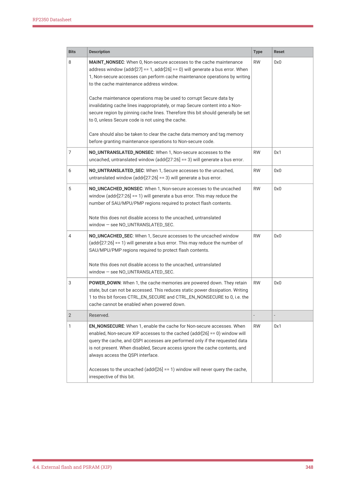
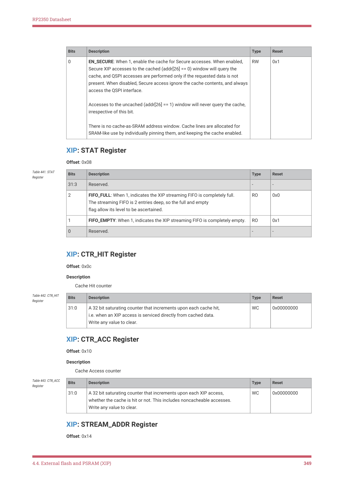

# 4.4.5. List of XIP_CTRL registers

RP2350 Datasheet

the FIFOs through the QMI APB configuration port. When QMI access chaining is enabled, the streaming XIP DMA is

close to the maximum theoretical QSPI throughput, but the direct-mode FIFOs are available on AHB for situations that

require 100% of the theoretical throughput.

Pico Examples: https://github.com/raspberrypi/pico-examples/blob/master/flash/xip_stream/flash_xip_stream.c Lines 58 - 70

58     const uint dma_chan = 0;

59     dma_channel_config cfg = dma_channel_get_default_config(dma_chan);

60     channel_config_set_read_increment(&cfg, false);

61     channel_config_set_write_increment(&cfg, true);

62     channel_config_set_dreq(&cfg, DREQ_XIP_STREAM);

63     dma_channel_configure(

64             dma_chan,

65             &cfg,

66             (void *) buf,                 // Write addr

67             (const void *) XIP_AUX_BASE,  // Read addr

68             count_of(random_test_data), // Transfer count

69             true                        // Start immediately!

70     );

4.4.4. Performance counters

The XIP subsystem provides two performance counters. These are 32 bits in size, saturate upon reaching 0xffffffff,

and are cleared by writing any value. They count:

1. The total number of XIP accesses, to any alias

2. The number of XIP accesses that resulted in a cache hit

This provides a way to profile the cache hit rate for common use cases.

4.4.5. List of XIP_CTRL registers

The XIP control registers start at a base address of 0x400c8000 (defined as XIP_CTRL_BASE in SDK).

| Offset | Name | Info |
| --- | --- | --- |
| 0x00 | CTRL | Cache control register. Read-only from a Non-secure context. |
| 0x08 | STAT |  |
| 0x0c | CTR_HIT | Cache Hit counter |
| 0x10 | CTR_ACC | Cache Access counter |
| 0x14 | STREAM_ADDR | FIFO stream address |
| 0x18 | STREAM_CTR | FIFO stream control |
| 0x1c | STREAM_FIFO | FIFO stream data |

Table 439. List of XIP

XIP: CTRL Register

Offset: 0x00

Description

Cache control register. Read-only from a Non-secure context.

4.4. External flash and PSRAM (XIP)
346

RP2350 Datasheet

| Bits | Description | Type | Reset |
| --- | --- | --- | --- |
| 31:12 | Reserved. | - | - |
| 11 | WRITABLE_M1: If 1, enable writes to XIP memory window 1 (addresses 0x11000000 through 0x11ffffff, and their uncached mirrors). If 0, this region is read-only. XIP memory is read-only by default. This bit must be set to enable writes if a RAM device is attached on QSPI chip select 1. The default read-only behaviour avoids two issues with writing to a read-only QSPI device (e.g. flash). First, a write will initially appear to succeed due to caching, but the data will eventually be lost when the written line is evicted, causing unpredictable behaviour. Second, when a written line is evicted, it will cause a write command to be issued to the flash, which can break the flash out of its continuous read mode. After this point, flash reads will return garbage. This is a security concern, as it allows Non-secure software to break Secure flash reads if it has permission to write to any flash address. Note the read-only behaviour is implemented by downgrading writes to reads, so writes will still cause allocation of an address, but have no other effect. | RW | 0x0 |
| 10 | WRITABLE_M0: If 1, enable writes to XIP memory window 0 (addresses 0x10000000 through 0x10ffffff, and their uncached mirrors). If 0, this region is read-only. XIP memory is read-only by default. This bit must be set to enable writes if a RAM device is attached on QSPI chip select 0. The default read-only behaviour avoids two issues with writing to a read-only QSPI device (e.g. flash). First, a write will initially appear to succeed due to caching, but the data will eventually be lost when the written line is evicted, causing unpredictable behaviour. Second, when a written line is evicted, it will cause a write command to be issued to the flash, which can break the flash out of its continuous read mode. After this point, flash reads will return garbage. This is a security concern, as it allows Non-secure software to break Secure flash reads if it has permission to write to any flash address. Note the read-only behaviour is implemented by downgrading writes to reads, so writes will still cause allocation of an address, but have no other effect. | RW | 0x0 |
| 9 | SPLIT_WAYS: When 1, route all cached+Secure accesses to way 0 of the cache, and route all cached+Non-secure accesses to way 1 of the cache. This partitions the cache into two half-sized direct-mapped regions, such that Non-secure code can not observe cache line state changes caused by Secure execution. A full cache flush is required when changing the value of SPLIT_WAYS. The flush should be performed whilst SPLIT_WAYS is 0, so that both cache ways are accessible for invalidation. | RW | 0x0 |

Table 440. CTRL

4.4. External flash and PSRAM (XIP)
347

RP2350 Datasheet

| Bits | Description | Type | Reset |
| --- | --- | --- | --- |
| 8 | MAINT_NONSEC: When 0, Non-secure accesses to the cache maintenance address window (addr[27] == 1, addr[26] == 0) will generate a bus error. When 1, Non-secure accesses can perform cache maintenance operations by writing to the cache maintenance address window. Cache maintenance operations may be used to corrupt Secure data by invalidating cache lines inappropriately, or map Secure content into a Non- secure region by pinning cache lines. Therefore this bit should generally be set to 0, unless Secure code is not using the cache. Care should also be taken to clear the cache data memory and tag memory before granting maintenance operations to Non-secure code. | RW | 0x0 |
| 7 | NO_UNTRANSLATED_NONSEC: When 1, Non-secure accesses to the uncached, untranslated window (addr[27:26] == 3) will generate a bus error. | RW | 0x1 |
| 6 | NO_UNTRANSLATED_SEC: When 1, Secure accesses to the uncached, untranslated window (addr[27:26] == 3) will generate a bus error. | RW | 0x0 |
| 5 | NO_UNCACHED_NONSEC: When 1, Non-secure accesses to the uncached window (addr[27:26] == 1) will generate a bus error. This may reduce the number of SAU/MPU/PMP regions required to protect flash contents. Note this does not disable access to the uncached, untranslated window — see NO_UNTRANSLATED_SEC. | RW | 0x0 |
| 4 | NO_UNCACHED_SEC: When 1, Secure accesses to the uncached window (addr[27:26] == 1) will generate a bus error. This may reduce the number of SAU/MPU/PMP regions required to protect flash contents. Note this does not disable access to the uncached, untranslated window — see NO_UNTRANSLATED_SEC. | RW | 0x0 |
| 3 | POWER_DOWN: When 1, the cache memories are powered down. They retain state, but can not be accessed. This reduces static power dissipation. Writing 1 to this bit forces CTRL_EN_SECURE and CTRL_EN_NONSECURE to 0, i.e. the cache cannot be enabled when powered down. | RW | 0x0 |
| 2 | Reserved. | - | - |
| 1 | EN_NONSECURE: When 1, enable the cache for Non-secure accesses. When enabled, Non-secure XIP accesses to the cached (addr[26] == 0) window will query the cache, and QSPI accesses are performed only if the requested data is not present. When disabled, Secure access ignore the cache contents, and always access the QSPI interface. Accesses to the uncached (addr[26] == 1) window will never query the cache, irrespective of this bit. | RW | 0x1 |

4.4. External flash and PSRAM (XIP)
348

RP2350 Datasheet

| Bits | Description | Type | Reset |
| --- | --- | --- | --- |
| 0 | EN_SECURE: When 1, enable the cache for Secure accesses. When enabled, Secure XIP accesses to the cached (addr[26] == 0) window will query the cache, and QSPI accesses are performed only if the requested data is not present. When disabled, Secure access ignore the cache contents, and always access the QSPI interface. Accesses to the uncached (addr[26] == 1) window will never query the cache, irrespective of this bit. There is no cache-as-SRAM address window. Cache lines are allocated for SRAM-like use by individually pinning them, and keeping the cache enabled. | RW | 0x1 |

XIP: STAT Register

Offset: 0x08

| Bits | Description | Type | Reset |
| --- | --- | --- | --- |
| 31:3 | Reserved. | - | - |
| 2 | FIFO_FULL: When 1, indicates the XIP streaming FIFO is completely full. The streaming FIFO is 2 entries deep, so the full and empty flag allow its level to be ascertained. | RO | 0x0 |
| 1 | FIFO_EMPTY: When 1, indicates the XIP streaming FIFO is completely empty. | RO | 0x1 |
| 0 | Reserved. | - | - |

Table 441. STAT

XIP: CTR_HIT Register

Offset: 0x0c

Description

Cache Hit counter

| Bits | Description | Type | Reset |
| --- | --- | --- | --- |
| 31:0 | A 32 bit saturating counter that increments upon each cache hit, i.e. when an XIP access is serviced directly from cached data. Write any value to clear. | WC | 0x00000000 |

Table 442. CTR_HIT

XIP: CTR_ACC Register

Offset: 0x10

Description

Cache Access counter

| Bits | Description | Type | Reset |
| --- | --- | --- | --- |
| 31:0 | A 32 bit saturating counter that increments upon each XIP access, whether the cache is hit or not. This includes noncacheable accesses. Write any value to clear. | WC | 0x00000000 |

Table 443. CTR_ACC

XIP: STREAM_ADDR Register

Offset: 0x14

4.4. External flash and PSRAM (XIP)
349
