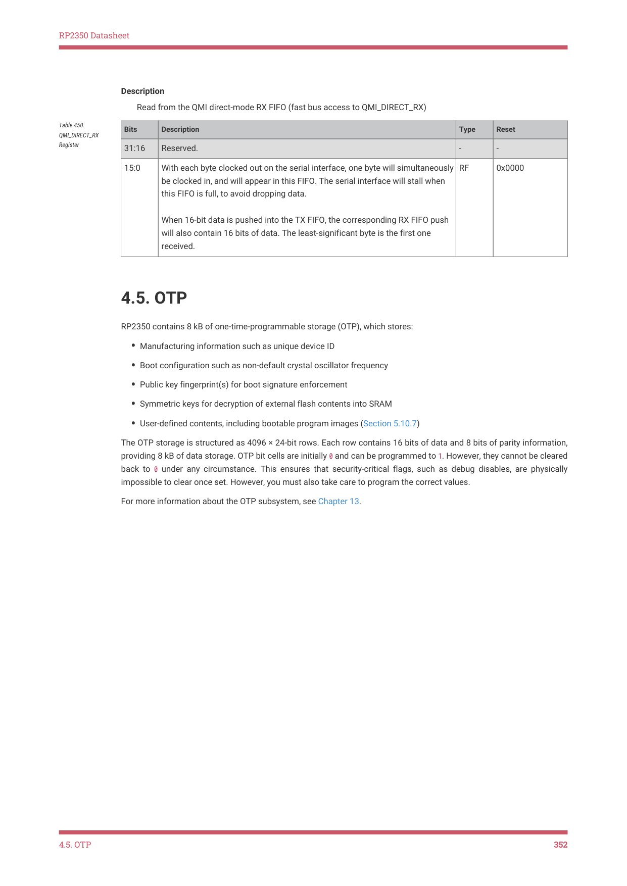

# 4.5. OTP

RP2350 Datasheet

Description

Read from the QMI direct-mode RX FIFO (fast bus access to QMI_DIRECT_RX)

| Bits | Description | Type | Reset |
| --- | --- | --- | --- |
| 31:16 | Reserved. | - | - |
| 15:0 | With each byte clocked out on the serial interface, one byte will simultaneously be clocked in, and will appear in this FIFO. The serial interface will stall when this FIFO is full, to avoid dropping data. When 16-bit data is pushed into the TX FIFO, the corresponding RX FIFO push will also contain 16 bits of data. The least-significant byte is the first one received. | RF | 0x0000 |

Table 450.

QMI_DIRECT_RX

Register

4.5. OTP

RP2350 contains 8 kB of one-time-programmable storage (OTP), which stores:

• Manufacturing information such as unique device ID
• Boot configuration such as non-default crystal oscillator frequency
• Public key fingerprint(s) for boot signature enforcement
• Symmetric keys for decryption of external flash contents into SRAM
• User-defined contents, including bootable program images (Section 5.10.7)

The OTP storage is structured as 4096 × 24-bit rows. Each row contains 16 bits of data and 8 bits of parity information,

providing 8 kB of data storage. OTP bit cells are initially 0 and can be programmed to 1. However, they cannot be cleared

back to 0 under any circumstance. This ensures that security-critical flags, such as debug disables, are physically

impossible to clear once set. However, you must also take care to program the correct values.

For more information about the OTP subsystem, see Chapter 13.

4.5. OTP
352
