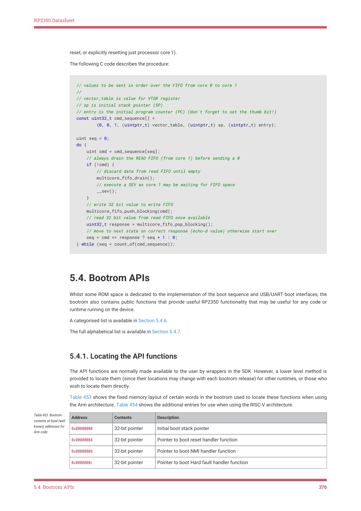

# 5.4.1. Locating the API functions

RP2350 Datasheet

reset, or explicitly resetting just processor core 1).

The following C code describes the procedure:

// values to be sent in order over the FIFO from core 0 to core 1

//

// vector_table is value for VTOR register

// sp is initial stack pointer (SP)

// entry is the initial program counter (PC) (don't forget to set the thumb bit!)

const uint32_t cmd_sequence[] =

        {0, 0, 1, (uintptr_t) vector_table, (uintptr_t) sp, (uintptr_t) entry};

uint seq = 0;

do {

    uint cmd = cmd_sequence[seq];

    // always drain the READ FIFO (from core 1) before sending a 0

    if (!cmd) {

        // discard data from read FIFO until empty

        multicore_fifo_drain();

        // execute a SEV as core 1 may be waiting for FIFO space

        __sev();

    }

    // write 32 bit value to write FIFO

    multicore_fifo_push_blocking(cmd);

    // read 32 bit value from read FIFO once available

    uint32_t response = multicore_fifo_pop_blocking();

    // move to next state on correct response (echo-d value) otherwise start over

    seq = cmd == response ? seq + 1 : 0;

} while (seq < count_of(cmd_sequence));

5.4. Bootrom APIs

Whilst some ROM space is dedicated to the implementation of the boot sequence and USB/UART boot interfaces, the

bootrom also contains public functions that provide useful RP2350 functionality that may be useful for any code or

runtime running on the device.

A categorised list is available in Section 5.4.6.

The full alphabetical list is available in Section 5.4.7.

5.4.1. Locating the API functions

The API functions are normally made available to the user by wrappers in the SDK. However, a lower level method is

provided to locate them (since their locations may change with each bootrom release) for other runtimes, or those who

wish to locate them directly.

Table 453 shows the fixed memory layout of certain words in the bootrom used to locate these functions when using

the Arm architecture. Table 454 shows the additional entries for use when using the RISC-V architecture.

| Address | Contents | Description |
| --- | --- | --- |
| 0x00000000 | 32-bit pointer | Initial boot stack pointer |
| 0x00000004 | 32-bit pointer | Pointer to boot reset handler function |
| 0x00000008 | 32-bit pointer | Pointer to boot NMI handler function |
| 0x0000000c | 32-bit pointer | Pointer to boot Hard fault handler function |

Table 453. Bootrom

contents at fixed (well

known) addresses for

Arm code

5.4. Bootrom APIs
376

RP2350 Datasheet

| Address | Contents | Description |
| --- | --- | --- |
| 0x00000010 | 'M', 'u', 0x02 | Magic |
| 0x00000013 | byte | Bootrom version |
| 0x00000014 | 16-bit pointer | Pointer to ROM entry table (BOOTROM ROMTABLE START) _ _ |
| 0x00000016 | 16-bit pointer | Pointer to a helper function (rom table lookup val()) _ _ _ |
| 0x00000018 | 16-bit pointer | Pointer to a helper function (rom table lookup entry()) _ _ _ |

| Address | Contents | Description |
| --- | --- | --- |
| 0x00007df6 | 16-bit pointer | Pointer to ROM entry table (BOOTROM ROMTABLE START) _ _ |
| 0x00007df8 | 16-bit pointer | Pointer to a helper function (rom table lookup val()) _ _ _ |
| 0x00007dfa | 16-bit pointer | Pointer to a helper function (rom table lookup entry()) _ _ _ |
| 0x00007dfc | 32-bit instruction | RISC-V Entry Point |

Table 454. Bootrom

contents at fixed (well

known) addresses for

RISC-V code

Assuming the three bytes starting at address 0x00000010 are ('M', 'u', 0x02), the other fixed location fields can be

assumed to be valid and used to lookup bootrom functionality.

The version byte at offset 0x00000013 is informational, and should not be used to infer the exact location of any

functions. It has the value 2 for A2 silicon.

The following code from the SDK shows how the SDK looks up a bootrom function:

static __force_inline void *rom_func_lookup_inline(uint32_t code) {

#ifdef __riscv

    // on RISC-V the code (a jmp) is actually embedded in the table

    rom_table_lookup_fn rom_table_lookup =

        (rom_table_lookup_fn) (uintptr_t)*(uint16_t*)(BOOTROM_TABLE_LOOKUP_ENTRY_OFFSET

        + rom_offset_adjust);

    return rom_table_lookup(code, RT_FLAG_FUNC_RISCV);

#else

    // on Arm the function pointer is stored in the table, so we dereference it

    // via lookup() rather than lookup_entry()

    rom_table_lookup_fn rom_table_lookup =

        (rom_table_lookup_fn) (uintptr_t)*(uint16_t*)(BOOTROM_TABLE_LOOKUP_OFFSET);

    if (pico_processor_state_is_nonsecure()) {

        return rom_table_lookup(code, RT_FLAG_FUNC_ARM_NONSEC);

    } else {

        return rom_table_lookup(code, RT_FLAG_FUNC_ARM_SEC);

    }

#endif

}

As well as API functions, there are a few data values that can be looked up. The following code demonstrates:

void *rom_data_lookup(uint32_t code) {

    rom_table_lookup_fn rom_table_lookup =

        (rom_table_lookup_fn) (uintptr_t)*(uint16_t*)(BOOTROM_TABLE_LOOKUP_OFFSET);

    return rom_table_lookup(code, RT_FLAG_DATA);

}

The code parameter correspond to the CODE values in the tables below, and is calculated as follows:

5.4. Bootrom APIs
377
