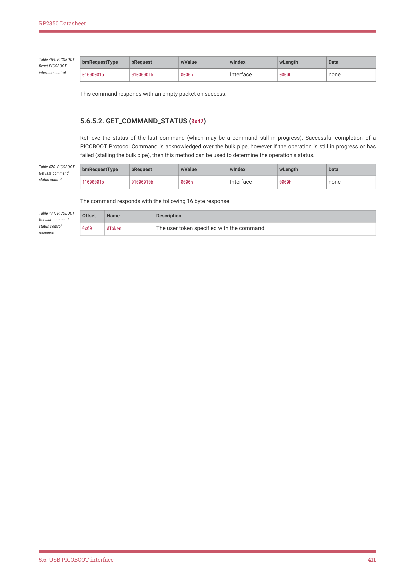

# 5.6.5. Control requests

RP2350 Datasheet

| Offset | Name | Value / Description |  |
| --- | --- | --- | --- |
| 0x08 | bCmdId | 0x8c (OTP READ) _ |  |
| 0x09 | bCmdSize | 0x05 |  |
| 0x0c | dTransferLength |  |  |
| 0x10 | wRow | the first row number to re | ad |
| 0x12 | wRowCount | the number of rows to rea | d |
| 0x14 | bEcc | • 0 - if reading raw row are zero) • 1 - if reading rows as | s (32 bits are returned per row, the top 8 of which ECC rows (16 bits per row are returned) |

Table 467. PICOBOOT

OTP_READ command

structure

5.6.4.13. OTP_WRITE (0x0d)

Reads data out of OTP. (see also otp_access() which performs the operation). Writing is subject to the "BL" OTP

permissions, which define bootloader OTP access permissions.

| Offset | Name | Value / Description |  |
| --- | --- | --- | --- |
| 0x08 | bCmdId | 0x0d (OTP WRITE) _ |  |
| 0x09 | bCmdSize | 0x05 |  |
| 0x0c | dTransferLength |  |  |
| 0x10 | wRow | the first row number to re | ad |
| 0x12 | wRowCount | the number of rows to rea | d |
| 0x14 | bEcc | • 0 - if writing raw row are ignored) • 1 - if writing ECC row error correcting infor | s (32 bits are provided per row, the top 8 of which s (16 bits are provided per row, and are written with mation to the OTP) |

Table 468. PICOBOOT

OTP_WRITE command

structure

5.6.5. Control requests

The following requests are sent to the interface via the default control pipe.

5.6.5.1. INTERFACE_RESET (0x41)

The host sends this control request to reset the PICOBOOT interface. This command:

• Clears the HALT condition (if set) on each of the bulk endpoints
• Aborts any in-process PICOBOOT or Mass Storage transfer and any flash write (this method is the only way to kill a

stuck flash transfer).
• Clears the previous command result
• Removes EXCLUSIVE_ACCESS and remounts the Mass Storage drive if it was ejected due to exclusivity.

5.6. USB PICOBOOT interface
410

RP2350 Datasheet

| bmRequestType | bRequest | wValue | wIndex | wLength | Data |
| --- | --- | --- | --- | --- | --- |
| 01000001b | 01000001b | 0000h | Interface | 0000h | none |

Table 469. PICOBOOT

Reset PICOBOOT

interface control

This command responds with an empty packet on success.

5.6.5.2. GET_COMMAND_STATUS (0x42)

Retrieve the status of the last command (which may be a command still in progress). Successful completion of a

PICOBOOT Protocol Command is acknowledged over the bulk pipe, however if the operation is still in progress or has

failed (stalling the bulk pipe), then this method can be used to determine the operation’s status.

| bmRequestType | bRequest | wValue | wIndex | wLength | Data |
| --- | --- | --- | --- | --- | --- |
| 11000001b | 01000010b | 0000h | Interface | 0000h | none |

Table 470. PICOBOOT

Get last command

status control

The command responds with the following 16 byte response

| Offset | Name | Description |  |
| --- | --- | --- | --- |
| 0x00 | dToken | The user token specified with | the command |

Table 471. PICOBOOT

Get last command

status control

response

5.6. USB PICOBOOT interface
411

## Embedded Images

